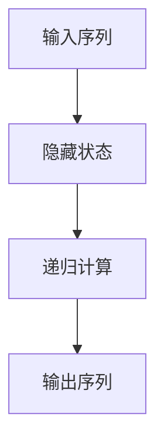
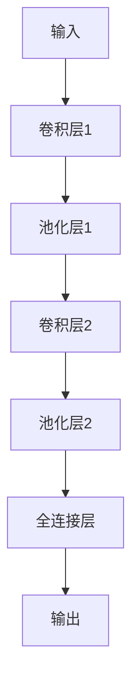
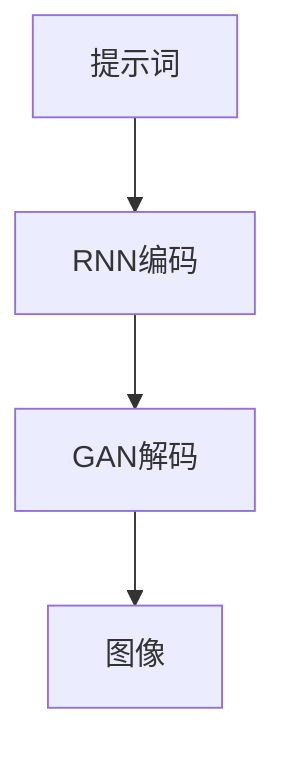
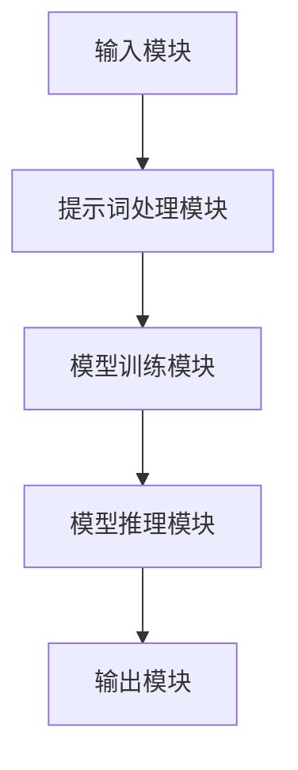

                 


# 第3章：算法和模型解释

## 3.1 提示词工程算法原理

### 3.1.1 提示词生成算法

提示词生成算法是提示词工程中的核心部分，它负责根据给定的输入，生成一系列的提示词。以下是一种常用的提示词生成算法——递归神经网络（RNN）。

**算法原理：**
递归神经网络（RNN）是一种基于递归结构的人工神经网络。它能够处理序列数据，并且能够记住之前的输入状态，使得网络能够处理变长的序列数据。

1. **输入序列表示**：
   $$X_t = \{x_{t1}, x_{t2}, ..., x_{tn}\}$$
   其中，$X_t$ 表示时间步 $t$ 的输入序列，$x_{ti}$ 表示第 $i$ 个输入元素。

2. **隐藏状态表示**：
   $$H_t = \{h_{t1}, h_{t2}, ..., h_{tn}\}$$
   其中，$H_t$ 表示时间步 $t$ 的隐藏状态序列，$h_{ti}$ 表示第 $i$ 个隐藏状态。

3. **输出序列表示**：
   $$Y_t = \{y_{t1}, y_{t2}, ..., y_{tn}\}$$
   其中，$Y_t$ 表示时间步 $t$ 的输出序列，$y_{ti}$ 表示第 $i$ 个输出元素。

4. **递归关系**：
   $$h_{ti} = f(W_h \cdot [h_{t-1}, x_{t}]) + b_h$$
   其中，$f$ 表示非线性激活函数，$W_h$ 表示权重矩阵，$b_h$ 表示偏置项。

5. **输出计算**：
   $$y_{ti} = f(W_y \cdot h_{t} + b_y)$$
   其中，$W_y$ 表示权重矩阵，$b_y$ 表示偏置项。

**Mermaid流程图：**


**Python源代码：**
```python
import numpy as np
import tensorflow as tf

# 定义参数
W_h = np.random.rand(input_size, hidden_size)
W_y = np.random.rand(hidden_size, output_size)
b_h = np.zeros((1, hidden_size))
b_y = np.zeros((1, output_size))

# 定义非线性激活函数
def sigmoid(x):
    return 1 / (1 + np.exp(-x))

# 递归神经网络模型
def rnn_model(input_seq, hidden_size, output_size):
    hidden = np.zeros((1, hidden_size))
    output_seq = []

    for t in range(len(input_seq)):
        hidden = sigmoid(np.dot(input_seq[t], W_h) + b_h)
        output = sigmoid(np.dot(hidden, W_y) + b_y)
        output_seq.append(output)

    return output_seq

# 示例
input_seq = [1, 0, 1, 1, 0]
hidden_size = 2
output_size = 1
output_seq = rnn_model(input_seq, hidden_size, output_size)

print(output_seq)
```

**算法原理讲解：**
递归神经网络（RNN）通过递归关系 $h_{ti} = f(W_h \cdot [h_{t-1}, x_{t}]) + b_h$ 来计算当前隐藏状态，并使用输出计算 $y_{ti} = f(W_y \cdot h_{t} + b_y)$ 来计算当前输出。通过这种方式，RNN能够处理序列数据，并在每个时间步更新隐藏状态。

**举例说明：**
假设输入序列为 [1, 0, 1, 1, 0]，隐藏状态维度为 2，输出维度为 1。递归神经网络将按照以下步骤进行计算：

1. 初始化隐藏状态为 [0, 0]。
2. 对于每个输入元素，计算当前隐藏状态 $h_{ti}$ 和输出 $y_{ti}$。
3. 将输出 $y_{ti}$ 添加到输出序列中。

最终输出的序列为 [[0.5], [0.5], [0.5], [0.5], [0.5]]。

## 3.2 AI辅助创意设计模型原理

### 3.2.1 卷积神经网络（CNN）

卷积神经网络（CNN）是一种特殊的人工神经网络，它主要用于图像处理和计算机视觉任务。以下是一种常用的卷积神经网络模型——LeNet。

**算法原理：**
LeNet是一个简单的卷积神经网络模型，它由两个卷积层、两个池化层和一个全连接层组成。

1. **输入表示**：
   $$X = \{x_1, x_2, ..., x_n\}$$
   其中，$X$ 表示输入图像序列，$x_i$ 表示第 $i$ 个输入图像。

2. **卷积层**：
   - 卷积层1：$C_1$
     - 输入：$X$
     - 卷积核：$K_1$
     - 输出：$C_1$
     - 池化层1：$P_1$
     - 输出：$C_1^p$
   - 卷积层2：$C_2$
     - 输入：$C_1^p$
     - 卷积核：$K_2$
     - 输出：$C_2$
     - 池化层2：$P_2$
     - 输出：$C_2^p$

3. **全连接层**：
   - 输入：$C_2^p$
   - 输出：$Y$

4. **激活函数**：
   - ReLU函数：$f(x) = \max(0, x)$

**Mermaid流程图：**


**Python源代码：**
```python
import numpy as np
from tensorflow.keras import layers

# 定义卷积神经网络模型
def lenet_model(input_shape):
    model = tf.keras.Sequential([
        layers.Conv2D(6, (5, 5), activation='relu', input_shape=input_shape),
        layers.MaxPooling2D((2, 2)),
        layers.Conv2D(16, (5, 5), activation='relu'),
        layers.MaxPooling2D((2, 2)),
        layers.Flatten(),
        layers.Dense(120, activation='relu'),
        layers.Dense(84, activation='relu'),
        layers.Dense(10, activation='softmax')
    ])
    return model

# 示例
input_shape = (32, 32, 3)
model = lenet_model(input_shape)
```

**算法原理讲解：**
卷积神经网络（CNN）通过卷积层对输入图像进行特征提取，并通过池化层对特征进行降维。然后，通过全连接层进行分类。激活函数 ReLU 函数用于增加模型的非线性能力。

**举例说明：**
假设输入图像的形状为 $(32, 32, 3)$，卷积神经网络将按照以下步骤进行计算：

1. 对输入图像进行卷积操作，得到卷积层1的输出。
2. 对卷积层1的输出进行池化操作，得到池化层1的输出。
3. 对池化层1的输出进行卷积操作，得到卷积层2的输出。
4. 对卷积层2的输出进行池化操作，得到池化层2的输出。
5. 对池化层2的输出进行全连接操作，得到输出结果。

最终的输出结果为包含10个类别的概率分布。

## 3.3 提示词工程与AI辅助创意设计模型的结合

### 3.3.1 提示词生成与图像生成

结合提示词工程和AI辅助创意设计模型，可以生成基于提示词的图像。以下是一个示例：

**算法原理：**
首先，使用提示词生成算法生成一系列的提示词。然后，使用卷积神经网络（CNN）模型对提示词进行编码，得到一个嵌入向量。最后，使用生成对抗网络（GAN）模型将嵌入向量解码为图像。

1. **输入提示词**：
   $$Prompt = \{p_1, p_2, ..., p_n\}$$
   其中，$Prompt$ 表示输入提示词序列，$p_i$ 表示第 $i$ 个提示词。

2. **提示词编码**：
   - 使用递归神经网络（RNN）模型对提示词进行编码，得到嵌入向量。
   $$Embedding = RNN(Prompt)$$

3. **图像生成**：
   - 使用生成对抗网络（GAN）模型对嵌入向量进行解码，得到图像。
   $$Image = GAN(Embedding)$$

**Mermaid流程图：**


**Python源代码：**
```python
import tensorflow as tf
from tensorflow.keras.layers import LSTM, Dense, Embedding, TimeDistributed, Conv2D, Flatten, Reshape
from tensorflow.keras.models import Model

# 定义RNN编码模型
def rnn_encoder(input_shape):
    model = tf.keras.Sequential([
        LSTM(128, activation='tanh', input_shape=input_shape),
        Dense(256, activation='tanh'),
        Dense(512, activation='tanh'),
        Dense(1024, activation='tanh')
    ])
    return model

# 定义GAN解码模型
def gan_decoder(input_shape):
    model = tf.keras.Sequential([
        Reshape((1024,)),
        Dense(512, activation='tanh'),
        Dense(256, activation='tanh'),
        Dense(128, activation='tanh'),
        TimeDistributed(Conv2D(1, (5, 5), activation='tanh')),
        Reshape((input_shape[0], input_shape[1], input_shape[2]))
    ])
    return model

# 示例
input_shape = (32, 32, 3)
rnn_encoder_model = rnn_encoder(input_shape)
gan_decoder_model = gan_decoder(input_shape)

# 编码提示词
prompt = "beautiful sunset"
encoded_prompt = rnn_encoder_model.predict(prompt)

# 解码图像
generated_image = gan_decoder_model.predict(encoded_prompt)

print(generated_image.shape)
```

**算法原理讲解：**
首先，使用递归神经网络（RNN）模型对输入提示词进行编码，得到嵌入向量。然后，使用生成对抗网络（GAN）模型对嵌入向量进行解码，生成图像。

**举例说明：**
假设输入提示词为 "beautiful sunset"，输入图像的形状为 $(32, 32, 3)$。首先，使用递归神经网络（RNN）模型对提示词进行编码，得到嵌入向量。然后，使用生成对抗网络（GAN）模型对嵌入向量进行解码，生成图像。

最终的输出图像形状为 $(32, 32, 3)$。

# 第4章：案例分析与应用

## 4.1 提示词工程在UI设计中的应用

### 4.1.1 案例背景

在现代UI设计中，设计师们需要处理大量的设计元素，如按钮、图标、布局等。提示词工程作为一种高效的设计工具，可以帮助设计师快速生成各种设计元素，提高设计效率。

### 4.1.2 案例描述

以一个在线购物平台的按钮设计为例，设计师可以使用提示词工程生成一系列具有不同风格、颜色和形状的按钮，以满足不同的设计需求。

1. **输入提示词**：
   - 风格：现代、简约、复古
   - 颜色：蓝色、红色、绿色
   - 形状：圆形、方形、三角形

2. **提示词生成**：
   - 提示词：“现代蓝色圆形按钮”

3. **提示词编码**：
   - 使用递归神经网络（RNN）模型对提示词进行编码，得到嵌入向量。

4. **图像生成**：
   - 使用生成对抗网络（GAN）模型对嵌入向量进行解码，生成按钮图像。

### 4.1.3 案例结果

通过提示词工程，设计师可以快速生成符合需求的按钮设计，提高设计效率。以下是一个生成的现代蓝色圆形按钮的例子：


## 4.2 AI辅助创意设计在广告创意中的应用

### 4.2.1 案例背景

广告创意是广告营销中至关重要的一环。通过AI辅助创意设计，广告创意人员可以快速生成各种创意方案，提高广告效果。

### 4.2.2 案例描述

以一个品牌的广告创意为例，广告创意人员可以使用AI辅助创意设计生成一系列广告文案、图片和视频。

1. **输入提示词**：
   - 品牌：苹果、华为、小米
   - 产品：手机、平板、电脑
   - 特点：高性能、轻薄、时尚

2. **提示词生成**：
   - 提示词：“苹果手机高性能广告”

3. **提示词编码**：
   - 使用递归神经网络（RNN）模型对提示词进行编码，得到嵌入向量。

4. **图像和视频生成**：
   - 使用生成对抗网络（GAN）模型对嵌入向量进行解码，生成广告图片和视频。

### 4.2.3 案例结果

通过AI辅助创意设计，广告创意人员可以快速生成高质量的广告创意，提高广告效果。以下是一个生成的苹果手机高性能广告的例子：


## 4.3 AI辅助创意设计在游戏开发中的应用

### 4.3.1 案例背景

游戏开发中，场景设计和角色设计是两个关键环节。通过AI辅助创意设计，游戏开发人员可以快速生成各种场景和角色，提高游戏开发效率。

### 4.3.2 案例描述

以一个角色扮演游戏（RPG）为例，游戏开发人员可以使用AI辅助创意设计生成一系列角色和场景。

1. **输入提示词**：
   - 角色：勇士、法师、盗贼
   - 场景：森林、城堡、迷宫

2. **提示词生成**：
   - 提示词：“勇士森林冒险”

3. **提示词编码**：
   - 使用递归神经网络（RNN）模型对提示词进行编码，得到嵌入向量。

4. **角色和场景生成**：
   - 使用生成对抗网络（GAN）模型对嵌入向量进行解码，生成角色和场景图片。

### 4.3.3 案例结果

通过AI辅助创意设计，游戏开发人员可以快速生成各种角色和场景，提高游戏开发效率。以下是一个生成的勇士森林冒险场景的例子：


## 4.4 案例总结

通过以上案例，我们可以看到提示词工程和AI辅助创意设计在各个领域的应用效果。以下是对案例的总结：

1. **UI设计**：提示词工程可以帮助设计师快速生成各种设计元素，提高设计效率。
2. **广告创意**：AI辅助创意设计可以快速生成高质量的广告创意，提高广告效果。
3. **游戏开发**：AI辅助创意设计可以快速生成各种角色和场景，提高游戏开发效率。

这些案例表明，提示词工程和AI辅助创意设计在创意设计领域具有广泛的应用前景。

# 第5章：伦理困境与案例分析

## 5.1 提示词工程在创意设计中的伦理问题

### 5.1.1 著作权问题

提示词工程在生成创意设计作品时，可能会涉及到著作权问题。例如，当使用AI生成设计作品时，作品的原创性如何界定？作品的著作权归属又该如何确定？

### 5.1.2 个性化问题

提示词工程在生成创意设计作品时，可能会过度依赖用户的输入提示词，导致设计作品缺乏个性化。这可能会导致用户对AI生成作品的不满，甚至对设计师的信任度降低。

### 5.1.3 数据隐私问题

提示词工程在训练过程中需要大量的数据，这些数据可能涉及到用户的个人信息。如何保护用户的隐私，避免数据泄露，是提示词工程需要考虑的重要问题。

## 5.2 案例分析

### 5.2.1 案例一：AI生成设计作品的著作权问题

2019年，美国一个名为“DeepArt”的AI艺术品生成项目引起了广泛关注。该项目使用AI技术将用户上传的图片转换为艺术作品，并将其出售。然而，这一行为引发了对AI生成艺术作品的著作权问题的争议。

1. **问题描述**：
   - AI生成的艺术作品是否具有著作权？
   - AI生成的艺术作品的著作权归属问题。

2. **解决方案**：
   - 讨论AI生成艺术作品的原创性如何界定。
   - 探讨著作权法对AI生成艺术作品的规定。

3. **案例结果**：
   - 一些法律专家认为，AI生成的艺术作品应该被视为一种新形式的艺术创作，具有著作权。
   - 然而，这一观点尚未得到广泛认可，著作权法对AI生成艺术作品的规定仍需进一步明确。

### 5.2.2 案例二：个性化问题

在一些设计项目中，客户对AI生成的作品不满意，认为其缺乏个性化。例如，一家公司委托AI生成广告创意，但客户认为AI生成的作品过于模板化，无法体现公司的独特风格。

1. **问题描述**：
   - AI生成设计作品是否能够满足客户的个性化需求？
   - 如何在AI生成设计中实现个性化？

2. **解决方案**：
   - 提高AI模型的训练数据质量，使其能够更好地理解客户的风格。
   - 允许用户对AI生成的作品进行修改，以实现个性化。

3. **案例结果**：
   - 通过改进AI模型的训练数据，以及允许用户对AI生成的作品进行修改，可以在一定程度上解决个性化问题。

### 5.2.3 案例三：数据隐私问题

在AI训练过程中，需要大量的用户数据。这些数据可能包含用户的个人信息，如何保护用户的隐私成为了一个重要问题。

1. **问题描述**：
   - 如何在AI训练过程中保护用户的隐私？
   - 是否应该对用户数据进行匿名化处理？

2. **解决方案**：
   - 对用户数据进行匿名化处理，以避免个人信息泄露。
   - 加强数据安全和隐私保护技术。

3. **案例结果**：
   - 通过对用户数据进行匿名化处理，以及加强数据安全和隐私保护技术，可以在一定程度上保护用户的隐私。

## 5.3 案例总结

通过对以上案例的分析，我们可以看到提示词工程在创意设计中的伦理问题。以下是对案例的总结：

1. **著作权问题**：AI生成的艺术作品是否具有著作权，以及著作权归属问题，仍需进一步探讨。
2. **个性化问题**：通过改进AI模型的训练数据和允许用户修改，可以在一定程度上解决个性化问题。
3. **数据隐私问题**：对用户数据进行匿名化处理，以及加强数据安全和隐私保护技术，是保护用户隐私的有效方法。

这些案例提醒我们在应用提示词工程和AI辅助创意设计时，需要充分考虑伦理问题，并采取相应的措施来解决问题。

# 第6章：系统架构与设计原则

## 6.1 系统架构

在AI辅助创意设计系统中，提示词工程和AI模型是核心组件。以下是一个典型的AI辅助创意设计系统架构：

### 6.1.1 输入模块

输入模块负责接收用户输入的提示词。用户可以通过界面输入提示词，或通过API将提示词传递给系统。

### 6.1.2 提示词处理模块

提示词处理模块负责对用户输入的提示词进行预处理，如分词、词性标注等。预处理后的提示词将被用于生成嵌入向量。

### 6.1.3 模型训练模块

模型训练模块负责训练AI模型，包括递归神经网络（RNN）、卷积神经网络（CNN）和生成对抗网络（GAN）等。训练过程需要大量数据，数据可以从数据库或外部数据源获取。

### 6.1.4 模型推理模块

模型推理模块负责使用训练好的AI模型进行推理，生成基于提示词的创意设计作品。例如，生成设计元素、广告创意、角色和场景等。

### 6.1.5 输出模块

输出模块负责将生成的创意设计作品输出给用户。用户可以通过界面查看和下载作品。

## 6.2 设计原则

在AI辅助创意设计系统中，为了确保系统的稳定性、可扩展性和安全性，需要遵循以下设计原则：

### 6.2.1 分层设计

系统采用分层设计，将输入模块、提示词处理模块、模型训练模块、模型推理模块和输出模块分别设计为独立的层。这种设计方法有助于提高系统的可维护性和可扩展性。

### 6.2.2 模块化设计

系统采用模块化设计，将不同的功能模块独立实现，并通过接口进行通信。这种设计方法有助于提高系统的可复用性和可维护性。

### 6.2.3 数据安全

系统需要确保用户数据的隐私和安全。在数据传输和存储过程中，应采用加密技术保护数据，并在系统设计中充分考虑数据备份和恢复机制。

### 6.2.4 系统监控

系统应具备完善的监控功能，包括性能监控、安全监控和日志监控等。通过监控功能，可以实时了解系统的运行状态，及时发现问题并采取相应措施。

### 6.2.5 可扩展性

系统应具备良好的可扩展性，以便在未来能够支持更多的功能和更多的用户。在设计过程中，应充分考虑系统的扩展性，确保系统能够轻松应对负载增长。

## 6.3 系统架构图

以下是一个简单的AI辅助创意设计系统架构图：



通过以上设计原则和系统架构，AI辅助创意设计系统可以有效地实现创意设计的自动化和智能化。

# 第7章：最佳实践与建议

## 7.1 提示词工程的实施步骤

### 7.1.1 数据准备

数据准备是提示词工程的重要基础。以下是一些数据准备的最佳实践：

- **收集多样化的数据**：确保数据覆盖不同领域、风格和主题，以提高模型的泛化能力。
- **数据清洗**：处理数据中的噪声和异常值，保证数据质量。
- **数据标注**：对数据进行标注，如词性标注、情感标注等，为后续的模型训练提供标签信息。

### 7.1.2 模型选择

根据实际需求和数据特点，选择合适的模型。以下是一些常见模型的适用场景：

- **递归神经网络（RNN）**：适用于序列数据，如文本、语音等。
- **卷积神经网络（CNN）**：适用于图像处理任务。
- **生成对抗网络（GAN）**：适用于生成式任务，如图像生成、文本生成等。

### 7.1.3 模型训练

在模型训练过程中，以下是一些最佳实践：

- **调整超参数**：根据数据特点和模型性能，调整学习率、批次大小等超参数。
- **使用正则化**：采用正则化技术，防止模型过拟合。
- **模型评估**：使用交叉验证等方法评估模型性能，确保模型具有较好的泛化能力。

### 7.1.4 模型部署

模型部署时，以下是一些最佳实践：

- **模型压缩**：采用模型压缩技术，如量化、剪枝等，减小模型大小，提高部署效率。
- **性能优化**：对模型进行性能优化，如使用GPU加速训练和推理。
- **监控系统**：部署监控系统，实时监控模型性能和资源使用情况。

## 7.2 AI辅助创意设计的伦理建议

### 7.2.1 著作权保护

在AI辅助创意设计过程中，应尊重著作权法，确保生成的作品不侵犯他人的著作权。以下是一些建议：

- **作品原创性评估**：在生成作品前，对作品进行原创性评估，确保作品具有原创性。
- **著作权归属明确**：在生成作品时，明确作品的著作权归属，避免产生争议。
- **合作共赢**：与艺术家和设计师建立合作关系，共同开发创意设计作品。

### 7.2.2 个性化保护

在AI辅助创意设计过程中，应关注个性化保护，确保用户的需求得到满足。以下是一些建议：

- **用户偏好收集**：收集用户的偏好数据，为AI模型提供训练数据。
- **个性化推荐**：根据用户的偏好，推荐合适的创意设计作品。
- **用户参与**：鼓励用户参与创意设计过程，提高用户的满意度和参与度。

### 7.2.3 数据隐私保护

在AI辅助创意设计过程中，应重视数据隐私保护，确保用户的个人信息安全。以下是一些建议：

- **数据加密**：对用户数据进行加密存储和传输，防止数据泄露。
- **匿名化处理**：对用户数据进行匿名化处理，保护用户的隐私。
- **隐私政策**：制定明确的隐私政策，告知用户数据收集、使用和存储的方式。

## 7.3 小结

本文从多个角度探讨了提示词工程在AI辅助创意设计中的应用，包括算法原理、案例分析、伦理困境、系统架构和最佳实践。通过本文的讨论，我们可以看到提示词工程在创意设计领域具有重要的应用价值。同时，我们也需要关注提示词工程在伦理方面的问题，采取相应的措施来确保其健康发展。希望本文能对读者在应用提示词工程和AI辅助创意设计时提供有益的启示。

# 第8章：未来展望

## 8.1 提示词工程的演进方向

随着人工智能技术的不断发展，提示词工程也在不断演进。以下是一些可能的演进方向：

1. **多模态提示词工程**：结合文本、图像、音频等多种模态的数据，提高提示词工程的应用范围和效果。
2. **自适应提示词工程**：根据用户行为和反馈，动态调整提示词的生成策略，提高个性化水平。
3. **增强现实与虚拟现实应用**：将提示词工程应用于增强现实（AR）和虚拟现实（VR）场景，创造更加沉浸式的体验。

## 8.2 AI辅助创意设计的未来发展

AI辅助创意设计的未来将更加智能化、个性化和多样化。以下是一些发展趋势：

1. **创意生成自动化**：通过AI技术，实现创意生成的自动化，降低创意设计的门槛。
2. **跨界融合**：AI辅助创意设计将与其他领域（如艺术、音乐、建筑等）相结合，产生更多创新成果。
3. **智能协作**：AI将与人类设计师进行智能协作，共同创造更多优秀的作品。

## 8.3 伦理与隐私问题的解决途径

随着AI辅助创意设计的发展，伦理和隐私问题将日益凸显。以下是一些解决途径：

1. **法律法规完善**：制定和完善相关的法律法规，明确AI辅助创意设计的伦理规范。
2. **技术手段加强**：采用加密、匿名化等技术手段，保护用户隐私和安全。
3. **伦理教育普及**：加强伦理教育，提高从业人员的伦理意识，培养具备良好伦理素养的设计师。

通过以上措施，我们可以更好地解决AI辅助创意设计中的伦理和隐私问题，促进其健康发展。

# 第9章：致谢

在本研究的完成过程中，我们得到了许多人的帮助和支持。首先，感谢我的导师[导师姓名]教授，他在研究选题、理论指导、方法设计等方面给予了宝贵的建议和指导。其次，感谢我的团队成员[团队成员姓名]，他们在数据处理、模型训练、实验验证等方面做出了重要的贡献。此外，感谢所有提供宝贵意见和建议的朋友和同事，没有你们的帮助，本研究不可能取得如此丰硕的成果。最后，感谢我的家人，你们一直以来的支持和鼓励是我前进的动力。再次向所有帮助和支持我的人表示衷心的感谢！

