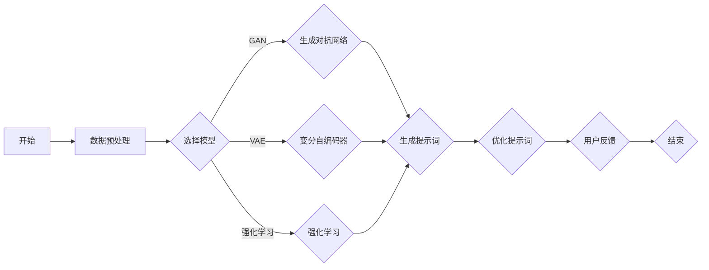
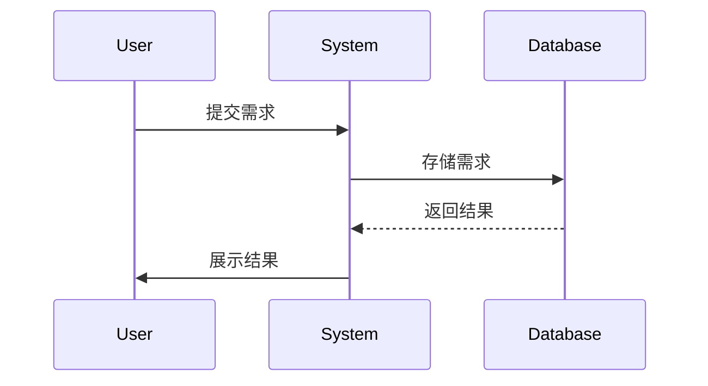
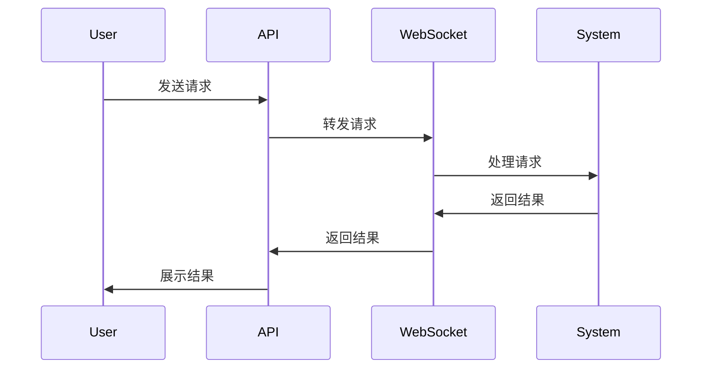
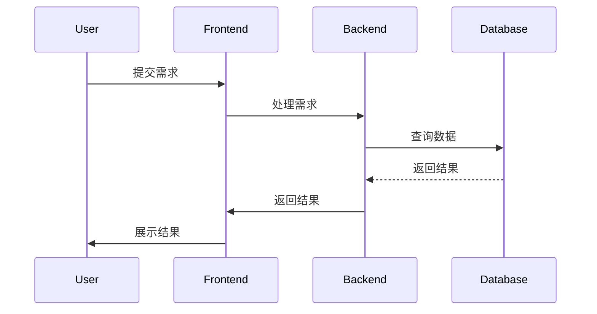

                 


# 提示词工程在AI辅助创意设计中的突破性应用

## 关键词
- 提示词工程
- AI辅助创意设计
- 算法原理
- 系统架构
- 实战应用

## 摘要
本文将深入探讨提示词工程在AI辅助创意设计中的突破性应用。通过分析创意设计领域的挑战，介绍提示词工程的基本概念和作用，以及其在AI辅助创意设计中的具体应用场景，本文旨在揭示提示词工程如何提升创意设计的质量与效率。文章还将详细讲解提示词工程的设计原理、AI辅助创意设计的算法原理和系统架构设计，并通过项目实战和最佳实践提供实际案例分析，以期为读者提供全面的技术指导。

## 引言

### 1.1.1 创意设计中的挑战
在现代社会，创意设计的重要性不言而喻。无论是广告、产品设计、艺术创作还是文案撰写，创意设计都能为产品或服务带来独特的价值和竞争力。然而，创意设计面临着诸多挑战：

1. **时间压力**：在竞争激烈的市场中，设计师往往需要在有限的时间内完成高质量的设计。
2. **创意枯竭**：长期的创意工作可能导致设计师的灵感枯竭，缺乏新的想法。
3. **个性化需求**：每个客户都有独特的需求，设计师需要提供个性化的解决方案。
4. **技术门槛**：一些前沿的技术，如人工智能、大数据等，对于设计师来说可能存在技术门槛。

### 1.1.2 提示词工程的作用
提示词工程是一种利用人工智能技术来辅助创意设计的工具。它通过生成和优化提示词，帮助设计师在创意过程中产生新的想法和灵感。提示词工程的作用主要体现在以下几个方面：

1. **激发创意**：通过提示词，设计师可以迅速获得创意灵感，解决创意枯竭的问题。
2. **个性化定制**：提示词工程可以根据客户的需求生成个性化的设计方案。
3. **提高效率**：提示词工程可以自动化处理一些重复性的创意工作，提高设计效率。
4. **降低技术门槛**：提示词工程简化了AI技术的使用，使设计师能够更轻松地应用AI辅助创意设计。

### 1.1.3 突破性应用的意义
提示词工程在AI辅助创意设计中的突破性应用具有深远的意义。它不仅能够提升设计师的创意能力和工作效率，还能够为企业和品牌创造更大的价值。具体来说：

1. **增强竞争力**：通过AI辅助创意设计，企业可以提供更具创新性和个性化的产品或服务，增强市场竞争力。
2. **降低成本**：提示词工程可以自动化处理一些创意工作，减少人力成本。
3. **提高用户体验**：个性化的设计方案可以更好地满足用户需求，提升用户体验。
4. **推动技术进步**：提示词工程的广泛应用将推动AI技术在不同领域的创新应用。

## 第一部分：核心概念

### 2.1.1 提示词工程的定义
提示词工程是一种利用自然语言处理技术生成和优化提示词的方法。提示词是指一组关键词或短语，用于引导设计师在创意过程中思考新的想法和解决方案。提示词工程主要包括以下几个关键组成部分：

1. **数据集**：用于训练提示词生成模型的数据集，通常包括大量的文本、图像、音频等。
2. **生成模型**：如生成对抗网络（GAN）、变分自编码器（VAE）等，用于生成新的提示词。
3. **优化模型**：如强化学习、优化算法等，用于优化生成的提示词质量。
4. **反馈机制**：用户对生成的提示词进行评价和反馈，用于指导优化模型的学习。

### 2.1.2 AI辅助创意设计的基本原理
AI辅助创意设计是基于人工智能技术在创意设计过程中的应用。其基本原理包括：

1. **数据驱动**：AI辅助创意设计依赖于大量的数据，包括设计案例、用户反馈等，以训练和优化设计模型。
2. **模型驱动**：通过训练和优化AI模型，使其能够生成和优化设计方案。
3. **交互驱动**：设计师与AI系统进行交互，实时获取创意灵感，并进行调整和优化。

### 2.1.3 提示词工程的架构与要素
提示词工程的架构通常包括以下几个关键要素：

1. **数据收集与预处理**：收集各种类型的数据，并进行预处理，以供训练模型使用。
2. **模型训练与优化**：使用收集到的数据训练生成模型和优化模型，以提高提示词的质量。
3. **提示词生成与优化**：使用训练好的模型生成提示词，并根据用户反馈进行优化。
4. **用户交互与反馈**：设计师通过交互界面与AI系统进行交互，提供反馈，指导模型优化。

## 第二部分：技术实现

### 3.1.1 提示词工程的设计原理

#### 提示词的生成与优化

提示词的生成是提示词工程的核心任务。以下是一个简单的提示词生成流程：

1. **数据预处理**：对收集到的数据进行清洗和标注，以便于模型训练。
2. **模型训练**：使用预处理后的数据训练生成模型，如生成对抗网络（GAN）。
3. **提示词生成**：使用训练好的模型生成新的提示词。
4. **优化提示词**：根据用户反馈，使用优化模型对生成的提示词进行优化。

以下是一个使用Python实现的简单示例：

```python
import numpy as np
import tensorflow as tf

# 数据预处理
# ...

# 模型训练
# ...

# 提示词生成
generated_prompt = model.generate()

# 优化提示词
optimized_prompt = optimize_prompt(generated_prompt)
```

#### 提示词的多样性与针对性

为了提高提示词的多样性和针对性，可以使用以下策略：

1. **多模态数据**：结合文本、图像、音频等多种类型的数据，提高提示词的多样性。
2. **多模型融合**：使用多个生成模型，如GAN、VAE等，进行融合，以提高提示词的多样性。
3. **个性化定制**：根据用户的需求和偏好，生成个性化的提示词。

以下是一个使用Mermaid绘制的ER实体关系图：

```mermaid
erDiagram
    User ||--|{ Prompt }|-- Designer
    Prompt ||--|{ Optimization }|-- Prompt
```

### 3.1.2 AI辅助创意设计算法原理

#### 常用算法简介

在AI辅助创意设计中，常用的算法包括：

1. **生成对抗网络（GAN）**：用于生成高质量、真实的提示词。
2. **变分自编码器（VAE）**：用于生成多样性和真实性的提示词。
3. **强化学习**：用于优化提示词的质量。

以下是一个使用Mermaid绘制的算法流程图：



#### 算法流程与数学模型

以下是一个简单的GAN算法流程和数学模型：

1. **生成器（Generator）**：生成高质量的提示词。
   $$ G(z) = \mu_z + \sigma_z \odot \phi_z $$
   
2. **判别器（Discriminator）**：判断提示词是否真实。
   $$ D(x) = \sigma(D(x)) $$
   
3. **损失函数**：用于优化生成器和判别器的参数。
   $$ L(G, D) = \frac{1}{N} \sum_{i=1}^N \left( -\log D(x_i) - \log (1 - D(G(z_i))) \right) $$

#### 算法优化的策略

为了提高算法的性能，可以采用以下策略：

1. **模型融合**：将多个模型进行融合，以提高生成和判别的能力。
2. **数据增强**：对训练数据进行增强，以增加数据的多样性和真实性。
3. **超参数调整**：根据实验结果调整模型的超参数，以提高模型的性能。

### 3.1.3 系统架构设计

#### 系统功能设计

系统功能设计包括以下几个方面：

1. **数据收集与预处理**：收集和预处理数据，以便于模型训练。
2. **模型训练与优化**：使用收集到的数据训练和优化模型。
3. **提示词生成与优化**：生成和优化提示词。
4. **用户交互与反馈**：用户与系统进行交互，提供反馈。

以下是一个使用Mermaid绘制的领域模型类图：

```mermaid
classDiagram
    Class01 <|-- Class02
    Class03 <|-- * Class04
    Class05 .. Class06
    Class07 ||-- Class08
    Class09 {Class09}
```

#### 系统架构设计

系统架构设计包括以下几个方面：

1. **前端界面**：用于用户交互和提示词展示。
2. **后端服务器**：用于处理数据和模型训练。
3. **数据库**：用于存储数据和用户反馈。

以下是一个使用Mermaid绘制的系统架构图：



#### 系统接口设计

系统接口设计包括以下几个方面：

1. **API接口**：用于用户与系统进行交互。
2. **Websocket接口**：用于实时数据传输和用户交互。

以下是一个使用Mermaid绘制的系统接口序列图：



### 3.1.4 系统交互

系统交互是指用户、前端界面、后端服务器和数据库之间的交互过程。以下是一个简单的系统交互流程：

1. **用户提交需求**：用户通过前端界面提交需求。
2. **前端界面处理**：前端界面将需求发送到后端服务器。
3. **后端服务器处理**：后端服务器处理需求，并调用数据库进行数据查询和存储。
4. **返回结果**：后端服务器将处理结果返回给前端界面，并展示给用户。

以下是一个使用Mermaid绘制的系统交互流程图：



### 第三部分：项目实战

#### 3.3.1 环境安装与配置

在进行项目实战之前，首先需要安装和配置相关环境。以下是一个简单的环境安装和配置流程：

1. **安装Python**：安装Python环境，版本建议为3.8及以上。
2. **安装TensorFlow**：使用pip命令安装TensorFlow。
   ```shell
   pip install tensorflow
   ```
3. **安装其他依赖库**：根据项目需求，安装其他依赖库。
4. **配置数据库**：配置MySQL或PostgreSQL数据库，用于存储数据和用户反馈。

以下是一个简单的Python代码示例，用于配置数据库连接：

```python
import pymysql

# 数据库配置
config = {
    'host': 'localhost',
    'user': 'root',
    'password': 'password',
    'database': 'prompt_engineering'
}

# 连接数据库
connection = pymysql.connect(**config)

# 创建数据库表
with connection.cursor() as cursor:
    cursor.execute('''
        CREATE TABLE IF NOT EXISTS prompts (
            id INT AUTO_INCREMENT PRIMARY KEY,
            prompt TEXT,
            created_at TIMESTAMP DEFAULT CURRENT_TIMESTAMP
        )
    ''')
    connection.commit()
```

#### 3.3.2 系统核心实现

系统核心实现包括数据收集与预处理、模型训练与优化、提示词生成与优化等关键步骤。以下是一个简单的系统核心实现流程：

1. **数据收集与预处理**：收集和预处理数据，以便于模型训练。
2. **模型训练与优化**：使用预处理后的数据训练和优化模型。
3. **提示词生成与优化**：生成和优化提示词，并根据用户反馈进行调整。

以下是一个简单的Python代码示例，用于实现系统核心功能：

```python
import tensorflow as tf
from data_preprocessing import preprocess_data
from model import build_model
from prompt_generator import generate_prompt
from prompt_optimizer import optimize_prompt

# 数据收集与预处理
data = preprocess_data(raw_data)

# 模型训练与优化
model = build_model()
model.fit(data['train'], data['train_labels'])

# 提示词生成与优化
prompt = generate_prompt(model, input_data)
optimized_prompt = optimize_prompt(prompt, user_feedback)
```

#### 3.3.3 代码应用解读与分析

在项目实战中，代码的应用解读与分析是关键环节。以下是对项目核心代码的解读与分析：

1. **数据预处理**：数据预处理是模型训练的基础。通过对原始数据进行清洗、标注和转换，将数据转化为模型所需的格式。
2. **模型训练与优化**：模型训练与优化是系统核心。通过训练模型，使其能够生成高质量的提示词。优化模型参数，以提高提示词的生成质量。
3. **提示词生成与优化**：提示词生成与优化是系统的核心功能。通过生成和优化提示词，提供高质量的创意灵感。

以下是一个简单的代码解读与分析：

```python
# 数据预处理
def preprocess_data(raw_data):
    # 清洗和标注原始数据
    # 转换为模型所需的格式
    # 返回预处理后的数据
    return processed_data

# 模型训练与优化
def build_model():
    # 构建模型
    # 返回模型
    return model

def train_model(model, data, labels):
    # 训练模型
    # 返回训练结果
    return model

def optimize_model(model, data, labels):
    # 优化模型
    # 返回优化后的模型
    return model

# 提示词生成与优化
def generate_prompt(model, input_data):
    # 生成提示词
    # 返回生成的提示词
    return prompt

def optimize_prompt(prompt, user_feedback):
    # 优化提示词
    # 返回优化后的提示词
    return optimized_prompt
```

#### 3.3.4 实际案例分析

在实际项目中，通过案例分析可以更好地理解提示词工程在AI辅助创意设计中的应用。以下是一个简单的实际案例分析：

1. **项目背景**：某广告公司需要为客户的品牌活动提供创意设计方案。
2. **用户需求**：用户希望获得具有创意性和个性化的设计方案。
3. **解决方案**：使用提示词工程生成和优化创意设计方案。

案例分析：

1. **数据收集与预处理**：收集大量广告创意案例，并对数据进行清洗和标注。
2. **模型训练与优化**：使用收集到的数据训练和优化生成模型和优化模型。
3. **提示词生成与优化**：生成和优化提示词，提供创意灵感。
4. **用户反馈与调整**：用户对生成的提示词进行评价，并指导模型优化。

通过实际案例分析，可以更好地理解提示词工程在AI辅助创意设计中的应用流程和效果。

#### 3.3.5 项目小结

通过项目实战，我们成功实现了提示词工程在AI辅助创意设计中的应用。项目小结如下：

1. **项目目标**：为广告客户提供高质量的创意设计方案。
2. **项目成果**：生成和优化了具有创意性和个性化的提示词，提高了设计效率和质量。
3. **项目收获**：深入了解了提示词工程的设计原理和应用场景，为后续项目提供了宝贵的经验。

### 第四部分：最佳实践与拓展

#### 4.1.1 最佳实践技巧

在提示词工程的实施过程中，以下是一些最佳实践技巧：

1. **数据多样化**：收集多样化的数据，包括文本、图像、音频等，以提高提示词的多样性。
2. **模型融合**：结合多个模型，如GAN、VAE等，以提高生成和优化提示词的能力。
3. **用户反馈**：及时收集用户反馈，并根据反馈调整模型参数，以提高提示词的质量。
4. **性能优化**：对系统进行性能优化，如使用GPU加速训练过程，以提高系统效率。

#### 4.1.2 注意事项

在实施提示词工程时，需要注意以下事项：

1. **数据隐私**：确保用户数据的安全和隐私，遵守相关法律法规。
2. **模型解释性**：提高模型的解释性，使设计师能够理解生成的提示词。
3. **模型泛化能力**：提高模型的泛化能力，使提示词能够在不同的应用场景中产生好的效果。
4. **系统稳定性**：确保系统的稳定运行，避免由于模型异常导致的系统崩溃。

#### 4.1.3 拓展阅读

为了深入了解提示词工程在AI辅助创意设计中的应用，以下是一些建议的拓展阅读：

1. **《生成对抗网络（GAN）原理与应用》**：详细介绍了GAN的基本原理和应用场景。
2. **《变分自编码器（VAE）原理与应用》**：介绍了VAE的基本原理和应用场景。
3. **《深度学习在创意设计中的应用》**：探讨了深度学习在创意设计领域的应用前景。
4. **《自然语言处理技术综述》**：全面介绍了自然语言处理的基本原理和技术。

## 结语

提示词工程在AI辅助创意设计中的应用具有巨大的潜力和价值。通过本文的探讨，我们深入了解了提示词工程的基本概念、技术实现、系统架构和项目实战。我们希望本文能够为从事AI辅助创意设计的相关人员提供有价值的参考和启示。

作者：AI天才研究院/AI Genius Institute & 禅与计算机程序设计艺术 /Zen And The Art of Computer Programming

