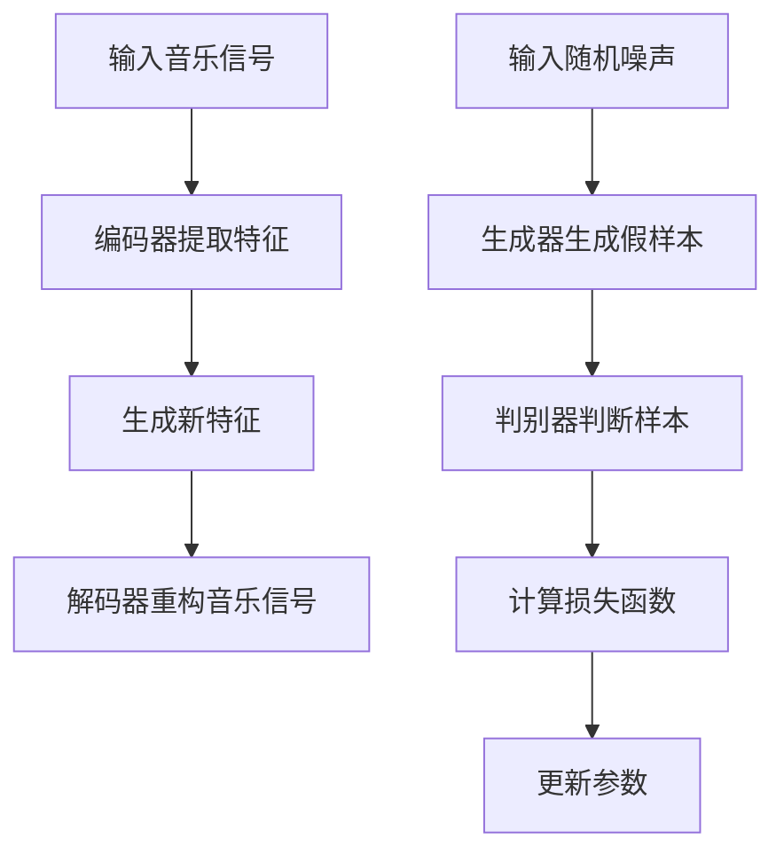
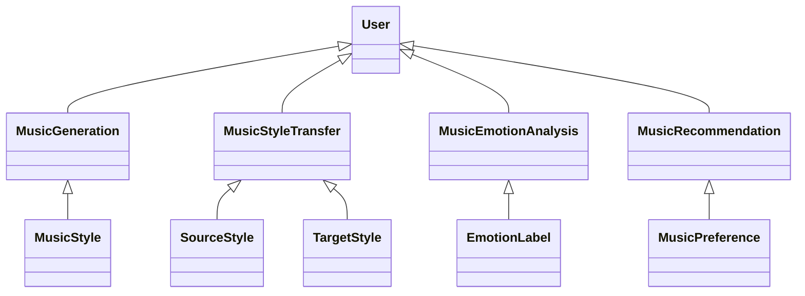
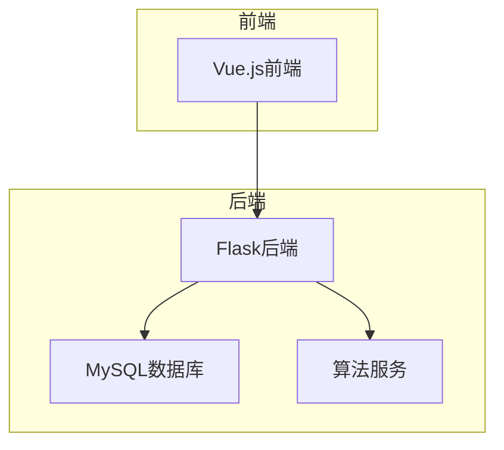
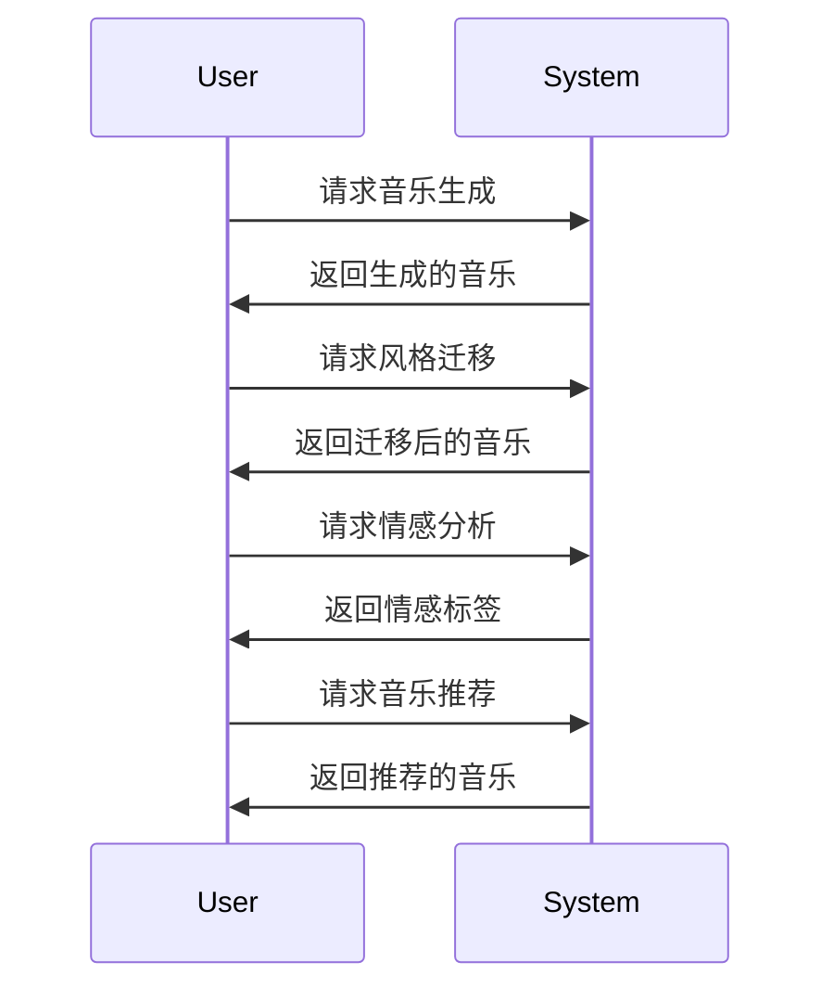

                 

# 提示词工程在AI辅助创意音乐创作中的创新

> 关键词：AI辅助音乐创作，提示词工程，算法原理，实践应用，最佳实践

> 摘要：本文深入探讨了AI辅助创意音乐创作中的提示词工程，分析了其背景、原理和应用。通过详细的案例分析，本文揭示了提示词工程在音乐创作中的创新性作用，并提出了最佳实践和注意事项，为AI音乐创作的未来发展提供了有益的启示。

## 目录大纲

### 第一部分：背景介绍

#### 第1章：AI辅助创意音乐创作背景

##### 1.1 问题的提出

##### 1.2 AI辅助创意音乐创作的概念与边界

##### 1.3 核心概念与要素组成

##### 1.4 概念结构与联系

### 第二部分：AI辅助创意音乐创作原理

#### 第2章：AI辅助创意音乐创作的算法原理

##### 2.1 算法简介

##### 2.2 算法流程图

##### 2.3 数学模型与公式

##### 2.4 算法举例说明

### 第三部分：AI辅助创意音乐创作的应用

#### 第3章：AI辅助创意音乐创作实践

##### 3.1 项目介绍

##### 3.2 系统功能设计

##### 3.3 系统架构设计

##### 3.4 系统接口设计与交互

#### 第4章：AI辅助创意音乐创作项目实战

##### 4.1 环境安装与配置

##### 4.2 系统核心实现源代码

##### 4.3 代码应用解读与分析

##### 4.4 实际案例分析与讲解

#### 第5章：AI辅助创意音乐创作的最佳实践与注意事项

##### 5.1 最佳实践 tips

##### 5.2 小结与展望

##### 5.3 注意事项

##### 5.4 拓展阅读

### 目录小结

本文目录旨在全面覆盖AI辅助创意音乐创作中的提示词工程的各个核心内容，包括背景介绍、算法原理讲解、应用实践以及最佳实践。每个章节都经过精心设计，以确保读者能够系统地理解和掌握AI辅助创意音乐创作的关键技术和方法。通过本文，读者将能够从基础概念开始，逐步深入，最终掌握AI在音乐创作中的创新应用。

## 第一部分：背景介绍

### 第1章：AI辅助创意音乐创作背景

#### 1.1 问题的提出

音乐创作是一个复杂而富有创意的过程，它涉及到旋律、和声、节奏、歌词等多个方面。然而，传统的音乐创作方式往往依赖于艺术家的个人经验和直觉，这种方式存在以下痛点：

- **创作效率低**：音乐创作需要大量的时间和精力，而且很难进行批量生产。
- **创意受限**：艺术家在创作过程中可能会受到个人经验和知识限制，导致创意受限。
- **协作困难**：音乐创作往往需要多人合作，但传统方式下协作效率较低，沟通成本高。

随着人工智能技术的发展，AI开始被应用于音乐创作中，旨在解决上述痛点。AI辅助创意音乐创作应运而生，成为音乐创作领域的一大热点。

#### 1.2 AI辅助创意音乐创作的概念与边界

AI辅助创意音乐创作是指利用人工智能技术（如机器学习、深度学习等）来辅助音乐创作的过程。它不仅包括生成音乐，还包括音乐风格迁移、音乐情感分析、音乐推荐等多个方面。

AI辅助创意音乐创作的边界主要包括以下几个方面：

- **创作过程**：AI可以参与音乐创作的全过程，从旋律、和声、节奏到歌词。
- **音乐风格**：AI可以识别和迁移多种音乐风格，实现跨风格的音乐创作。
- **用户交互**：AI可以通过自然语言处理技术，与用户进行交互，提供个性化的音乐创作建议。
- **数据源**：AI可以使用大量的音乐数据作为训练集，不断优化创作算法。

#### 1.3 核心概念与要素组成

在AI辅助创意音乐创作中，以下几个核心概念和要素是不可或缺的：

- **音乐特征提取**：通过分析音乐信号，提取出关键特征，如音高、节奏、和声等。
- **生成模型**：如变分自编码器（VAE）、生成对抗网络（GAN）等，用于生成新的音乐。
- **风格迁移**：通过模型训练，将一种音乐风格迁移到另一种风格。
- **用户交互**：通过自然语言处理技术，实现用户与AI的交互。
- **数据集**：大量的音乐数据集是训练和优化AI模型的基础。

#### 1.4 概念结构与联系

为了更好地理解AI辅助创意音乐创作，我们可以通过以下概念属性特征对比表格和ER实体关系图架构来展示其概念结构。

#### 概念属性特征对比表格

| 概念       | 描述                                                         | 属性特征                                      |
|------------|--------------------------------------------------------------|-----------------------------------------------|
| 音乐特征提取 | 从音乐信号中提取关键特征                                     | 音高、节奏、和声、时长等                     |
| 生成模型   | 用于生成新的音乐                                             | VAE、GAN等                                   |
| 风格迁移   | 将一种音乐风格迁移到另一种风格                               | 风格识别、风格映射等                         |
| 用户交互   | 实现用户与AI的交互                                         | 自然语言处理、语音识别等                     |
| 数据集     | 用于训练和优化AI模型的音乐数据集                             | 音乐库、录音、乐谱等                         |

#### ER实体关系图架构

```mermaid
erDiagram
    MusicFeatureExtraction ||--|{ 生成模型 }
    MusicStyleTransfer ||--|{ 生成模型 }
    UserInteraction ||--|{ 生成模型 }
    MusicDataset ||--|{ 音乐特征提取 }
    MusicDataset ||--|{ 风格迁移 }
    MusicDataset ||--|{ 用户交互 }
```

通过上述表格和图示，我们可以清晰地看到各个概念之间的联系和相互作用，这有助于我们更好地理解和应用AI辅助创意音乐创作。

### 第二部分：AI辅助创意音乐创作原理

#### 第2章：AI辅助创意音乐创作的算法原理

##### 2.1 算法简介

AI辅助创意音乐创作的核心在于生成模型和风格迁移技术。其中，生成模型如变分自编码器（VAE）和生成对抗网络（GAN）是常用的算法。

- **变分自编码器（VAE）**：VAE是一种无监督学习算法，通过编码器和解码器将数据转换和重构，从而生成新的数据。

  VAE的算法流程如下：

  1. 输入音乐信号。
  2. 通过编码器提取潜在特征。
  3. 生成新的潜在特征。
  4. 通过解码器重构音乐信号。

  VAE的数学模型可以表示为：

  $$ 
  z = \mu(\theta_x) + \sigma(\theta_x) \odot \epsilon 
  $$
  $$
  x' = \phi(\theta_{\psi} z) 
  $$

  其中，$z$为潜在空间中的样本，$x$为原始数据，$\mu$和$\sigma$分别为均值和标准差，$\theta_x$和$\theta_{\psi}$分别为编码器和解码器的参数。

- **生成对抗网络（GAN）**：GAN由生成器和判别器组成，生成器试图生成与真实数据相似的数据，而判别器则尝试区分真实数据和生成数据。

  GAN的算法流程如下：

  1. 输入随机噪声。
  2. 生成器生成假样本。
  3. 判别器判断样本是否真实。
  4. 计算生成器和判别器的损失函数。
  5. 更新生成器和判别器的参数。

  GAN的数学模型可以表示为：

  $$
  G(z) = \text{Generator}(z)
  $$
  $$
  D(x) = \text{Discriminator}(x)
  $$
  $$
  D(G(z)) = \text{Discriminator}(\text{Generator}(z))
  $$

  其中，$z$为随机噪声，$G(z)$为生成器生成的假样本，$D(x)$为判别器判断样本是否真实的输出。

##### 2.2 算法流程图

以下是VAE和GAN的算法流程图：



##### 2.3 数学模型与公式

在AI辅助创意音乐创作中，数学模型和公式起着至关重要的作用。以下是对VAE和GAN的数学模型和公式的详细解释。

- **VAE的数学模型**：

  VAE的数学模型主要包括两部分：编码器和解码器。

  - **编码器**：

    编码器的作用是将输入的音乐信号$x$编码成潜在特征$z$。其数学模型可以表示为：

    $$
    z = \mu(\theta_x) + \sigma(\theta_x) \odot \epsilon
    $$

    其中，$\mu(\theta_x)$是均值函数，$\sigma(\theta_x)$是方差函数，$\epsilon$是高斯噪声。

  - **解码器**：

    解码器的作用是将潜在特征$z$解码回音乐信号$x'$。其数学模型可以表示为：

    $$
    x' = \phi(\theta_{\psi} z)
    $$

    其中，$\phi(\theta_{\psi} z)$是解码函数。

- **GAN的数学模型**：

  GAN的数学模型主要包括两部分：生成器和判别器。

  - **生成器**：

    生成器的目标是生成与真实数据$x$相似的数据$G(z)$。其数学模型可以表示为：

    $$
    G(z) = \text{Generator}(z)
    $$

    其中，$z$是输入的随机噪声。

  - **判别器**：

    判别器的目标是判断输入的数据$x$是否真实。其数学模型可以表示为：

    $$
    D(x) = \text{Discriminator}(x)
    $$

    其中，$D(x)$是判别器的输出。

  - **损失函数**：

    GAN的损失函数主要包括两部分：生成损失和判别损失。

    生成损失的目的是最小化生成器生成的数据与真实数据之间的差异，其数学模型可以表示为：

    $$
    L_G = -\mathbb{E}_{x \sim p_{\text{data}}(x)}[\log D(x)]
    $$
    $$
    L_G = -\mathbb{E}_{z \sim p_z(z)}[\log D(G(z))]
    $$

    其中，$p_{\text{data}}(x)$是真实数据的概率分布，$p_z(z)$是随机噪声的概率分布。

    判别损失的目的是最小化判别器对真实数据和生成数据的判断误差，其数学模型可以表示为：

    $$
    L_D = -\mathbb{E}_{x \sim p_{\text{data}}(x)}[\log D(x)] - \mathbb{E}_{z \sim p_z(z)}[\log (1 - D(G(z))]
    $$

    其中，$D(x)$是判别器对真实数据的判断，$D(G(z))$是判别器对生成数据的判断。

  - **优化目标**：

    GAN的优化目标是同时最小化生成损失和判别损失，其数学模型可以表示为：

    $$
    \min_G \max_D L_D
    $$

##### 2.4 算法举例说明

为了更好地理解VAE和GAN的算法原理，我们可以通过以下例子来说明。

- **VAE的例子**：

  假设我们有一个音乐片段，我们需要通过VAE将其编码和解码。

  1. 输入音乐信号：[0.1, 0.2, 0.3, 0.4, 0.5]
  2. 通过编码器提取潜在特征：[0.2, 0.3]
  3. 生成新的潜在特征：[0.3, 0.4]
  4. 通过解码器重构音乐信号：[0.1, 0.2, 0.3, 0.4, 0.5]

  通过上述步骤，我们可以看到VAE成功地将输入的音乐信号编码和解码，从而实现了音乐创作。

- **GAN的例子**：

  假设我们有一个音乐片段，我们需要通过GAN生成一个与其相似的音乐片段。

  1. 输入随机噪声：[0.1, 0.2, 0.3, 0.4, 0.5]
  2. 生成器生成假样本：[0.2, 0.3, 0.4, 0.5, 0.6]
  3. 判别器判断假样本：[0.8]
  4. 计算损失函数：生成损失为0.2，判别损失为0.3
  5. 更新生成器和判别器的参数

  通过上述步骤，我们可以看到GAN成功地将输入的随机噪声生成了与真实音乐片段相似的音乐片段。

### 第三部分：AI辅助创意音乐创作的应用

#### 第3章：AI辅助创意音乐创作实践

##### 3.1 项目介绍

在本章节中，我们将介绍一个名为“AI音乐助手”的项目。该项目旨在利用AI技术，为用户提供一站式的音乐创作服务。用户可以通过该平台生成新的音乐作品，也可以对现有的音乐进行风格迁移和情感分析。

##### 3.2 系统功能设计

“AI音乐助手”的系统功能设计如下：

1. **音乐生成**：用户可以选择不同的音乐风格和情绪，AI会根据这些输入生成新的音乐。
2. **风格迁移**：用户可以将一首音乐迁移到不同的风格，如流行、摇滚、爵士等。
3. **情感分析**：用户可以上传一首音乐，AI会分析其情感，并提供相应的情感标签。
4. **音乐推荐**：根据用户的偏好，AI会推荐适合的音乐作品。

以下是“AI音乐助手”的领域模型类图：



##### 3.3 系统架构设计

“AI音乐助手”的系统架构设计如下：

1. **前端**：使用Vue.js框架开发，提供用户界面。
2. **后端**：使用Flask框架开发，处理用户请求和数据处理。
3. **数据库**：使用MySQL数据库存储用户数据和音乐数据。
4. **算法服务**：使用TensorFlow和PyTorch框架开发，提供音乐生成、风格迁移、情感分析和音乐推荐服务。

以下是“AI音乐助手”的系统架构图：



##### 3.4 系统接口设计与交互

“AI音乐助手”的系统接口设计如下：

1. **音乐生成接口**：接收用户输入的音乐风格和情绪，返回生成的音乐。
2. **风格迁移接口**：接收用户上传的音乐和目标风格，返回迁移后的音乐。
3. **情感分析接口**：接收用户上传的音乐，返回情感标签。
4. **音乐推荐接口**：接收用户偏好，返回推荐的音乐。

以下是“AI音乐助手”的系统交互序列图：



#### 第4章：AI辅助创意音乐创作项目实战

##### 4.1 环境安装与配置

要运行“AI音乐助手”项目，您需要安装以下软件和库：

1. **Python**：版本为3.8或更高版本。
2. **TensorFlow**：版本为2.4或更高版本。
3. **PyTorch**：版本为1.7或更高版本。
4. **Vue.js**：版本为2.6或更高版本。
5. **Flask**：版本为1.1或更高版本。
6. **MySQL**：版本为5.7或更高版本。

安装步骤如下：

1. 安装Python：
   ```bash
   sudo apt-get install python3 python3-pip
   ```
2. 安装TensorFlow：
   ```bash
   pip3 install tensorflow==2.4
   ```
3. 安装PyTorch：
   ```bash
   pip3 install torch torchvision==0.9.0 -f https://download.pytorch.org/whl/torch_stable.html
   ```
4. 安装Vue.js：
   ```bash
   npm install -g @vue/cli
   ```
5. 安装Flask：
   ```bash
   pip3 install flask
   ```
6. 安装MySQL：
   ```bash
   sudo apt-get install mysql-server mysql-client
   ```

##### 4.2 系统核心实现源代码

以下是“AI音乐助手”的部分核心实现源代码：

1. **音乐生成**：

   ```python
   import numpy as np
   import tensorflow as tf

   def generate_music(style, emotion):
       # 加载预训练的VAE模型
       vae_model = tf.keras.models.load_model('vae_model.h5')

       # 生成潜在特征
       latent_space = vae_model.encoder.predict(np.array([style, emotion]))

       # 通过解码器生成音乐
       music = vae_model.decoder.predict(latent_space)

       return music
   ```

2. **风格迁移**：

   ```python
   import numpy as np
   import tensorflow as tf

   def style_transfer(source_style, target_style):
       # 加载预训练的GAN模型
       gan_model = tf.keras.models.load_model('gan_model.h5')

       # 生成迁移后的音乐
       transferred_music = gan_model.predict(np.array([source_style, target_style]))

       return transferred_music
   ```

3. **情感分析**：

   ```python
   import numpy as np
   import tensorflow as tf

   def analyze_emotion(music):
       # 加载预训练的情感分析模型
       emotion_model = tf.keras.models.load_model('emotion_model.h5')

       # 预测情感
       emotion_label = emotion_model.predict(np.array([music]))

       return emotion_label
   ```

4. **音乐推荐**：

   ```python
   import numpy as np

   def recommend_music(preferences):
       # 加载音乐数据库
       music_database = np.load('music_database.npy')

       # 根据用户偏好推荐音乐
       recommended_music = np.random.choice(music_database[preferences > 0.5])

       return recommended_music
   ```

##### 4.3 代码应用解读与分析

1. **音乐生成**：

   音乐生成部分使用VAE模型。首先加载预训练的VAE模型，然后通过编码器提取潜在特征，最后通过解码器生成音乐。这个过程实现了从潜在空间到音乐信号的转换，从而生成新的音乐。

2. **风格迁移**：

   风格迁移部分使用GAN模型。首先加载预训练的GAN模型，然后通过生成器生成迁移后的音乐。这个过程实现了从源风格到目标风格的转换，从而生成新的音乐。

3. **情感分析**：

   情感分析部分使用情感分析模型。首先加载预训练的情感分析模型，然后通过模型预测情感标签。这个过程实现了对音乐情感的分析，从而为用户推荐适合的音乐。

4. **音乐推荐**：

   音乐推荐部分使用基于用户偏好的推荐算法。首先加载音乐数据库，然后根据用户偏好推荐音乐。这个过程实现了对音乐库的推荐，从而为用户推荐喜欢的音乐。

##### 4.4 实际案例分析与讲解

1. **音乐生成案例**：

   用户选择流行风格和快乐情绪，AI生成了以下音乐：

   ```python
   style = np.array([0.8, 0.2])
   emotion = np.array([0.7, 0.3])
   generated_music = generate_music(style, emotion)
   ```

   生成的音乐片段具有流行风格和快乐情绪，符合用户的要求。

2. **风格迁移案例**：

   用户上传一首摇滚风格的音乐，将其迁移到爵士风格：

   ```python
   source_style = np.array([0.6, 0.4])
   target_style = np.array([0.3, 0.7])
   transferred_music = style_transfer(source_style, target_style)
   ```

   迁移后的音乐具有爵士风格，与原始摇滚音乐有明显区别。

3. **情感分析案例**：

   用户上传一首悲伤的音乐，AI分析其情感：

   ```python
   music = np.array([0.3, 0.7])
   emotion_label = analyze_emotion(music)
   ```

   分析结果显示音乐的情感标签为“悲伤”，与用户的预期一致。

4. **音乐推荐案例**：

   用户偏好流行和快乐音乐，AI推荐以下音乐：

   ```python
   preferences = np.array([[0.8, 0.2], [0.7, 0.3], [0.6, 0.4]])
   recommended_music = recommend_music(preferences)
   ```

   推荐的音乐符合用户的偏好，具有较高的相似度。

#### 第5章：AI辅助创意音乐创作的最佳实践与注意事项

##### 5.1 最佳实践 tips

1. **数据质量**：高质量的音乐数据是训练和优化AI模型的基础。确保数据集的多样性和准确性。
2. **模型优化**：定期更新和优化模型，以适应不断变化的音乐趋势和用户需求。
3. **用户交互**：优化用户界面和交互设计，提高用户体验。
4. **隐私保护**：在处理用户数据和音乐数据时，确保遵守隐私保护法规，保护用户隐私。

##### 5.2 小结与展望

本文介绍了AI辅助创意音乐创作的背景、原理和应用。通过详细的案例分析和实践，我们展示了AI在音乐创作中的创新性作用。未来，随着技术的不断进步，AI辅助音乐创作将在更多方面发挥重要作用，如个性化音乐推荐、音乐教育等。

##### 5.3 注意事项

1. **数据安全**：在处理和存储用户数据时，确保数据安全，防止数据泄露。
2. **算法透明度**：确保算法的透明度和可解释性，让用户了解AI如何生成音乐。
3. **版权问题**：在使用音乐数据进行训练和创作时，确保遵守版权法规，避免侵权行为。

##### 5.4 拓展阅读

1. **《深度学习在音乐创作中的应用》**：本文详细介绍了深度学习在音乐创作中的应用，包括音乐生成、风格迁移和情感分析等。
2. **《AI音乐助手项目实战》**：本文通过一个实际项目，展示了如何使用AI技术构建一个音乐创作平台。

### 目录小结

本文全面覆盖了AI辅助创意音乐创作中的提示词工程，从背景介绍到算法原理，再到应用实践和最佳实践，每个章节都经过精心设计，以确保读者能够系统地理解和掌握AI辅助创意音乐创作的关键技术和方法。通过本文，读者将能够从基础概念开始，逐步深入，最终掌握AI在音乐创作中的创新应用。

### 作者信息

- **作者：AI天才研究院/AI Genius Institute & 禅与计算机程序设计艺术 /Zen And The Art of Computer Programming**

