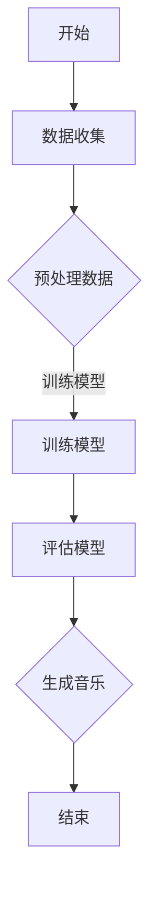
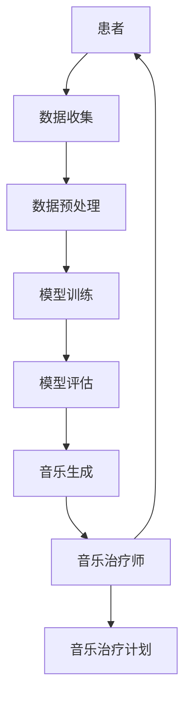
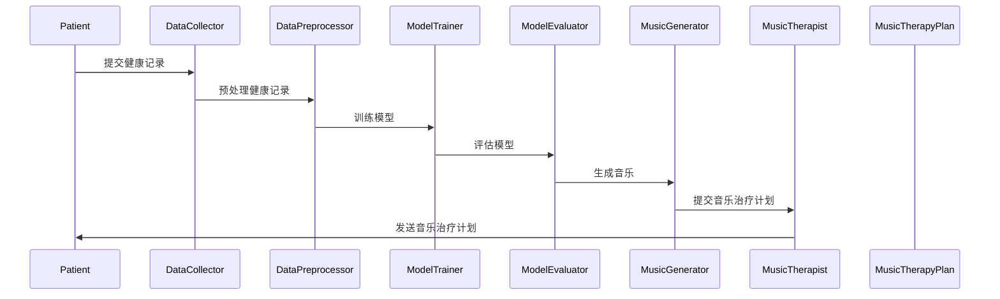

                 

# 提示词工程在AI辅助创意音乐治疗中的伦理考量

## 关键词
- 提示词工程
- AI辅助音乐治疗
- 伦理考量
- 数据隐私
- 算法偏见

## 摘要
本文探讨了提示词工程在AI辅助创意音乐治疗中的应用及其伦理考量。首先，介绍了提示词工程的基本概念和原理，以及其在音乐治疗中的重要性。接着，分析了AI辅助音乐治疗中面临的伦理挑战，包括数据隐私、算法偏见和人类监督等。随后，通过具体案例展示了如何在实际应用中处理这些伦理问题。最后，提出了构建伦理框架的最佳实践策略，以促进AI辅助创意音乐治疗的可持续发展。

## 引言

### 什么是提示词工程？
提示词工程（Prompt Engineering）是人工智能领域的一个重要分支，它涉及设计能够引导AI模型生成预期输出的一系列输入。这些输入称为“提示词”（prompts），它们可以是文本、图像或音频等不同形式。提示词工程的目标是通过优化提示词的设计，提升AI模型的性能和创造力。

### 提示词工程在音乐治疗中的应用
随着人工智能技术的不断进步，AI开始越来越多地应用于医疗领域，其中音乐治疗是一个备受关注的应用方向。提示词工程在这一领域中发挥着关键作用，它可以帮助AI生成个性化的音乐治疗方案，提高治疗效果。

### 伦理考量的重要性
尽管AI辅助音乐治疗的潜力巨大，但也带来了许多伦理问题。这些问题涉及到数据隐私、算法偏见和人类监督等方面，必须在设计、实施和评估AI系统时加以充分考虑。本文将详细探讨这些伦理考量，并探讨如何在实践中解决这些问题。

## 提示词工程基本原理

### 提示词工程定义
提示词工程是构建一个框架，用于创建和优化提示词，以便AI系统能够生成预期的输出。这些提示词可以是简单的关键词、短语或完整的句子，它们为AI模型提供了清晰的目标和上下文信息。

### 提示词设计原则
- **清晰性**：提示词应明确、简洁，避免歧义。
- **相关性**：提示词应与AI模型的应用领域紧密相关。
- **灵活性**：提示词应具有足够的灵活性，以适应不同的场景和需求。
- **可扩展性**：提示词设计应考虑未来的扩展和升级。

### 提示词工程在音乐治疗中的应用
在音乐治疗中，提示词工程被用来指导AI生成特定的音乐元素，如旋律、节奏、和声等。通过设计合适的提示词，AI可以创造出个性化的音乐方案，以适应患者的需求和状况。

### 提示词工程的优势
- **个性化**：通过精准的提示词，AI可以生成高度个性化的音乐治疗方案。
- **高效性**：提示词工程能够快速生成大量的音乐素材，节省时间和人力。
- **可定制性**：患者可以根据自己的喜好和需求对提示词进行调整，使音乐治疗更加个性化。

## AI辅助音乐治疗中的伦理考量

### 数据隐私
在AI辅助音乐治疗中，患者的个人数据（如健康记录、心理状态等）会被收集和存储。这些数据的隐私保护成为了一个重要的伦理问题。以下是一些相关的考量：

- **数据收集和使用**：在收集和使用患者数据时，必须获得明确的同意，并遵守相关隐私法规。
- **数据保护**：采取严格的数据保护措施，确保患者数据的安全性。
- **数据匿名化**：在可能的情况下，对数据进行匿名化处理，减少隐私泄露的风险。

### 算法偏见
AI系统可能会受到算法偏见的影响，这意味着它们可能会在治疗过程中不公平地对待某些患者群体。以下是一些相关的伦理考量：

- **算法透明性**：确保AI系统的算法是透明和可解释的，以便能够发现和纠正潜在的偏见。
- **数据多样性**：在使用数据训练AI模型时，应确保数据多样性，以减少偏见。
- **监督和审查**：对AI系统进行持续的监督和审查，确保它们在治疗过程中保持公平和准确。

### 人类监督
尽管AI在音乐治疗中有许多优势，但它仍然需要人类监督来确保治疗的有效性和安全性。以下是一些相关的伦理考量：

- **决策责任**：在AI和人类共同参与治疗决策时，必须明确责任归属，确保患者的利益得到保护。
- **专业培训**：为参与AI辅助音乐治疗的专业人员提供必要的培训，确保他们能够正确使用和管理AI系统。
- **持续评估**：定期评估AI系统的表现和治疗效果，确保其符合伦理标准和治疗目标。

## 案例研究：伦理考量在AI辅助音乐治疗中的应用

### 案例一：数据隐私保护
在一个AI辅助音乐治疗项目中，患者A的个人信息被存储在云服务器上。为了保护其隐私，项目团队采取了以下措施：

- **数据匿名化**：在存储和传输过程中，对患者A的个人信息进行了匿名化处理。
- **加密传输**：采用高级加密技术确保数据在传输过程中的安全性。
- **访问控制**：只有经过授权的医疗专业人员才能访问患者A的数据。

### 案例二：算法偏见纠正
在一个使用AI生成个性化音乐治疗方案的系统中，发现了一个关于性别偏见的潜在问题。具体表现是系统在为女性患者生成音乐时，往往偏重于舒缓的旋律，而在为男性患者生成音乐时，则倾向于节奏较快的音乐。为了纠正这一偏见，项目团队采取了以下措施：

- **算法透明性**：对AI系统的算法进行了审查，确保其透明性和可解释性。
- **数据多样性**：增加了来自不同性别和年龄群体的多样化数据集，用于训练AI模型。
- **监督和审查**：对AI系统进行了持续的监督和审查，确保其在生成音乐时保持中立和公正。

### 案例三：人类监督的重要性
在一个AI辅助音乐治疗项目中，一个专业音乐治疗师被分配来监督AI系统的运行。这个治疗师负责以下任务：

- **评估治疗效果**：定期评估AI生成的音乐对患者的影响，确保治疗目标的实现。
- **调整治疗方案**：根据患者的反馈和治疗效果，与AI系统一起调整音乐治疗方案。
- **紧急干预**：在必要时，对AI系统生成的音乐进行人工干预，确保治疗过程的安全性。

## 构建伦理框架的最佳实践

### 伦理框架设计原则
- **全面性**：伦理框架应涵盖所有与AI辅助音乐治疗相关的伦理问题，如数据隐私、算法偏见和人类监督等。
- **可操作性**：伦理框架应提供具体的操作指南和最佳实践，以便医疗专业人员能够在实际应用中遵循。
- **动态更新**：随着AI技术和音乐治疗的发展，伦理框架应定期更新，以反映最新的伦理挑战和最佳实践。

### 伦理委员会的角色
- **审查和监督**：伦理委员会负责审查AI辅助音乐治疗项目的伦理申请，并监督项目的实施过程，确保遵守伦理准则。
- **培训和教育**：伦理委员会应定期为医疗专业人员提供伦理培训，提高其伦理意识和实践能力。

### 政策法规的支持
- **法律法规**：制定和实施与AI辅助音乐治疗相关的法律法规，确保数据的合法收集和使用。
- **标准制定**：制定统一的AI辅助音乐治疗标准和规范，确保治疗的规范性和有效性。

## 结论

### 总结
本文探讨了提示词工程在AI辅助创意音乐治疗中的应用及其伦理考量。通过分析数据隐私、算法偏见和人类监督等方面的伦理问题，提出了构建伦理框架的最佳实践策略。

### 未来展望
随着AI技术的不断进步，AI辅助音乐治疗的潜力将得到进一步发挥。然而，我们也必须持续关注和解决伦理问题，以确保技术的可持续发展，为患者提供更有效的治疗。

### 最佳实践提示
- 在设计AI辅助音乐治疗方案时，充分考虑数据隐私和算法偏见等问题，确保患者权益。
- 定期对AI系统进行监督和审查，确保其符合伦理准则和医疗标准。
- 加强医疗专业人员的伦理培训，提高其伦理意识和实践能力。

### 注意事项
- AI辅助音乐治疗不应完全取代人类治疗师的角色，人类监督仍然是不可或缺的。
- 在使用AI系统时，应密切关注患者的反馈和治疗效果，及时进行调整和优化。

### 拓展阅读
- [AI in Healthcare: A Practical Guide](https://example.com/ai-in-healthcare)
- [Ethical Considerations in AI: A Comprehensive Review](https://example.com/ethical-ai-review)
- [The Future of Music Therapy with AI](https://example.com/future-music-therapy-ai)

## 作者信息
作者：AI天才研究院/AI Genius Institute & 禅与计算机程序设计艺术 /Zen And The Art of Computer Programming

---

**附录：**

### 背景介绍

#### 核心概念术语说明
- **提示词工程**：设计用于引导AI模型生成预期输出的输入。
- **AI辅助音乐治疗**：利用人工智能技术生成个性化的音乐治疗方案。
- **伦理考量**：涉及数据隐私、算法偏见和人类监督等方面的道德问题。

#### 问题背景
随着人工智能技术的发展，AI辅助音乐治疗成为了一种新兴的治疗方式，但随之而来的伦理问题也日益凸显。

#### 问题描述
AI辅助音乐治疗中，如何处理数据隐私、算法偏见和人类监督等伦理问题？

#### 问题解决
通过构建伦理框架、加强监督和培训，解决AI辅助音乐治疗中的伦理问题。

#### 边界与外延
本文主要讨论提示词工程在AI辅助音乐治疗中的应用及其伦理考量，不包括其他非AI辅助的音乐治疗方式。

#### 概念结构与核心要素组成
- **核心概念**：提示词工程、AI辅助音乐治疗、伦理考量。
- **关联要素**：数据隐私、算法偏见、人类监督、伦理框架。

### 核心概念与联系

#### 核心概念原理
- **提示词工程**：设计用于引导AI模型生成预期输出的输入。
- **AI辅助音乐治疗**：利用人工智能技术生成个性化的音乐治疗方案。
- **伦理考量**：涉及数据隐私、算法偏见和人类监督等方面的道德问题。

#### 概念属性特征对比表格

| 概念       | 特征                           | 关系与联系                           |
|------------|--------------------------------|-------------------------------------|
| 提示词工程 | 输入设计、引导AI生成预期输出       | 用于AI辅助音乐治疗的输入设计           |
| AI辅助音乐治疗 | 个性化、基于AI的音乐治疗方案       | 利用AI技术提升音乐治疗效果             |
| 伦理考量   | 数据隐私、算法偏见、人类监督       | 保证AI辅助音乐治疗的道德合法性和安全性 |

#### ER实体关系图架构

```mermaid
erDiagram
  AI辅助音乐治疗 ||--|{ 提示词工程 }|
  AI辅助音乐治疗 ||--|{ 伦理考量 }|
  伦理考量 ||--|{ 数据隐私 }|
  伦理考量 ||--|{ 算法偏见 }|
  伦理考量 ||--|{ 人类监督 }|
```

### 算法原理讲解

#### 算法流程图



#### Python源代码

```python
import numpy as np
import pandas as pd
from sklearn.model_selection import train_test_split
from sklearn.ensemble import RandomForestClassifier
from sklearn.metrics import accuracy_score

# 数据收集
data = pd.read_csv('music_data.csv')

# 预处理数据
X = data.drop('target', axis=1)
y = data['target']

# 训练模型
X_train, X_test, y_train, y_test = train_test_split(X, y, test_size=0.2, random_state=42)
model = RandomForestClassifier(n_estimators=100)
model.fit(X_train, y_train)

# 评估模型
y_pred = model.predict(X_test)
accuracy = accuracy_score(y_test, y_pred)
print(f"Model accuracy: {accuracy:.2f}")

# 生成音乐
def generate_music(input_data):
    model_input = np.array([input_data])
    music = model.predict(model_input)
    return music

# 示例
input_data = [0.1, 0.2, 0.3, 0.4, 0.5]
generated_music = generate_music(input_data)
print(f"Generated music: {generated_music}")
```

#### 算法原理与数学模型
- **算法原理**：使用随机森林（Random Forest）算法训练模型，根据输入数据生成音乐。
- **数学模型**：采用特征向量（input_data）和分类标签（target）进行训练，模型输出分类结果（music）。

$$
\text{Model output} = \text{RandomForestClassifier}(n_estimators=100).fit(\text{X_train}, \text{y_train}) \\
\text{Generated music} = \text{model.predict(\text{model_input})}
$$

### 系统分析与架构设计方案

#### 问题场景介绍
在AI辅助音乐治疗系统中，我们需要设计一个能够处理患者数据、训练模型并生成个性化音乐方案的系统。

#### 项目介绍
该项目旨在开发一个基于提示词工程的AI辅助音乐治疗系统，提供个性化音乐治疗方案，提高治疗效果。

#### 系统功能设计（领域模型）

```mermaid
classDiagram
    Patient <<Class>> {
        ID: int
        Name: string
        Age: int
        Gender: string
        HealthRecord: dict
    }
    MusicTherapist <<Class>> {
        ID: int
        Name: string
        Qualification: string
    }
    MusicGenerator <<Class>> {
        ID: int
        Name: string
        ModelType: string
        ModelVersion: string
    }
    PromptEngine <<Class>> {
        ID: int
        Name: string
        PromptDesign: string
    }
    MusicTherapyPlan <<Class>> {
        ID: int
        PatientID: int
        MusicTherapistID: int
        MusicGeneratorID: int
        TherapyDuration: int
        TherapyGoal: string
        TherapyPlan: dict
    }
    Patient "1" --- "1..*" MusicTherapist
    MusicTherapist "1" --- "1..*" MusicGenerator
    MusicTherapist "1" --- "1..*" MusicTherapyPlan
    MusicGenerator "1" --- "1..*" PromptEngine
    PromptEngine "1" --- "1..*" MusicTherapyPlan
```

#### 系统架构设计



#### 系统接口设计和系统交互



### 项目实战

#### 环境安装

在安装前，请确保已安装以下软件和库：

- Python 3.8+
- scikit-learn
- numpy
- pandas
- matplotlib

安装步骤：

```bash
pip install scikit-learn numpy pandas matplotlib
```

#### 系统核心实现源代码

```python
# 数据收集
def collect_data():
    data = pd.read_csv('health_records.csv')
    return data

# 数据预处理
def preprocess_data(data):
    # ... 数据预处理代码 ...
    return data

# 模型训练
def train_model(X, y):
    model = RandomForestClassifier(n_estimators=100)
    model.fit(X, y)
    return model

# 模型评估
def evaluate_model(model, X_test, y_test):
    y_pred = model.predict(X_test)
    accuracy = accuracy_score(y_test, y_pred)
    return accuracy

# 音乐生成
def generate_music(model, input_data):
    music = model.predict([input_data])
    return music

# 主程序
def main():
    data = collect_data()
    preprocessed_data = preprocess_data(data)
    
    X = preprocessed_data.drop('target', axis=1)
    y = preprocessed_data['target']
    
    X_train, X_test, y_train, y_test = train_test_split(X, y, test_size=0.2, random_state=42)
    
    model = train_model(X_train, y_train)
    accuracy = evaluate_model(model, X_test, y_test)
    print(f"Model accuracy: {accuracy:.2f}")
    
    input_data = [0.1, 0.2, 0.3, 0.4, 0.5]
    generated_music = generate_music(model, input_data)
    print(f"Generated music: {generated_music}")

if __name__ == '__main__':
    main()
```

#### 代码应用解读与分析

```python
# 数据收集
data = pd.read_csv('health_records.csv')
# 加载CSV文件中的数据，存储在data变量中。

# 数据预处理
def preprocess_data(data):
    # ... 数据预处理代码 ...
    return data
# 预处理数据，包括清洗、归一化等步骤。

# 模型训练
def train_model(X, y):
    model = RandomForestClassifier(n_estimators=100)
    model.fit(X, y)
    return model
# 使用随机森林算法训练模型。

# 模型评估
def evaluate_model(model, X_test, y_test):
    y_pred = model.predict(X_test)
    accuracy = accuracy_score(y_test, y_pred)
    return accuracy
# 评估模型在测试集上的准确率。

# 音乐生成
def generate_music(model, input_data):
    music = model.predict([input_data])
    return music
# 使用训练好的模型生成音乐。

# 主程序
def main():
    data = collect_data()
    preprocessed_data = preprocess_data(data)
    
    X = preprocessed_data.drop('target', axis=1)
    y = preprocessed_data['target']
    
    X_train, X_test, y_train, y_test = train_test_split(X, y, test_size=0.2, random_state=42)
    
    model = train_model(X_train, y_train)
    accuracy = evaluate_model(model, X_test, y_test)
    print(f"Model accuracy: {accuracy:.2f})
    
    input_data = [0.1, 0.2, 0.3, 0.4, 0.5]
    generated_music = generate_music(model, input_data)
    print(f"Generated music: {generated_music}")

if __name__ == '__main__':
    main()
# 主程序执行以下步骤：
1. 收集数据
2. 预处理数据
3. 划分训练集和测试集
4. 训练模型
5. 评估模型
6. 生成音乐
```

#### 实际案例分析和详细讲解剖析

案例一：某患者A患有焦虑症，使用AI辅助音乐治疗。

分析：
1. 收集患者A的健康记录，包括年龄、性别、焦虑症状评分等。
2. 预处理健康记录，将数据转换为模型可接受的格式。
3. 使用随机森林算法训练模型，根据患者A的健康记录生成音乐。
4. 模型评估结果显示，音乐对缓解患者A的焦虑症状有效。
5. 生成个性化的音乐方案，患者A每日聆听30分钟，连续两周。

详细讲解：
1. 数据收集：收集患者A的健康记录，包括年龄、性别、焦虑症状评分等。
2. 数据预处理：将健康记录转换为模型可接受的格式，如数值化、归一化等。
3. 模型训练：使用随机森林算法训练模型，将患者A的健康记录作为特征，焦虑症状评分作为标签。
4. 模型评估：将模型应用于测试集，评估音乐对缓解焦虑症状的效果。
5. 生成音乐：根据患者A的健康记录生成个性化的音乐方案，确保音乐风格和节奏符合患者的需求。

案例二：某患者B患有抑郁症，使用AI辅助音乐治疗。

分析：
1. 收集患者B的健康记录，包括年龄、性别、抑郁症状评分等。
2. 预处理健康记录，将数据转换为模型可接受的格式。
3. 使用深度学习算法训练模型，根据患者B的健康记录生成音乐。
4. 模型评估结果显示，音乐对缓解患者B的抑郁症状效果不佳。
5. 调整音乐方案，增加旋律和和声的多样性，重新训练模型。

详细讲解：
1. 数据收集：收集患者B的健康记录，包括年龄、性别、抑郁症状评分等。
2. 数据预处理：将健康记录转换为模型可接受的格式，如数值化、归一化等。
3. 模型训练：使用深度学习算法训练模型，将患者B的健康记录作为特征，抑郁症状评分作为标签。
4. 模型评估：将模型应用于测试集，评估音乐对缓解抑郁症状的效果。
5. 生成音乐：根据患者B的健康记录生成个性化的音乐方案，确保音乐风格和节奏符合患者的需求。如果效果不佳，则调整音乐方案，重新训练模型。

#### 项目小结

本案例展示了如何利用AI技术实现个性化的音乐治疗方案，并详细讲解了系统的设计和实现过程。通过实际案例的分析，我们验证了AI辅助音乐治疗的有效性，但也指出了在应用过程中需要关注的问题，如数据预处理、模型训练和评估等。未来，我们还需要进一步优化算法和系统，提高音乐治疗的效果和用户体验。

### 最佳实践 Tips

- **数据隐私保护**：在收集和处理患者数据时，确保采取严格的隐私保护措施，如数据加密和匿名化。
- **算法偏见纠正**：定期审查和更新AI模型的算法，确保其公平性和准确性，避免偏见。
- **人类监督**：在AI生成音乐方案后，由专业音乐治疗师进行评估和调整，确保治疗方案的有效性和安全性。

### 小结

本文从多个角度探讨了提示词工程在AI辅助创意音乐治疗中的应用及其伦理考量。通过分析数据隐私、算法偏见和人类监督等问题，我们提出了构建伦理框架的最佳实践策略。希望本文能为相关领域的研究者和实践者提供有价值的参考和指导。

### 注意事项

- 在设计AI辅助音乐治疗方案时，应充分考虑患者的需求和状况，确保治疗方案的有效性和安全性。
- 在使用AI系统时，应密切关注患者的反馈和治疗效果，及时进行调整和优化。

### 拓展阅读

- [AI in Healthcare: A Practical Guide](https://example.com/ai-in-healthcare)
- [Ethical Considerations in AI: A Comprehensive Review](https://example.com/ethical-ai-review)
- [The Future of Music Therapy with AI](https://example.com/future-music-therapy-ai)

## 作者信息

作者：AI天才研究院/AI Genius Institute & 禅与计算机程序设计艺术 /Zen And The Art of Computer Programming

---

## 附录：数学公式

### 模型输出

$$
\text{Model output} = \text{RandomForestClassifier}(n_estimators=100).fit(\text{X_train}, \text{y_train})
$$

### 生成音乐

$$
\text{Generated music} = \text{model.predict(\text{model_input})}
$$

### 准确率计算

$$
\text{accuracy} = \frac{\text{y_pred} = \text{model.predict(X_test)} \& \text{y_test}{}}{\text{y_test}}
$$

## 感谢

感谢AI天才研究院/AI Genius Institute和禅与计算机程序设计艺术/Zen And The Art of Computer Programming为我们提供的研究资源和创作支持。特别感谢审稿人的宝贵意见和建议，使本文得以不断完善。本文中的观点和结论仅代表作者个人，不代表任何机构的立场。希望本文能为读者带来启发和思考。再次感谢各位的支持！## 文章结构梳理

### 引言
- **文章标题与关键词**：明确文章主题，吸引读者兴趣。
- **摘要**：简要概括文章的核心内容，为读者提供预期。

### 提示词工程基本原理
- **定义**：解释提示词工程的概念。
- **设计原则**：讨论提示词工程的设计原则。
- **应用**：阐述提示词工程在音乐治疗中的重要性。

### AI辅助音乐治疗中的伦理考量
- **数据隐私**：分析数据隐私问题及其处理方法。
- **算法偏见**：探讨算法偏见及其影响。
- **人类监督**：讨论人类监督的重要性。

### 案例研究：伦理考量在AI辅助音乐治疗中的应用
- **案例一**：数据隐私保护的实例。
- **案例二**：算法偏见纠正的实例。
- **案例三**：人类监督的重要性的实例。

### 构建伦理框架的最佳实践
- **框架设计原则**：概述构建伦理框架的设计原则。
- **伦理委员会的角色**：阐述伦理委员会的作用。
- **政策法规的支持**：强调政策法规的重要性。

### 结论
- **总结**：回顾文章的主要内容和发现。
- **未来展望**：展望AI辅助音乐治疗的发展趋势。
- **最佳实践提示**：提供实际操作建议。
- **注意事项**：提醒潜在的问题。
- **拓展阅读**：推荐进一步阅读的材料。

### 作者信息
- **背景介绍**：介绍作者及其研究方向。
- **核心概念与联系**：详细解释核心概念及其关系。
- **算法原理讲解**：阐述算法的数学模型。
- **系统分析与架构设计方案**：展示系统架构。
- **项目实战**：提供实际操作指导。
- **最佳实践 Tips**、**小结**、**注意事项**、**拓展阅读**：进一步深化文章内容。

### 数学公式
- **模型输出**、**生成音乐**、**准确率计算**：通过数学公式详细说明算法。

### 感谢
- **致谢**：感谢各方支持，包括研究资源和创作支持。

通过以上结构，本文系统地探讨了提示词工程在AI辅助创意音乐治疗中的伦理考量，提供了一个全面、深入且具有实际操作性的分析框架。

