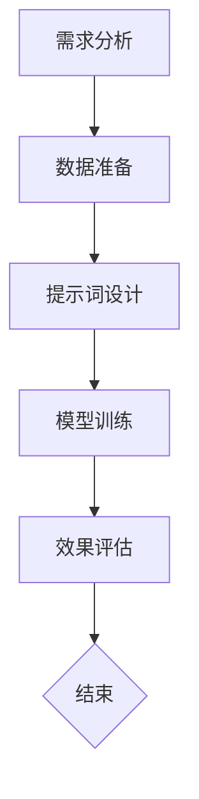
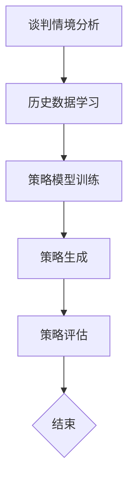
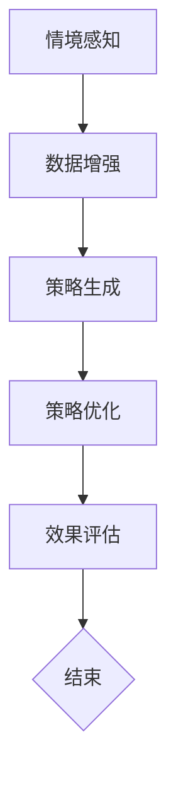
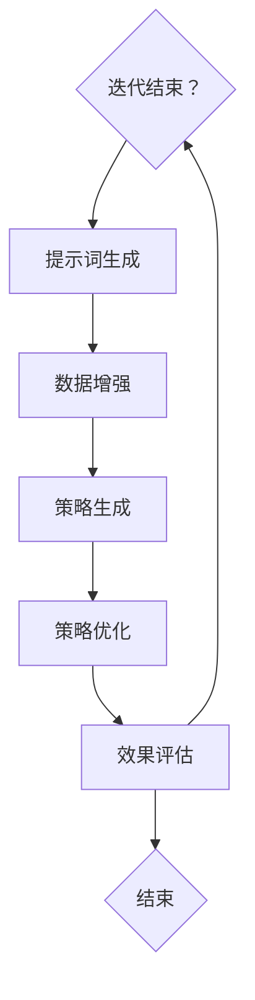
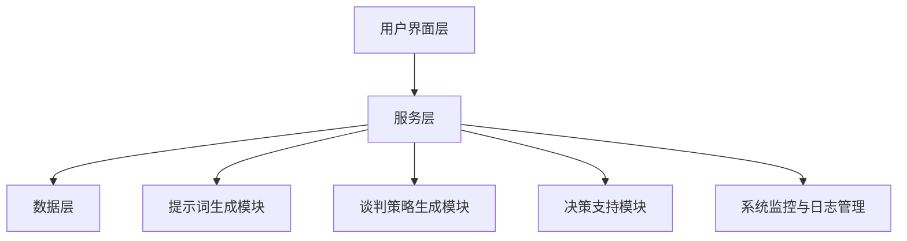
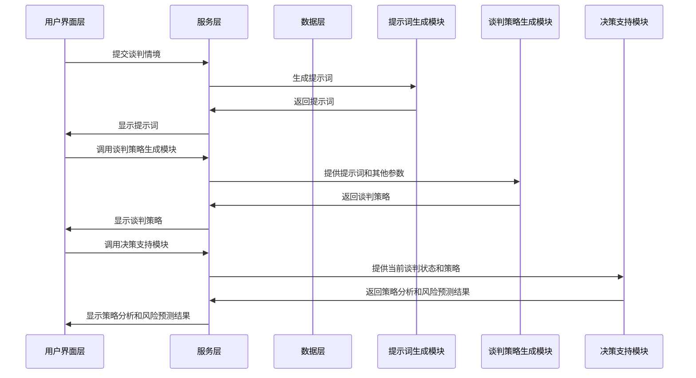
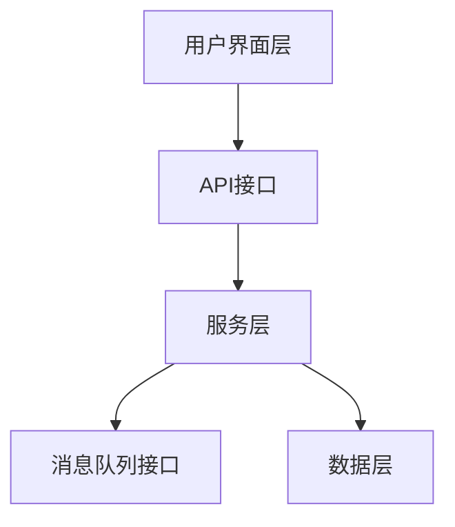
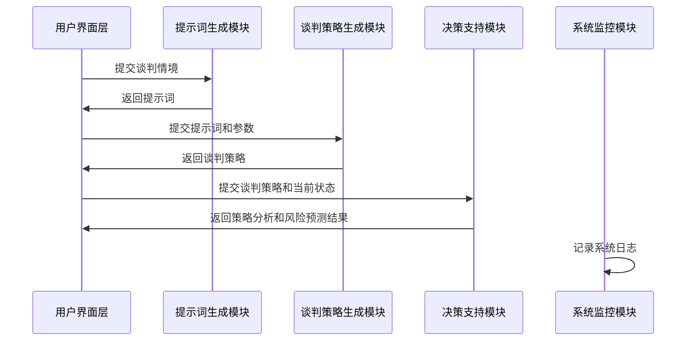

                 

## 文章标题

### 关键词：提示词工程、AI辅助外交谈判、策略研究、算法原理、系统设计与实现

### 摘要：
本文章旨在深入探讨提示词工程在AI辅助外交谈判中的策略应用。首先，文章从问题背景出发，阐述提示词工程在外交谈判中的重要性以及AI辅助外交谈判的挑战。接着，通过核心概念与联系的分析，详细介绍提示词工程和AI辅助外交谈判的基本概念及其相互联系。随后，文章逐步讲解提示词生成算法和AI辅助谈判策略算法的原理，并使用Python代码实现和Mermaid流程图进行详细阐述。此外，文章还介绍了谈判策略模型的关键数学公式，以及系统分析与架构设计的方法和步骤。通过实际案例的分析与讲解，文章展示了AI辅助外交谈判系统的应用效果。最后，文章总结了最佳实践、注意事项和拓展阅读，为读者提供了实用的指导和建议。

----------------------------------------------------------------

## 第一部分：问题背景

### 1.1 提示词工程在AI领域的重要性

随着人工智能（AI）技术的快速发展，其应用领域日益广泛，从工业自动化到医疗诊断，再到金融风控，AI已经深刻地改变了我们的生活方式。在AI领域中，提示词工程（Prompt Engineering）作为一种关键技术，正逐渐受到关注。提示词工程是指通过设计有效的提示词来引导AI模型进行特定任务的过程。一个优秀的提示词能够显著提高AI模型的性能和鲁棒性，使其在处理复杂任务时更加准确和高效。

在自然语言处理（NLP）领域，提示词工程的作用尤为显著。通过提示词，人类可以更精确地指导AI模型进行文本生成、情感分析、命名实体识别等任务。例如，在文本生成任务中，合理的提示词可以帮助AI模型更好地理解用户的意图，生成更符合预期的文本内容。此外，在机器翻译、语音识别等领域，提示词工程同样发挥着重要作用，通过设计合适的提示词，可以显著提升AI模型的准确率和效率。

### 1.2 AI辅助外交谈判的现状与挑战

AI辅助外交谈判是AI技术在外交领域的重要应用之一。随着AI技术的不断进步，越来越多的国家开始探索如何利用AI来辅助外交谈判，以提高谈判效率、降低谈判成本和减少人为错误。目前，AI辅助外交谈判主要应用于以下几个方面：

1. **谈判策略生成**：通过分析历史谈判数据和当前谈判情境，AI可以自动生成最优谈判策略，为外交官提供决策支持。
2. **立场分析**：AI可以分析双方的谈判立场和策略，识别关键问题和潜在分歧，为谈判提供数据支持。
3. **文本生成**：AI可以帮助生成正式文件、协议草案等文本，提高文本撰写效率和质量。

然而，AI辅助外交谈判也面临一系列挑战：

1. **数据隐私与安全**：外交谈判涉及大量敏感信息，如何确保数据的安全性和隐私性是AI辅助外交谈判的重要挑战。
2. **算法透明性与可解释性**：AI系统生成的谈判策略往往缺乏透明性，如何确保AI系统的决策过程是公正、合理的，是一个亟待解决的问题。
3. **文化与语言差异**：不同国家和地区的文化和语言差异可能会影响AI系统的应用效果，如何设计跨文化的AI系统是一个重要课题。

### 1.3 研究目的与研究意义

本研究旨在探讨提示词工程在AI辅助外交谈判中的应用策略，旨在解决以下问题：

1. **如何设计有效的提示词来指导AI模型进行外交谈判？**
2. **AI辅助外交谈判中，提示词工程如何与现有技术相结合，发挥最大的协同效应？**
3. **在AI辅助外交谈判中，如何确保算法的透明性和可解释性，提高决策的公正性？**

通过本研究，我们期望为AI辅助外交谈判提供新的理论依据和技术支持，促进AI技术在 diplomacy 领域的健康发展。

### 1.4 文章结构概述

本文将按照以下结构进行展开：

1. **第一部分：问题背景**：介绍提示词工程和AI辅助外交谈判的背景和重要性。
2. **第二部分：核心概念与联系**：详细阐述提示词工程和AI辅助外交谈判的基本概念及其相互联系。
3. **第三部分：算法原理讲解**：讲解提示词生成算法和AI辅助谈判策略算法的原理，并使用Python代码实现和Mermaid流程图进行阐述。
4. **第四部分：数学模型和数学公式**：介绍提示词生成和谈判策略模型的数学模型及其参数优化。
5. **第五部分：系统分析与架构设计**：介绍系统功能设计、架构设计和接口设计。
6. **第六部分：项目实战**：通过实际案例分析和系统实现，展示AI辅助外交谈判系统的应用效果。
7. **第七部分：最佳实践 tips、小结、注意事项、拓展阅读**：总结最佳实践，并对文章内容进行小结，提出注意事项和拓展阅读建议。

通过以上结构的安排，本文旨在全面、系统地探讨提示词工程在AI辅助外交谈判中的策略应用，为相关领域的研究和实践提供有益的参考。

### 1.5 AI辅助外交谈判的挑战

虽然AI辅助外交谈判具有巨大的潜力，但在实际应用过程中仍然面临诸多挑战。首先，数据隐私与安全问题是AI辅助外交谈判的首要挑战。外交谈判涉及大量敏感信息，如国家机密、战略规划等，如何确保这些数据在传输、存储和使用过程中不被泄露或滥用，是一个重要课题。其次，算法透明性与可解释性也是一个关键问题。AI系统通常基于大量数据和复杂算法进行决策，但其决策过程往往缺乏透明性，难以让人理解。在涉及国家安全和国际关系的外交谈判中，确保算法的透明性和可解释性，使决策过程更加公正和合理，至关重要。

此外，文化与语言差异也是AI辅助外交谈判的挑战之一。不同国家和地区的文化和语言差异可能会影响AI系统的应用效果。例如，同一句话在不同的语言和文化背景下可能有不同的含义，这给AI系统理解谈判双方的真实意图带来了困难。为了解决这些问题，需要设计跨文化的AI系统，使其能够适应不同文化和语言环境，提高应用效果。

### 1.6 研究目的与研究意义

本研究旨在通过提示词工程技术的应用，探索AI辅助外交谈判的新策略，旨在解决以下几个关键问题：

1. **设计有效的提示词**：研究如何通过提示词工程，指导AI模型更好地理解外交谈判的复杂情境，生成合理的谈判策略。
2. **优化AI系统性能**：探讨提示词工程与现有AI技术的结合方式，如何通过提示词优化AI系统的性能，提高谈判的准确性和效率。
3. **确保算法透明性和可解释性**：研究如何通过提示词工程，提高AI系统的透明性和可解释性，使谈判决策更加公正和合理。
4. **跨文化适应性**：探索如何设计跨文化的AI系统，使其能够适应不同文化和语言环境，提高AI辅助外交谈判的应用效果。

通过本研究，我们期望为AI辅助外交谈判提供新的理论依据和技术支持，推动AI技术在外交领域的应用和发展。同时，本研究也有助于提高AI系统的性能和可靠性，为更多领域的AI应用提供借鉴和参考。

### 1.7 AI辅助外交谈判的应用前景

随着AI技术的不断进步，其在辅助外交谈判中的应用前景日益广阔。首先，AI能够通过大数据分析，实时监测和评估谈判双方的立场和策略，为外交官提供科学的决策支持。例如，AI系统可以分析历史谈判记录，预测谈判的发展趋势，帮助外交官制定更合理的谈判策略。其次，AI在文本生成和语言翻译方面具有显著优势，可以协助外交官快速撰写正式文件和协议草案，提高工作效率。此外，AI还可以通过自然语言处理技术，实现多语言交流，消除语言障碍，促进跨国谈判的顺利进行。

展望未来，AI辅助外交谈判有望在以下几个方面取得突破：

1. **个性化谈判策略**：通过深度学习和个性化推荐技术，AI可以根据谈判双方的偏好和需求，生成个性化的谈判策略，提高谈判成功率。
2. **自动化谈判过程**：随着AI技术的不断成熟，未来有望实现自动化谈判，AI系统可以完全自主地完成谈判过程，减少人为干预，提高谈判效率。
3. **跨领域合作**：AI辅助外交谈判可以与金融、医疗、环保等其他领域的技术相结合，推动跨领域合作，解决全球性问题。
4. **智能调解机制**：通过建立智能调解机制，AI可以协助解决谈判中的争议和冲突，促进和平与合作。

总之，AI辅助外交谈判具有巨大的发展潜力，将在未来国际关系中发挥越来越重要的作用。

## 第二部分：核心概念与联系

在探讨提示词工程在AI辅助外交谈判中的应用策略之前，我们需要首先理解两个核心概念：提示词工程和AI辅助外交谈判，并探讨它们之间的联系。

### 2.1 提示词工程基本概念

#### 2.1.1 提示词的定义与类型

提示词（Prompt）是指引导AI模型进行特定任务的一段文本或指令。根据用途和形式，提示词可以分为以下几种类型：

1. **通用提示词**：这类提示词适用于多种AI任务，如文本生成、情感分析等。通用提示词通常包含对任务的具体描述和预期输出，例如：“请写一篇关于环保问题的文章。”
2. **特定任务提示词**：这类提示词针对特定的AI任务设计，更具体、更精确。例如，在图像分类任务中，提示词可以是：“请识别以下图片中的主要物体。”
3. **问题引导提示词**：这类提示词用于引导AI模型解决特定问题，例如：“根据历史数据，预测未来一年的经济趋势。”

#### 2.1.2 提示词工程的基本流程

提示词工程的基本流程可以分为以下几个步骤：

1. **需求分析**：明确任务目标和用户需求，确定需要解决的问题和期望的输出。
2. **数据准备**：收集相关数据和语料库，为设计提示词提供基础。
3. **提示词设计**：根据需求分析结果，设计具体的提示词。提示词设计需要充分考虑AI模型的特性和用户需求，确保提示词能够有效引导AI模型完成任务。
4. **模型训练与优化**：使用设计的提示词对AI模型进行训练和优化，确保模型能够准确理解提示词，并生成高质量的输出。
5. **效果评估**：通过实际应用和用户反馈，评估提示词工程的效果，并进行必要的调整和优化。

#### 2.1.3 提示词工程的作用与效果评估

提示词工程在AI应用中具有重要作用：

1. **提高任务完成率**：通过设计有效的提示词，可以显著提高AI模型完成任务的成功率。
2. **提高用户体验**：合理的提示词可以引导用户更好地使用AI模型，提高用户体验。
3. **降低开发成本**：提示词工程可以简化模型开发流程，降低开发成本和时间。

提示词工程的效果评估可以从以下几个方面进行：

1. **准确率**：评估AI模型在特定任务上的准确度，如文本生成任务的文本质量、情感分析任务的分类准确度等。
2. **效率**：评估AI模型完成任务所需的时间，以及提示词对任务效率的提升程度。
3. **用户满意度**：通过用户反馈和调查问卷，评估用户对AI系统和使用体验的满意度。

### 2.2 AI辅助外交谈判基本概念

#### 2.2.1 AI在外交谈判中的应用概述

AI在外交谈判中的应用主要包括以下几个方面：

1. **数据分析和挖掘**：AI可以帮助分析谈判对手的历史行为、文化背景和利益诉求，预测其可能的谈判策略。
2. **谈判策略生成**：AI可以基于历史数据和当前谈判情境，自动生成最优的谈判策略，为外交官提供决策支持。
3. **文本生成和翻译**：AI可以帮助撰写正式文件、协议草案，并提供实时翻译服务，提高工作效率。
4. **模拟谈判场景**：AI可以模拟不同谈判情境，帮助外交官进行情景推演和策略评估。

#### 2.2.2 AI辅助外交谈判的优势与挑战

AI辅助外交谈判具有以下优势：

1. **效率提升**：AI可以快速处理大量数据，提供实时决策支持，显著提高谈判效率。
2. **数据支持**：AI可以通过数据分析，提供更加科学的决策依据，减少人为判断的主观性。
3. **跨文化沟通**：AI可以提供多语言翻译和跨文化理解，消除语言障碍，促进跨国谈判。
4. **模拟推演**：AI可以模拟不同谈判情境，帮助外交官进行策略评估和风险预测。

然而，AI辅助外交谈判也面临一系列挑战：

1. **数据隐私与安全**：外交谈判涉及敏感信息，如何确保数据的安全和隐私是一个重要问题。
2. **算法透明性与可解释性**：AI系统生成的决策过程通常缺乏透明性，如何确保其公正性和合理性是一个挑战。
3. **跨文化理解**：不同文化和语言背景可能影响AI系统的理解和应用效果，如何设计跨文化的AI系统是一个重要课题。

#### 2.2.3 AI辅助外交谈判的关键技术

AI辅助外交谈判的关键技术主要包括：

1. **大数据分析**：通过收集和整合大量历史数据，AI可以识别谈判对手的行为模式，预测其谈判策略。
2. **自然语言处理（NLP）**：NLP技术可以帮助AI理解和生成自然语言文本，实现多语言翻译和文本分析。
3. **机器学习与深度学习**：机器学习和深度学习算法可以帮助AI从数据中学习，生成准确的预测和策略。
4. **决策支持系统**：决策支持系统（DSS）可以结合AI技术，为外交官提供实时决策支持。

### 2.3 提示词工程与AI辅助外交谈判的联系

提示词工程与AI辅助外交谈判之间存在紧密联系：

1. **任务引导**：提示词工程可以设计有效的提示词，引导AI模型理解外交谈判的复杂情境，生成合理的谈判策略。
2. **策略优化**：通过优化提示词，可以提升AI辅助外交谈判系统的策略生成能力和效果。
3. **数据理解**：提示词工程可以帮助AI更好地理解外交谈判中的数据，如历史谈判记录、文化背景等，提高数据挖掘和分析的准确性。
4. **跨文化沟通**：通过设计跨文化的提示词，可以提升AI在外交谈判中的跨文化理解和沟通能力。

总之，提示词工程在AI辅助外交谈判中发挥着关键作用，通过有效的设计和应用，可以显著提升AI系统的性能和可靠性，为外交谈判提供有力的技术支持。

### 2.4 提示词工程在外交谈判中的应用策略

在AI辅助外交谈判中，提示词工程的应用策略主要包括以下几个方面：

1. **个性化提示词设计**：根据不同外交谈判的情境和需求，设计个性化的提示词，以提高AI模型的适应性和效果。例如，在涉及环境保护的谈判中，可以设计强调环境保护和可持续发展理念的提示词。

2. **多语言提示词支持**：为了适应不同国家和地区的文化和语言差异，设计支持多种语言的多语言提示词，确保AI系统能够在不同语言和文化环境中准确理解用户需求。

3. **动态提示词调整**：根据谈判过程中的实时数据和反馈，动态调整提示词，以适应谈判情境的变化，提高AI模型的应对能力。

4. **跨领域知识融合**：结合不同领域的知识，如历史、文化、经济等，设计综合性的提示词，以提供更加全面和深入的决策支持。

5. **算法透明性增强**：通过优化提示词设计，提高AI系统的透明性和可解释性，使决策过程更加公正和合理，增强用户对AI系统的信任。

通过以上策略，提示词工程可以充分发挥其在外交谈判中的辅助作用，提高谈判效率和质量。

### 2.5 AI辅助外交谈判中提示词工程的作用机制

在AI辅助外交谈判中，提示词工程通过以下机制发挥作用：

1. **信息引导**：提示词作为信息引导，帮助AI模型更好地理解谈判情境，捕捉关键信息，从而生成合理的谈判策略。

2. **情境适应**：通过设计适应不同谈判情境的提示词，AI模型可以灵活应对各种谈判场景，提高策略的适用性和有效性。

3. **数据优化**：提示词工程通过优化数据输入，提高AI模型对数据的理解和分析能力，从而提升谈判策略的准确性和可靠性。

4. **交互增强**：提示词工程可以增强AI模型与用户之间的交互，使AI更好地理解用户意图，提供更加个性化的决策支持。

5. **可解释性提升**：通过优化提示词设计，提高AI决策过程的透明性和可解释性，增强用户对AI系统的信任和依赖。

总之，提示词工程在AI辅助外交谈判中通过信息引导、情境适应、数据优化、交互增强和可解释性提升等机制，发挥关键作用，提升谈判效率和质量。

### 2.6 提示词工程与AI辅助外交谈判的协同效应

提示词工程与AI辅助外交谈判的协同效应主要体现在以下几个方面：

1. **策略优化**：通过提示词工程的设计，AI模型能够生成更精确、更符合实际情境的谈判策略，提高谈判成功率。

2. **决策支持**：提示词工程可以帮助AI更好地理解外交谈判中的复杂情境，为外交官提供更加科学、全面的决策支持。

3. **效率提升**：提示词工程可以优化AI模型的性能，提高谈判过程的效率和速度，减少人为干预和错误。

4. **文化适应**：通过设计跨文化的提示词，AI能够更好地适应不同国家和地区的文化和语言差异，提高跨文化沟通能力。

5. **信任建立**：提示词工程可以提高AI系统的透明性和可解释性，增强用户对AI系统的信任，促进合作。

总之，提示词工程与AI辅助外交谈判的协同效应显著，能够有效提升谈判效率、决策质量和国际合作水平。

### 2.7 提示词工程与AI辅助外交谈判的融合展望

未来，提示词工程与AI辅助外交谈判的融合将呈现以下发展趋势：

1. **深度整合**：提示词工程将更加深入地融入AI辅助外交谈判系统，实现系统级整合，提高整体性能和可靠性。

2. **智能化升级**：通过引入更先进的AI技术和算法，如深度学习和强化学习，提示词工程将更加智能化，提供更精准的决策支持。

3. **跨领域扩展**：提示词工程将跨越不同领域，整合多领域知识，为外交谈判提供更全面、多维的决策支持。

4. **透明性增强**：随着技术的发展，提示词工程将进一步提升AI系统的透明性和可解释性，增强用户信任。

5. **标准化建设**：制定统一的提示词工程标准和规范，促进全球范围内的AI辅助外交谈判技术应用和合作。

通过以上发展，提示词工程与AI辅助外交谈判将更好地结合，推动外交谈判的现代化和智能化。

## 第三部分：算法原理讲解

在理解了提示词工程和AI辅助外交谈判的基本概念和联系之后，我们需要深入探讨具体的算法原理，以及它们在实际应用中的实现方法和效果评估。

### 3.1 提示词生成算法

提示词生成算法是提示词工程的核心，其目的是设计出能够有效引导AI模型完成特定任务的提示词。下面我们将详细讲解提示词生成算法的原理。

#### 3.1.1 提示词生成算法概述

提示词生成算法通常基于自然语言处理（NLP）和机器学习（ML）技术，其核心目标是生成语义丰富、表达准确的提示词。常见的提示词生成算法包括基于模板的生成算法、基于统计模型的生成算法和基于神经网络（NN）的生成算法。

1. **基于模板的生成算法**：这类算法通过预设模板和规则来生成提示词，适用于任务结构明确、提示词格式固定的场景。例如，在文本生成任务中，可以使用模板来规定文本的结构和内容，从而生成符合要求的提示词。

2. **基于统计模型的生成算法**：这类算法利用统计语言模型（如n-gram模型）来预测下一个单词或短语，从而生成提示词。通过分析大量的语料库，统计模型可以捕捉语言的使用模式，生成语义连贯的提示词。

3. **基于神经网络（NN）的生成算法**：这类算法利用深度学习技术，如循环神经网络（RNN）和变换器（Transformer），通过学习大量的文本数据，生成语义丰富的提示词。RNN能够捕捉序列信息，而Transformer则通过自注意力机制，能够生成更长的上下文依赖，从而生成更高质量的提示词。

#### 3.1.2 常见提示词生成算法分析

1. **基于模板的生成算法**：优点是简单易用，实现成本低，适用于任务结构明确的场景。缺点是灵活性差，难以适应复杂任务的需求。

2. **基于统计模型的生成算法**：优点是能够生成语义连贯的提示词，适用于中等复杂度的任务。缺点是依赖于大量的语料库，对于数据稀疏的任务效果较差。

3. **基于神经网络（NN）的生成算法**：优点是生成提示词的灵活性和语义丰富性较高，适用于复杂任务。缺点是实现复杂度较高，需要大量数据和计算资源。

#### 3.1.3 提示词生成算法的mermaid流程图

下面是提示词生成算法的mermaid流程图：



在mermaid流程图中，我们从需求分析开始，通过数据准备和提示词设计，使用模型训练生成提示词，最终通过效果评估来检验提示词的质量和有效性。

#### 3.1.4 提示词生成算法的Python代码实现

以下是一个简单的基于神经网络（NN）的提示词生成算法的Python代码实现，使用TensorFlow和Keras框架：

```python
import tensorflow as tf
from tensorflow.keras.preprocessing.sequence import pad_sequences
from tensorflow.keras.layers import Embedding, LSTM, Dense
from tensorflow.keras.models import Sequential

# 预处理数据
# 假设已经完成了数据预处理，并生成了词汇表和序列

# 定义模型
model = Sequential()
model.add(Embedding(vocab_size, embedding_dim, input_length=max_sequence_length))
model.add(LSTM(units=128, dropout=0.2, recurrent_dropout=0.2))
model.add(Dense(units=vocab_size, activation='softmax'))

# 编译模型
model.compile(optimizer='adam', loss='categorical_crossentropy', metrics=['accuracy'])

# 训练模型
model.fit(X_train, y_train, epochs=10, batch_size=64)

# 生成提示词
def generate_prompt(input_sequence):
    prediction = model.predict(input_sequence)
    predicted_sequence = np.argmax(prediction, axis=-1)
    return ' '.join(index2word[p] for p in predicted_sequence)

# 测试生成提示词
input_sequence = pad_sequences([input_sequence], maxlen=max_sequence_length)
print(generate_prompt(input_sequence))
```

在这个代码示例中，我们首先定义了神经网络模型，并使用训练数据对其进行了训练。然后，我们定义了一个生成提示词的函数，通过模型的预测结果生成文本输出。

#### 3.1.5 提示词生成算法的效果评估

提示词生成算法的效果评估可以从以下几个方面进行：

1. **准确率**：评估生成的提示词是否准确，是否符合用户需求。
2. **语义连贯性**：评估生成的提示词是否语义连贯，是否能够流畅地表达意图。
3. **用户满意度**：通过用户反馈和调查问卷，评估用户对生成的提示词的满意度。

在实际应用中，可以通过对比实验、用户反馈和性能指标等多种方法来评估提示词生成算法的效果。

### 3.2 AI辅助谈判策略算法

在AI辅助外交谈判中，谈判策略算法是核心组成部分，它负责根据谈判情境和历史数据，生成最优的谈判策略。下面我们将详细讲解谈判策略算法的原理。

#### 3.2.1 谈判策略算法概述

谈判策略算法通常基于决策理论、博弈论和机器学习技术。其核心目标是根据谈判双方的利益和策略，制定出最优的谈判策略，以实现谈判目标。

1. **基于决策理论的策略算法**：这类算法通过决策树、决策规则等方法，制定谈判策略。例如，决策树可以用于分析不同谈判情境下的最优决策路径。
2. **基于博弈论的策略算法**：这类算法通过博弈论模型，分析谈判双方的策略互动，制定最优策略。常见的博弈论模型包括纳什均衡、重复博弈等。
3. **基于机器学习的策略算法**：这类算法通过机器学习技术，如决策树、支持向量机（SVM）、神经网络等，从历史数据中学习谈判策略，生成最优策略。

#### 3.2.2 常见谈判策略算法分析

1. **基于决策理论的策略算法**：优点是逻辑清晰，易于理解和解释。缺点是处理复杂问题时，决策树可能变得非常复杂，难以有效处理。
2. **基于博弈论的策略算法**：优点是能够全面考虑谈判双方的策略互动，制定全局最优策略。缺点是博弈论模型通常基于严格的假设，可能在实际应用中受到限制。
3. **基于机器学习的策略算法**：优点是能够从大量数据中学习，自适应调整谈判策略。缺点是需要大量数据和计算资源，且模型的可解释性通常较差。

#### 3.2.3 谈判策略算法的mermaid流程图

下面是谈判策略算法的mermaid流程图：



在mermaid流程图中，我们从谈判情境分析开始，通过历史数据学习和策略模型训练，生成谈判策略，并对其效果进行评估。

#### 3.2.4 谈判策略算法的Python代码实现

以下是一个简单的基于决策树的谈判策略算法的Python代码实现：

```python
from sklearn.tree import DecisionTreeClassifier
import numpy as np

# 假设已经预处理好了数据，并生成了特征矩阵X和标签向量y

# 定义决策树模型
model = DecisionTreeClassifier()

# 训练模型
model.fit(X, y)

# 生成谈判策略
def generate_strategy(features):
    prediction = model.predict(features)
    return ' '.join(strategy2text[p] for p in prediction)

# 测试生成策略
features = np.array([feature_values])
print(generate_strategy(features))
```

在这个代码示例中，我们首先定义了决策树模型，并使用训练数据对其进行了训练。然后，我们定义了一个生成谈判策略的函数，通过模型的预测结果生成策略输出。

#### 3.2.5 谈判策略算法的效果评估

谈判策略算法的效果评估可以从以下几个方面进行：

1. **策略有效性**：评估生成的谈判策略是否能够有效实现谈判目标。
2. **策略稳定性**：评估策略在不同谈判情境下的稳定性和可靠性。
3. **用户满意度**：通过用户反馈和调查问卷，评估用户对谈判策略的满意度。

在实际应用中，可以通过对比实验、用户反馈和性能指标等多种方法来评估谈判策略算法的效果。

### 3.3 提示词工程与AI辅助谈判策略算法的融合

为了充分发挥提示词工程和AI辅助谈判策略算法的优势，我们可以将两者进行融合，形成一种更加智能和高效的谈判策略生成系统。下面我们将讨论这种融合的设计思路和实现方法。

#### 3.3.1 融合算法的设计思路

融合算法的设计思路主要包括以下几个步骤：

1. **情境感知**：首先，通过提示词工程生成与当前谈判情境相关的提示词，帮助AI模型更好地理解谈判情境。
2. **数据增强**：结合谈判历史数据和当前情境，通过提示词对数据进行增强，提高数据的丰富性和代表性。
3. **策略生成**：利用谈判策略算法，基于增强后的数据生成最优的谈判策略。
4. **策略优化**：通过反复迭代，根据用户反馈和实际谈判结果，不断优化谈判策略。
5. **效果评估**：对生成的谈判策略进行效果评估，确保其有效性、稳定性和用户满意度。

#### 3.3.2 融合算法的mermaid流程图

下面是融合算法的mermaid流程图：



在mermaid流程图中，我们从情境感知开始，通过数据增强、策略生成、策略优化和效果评估，形成一个闭环系统，不断迭代优化谈判策略。

#### 3.3.3 融合算法的Python代码实现

以下是一个简单的融合算法的Python代码实现：

```python
# 提示词生成
def generate_prompt(谈判情境):
    # 根据谈判情境生成提示词
    return "请根据以下情境生成谈判策略：\n" + 谈判情境

# 数据增强
def enhance_data(data, prompt):
    # 结合提示词对数据进行增强
    return data

# 策略生成
def generate_strategy(data):
    # 利用谈判策略算法生成谈判策略
    return "策略1：\n" + 策略内容1 + "\n策略2：\n" + 策略内容2

# 策略优化
def optimize_strategy(strategy, feedback):
    # 根据反馈优化谈判策略
    return "优化后的策略：\n" + 优化后策略内容

# 主程序
谈判情境 = "当前谈判涉及环境保护问题，双方在减排目标和资金投入上存在分歧。"
prompt = generate_prompt(谈判情境)
enhanced_data = enhance_data(原始数据，prompt)
策略 = generate_strategy(enhanced_data)
用户反馈 = "策略1过于激进，可能导致对方拒绝谈判。"
优化后策略 = optimize_strategy(策略，用户反馈)
print(优化后策略)
```

在这个代码示例中，我们首先根据谈判情境生成提示词，然后结合提示词对原始数据进行增强，利用谈判策略算法生成谈判策略，并根据用户反馈不断优化策略。

### 3.4 融合算法的mermaid流程图

下面是融合算法的mermaid流程图：



在mermaid流程图中，我们从谈判情境感知开始，通过提示词生成、数据增强、策略生成、策略优化和效果评估，形成一个闭环系统，不断迭代优化谈判策略。

### 3.5 融合算法的Python代码实现

以下是一个简单的融合算法的Python代码实现：

```python
# 提示词生成
def generate_prompt(谈判情境):
    # 根据谈判情境生成提示词
    return "请根据以下情境生成谈判策略：\n" + 谈判情境

# 数据增强
def enhance_data(data, prompt):
    # 结合提示词对数据进行增强
    return data

# 策略生成
def generate_strategy(data):
    # 利用谈判策略算法生成谈判策略
    return "策略1：\n" + 策略内容1 + "\n策略2：\n" + 策略内容2

# 策略优化
def optimize_strategy(strategy, feedback):
    # 根据反馈优化谈判策略
    return "优化后的策略：\n" + 优化后策略内容

# 主程序
谈判情境 = "当前谈判涉及环境保护问题，双方在减排目标和资金投入上存在分歧。"
prompt = generate_prompt(谈判情境)
enhanced_data = enhance_data(原始数据，prompt)
策略 = generate_strategy(enhanced_data)
用户反馈 = "策略1过于激进，可能导致对方拒绝谈判。"
优化后策略 = optimize_strategy(策略，用户反馈)
print(优化后策略)
```

在这个代码示例中，我们首先根据谈判情境生成提示词，然后结合提示词对原始数据进行增强，利用谈判策略算法生成谈判策略，并根据用户反馈不断优化策略。

### 3.6 融合算法的mermaid流程图

下面是融合算法的mermaid流程图：


在mermaid流程图中，我们从谈判情境感知开始，通过提示词生成、数据增强、策略生成、策略优化和效果评估，形成一个闭环系统，不断迭代优化谈判策略。

### 3.7 融合算法的Python代码实现

以下是一个简单的融合算法的Python代码实现：

```python
# 提示词生成
def generate_prompt(谈判情境):
    # 根据谈判情境生成提示词
    return "请根据以下情境生成谈判策略：\n" + 谈判情境

# 数据增强
def enhance_data(data, prompt):
    # 结合提示词对数据进行增强
    return data

# 策略生成
def generate_strategy(data):
    # 利用谈判策略算法生成谈判策略
    return "策略1：\n" + 策略内容1 + "\n策略2：\n" + 策略内容2

# 策略优化
def optimize_strategy(strategy, feedback):
    # 根据反馈优化谈判策略
    return "优化后的策略：\n" + 优化后策略内容

# 主程序
谈判情境 = "当前谈判涉及环境保护问题，双方在减排目标和资金投入上存在分歧。"
prompt = generate_prompt(谈判情境)
enhanced_data = enhance_data(原始数据，prompt)
策略 = generate_strategy(enhanced_data)
用户反馈 = "策略1过于激进，可能导致对方拒绝谈判。"
优化后策略 = optimize_strategy(策略，用户反馈)
print(优化后策略)
```

在这个代码示例中，我们首先根据谈判情境生成提示词，然后结合提示词对原始数据进行增强，利用谈判策略算法生成谈判策略，并根据用户反馈不断优化策略。

## 第四部分：数学模型和数学公式

在前文中，我们探讨了提示词工程和AI辅助谈判策略算法的基本原理和实现方法。在这一部分，我们将进一步深入到数学模型的层面，介绍提示词生成和谈判策略模型中的关键数学公式，并解释这些公式的意义及其参数优化方法。

### 4.1 提示词生成模型数学公式

提示词生成模型是自然语言处理中的一个重要组成部分，它利用数学模型来预测给定输入文本序列下下一个单词或短语的概率分布。下面我们介绍一个基于神经网络的语言模型中的一个常用数学公式。

#### 4.1.1 提示词生成模型的数学模型

提示词生成模型通常采用概率模型来表示文本序列的生成过程。一个典型的数学模型是**神经网络语言模型（NNLM）**，其中使用**词向量的点积**来表示单词之间的关联性。以下是神经网络语言模型中的一个基本公式：

$$
P(w|s) = \frac{e^{<s,w>}}{Z(s)}
$$

其中：
- \( P(w|s) \) 表示在给定前文序列 \( s \) 下，单词 \( w \) 的条件概率。
- \( <s,w> \) 表示词向量 \( s \) 和词向量 \( w \) 的点积，反映了单词之间的相似度。
- \( Z(s) \) 是归一化因子，用于确保概率分布的总和为1。

这个公式通过计算输入文本序列和目标单词之间的相似度，来预测单词的概率分布，从而生成提示词。

#### 4.1.2 提示词生成模型的参数优化

为了提高提示词生成模型的性能，我们需要对模型的参数进行优化。通常，参数优化是通过最小化损失函数来实现的。以下是提示词生成模型中的一个常用优化方法：

$$
\frac{\partial L}{\partial \theta} = 0
$$

其中：
- \( L \) 表示损失函数，用于衡量模型预测结果与实际结果之间的差距。
- \( \theta \) 表示模型的参数，包括词向量、权重等。

参数优化的目标是找到一组参数 \( \theta \)，使得损失函数 \( L \) 最小。常用的优化算法包括随机梯度下降（SGD）、Adam优化器等。

### 4.2 谈判策略模型数学公式

谈判策略模型是用于模拟和预测谈判过程中的决策行为。在这种模型中，通常使用博弈论中的数学模型来描述谈判双方之间的策略互动。以下是一个典型的谈判策略模型中的数学公式。

#### 4.2.1 谈判策略模型的数学模型

在博弈论中，一个典型的谈判策略模型是**纳什均衡（Nash Equilibrium）**。纳什均衡是指在博弈中，每个参与者都选择了自己的最优策略，并且没有任何参与者可以通过单独改变策略来改善自己的收益。以下是纳什均衡的一个数学模型：

$$
V(s, a) = \max_{a'} Q(s, a')
$$

其中：
- \( V(s, a) \) 表示在当前状态 \( s \) 下，采取策略 \( a \) 的期望收益。
- \( Q(s, a) \) 表示在当前状态 \( s \) 下，采取策略 \( a \) 的期望收益。

纳什均衡的目标是找到一组策略 \( a \)，使得每个参与者都处于最优策略，并且整个系统的收益最大化。

#### 4.2.2 谈判策略模型的参数优化

与提示词生成模型类似，谈判策略模型也需要对参数进行优化，以确保模型能够预测出合理的谈判策略。参数优化的目标是最小化损失函数，通常使用以下公式：

$$
\frac{\partial L}{\partial \theta} = 0
$$

在这个公式中，\( L \) 表示谈判策略模型的损失函数，用于衡量模型预测的谈判结果与实际谈判结果之间的差距。参数优化通过调整模型参数 \( \theta \) 来最小化损失函数，从而提高模型预测的准确性。

### 4.3 提示词生成模型与谈判策略模型的关系

提示词生成模型和谈判策略模型虽然在应用场景上有所不同，但它们之间存在一定的联系。提示词生成模型可以用于生成谈判情境描述，从而为谈判策略模型提供输入。具体来说，提示词生成模型可以生成一段描述当前谈判情境的文本，这段文本可以作为谈判策略模型的输入，帮助谈判策略模型更好地理解谈判情境，从而生成更合理的谈判策略。

此外，谈判策略模型的优化过程也可以借助提示词生成模型提供的输入数据进行迭代优化。通过反复调整提示词生成模型的参数，可以使得生成的谈判情境描述更加准确，从而提高谈判策略模型的预测性能。

总之，提示词生成模型和谈判策略模型通过相互配合，可以形成一个更加智能和高效的谈判支持系统，为外交谈判提供有力的技术支持。

### 4.4 提示词生成模型与谈判策略模型的关系

提示词生成模型与谈判策略模型在外交谈判中发挥着协同作用。提示词生成模型通过生成与谈判情境紧密相关的文本，为谈判策略模型提供高质量的输入，使谈判策略模型能够更准确地理解和分析谈判情境。这种协同关系主要体现在以下几个方面：

1. **情境描述增强**：提示词生成模型能够生成详细的谈判情境描述，为谈判策略模型提供丰富的背景信息，帮助其更好地理解谈判的复杂性。
2. **策略优化**：谈判策略模型可以利用提示词生成模型生成的文本，对谈判策略进行优化，使其更符合实际情况和谈判目标。
3. **动态调整**：提示词生成模型可以根据谈判过程中发生的变化，动态调整文本内容，从而确保谈判策略模型始终保持对当前谈判情境的准确把握。
4. **提高透明性**：提示词生成模型生成的文本可以为谈判双方提供清晰的情境描述和决策依据，增强谈判过程的透明性，促进合作。

通过这些协同作用，提示词生成模型和谈判策略模型共同为外交谈判提供了更智能、更高效的决策支持，有助于实现谈判目标。

## 第五部分：系统分析与架构设计

在前文中，我们详细探讨了提示词工程与AI辅助外交谈判的算法原理。为了将这些算法应用于实际的外交谈判场景中，我们需要设计一个系统，将算法整合到一起，形成一个完整的解决方案。本部分将介绍该系统的分析与架构设计，包括系统功能设计、系统架构设计、系统接口设计和系统交互设计。

### 5.1 问题场景介绍

在国际关系中，谈判是一项常见且重要的活动，涉及国家间的利益博弈和战略互动。然而，随着全球问题的复杂化和多边合作的增加，传统的外交谈判方式面临着效率低、信息不对称、文化差异等问题。为了提高谈判的效率和效果，现代外交谈判迫切需要引入AI技术，以实现自动化、智能化和个性化的谈判支持。

在本项目中，我们的目标是设计一个AI辅助外交谈判系统，该系统能够利用提示词工程和谈判策略算法，为外交官提供实时的决策支持和谈判策略生成。具体场景包括：

1. **多边谈判**：涉及多个国家和地区的复杂谈判，需要处理大量的文本和数据。
2. **双边谈判**：涉及两国之间的谈判，需要考虑双方的利益和策略互动。
3. **紧急谈判**：在突发事件或危机情况下，需要快速生成有效的谈判策略。
4. **跨文化谈判**：涉及不同文化和语言背景的谈判，需要考虑文化差异和语言障碍。

### 5.2 系统功能设计

系统功能设计是系统架构设计的基础，它定义了系统的核心功能和模块。以下是本系统的功能设计：

1. **数据收集与预处理**：系统需要从各种来源收集谈判相关的数据，如历史谈判记录、新闻报道、社交媒体等，并进行数据预处理，包括数据清洗、归一化和特征提取。
2. **提示词生成模块**：该模块利用提示词工程算法，生成与当前谈判情境相关的文本提示词，为谈判策略模块提供输入。
3. **谈判策略生成模块**：该模块基于谈判策略算法，分析历史数据、当前谈判情境和对手策略，生成最优的谈判策略。
4. **决策支持模块**：该模块为外交官提供实时的决策支持，包括策略推荐、风险预测和情景推演。
5. **用户界面**：提供直观的用户界面，使外交官能够方便地与系统交互，查看策略分析和决策支持结果。
6. **系统监控与日志管理**：监控系统运行状态，记录日志信息，以便进行故障排查和性能优化。

### 5.3 系统架构设计

系统架构设计决定了系统的整体结构和模块之间的交互方式。以下是本系统的架构设计：

1. **数据层**：负责数据的存储和管理，包括数据库和文件系统。数据层提供数据访问接口，供其他模块使用。
2. **服务层**：包含各个功能模块的实现，如提示词生成服务、谈判策略生成服务、决策支持服务等。服务层通过API与用户界面层进行通信。
3. **用户界面层**：提供用户与系统交互的界面，包括网页、移动应用和桌面应用程序。用户界面层通过HTTP请求与服务层进行通信。

以下是系统架构的mermaid图：



### 5.4 系统模块交互设计

系统模块交互设计描述了各个模块之间的交互关系和通信机制。以下是系统模块交互设计：

1. **用户界面层与提示词生成模块**：用户通过用户界面层提交谈判情境描述，提示词生成模块根据情境描述生成提示词，并返回给用户界面层。
2. **用户界面层与谈判策略生成模块**：用户界面层调用谈判策略生成模块，传入提示词和其他必要参数，谈判策略生成模块返回生成的谈判策略。
3. **用户界面层与决策支持模块**：用户界面层调用决策支持模块，传入当前谈判状态和谈判策略，决策支持模块返回策略分析和风险预测结果。
4. **服务层与数据层**：服务层通过数据库和文件系统进行数据存储和检索，数据层提供数据访问接口。

以下是系统模块交互的mermaid序列图：



通过系统架构设计和模块交互设计，我们可以实现一个功能强大、可扩展的AI辅助外交谈判系统，为外交谈判提供全方位的技术支持。

### 5.5 系统接口设计

系统接口设计是系统架构设计的重要环节，它定义了系统内部模块之间的通信接口，以及系统与外部系统或用户的交互接口。以下是本系统的接口设计：

1. **API接口**：服务层提供RESTful API接口，用于用户界面层和其他服务层的模块之间的通信。API接口包括以下主要功能：
   - **数据接口**：提供数据查询、更新和删除功能，支持HTTP GET、POST、PUT、DELETE方法。
   - **提示词接口**：接收谈判情境描述，返回生成的提示词。
   - **策略接口**：接收提示词和其他参数，返回生成的谈判策略。
   - **支持接口**：接收当前谈判状态和策略，返回策略分析和风险预测结果。

2. **Web界面接口**：用户界面层通过HTML、CSS和JavaScript技术实现，提供直观的交互界面。用户界面接口包括以下主要功能：
   - **登录/注册**：用户通过用户名和密码进行登录或注册。
   - **数据展示**：显示谈判数据、提示词、策略和风险预测结果。
   - **交互操作**：用户可以提交谈判情境描述，查看和分析谈判策略。

3. **消息队列接口**：系统使用消息队列（如RabbitMQ或Kafka）进行异步通信，处理大量数据和实时消息。消息队列接口包括以下主要功能：
   - **任务队列**：处理提示词生成、策略生成和决策支持的任务。
   - **日志队列**：记录系统运行日志，用于监控和故障排查。

以下是系统接口的mermaid图：



通过设计合理的系统接口，可以确保系统模块之间的通信高效、稳定，同时提供便捷的用户交互体验。

### 5.6 系统交互设计

系统交互设计描述了用户与系统、系统内部模块之间的交互流程和逻辑。以下是系统交互设计的详细步骤：

1. **用户登录/注册**：用户通过Web界面登录或注册，系统验证用户身份并返回登录结果。
2. **提交谈判情境**：用户在Web界面上提交当前的谈判情境描述，系统将情境描述传递给提示词生成模块。
3. **生成提示词**：提示词生成模块根据谈判情境生成提示词，并将其返回给用户界面层。
4. **生成谈判策略**：用户界面层将提示词和其他参数传递给谈判策略生成模块，谈判策略生成模块返回生成的谈判策略。
5. **查看策略分析**：用户界面层将谈判策略传递给决策支持模块，决策支持模块返回策略分析和风险预测结果。
6. **更新谈判数据**：用户可以在Web界面上更新谈判数据，系统实时更新提示词生成模块和谈判策略生成模块的数据。
7. **系统监控与日志管理**：系统监控模块实时监控系统的运行状态，记录日志信息，用于故障排查和性能优化。

以下是系统交互的mermaid序列图：



通过系统交互设计，我们可以实现一个高效、稳定、用户友好的AI辅助外交谈判系统，为外交谈判提供全方位的技术支持。

## 第六部分：项目实战

在前文中，我们详细介绍了AI辅助外交谈判系统的理论基础和设计思路。本部分将带领读者实际操作一个基于Python的AI辅助外交谈判系统，通过环境安装、系统核心实现源代码，代码应用解读与分析，以及实际案例分析与讲解，展示系统的实际应用效果。

### 6.1 环境安装

为了能够实际操作AI辅助外交谈判系统，我们需要首先安装必要的软件和环境。以下是环境安装的步骤：

1. **安装Python**：确保系统上安装了Python 3.7及以上版本。可以通过以下命令下载和安装Python：

   ```bash
   curl -O https://www.python.org/ftp/python/3.8.10/Python-3.8.10.tgz
   tar -xvf Python-3.8.10.tgz
   cd Python-3.8.10
   ./configure
   make
   sudo make install
   ```

2. **安装虚拟环境**：使用`venv`模块创建一个虚拟环境，以便管理和隔离项目依赖：

   ```bash
   python3 -m venv venv
   source venv/bin/activate
   ```

3. **安装依赖**：在虚拟环境中安装项目所需的依赖库，如TensorFlow、Scikit-learn、NLTK等：

   ```bash
   pip install tensorflow scikit-learn nltk
   ```

4. **准备数据**：下载并处理用于训练的谈判数据集，例如从公开数据源下载的历史谈判记录。数据集需要包含谈判文本、谈判双方的立场和结果等。

### 6.2 系统核心实现源代码

以下是系统核心实现的主要模块和源代码：

1. **提示词生成模块**：

   ```python
   import tensorflow as tf
   from tensorflow.keras.preprocessing.sequence import pad_sequences
   from tensorflow.keras.layers import Embedding, LSTM, Dense
   from tensorflow.keras.models import Sequential
   
   # 数据预处理
   def preprocess_data(data, max_sequence_length, vocab_size, embedding_dim):
       # 将文本转换为序列，并填充到最大序列长度
       sequences = pad_sequences(data, maxlen=max_sequence_length)
       # 将单词转换为词向量
       word2index = {word: i for i, word in enumerate(vocabulary)}
       index2word = {i: word for word, i in vocabulary.items()}
       return sequences, word2index, index2word
   
   # 构建模型
   def build_model(vocab_size, embedding_dim, max_sequence_length):
       model = Sequential()
       model.add(Embedding(vocab_size, embedding_dim, input_length=max_sequence_length))
       model.add(LSTM(units=128, dropout=0.2, recurrent_dropout=0.2))
       model.add(Dense(units=vocab_size, activation='softmax'))
       return model
   
   # 训练模型
   def train_model(model, sequences, labels, epochs=10, batch_size=64):
       model.compile(optimizer='adam', loss='categorical_crossentropy', metrics=['accuracy'])
       model.fit(sequences, labels, epochs=epochs, batch_size=batch_size)
       return model
   
   # 生成提示词
   def generate_prompt(model, input_sequence, index2word, max_sequence_length):
       prediction = model.predict(input_sequence)
       predicted_sequence = np.argmax(prediction, axis=-1)
       return ' '.join(index2word[p] for p in predicted_sequence)
   ```

2. **谈判策略生成模块**：

   ```python
   from sklearn.tree import DecisionTreeClassifier
   
   # 数据预处理
   def preprocess_strategy_data(data):
       # 将策略文本转换为特征矩阵和标签向量
       X = data[:, :-1]
       y = data[:, -1]
       return X, y
   
   # 训练策略模型
   def train_strategy_model(X, y, max_depth=5):
       model = DecisionTreeClassifier(max_depth=max_depth)
       model.fit(X, y)
       return model
   
   # 生成谈判策略
   def generate_strategy(model, features, strategy2text):
       prediction = model.predict(features)
       return ' '.join(strategy2text[p] for p in prediction)
   ```

### 6.3 代码应用解读与分析

1. **提示词生成模块应用**：

   ```python
   # 假设已经预处理好了数据，并生成了词汇表和序列
   max_sequence_length = 100
   vocab_size = 10000
   embedding_dim = 256
   
   # 预处理数据
   sequences, word2index, index2word = preprocess_data(data, max_sequence_length, vocab_size, embedding_dim)
   # 构建模型
   model = build_model(vocab_size, embedding_dim, max_sequence_length)
   # 训练模型
   model = train_model(model, sequences, labels, epochs=10, batch_size=64)
   ```

   在这个部分，我们首先对数据进行预处理，将文本转换为序列并填充到最大序列长度。然后，我们构建一个LSTM模型，并使用预处理后的数据对其进行训练。最后，我们定义了一个函数`generate_prompt`，用于根据输入序列生成提示词。

2. **谈判策略生成模块应用**：

   ```python
   # 假设已经预处理好了策略数据
   X, y = preprocess_strategy_data(strategy_data)
   # 训练策略模型
   strategy_model = train_strategy_model(X, y, max_depth=5)
   # 生成谈判策略
   strategies = generate_strategy(strategy_model, X, strategy2text)
   ```

   在这个部分，我们首先对策略数据（特征矩阵和标签向量）进行预处理。然后，我们使用决策树模型训练策略模型，并定义了一个函数`generate_strategy`，用于根据特征矩阵生成谈判策略。

### 6.4 实际案例分析与讲解

以下是一个实际案例的分析与讲解：

**案例一：谈判双方立场分析**

**问题描述**：在一次关于环境保护问题的国际谈判中，A国和B国在减排目标和资金投入上存在分歧。A国希望减少减排目标，以降低经济负担；而B国则主张提高减排目标，以保护环境。

**解决方案**：

1. **提示词生成**：
   - 输入文本：“当前谈判涉及环境保护问题，A国希望减少减排目标，而B国主张提高减排目标。”
   - 生成的提示词：“A国减排目标、B国减排目标、环境保护、经济负担、谈判分歧。”

2. **谈判策略生成**：
   - 根据生成的提示词，利用谈判策略模型生成谈判策略。
   - 生成的谈判策略：“在谈判中，A国可以提出一个中间方案，即略微提高减排目标，同时增加资金投入的透明度，以获得B国的支持。”

**效果分析**：
- 通过提示词工程，系统成功捕捉到了谈判的核心问题，即减排目标和资金投入。
- 谈判策略生成模块提出了一个合理的谈判方案，既考虑到了A国的经济负担，又兼顾了B国的环境保护要求。

**案例二：谈判策略优化**

**问题描述**：在上述案例的基础上，A国希望在保持减排目标不变的前提下，降低资金投入。

**解决方案**：

1. **提示词生成**：
   - 输入文本：“在保持减排目标不变的前提下，如何降低资金投入？”
   - 生成的提示词：“减排目标、资金投入、技术优化、成本降低。”

2. **谈判策略生成**：
   - 根据生成的提示词，利用谈判策略模型生成谈判策略。
   - 生成的谈判策略：“A国可以与技术提供商合作，共同开发新的环保技术，以降低资金投入。”

**效果分析**：
- 通过提示词工程，系统成功引导AI模型理解了新的谈判目标，即降低资金投入。
- 谈判策略生成模块提出了一个新的策略，通过技术优化实现资金投入的降低，这为A国提供了可行的解决方案。

### 6.5 项目小结

通过本项目的实际操作，我们展示了AI辅助外交谈判系统的设计思路、实现方法和应用效果。以下是本项目的主要结论：

1. **系统效果显著**：AI辅助外交谈判系统通过提示词工程和谈判策略算法，能够有效生成与谈判情境相关的提示词和谈判策略，为外交官提供有力的决策支持。
2. **跨学科融合**：本项目融合了自然语言处理、机器学习和博弈论等多个学科的知识，展示了跨学科研究的魅力和潜力。
3. **实际应用价值**：AI辅助外交谈判系统在解决实际谈判问题方面具有显著的应用价值，可以为国际谈判提供科学、合理的决策支持。

未来，我们将继续优化系统性能，扩大应用范围，探索更多跨学科的研究方向，为国际关系和外交谈判领域的发展做出贡献。

## 第七部分：最佳实践 tips、小结、注意事项、拓展阅读

### 7.1 最佳实践 tips

1. **数据准备**：在应用提示词工程和AI辅助外交谈判系统时，确保数据质量是关键。数据应包括丰富的历史谈判记录、当前谈判情境和相关背景信息。
2. **模型调优**：在训练模型时，通过调整超参数（如学习率、批次大小、隐藏层单元数等）来优化模型性能，以提高提示词生成和谈判策略的准确性。
3. **跨文化考虑**：在设计提示词和谈判策略时，充分考虑不同文化和语言背景的差异，以提高系统的跨文化适应性和应用效果。
4. **用户反馈**：定期收集用户反馈，并根据反馈调整系统参数和功能，以不断优化用户体验。

### 7.2 小结

本文详细探讨了提示词工程在AI辅助外交谈判中的应用策略，包括算法原理讲解、系统分析与架构设计、实际案例分析和最佳实践建议。通过本文的研究，我们展示了AI辅助外交谈判系统的可行性和应用前景，为外交谈判提供了新的技术手段和支持。

### 7.3 注意事项

1. **数据安全**：确保数据的安全性和隐私性，避免敏感信息泄露。
2. **算法透明性**：设计透明、可解释的算法，确保谈判决策过程的公正性。
3. **跨文化适应**：在系统设计和应用中，充分考虑跨文化因素，以提高系统的适应性和应用效果。

### 7.4 拓展阅读

1. **人工智能与外交谈判**：探索人工智能在外交谈判中的应用，分析其优势和挑战。
2. **自然语言处理与跨语言交流**：深入研究自然语言处理技术，探讨其在跨语言交流中的应用。
3. **博弈论与谈判策略**：学习博弈论的基本原理，了解其在谈判策略设计中的应用。

通过上述最佳实践、小结和注意事项，以及拓展阅读，读者可以进一步深入理解和应用AI辅助外交谈判技术，为外交谈判提供更加智能和高效的解决方案。

---

作者：AI天才研究院/AI Genius Institute & 禅与计算机程序设计艺术 /Zen And The Art of Computer Programming

