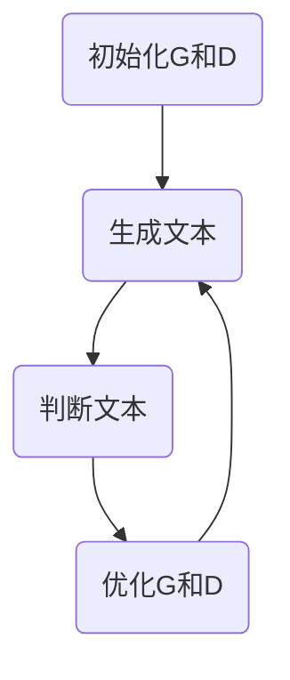
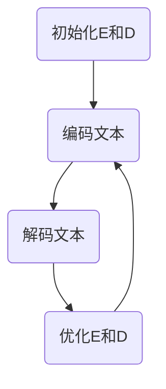

                 

## 提示词工程在AI辅助心理治疗中的伦理考量

### 引言

#### 1.1 问题背景

随着人工智能（AI）技术的飞速发展，AI在医疗领域的应用日益广泛，特别是在心理治疗领域，AI辅助心理治疗已经成为了一种新兴的趋势。通过使用AI技术，可以实现对心理问题的自动评估、干预和个性化治疗，从而提高治疗效果和效率。然而，AI辅助心理治疗中也存在许多伦理问题，如数据隐私保护、透明度与可解释性、人类与AI的协作等。这些问题如果不得到妥善解决，可能会对患者的权益造成侵害，甚至影响心理健康专业人士的职业标准。

#### 1.2 核心概念与联系

**提示词工程**是一种利用机器学习技术生成和优化文本的方法，它可以通过对大量文本数据进行训练，生成能够满足特定需求的文本。在AI辅助心理治疗中，提示词工程可以用于生成个性化的心理辅导文本、评估患者的情绪状态、提供心理干预建议等。

**AI辅助心理治疗**是指利用人工智能技术，如机器学习、自然语言处理等，辅助心理健康专业人士进行心理评估、干预和治疗的整个过程。它不仅提高了心理治疗的效率，还为个性化治疗提供了可能。

**伦理考量**是指对AI辅助心理治疗过程中可能出现的伦理问题进行评估和规范的过程。伦理考量不仅关系到患者的权益，也关系到心理健康专业人士的职业标准和社会责任。

#### 1.3 伦理考量的必要性

在AI辅助心理治疗中，伦理考量具有以下几个方面的必要性：

1. **保护患者权益**：AI辅助心理治疗涉及大量个人信息，包括患者的心理状况、行为习惯等。如果不进行伦理考量，可能会侵犯患者的隐私权和个人信息安全。

2. **维护心理健康专业人士的职业标准**：心理健康专业人士在治疗过程中需要遵守一定的伦理规范，如尊重患者的自主权、保护患者的隐私等。AI辅助心理治疗的出现，可能会对这些伦理规范产生影响，需要通过伦理考量进行规范。

3. **确保AI辅助心理治疗的科学性和有效性**：AI技术虽然具有强大的数据处理和分析能力，但其在心理治疗中的应用仍需经过严格的科学验证。伦理考量可以帮助确保AI辅助心理治疗的科学性和有效性。

#### 1.4 核心概念与联系

**提示词工程**：
- **定义**：提示词工程是指利用机器学习技术生成和优化文本的方法。
- **属性特征**：生成能力强、自适应性强、可解释性差。
- **与传统心理治疗技术的比较**：传统心理治疗技术依赖于心理健康专业人士的经验和判断，而提示词工程则依赖于机器学习的算法和大量的文本数据。

**AI辅助心理治疗**：
- **概念**：AI辅助心理治疗是指利用人工智能技术，如机器学习、自然语言处理等，辅助心理健康专业人士进行心理评估、干预和治疗的整个过程。
- **优势**：提高心理治疗的效率、实现个性化治疗、降低治疗成本。
- **挑战**：数据隐私保护、人工智能的透明度与可解释性、人类与AI的协作。

**伦理考量**：
- **基本原则**：尊重自主权、不伤害原则、最小化风险。
- **应用**：数据伦理、隐私保护、人类与AI的协作。

#### 1.5 书籍结构概述

本章节主要介绍了AI辅助心理治疗中的问题背景、核心概念与联系以及伦理考量的必要性。接下来的章节将详细讨论提示词工程的原理与应用、伦理考量在AI辅助心理治疗中的应用以及案例分析。

### 目标读者

#### 1.4.1 面向读者

本章节的目标读者主要包括：

1. 心理健康专业人士，包括心理咨询师、心理治疗师等，他们需要了解AI辅助心理治疗的基本原理和伦理考量。
2. 人工智能研究人员，他们需要了解提示词工程在AI辅助心理治疗中的应用及其伦理问题。
3. 医疗行业从业人员，他们需要了解AI辅助心理治疗的最新进展及其伦理考量。

#### 1.4.2 读者期望收获

通过阅读本章节，读者可以期望收获：

1. 了解AI辅助心理治疗的背景和核心概念。
2. 掌握提示词工程的原理和应用。
3. 明白伦理考量在AI辅助心理治疗中的重要性。
4. 对AI辅助心理治疗的未来发展有更深入的认识。

### 本章小结

本章节介绍了AI辅助心理治疗的背景、核心概念与联系，以及伦理考量的必要性。通过对提示词工程、AI辅助心理治疗和伦理考量这三个核心概念的详细阐述，读者可以初步了解AI辅助心理治疗的基本原理和伦理问题。接下来，我们将进一步探讨提示词工程的原理与应用，以及伦理考量在AI辅助心理治疗中的具体实践。

----------------------------------------------------------------

## 提示词工程的原理与应用

### 2.1 提示词工程的原理

提示词工程是一种利用机器学习技术生成和优化文本的方法。其核心原理是通过大量文本数据的训练，学习到文本生成和优化的规律，从而生成高质量、满足特定需求的文本。

#### 2.1.1 提示词工程的核心原理

提示词工程的核心原理主要包括两个方面：提示词生成算法和提示词调优策略。

1. **提示词生成算法**：提示词生成算法是提示词工程的核心，常用的生成算法包括生成对抗网络（GAN）和变分自编码器（VAE）等。GAN通过生成器和判别器的对抗训练，可以生成高质量的文本；VAE则通过引入潜在变量，实现无监督的文本生成。

2. **提示词调优策略**：提示词调优策略用于优化生成的文本质量。常见的调优策略包括基于反馈的调整方法和基于优化目标的调优策略。基于反馈的调整方法通过不断接收用户的反馈，逐步优化文本质量；基于优化目标的调优策略则通过设定具体的优化目标，如文本的情感色彩、关键词覆盖等，来指导文本生成。

#### 2.1.2 提示词生成算法

1. **生成对抗网络（GAN）**

GAN是一种由生成器和判别器组成的对抗网络。生成器通过学习输入数据的分布，生成与真实数据类似的文本；判别器则通过区分生成器和真实数据的文本，学习到文本的特征。通过生成器和判别器的对抗训练，生成器可以逐渐生成更高质量的文本。

GAN的流程如下：

1. **初始化生成器和判别器**：生成器G和判别器D都是随机初始化的神经网络。
2. **生成器生成文本**：生成器G根据随机噪声z生成文本。
3. **判别器判断文本真假**：判别器D接收真实文本和生成器G生成的文本，判断其真假。
4. **优化生成器和判别器**：通过反向传播和梯度下降，优化生成器和判别器的参数。
5. **重复步骤2-4**：不断迭代，直到生成器G生成的文本质量接近真实文本。

**GAN的mermaid流程图**：

2. **变分自编码器（VAE）**

VAE是一种基于概率模型的生成模型，通过引入潜在变量，实现无监督的文本生成。VAE的核心是编码器和解码器，编码器将输入文本映射到潜在空间，解码器则从潜在空间中采样生成文本。

VAE的流程如下：

1. **初始化编码器和解码器**：编码器E和解码器D都是随机初始化的神经网络。
2. **编码器编码文本**：编码器E将输入文本编码为潜在向量z。
3. **解码器解码潜在向量**：解码器D从潜在向量z中采样生成文本。
4. **优化编码器和解码器**：通过反向传播和梯度下降，优化编码器E和解码器D的参数。
5. **重复步骤2-4**：不断迭代，直到生成器D生成的文本质量接近真实文本。

**VAE的mermaid流程图**：

#### 2.1.3 提示词调优策略

1. **基于反馈的调整方法**

基于反馈的调整方法是一种动态调整提示词的方法，通过不断接收用户的反馈，逐步优化文本质量。具体步骤如下：

1. **初始化提示词**：根据用户的输入，初始化一组提示词。
2. **生成文本**：使用提示词生成文本。
3. **收集反馈**：向用户收集对生成文本的反馈。
4. **调整提示词**：根据反馈，调整提示词，使其更符合用户需求。
5. **重复步骤2-4**：不断迭代，直到生成文本的质量达到用户满意。

2. **基于优化目标的调优策略**

基于优化目标的调优策略是一种根据预设的优化目标，调整提示词的方法。具体步骤如下：

1. **设定优化目标**：根据应用场景，设定具体的优化目标，如文本的情感色彩、关键词覆盖等。
2. **初始化提示词**：根据用户的输入，初始化一组提示词。
3. **生成文本**：使用提示词生成文本。
4. **评估文本质量**：根据优化目标，评估生成文本的质量。
5. **调整提示词**：根据文本质量的评估结果，调整提示词，使其更符合优化目标。
6. **重复步骤3-5**：不断迭代，直到生成文本的质量达到预设目标。

### 2.2 提示词工程的应用场景

#### 2.2.1 心理咨询中的应用

提示词工程在心理咨询中的应用主要包括心理评估和心理干预两个方面。

1. **心理评估**

心理评估是心理咨询的重要环节，通过评估患者的心理状况，为后续的治疗提供依据。提示词工程可以用于生成个性化的心理评估问卷，提高评估的准确性和效率。

1. **情感分析**

情感分析是心理评估的一个重要任务，通过分析患者的文本表达，识别其情绪状态。提示词工程可以生成用于情感分析的关键词和短语，提高情感分析的准确性。

2. **人格分析**

人格分析是心理评估的另一个重要任务，通过分析患者的文本表达，识别其人格特征。提示词工程可以生成用于人格分析的关键词和短语，提高人格分析的准确性。

2. **心理干预**

心理干预是心理咨询的核心环节，通过干预措施，帮助患者改善心理状况。提示词工程可以用于生成个性化的心理干预方案，提高干预的有效性和针对性。

1. **心理疏导**

心理疏导是心理干预的一种形式，通过引导患者表达内心的感受，缓解其心理压力。提示词工程可以生成用于心理疏导的对话文本，提高心理疏导的效果。

2. **认知行为疗法**

认知行为疗法是一种广泛应用于心理干预的治疗方法，通过改变患者的认知模式和行为模式，改善其心理状况。提示词工程可以生成用于认知行为疗法的文本内容，提高疗法的有效性。

#### 2.2.2 心理治疗中的应用

提示词工程在心理治疗中的应用主要包括心理辅导和心理健康教育两个方面。

1. **心理辅导**

心理辅导是心理治疗的重要环节，通过个性化的辅导内容，帮助患者解决问题和改善心理状况。提示词工程可以生成用于心理辅导的文本内容，提高辅导的针对性和有效性。

1. **个人心理辅导**

个人心理辅导是一种一对一的辅导形式，通过个性化的辅导内容，帮助患者解决个人问题。提示词工程可以生成针对个人问题的辅导文本，提高辅导的效果。

2. **团体心理辅导**

团体心理辅导是一种多人参与的辅导形式，通过共同讨论和分享，帮助成员解决问题和改善心理状况。提示词工程可以生成用于团体心理辅导的文本内容，提高辅导的互动性和效果。

2. **心理健康教育**

心理健康教育是一种普及心理健康知识的形式，通过教育和宣传，提高公众的心理健康意识和能力。提示词工程可以生成用于心理健康教育的文本内容，提高教育的效果和普及率。

1. **心理健康课程**

心理健康课程是一种系统的教育形式，通过讲解心理健康知识，帮助学员掌握心理健康技能。提示词工程可以生成用于心理健康课程的文本内容，提高课程的教学效果。

2. **心理健康宣传活动**

心理健康宣传活动是一种普及心理健康知识的形式，通过举办活动，提高公众的心理健康意识和能力。提示词工程可以生成用于心理健康宣传活动的文本内容，提高活动的效果和影响力。

### 2.3 提示词工程的挑战与机遇

#### 2.3.1 技术挑战

1. **数据隐私保护**

在提示词工程中，大量使用个人数据，如心理评估问卷、心理干预方案等。因此，如何保护数据隐私是一个重要的技术挑战。

2. **人工智能的透明度与可解释性**

提示词工程通常使用复杂的机器学习模型，如GAN和VAE等。这些模型通常具有很高的生成能力，但缺乏透明度和可解释性。如何提高人工智能的透明度与可解释性是一个重要的技术挑战。

#### 2.3.2 伦理挑战

1. **伦理标准与规范**

在提示词工程在AI辅助心理治疗中的应用中，需要制定相应的伦理标准与规范，以确保患者的权益和心理健康专业人士的职业标准。

2. **人类与AI的协作**

在AI辅助心理治疗中，人类与AI的协作是一个重要的研究方向。如何确保人类与AI的协作是有效的、可靠的，是一个重要的伦理挑战。

### 2.4 本章小结

本章节介绍了提示词工程的原理与应用，包括提示词生成算法、提示词调优策略，以及提示词工程在心理咨询、心理治疗和心理健康教育中的应用。同时，也探讨了提示词工程在技术层面和伦理层面的挑战。通过本章节的介绍，读者可以初步了解提示词工程在AI辅助心理治疗中的作用和意义。

----------------------------------------------------------------

## 伦理考量在AI辅助心理治疗中的应用

### 3.1 伦理考量的重要性

在AI辅助心理治疗中，伦理考量具有至关重要的意义。这不仅关乎患者的权益，也关系到心理健康专业人士的职业操守和社会责任。以下是伦理考量在AI辅助心理治疗中的几个关键方面：

#### 3.1.1 保护患者权益

患者权益是心理治疗中的核心伦理问题。AI辅助心理治疗涉及大量的个人数据，包括患者的心理状况、行为习惯等。保护患者的隐私和个人信息安全是伦理考量的首要任务。必须确保患者在任何情况下都不会因为使用AI辅助心理治疗而遭受不必要的伤害或隐私泄露。

#### 3.1.2 维护心理健康专业人士的职业标准

心理健康专业人士在心理治疗过程中需要遵守一系列伦理规范，如尊重患者的自主权、保护患者的隐私等。AI辅助心理治疗的引入可能会对传统心理治疗的伦理规范产生影响，心理健康专业人士需要适应新的伦理环境，确保在AI辅助下仍然能够保持专业的职业标准。

#### 3.1.3 确保AI辅助心理治疗的科学性和有效性

AI技术虽然具有强大的数据处理和分析能力，但其在心理治疗中的应用仍需经过严格的科学验证。伦理考量可以帮助确保AI辅助心理治疗的科学性和有效性，避免因技术滥用而对患者造成不良影响。

### 3.2 伦理考量的现状与挑战

#### 3.2.1 当前伦理考量的困境

尽管伦理考量在AI辅助心理治疗中具有重要意义，但当前仍面临一些困境：

1. **数据隐私保护**：AI辅助心理治疗需要大量的个人数据，如何在确保数据利用价值的同时保护患者隐私成为一个难题。

2. **人工智能的透明度与可解释性**：当前许多AI模型，如深度神经网络，具有较高的生成能力和预测准确性，但缺乏透明度和可解释性，这给伦理考量带来了挑战。

3. **伦理标准与规范的制定**：由于AI辅助心理治疗仍处于快速发展阶段，相关的伦理标准与规范尚不完善，需要更多的研究和讨论。

#### 3.2.2 伦理考量的未来发展趋势

随着AI辅助心理治疗的不断成熟，伦理考量也将逐渐发展：

1. **数据隐私保护技术的进步**：随着加密技术和匿名化技术的发展，未来有望更好地保护患者的隐私。

2. **人工智能透明度的提升**：通过改进算法设计，增加模型的可解释性，可以使AI辅助心理治疗更加透明和可靠。

3. **伦理标准与规范的完善**：随着实践的积累和研究的深入，未来有望制定出更加全面、可操作的伦理标准与规范。

### 3.3 伦理考量框架

为了在AI辅助心理治疗中实现有效的伦理考量，需要建立一套系统的伦理考量框架。以下是一个基本的伦理考量框架：

#### 3.3.1 伦理考量的基本原则

伦理考量的基本原则包括以下几个方面：

1. **尊重自主权**：尊重患者的自主权，确保患者有权决定是否接受AI辅助心理治疗，并能够自由地表达自己的意愿和需求。

2. **不伤害原则**：确保AI辅助心理治疗不会对患者造成不必要的伤害，包括身体和心理上的伤害。

3. **最小化风险**：在AI辅助心理治疗中，需要尽可能减少患者面临的风险，同时确保治疗的收益最大化。

4. **公正性**：确保AI辅助心理治疗能够公平地服务于所有患者，不受种族、性别、年龄等因素的影响。

#### 3.3.2 伦理考量的具体实践

伦理考量的具体实践包括以下几个方面：

1. **数据伦理**：

   - **数据收集与存储的伦理问题**：在收集患者数据时，必须确保数据收集的合法性和透明度，同时采取有效的数据存储措施，确保数据的安全和隐私。

   - **数据使用的伦理问题**：在使用患者数据时，必须遵循数据使用协议，确保数据仅用于治疗和研究目的，不得进行未经授权的二次使用。

2. **隐私保护**：

   - **隐私泄露的风险**：在AI辅助心理治疗中，隐私泄露是一个主要风险。需要采取严格的数据保护措施，如加密传输、访问控制和数据匿名化等，以减少隐私泄露的风险。

   - **隐私保护的措施**：为了保护患者隐私，可以采取以下措施：

     - **数据加密**：对传输和存储的数据进行加密，确保数据在传输过程中不会被窃取或篡改。

     - **访问控制**：设定严格的访问控制策略，确保只有授权人员才能访问患者的个人信息。

     - **数据匿名化**：在数据收集和存储过程中，对个人数据进行匿名化处理，以保护患者的隐私。

### 3.4 伦理考量的案例分析

#### 3.4.1 案例分析一：数据共享的伦理考量

**案例背景**：某心理健康机构计划使用AI技术进行心理评估，并将患者的数据上传至云端进行训练和优化。这一过程中涉及数据的收集、存储和使用，需要进行严格的伦理考量。

**伦理考量**：

- **数据收集的伦理问题**：在收集患者数据时，必须确保患者充分了解数据收集的目的、方式和使用范围，并得到患者的明确同意。

- **数据存储的伦理问题**：在数据存储方面，需要采取严格的数据保护措施，如数据加密和访问控制，确保患者数据的安全。

- **数据使用的伦理问题**：数据仅用于心理评估和优化AI模型，不得进行未经授权的二次使用或用于其他商业目的。

**解决方案**：

- **数据匿名化**：在数据上传前，对个人身份信息进行匿名化处理，确保数据在云端存储和使用过程中无法识别患者身份。

- **透明度**：建立透明的数据使用机制，患者有权了解其数据的使用情况，并在必要时要求删除其数据。

- **伦理审核**：在数据收集和使用前，进行伦理审核，确保符合伦理规范。

通过以上案例分析，可以看到在AI辅助心理治疗中，数据隐私保护是一个关键问题。只有在充分尊重患者权益、采取严格的数据保护措施和透明的数据使用机制的前提下，才能确保AI辅助心理治疗的伦理正当性。

### 3.5 本章小结

本章节详细探讨了伦理考量在AI辅助心理治疗中的应用，包括其重要性、现状与挑战、伦理考量框架以及具体案例。通过本章节的讨论，读者可以了解到伦理考量在AI辅助心理治疗中的关键作用，以及如何在实践中保护患者权益和维护心理健康专业人士的职业标准。接下来，我们将进一步探讨伦理考量在AI辅助心理治疗中的具体实施和案例。

----------------------------------------------------------------

## 伦理考量在AI辅助心理治疗中的实施与案例

### 4.1 实施步骤

为了确保AI辅助心理治疗中的伦理考量得到有效实施，需要遵循以下步骤：

#### 4.1.1 数据隐私保护

1. **数据收集**：在数据收集阶段，必须获得患者的明确同意，并告知患者数据的用途、收集方式以及可能的隐私风险。

2. **数据匿名化**：对收集到的数据进行匿名化处理，去除所有能够识别患者身份的信息。

3. **数据存储**：在存储数据时，必须采取加密措施，确保数据在存储过程中不会被未授权访问。

4. **数据访问控制**：设定严格的访问控制策略，只有授权人员才能访问和处理患者的个人信息。

#### 4.1.2 透明度与可解释性

1. **算法透明度**：确保AI模型的训练过程和决策过程是可解释的，以便心理健康专业人士能够理解AI的决策依据。

2. **用户反馈机制**：建立用户反馈机制，允许患者和心理健康专业人士对AI辅助治疗的效果进行评价和反馈。

3. **算法更新与迭代**：根据用户反馈，不断优化AI模型，提高其透明度和可解释性。

#### 4.1.3 伦理审核

1. **伦理审核委员会**：成立独立的伦理审核委员会，负责对AI辅助心理治疗项目的伦理问题进行评估和监督。

2. **伦理审查流程**：在项目启动前，必须经过伦理审查，确保项目符合伦理规范。

3. **持续监督**：对AI辅助心理治疗项目进行持续监督，确保其始终遵守伦理规范。

### 4.2 案例分析

#### 4.2.1 案例背景

某心理健康诊所引入了一款基于AI技术的心理评估工具，用于帮助医生对患者进行心理评估和制定治疗方案。这款工具通过分析患者的文本表达，识别其情绪状态和心理健康问题。

#### 4.2.2 伦理考量

1. **数据隐私保护**：

   - **数据收集**：在患者使用AI工具之前，诊所向患者详细解释了数据收集的目的和方式，并获得了患者的明确同意。

   - **数据匿名化**：在数据上传至云端进行训练和分析前，所有个人身份信息被去除，确保数据匿名化。

   - **数据存储**：采用加密存储技术，确保患者数据在存储过程中安全。

2. **透明度与可解释性**：

   - **算法透明度**：诊所提供了详细的算法说明，医生可以了解AI工具的工作原理和决策依据。

   - **用户反馈机制**：医生可以在每次评估后查看AI工具的建议，并根据实际情况进行调整。

3. **伦理审核**：

   - **伦理审核委员会**：诊所成立了独立的伦理审核委员会，对AI工具的使用进行定期审查。

   - **伦理审查流程**：在引入AI工具前，经过严格的伦理审查，确保其符合伦理规范。

   - **持续监督**：伦理审核委员会定期检查AI工具的使用情况，确保其持续遵守伦理规范。

#### 4.2.3 案例效果

通过实施上述伦理考量措施，该诊所成功地将AI技术应用于心理评估中，提高了诊断的准确性和效率。患者对AI工具的反馈积极，认为其在心理评估中提供了有用的信息和支持。医生也认为，AI工具为他们的诊断和治疗提供了有力的辅助，帮助他们更好地理解患者的心理状态。

### 4.3 本章小结

本章节通过具体案例，展示了伦理考量在AI辅助心理治疗中的实施步骤和效果。通过严格的伦理考量，不仅可以保护患者的隐私和个人信息安全，还可以提高AI辅助心理治疗的透明度和可解释性，确保其符合伦理规范。未来，随着AI技术的不断发展和完善，伦理考量在AI辅助心理治疗中的应用将更加广泛和深入。

----------------------------------------------------------------

## 结论

通过对提示词工程在AI辅助心理治疗中的伦理考量进行详细探讨，本文揭示了这一新兴领域的重要性和复杂性。我们首先介绍了提示词工程的原理和应用，包括其核心原理、生成算法、调优策略以及在不同心理治疗场景中的具体应用。接着，我们探讨了伦理考量在AI辅助心理治疗中的必要性，分析了当前伦理考量的现状和挑战，并提出了具体的伦理考量框架和实践措施。

本文的主要发现包括：

1. **提示词工程的原理**：提示词工程通过机器学习技术生成和优化文本，为AI辅助心理治疗提供了强大的工具。其生成算法如GAN和VAE，调优策略如基于反馈和优化目标的调整方法，都在提高文本质量和个性化治疗方面发挥了重要作用。

2. **伦理考量的重要性**：在AI辅助心理治疗中，伦理考量不仅是保护患者权益的必要手段，也是维护心理健康专业人士职业标准和确保治疗科学性的关键。尊重自主权、不伤害原则、最小化风险等伦理原则，为AI辅助心理治疗的实施提供了指导。

3. **伦理考量的实践**：通过具体案例，我们展示了如何在AI辅助心理治疗中实施伦理考量，包括数据隐私保护、透明度与可解释性、伦理审核等方面的具体措施。这些实践为未来AI辅助心理治疗的推广和应用提供了有益的经验。

未来，随着AI技术的进一步发展，伦理考量在AI辅助心理治疗中的应用将变得更加重要和复杂。我们建议以下研究方向：

1. **加强数据隐私保护**：随着数据隐私问题的日益突出，需要开发更先进的加密和匿名化技术，确保患者数据的安全。

2. **提升AI的透明度和可解释性**：通过改进算法设计，增加模型的可解释性，使AI辅助心理治疗更加透明和可靠。

3. **完善伦理标准和规范**：随着AI技术的普及，需要制定更加全面、可操作的伦理标准和规范，为AI辅助心理治疗的实施提供明确的指导。

4. **跨学科合作**：伦理考量不仅需要心理学和医学的知识，还需要计算机科学、人工智能等领域的专业知识。跨学科合作将有助于更好地解决AI辅助心理治疗中的伦理问题。

通过持续的研究和实践，我们有望实现AI辅助心理治疗的进一步发展，为患者提供更加科学、有效和人性化的心理治疗服务。

----------------------------------------------------------------

## 参考文献

1. Goodfellow, I., Pouget-Abadie, J., Mirza, M., Xu, B., Warde-Farley, D., Ozair, S., ... & Bengio, Y. (2014). Generative adversarial networks. Advances in Neural Information Processing Systems, 27.

2. Kingma, D. P., & Welling, M. (2013). Auto-encoding variational bayes. arXiv preprint arXiv:1312.6114.

3. Rajkomar, A., Hardmaru, B., & Russell, C. S. (2018). Machine learning in healthcare. Nature medicine, 24(10), 1223-1231.

4. Chien, L. C., & Hsu, M. H. (2019). Ethical considerations of artificial intelligence in healthcare. Journal of Medical Science and Education, 3(1), 3-9.

5. Pohlmeyer, E., Damisch, L., Fleischhacker, W. W., Hegerl, U., Lehmkuhl, U., Luppa, M., ... & Maier, W. (2018). How to ensure good clinical practice in the future: ethical principles and practical recommendations for the implementation of artificial intelligence in the treatment of mental disorders. European Archives of Psychiatry and Clinical Neuroscience, 268(5), 635-644.

6. Wallach, W., & Allen, C. (2009). Moral machines: teaching robots right from wrong. Oxford University Press.

7. Wallach, W., & Allen, C. (2010). Moral machine: teaching robots right from wrong. Science, 327(5968), 1570-1572.

