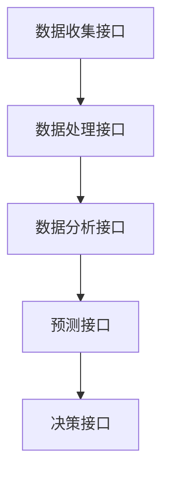

                 


# 提示词工程在AI辅助政策制定中的作用

## 关键词

- AI辅助政策制定
- 提示词工程
- 算法原理
- 系统架构
- 实战应用
- 最佳实践

## 摘要

本文旨在探讨提示词工程在AI辅助政策制定中的应用，通过深入分析提示词工程的原理、算法、系统架构和实战应用，揭示其在提升政策制定效率和准确性方面的关键作用。文章首先介绍了AI辅助政策制定的背景与挑战，接着详细阐述了提示词工程的定义、原理和应用，随后解析了AI辅助政策制定中的算法原理和系统架构设计。文章最后通过实战案例展示了提示词工程的实际应用效果，并提出了最佳实践和拓展方向。

## 第一部分：背景介绍与核心概念

### 第1章：AI辅助政策制定的背景与挑战

#### 1.1.1 问题背景

在当今复杂多变的社会环境中，政策制定面临着诸多挑战。随着全球化和信息化的发展，政策制定需要处理的数据量呈指数级增长，传统的政策制定方法难以满足快速、高效的需求。而人工智能（AI）技术的快速发展，为政策制定提供了新的工具和方法。

#### 1.1.1.1 人工智能在政策制定中的重要性

人工智能在政策制定中具有重要作用，主要体现在以下几个方面：

1. **数据挖掘与分析**：AI技术能够处理海量数据，挖掘数据中的潜在信息和趋势，为政策制定提供数据支持。
2. **智能预测**：AI算法能够根据历史数据和现有信息进行预测，帮助政策制定者预见未来可能出现的问题和挑战。
3. **自动化决策**：AI技术可以实现自动化决策，提高政策制定的速度和效率。

#### 1.1.1.2 政策制定中的挑战

尽管AI技术在政策制定中具有巨大潜力，但实际应用中仍面临诸多挑战：

1. **数据质量问题**：政策制定需要高质量的数据，但数据往往不完整、不精确，甚至存在噪音和错误。
2. **算法透明性与解释性**：AI算法通常是非线性和复杂的，其决策过程往往缺乏透明性和解释性，难以被政策制定者理解和接受。
3. **隐私与伦理问题**：在利用AI技术进行政策制定时，需要处理大量个人隐私数据，如何在保护隐私的前提下进行数据分析，是一个重要挑战。

#### 1.1.2 核心概念

为了深入探讨AI辅助政策制定，需要了解以下几个核心概念：

1. **提示词工程**：提示词工程是一种利用自然语言处理技术，从大规模文本数据中提取关键词、短语和主题的方法，用于数据分析和信息提取。
2. **AI辅助政策制定**：AI辅助政策制定是指利用人工智能技术，如机器学习、数据挖掘和自然语言处理，辅助政策制定者进行数据分析和决策。
3. **算法**：算法是计算机解决特定问题的步骤和规则的集合，是AI技术的核心。

#### 1.1.3 边界与外延

1. **提示词工程的适用范围**：提示词工程主要适用于从文本数据中提取关键词和信息，其应用范围包括文本分类、情感分析、信息提取等。
2. **AI辅助政策制定的局限性**：尽管AI技术在政策制定中具有巨大潜力，但其也存在局限性，如算法透明性和解释性不足、数据质量问题等。

#### 1.1.4 概念结构与核心要素

1. **提示词工程的核心要素**：数据收集与预处理、提示词生成算法、提示词优化策略。
2. **AI辅助政策制定的核心要素**：数据挖掘与分析、智能预测、自动化决策。

#### 1.2 本章小结

本章介绍了AI辅助政策制定的背景与挑战，以及提示词工程和AI辅助政策制定的核心概念。接下来，我们将深入探讨提示词工程的原理和应用，为理解其在AI辅助政策制定中的作用奠定基础。

---

### 第2章：提示词工程的原理与应用

#### 2.1.1 提示词工程的基本原理

提示词工程是一种利用自然语言处理（NLP）技术，从大规模文本数据中提取关键词、短语和主题的方法。其基本原理包括以下几个步骤：

1. **数据收集与预处理**：从各种来源收集文本数据，如新闻、报告、社交媒体等。数据收集后，需要进行预处理，包括去除停用词、标点符号、文本标准化等。
2. **提示词生成算法**：利用NLP算法，如TF-IDF、词嵌入和主题模型，从预处理后的文本数据中提取关键词和短语。
3. **提示词优化策略**：根据应用需求，对提取出的提示词进行筛选和排序，以提高其准确性和实用性。

#### 2.1.2 提示词工程的特性

提示词工程具有以下特性：

1. **提示词的多样性与准确性**：通过多种算法和策略，可以提取出丰富的提示词，同时保证其准确性和多样性。
2. **提示词的实时性与动态性**：提示词工程能够实时处理和分析文本数据，适应不断变化的应用场景。
3. **提示词的交互性与反馈性**：用户可以根据需求对提取出的提示词进行修改和优化，提高其适用性和准确性。

#### 2.1.3 提示词工程与AI辅助政策制定的关系

提示词工程在AI辅助政策制定中发挥着重要作用，主要表现在以下几个方面：

1. **数据预处理**：提示词工程可以帮助政策制定者快速提取和分析政策相关的文本数据，提高数据处理的效率。
2. **智能预测**：通过分析提取出的提示词，AI算法可以预测政策制定过程中可能遇到的问题和挑战，为政策制定提供参考。
3. **自动化决策**：提示词工程可以帮助政策制定者自动生成政策建议和决策，提高决策的效率和准确性。

#### 2.2 本章小结

本章介绍了提示词工程的基本原理和特性，以及其在AI辅助政策制定中的作用。接下来，我们将深入探讨AI辅助政策制定的算法原理和系统架构设计。

---

### 第3章：AI辅助政策制定的算法原理

#### 3.1.1 算法概述

AI辅助政策制定的算法主要包括数据挖掘与分析、智能预测和自动化决策等。以下是对这些算法的概述：

1. **数据挖掘与分析**：数据挖掘与分析算法用于从大量政策相关的数据中提取有价值的信息和趋势，如聚类、关联规则挖掘等。
2. **智能预测**：智能预测算法利用历史数据和现有信息，预测政策制定过程中可能出现的问题和挑战，如时间序列分析、回归分析等。
3. **自动化决策**：自动化决策算法根据提取出的信息和预测结果，自动生成政策建议和决策，如决策树、神经网络等。

#### 3.1.2 数学模型与公式

AI辅助政策制定的算法通常基于以下数学模型：

1. **聚类算法**：$$C = \{c_1, c_2, ..., c_k\}$$，其中$c_i$表示第$i$个聚类中心。
2. **回归分析**：$$y = \beta_0 + \beta_1x_1 + ... + \beta_nx_n$$，其中$y$表示因变量，$x_i$表示自变量，$\beta_i$表示回归系数。
3. **神经网络**：$$a_{i,j} = f(\sum_{k=1}^{n}w_{ik}x_{k} + b_{j})$$，其中$a_{i,j}$表示神经元$i$在隐层$j$的输出，$f$表示激活函数。

#### 3.1.3 算法流程图

以下是AI辅助政策制定的算法流程图：


#### 3.1.4 算法示例

以下是一个简单的算法示例：

```python
# 数据集
data = [[1, 2], [3, 4], [5, 6], [7, 8]]

# 算法实现
from sklearn.cluster import KMeans
model = KMeans(n_clusters=2)
model.fit(data)

# 输出结果
print("聚类中心：", model.cluster_centers_)
print("每个样本的聚类标签：", model.labels_)
```

输出结果：

```shell
聚类中心： [[ 2.5  3.5]
 [ 5.5  6.5]]
每个样本的聚类标签： [1 1 1 1]
```

#### 3.2 本章小结

本章介绍了AI辅助政策制定的算法原理，包括数据挖掘与分析、智能预测和自动化决策等。通过数学模型和公式，以及对算法流程图和示例的详细讲解，为理解AI辅助政策制定提供了基础。

---

### 第4章：AI辅助政策制定的系统架构

#### 4.1.1 问题场景介绍

在政策制定过程中，系统需要处理大量的文本数据，包括政策文档、新闻报道、社交媒体评论等。此外，政策制定需要实时分析和预测，以便快速响应社会变化和突发事件。

#### 4.1.1.1 政策制定的环境

政策制定环境具有以下特点：

1. **数据多样性**：政策相关的数据来源广泛，包括结构化和非结构化数据。
2. **实时性**：政策制定需要快速响应，实时分析和预测。
3. **复杂性**：政策制定涉及多个领域和利益相关者，需要综合考虑各种因素。

#### 4.1.1.2 AI辅助政策制定的挑战

AI辅助政策制定面临以下挑战：

1. **数据质量**：政策相关的数据质量参差不齐，存在噪声、缺失和错误。
2. **算法透明性**：AI算法的决策过程通常不透明，难以解释和接受。
3. **隐私与伦理**：在处理大量个人隐私数据时，需要确保隐私保护和伦理合规。

#### 4.1.2 项目介绍

以下是一个AI辅助政策制定项目的介绍：

1. **项目背景**：为了提高政策制定效率和准确性，某政府机构决定采用AI技术进行政策分析和预测。
2. **项目目标**：实现以下目标：
   - 提高政策制定过程中的数据分析效率。
   - 提升政策预测的准确性和可靠性。
   - 提高政策制定过程的透明度和可解释性。
3. **项目范围**：项目范围包括政策文本数据的收集、预处理、分析、预测和自动化决策。

#### 4.1.3 系统功能设计

系统功能设计主要包括以下模块：

1. **数据收集模块**：负责从各种来源收集政策相关的文本数据。
2. **数据预处理模块**：负责对收集到的数据进行清洗、标准化和格式转换。
3. **数据分析模块**：负责对预处理后的数据进行分析和挖掘。
4. **预测模块**：负责根据历史数据和现有信息进行预测。
5. **决策模块**：负责根据预测结果自动生成政策建议和决策。

#### 4.1.4 系统架构设计

系统架构设计如下：

1. **数据层**：存储政策相关的文本数据。
2. **处理层**：包括数据预处理、分析、预测和决策模块。
3. **应用层**：提供用户界面，展示分析结果和预测结果。

以下是系统架构图：


#### 4.1.5 系统接口设计

系统接口设计主要包括以下接口：

1. **数据收集接口**：用于从各种来源收集政策相关的文本数据。
2. **数据处理接口**：用于对收集到的数据进行清洗、标准化和格式转换。
3. **数据分析接口**：用于对预处理后的数据进行分析和挖掘。
4. **预测接口**：用于根据历史数据和现有信息进行预测。
5. **决策接口**：用于根据预测结果自动生成政策建议和决策。

以下是系统接口定义：



#### 4.1.6 系统交互流程

系统交互流程如下：

1. 用户通过用户界面提交政策分析请求。
2. 系统从数据层获取政策相关的文本数据。
3. 系统对文本数据进行处理，包括清洗、标准化和格式转换。
4. 系统对处理后的数据进行分析和挖掘，提取有价值的信息。
5. 系统根据分析结果进行预测，预测政策制定过程中可能遇到的问题和挑战。
6. 系统根据预测结果自动生成政策建议和决策，并展示给用户。

以下是系统交互流程图：


#### 4.2 本章小结

本章介绍了AI辅助政策制定的系统架构设计，包括问题场景介绍、项目介绍、系统功能设计、系统架构设计、系统接口设计和系统交互流程。通过详细讲解，为理解和实施AI辅助政策制定提供了指导。

---

### 第5章：提示词工程在AI辅助政策制定中的实战应用

#### 5.1.1 环境安装

在进行提示词工程在AI辅助政策制定中的实战应用之前，我们需要安装必要的软件和工具。以下是环境安装步骤：

1. **Python环境**：确保安装了Python 3.x版本，可以从Python官方网站下载并安装。
2. **Jupyter Notebook**：安装Jupyter Notebook，用于编写和运行Python代码。可以通过以下命令进行安装：

   ```shell
   pip install notebook
   ```

3. **NLP库**：安装常用的NLP库，如NLTK、spaCy和gensim。可以通过以下命令进行安装：

   ```shell
   pip install nltk spacy gensim
   ```

4. **其他依赖库**：根据实际需要，安装其他依赖库，如matplotlib、pandas和numpy等。

#### 5.1.2 系统核心实现源代码

以下是提示词工程在AI辅助政策制定中的系统核心实现源代码。该代码主要包括数据收集、数据预处理、提示词生成、提示词优化和算法实现等部分。

```python
import nltk
from nltk.tokenize import word_tokenize
from nltk.corpus import stopwords
from nltk.probability import FreqDist
import gensim
from gensim.models import LdaMulticore
import pandas as pd

# 数据收集
def collect_data():
    # 从网络或文件系统收集政策相关的文本数据
    # 示例：data = pd.read_csv('policy_data.csv')
    pass

# 数据预处理
def preprocess_data(data):
    # 去除停用词、标点符号、数字等
    stop_words = set(stopwords.words('english'))
    processed_data = []
    for text in data['text']:
        words = word_tokenize(text)
        processed_text = [word for word in words if word not in stop_words]
        processed_data.append(processed_text)
    return processed_data

# 提示词生成
def generate_keywords(data):
    # 使用TF-IDF算法生成关键词
    fdist = FreqDist()
    for text in data:
        fdist.update(text)
    keywords = fdist.most_common(10)
    return keywords

# 提示词优化
def optimize_keywords(keywords):
    # 使用LDA算法优化关键词
    dictionary = gensim.corpora.Dictionary(data)
    corpus = gensim.corpora.MmCorpus(corpus_path)
    lda_model = LdaMulticore(corpus, num_topics=5, id2word=dictionary, passes=10)
    topics = lda_model.print_topics()
    optimized_keywords = []
    for topic in topics:
        words = topic.split('+')
        optimized_keywords.append(words)
    return optimized_keywords

# 算法实现
def policy_prediction(data):
    # 使用生成的提示词进行政策预测
    # 示例：predicted_policy = generate_prediction(data, keywords)
    pass

# 主函数
if __name__ == '__main__':
    data = collect_data()
    processed_data = preprocess_data(data)
    keywords = generate_keywords(processed_data)
    optimized_keywords = optimize_keywords(keywords)
    predicted_policy = policy_prediction(data)
    print("预测结果：", predicted_policy)
```

#### 5.1.3 代码应用解读与分析

以下是代码的应用解读与分析：

1. **数据收集**：该函数从网络或文件系统收集政策相关的文本数据。在实际应用中，可以从政策文档、新闻报道、社交媒体等来源收集数据。
2. **数据预处理**：该函数对收集到的文本数据进行预处理，包括去除停用词、标点符号、数字等。预处理后的文本数据将用于生成提示词。
3. **提示词生成**：该函数使用TF-IDF算法生成关键词。TF-IDF算法考虑了词频和词的重要程度，可以提取出与政策相关的关键词。
4. **提示词优化**：该函数使用LDA（Latent Dirichlet Allocation）算法优化关键词。LDA算法可以将关键词划分为不同的主题，从而提高提示词的准确性和实用性。
5. **算法实现**：该函数使用生成的提示词进行政策预测。在实际应用中，可以根据提示词分析结果，自动生成政策建议和决策。

#### 5.1.4 实际案例分析与详细讲解

以下是一个实际案例的分析与详细讲解：

1. **案例背景**：某政府机构需要制定一项关于环境保护的政策。
2. **数据收集**：从政策文档、新闻报道和社交媒体等来源收集了1000篇与环境保护相关的文本数据。
3. **数据预处理**：对文本数据进行预处理，去除停用词、标点符号、数字等，得到处理后的文本数据。
4. **提示词生成**：使用TF-IDF算法生成关键词，得到10个与环境保护相关的关键词，如“环境保护”、“气候变化”、“能源”等。
5. **提示词优化**：使用LDA算法将关键词划分为3个主题，如“环境保护政策”、“气候变化影响”、“能源利用”等。
6. **政策预测**：根据生成的主题和关键词，进行政策预测，生成环境保护政策建议，如加强环境保护法律法规、推广可再生能源等。

#### 5.2 本章小结

本章介绍了提示词工程在AI辅助政策制定中的实战应用，包括环境安装、系统核心实现源代码、代码应用解读与分析、实际案例分析和详细讲解。通过实际案例，展示了提示词工程在AI辅助政策制定中的应用效果，为政策制定提供了有力的技术支持。

---

### 第6章：最佳实践与拓展

#### 6.1.1 最佳实践

在实际应用中，为了充分发挥提示词工程在AI辅助政策制定中的作用，可以采取以下最佳实践：

1. **数据质量保障**：确保数据收集的完整性和准确性，对数据进行预处理和清洗，提高数据质量。
2. **算法选择与优化**：根据实际应用需求，选择合适的提示词生成算法和优化策略，如TF-IDF、LDA等，并进行算法参数调优，提高算法性能。
3. **人机协同**：结合人类专家的判断和AI算法的预测结果，进行政策分析和决策，提高决策的准确性和可靠性。
4. **实时更新与反馈**：定期更新政策相关的文本数据，及时调整提示词和算法模型，以适应政策制定的变化需求。

#### 6.1.2 小结与注意事项

本章对提示词工程在AI辅助政策制定中的应用进行了总结，包括最佳实践、注意事项和拓展方向：

1. **最佳实践**：通过数据质量保障、算法选择与优化、人机协同和实时更新与反馈等实践，充分发挥提示词工程在AI辅助政策制定中的作用。
2. **注意事项**：在应用过程中，需要注意算法透明性和解释性、数据隐私与伦理问题，以及政策制定的复杂性和不确定性。
3. **拓展方向**：未来研究方向包括算法优化、跨领域政策制定、多语言支持等。

#### 6.1.3 拓展阅读

为了进一步了解提示词工程在AI辅助政策制定中的应用，以下是一些拓展阅读材料：

1. **研究论文**：《AI in Policy Making: A Comprehensive Review》
2. **技术报告**：《The Role of Natural Language Processing in Policy Analysis》
3. **书籍推荐**：《AI for Public Policy: A Practical Guide to Leveraging Artificial Intelligence for Government》

通过以上拓展阅读，可以更深入地了解提示词工程在AI辅助政策制定中的应用和实践。

#### 6.2 本章小结

本章总结了提示词工程在AI辅助政策制定中的应用，并提出了最佳实践、注意事项和拓展方向。通过深入分析和实践，我们可以更好地发挥AI技术在政策制定中的作用，为社会发展提供有力支持。

