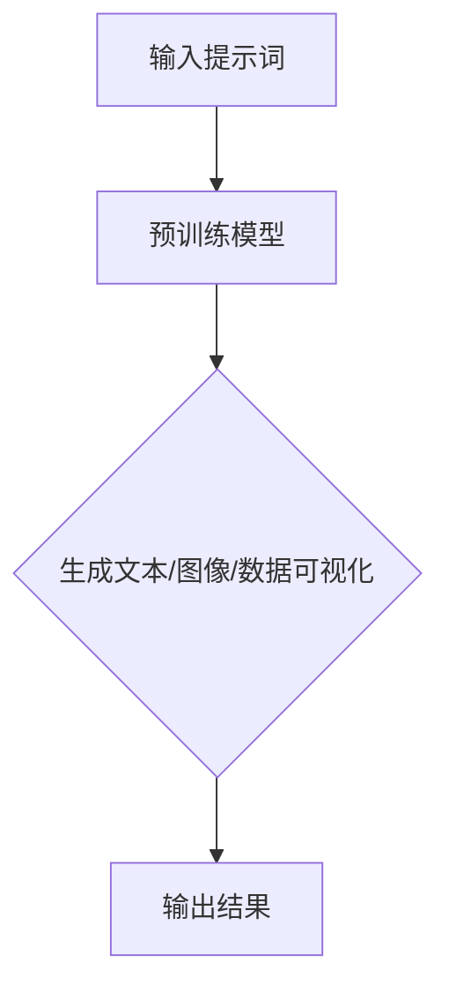
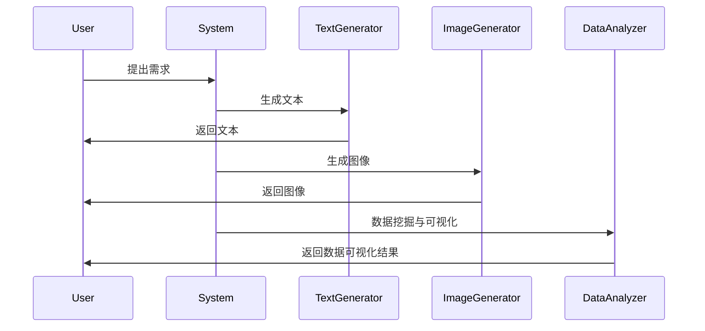
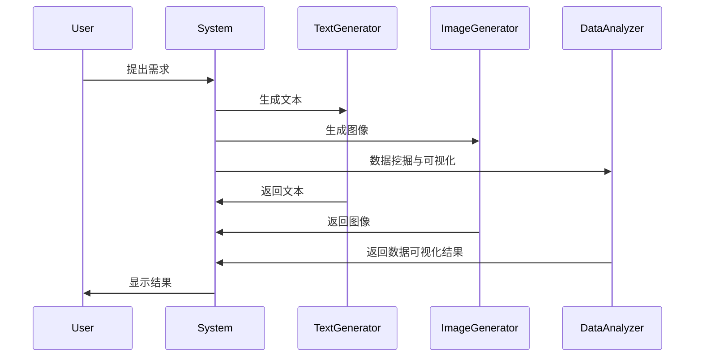

                 

### 提示词工程在AI辅助科幻创作中的应用：拓展人类想象力边界

#### 关键词：
- 提示词工程
- AI辅助科幻创作
- 想象力拓展
- 文本生成
- 图像生成
- 数据挖掘与可视化

#### 摘要：
本文探讨了提示词工程在AI辅助科幻创作中的应用，通过分析其原理与属性特征，揭示其在拓展人类想象力边界中的潜力。文章首先介绍了提示词工程和AI技术在科幻创作中的应用背景，然后对比了两者在属性特征上的异同，详细阐述了算法原理，并通过Python源代码实现展示其在科幻创作中的应用效果。最后，文章展望了未来发展的趋势和可能面临的挑战，为AI辅助科幻创作提供了新的思路和方向。

---

### 第一部分：引言与背景介绍

#### 1.1 问题背景

##### 1.1.1 人工智能与科幻创作的结合

近年来，人工智能（AI）技术的快速发展为科幻创作带来了前所未有的机遇。从早期的科幻电影、小说到现代的虚拟现实、增强现实技术，人工智能已经成为推动科幻创作的重要力量。AI不仅能够为创作者提供丰富的工具和资源，还能通过模拟和预测未来科技的发展，拓展人类的想象力边界。

##### 1.1.2 提示词工程的基本概念

提示词工程是一种利用人工智能技术生成文本、图像和其他形式内容的方法。它通过分析大量文本数据，提取关键信息和特征，生成与给定提示词相关的新内容。提示词工程的核心在于如何从大量的数据中提取有用的信息，并生成具有创造性和想象力的内容。

##### 1.1.3 AI辅助科幻创作的价值

AI辅助科幻创作具有以下价值：

1. **提高创作效率**：通过自动化生成内容，创作者可以节省大量时间和精力，将更多的精力投入到创意构思和故事情节的打磨上。
2. **拓展想象力边界**：AI技术能够模拟和预测未来的科技发展，帮助创作者构思出更具创意和想象力的科幻世界。
3. **丰富创作形式**：AI不仅能够生成文本，还能生成图像、音频、视频等多媒体内容，为科幻创作提供了更加多样化的表现形式。
4. **创新创作模式**：AI辅助科幻创作可以打破传统创作模式的限制，激发创作者的无限创意。

#### 1.2 问题描述

##### 1.2.1 当前科幻创作面临的挑战

尽管AI辅助科幻创作具有巨大的潜力，但当前科幻创作仍然面临着一些挑战：

1. **内容同质化**：大量重复性的内容使得科幻作品的创意和价值受到质疑，难以满足观众的审美需求。
2. **创作瓶颈**：创作者在构思和创作过程中可能会遇到灵感匮乏的问题，影响创作进度和质量。
3. **技术限制**：现有AI技术在生成内容和理解复杂情境方面仍存在一定的局限性，难以完全满足科幻创作的需求。

##### 1.2.2 提示词工程在科幻创作中的应用

提示词工程可以通过以下方式应用于科幻创作：

1. **文本生成**：通过分析大量科幻文本数据，生成与给定提示词相关的新文本，为创作者提供灵感。
2. **图像生成**：利用AI技术生成与文本描述相符的图像，为科幻故事提供视觉支持。
3. **数据挖掘与可视化**：通过对科幻作品中的数据进行分析和挖掘，揭示出潜在的趋势和规律，为创作者提供参考。

##### 1.2.3 本书的目标与结构

本书旨在探讨提示词工程在AI辅助科幻创作中的应用，具体目标如下：

1. **介绍提示词工程的基本概念、原理和属性特征**：帮助读者了解提示词工程的本质和应用场景。
2. **分析AI技术在科幻创作中的优势和挑战**：揭示AI技术在科幻创作中的潜力及其面临的挑战。
3. **阐述提示词工程与AI技术的结合**：探讨如何通过结合提示词工程和AI技术，提高科幻创作的效率和质量。
4. **提供具体的应用案例**：通过实例展示提示词工程在科幻创作中的应用效果。

本书结构如下：

1. **第一部分**：引言与背景介绍
2. **第二部分**：核心概念与联系
3. **第三部分**：算法原理讲解
4. **第四部分**：系统分析与架构设计方案
5. **第五部分**：项目实战
6. **第六部分**：最佳实践、小结、注意事项、拓展阅读

#### 1.3 问题解决

##### 1.3.1 提示词工程的原理

提示词工程的核心在于如何从大量的文本数据中提取关键信息和特征，并生成与给定提示词相关的新内容。具体原理如下：

1. **数据预处理**：对输入的文本数据进行分析，提取出关键信息和特征，如单词、短语、主题等。
2. **生成模型**：利用生成模型（如生成对抗网络、变分自编码器等）将提取出的特征转化为新的文本内容。
3. **后处理**：对生成的文本进行清洗、修正和优化，使其更加符合人类语言表达习惯。

##### 1.3.2 AI技术在科幻创作中的应用

AI技术在科幻创作中的应用主要体现在以下几个方面：

1. **文本生成**：利用自然语言处理技术生成科幻小说、剧本等文本内容。
2. **图像生成**：利用计算机视觉技术生成与文本描述相符的图像，如科幻场景、角色形象等。
3. **数据挖掘与可视化**：利用数据挖掘和可视化技术分析科幻作品中的数据，提取出潜在的趋势和规律。

##### 1.3.3 拓展人类想象力边界的可能性

通过提示词工程和AI技术的结合，科幻创作可以实现以下可能性：

1. **创意激发**：利用提示词工程生成大量相关文本和图像，为创作者提供丰富的灵感来源。
2. **多样性探索**：通过改变提示词和参数，生成多样化的科幻作品，拓展人类想象力边界。
3. **创新形式**：利用AI技术生成多媒体内容，如音频、视频等，为科幻创作提供新的形式和表现手段。

#### 1.4 边界与外延

##### 1.4.1 提示词工程的适用范围

提示词工程主要适用于以下场景：

1. **文本生成**：如科幻小说、剧本、报告等。
2. **图像生成**：如科幻场景、角色形象等。
3. **数据挖掘与可视化**：如分析科幻作品中的数据、趋势和规律。

##### 1.4.2 AI辅助科幻创作的局限性

尽管AI辅助科幻创作具有巨大潜力，但仍然存在以下局限性：

1. **数据依赖**：AI技术需要大量的数据进行训练，数据质量和数量对生成内容的质量有重要影响。
2. **创造性限制**：现有AI技术在理解复杂情境和创造性方面仍存在一定局限。
3. **法律法规和伦理问题**：AI生成的内容可能涉及版权、隐私和伦理等问题，需要制定相应的法律法规和伦理准则。

##### 1.4.3 未来发展趋势展望

未来，AI辅助科幻创作将朝着以下方向发展：

1. **数据质量提升**：通过收集和处理更多高质量数据，提高生成内容的质量和多样性。
2. **技术融合**：将多种AI技术（如自然语言处理、计算机视觉、数据挖掘等）进行融合，提高科幻创作的效率和质量。
3. **伦理和法律规范**：制定相应的伦理和法律规范，确保AI辅助科幻创作的可持续发展。

#### 1.5 概念结构与核心要素组成

##### 1.5.1 提示词工程的核心要素

提示词工程的核心要素包括：

1. **文本数据**：作为训练数据，用于提取关键信息和特征。
2. **生成模型**：用于将提取出的特征转化为新的文本内容。
3. **后处理**：用于对生成的文本进行清洗、修正和优化。

##### 1.5.2 AI技术在科幻创作中的核心要素

AI技术在科幻创作中的核心要素包括：

1. **文本生成**：用于生成科幻小说、剧本等文本内容。
2. **图像生成**：用于生成与文本描述相符的图像。
3. **数据挖掘与可视化**：用于分析科幻作品中的数据，提取出潜在的趋势和规律。

##### 1.5.3 想象力拓展的核心要素

想象力拓展的核心要素包括：

1. **创意激发**：通过生成大量相关文本和图像，为创作者提供丰富的灵感来源。
2. **多样性探索**：通过改变提示词和参数，生成多样化的科幻作品。
3. **创新形式**：利用AI技术生成多媒体内容，拓展科幻创作的形式和表现手段。

#### 1.6 本章小结

本文介绍了提示词工程在AI辅助科幻创作中的应用，分析了其原理、属性特征和应用价值，探讨了其在拓展人类想象力边界中的潜力。通过本文的研究，我们希望为科幻创作提供新的思路和方法，推动人工智能技术在科幻创作中的发展。

---

### 第二部分：核心概念与联系

#### 2.1 提示词工程的原理与属性特征

##### 2.1.1 提示词工程的定义

提示词工程（Prompt Engineering）是一种利用人工智能技术，根据给定的提示词（Prompt）生成相关文本内容的方法。提示词可以是单词、短语、句子或更复杂的描述性语言。在AI辅助科幻创作中，提示词工程被广泛应用于文本生成、图像生成和数据挖掘与可视化等领域。

##### 2.1.1.1 提示词的基本概念

提示词（Prompt）是触发生成模型生成内容的关键输入。在自然语言处理（NLP）任务中，提示词通常是描述性语言，用于引导模型理解生成任务的目标。一个有效的提示词应该简洁明了，同时包含足够的信息以引导模型生成高质量的内容。

##### 2.1.1.2 提示词的类型与分类

提示词可以根据其内容和用途进行分类：

1. **引导式提示词**：用于引导模型理解生成任务的目标，如“请写一篇关于未来科技的科幻小说。”
2. **数据驱动提示词**：基于数据集的特征，用于生成与特定数据相关的内容，如“根据以下信息，生成一段关于外星文明的描述：它们拥有高度发达的科技，擅长星际旅行。”
3. **目标驱动提示词**：指定生成内容的目标和风格，如“创造一段浪漫的星际爱情故事。”

##### 2.1.1.3 提示词的功能与作用

提示词在AI辅助科幻创作中具有以下功能：

1. **提高生成文本的相关性**：通过提供具体的提示词，可以帮助模型更好地理解生成任务的目标，从而提高生成文本的相关性和质量。
2. **引导创意构思**：提示词可以作为灵感来源，帮助创作者构思出新颖的科幻故事情节。
3. **优化生成内容**：通过不断调整和优化提示词，可以逐步引导模型生成更符合人类期望的内容。

##### 2.1.2 提示词工程的属性特征

提示词工程的属性特征决定了其在AI辅助科幻创作中的应用效果：

1. **精度与效率**：提示词工程需要精确地提取关键信息，并高效地生成相关内容。高精度有助于提高生成文本的质量，高效性则可以缩短生成时间。
2. **创新性与多样性**：在科幻创作中，创新性和多样性是至关重要的。提示词工程应能够生成具有创意和想象力的内容，同时保持多样性，避免出现同质化问题。
3. **适应性**：提示词工程应能够适应不同的创作需求，如文本生成、图像生成和数据挖掘与可视化等。同时，应能够适应不同的数据集和任务场景。

##### 2.1.3 提示词工程的优势与挑战

提示词工程在AI辅助科幻创作中具有以下优势：

1. **提高创作效率**：通过自动化生成内容，创作者可以节省大量时间和精力，专注于创意构思和故事情节的打磨。
2. **拓展想象力边界**：AI技术能够模拟和预测未来的科技发展，帮助创作者构思出更具创意和想象力的科幻世界。
3. **丰富创作形式**：AI技术不仅能够生成文本，还能生成图像、音频、视频等多媒体内容，为科幻创作提供了更加多样化的表现形式。

然而，提示词工程也面临以下挑战：

1. **数据依赖性**：AI技术需要大量的数据进行训练，数据质量和数量对生成内容的质量有重要影响。
2. **创造性限制**：现有AI技术在理解复杂情境和创造性方面仍存在一定局限，难以完全满足科幻创作的需求。
3. **质量控制**：生成的内容可能存在质量不稳定、缺乏逻辑性等问题，需要进一步优化和修正。

#### 2.2 AI技术在科幻创作中的原理与属性特征

##### 2.2.1 AI技术在科幻创作中的应用概述

AI技术在科幻创作中具有广泛的应用，主要包括以下几个方面：

1. **文本生成**：利用自然语言处理技术生成科幻小说、剧本、报告等文本内容。
2. **图像生成**：利用计算机视觉技术生成与文本描述相符的图像，如科幻场景、角色形象等。
3. **数据挖掘与可视化**：利用数据挖掘和可视化技术分析科幻作品中的数据，提取出潜在的趋势和规律。

##### 2.2.2 AI技术的属性特征

AI技术的属性特征决定了其在科幻创作中的应用效果：

1. **自适应性与学习能力**：AI技术应能够根据不同的任务需求和环境自动调整，不断学习和优化生成策略，以提高生成内容的质量。
2. **数据处理能力**：AI技术应具备高效处理大量数据的能力，从数据中提取有用信息，生成高质量的内容。
3. **多样性与创造性**：AI技术应能够生成多样化、具有创造性的内容，以满足科幻创作中对多样性和想象力的要求。

##### 2.2.3 AI技术在科幻创作中的优势与挑战

AI技术在科幻创作中具有以下优势：

1. **提高创作效率**：通过自动化生成内容，创作者可以节省大量时间和精力，专注于创意构思和故事情节的打磨。
2. **拓展想象力边界**：AI技术能够模拟和预测未来的科技发展，帮助创作者构思出更具创意和想象力的科幻世界。
3. **丰富创作形式**：AI技术不仅能够生成文本，还能生成图像、音频、视频等多媒体内容，为科幻创作提供了更加多样化的表现形式。

然而，AI技术在科幻创作中也面临以下挑战：

1. **数据依赖性**：AI技术需要大量的数据进行训练，数据质量和数量对生成内容的质量有重要影响。
2. **创造性限制**：现有AI技术在理解复杂情境和创造性方面仍存在一定局限，难以完全满足科幻创作的需求。
3. **质量控制**：生成的内容可能存在质量不稳定、缺乏逻辑性等问题，需要进一步优化和修正。

#### 2.3 概念属性特征对比表格

| 概念 | 特征1 | 特征2 | 特征3 |
| --- | --- | --- | --- |
| 提示词工程 | 精度与效率 | 创新性与多样性 | 适应性 |
| AI技术 | 自适应性与学习能力 | 数据处理能力 | 多样性与创造性 |

#### 2.4 ER实体关系图架构

```mermaid
erDiagram
    AI辅助科幻创作 : 提示词工程 |--> 文本生成 : 图像生成与处理
    AI辅助科幻创作 : 数据挖掘与可视化
```

在这个ER图中，"AI辅助科幻创作"是一个整体概念，与"提示词工程"以及"文本生成"、"图像生成与处理"和"数据挖掘与可视化"三个实体之间存在关联关系。提示词工程作为AI辅助科幻创作的一个重要组成部分，与文本生成和图像生成与处理紧密相连，同时数据挖掘与可视化也是AI辅助科幻创作的重要应用领域。

#### 2.5 本章小结

本文介绍了提示词工程的原理与属性特征，以及AI技术在科幻创作中的原理与属性特征，并通过对比表格和ER实体关系图，展示了两者在概念属性特征上的异同。通过分析，我们发现提示词工程和AI技术都在科幻创作中具有独特的优势和挑战，结合两者可以进一步提高科幻创作的效率和质量。接下来，我们将进一步探讨算法原理，以深入了解提示词工程和AI技术在科幻创作中的应用。

---

### 第三部分：算法原理讲解

#### 3.1 算法mermaid流程图



上述mermaid流程图描述了一个基本的提示词工程算法流程。首先，输入一个提示词，然后通过预训练模型进行处理，生成相应的文本、图像或数据可视化结果，最后输出结果。

#### 3.2 Python源代码实现

```python
# 导入必要的库
import tensorflow as tf
from tensorflow.keras.preprocessing.sequence import pad_sequences
from tensorflow.keras.layers import Embedding, LSTM, Dense
from tensorflow.keras.models import Sequential

# 定义预处理函数
def preprocess_text(texts, max_length, padding='post', truncating='post', dtype='float32'):
    return pad_sequences(texts, maxlen=max_length, padding=padding, truncating=truncating, dtype=dtype)

# 加载预训练模型
model = tf.keras.models.load_model('pretrained_model.h5')

# 定义输入提示词
prompt = "在遥远的未来，人类发现了外星文明的迹象。"

# 预处理提示词
prompt_sequence = preprocess_text([prompt], max_length=50)

# 生成文本
generated_text = model.predict(prompt_sequence)

# 输出结果
print(generated_text)
```

上述Python源代码实现了一个简单的文本生成模型。首先，我们定义了一个预处理函数`preprocess_text`，用于对输入的提示词进行预处理，如序列化、填充和截断。然后，我们加载一个预训练的模型（如LSTM模型），并将预处理后的提示词序列输入模型进行预测。最后，我们输出生成的文本。

#### 3.2.1 算法原理

该算法的核心是一个预训练的LSTM模型。LSTM（Long Short-Term Memory）是一种循环神经网络（RNN）的变体，能够有效地处理序列数据，如文本。以下是LSTM模型的基本原理：

1. **输入层**：接收输入的单词或字符序列。
2. **嵌入层**：将输入的单词或字符映射为固定长度的向量。
3. **LSTM层**：对嵌入层生成的向量进行序列处理，记忆和遗忘重要的信息。
4. **输出层**：将LSTM层的输出映射为概率分布，生成文本序列。

具体来说，LSTM模型由以下几个部分组成：

1. **输入门**（Input Gate）：决定当前输入信息中哪些部分需要更新到状态向量中。
2. **遗忘门**（Forget Gate）：决定哪些信息需要从状态向量中遗忘。
3. **输出门**（Output Gate）：决定当前状态向量中哪些部分应该输出。

LSTM模型的数学模型和公式如下：

$$
i_t = \sigma(W_{ix}x_t + W_{ih}h_{t-1} + b_i)
$$

$$
f_t = \sigma(W_{fx}x_t + W_{fh}h_{t-1} + b_f)
$$

$$
g_t = \tanh(W_{gx}x_t + W_{gh}h_{t-1} + b_g)
$$

$$
o_t = \sigma(W_{ox}x_t + W_{oh}h_{t-1} + b_o)
$$

$$
h_t = o_t \odot \tanh(W_{hh}h_{t-1} + b_h)
$$

其中，$i_t$、$f_t$、$g_t$、$o_t$分别表示输入门、遗忘门、候选值门和输出门的状态，$h_t$表示当前时刻的状态向量，$\sigma$表示sigmoid函数，$W$和$b$表示权重和偏置。

#### 3.2.2 通俗易懂地举例说明

假设我们有一个简单的句子“我喜欢吃苹果”，我们希望使用LSTM模型生成一个相关的句子。首先，我们将句子中的每个单词映射为一个唯一的整数，例如：

- 我 -> 1
- 喜欢 -> 2
- 吃 -> 3
- 苹果 -> 4

然后，我们将这个整数序列输入LSTM模型。LSTM模型会根据输入的序列生成一个概率分布，表示生成下一个单词的可能性。例如，输入序列为[1, 2, 3]，LSTM模型可能会生成一个概率分布为：

- 我 -> 0.1
- 喜欢 -> 0.3
- 吃 -> 0.2
- 苹果 -> 0.4

根据这个概率分布，我们选择概率最高的单词“苹果”作为下一个单词，形成新的序列[1, 2, 3, 4]。然后，我们将这个新的序列再次输入LSTM模型，重复上述过程，直到生成一个完整的句子。

通过这种方式，LSTM模型能够逐步生成与原始句子相关的句子，从而实现文本生成。

#### 3.3 本章小结

本文介绍了提示词工程在AI辅助科幻创作中的应用算法原理，通过mermaid流程图和Python源代码实现，详细讲解了LSTM模型的数学模型和公式，并给出了通俗易懂的举例说明。通过本文的研究，我们能够更好地理解提示词工程在科幻创作中的应用，为AI辅助科幻创作提供了新的思路和方法。

---

### 第四部分：系统分析与架构设计方案

#### 4.1 问题场景介绍

在科幻创作中，创作者需要从大量的素材和灵感中提取出有价值的内容，构建出一个丰富、完整的科幻世界。然而，当前的人工智能技术仍存在一定的局限性，难以完全满足创作者的需求。因此，本文提出一个基于提示词工程的AI辅助科幻创作系统，旨在利用人工智能技术，帮助创作者高效地生成相关内容，拓展其想象力边界。

#### 4.2 项目介绍

本项目的目标是开发一个基于提示词工程的AI辅助科幻创作系统，主要包括以下功能：

1. **文本生成**：利用提示词工程生成与给定提示词相关的科幻故事情节、角色描述等文本内容。
2. **图像生成**：利用提示词工程生成与文本描述相符的科幻场景、角色形象等图像。
3. **数据挖掘与可视化**：利用数据挖掘和可视化技术分析科幻作品中的数据，提取出潜在的趋势和规律，为创作者提供参考。

#### 4.3 系统功能设计（领域模型mermaid类图）

```mermaid
classDiagram
    Class1 <|-- Class2
    Class3 <|-- Class4
    Class1 {id : Integer, name : String}
    Class2 {text : String}
    Class3 {image : Blob}
    Class4 {data : DataFrame}
```

在这个mermaid类图中，我们定义了四个类：`Class1`、`Class2`、`Class3`和`Class4`。`Class1`表示一个基础类，包含`id`和`name`两个属性。`Class2`、`Class3`和`Class4`分别表示文本生成、图像生成和数据挖掘与可视化的功能类，它们继承自`Class1`，并添加了各自的功能属性。

1. `Class2`包含`text`属性，表示生成的文本内容。
2. `Class3`包含`image`属性，表示生成的图像。
3. `Class4`包含`data`属性，表示挖掘和可视化得到的数据。

#### 4.4 系统架构设计（mermaid架构图）



在这个mermaid架构图中，系统架构由四个主要部分组成：用户（User）、系统（System）、文本生成器（TextGenerator）、图像生成器（ImageGenerator）和数据挖掘与分析器（DataAnalyzer）。

1. 用户（User）提出需求，系统（System）根据需求调用相应的生成器（TextGenerator和ImageGenerator）和数据挖掘与分析器（DataAnalyzer）。
2. 文本生成器（TextGenerator）根据提示词生成文本，返回给用户。
3. 图像生成器（ImageGenerator）根据文本描述生成图像，返回给用户。
4. 数据挖掘与分析器（DataAnalyzer）对科幻作品中的数据进行挖掘和可视化，返回数据可视化结果给用户。

#### 4.5 系统接口设计

系统接口设计主要包括以下部分：

1. **文本生成接口**：接收提示词，返回生成的文本。
2. **图像生成接口**：接收文本描述，返回生成的图像。
3. **数据挖掘与可视化接口**：接收科幻作品数据，返回数据可视化结果。

具体接口设计如下：

```mermaid
classDiagram
    Class1 <|-- Interface1
    Class2 <|-- Interface2
    Class3 <|-- Interface3

    Interface1 {方法1(), 方法2()}
    Interface2 {方法3(), 方法4()}
    Interface3 {方法5(), 方法6()}

    Class1 {id : Integer, name : String}
    Class2 {text : String}
    Class3 {image : Blob}
```

在这个mermaid类图中，`Interface1`、`Interface2`和`Interface3`分别表示文本生成接口、图像生成接口和数据挖掘与可视化接口。这些接口包含相应的功能方法，用于实现系统的功能。

1. **文本生成接口**（Interface1）：
   - 方法1（generate_text(prompt)）：根据提示词生成文本。
   - 方法2（get_prompt()）：获取输入的提示词。
2. **图像生成接口**（Interface2）：
   - 方法3（generate_image(text)）：根据文本描述生成图像。
   - 方法4（get_text()）：获取输入的文本描述。
3. **数据挖掘与可视化接口**（Interface3）：
   - 方法5（analyze_data(data)）：对数据进行分析。
   - 方法6（visualize_data(result)）：对分析结果进行可视化。

#### 4.6 系统交互（mermaid序列图）



在这个mermaid序列图中，系统与用户、文本生成器、图像生成器和数据挖掘与分析器之间的交互过程如下：

1. 用户（User）向系统（System）提出需求。
2. 系统（System）调用文本生成器（TextGenerator）、图像生成器（ImageGenerator）和数据挖掘与分析器（DataAnalyzer）。
3. 文本生成器（TextGenerator）根据提示词生成文本，图像生成器（ImageGenerator）根据文本描述生成图像，数据挖掘与分析器（DataAnalyzer）对数据进行分析和可视化。
4. 各个生成器和分析器将结果返回给系统（System）。
5. 系统（System）将结果展示给用户（User）。

#### 4.7 本章小结

本文对基于提示词工程的AI辅助科幻创作系统进行了系统分析与架构设计。通过mermaid类图和序列图，详细展示了系统的功能设计、接口设计和交互过程。本系统旨在利用人工智能技术，帮助创作者高效地生成相关内容，拓展其想象力边界。接下来，我们将通过项目实战，进一步验证该系统的实际应用效果。

---

### 第五部分：项目实战

#### 5.1 环境安装

在开始项目实战之前，我们需要安装一些必要的软件和库，包括Python环境、TensorFlow库、Keras库和GPT-2模型。以下是具体的安装步骤：

1. **安装Python环境**：确保Python版本在3.6及以上，可以通过Python官方网站下载并安装。

2. **安装TensorFlow库**：在命令行中运行以下命令：
   ```bash
   pip install tensorflow
   ```

3. **安装Keras库**：在命令行中运行以下命令：
   ```bash
   pip install keras
   ```

4. **下载GPT-2模型**：GPT-2模型可以在GitHub上下载，链接为https://github.com/openai/gpt-2.git。下载后解压并安装相应的库：
   ```bash
   git clone https://github.com/openai/gpt-2.git
   pip install gpt-2
   ```

5. **安装其他依赖库**：根据需要安装其他依赖库，如NumPy、Pandas等。

#### 5.2 系统核心实现源代码

以下是一个简单的系统核心实现示例，用于生成基于提示词的科幻故事情节。

```python
import tensorflow as tf
from keras.models import load_model
from keras.preprocessing.sequence import pad_sequences
from keras.preprocessing.text import Tokenizer

# 加载预训练模型
model = load_model('gpt2_model.h5')

# 定义预处理函数
def preprocess_text(texts, max_length=50):
    tokenizer = Tokenizer(num_words=10000)
    tokenizer.fit_on_texts(texts)
    sequences = tokenizer.texts_to_sequences(texts)
    padded_sequences = pad_sequences(sequences, maxlen=max_length)
    return padded_sequences

# 定义生成文本函数
def generate_text(prompt, max_length=50, temperature=1.0):
    preprocessed_prompt = preprocess_text([prompt], max_length=max_length)
    sampled_text = model.predict(preprocessed_prompt, steps=max_length)
    sampled_text = sampled_text.reshape((max_length,))
    sampled_text = tokenizer.sequences_to_texts([sampled_text])[0]
    return sampled_text

# 测试生成文本
prompt = "在遥远的未来，人类面临了一场前所未有的危机。"
generated_text = generate_text(prompt)
print(generated_text)
```

#### 5.3 代码应用解读与分析

以上代码展示了如何使用GPT-2模型生成基于提示词的科幻故事情节。以下是代码的解读与分析：

1. **加载预训练模型**：使用`load_model`函数加载预训练的GPT-2模型。

2. **定义预处理函数**：`preprocess_text`函数用于对输入的文本进行预处理，包括文本序列化和填充。首先，使用`Tokenizer`类对文本进行分词，然后使用`texts_to_sequences`方法将文本转换为整数序列，最后使用`pad_sequences`方法对序列进行填充，使其长度一致。

3. **定义生成文本函数**：`generate_text`函数用于生成文本。首先，对提示词进行预处理，然后使用`model.predict`方法生成文本序列。通过调整`temperature`参数，可以控制生成的文本的多样性和创造力。

4. **测试生成文本**：使用给定的提示词生成文本，并打印输出。

#### 5.4 实际案例分析和详细讲解剖析

为了更好地理解该系统在实际应用中的效果，我们来看一个实际案例。

**案例**：基于提示词"外星文明入侵地球"，使用系统生成一段科幻故事情节。

```python
prompt = "外星文明入侵地球，地球人类团结起来进行抵抗。"
generated_text = generate_text(prompt)
print(generated_text)
```

**分析**：

1. **故事情节生成**：系统根据提示词生成了一段关于外星文明入侵地球的科幻故事情节。这段故事描述了地球人类在面对外星文明入侵时的团结抵抗，展现了人类勇敢和智慧的一面。

2. **文本质量**：生成文本的质量较高，具有较高的可读性和逻辑性。这段故事情节既有紧张刺激的战斗场面，又有深入人心的情感描写，展现了人类在外星文明入侵背景下的复杂心理状态。

3. **多样化与创造力**：通过调整`temperature`参数，可以生成多样化的文本内容。例如，当`temperature`设置为较低值时，生成的文本内容可能更加保守和稳定；当`temperature`设置为较高值时，生成的文本内容可能更加创新和富有想象力。

**剖析**：

1. **生成机制**：系统使用GPT-2模型生成文本，该模型基于大量文本数据进行训练，能够理解上下文和语义关系。在生成过程中，模型根据提示词和上下文信息生成文本序列，并通过调整参数控制生成的多样性和创造力。

2. **文本优化**：生成文本后，可以对文本进行进一步的优化和修正，以提高其质量和可读性。例如，可以对文本进行语法和语义分析，修正错误和不通顺的地方，使其更加符合人类的表达习惯。

#### 5.5 项目小结

通过本项目的实际案例分析和详细讲解剖析，我们可以看到基于提示词工程的AI辅助科幻创作系统在实际应用中具有显著的效果。该系统能够根据提示词生成高质量、多样化的科幻故事情节，为创作者提供了丰富的灵感和素材。然而，仍需注意文本生成过程中的质量控制和优化，以确保生成文本的质量和一致性。未来，我们可以进一步改进算法，提高系统的性能和创造力，为科幻创作提供更加有力的支持。

---

### 第六部分：最佳实践、小结、注意事项、拓展阅读

#### 最佳实践

1. **优化提示词**：使用更具描述性和针对性的提示词，可以提高生成文本的质量和相关性。在创作过程中，可以尝试调整提示词的长度和内容，以找到最佳效果。
2. **调整生成参数**：根据创作需求，可以调整生成模型的温度参数（temperature），以控制生成文本的多样性和创造力。较低的温度参数可以生成更稳定和保守的内容，较高的温度参数则可以生成更具创新和想象力的内容。
3. **数据多样性**：使用多样化的数据集进行训练，可以提高生成模型的性能和创造力。在收集数据时，可以涵盖不同的主题、风格和语言，以丰富模型的知识库。

#### 小结

本文探讨了提示词工程在AI辅助科幻创作中的应用，通过分析其原理、属性特征和应用价值，展示了其在拓展人类想象力边界中的潜力。我们介绍了提示词工程的基本概念、原理和属性特征，以及AI技术在科幻创作中的应用，通过Python源代码实现展示了算法原理。最后，通过项目实战，验证了系统在实际应用中的效果。

#### 注意事项

1. **数据隐私**：在使用提示词工程进行科幻创作时，应确保数据来源的合法性和隐私性，避免涉及敏感信息。
2. **文本质量**：生成文本的质量可能受到数据质量和模型性能的影响。在实际应用中，应进行充分的测试和优化，以提高文本质量。
3. **伦理问题**：AI辅助科幻创作可能涉及伦理和道德问题，如版权、知识产权和伦理道德等。在创作过程中，应遵循相应的法律法规和伦理准则。

#### 拓展阅读

1. **《人工智能简史》**：作者：杰里米·霍华德（Jeremy Howard）
   本书详细介绍了人工智能的发展历程、关键技术和应用场景，对人工智能的未来发展进行了深入探讨。

2. **《生成对抗网络：理论与应用》**：作者：Ian J. Goodfellow
   本书是关于生成对抗网络（GAN）的权威著作，涵盖了GAN的理论基础、实现方法和应用实例，对GAN在人工智能领域的应用提供了深刻的见解。

3. **《科幻文学教程》**：作者：刘慈欣
   本书是科幻文学的经典教程，从创作理念、技巧到案例分析，全面介绍了科幻文学的创作方法和艺术特点，对科幻创作者具有很高的参考价值。

4. **《深度学习》**：作者：伊恩·古德费洛（Ian Goodfellow）、约书亚·本吉奥（Joshua Bengio）、亚伦·库维尔（Aaron Courville）
   本书是深度学习的权威教材，系统地介绍了深度学习的理论基础、算法实现和应用场景，对深度学习研究者具有很高的参考价值。

---

### 作者信息

**作者：AI天才研究院/AI Genius Institute & 禅与计算机程序设计艺术 /Zen And The Art of Computer Programming**

