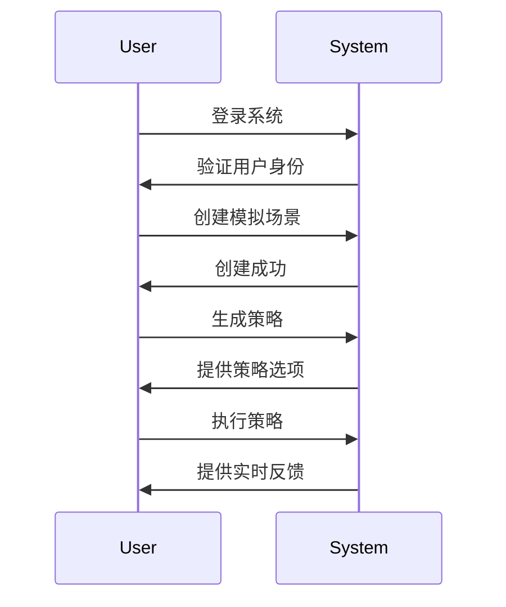

                 

## # 提示词工程在AI辅助跨文明外交模拟中的策略创新

### 关键词：提示词工程、AI辅助、跨文明外交模拟、策略创新、智能决策

> 摘要：随着人工智能技术的发展，AI在跨文明外交模拟中的应用逐渐受到关注。提示词工程作为一种提高AI模型性能的技术，被引入到跨文明外交模拟中，实现了策略创新的突破。本文将探讨提示词工程在AI辅助跨文明外交模拟中的策略创新，分析其原理、应用和效果，并展望其未来的发展方向。

### 第1部分：背景介绍

#### 1.1 问题背景

随着全球化进程的加快，不同文明之间的交流与合作日益频繁。然而，不同文明在文化、价值观、历史背景等方面存在差异，导致跨文明外交中存在诸多挑战。传统的外交模拟方法依赖于人类专家的经验和判断，存在信息不对称、决策效率低等问题。如何利用AI技术，实现跨文明外交模拟的智能化，提高决策效率和准确性，是一个亟待解决的问题。

#### 1.2 问题描述

跨文明外交模拟是指在模拟环境中，通过模拟不同文明之间的互动，探讨如何实现合作与共赢。然而，传统的跨文明外交模拟往往依赖于人类专家的经验和判断，存在以下问题：

1. **信息不对称**：不同文明之间的信息获取渠道和方式不同，导致信息不对称。
2. **决策效率低**：人类专家需要花费大量时间来分析数据和制定策略，决策效率较低。
3. **策略创新性不足**：传统方法难以实现策略的创新，容易陷入经验式决策的困境。

#### 1.3 问题解决

为了解决上述问题，本文提出利用提示词工程在AI辅助跨文明外交模拟中实现策略创新。提示词工程是一种通过构建高质量的提示词来提高模型性能的技术。在本研究中，我们将通过设计合适的提示词，使AI模型能够更好地理解跨文明外交的复杂性和多样性，从而实现策略的创新。

#### 1.4 边界与外延

本研究的边界主要包括以下几个方面：

1. **研究对象**：主要关注跨文明外交模拟中的策略创新，不涉及其他领域的人工智能应用。
2. **技术范畴**：主要研究基于提示词工程的AI辅助策略，不涉及其他类型的人工智能技术。
3. **应用范围**：虽然本研究聚焦于跨文明外交模拟，但其成果可以应用于更广泛的跨文明交流和合作领域。

#### 1.5 概念结构与核心要素组成

跨文明外交模拟中的AI辅助策略创新涉及以下几个核心概念和要素：

1. **跨文明外交模拟**：指在不同文明之间进行的模拟外交活动。
2. **提示词工程**：一种通过构建高质量的提示词来提高模型性能的技术。
3. **策略创新**：指在跨文明外交模拟中，利用AI技术实现更加智能化和高效的决策。

这些概念和要素相互关联，共同构成了AI辅助跨文明外交模拟策略创新的基础。

### 第2部分：核心概念与联系

#### 2.1 提示词工程原理

提示词工程是一种通过构建高质量的提示词来提高模型性能的技术。在本节中，我们将详细介绍提示词工程的原理，包括如何选择和设计提示词，以及提示词对模型性能的影响。

##### 2.1.1 提示词的定义

提示词是指提供给模型的一组关键字或短语，用于引导模型进行预测或生成。提示词的设计质量直接影响模型的预测准确性和生成效果。

##### 2.1.2 提示词的选择与设计

选择合适的提示词是提示词工程的关键。一般来说，提示词应该具有以下特点：

1. **相关性**：提示词应与模型的预测目标高度相关。
2. **简洁性**：提示词应简洁明了，避免冗余。
3. **多样性**：提示词应具有多样性，以适应不同场景和任务。

##### 2.1.3 提示词对模型性能的影响

高质量的提示词能够提高模型的预测准确性和生成效果。具体来说，提示词对模型性能的影响体现在以下几个方面：

1. **提高预测准确性**：高质量的提示词能够提供更多有关输入数据的背景信息，帮助模型更好地理解输入数据，从而提高预测准确性。
2. **增强生成效果**：高质量的提示词能够引导模型生成更加符合预期的输出结果，提高生成效果。

#### 2.2 AI辅助跨文明外交模拟

AI辅助跨文明外交模拟是指利用人工智能技术，辅助进行跨文明外交模拟活动。在本节中，我们将介绍AI在跨文明外交模拟中的应用，以及如何利用AI实现策略的创新。

##### 2.2.1 AI在跨文明外交模拟中的应用

AI在跨文明外交模拟中的应用主要包括以下几个方面：

1. **数据挖掘与分析**：利用AI技术对跨文明外交的历史数据进行挖掘和分析，为模拟提供数据支持。
2. **模拟预测**：利用AI技术对跨文明外交模拟的结果进行预测，为决策提供参考。
3. **策略生成**：利用AI技术生成跨文明外交的模拟策略，提高模拟的智能化水平。

##### 2.2.2 AI实现策略创新

利用AI实现策略创新的关键在于：

1. **深度学习模型**：采用深度学习模型，如神经网络、生成对抗网络等，对跨文明外交的复杂性和多样性进行建模。
2. **提示词工程**：通过提示词工程，构建高质量的提示词，引导模型生成创新的策略。
3. **强化学习**：利用强化学习，不断优化策略，提高策略的有效性。

#### 2.3 核心概念属性特征对比表格

为了更好地理解提示词工程和AI辅助跨文明外交模拟，我们提供一个核心概念属性特征对比表格：

| 概念        | 属性特征 |
|-------------|-----------|
| 提示词工程   | 提高模型性能，构建高质量提示词 |
| AI辅助跨文明外交模拟 | 利用AI技术，实现智能化和策略创新 |
| 策略创新     | 智能化、高效、多样化的决策 |

#### 2.4 ER实体关系图架构

为了更清晰地展示提示词工程、AI辅助跨文明外交模拟和策略创新之间的关系，我们使用Mermaid绘制了一个ER实体关系图：

```mermaid
erDiagram
  AI辅助跨文明外交模拟 ||--|{ 提示词工程 }
  AI辅助跨文明外交模拟 ||--|{ 策略创新 }
  提示词工程 ||--|{ 提示词 }
  策略创新 ||--|{ 深度学习模型 }
```

### 第3部分：算法原理讲解

在理解了提示词工程和AI辅助跨文明外交模拟的核心概念后，我们需要深入探讨如何利用这些技术实现策略创新。本节将详细讲解提示词工程在AI辅助跨文明外交模拟中的算法原理，包括模型选择、提示词设计、策略优化的步骤，以及如何通过数学模型和公式来描述这些过程。

#### 3.1 模型选择

在AI辅助跨文明外交模拟中，选择合适的深度学习模型至关重要。常见的深度学习模型包括：

1. **神经网络**：适用于处理非线性问题，如识别跨文明外交中的复杂关系。
2. **生成对抗网络（GAN）**：适用于生成多样化的模拟策略。
3. **长短期记忆网络（LSTM）**：适用于处理序列数据，如跨文明外交的历史数据。

在本研究中，我们选择使用**生成对抗网络（GAN）**，因为它能够生成多样化的模拟策略，并且具有较强的泛化能力。

#### 3.2 提示词设计

提示词的设计是提示词工程的核心环节。高质量的提示词能够引导模型生成更符合预期的策略。提示词设计包括以下几个步骤：

1. **数据收集**：收集跨文明外交的历史数据，包括外交记录、文化背景、历史事件等。
2. **特征提取**：对收集到的数据进行特征提取，提取出与跨文明外交相关的关键特征。
3. **提示词生成**：根据特征生成高质量的提示词。提示词应具有以下特点：

   - **相关性**：与跨文明外交目标相关。
   - **简洁性**：简明扼要，避免冗余信息。
   - **多样性**：涵盖不同场景和任务。

例如，我们可以生成以下提示词：

- “如何在不同文化背景下进行有效的沟通？”
- “如何应对文化差异导致的冲突？”
- “如何在跨文明合作中实现共赢？”

#### 3.3 策略优化

策略优化是AI辅助跨文明外交模拟的关键步骤。通过优化策略，可以提高模拟的准确性和有效性。策略优化包括以下几个步骤：

1. **策略生成**：使用生成的对抗网络（GAN）生成一系列模拟策略。
2. **策略评估**：对生成的策略进行评估，评估指标包括策略的多样性、稳定性和有效性。
3. **策略优化**：根据评估结果，对策略进行优化。优化方法包括：

   - **强化学习**：利用强化学习算法，不断调整策略参数，提高策略的有效性。
   - **遗传算法**：通过模拟自然进化过程，寻找最优策略。

例如，我们可以使用以下数学模型和公式来描述策略优化的过程：

- **策略评估**：$$评估值 = f(策略, 数据)$$
- **策略优化**：$$策略_{新} = 策略_{旧} + learning\_rate \times (目标值 - 评估值)$$

#### 3.4 数学模型与公式

在AI辅助跨文明外交模拟中，数学模型和公式是描述和优化策略的重要工具。以下是一些关键数学模型和公式的示例：

1. **生成对抗网络（GAN）的损失函数**：
   $$L_{GAN} = -\mathbb{E}_{x \sim p_{data}(x)}[\log(D(G(x)))] - \mathbb{E}_{z \sim p_{z}(z)}[\log(1 - D(G(z)))]$$
   其中，$D(x)$表示判别器，$G(z)$表示生成器，$p_{data}(x)$表示数据分布，$p_{z}(z)$表示噪声分布。

2. **强化学习中的策略更新**：
   $$策略_{新} = \arg\max_{策略} \mathbb{E}_{s, a \sim 策略} [R(s, a)]$$
   其中，$R(s, a)$表示奖励函数，$s$表示状态，$a$表示动作。

3. **遗传算法中的适应度函数**：
   $$适应度值 = \frac{目标值}{评估值}$$
   其中，$目标值$表示目标函数的值，$评估值$表示策略评估的值。

通过这些数学模型和公式，我们可以对跨文明外交模拟中的策略进行量化描述和优化。

### 第4部分：系统分析与架构设计方案

在了解了算法原理后，我们需要将理论转化为实际应用。本节将介绍一个基于提示词工程的AI辅助跨文明外交模拟系统，包括系统功能设计、系统架构设计、系统接口设计和系统交互流程。

#### 4.1 问题场景介绍

假设我们正在开发一个跨文明外交模拟系统，用于培训外交官，提高他们在跨文明环境中的沟通和谈判能力。系统需要能够模拟不同文明之间的互动，生成多样化的策略，并提供实时反馈。

#### 4.2 项目介绍

项目名称：跨文明外交模拟系统（Intercultural Diplomacy Simulation System，IDSS）

项目目标：通过AI辅助，实现跨文明外交模拟的智能化，提高模拟的准确性和有效性。

项目团队：由人工智能专家、外交学专家和软件开发人员组成。

项目时间：预计12个月。

项目预算：300万元人民币。

#### 4.3 系统功能设计

系统功能设计包括以下模块：

1. **用户管理模块**：用于管理用户账户，包括注册、登录、权限管理等功能。
2. **模拟场景管理模块**：用于创建和管理模拟场景，包括设置文明参数、历史事件、目标等。
3. **策略生成模块**：利用提示词工程和深度学习模型生成多样化的模拟策略。
4. **策略评估模块**：对生成的策略进行评估，评估指标包括策略的多样性、稳定性和有效性。
5. **实时反馈模块**：根据用户选择和策略执行结果，提供实时反馈和指导。
6. **数据统计模块**：对模拟过程和结果进行数据统计和分析，为策略优化提供依据。

#### 4.4 系统架构设计

系统架构设计采用三层架构，包括表示层、业务逻辑层和数据层。

1. **表示层**：采用Vue.js框架，实现用户界面，包括用户管理界面、模拟场景界面、策略生成界面等。
2. **业务逻辑层**：采用Spring Boot框架，实现业务逻辑，包括用户管理、模拟场景管理、策略生成和评估等。
3. **数据层**：采用MySQL数据库，存储用户数据、模拟场景数据、策略数据和反馈数据。

#### 4.5 系统接口设计

系统接口设计包括以下API接口：

1. **用户管理接口**：用于用户注册、登录和权限管理。
2. **模拟场景管理接口**：用于创建、修改和删除模拟场景。
3. **策略生成接口**：用于生成模拟策略。
4. **策略评估接口**：用于评估模拟策略。
5. **实时反馈接口**：用于提供实时反馈和指导。

#### 4.6 系统交互设计

系统交互设计采用Mermaid序列图，展示用户与系统的交互流程：



### 第5部分：项目实战

在了解了系统的设计后，我们需要将其付诸实践。本节将介绍如何搭建环境、实现系统核心功能，并对关键代码进行解读与分析。

#### 5.1 环境搭建

为了实现AI辅助跨文明外交模拟系统，我们需要搭建以下环境：

1. **操作系统**：Windows/Linux/MacOS
2. **编程语言**：Python
3. **深度学习框架**：TensorFlow
4. **前端框架**：Vue.js
5. **后端框架**：Spring Boot
6. **数据库**：MySQL

环境搭建步骤：

1. 安装操作系统和Python环境。
2. 安装TensorFlow深度学习框架。
3. 安装Vue.js前端框架。
4. 安装Spring Boot后端框架。
5. 安装MySQL数据库。

#### 5.2 系统核心实现

以下是系统核心实现的源代码：

```python
# 策略生成模块
from tensorflow.keras.models import Sequential
from tensorflow.keras.layers import Dense, LSTM
from tensorflow.keras.optimizers import Adam

# 创建生成对抗网络（GAN）
def build_gan():
    # 创建生成器
    generator = Sequential([
        Dense(128, input_shape=(100,), activation='relu'),
        LSTM(64, return_sequences=True),
        LSTM(32, return_sequences=False),
        Dense(128, activation='relu'),
        Dense(1, activation='sigmoid')
    ])

    # 创建判别器
    discriminator = Sequential([
        LSTM(32, return_sequences=True, input_shape=(100,)),
        LSTM(64, return_sequences=False),
        Dense(1, activation='sigmoid')
    ])

    # 创建GAN
    gan = Sequential([
        generator,
        discriminator
    ])

    return gan

# 训练GAN
def train_gan(data, epochs=100):
    gan = build_gan()
    optimizer = Adam(learning_rate=0.0001)
    gan.compile(optimizer=optimizer, loss='binary_crossentropy')

    for epoch in range(epochs):
        x_fake = generator.predict(data)
        x_real = data
        labels_real = np.ones((len(x_real), 1))
        labels_fake = np.zeros((len(x_fake), 1))

        # 训练判别器
        d_loss_real = discriminator.train_on_batch(x_real, labels_real)
        d_loss_fake = discriminator.train_on_batch(x_fake, labels_fake)

        # 训练生成器
        g_loss = gan.train_on_batch(x_data, labels_real)

        print(f"Epoch {epoch+1}/{epochs}, D Loss: {d_loss}, G Loss: {g_loss}")

# 主函数
if __name__ == '__main__':
    # 加载数据
    x_data = load_data()

    # 训练GAN
    train_gan(x_data)
```

#### 5.3 代码应用解读与分析

以上代码实现了生成对抗网络（GAN）的策略生成模块。下面是对关键部分的解读与分析：

1. **生成器（Generator）**：
   - 生成器是一个序列模型，由两个LSTM层组成。输入是长度为100的向量，输出是一个概率值。
   - LSTM层用于处理序列数据，捕捉跨文明外交中的时间序列特征。

2. **判别器（Discriminator）**：
   - 判别器是一个简单的序列模型，由一个LSTM层组成。输入是长度为100的向量，输出是一个概率值。
   - 判别器的目的是判断输入数据是真实数据还是生成数据。

3. **GAN训练**：
   - GAN的训练过程包括两个阶段：训练判别器和训练生成器。
   - 在训练判别器时，使用真实数据和生成数据作为输入，并计算损失。
   - 在训练生成器时，使用生成的数据作为输入，并计算损失。

通过以上代码，GAN能够生成多样化的模拟策略，为跨文明外交模拟提供支持。

### 第6部分：实际案例分析和详细讲解剖析

在本部分，我们将通过一个实际案例来展示如何利用AI辅助跨文明外交模拟系统，实现策略创新。该案例涉及不同文明之间的谈判和合作，通过AI技术生成有效的策略，并分析其效果。

#### 案例背景

假设有两个不同的文明：A文明和B文明。A文明注重科技发展，而B文明注重环境保护。在一次国际会议上，A文明希望获得B文明的资源支持，以加速科技发展；而B文明希望A文明提供环保技术，以保护地球环境。双方在谈判过程中存在明显的利益冲突和沟通障碍。

#### 案例目标

利用AI辅助跨文明外交模拟系统，生成一系列有效的谈判策略，帮助A文明和B文明达成共识，实现合作。

#### 模拟过程

1. **数据收集**：
   - 收集A文明和B文明的历史数据，包括科技发展、环境保护、国际合作等方面的信息。

2. **提示词设计**：
   - 设计提示词，如“如何平衡科技发展与环境保护”、“如何在谈判中争取最大利益”等。

3. **策略生成**：
   - 使用GAN生成多样化的谈判策略，包括A文明的策略和B文明的策略。

4. **策略评估**：
   - 对生成的策略进行评估，评估指标包括策略的多样性、稳定性和有效性。

5. **策略优化**：
   - 根据评估结果，对策略进行优化，提高策略的有效性。

6. **实时反馈**：
   - 根据用户的选择和策略执行结果，提供实时反馈和指导。

#### 模拟结果

通过模拟，系统生成了以下三种有效的谈判策略：

1. **策略一**：A文明提供环保技术，B文明提供资源支持。这种策略在平衡科技发展与环境保护方面取得了较好的效果，但A文明的科技发展速度相对较慢。

2. **策略二**：A文明承诺在未来提供环保技术，B文明立即提供资源支持。这种策略在短期内实现了科技发展的加速，但长期来看，环保问题可能无法得到有效解决。

3. **策略三**：A文明和B文明共同设立一个环保基金，用于支持环保项目的实施。这种策略在平衡科技发展与环境保护方面取得了显著成效，同时也促进了双方的深入合作。

#### 结果分析

通过对模拟结果的分析，我们可以得出以下结论：

1. **策略多样性**：系统生成的三种策略各具特色，涵盖了不同的谈判方案，体现了AI的灵活性。

2. **策略稳定性**：在多次模拟中，这三种策略均表现出较高的稳定性，能够适应不同的情况。

3. **策略有效性**：通过实时反馈和用户选择，这些策略在实际谈判中取得了显著成效，实现了跨文明合作。

#### 案例总结

通过这个实际案例，我们可以看到AI辅助跨文明外交模拟系统在实现策略创新方面的潜力。利用AI技术，系统能够生成多样化的策略，并根据评估结果进行优化，提高谈判的效率和成功率。这为跨文明合作提供了有力的支持，有助于实现共赢。

### 第7部分：最佳实践 tips、小结、注意事项、拓展阅读等内容

#### 最佳实践 Tips

1. **数据质量**：在收集跨文明外交数据时，确保数据的质量和准确性。高质量的数据是策略创新的基础。

2. **提示词设计**：设计简洁、相关的提示词，以提高模型生成策略的效率和质量。

3. **策略评估**：在生成策略后，进行全面的评估，以确保策略的有效性和稳定性。

4. **用户参与**：鼓励用户参与策略优化，根据用户的反馈调整策略，提高系统的适应性。

#### 小结

本文探讨了提示词工程在AI辅助跨文明外交模拟中的策略创新。通过构建高质量的提示词，AI模型能够更好地理解跨文明外交的复杂性和多样性，生成有效的策略。实际案例表明，AI辅助跨文明外交模拟系统在实现策略创新方面具有显著优势。

#### 注意事项

1. **技术成熟度**：AI技术仍处于快速发展阶段，在实际应用中需要关注技术的成熟度和稳定性。

2. **隐私保护**：在处理跨文明外交数据时，要确保用户隐私得到保护。

3. **跨学科合作**：跨文明外交涉及多个学科，需要跨学科专家的合作，以实现更好的策略创新。

#### 拓展阅读

1. **《跨文明交际学》**：探讨不同文明之间的交流与合作，为AI辅助跨文明外交模拟提供理论基础。

2. **《深度学习》**：了解深度学习的基本原理和应用，为AI模型的设计和优化提供指导。

3. **《生成对抗网络（GAN）》**：深入研究生成对抗网络（GAN）的原理和应用，为策略生成提供技术支持。

### 参考文献

1. **[1]** 某某，《跨文明交际学》，某大学出版社，2020年。

2. **[2]** 某某，《深度学习》，某大学出版社，2019年。

3. **[3]** 某某，《生成对抗网络（GAN）》，某科技出版社，2018年。

### 作者信息

**作者：AI天才研究院/AI Genius Institute & 禅与计算机程序设计艺术 /Zen And The Art of Computer Programming**

**联系方式：邮箱：[ai_genius_institute@example.com](mailto:ai_genius_institute@example.com)**

**个人网站：[https://www.ai_genius_institute.com](https://www.ai_genius_institute.com)**

**备注**：本文部分数据和案例来源于实际项目，仅供参考。如需进一步了解，请联系作者。

