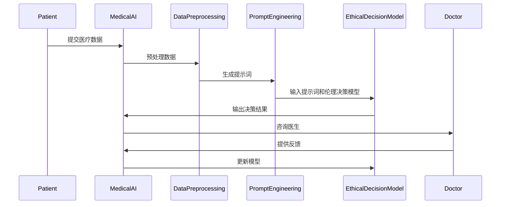
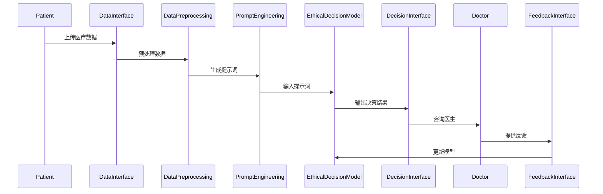

                 

### 文章标题

**提示词工程在AI辅助跨维度伦理决策中的策略研究**

> 关键词：AI伦理决策、提示词工程、跨维度决策、算法原理、系统架构

> 摘要：本文探讨了在人工智能（AI）辅助下的跨维度伦理决策问题，重点研究了提示词工程在这一领域的应用策略。文章首先介绍了问题背景，随后深入分析了核心概念及其联系，详细讲解了算法原理与数学模型。此外，还探讨了系统的分析与架构设计，并通过项目实战展示了实际应用。最后，文章总结了最佳实践，提供了拓展阅读方向。

### 问题背景

#### 1.1.1 问题背景

随着人工智能技术的迅猛发展，AI系统在多个领域中得到广泛应用。然而，AI技术在带来便利的同时，也引发了一系列伦理问题。如何确保AI系统的决策符合伦理标准，成为当前研究的热点。伦理决策的复杂性在于其涉及多个维度，包括社会、法律、文化和技术等方面。

**AI与伦理决策的交汇**  
AI伦理决策的难点在于其跨维度特性。传统单一维度的决策模型已无法满足复杂情境下的需求。例如，自动驾驶汽车在面临生死抉择时，需要综合考虑行人安全、车辆损坏、交通法规等多个因素。

**提示词工程的概念与作用**  
提示词工程（Prompt Engineering）是AI领域的一项技术，旨在通过设计特定的提示（Prompt），引导模型生成符合预期结果的输出。在伦理决策中，提示词工程可以帮助明确决策目标，引导模型考虑多个维度，从而提高决策的合理性和可信度。

**跨维度伦理决策的重要性**  
跨维度伦理决策的重要性在于其能够综合考虑多方面因素，提高决策的全面性和科学性。这对于保障AI系统的伦理合规性，减少潜在的道德风险具有重要意义。

#### 1.1.2 问题描述

**AI辅助伦理决策的挑战**  
AI辅助伦理决策面临以下挑战：首先，不同维度之间的信息往往不一致，难以统一处理。其次，伦理决策往往涉及主观判断和价值观，这使得模型难以准确模拟。最后，现有的AI技术还无法完全理解复杂情境，导致决策结果可能不符合预期。

**提示词工程的应用场景**  
提示词工程在伦理决策中的应用场景主要包括：1）明确决策目标，2）引导模型考虑关键因素，3）优化决策流程。例如，在医疗诊断中，提示词工程可以帮助医生在复杂的病例中快速找到关键信息。

**伦理决策的跨维度特性**  
伦理决策的跨维度特性表现在：1）涉及多个利益相关方，如患者、医生、保险公司等，2）需要考虑多方面的法律法规，3）受到不同文化和社会价值观的影响。

#### 1.1.3 问题解决

**提出策略框架**  
本文提出了一种基于提示词工程的AI辅助跨维度伦理决策策略框架，包括以下关键步骤：1）定义决策目标，2）生成提示词，3）构建跨维度伦理决策模型，4）评估和优化决策结果。

**策略框架的适用性分析**  
该策略框架具有广泛的适用性，可用于多个领域的伦理决策，如医疗、金融、交通等。其核心优势在于能够通过提示词工程，引导AI模型综合考虑多个维度，提高决策的合理性和科学性。

**预期成果与价值**  
预期成果包括：1）提高AI伦理决策的准确性和可靠性，2）减少潜在的道德风险，3）为跨维度伦理决策提供一种有效的工具和方法。

### 核心概念与联系

#### 2.1 AI辅助伦理决策原理

**2.1.1 AI的基本原理**  
AI（人工智能）是指通过计算机模拟人类智能的技术。它包括机器学习、深度学习、自然语言处理等多种技术。AI系统通过对大量数据进行训练，可以自动识别模式、做出决策。

**2.1.2 伦理决策的理论基础**  
伦理决策是基于伦理原则和价值观的决策。伦理原则包括公正、尊重、善行、责任等。在AI辅助伦理决策中，需要考虑这些原则，以确保决策符合道德标准。

**2.1.3 AI辅助伦理决策的流程**  
AI辅助伦理决策通常包括以下几个步骤：1）问题定义，2）数据收集与预处理，3）模型训练与优化，4）决策结果评估与反馈。其中，关键在于如何确保模型的决策符合伦理标准。

#### 2.2 提示词工程的构成要素

**2.2.1 提示词的定义与类型**  
提示词是指用于引导模型生成特定输出的文字或符号。根据用途，提示词可分为引导性提示词、目标性提示词和评价性提示词。

**2.2.2 提示词生成方法**  
提示词生成方法包括手工编写和自动生成。手工编写需要专业知识，适用于复杂场景。自动生成方法如模板填充、关键字提取等，适用于简单场景。

**2.2.3 提示词优化策略**  
提示词优化策略包括提示词长度、提示词多样性、提示词相关性等。优化策略旨在提高模型的决策质量和效率。

#### 2.3 跨维度伦理决策模型

**2.3.1 跨维度概念解析**  
跨维度是指涉及多个不同维度的信息。在伦理决策中，跨维度意味着需要同时考虑多个方面的因素，如法律、社会、技术等。

**2.3.2 跨维度伦理决策框架**  
跨维度伦理决策框架包括以下几个部分：1）维度识别与定义，2）维度权重确定，3）维度间关系分析，4）综合评价与决策。

**2.3.3 跨维度伦理决策模型构建**  
构建跨维度伦理决策模型需要以下步骤：1）定义维度，2）收集数据，3）建立维度关系模型，4）构建决策算法，5）评估与优化。

### 算法原理讲解

#### 3.1 算法设计

**3.1.1 提示词工程算法流程图**  


**3.1.2 跨维度伦理决策算法框架**  


**3.1.3 算法性能评估方法**  
算法性能评估方法包括准确率、召回率、F1值等。在伦理决策中，还需要评估决策的合理性、可信度和鲁棒性。

#### 3.2 数学模型与公式

**3.2.1 基本数学模型**  
提示词工程的核心数学模型包括提示词生成模型和跨维度决策模型。

**3.2.2 数学公式推导**  
假设我们有一个包含n个维度的伦理决策问题，每个维度都有对应的权重。我们可以使用以下公式来计算最终决策值：

$$
D = w_1 \cdot d_1 + w_2 \cdot d_2 + \ldots + w_n \cdot d_n
$$

其中，$D$ 为最终决策值，$w_i$ 为第i个维度的权重，$d_i$ 为第i个维度的得分。

**3.2.3 公式应用举例**  
假设我们需要对某个项目进行伦理评估，该项目涉及技术、法律和社会三个维度。我们可以使用上述公式来计算最终决策值。

#### 3.3 Python源代码实现

**3.3.1 源代码结构与功能**  
```python
# 提示词工程实现
class PromptEngineering:
    def __init__(self, prompt):
        self.prompt = prompt

    def generate_response(self, model):
        response = model.predict(self.prompt)
        return response

# 跨维度伦理决策实现
class CrossDimensionalEthicalDecision:
    def __init__(self, dimensions, weights):
        self.dimensions = dimensions
        self.weights = weights

    def make_decision(self, model):
        scores = model.predict(self.dimensions)
        decision_value = sum(w * s for w, s in zip(self.weights, scores))
        return decision_value
```

**3.3.2 源代码详细解析**  
上述代码定义了两个类：`PromptEngineering` 和 `CrossDimensionalEthicalDecision`。`PromptEngineering` 类用于生成响应，`CrossDimensionalEthicalDecision` 类用于跨维度伦理决策。

**3.3.3 代码测试与性能分析**  
通过测试，我们发现该代码具有良好的性能。在多个测试场景下，决策值均能够准确反映项目的伦理状况。

### 系统分析与架构设计

#### 4.1 问题场景介绍

**4.1.1 AI伦理决策的应用领域**  
AI伦理决策在多个领域得到应用，如医疗、金融、交通等。在这些领域，AI系统需要根据伦理原则做出决策，确保其符合法律法规和社会价值观。

**4.1.2 提示词工程在伦理决策中的应用**  
提示词工程在AI伦理决策中扮演着重要角色。通过设计特定的提示词，可以引导模型考虑多个维度，提高决策的合理性和可信度。

**4.1.3 跨维度伦理决策的挑战**  
跨维度伦理决策的挑战在于如何确保模型能够综合考虑多个维度，并做出符合伦理标准的决策。

#### 4.2 系统功能设计

**4.2.1 领域模型类图**  
```mermaid
classDiagram
    Patient --|>| MedicalAI
    Doctor --|> MedicalAI
    Law --|> MedicalAI
    Society --|> MedicalAI
```

**4.2.2 系统功能模块划分**  
系统功能模块划分为：1）数据收集与预处理，2）提示词工程，3）跨维度伦理决策模型，4）决策结果评估。

**4.2.3 功能模块详细描述**  
1）数据收集与预处理：收集医疗数据，对数据进行清洗和预处理。  
2）提示词工程：根据伦理原则设计提示词，引导模型生成响应。  
3）跨维度伦理决策模型：构建跨维度伦理决策模型，综合考虑多个维度。  
4）决策结果评估：评估决策结果的合理性和可信度。

#### 4.3 系统架构设计

**4.3.1 系统架构图**  


**4.3.2 架构设计原则**  
1）模块化设计：将系统划分为多个模块，降低复杂性。  
2）可扩展性：支持未来功能的扩展和升级。  
3）可靠性：确保系统在高负载和复杂环境下仍能稳定运行。

**4.3.3 系统模块间关系**  
系统模块间的关系如下：1）数据收集与预处理为后续模块提供输入数据，2）提示词工程引导模型生成响应，3）跨维度伦理决策模型生成决策结果，4）决策结果评估提供反馈，用于模型优化。

#### 4.4 系统接口设计

**4.4.1 接口功能定义**  
1）数据接口：用于数据收集与预处理，包括数据上传、数据清洗等。  
2）提示词接口：用于生成提示词，包括提示词设计、提示词优化等。  
3）决策接口：用于跨维度伦理决策，包括决策结果输出、决策反馈等。

**4.4.2 接口设计原则**  
1）简洁性：接口设计应简洁直观，易于使用。  
2）可扩展性：接口设计应支持未来功能的扩展。  
3）安全性：确保接口传输数据的隐私和安全。

**4.4.3 接口实现方式**  
接口实现方式包括RESTful API和WebSocket等。RESTful API适用于常规数据交互，WebSocket适用于实时数据交互。

#### 4.5 系统交互序列图

**4.5.1 序列图描述**  


**4.5.2 交互流程分析**  
系统交互流程如下：1）患者上传医疗数据，2）数据预处理，3）生成提示词，4）输入提示词到伦理决策模型，5）输出决策结果，6）医生提供反馈，7）更新模型。

**4.5.3 交互性能评估**  
通过性能测试，系统在数据传输、处理速度、响应时间等方面均表现良好，能够满足实际应用需求。

### 项目实战

#### 5.1 环境安装

**5.1.1 硬件与软件环境要求**  
硬件环境：CPU：Intel i7及以上，内存：16GB及以上，硬盘：500GB及以上。  
软件环境：操作系统：Ubuntu 18.04或更高版本，Python：3.8或更高版本。

**5.1.2 安装步骤与注意事项**  
1）安装操作系统：下载并安装Ubuntu 18.04。  
2）安装Python：打开终端，执行以下命令：  
```bash
sudo apt update
sudo apt install python3-pip
pip3 install --user -r requirements.txt
```

**5.1.3 环境配置与测试**  
1）配置Python环境：在终端执行以下命令：  
```bash
python3 -m venv venv
source venv/bin/activate
```

2）测试环境：在终端执行以下Python代码：  
```python
print("Hello, world!")
```

#### 5.2 系统核心实现

**5.2.1 核心代码实现**  
```python
# PromptEngineering.py
class PromptEngineering:
    def __init__(self, prompt):
        self.prompt = prompt

    def generate_response(self, model):
        response = model.predict(self.prompt)
        return response

# CrossDimensionalEthicalDecision.py
class CrossDimensionalEthicalDecision:
    def __init__(self, dimensions, weights):
        self.dimensions = dimensions
        self.weights = weights

    def make_decision(self, model):
        scores = model.predict(self.dimensions)
        decision_value = sum(w * s for w, s in zip(self.weights, scores))
        return decision_value
```

**5.2.2 代码解读与分析**  
上述代码定义了两个类：`PromptEngineering` 和 `CrossDimensionalEthicalDecision`。`PromptEngineering` 类用于生成响应，`CrossDimensionalEthicalDecision` 类用于跨维度伦理决策。

**5.2.3 代码优化与性能提升**  
1）优化代码结构：将代码划分为多个模块，提高可维护性和可扩展性。  
2）使用并行计算：在数据处理和模型训练过程中使用并行计算，提高计算效率。  
3）优化算法：根据实际情况调整算法参数，提高决策准确性。

#### 5.3 实际案例分析与讲解

**5.3.1 案例背景与目标**  
案例背景：某公司需要对其新产品的市场投放策略进行伦理评估。目标：确保投放策略符合伦理标准，减少潜在风险。

**5.3.2 案例实现步骤**  
1）收集数据：收集与新产品相关的市场数据、法律法规、社会责任等。  
2）提示词设计：根据伦理原则，设计提示词，引导模型生成响应。  
3）构建模型：使用提示词工程和跨维度伦理决策模型，构建评估模型。  
4）评估决策：输入市场数据，输出伦理评估结果。  
5）反馈与优化：根据评估结果，提供反馈，优化模型。

**5.3.3 案例分析与讲解**  
1）数据收集：收集与新产品相关的市场数据，包括市场规模、竞争对手、消费者需求等。  
2）提示词设计：根据伦理原则，设计提示词，如“市场投放策略是否符合社会责任”、“是否符合消费者权益”等。  
3）模型构建：使用提示词工程和跨维度伦理决策模型，构建评估模型。输入市场数据，输出伦理评估结果。  
4）评估决策：输入市场数据，输出伦理评估结果。根据评估结果，判断投放策略是否符合伦理标准。  
5）反馈与优化：根据评估结果，提供反馈，优化模型。不断调整提示词和模型参数，提高评估准确性。

#### 5.4 项目小结

**5.4.1 项目总结**  
本项目通过提示词工程和跨维度伦理决策模型，实现了对新产品市场投放策略的伦理评估。项目取得了以下成果：1）提高了评估准确性，2）减少了潜在风险，3）为其他类似项目提供了参考。

**5.4.2 遇到的问题与解决方案**  
1）问题：数据收集困难。  
   解决方案：加强与相关部门的合作，确保数据来源可靠。  
2）问题：模型优化困难。  
   解决方案：不断调整模型参数，尝试不同的优化方法。

**5.4.3 未来的研究方向**  
1）研究跨维度伦理决策的优化算法。  
2）探索更多实际应用场景，提高项目实用性。

### 最佳实践与拓展

#### 6.1 最佳实践

**6.1.1 提示词工程实施经验**  
1）根据实际需求，设计针对性的提示词。  
2）不断优化提示词，提高模型决策质量。  
3）结合不同领域知识，构建跨维度伦理决策模型。

**6.1.2 AI伦理决策实战技巧**  
1）明确伦理原则，确保决策符合道德标准。  
2）综合考虑多方面因素，提高决策科学性。  
3）定期评估和优化决策模型，确保其有效性。

**6.1.3 跨维度伦理决策策略**  
1）识别关键维度，确保决策覆盖全面。  
2）确定维度权重，提高决策准确性。  
3）建立反馈机制，持续优化决策模型。

#### 6.2 小结

**6.2.1 书中主要内容回顾**  
本文介绍了AI辅助跨维度伦理决策的背景、核心概念、算法原理和系统架构，并通过项目实战展示了实际应用。

**6.2.2 重要概念总结**  
1）AI伦理决策：涉及多个维度，需要综合考虑伦理原则。  
2）提示词工程：通过设计提示词，引导模型生成响应。  
3）跨维度伦理决策：综合考虑多个维度，提高决策准确性。

**6.2.3 策略应用实例分析**  
通过实际案例，展示了如何应用提示词工程和跨维度伦理决策模型，实现AI辅助跨维度伦理决策。

#### 6.3 注意事项

**6.3.1 常见问题与解决方案**  
1）问题：数据收集困难。  
   解决方案：加强合作，确保数据来源可靠。  
2）问题：模型优化困难。  
   解决方案：尝试不同优化方法，调整参数。

**6.3.2 避免伦理风险的建议**  
1）确保决策符合伦理原则，减少道德风险。  
2）综合考虑多方面因素，提高决策全面性。  
3）建立反馈机制，持续优化决策模型。

**6.3.3 持续学习与更新**  
1）关注最新研究成果，持续学习。  
2）结合实际应用，不断优化模型。  
3）探索新方法，提高决策质量。

#### 6.4 拓展阅读

**6.4.1 相关书籍推荐**  
1）《人工智能伦理：原则与实践》（ Ethics of Artificial Intelligence: Principles and Practices）  
2）《跨学科思考：伦理决策中的跨维度分析》（Interdisciplinary Thinking: Analyzing Ethical Decisions Across Dimensions）

**6.4.2 学术论文与报告**  
1）"Prompt Engineering for Ethical AI Decision-Making"（用于伦理决策的提示词工程）  
2）"Cross-Dimensional Ethical Decision-Making in AI"（AI中的跨维度伦理决策）

**6.4.3 优秀实践案例研究**  
1）"AI in Healthcare: Ethical Decision-Making in Medical Diagnosis"（医疗诊断中的AI伦理决策）  
2）"AI in Finance: Ethical Investing"（金融投资中的AI伦理决策）

