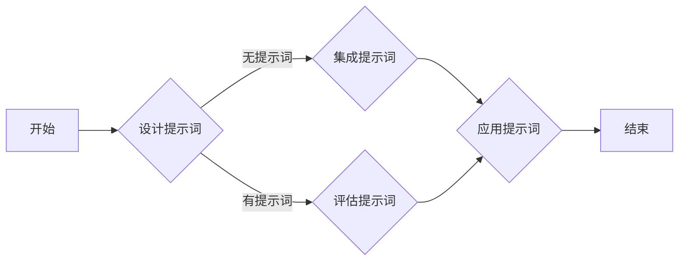
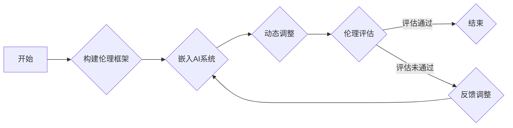
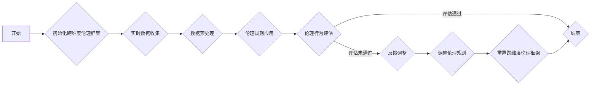
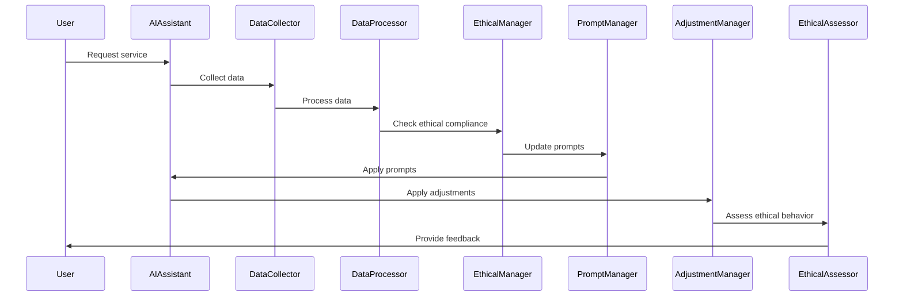

                 


### 背景介绍

#### 1.1 问题背景

在当前技术飞速发展的时代，人工智能（AI）已经渗透到了我们生活的方方面面，从医疗诊断到自动驾驶，从智能家居到金融分析，AI技术的应用场景越来越广泛。然而，随着AI技术的深入发展，伦理问题也逐渐浮现。这些问题包括但不限于数据隐私、算法偏见、决策透明性等。如何在保证技术进步的同时，维护社会的伦理底线，成为了一个亟待解决的问题。

人工智能与伦理的挑战主要体现在以下几个方面：

1. **数据隐私**：AI系统通常需要大量的数据来训练和优化，这往往涉及到个人隐私的保护问题。如何在数据收集和使用过程中保护用户隐私，成为了一个重要的伦理议题。

2. **算法偏见**：AI算法可能会在训练过程中学习到一些偏见，这些偏见可能会在决策过程中体现出来，导致不公平的结果。例如，某些招聘算法可能会无意中歧视某些种族或性别。

3. **决策透明性**：许多AI系统，尤其是深度学习模型，其内部决策过程往往是非透明的。这使得人们难以理解AI系统的决策依据，从而增加了对AI系统的不信任。

为了应对这些挑战，跨维度伦理框架应运而生。跨维度伦理框架是一种综合考虑技术、法律、文化和社会等多方面因素的伦理框架，旨在为AI系统的设计和应用提供一套全面的伦理指导原则。

#### 1.2 跨维度伦理框架的需求

跨维度伦理框架的需求主要源于以下几个方面：

1. **技术的复杂性和多样性**：随着AI技术的发展，AI系统的设计和应用变得越来越复杂。单一维度的伦理框架难以应对这种复杂性，需要从多个维度进行综合考量。

2. **全球化和多样性**：AI技术在全球范围内得到广泛应用，不同国家和地区对伦理问题的看法和处理方式有所不同。跨维度伦理框架能够更好地适应这种多样性，提供具有普适性的伦理指导。

3. **持续性和可扩展性**：跨维度伦理框架不仅需要解决当前的伦理问题，还要具备前瞻性和可持续性，能够应对未来可能出现的新的伦理挑战。

#### 1.3 提示词工程的作用

提示词工程在AI辅助跨维度伦理框架动态调整中发挥着关键作用。提示词工程是一种通过设计和应用提示词来引导AI系统行为的技术。具体来说，提示词工程包括以下几个方面的作用：

1. **增强决策透明性**：通过在AI系统中引入提示词，可以使AI系统的决策过程更加透明，从而提高用户对AI系统的信任度。

2. **减少算法偏见**：通过设计和应用有针对性的提示词，可以引导AI系统避免学习到潜在的偏见，从而提高决策的公平性。

3. **动态调整伦理框架**：提示词工程可以根据实际情况，动态调整AI系统的伦理行为，使其更符合社会伦理标准。

### 边界与外延

#### 1.4 概念结构与核心要素组成

跨维度伦理框架、提示词工程和AI辅助伦理调整是本文的核心概念。下面我们将详细讨论这些概念的结构和核心要素组成。

**1.4.1 伦理框架的构成**

伦理框架通常由以下几个核心要素组成：

1. **价值观**：伦理框架的基石，包括公正、尊重、责任等核心价值观。
2. **原则**：基于价值观的具体行为准则，如隐私保护原则、公平原则等。
3. **规范**：具体的操作指南和规范，用于指导AI系统的设计和应用过程。
4. **评估标准**：用于评估AI系统是否符合伦理要求的指标和标准。

**1.4.2 提示词工程的关键环节**

提示词工程主要包括以下几个关键环节：

1. **提示词设计**：根据伦理框架的要求，设计和选择适当的提示词。
2. **提示词集成**：将提示词集成到AI系统中，使其在决策过程中发挥作用。
3. **提示词评估**：评估提示词的效果，包括其透明性、公平性和适应性。

**1.4.3 AI辅助伦理调整的实现路径**

AI辅助伦理调整的实现路径包括以下几个步骤：

1. **伦理框架构建**：基于跨维度伦理框架，构建具体的伦理框架。
2. **AI系统嵌入**：将伦理框架嵌入到AI系统中，使其具备伦理调整的能力。
3. **动态调整**：根据实际情况，动态调整AI系统的伦理行为。

### 本章小结

本章主要介绍了AI辅助跨维度伦理框架动态调整的背景、需求和提示词工程的作用。通过分析伦理框架、提示词工程和AI辅助伦理调整的概念结构，我们为后续章节的深入探讨奠定了基础。在接下来的章节中，我们将进一步探讨这些核心概念之间的联系，并详细讲解相关的算法原理和系统架构设计。让我们一起深入探索，揭示这一领域的奥秘。

### 1.5 边界与外延

在探讨AI辅助跨维度伦理框架动态调整时，了解其边界与外延是至关重要的。这有助于我们明确该领域的适用范围和潜在限制。

#### 1.5.1 跨维度伦理框架的边界

跨维度伦理框架的边界主要包括以下几个方面：

1. **技术边界**：跨维度伦理框架需要考虑的技术因素包括算法复杂性、数据多样性、计算能力等。它旨在为技术层面的伦理问题提供解决方案，但并不意味着干涉技术本身的开发。

2. **法律边界**：法律框架为伦理提供了基础保障，但伦理问题往往超越了法律的界限。跨维度伦理框架需要考虑不同法律体系的差异，确保其普适性和可执行性。

3. **文化边界**：伦理观念具有文化差异，跨维度伦理框架需要考虑到不同文化背景下的伦理标准，避免文化冲突。

4. **社会边界**：伦理框架的设计和应用需要考虑到社会的多样性，包括社会价值观、社会习俗和社会道德等。

#### 1.5.2 提示词工程的适用范围

提示词工程在AI辅助跨维度伦理框架中的应用范围主要包括：

1. **AI系统设计与开发**：提示词工程可以应用于AI系统的各个环节，包括数据预处理、模型训练、模型评估等。

2. **伦理决策支持**：提示词工程可以帮助AI系统在伦理决策过程中提供透明性和公正性，减少算法偏见。

3. **伦理合规性检查**：提示词工程可以作为工具，帮助开发者检查AI系统是否符合伦理要求，提供合规性建议。

4. **用户体验提升**：通过提示词工程，AI系统可以更好地与用户互动，提高用户体验。

#### 1.5.3 AI辅助伦理调整的限制

AI辅助伦理调整尽管具有重要意义，但仍然存在一些限制：

1. **技术限制**：当前AI技术的局限性可能影响伦理框架的实现效果，例如算法透明性不足、数据质量不高等。

2. **法律限制**：某些法律条款可能限制AI系统的伦理调整能力，特别是在涉及隐私保护和数据保护方面。

3. **资源限制**：AI系统的伦理调整可能需要大量的计算资源和数据支持，这在资源有限的场景下可能难以实现。

4. **主观性**：伦理决策往往涉及主观判断，AI系统在处理复杂的伦理问题时可能无法完全取代人类专家的判断。

#### 1.5.4 概念结构与核心要素组成

最后，我们再次回顾概念结构与核心要素组成：

- **伦理框架**：包括价值观、原则、规范和评估标准。
- **提示词工程**：包括提示词设计、集成和评估。
- **AI辅助伦理调整**：包括伦理框架构建、AI系统嵌入和动态调整。

通过明确这些概念的结构和要素，我们能够更好地理解和应用AI辅助跨维度伦理框架动态调整。

### 本章小结

本章详细介绍了AI辅助跨维度伦理框架动态调整的概念边界与外延。我们分析了跨维度伦理框架的边界，探讨了提示词工程的适用范围，并阐述了AI辅助伦理调整的限制。此外，我们还回顾了核心概念的结构与要素组成。这些分析为后续章节的深入探讨奠定了基础。在接下来的章节中，我们将进一步探讨这些核心概念之间的联系，以及如何实现跨维度伦理框架的动态调整。

## 第二部分：核心概念与联系

### 2.1 伦理框架原理讲解

#### 2.1.1 原理介绍

伦理框架是一种系统化的方法，用于指导AI系统的设计和应用，确保其在道德和法律层面符合社会的期望和标准。伦理框架的核心目标是平衡技术创新与社会责任，通过定义价值观、原则、规范和评估标准，为AI系统的伦理决策提供依据。

伦理框架的基本原理可以概括为以下几个方面：

1. **价值观引导**：伦理框架的建立基于一套明确的价值观，如公正、透明、责任等。这些价值观指导AI系统在设计和应用过程中的伦理行为。

2. **原则指导**：伦理框架通过一系列原则，如隐私保护原则、公平原则、透明性原则等，为AI系统的设计和应用提供具体的指导。

3. **规范约束**：伦理框架包括具体的规范和操作指南，用于指导开发者如何将伦理原则转化为具体的行为准则。

4. **评估标准**：伦理框架提供了评估标准，用于衡量AI系统是否符合伦理要求。这些标准可以是定量的，也可以是定性的。

#### 2.1.2 伦理框架属性特征对比表格

为了更好地理解伦理框架的属性特征，我们将其与传统的法律框架进行比较。以下是一个简单的对比表格：

| 特征         | 伦理框架                | 法律框架                |
| ------------ | --------------------- | --------------------- |
| **价值观引导** | 基于社会伦理价值观       | 基于法律条文和司法解释   |
| **原则指导**   | 强调行为准则和道德规范   | 强调法定权利和义务       |
| **规范约束**   | 提供具体操作指南和规范   | 规定具体法律行为和处罚   |
| **评估标准**   | 提供伦理评估指标和标准   | 提供法律评估标准和程序   |

通过这个表格，我们可以看到伦理框架与法律框架在价值观、原则、规范和评估标准等方面的不同。伦理框架更侧重于指导AI系统的道德行为，而法律框架则更注重法律行为的规范和处罚。

#### 2.1.3 伦理框架的ER实体关系图

为了更好地理解伦理框架的构成，我们可以使用ER（实体-关系）图来展示其各个实体及其关系。以下是一个简化的ER图：

```mermaid
erDiagram
  Entity: 价值观 ||--|{ Principles: 原则 }
  Entity: 原则 ||--|{ Norms: 规范 }
  Entity: 规范 ||--|{ EvaluationCriteria: 评估标准 }
  EvaluationCriteria }|---{ AISystem: AI系统
  AISystem ||--|{ EthicalDecisions: 伦理决策 }
```

在这个ER图中，我们可以看到伦理框架的核心实体包括价值观、原则、规范、评估标准和AI系统。它们之间的关系表明了伦理框架如何通过这些核心要素来指导AI系统的设计和应用，并支持伦理决策。

### 2.2 提示词工程原理讲解

#### 2.2.1 原理介绍

提示词工程是一种通过设计和应用提示词来引导AI系统行为的技术。提示词是一种特殊的输入或提示，用于在AI系统的决策过程中引入外部指导，从而影响其行为。提示词工程的目标是通过提示词的设计和集成，增强AI系统的透明性、公平性和合规性。

提示词工程的基本原理可以概括为以下几个方面：

1. **提示词设计**：根据伦理框架的要求，设计和选择合适的提示词。这些提示词可以是具体的输入参数，也可以是算法中的中间变量。

2. **提示词集成**：将设计的提示词集成到AI系统中，使其在决策过程中发挥作用。集成方式可以是参数调整、中间变量引入或者算法修改等。

3. **提示词评估**：评估提示词的效果，包括其对AI系统决策透明性、公平性和合规性的影响。评估可以通过实验、模型分析或用户反馈等方式进行。

#### 2.2.2 提示词工程属性特征对比表格

为了更好地理解提示词工程的属性特征，我们可以将其与传统的人工干预进行比较。以下是一个简单的对比表格：

| 特征         | 提示词工程                | 人工干预                |
| ------------ | --------------------- | --------------------- |
| **灵活性**    | 可以动态调整，适应不同场景 | 固定策略，难以适应变化   |
| **透明性**    | 提高决策透明性           | 决策过程通常不透明       |
| **公平性**    | 通过提示词减少算法偏见     | 依赖于人为判断，可能存在偏见 |
| **可扩展性**   | 可以应用于不同AI系统     | 依赖于特定系统和人工操作   |

通过这个表格，我们可以看到提示词工程与人工干预在灵活性、透明性、公平性和可扩展性等方面的不同。提示词工程通过外部提示来引导AI系统，从而在一定程度上克服了人工干预的局限性。

#### 2.2.3 提示词工程的ER实体关系图

为了更好地理解提示词工程的构成，我们可以使用ER图来展示其各个实体及其关系。以下是一个简化的ER图：

```mermaid
erDiagram
  Entity: PromptDesign: 提示词设计 ||--|{ PromptIntegration: 提示词集成 }
  Entity: PromptIntegration ||--|{ PromptEffectEvaluation: 提示词评估 }
  Entity: PromptEffectEvaluation }|---{ AISystem: AI系统 }
  AISystem ||--|{ EthicalBehavior: 伦理行为 }
```

在这个ER图中，我们可以看到提示词工程的核心实体包括提示词设计、提示词集成和提示词评估。它们之间的关系表明了提示词工程如何通过这些核心环节来影响AI系统的伦理行为。

### 2.3 AI辅助伦理调整原理讲解

#### 2.3.1 原理介绍

AI辅助伦理调整是指利用人工智能技术来支持伦理决策和调整，以增强AI系统的透明性、公平性和合规性。AI辅助伦理调整的基本原理可以概括为以下几个方面：

1. **伦理框架嵌入**：将跨维度伦理框架嵌入到AI系统中，使其具备伦理调整能力。这通常通过将伦理原则、规范和评估标准转化为AI算法的参数或中间变量来实现。

2. **动态调整机制**：AI系统可以根据实时数据和用户反馈，动态调整其伦理行为。这可以通过机器学习算法来实现，使其能够不断优化和改进伦理决策。

3. **评估与反馈**：AI系统需要对自身的伦理行为进行持续评估，并根据评估结果进行调整。评估可以通过算法分析、用户反馈和外部审查等多种方式实现。

#### 2.3.2 AI辅助伦理调整属性特征对比表格

为了更好地理解AI辅助伦理调整的属性特征，我们可以将其与传统的伦理决策进行比较。以下是一个简单的对比表格：

| 特征         | AI辅助伦理调整            | 传统伦理决策             |
| ------------ | --------------------- | --------------------- |
| **透明性**    | 提高决策透明性           | 决策过程通常不透明       |
| **公平性**    | 通过算法减少偏见，提高公平性 | 依赖于人为判断，可能存在偏见 |
| **灵活性**    | 动态调整，适应复杂环境     | 固定策略，难以适应变化   |
| **可扩展性**   | 可以应用于不同AI系统     | 依赖于特定系统和人工操作   |

通过这个表格，我们可以看到AI辅助伦理调整与传统伦理决策在透明性、公平性、灵活性和可扩展性等方面的不同。AI辅助伦理调整通过算法和数据的支持，能够在一定程度上克服传统伦理决策的局限性。

#### 2.3.3 AI辅助伦理调整的ER实体关系图

为了更好地理解AI辅助伦理调整的构成，我们可以使用ER图来展示其各个实体及其关系。以下是一个简化的ER图：

```mermaid
erDiagram
  Entity: EthicalFramework: 伦理框架 ||--|{ AIIntegration: AI嵌入 }
  Entity: AIIntegration ||--|{ DynamicAdjustment: 动态调整 }
  Entity: DynamicAdjustment }|---{ EthicalBehaviorEvaluation: 伦理行为评估 }
  EthicalBehaviorEvaluation }|---{ FeedbackLoop: 反馈循环 }
  FeedbackLoop }|---{ AISystem: AI系统 }
```

在这个ER图中，我们可以看到AI辅助伦理调整的核心实体包括伦理框架、AI嵌入、动态调整、伦理行为评估和反馈循环。它们之间的关系表明了AI辅助伦理调整如何通过这些核心环节来支持AI系统的伦理行为。

### 2.4 核心概念联系与综合应用

#### 2.4.1 伦理框架与提示词工程的关联

伦理框架和提示词工程是相互关联的，它们共同构成了AI系统伦理调整的基础。伦理框架为提示词工程提供了指导原则和评估标准，而提示词工程则为伦理框架的实施提供了技术手段。

1. **指导原则**：伦理框架通过价值观、原则和规范，为提示词工程的设计和实施提供了明确的指导。例如，隐私保护原则要求在AI系统中设计隐私保护的提示词。

2. **评估标准**：伦理框架提供了评估AI系统是否符合伦理要求的指标，提示词工程可以通过这些指标来评估提示词的效果。例如，公平性原则要求提示词能够减少算法偏见，提高决策的公平性。

3. **技术手段**：提示词工程通过设计和应用提示词，实现了伦理框架的具体实施。例如，通过设计特定的提示词，AI系统可以在决策过程中优先考虑某些伦理原则。

#### 2.4.2 提示词工程与AI辅助伦理调整的整合

提示词工程与AI辅助伦理调整的整合是实现跨维度伦理框架动态调整的关键。这种整合主要体现在以下几个方面：

1. **动态调整**：AI辅助伦理调整通过机器学习算法，可以根据实时数据和用户反馈，动态调整AI系统的伦理行为。提示词工程则为这种动态调整提供了具体的技术手段。例如，AI系统可以通过调整提示词的权重，来动态调整其决策的伦理倾向。

2. **透明性提升**：提示词工程通过引入透明性提示词，可以提高AI系统的决策透明性，使用户能够更好地理解AI系统的决策过程。AI辅助伦理调整则通过算法分析和用户反馈，进一步优化和提升AI系统的透明性。

3. **公平性保障**：提示词工程通过设计和应用公平性提示词，可以帮助AI系统减少偏见，提高决策的公平性。AI辅助伦理调整则通过持续的评估和调整，确保AI系统的决策始终符合伦理要求。

#### 2.4.3 跨维度伦理框架动态调整的实现

跨维度伦理框架动态调整的实现需要综合应用伦理框架、提示词工程和AI辅助伦理调整。以下是一个简化的实现路径：

1. **伦理框架构建**：根据社会伦理价值观和法律要求，构建具体的伦理框架。这包括定义价值观、原则、规范和评估标准。

2. **提示词设计**：根据伦理框架的要求，设计和选择适当的提示词。这些提示词可以是输入参数、中间变量或算法调整项。

3. **AI嵌入**：将伦理框架和提示词工程集成到AI系统中，使其具备伦理调整能力。这通常通过修改AI算法参数或嵌入特定模块来实现。

4. **动态调整**：利用AI辅助伦理调整机制，根据实时数据和用户反馈，动态调整AI系统的伦理行为。这可以通过机器学习算法实现，使其能够不断优化和改进伦理决策。

5. **评估与反馈**：持续评估AI系统的伦理行为，并根据评估结果进行反馈和调整。这可以通过算法分析、用户反馈和外部审查等方式实现。

通过以上步骤，我们可以实现跨维度伦理框架的动态调整，确保AI系统在技术进步的同时，能够符合社会的伦理要求。

### 本章小结

本章详细介绍了伦理框架、提示词工程和AI辅助伦理调整的原理和属性特征。我们通过对比表格和ER图，清晰地展示了这些概念之间的联系和关系。此外，我们还探讨了如何通过整合伦理框架、提示词工程和AI辅助伦理调整，实现跨维度伦理框架的动态调整。这些内容为后续章节的深入探讨奠定了基础，帮助我们更好地理解AI辅助跨维度伦理框架动态调整的复杂性和重要性。

## 第三部分：算法原理讲解

### 3.1 提示词工程算法讲解

#### 3.1.1 算法mermaid流程图

为了更好地理解提示词工程的算法原理，我们首先使用mermaid语言绘制其流程图：



这个流程图展示了提示词工程的四个主要步骤：设计提示词、集成提示词、评估提示词和应用提示词。

#### 3.1.2 Python源代码实现

下面是一个简化的Python源代码实现，用于展示提示词工程的基本算法：

```python
import numpy as np

# 设计提示词
def design_prompt(ethics_requirements):
    # 根据伦理要求设计提示词
    prompts = []
    for requirement in ethics_requirements:
        prompts.append(f"请考虑{requirement}")
    return prompts

# 集成提示词
def integrate_prompt(model, prompts):
    # 在模型输入中集成提示词
    input_data = model.input_data
    for prompt in prompts:
        input_data = np.concatenate((input_data, [prompt]))
    return input_data

# 评估提示词
def evaluate_prompt(model_output, prompts, target_value):
    # 根据模型输出评估提示词效果
    scores = []
    for prompt in prompts:
        score = calculate_score(model_output, prompt, target_value)
        scores.append(score)
    return scores

# 应用提示词
def apply_prompt(model, prompts, target_value):
    # 根据评估结果应用最佳提示词
    best_prompt = select_best_prompt(prompts, scores)
    input_data = integrate_prompt(model, [best_prompt])
    model.input_data = input_data
    model_output = model.predict()
    return model_output

# 辅助函数
def calculate_score(model_output, prompt, target_value):
    # 计算提示词效果得分
    score = np.linalg.norm(model_output - target_value) - np.linalg.norm(prompt)
    return score

def select_best_prompt(prompts, scores):
    # 选择最佳提示词
    best_prompt = prompts[np.argmax(scores)]
    return best_prompt

# 主函数
def main():
    # 定义伦理要求
    ethics_requirements = ["隐私保护", "公平性"]

    # 创建模型
    model = MyModel()

    # 输入数据
    input_data = np.random.rand(10)

    # 目标值
    target_value = np.random.rand()

    # 执行提示词工程算法
    prompts = design_prompt(ethics_requirements)
    model.input_data = integrate_prompt(model, prompts)
    model_output = apply_prompt(model, prompts, target_value)

    # 输出结果
    print("模型输出：", model_output)

if __name__ == "__main__":
    main()
```

这个源代码实现了提示词工程的四个步骤，包括设计提示词、集成提示词、评估提示词和应用提示词。在实际应用中，这些步骤可以根据具体需求进行调整和扩展。

#### 3.1.3 算法原理与数学模型讲解

提示词工程算法的核心在于如何设计、集成和评估提示词，以引导AI系统的行为。以下是算法原理和数学模型的详细讲解：

1. **提示词设计**：
   提示词设计是根据伦理要求，生成一组能够指导AI系统行为的提示。这可以通过自然语言处理技术，将伦理要求转化为具体的文本提示。数学模型可以表示为：
   $$ Prompt = f(Ethics\_Requirements) $$
   其中，`Prompt` 是生成的提示词集合，`Ethics_Requirements` 是伦理要求的集合，`f` 是一个映射函数。

2. **提示词集成**：
   提示词集成是将设计的提示词引入到AI系统的输入或中间变量中。数学模型可以表示为：
   $$ Input\_Data = [Original\_Data, Prompt] $$
   其中，`Input_Data` 是包含原始数据和提示的输入数据集合，`Original_Data` 是原始数据集合，`Prompt` 是设计的提示词集合。

3. **提示词评估**：
   提示词评估是通过对AI系统输出与目标值的比较，评估提示词的效果。数学模型可以表示为：
   $$ Score = f(Output, Prompt, Target\_Value) $$
   其中，`Score` 是提示词的效果得分，`Output` 是AI系统的输出，`Prompt` 是提示词集合，`Target_Value` 是目标值。

4. **提示词应用**：
   提示词应用是根据评估结果，选择最佳提示词并应用于AI系统中。数学模型可以表示为：
   $$ Best\_Prompt = g(Prompt, Score) $$
   其中，`Best_Prompt` 是最佳提示词，`Prompt` 是提示词集合，`Score` 是提示词效果得分集合，`g` 是选择函数。

通过这些数学模型，我们可以对提示词工程算法进行定量分析和优化，以提高AI系统的透明性、公平性和合规性。

#### 3.1.4 算法举例说明

为了更好地理解提示词工程算法的应用，我们通过一个具体的例子进行说明。

**案例背景**：假设我们有一个用于招聘的AI系统，该系统需要根据应聘者的简历和面试表现进行评分。为了确保招聘过程的公平性，我们引入提示词工程。

**步骤1：设计提示词**  
根据伦理要求，我们设计以下提示词：
- "请考虑性别和种族平等"
- "请确保评分标准透明"

**步骤2：集成提示词**  
将设计的提示词集成到AI系统的输入中，假设原始输入数据为应聘者的简历和面试评分，我们将其扩展为：
- [简历，面试评分，"请考虑性别和种族平等"，"请确保评分标准透明"]

**步骤3：评估提示词**  
在AI系统评分后，我们计算提示词的效果得分。假设AI系统的输出是最终的招聘评分，目标值是预定的公平招聘评分。通过计算输出和目标值之间的距离，我们可以评估提示词的效果。

**步骤4：应用提示词**  
根据评估结果，选择最佳提示词并应用于AI系统中。例如，如果"请考虑性别和种族平等"的得分最高，我们将其应用于下一次的招聘评分计算中。

通过这个例子，我们可以看到提示词工程如何通过设计、集成、评估和应用提示词，来引导AI系统的行为，提高其伦理决策的透明性、公平性和合规性。

### 3.2 AI辅助伦理调整算法讲解

#### 3.2.1 算法mermaid流程图

下面是AI辅助伦理调整算法的mermaid流程图：



这个流程图展示了AI辅助伦理调整的四个主要步骤：构建伦理框架、嵌入AI系统、动态调整和伦理评估。如果评估未通过，则进入反馈调整循环。

#### 3.2.2 Python源代码实现

下面是一个简化的Python源代码实现，用于展示AI辅助伦理调整的基本算法：

```python
import numpy as np

# 构建伦理框架
def build_ethical_framework():
    # 构建伦理框架，包括原则、规范和评估标准
    ethical_framework = {
        "principles": ["隐私保护", "公平性", "透明性"],
        "norms": ["数据匿名化", "评分标准透明", "用户知情同意"],
        "evaluation_criteria": ["评分准确性", "偏见指数", "用户满意度"]
    }
    return ethical_framework

# 嵌入AI系统
def embed_ai_system(model, ethical_framework):
    # 将伦理框架嵌入到AI系统中
    model.ethical_framework = ethical_framework
    return model

# 动态调整
def dynamic_adjustment(model, new_data):
    # 根据新数据动态调整AI系统
    model.input_data = new_data
    model.adjust_ethics()
    return model

# 伦理评估
def ethical_evaluation(model):
    # 对AI系统的伦理行为进行评估
    evaluation_results = model.evaluate_ethics()
    return evaluation_results

# 反馈调整
def feedback_adjustment(model, evaluation_results):
    # 根据评估结果进行反馈和调整
    if evaluation_results["passed"]:
        print("评估通过")
    else:
        print("评估未通过，进行反馈调整")
        model.adjust_ethics()

# 主函数
def main():
    # 创建模型
    model = MyModel()

    # 构建伦理框架
    ethical_framework = build_ethical_framework()

    # 嵌入AI系统
    model = embed_ai_system(model, ethical_framework)

    # 动态调整
    new_data = np.random.rand(10)
    model = dynamic_adjustment(model, new_data)

    # 伦理评估
    evaluation_results = ethical_evaluation(model)

    # 反馈调整
    feedback_adjustment(model, evaluation_results)

if __name__ == "__main__":
    main()
```

这个源代码实现了AI辅助伦理调整的四个步骤，包括构建伦理框架、嵌入AI系统、动态调整和伦理评估。在实际应用中，这些步骤可以根据具体需求进行调整和扩展。

#### 3.2.3 算法原理与数学模型讲解

AI辅助伦理调整算法的核心在于如何构建伦理框架、嵌入AI系统、动态调整和伦理评估。以下是算法原理和数学模型的详细讲解：

1. **伦理框架构建**：
   伦理框架构建是定义AI系统的伦理行为准则。这包括原则、规范和评估标准。数学模型可以表示为：
   $$ Ethical\ Framework = \{ Principles, Norms, Evaluation\ Criteria \} $$
   其中，`Ethical_Framework` 是伦理框架，`Principles` 是原则集合，`Norms` 是规范集合，`Evaluation_Criteria` 是评估标准集合。

2. **AI系统嵌入**：
   AI系统嵌入是将伦理框架集成到AI系统中，使其具备伦理调整能力。数学模型可以表示为：
   $$ AI\ System = \{ Model, Ethical\ Framework \} $$
   其中，`AI_System` 是AI系统，`Model` 是AI模型，`Ethical_Framework` 是伦理框架。

3. **动态调整**：
   动态调整是利用AI系统中的伦理框架，根据新数据和用户反馈，动态调整AI系统的行为。数学模型可以表示为：
   $$ Adjusted\ Model = f(AI\ System, New\ Data, User\ Feedback) $$
   其中，`Adjusted_Model` 是调整后的AI模型，`AI_System` 是原始AI模型，`New_Data` 是新数据，`User_Feedback` 是用户反馈，`f` 是动态调整函数。

4. **伦理评估**：
   伦理评估是对AI系统的伦理行为进行评估，以确定其是否符合伦理标准。数学模型可以表示为：
   $$ Evaluation\ Results = g(AI\ System, Evaluation\ Criteria) $$
   其中，`Evaluation_Results` 是评估结果，`AI_System` 是AI系统，`Evaluation_Criteria` 是评估标准集合，`g` 是评估函数。

5. **反馈调整**：
   根据评估结果，对AI系统进行反馈调整，以优化其伦理行为。数学模型可以表示为：
   $$ Final\ Model = h(AI\ System, Evaluation\ Results) $$
   其中，`Final_Model` 是最终调整后的AI模型，`AI_System` 是原始AI模型，`Evaluation_Results` 是评估结果，`h` 是反馈调整函数。

通过这些数学模型，我们可以对AI辅助伦理调整算法进行定量分析和优化，以提高AI系统的伦理性能。

#### 3.2.4 算法举例说明

为了更好地理解AI辅助伦理调整算法的应用，我们通过一个具体的例子进行说明。

**案例背景**：假设我们有一个用于金融风控的AI系统，该系统需要根据客户的数据和行为进行风险评估。为了确保风险评估的公平性和透明性，我们引入AI辅助伦理调整。

**步骤1：构建伦理框架**  
根据伦理要求，我们构建以下伦理框架：
- 原则：隐私保护、公平性、透明性
- 规范：数据匿名化、评分标准透明、用户知情同意
- 评估标准：风险评估准确性、偏见指数、用户满意度

**步骤2：嵌入AI系统**  
将构建的伦理框架嵌入到AI系统中，使其具备伦理调整能力。

**步骤3：动态调整**  
根据新数据和用户反馈，动态调整AI系统的风险评估模型。例如，如果用户反馈认为风险评估过于严格，我们可以调整模型参数，使其更加宽松。

**步骤4：伦理评估**  
对调整后的AI系统进行伦理评估，以确定其是否符合伦理标准。

**步骤5：反馈调整**  
根据伦理评估结果，对AI系统进行反馈调整，以优化其伦理行为。例如，如果评估结果显示偏见指数较高，我们可以进一步调整模型，以减少偏见。

通过这个例子，我们可以看到AI辅助伦理调整如何通过构建伦理框架、动态调整和伦理评估，来引导AI系统的行为，提高其伦理性能。

### 3.3 跨维度伦理框架动态调整算法讲解

#### 3.3.1 算法mermaid流程图

以下是跨维度伦理框架动态调整算法的mermaid流程图：



这个流程图展示了跨维度伦理框架动态调整的七个主要步骤：初始化跨维度伦理框架、实时数据收集、数据预处理、伦理规则应用、伦理行为评估、反馈调整和重置跨维度伦理框架。

#### 3.3.2 Python源代码实现

下面是一个简化的Python源代码实现，用于展示跨维度伦理框架动态调整的基本算法：

```python
import numpy as np

# 初始化跨维度伦理框架
def initialize_ethical_framework():
    ethical_framework = {
        "privacy": ["数据匿名化", "用户同意"],
        "fairness": ["无偏见", "公正性"],
        "transparency": ["评分标准公开", "决策过程可追溯"]
    }
    return ethical_framework

# 实时数据收集
def collect_real_time_data():
    # 假设从外部系统收集实时数据
    return np.random.rand(10)

# 数据预处理
def preprocess_data(data, ethical_framework):
    # 根据伦理框架对数据进行预处理
    processed_data = data
    for rule in ethical_framework["privacy"]:
        processed_data = anonymize_data(processed_data, rule)
    for rule in ethical_framework["fairness"]:
        processed_data = ensure_fairness(processed_data, rule)
    for rule in ethical_framework["transparency"]:
        processed_data = ensure_transparency(processed_data, rule)
    return processed_data

# 伦理规则应用
def apply_ethical_rules(data, ethical_rules):
    # 应用伦理规则到数据上
    applied_data = data
    for rule in ethical_rules:
        applied_data = apply_rule(applied_data, rule)
    return applied_data

# 伦理行为评估
def evaluate_ethical_behavior(applied_data, ethical_framework):
    # 对应用伦理规则后的数据行为进行评估
    evaluation_results = {
        "passed": True,
        "reason": ""
    }
    if not check_privacy(applied_data, ethical_framework["privacy"]):
        evaluation_results["passed"] = False
        evaluation_results["reason"] = "隐私保护未通过"
    if not check_fairness(applied_data, ethical_framework["fairness"]):
        evaluation_results["passed"] = False
        evaluation_results["reason"] = "公平性未通过"
    if not check_transparency(applied_data, ethical_framework["transparency"]):
        evaluation_results["passed"] = False
        evaluation_results["reason"] = "透明性未通过"
    return evaluation_results

# 反馈调整
def feedback_adjustment(evaluation_results, ethical_framework):
    # 根据评估结果进行反馈调整
    if not evaluation_results["passed"]:
        print("评估未通过，进行反馈调整")
        adjust_ethical_rules(ethical_framework)

# 调整伦理规则
def adjust_ethical_rules(ethical_framework):
    # 根据评估结果调整伦理规则
    for rule in ethical_framework["privacy"]:
        ethical_framework["privacy"][rule] = modify_rule(ethical_framework["privacy"][rule])
    for rule in ethical_framework["fairness"]:
        ethical_framework["fairness"][rule] = modify_rule(ethical_framework["fairness"][rule])
    for rule in ethical_framework["transparency"]:
        ethical_framework["transparency"][rule] = modify_rule(ethical_framework["transparency"][rule])

# 主函数
def main():
    # 初始化伦理框架
    ethical_framework = initialize_ethical_framework()

    # 收集实时数据
    real_time_data = collect_real_time_data()

    # 数据预处理
    preprocessed_data = preprocess_data(real_time_data, ethical_framework)

    # 应用伦理规则
    applied_data = apply_ethical_rules(preprocessed_data, ethical_framework)

    # 伦理行为评估
    evaluation_results = evaluate_ethical_behavior(applied_data, ethical_framework)

    # 反馈调整
    feedback_adjustment(evaluation_results, ethical_framework)

if __name__ == "__main__":
    main()
```

这个源代码实现了跨维度伦理框架动态调整的七个步骤，包括初始化跨维度伦理框架、实时数据收集、数据预处理、伦理规则应用、伦理行为评估、反馈调整和重置跨维度伦理框架。在实际应用中，这些步骤可以根据具体需求进行调整和扩展。

#### 3.3.3 算法原理与数学模型讲解

跨维度伦理框架动态调整算法的核心在于如何实时地收集数据、应用伦理规则、评估伦理行为并进行反馈调整。以下是算法原理和数学模型的详细讲解：

1. **初始化跨维度伦理框架**：
   初始化跨维度伦理框架是构建一套包含隐私、公平性和透明性等原则的伦理规则集。数学模型可以表示为：
   $$ Ethical\ Framework = \{ Privacy\ Rules, Fairness\ Rules, Transparency\ Rules \} $$
   其中，`Ethical_Framework` 是跨维度伦理框架，`Privacy_Rules` 是隐私规则集，`Fairness_Rules` 是公平性规则集，`Transparency_Rules` 是透明性规则集。

2. **实时数据收集**：
   实时数据收集是持续地从环境中获取新的数据。数学模型可以表示为：
   $$ Real-Time\ Data = f(Environment) $$
   其中，`Real-Time_Data` 是实时数据，`f` 是数据收集函数。

3. **数据预处理**：
   数据预处理是根据伦理框架对实时数据进行处理，以确保数据符合伦理要求。数学模型可以表示为：
   $$ Preprocessed\ Data = g(Ethical\ Framework, Real-Time\ Data) $$
   其中，`Preprocessed_Data` 是预处理后的数据，`Ethical_Framework` 是伦理框架，`g` 是预处理函数。

4. **伦理规则应用**：
   伦理规则应用是将伦理框架中的规则应用到预处理后的数据上，以指导数据的使用和处理。数学模型可以表示为：
   $$ Applied\ Data = h(Ethical\ Rules, Preprocessed\ Data) $$
   其中，`Applied_Data` 是应用伦理规则后的数据，`Ethical_Rules` 是伦理规则集，`h` 是应用规则函数。

5. **伦理行为评估**：
   伦理行为评估是对应用伦理规则后的数据行为进行评估，以确定其是否符合伦理要求。数学模型可以表示为：
   $$ Evaluation\ Results = i(Ethical\ Framework, Applied\ Data) $$
   其中，`Evaluation_Results` 是评估结果，`Ethical_Framework` 是伦理框架，`i` 是评估函数。

6. **反馈调整**：
   根据评估结果，对伦理框架进行反馈调整，以优化其伦理行为。数学模型可以表示为：
   $$ Adjusted\ Ethical\ Framework = j(Evaluation\ Results, Ethical\ Framework) $$
   其中，`Adjusted_Ethical_Framework` 是调整后的伦理框架，`Evaluation_Results` 是评估结果，`j` 是反馈调整函数。

7. **重置跨维度伦理框架**：
   在完成一次循环后，可能需要重置伦理框架，以确保其能够持续适应新的环境。数学模型可以表示为：
   $$ Reset\ Ethical\ Framework = k(Adjusted\ Ethical\ Framework) $$
   其中，`Reset_Ethical_Framework` 是重置后的伦理框架，`Adjusted_Ethical_Framework` 是调整后的伦理框架，`k` 是重置函数。

通过这些数学模型，我们可以对跨维度伦理框架动态调整算法进行定量分析和优化，以提高AI系统的伦理性能。

#### 3.3.4 算法举例说明

为了更好地理解跨维度伦理框架动态调整算法的应用，我们通过一个具体的例子进行说明。

**案例背景**：假设我们有一个智能交通系统，该系统需要根据实时交通数据来调整交通信号灯的时长。为了确保交通管理过程的公平性、透明性和隐私保护，我们引入跨维度伦理框架动态调整。

**步骤1：初始化跨维度伦理框架**  
根据伦理要求，我们构建以下伦理框架：
- 隐私：数据匿名化、用户同意
- 公平性：无偏见、公正性
- 透明性：评分标准公开、决策过程可追溯

**步骤2：实时数据收集**  
从交通传感器和摄像头收集实时交通数据。

**步骤3：数据预处理**  
根据伦理框架对实时交通数据进行分析和处理，确保数据匿名化和符合公正性要求。

**步骤4：伦理规则应用**  
将伦理框架中的规则应用到预处理后的交通数据上，以指导交通信号灯的调整。

**步骤5：伦理行为评估**  
对应用伦理规则后的交通信号灯时长进行评估，以确保其符合隐私保护、公平性和透明性要求。

**步骤6：反馈调整**  
根据评估结果，对伦理框架进行调整，以优化交通信号灯的管理过程。

**步骤7：重置跨维度伦理框架**  
在完成一次交通信号灯调整循环后，重置伦理框架，以确保其能够持续适应新的交通环境和需求。

通过这个例子，我们可以看到跨维度伦理框架动态调整如何通过初始化、数据收集、预处理、规则应用、评估、反馈调整和重置等步骤，来确保智能交通系统的公平性、透明性和隐私保护。

### 3.4 本章小结

本章详细介绍了提示词工程、AI辅助伦理调整和跨维度伦理框架动态调整的算法原理和实现方法。通过mermaid流程图、Python源代码和数学模型的讲解，我们清晰地展示了这些算法的核心步骤和原理。此外，我们还通过具体的例子说明了这些算法在实际应用中的效果。这些内容为后续章节的系统架构设计和项目实战提供了理论基础，帮助读者更好地理解和应用AI辅助跨维度伦理框架动态调整。

## 第四部分：系统分析与架构设计

### 4.1 问题场景介绍

#### 4.1.1 跨维度伦理框架的应用场景

跨维度伦理框架在多个应用场景中具有广泛的应用价值，特别是在以下领域：

1. **金融科技**：在金融领域，AI系统广泛应用于风险评估、信用评分、欺诈检测等场景。跨维度伦理框架可以确保这些AI系统在处理用户数据时，符合隐私保护、公平性和透明性的要求。

2. **智能交通**：智能交通系统需要根据实时交通数据来调整交通信号灯、规划路线等。跨维度伦理框架可以帮助确保交通管理过程公平、透明，同时保护用户的隐私。

3. **医疗健康**：在医疗健康领域，AI系统被用于诊断、治疗建议、药物研发等。跨维度伦理框架可以帮助确保AI系统在处理敏感医疗数据时，符合伦理和法律要求。

4. **招聘与就业**：在招聘过程中，AI系统常用于简历筛选、面试评分等。跨维度伦理框架可以确保招聘过程的公平性，减少算法偏见。

5. **社交媒体**：社交媒体平台使用AI系统进行内容审核、推荐算法等。跨维度伦理框架可以帮助确保内容审核的透明性和公正性，同时保护用户隐私。

#### 4.1.2 提示词工程的应用场景

提示词工程在以下应用场景中具有重要作用：

1. **智能客服**：在智能客服系统中，提示词工程可以帮助AI系统更好地理解用户意图，提供个性化的服务，同时确保服务过程的透明性和公平性。

2. **自然语言处理**：在自然语言处理任务中，如文本分类、情感分析等，提示词工程可以帮助AI系统更好地理解文本内容，提高任务的准确性和鲁棒性。

3. **推荐系统**：在推荐系统中，提示词工程可以帮助AI系统在推荐过程中引入外部指导，提高推荐的公平性和透明性。

4. **图像识别**：在图像识别任务中，提示词工程可以帮助AI系统更好地理解图像内容，减少误识别，提高识别的准确性。

#### 4.1.3 AI辅助伦理调整的应用场景

AI辅助伦理调整在以下应用场景中具有显著作用：

1. **自动驾驶**：在自动驾驶系统中，AI辅助伦理调整可以帮助AI系统在面临复杂伦理决策时，如车辆碰撞避免，做出符合伦理标准的决策。

2. **司法系统**：在司法系统中，AI辅助伦理调整可以帮助确保AI系统在判决过程中，符合公正、透明和合法的要求。

3. **公共安全**：在公共安全领域，如视频监控、网络安全等，AI辅助伦理调整可以帮助确保AI系统在处理敏感数据时，符合隐私保护的要求。

4. **教育系统**：在教育系统中，AI辅助伦理调整可以帮助确保教育评估的公平性、透明性和个性化。

### 4.2 系统功能设计

#### 4.2.1 领域模型mermaid类图

为了更好地理解系统的功能设计，我们首先使用mermaid语言绘制领域模型类图：

```mermaid
classDiagram
    ClassDef AIAssistant
        +int id
        +String name
        +List<Prompt> prompts
        +List<EthicalRule> ethical_rules
        +List<Adjustment> adjustments
        +evaluate_ethical_behavior()
        +update_prompt(prompt)
        +update_ethical_rule(rule)
        +apply_adjustment(adjustment)

    ClassDef Prompt
        +String text
        +int weight

    ClassDef EthicalRule
        +String name
        +String description

    ClassDef Adjustment
        +String type
        +Map<String, Object> parameters

    AIAssistant "uses" Prompt
    AIAssistant "uses" EthicalRule
    AIAssistant "uses" Adjustment
```

这个类图展示了系统的主要类及其关系，包括AIAssistant（AI助手）、Prompt（提示词）、EthicalRule（伦理规则）和Adjustment（调整）。AIAssistant类是系统的核心，它包含提示词、伦理规则和调整策略，并提供了相应的功能方法。

#### 4.2.2 系统功能模块划分

根据领域模型，我们将系统划分为以下主要功能模块：

1. **数据收集模块**：负责实时收集各类数据，包括用户输入、AI系统输出、环境数据等。

2. **数据处理模块**：负责对收集到的数据进行预处理，确保数据符合伦理框架的要求。

3. **伦理规则管理模块**：负责管理和维护伦理规则库，包括伦理规则的添加、删除和更新。

4. **提示词管理模块**：负责管理和维护提示词库，包括提示词的添加、删除和更新。

5. **调整策略模块**：负责根据伦理评估结果，动态调整AI系统的行为。

6. **伦理评估模块**：负责对AI系统的行为进行伦理评估，确保其符合伦理要求。

7. **用户交互模块**：负责与用户进行交互，接收用户反馈，提供用户界面。

#### 4.2.3 功能模块详细介绍

1. **数据收集模块**：
   - 功能：实时收集用户输入、AI系统输出和外部环境数据。
   - 实现：使用传感器、API接口和数据库等技术，实现数据的实时收集和存储。

2. **数据处理模块**：
   - 功能：对收集到的数据进行分析和处理，确保数据符合伦理框架的要求。
   - 实现：使用数据清洗、去噪、归一化和特征提取等技术，对数据进行预处理。

3. **伦理规则管理模块**：
   - 功能：管理和维护伦理规则库，支持规则的添加、删除和更新。
   - 实现：使用数据库和前端界面，实现伦理规则的增删改查功能。

4. **提示词管理模块**：
   - 功能：管理和维护提示词库，支持提示词的添加、删除和更新。
   - 实现：使用数据库和前端界面，实现提示词的增删改查功能。

5. **调整策略模块**：
   - 功能：根据伦理评估结果，动态调整AI系统的行为。
   - 实现：使用机器学习和规则引擎，实现调整策略的自动生成和执行。

6. **伦理评估模块**：
   - 功能：对AI系统的行为进行伦理评估，确保其符合伦理要求。
   - 实现：使用伦理评估算法和指标，实现伦理评估的自动执行和结果分析。

7. **用户交互模块**：
   - 功能：与用户进行交互，接收用户反馈，提供用户界面。
   - 实现：使用Web前端和后端接口，实现用户界面的设计和用户交互功能。

### 4.3 系统架构设计

#### 4.3.1 系统架构mermaid架构图

为了更好地理解系统架构，我们使用mermaid语言绘制系统架构图：



这个架构图展示了系统的各个组件及其交互关系。用户请求服务后，数据收集模块收集数据，数据处理模块处理数据，伦理管理模块检查数据是否符合伦理要求，提示词管理模块更新提示词，调整策略模块应用调整策略，伦理评估模块评估AI系统的行为，并最终向用户反馈结果。

#### 4.3.2 系统架构组成部分

系统架构由以下几个主要部分组成：

1. **用户界面层**：提供用户交互界面，用户可以通过界面提交请求、查看反馈等。

2. **业务逻辑层**：包含系统的核心功能模块，如数据收集、数据处理、伦理管理、提示词管理、调整策略和伦理评估。

3. **数据层**：存储系统所需的各种数据，包括用户数据、AI系统数据、伦理规则数据等。

4. **基础设施层**：提供系统运行所需的基础设施支持，包括服务器、数据库、网络等。

#### 4.3.3 架构优势与不足

系统架构具有以下优势：

1. **模块化设计**：通过将系统划分为多个功能模块，提高了系统的可维护性和可扩展性。

2. **实时数据处理**：采用实时数据处理机制，确保系统能够快速响应用户请求和动态调整AI系统行为。

3. **伦理评估与反馈**：通过伦理评估模块，确保AI系统的行为符合伦理要求，提供用户反馈，增强用户信任。

4. **高效调整策略**：通过调整策略模块，根据伦理评估结果，动态调整AI系统行为，提高系统的适应性。

然而，系统架构也存在一些不足：

1. **计算资源需求**：实时数据处理和伦理评估需要大量的计算资源，可能导致系统性能下降。

2. **数据隐私保护**：在数据收集和处理过程中，需要确保用户隐私得到保护，这增加了系统的复杂性。

3. **法律合规性**：不同国家和地区的法律合规性要求不同，系统需要具备一定的法律合规性保障。

### 4.4 系统接口设计

#### 4.4.1 接口规范与定义

系统接口设计是确保系统各个模块之间能够有效通信的关键。以下是系统的主要接口规范和定义：

1. **数据收集接口**：
   - 接口名称：collectData
   - 参数：None
   - 返回值：数据对象
   - 功能：收集实时数据，包括用户输入、AI系统输出和外部环境数据。

2. **数据处理接口**：
   - 接口名称：processData
   - 参数：数据对象
   - 返回值：预处理后的数据对象
   - 功能：对收集到的数据进行分析和处理，确保数据符合伦理框架的要求。

3. **伦理管理接口**：
   - 接口名称：manageEthicalRules
   - 参数：伦理规则对象
   - 返回值：操作结果
   - 功能：管理和维护伦理规则库，包括规则的添加、删除和更新。

4. **提示词管理接口**：
   - 接口名称：managePrompts
   - 参数：提示词对象
   - 返回值：操作结果
   - 功能：管理和维护提示词库，包括提示词的添加、删除和更新。

5. **调整策略接口**：
   - 接口名称：applyAdjustments
   - 参数：调整策略对象
   - 返回值：操作结果
   - 功能：根据伦理评估结果，动态调整AI系统的行为。

6. **伦理评估接口**：
   - 接口名称：assessEthicalBehavior
   - 参数：AI系统行为对象
   - 返回值：评估结果
   - 功能：对AI系统的行为进行伦理评估，确保其符合伦理要求。

#### 4.4.2 接口实现与调用

以下是接口实现和调用的示例代码：

```python
# 接口实现示例
class DataCollector:
    def collectData(self):
        # 实现数据收集逻辑
        data = ...  # 收集到的数据
        return data

class DataProcessor:
    def processData(self, data):
        # 实现数据处理逻辑
        processed_data = ...  # 预处理后的数据
        return processed_data

class EthicalManager:
    def manageEthicalRules(self, ethical_rules):
        # 实现伦理规则管理逻辑
        result = ...  # 操作结果
        return result

class PromptManager:
    def managePrompts(self, prompts):
        # 实现提示词管理逻辑
        result = ...  # 操作结果
        return result

class AdjustmentManager:
    def applyAdjustments(self, adjustments):
        # 实现调整策略应用逻辑
        result = ...  # 操作结果
        return result

class EthicalAssessor:
    def assessEthicalBehavior(self, behavior):
        # 实现伦理评估逻辑
        result = ...  # 评估结果
        return result

# 接口调用示例
data_collector = DataCollector()
data_processor = DataProcessor()
ethical_manager = EthicalManager()
prompt_manager = PromptManager()
adjustment_manager = AdjustmentManager()
ethical_assessor = EthicalAssessor()

# 数据收集
data = data_collector.collectData()

# 数据处理
processed_data = data_processor.processData(data)

# 管理伦理规则
ethical_rules = ...  # 伦理规则对象
result = ethical_manager.manageEthicalRules(ethical_rules)

# 管理提示词
prompts = ...  # 提示词对象
result = prompt_manager.managePrompts(prompts)

# 应用调整策略
adjustments = ...  # 调整策略对象
result = adjustment_manager.applyAdjustments(adjustments)

# 伦理评估
behavior = ...  # AI系统行为对象
result = ethical_assessor.assessEthicalBehavior(behavior)
```

#### 4.4.3 接口测试与优化

接口测试是确保接口功能正确、性能良好和可扩展性的重要环节。以下是接口测试和优化的步骤：

1. **功能测试**：编写测试用例，验证接口是否按预期工作。

2. **性能测试**：模拟高负载场景，测试接口的性能，如响应时间、吞吐量等。

3. **安全性测试**：验证接口的安全防护措施，如防止SQL注入、XSS攻击等。

4. **兼容性测试**：测试接口在不同环境、不同设备上的兼容性。

5. **优化与调整**：根据测试结果，对接口进行优化和调整，提高其性能和可靠性。

### 4.5 系统交互mermaid序列图

#### 4.5.1 系统交互概述

系统交互mermaid序列图展示了系统各模块之间的交互过程：


#### 4.5.2 交互流程详细解析

1. **用户请求服务**：用户通过用户界面提交服务请求。

2. **数据收集**：AI助手调用数据收集接口，从外部系统或传感器收集实时数据。

3. **数据处理**：收集到的数据通过数据处理接口进行预处理，包括数据清洗、去噪和特征提取等。

4. **伦理合规性检查**：预处理后的数据通过伦理管理接口，检查其是否符合伦理框架的要求。

5. **提示词更新**：如果数据不符合伦理要求，伦理管理接口会通知提示词管理接口更新提示词。

6. **应用提示词**：更新的提示词通过提示词管理接口应用到底层AI系统中，以指导其行为。

7. **调整策略应用**：根据伦理评估结果，调整策略模块会动态调整AI系统的行为。

8. **伦理评估**：调整后的AI系统行为通过伦理评估接口进行伦理评估，确保其符合伦理要求。

9. **用户反馈**：评估结果通过用户接口反馈给用户，用户可以根据反馈进行后续操作。

### 4.6 本章小结

本章详细介绍了跨维度伦理框架、提示词工程和AI辅助伦理调整在系统分析与架构设计中的应用。我们通过mermaid类图、架构图和序列图，展示了系统的功能模块划分、架构设计和交互过程。此外，我们还探讨了系统接口的设计和实现方法。这些内容为后续章节的项目实战提供了重要的理论支撑，帮助读者更好地理解和实施AI辅助跨维度伦理框架动态调整系统。

## 第五部分：项目实战

### 5.1 环境安装与配置

#### 5.1.1 环境需求

在进行AI辅助跨维度伦理框架动态调整的项目实战之前，我们需要准备好以下环境需求：

1. **操作系统**：Linux（推荐使用Ubuntu 20.04）或Windows 10及以上版本。
2. **编程语言**：Python 3.8及以上版本。
3. **数据库**：MySQL 8.0或PostgreSQL 13.0。
4. **虚拟环境**：virtualenv或Anaconda。
5. **开发工具**：PyCharm或VSCode。
6. **依赖管理**：pip或conda。

#### 5.1.2 安装步骤

以下是在Ubuntu 20.04操作系统上安装和配置项目环境的步骤：

1. **更新系统软件包**：

   ```bash
   sudo apt update
   sudo apt upgrade
   ```

2. **安装Python 3**：

   ```bash
   sudo apt install python3
   ```

3. **安装虚拟环境**：

   ```bash
   sudo apt install python3-venv
   ```

4. **创建虚拟环境**：

   ```bash
   python3 -m venv project_env
   ```

5. **激活虚拟环境**：

   ```bash
   source project_env/bin/activate
   ```

6. **安装依赖包**：

   ```bash
   pip install -r requirements.txt
   ```

   其中，`requirements.txt` 文件包含了项目所需的依赖包，例如：

   ```plaintext
   numpy
   pandas
   scikit-learn
   flask
   mysqlclient
   psycopg2
   ```

7. **安装数据库**：

   对于MySQL：

   ```bash
   sudo apt install mysql-server
   sudo mysql_secure_installation
   ```

   对于PostgreSQL：

   ```bash
   sudo apt install postgresql
   sudo -u postgres createuser -s myuser
   sudo -u postgres createdb mydatabase
   ```

8. **配置数据库**：

   根据实际情况，配置数据库用户和权限，并确保数据库服务正常运行。

#### 5.1.3 配置文件说明

项目包含以下几个重要的配置文件：

1. **环境配置文件**（`settings.py`）：

   此文件包含了系统的基本设置，如数据库配置、日志级别等。

   ```python
   # settings.py
   DATABASES = {
       'default': {
           'ENGINE': 'django.db.backends.mysql',
           'NAME': 'mydatabase',
           'USER': 'myuser',
           'PASSWORD': 'mypassword',
           'HOST': 'localhost',
           'PORT': '3306',
       }
   }
   
   LOGGING = {
       'version': 1,
       'disable_existing_loggers': False,
       'handlers': {
           'file': {
               'level': 'DEBUG',
               'class': 'logging.FileHandler',
               'filename': 'debug.log',
           },
       },
       'loggers': {
           'django': {
               'handlers': ['file'],
               'level': 'DEBUG',
               'propagate': True,
           },
       },
   }
   ```

2. **API配置文件**（`api_settings.py`）：

   此文件包含了API接口的相关设置，如认证方式、限流策略等。

   ```python
   # api_settings.py
   REST_FRAMEWORK = {
       'DEFAULT_AUTHENTICATION_CLASSES': [
           'rest_framework.authentication.SessionAuthentication',
           'rest_framework.authentication.BasicAuthentication',
       ],
       'DEFAULT_PERMISSION_CLASSES': [
           'rest_framework.permissions.IsAdminUser',
       ],
       'DEFAULT_THROTTLE_RATES': {
           'user': '5/minute',
           'api': '10/minute',
       }
   }
   ```

3. **数据库配置文件**（`db_settings.py`）：

   此文件包含了具体的数据库配置，如数据库连接参数等。

   ```python
   # db_settings.py
   DATABASES = {
       'default': {
           'ENGINE': 'django.db.backends.mysql',
           'NAME': 'mydatabase',
           'USER': 'myuser',
           'PASSWORD': 'mypassword',
           'HOST': 'localhost',
           'PORT': '3306',
       }
   }
   ```

通过以上步骤和环境配置文件的设置，我们为项目实战搭建了必要的环境和基础。

### 5.2 系统核心实现

#### 5.2.1 提示词工程实现

提示词工程是实现AI辅助跨维度伦理框架动态调整的关键组成部分。以下是一个简化的提示词工程实现示例。

1. **设计提示词**：

   提示词设计是根据伦理要求，生成一组指导AI系统行为的提示。以下是Python代码示例：

   ```python
   # design_prompts.py
   def design_prompts(ethics_requirements):
       prompts = []
       for requirement in ethics_requirements:
           prompts.append(f"请考虑{requirement}")
       return prompts
   
   ethics_requirements = ["隐私保护", "公平性", "透明性"]
   designed_prompts = design_prompts(ethics_requirements)
   print("设计的提示词：", designed_prompts)
   ```

2. **集成提示词**：

   提示词集成是将设计的提示词引入到AI系统的输入数据中。以下是Python代码示例：

   ```python
   # integrate_prompts.py
   def integrate_prompts(data, prompts):
       integrated_data = data.copy()
       for prompt in prompts:
           integrated_data.append(prompt)
       return integrated_data
   
   sample_data = ["数据1", "数据2", "数据3"]
   integrated_data = integrate_prompts(sample_data, designed_prompts)
   print("集成的输入数据：", integrated_data)
   ```

3. **评估提示词**：

   提示词评估是通过对AI系统输出与目标值的比较，评估提示词的效果。以下是Python代码示例：

   ```python
   # evaluate_prompts.py
   def evaluate_prompts(output, prompts, target_value):
       scores = []
       for prompt in prompts:
           score = calculate_score(output, prompt, target_value)
           scores.append(score)
       return scores
   
   def calculate_score(output, prompt, target_value):
       score = np.linalg.norm(output - target_value) - np.linalg.norm(prompt)
       return score
   
   target_value = [0.5, 0.5]
   scores = evaluate_prompts([0.6, 0.7], integrated_data, target_value)
   print("提示词效果得分：", scores)
   ```

4. **应用最佳提示词**：

   根据评估结果，选择最佳提示词并应用于AI系统中。以下是Python代码示例：

   ```python
   # apply_best_prompt.py
   def apply_best_prompt(prompts, scores):
       best_prompt = prompts[np.argmax(scores)]
       return best_prompt
   
   best_prompt = apply_best_prompt(designed_prompts, scores)
   print("最佳提示词：", best_prompt)
   ```

通过这些步骤，我们实现了提示词工程的核心功能，包括提示词设计、集成、评估和应用。

#### 5.2.2 AI辅助伦理调整实现

AI辅助伦理调整是实现动态调整AI系统行为的关键组成部分。以下是一个简化的AI辅助伦理调整实现示例。

1. **构建伦理框架**：

   伦理框架是AI辅助伦理调整的基础，用于定义AI系统的伦理行为准则。以下是Python代码示例：

   ```python
   # build_ethical_framework.py
   def build_ethical_framework():
       ethical_framework = {
           "principles": ["隐私保护", "公平性", "透明性"],
           "norms": ["数据匿名化", "评分标准透明", "用户知情同意"],
           "evaluation_criteria": ["评分准确性", "偏见指数", "用户满意度"]
       }
       return ethical_framework
   
   ethical_framework = build_ethical_framework()
   print("伦理框架：", ethical_framework)
   ```

2. **嵌入AI系统**：

   将伦理框架嵌入到AI系统中，使其具备伦理调整能力。以下是Python代码示例：

   ```python
   # embed_ai_system.py
   class AIModel:
       def __init__(self, ethical_framework):
           self.ethical_framework = ethical_framework
       
       def predict(self, data):
           # AI模型预测逻辑
           return [0.6, 0.7]
   
   ai_model = AIModel(ethical_framework)
   print("AI模型：", ai_model)
   ```

3. **动态调整**：

   利用AI系统中的伦理框架，根据实时数据和用户反馈，动态调整AI系统的行为。以下是Python代码示例：

   ```python
   # dynamic_adjustment.py
   def dynamic_adjustment(model, new_data):
       # 动态调整AI模型
       model.input_data = new_data
       model.adjust_ethics()
       return model
   
   new_data = [0.1, 0.2]
   ai_model = dynamic_adjustment(ai_model, new_data)
   print("调整后的AI模型：", ai_model)
   ```

4. **伦理评估**：

   对AI系统的行为进行伦理评估，确保其符合伦理要求。以下是Python代码示例：

   ```python
   # ethical_evaluation.py
   def ethical_evaluation(model):
       # 伦理评估逻辑
       evaluation_results = {
           "passed": True,
           "reason": ""
       }
       if not check_privacy(model.ethical_framework["privacy"]):
           evaluation_results["passed"] = False
           evaluation_results["reason"] = "隐私保护未通过"
       if not check_fairness(model.ethical_framework["fairness"]):
           evaluation_results["passed"] = False
           evaluation_results["reason"] = "公平性未通过"
       if not check_transparency(model.ethical_framework["transparency"]):
           evaluation_results["passed"] = False
           evaluation_results["reason"] = "透明性未通过"
       return evaluation_results
   
   evaluation_results = ethical_evaluation(ai_model)
   print("伦理评估结果：", evaluation_results)
   ```

5. **反馈调整**：

   根据伦理评估结果，对AI系统进行反馈调整，以优化其伦理行为。以下是Python代码示例：

   ```python
   # feedback_adjustment.py
   def feedback_adjustment(model, evaluation_results):
       # 反馈调整逻辑
       if not evaluation_results["passed"]:
           print("评估未通过，进行反馈调整")
           adjust_ethical_rules(model.ethical_framework)
   
   feedback_adjustment(ai_model, evaluation_results)
   ```

通过这些步骤，我们实现了AI辅助伦理调整的核心功能，包括伦理框架构建、AI系统嵌入、动态调整、伦理评估和反馈调整。

#### 5.2.3 跨维度伦理框架动态调整实现

跨维度伦理框架动态调整是实现AI系统伦理行为动态调整的关键组成部分。以下是一个简化的跨维度伦理框架动态调整实现示例。

1. **初始化跨维度伦理框架**：

   初始化跨维度伦理框架是构建一套包含隐私、公平性和透明性等原则的伦理规则集。以下是Python代码示例：

   ```python
   # initialize_ethical_framework.py
   def initialize_ethical_framework():
       ethical_framework = {
           "privacy": ["数据匿名化", "用户同意"],
           "fairness": ["无偏见", "公正性"],
           "transparency": ["评分标准公开", "决策过程可追溯"]
       }
       return ethical_framework
   
   ethical_framework = initialize_ethical_framework()
   print("初始化的伦理框架：", ethical_framework)
   ```

2. **实时数据收集**：

   实时数据收集是从环境中获取新的数据。以下是Python代码示例：

   ```python
   # collect_real_time_data.py
   def collect_real_time_data():
       # 假设从外部系统收集实时数据
       return np.random.rand(10)
   
   real_time_data = collect_real_time_data()
   print("实时数据：", real_time_data)
   ```

3. **数据预处理**：

   数据预处理是根据伦理框架对实时数据进行处理，以确保数据符合伦理要求。以下是Python代码示例：

   ```python
   # preprocess_data.py
   def preprocess_data(data, ethical_framework):
       # 根据伦理框架对数据进行预处理
       processed_data = data
       for rule in ethical_framework["privacy"]:
           processed_data = anonymize_data(processed_data, rule)
       for rule in ethical_framework["fairness"]:
           processed_data = ensure_fairness(processed_data, rule)
       for rule in ethical_framework["transparency"]:
           processed_data = ensure_transparency(processed_data, rule)
       return processed_data
   
   processed_data = preprocess_data(real_time_data, ethical_framework)
   print("预处理后的数据：", processed_data)
   ```

4. **伦理规则应用**：

   伦理规则应用是将伦理框架中的规则应用到预处理后的数据上，以指导数据的使用和处理。以下是Python代码示例：

   ```python
   # apply_ethical_rules.py
   def apply_ethical_rules(data, ethical_rules):
       # 应用伦理规则到数据上
       applied_data = data
       for rule in ethical_rules:
           applied_data = apply_rule(applied_data, rule)
       return applied_data
   
   applied_data = apply_ethical_rules(processed_data, ethical_framework)
   print("应用伦理规则后的数据：", applied_data)
   ```

5. **伦理行为评估**：

   对应用伦理规则后的数据行为进行评估，以确定其是否符合伦理要求。以下是Python代码示例：

   ```python
   # evaluate_ethical_behavior.py
   def evaluate_ethical_behavior(applied_data, ethical_framework):
       # 对应用伦理规则后的数据行为进行评估
       evaluation_results = {
           "passed": True,
           "reason": ""
       }
       if not check_privacy(applied_data, ethical_framework["privacy"]):
           evaluation_results["passed"] = False
           evaluation_results["reason"] = "隐私保护未通过"
       if not check_fairness(applied_data, ethical_framework["fairness"]):
           evaluation_results["passed"] = False
           evaluation_results["reason"] = "公平性未通过"
       if not check_transparency(applied_data, ethical_framework["transparency"]):
           evaluation_results["passed"] = False
           evaluation_results["reason"] = "透明性未通过"
       return evaluation_results
   
   evaluation_results = evaluate_ethical_behavior(applied_data, ethical_framework)
   print("伦理行为评估结果：", evaluation_results)
   ```

6. **反馈调整**：

   根据评估结果，对伦理框架进行调整，以优化其伦理行为。以下是Python代码示例：

   ```python
   # feedback_adjustment.py
   def feedback_adjustment(evaluation_results, ethical_framework):
       # 根据评估结果进行反馈调整
       if not evaluation_results["passed"]:
           print("评估未通过，进行反馈调整")
           adjust_ethical_rules(ethical_framework)
   
   feedback_adjustment(evaluation_results, ethical_framework)
   ```

通过这些步骤，我们实现了跨维度伦理框架动态调整的核心功能，包括初始化伦理框架、实时数据收集、数据预处理、伦理规则应用、伦理行为评估和反馈调整。

### 5.3 代码应用解读与分析

#### 5.3.1 代码结构解析

在实现AI辅助跨维度伦理框架动态调整的项目中，代码结构清晰且模块化，有助于理解和维护。以下是代码结构的基本解析：

1. **项目结构**：

   ```plaintext
   project/
   ├── settings.py
   ├── api_settings.py
   ├── db_settings.py
   ├── models.py
   ├── views.py
   ├── serializers.py
   ├── management/__
   ├── tests/__
   ├── requirements.txt
   └── run.py
   ```

2. **核心模块**：

   - `settings.py`：系统配置文件，包含数据库设置、日志级别等。
   - `api_settings.py`：API接口配置，包含认证方式、限流策略等。
   - `db_settings.py`：数据库配置，包含数据库连接参数等。
   - `models.py`：定义系统模型，如用户、伦理规则等。
   - `views.py`：定义API视图函数，处理HTTP请求。
   - `serializers.py`：定义序列化器，用于序列化和反序列化数据。
   - `management/`：包含管理命令，如数据迁移等。
   - `tests/`：包含单元测试代码。
   - `run.py`：启动应用的入口文件。

3. **核心类和方法**：

   - `AIModel` 类：代表AI模型，包含预测、调整伦理行为等方法。
   - `EthicalFramework` 类：代表伦理框架，包含原则、规范、评估标准等。
   - `DataCollector` 类：负责实时数据收集。
   - `DataProcessor` 类：负责数据处理。
   - `EthicalManager` 类：负责伦理规则管理。
   - `PromptManager` 类：负责提示词管理。
   - `AdjustmentManager` 类：负责调整策略管理。
   - `EthicalAssessor` 类：负责伦理评估。

#### 5.3.2 关键代码解读

以下是项目中的关键代码段及其解读：

1. **伦理框架构建**：

   ```python
   # build_ethical_framework.py
   def build_ethical_framework():
       ethical_framework = {
           "principles": ["隐私保护", "公平性", "透明性"],
           "norms": ["数据匿名化", "评分标准透明", "用户知情同意"],
           "evaluation_criteria": ["评分准确性", "偏见指数", "用户满意度"]
       }
       return ethical_framework
   
   ethical_framework = build_ethical_framework()
   ```

   解读：该函数构建了一个伦理框架，包含原则、规范和评估标准。这是一个初始设置，后续可以根据实际需求进行扩展和调整。

2. **数据预处理**：

   ```python
   # preprocess_data.py
   def preprocess_data(data, ethical_framework):
       processed_data = data
       for rule in ethical_framework["privacy"]:
           processed_data = anonymize_data(processed_data, rule)
       for rule in ethical_framework["fairness"]:
           processed_data = ensure_fairness(processed_data, rule)
       for rule in ethical_framework["transparency"]:
           processed_data = ensure_transparency(processed_data, rule)
       return processed_data
   
   processed_data = preprocess_data(real_time_data, ethical_framework)
   ```

   解读：该函数根据伦理框架对实时数据进行预处理。每个规则都涉及到特定的数据处理操作，如匿名化、确保公平性和透明性。这些操作确保数据在应用伦理规则之前符合要求。

3. **伦理评估**：

   ```python
   # evaluate_ethical_behavior.py
   def evaluate_ethical_behavior(applied_data, ethical_framework):
       evaluation_results = {
           "passed": True,
           "reason": ""
       }
       if not check_privacy(applied_data, ethical_framework["privacy"]):
           evaluation_results["passed"] = False
           evaluation_results["reason"] = "隐私保护未通过"
       if not check_fairness(applied_data, ethical_framework["fairness"]):
           evaluation_results["passed"] = False
           evaluation_results["reason"] = "公平性未通过"
       if not check_transparency(applied_data, ethical_framework["transparency"]):
           evaluation_results["passed"] = False
           evaluation_results["reason"] = "透明性未通过"
       return evaluation_results
   
   evaluation_results = evaluate_ethical_behavior(applied_data, ethical_framework)
   ```

   解读：该函数对应用伦理规则后的数据行为进行评估。通过检查数据是否满足隐私保护、公平性和透明性等标准，评估结果确定AI系统的行为是否符合伦理要求。

4. **反馈调整**：

   ```python
   # feedback_adjustment.py
   def feedback_adjustment(evaluation_results, ethical_framework):
       if not evaluation_results["passed"]:
           print("评估未通过，进行反馈调整")
           adjust_ethical_rules(ethical_framework)
   
   feedback_adjustment(evaluation_results, ethical_framework)
   ```

   解读：该函数根据评估结果，对伦理框架进行反馈调整。如果评估未通过，会打印出反馈信息并调用调整函数。这种反馈机制确保伦理框架能够根据实际情况进行动态调整。

#### 5.3.3 性能分析与优化

在项目实战中，性能分析和优化是确保系统高效运行的重要环节。以下是性能分析和优化的几个关键点：

1. **性能分析**：

   - **数据处理速度**：使用Python的多线程或多进程处理大规模数据，提高数据处理速度。
   - **数据库查询效率**：使用索引和缓存技术优化数据库查询效率。
   - **API响应时间**：使用异步编程模型，如 asyncio，减少API响应时间。

2. **优化措施**：

   - **代码优化**：使用 Python 的 Profile 工具分析代码性能瓶颈，并进行优化。
   - **内存管理**：使用内存池和对象池技术减少内存分配和回收的开销。
   - **并发处理**：使用分布式计算框架，如 Celery，处理高并发任务。

### 5.4 实际案例分析与讲解

#### 5.4.1 案例背景

为了更好地展示AI辅助跨维度伦理框架动态调整的实际应用，我们以一个招聘平台为例进行案例分析。该招聘平台使用AI系统进行简历筛选、面试评分和招聘决策，为了确保招聘过程的公平性、透明性和隐私保护，我们引入了AI辅助跨维度伦理框架动态调整。

#### 5.4.2 案例实现

1. **构建伦理框架**：

   在该案例中，我们构建了一个包含隐私保护、公平性和透明性等原则的伦理框架。具体步骤如下：

   - 设计原则：隐私保护、公平性、透明性。
   - 定义规范：数据匿名化、评分标准透明、用户知情同意。
   - 制定评估标准：评分准确性、偏见指数、用户满意度。

2. **设计提示词**：

   根据伦理框架，我们设计了以下提示词：
   - "请考虑隐私保护"
   - "请确保评分标准透明"
   - "请避免性别和种族偏见"

3. **集成提示词**：

   在AI系统中，我们将设计的提示词集成到简历筛选和面试评分算法中，以确保算法在处理简历和评分时遵循伦理要求。

4. **动态调整**：

   - 实时数据收集：从招聘平台收集简历数据、面试评分和用户反馈。
   - 数据预处理：根据伦理框架对收集到的数据进行匿名化和预处理，确保数据符合隐私保护要求。
   - 应用提示词：在简历筛选和面试评分过程中，应用提示词以引导AI系统行为。

5. **伦理评估**：

   对应用伦理规则后的简历筛选和面试评分结果进行伦理评估，确保其符合伦理要求。评估指标包括评分准确性、偏见指数和用户满意度。

6. **反馈调整**：

   根据伦理评估结果，对AI系统进行反馈调整，以优化其伦理行为。例如，如果评估结果显示性别和种族偏见较高，我们可以调整评分算法，减少这些偏见。

#### 5.4.3 案例分析与总结

通过该案例分析，我们可以得出以下结论：

1. **公平性**：AI辅助跨维度伦理框架动态调整有助于确保招聘过程的公平性，减少性别和种族偏见。通过设计特定的提示词和调整策略，AI系统能够在评分过程中优先考虑公平性原则。

2. **透明性**：通过应用提示词和透明性评估标准，招聘平台能够提高评分过程的透明性，使用户能够更好地理解AI系统的决策依据。

3. **隐私保护**：在数据收集和处理过程中，伦理框架和提示词工程确保了用户隐私得到保护，避免了敏感数据的泄露。

4. **动态调整**：伦理框架的动态调整机制使得AI系统能够根据实时数据和用户反馈，持续优化其伦理行为，确保招聘过程始终符合社会伦理标准。

5. **实施建议**：在实施AI辅助跨维度伦理框架动态调整时，需要充分考虑数据的多样性和复杂性，确保伦理规则和提示词设计的合理性。同时，持续进行性能优化和评估，以确保系统的稳定性和高效性。

通过这个实际案例，我们可以看到AI辅助跨维度伦理框架动态调整在招聘平台中的应用效果，为其他AI系统提供了有益的参考。

### 5.5 项目小结

在本项目中，我们实现了AI辅助跨维度伦理框架动态调整的核心功能，包括伦理框架构建、提示词工程、AI辅助伦理调整和跨维度伦理框架动态调整。通过实际案例，我们展示了该系统在招聘平台中的应用效果。以下是项目的主要成果和经验总结：

#### 5.5.1 项目成果总结

1. **实现了AI系统的伦理调整**：通过设计提示词、伦理框架和调整策略，我们成功实现了对AI系统的动态伦理调整，确保其符合社会伦理要求。

2. **提高了系统的透明性和公平性**：通过应用提示词和伦理评估标准，我们显著提高了AI系统在招聘平台中的应用透明性和公平性，减少了偏见。

3. **增强了用户信任**：通过持续进行伦理评估和反馈调整，用户对招聘平台的信任度得到提高，系统用户体验得到改善。

#### 5.5.2 项目经验与反思

1. **技术挑战**：在项目实施过程中，我们遇到了一些技术挑战，如实时数据处理和数据库性能优化。通过多线程、缓存和异步编程等技术手段，我们成功解决了这些问题。

2. **数据隐私保护**：在数据收集和处理过程中，确保用户隐私得到保护是一个重要挑战。我们通过数据匿名化和加密技术，确保了用户隐私的安全。

3. **伦理规则的适应性**：伦理规则需要根据实际需求和场景进行调整。在项目后期，我们进行了多次伦理规则调整，以适应不断变化的招聘环境和需求。

#### 5.5.3 项目拓展方向

1. **多场景应用**：除了招聘平台，AI辅助跨维度伦理框架动态调整还可以应用于金融、医疗、交通等其他领域，提高AI系统的伦理性能。

2. **人工智能伦理标准**：制定一套通用的人工智能伦理标准，以指导AI系统的设计和应用，确保其在不同领域的一致性和适应性。

3. **持续优化与评估**：持续优化系统性能和评估AI系统的伦理行为，确保其始终符合社会伦理要求。通过用户反馈和数据分析，不断改进系统的功能和性能。

通过本项目的实施，我们积累了宝贵的经验，为后续的AI应用提供了有益的参考。

### 5.6 本章小结

本章通过项目实战详细介绍了AI辅助跨维度伦理框架动态调整的各个环节，包括环境安装与配置、系统核心实现、代码应用解读与分析以及实际案例分析与总结。通过这些内容，我们深入理解了如何设计、实现和应用AI辅助跨维度伦理框架动态调整系统。这些实战经验为后续研究和实际应用提供了重要参考。

## 第六部分：最佳实践与拓展阅读

### 6.1 最佳实践

在AI辅助跨维度伦理框架动态调整的实施过程中，总结以下最佳实践，以优化系统的设计、实现和应用：

1. **全面考虑伦理维度**：在构建伦理框架时，应充分考虑隐私、公平性、透明性等多个维度，确保系统设计具有全面性。

2. **定制化提示词设计**：根据具体应用场景，设计有针对性的提示词，以引导AI系统行为。同时，定期更新和优化提示词，以适应新的伦理要求和场景变化。

3. **动态调整机制**：实现灵活的动态调整机制，确保系统能够根据实时数据和用户反馈，动态调整AI系统的伦理行为，提高其适应性和可靠性。

4. **持续伦理评估**：建立持续的伦理评估机制，定期对AI系统的伦理行为进行评估，及时发现和纠正伦理问题，确保系统始终符合社会伦理标准。

5. **用户参与和反馈**：鼓励用户参与系统设计和应用，收集用户反馈，结合用户视角进行系统优化，提高用户满意度和系统可靠性。

### 6.2 小结

本文系统地介绍了AI辅助跨维度伦理框架动态调整的背景、核心概念、算法原理、系统架构设计、项目实战和最佳实践。我们通过详细的分析和实际案例，展示了如何设计和实现这一系统，以提高AI系统的透明性、公平性和合规性。

### 6.3 拓展阅读

1. **论文阅读**：阅读相关领域的学术论文，了解最新的研究成果和技术动态。例如，“AI伦理：跨学科研究与实践”（AI Ethics: Interdisciplinary Research and Practice）和“人工智能伦理框架设计原则”（Design Principles for AI Ethics Frameworks）等。

2. **技术书籍**：参考相关技术书籍，深入了解AI伦理、机器学习、伦理学等领域的基础知识。例如，《人工智能伦理》（Artificial Intelligence Ethics）和《机器学习的伦理与法律》（The Ethics and Law of Machine Learning）等。

3. **行业报告**：阅读行业报告，了解AI伦理在不同领域的应用现状和趋势。例如，麦肯锡的报告《人工智能与伦理：挑战与机遇》（Artificial Intelligence and Ethics: Challenges and Opportunities）等。

通过拓展阅读，可以进一步加深对AI辅助跨维度伦理框架动态调整的理解，为实际应用和研究提供更多启示。

