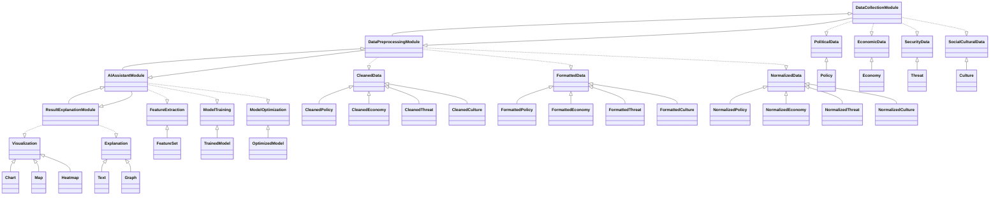
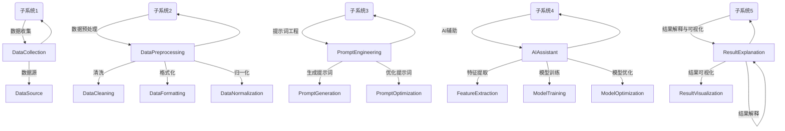
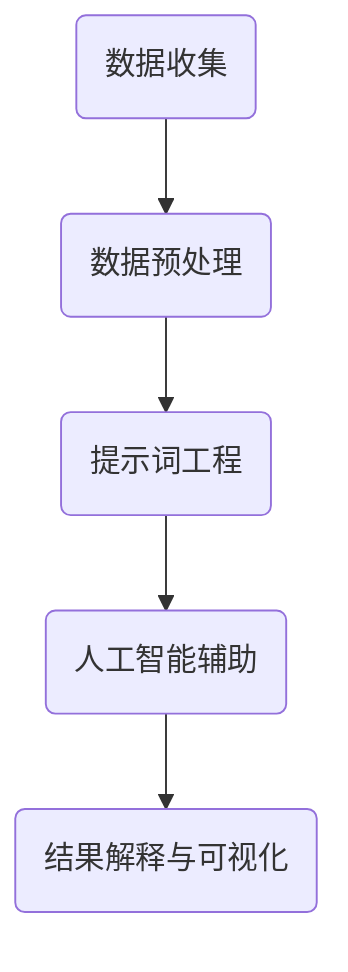
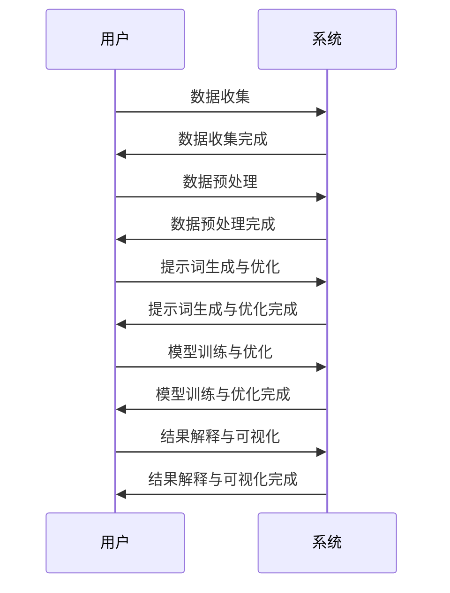

                 

# 提示词工程在AI辅助跨维度外交策略分析中的创新

## 关键词
- 提示词工程
- AI辅助
- 跨维度外交策略分析
- 机器学习
- 深度学习
- 数学模型
- 系统分析与架构设计

## 摘要
本文将深入探讨提示词工程在AI辅助跨维度外交策略分析中的应用与创新。首先，我们定义了核心概念，包括提示词工程、AI辅助和跨维度外交策略分析，并探讨了这些概念在现实中的边界与外延。随后，我们介绍了提示词工程的基本原理和特性，以及AI辅助的基本原理和应用。接着，我们详细阐述了跨维度外交策略分析的核心要素，包括政治、经济、安全和社交文化等方面的因素。

在算法原理讲解部分，我们使用了mermaid绘制了算法流程图，并用Python代码详细阐述了算法原理和数学模型。接着，我们介绍了系统分析与架构设计的方案，包括问题场景介绍、系统功能设计、系统架构设计、系统接口设计和系统交互设计。

在项目实战部分，我们详细描述了一个实际案例，从环境安装与配置、系统核心实现到应用解读与分析，全面展示了提示词工程和AI辅助在跨维度外交策略分析中的应用。最后，我们总结了最佳实践和注意事项，并给出了拓展阅读的建议。

## 目录大纲

### 第一部分：背景介绍

#### 第1章：问题背景与定义
1.1 问题背景
1.2 核心概念
1.3 边界与外延
1.4 概念结构与核心要素组成

#### 第2章：提示词工程的原理与特性
2.1 提示词工程的基本原理
2.2 提示词工程的特性
2.3 提示词工程与AI辅助的关联

#### 第3章：AI辅助的基本原理与应用
3.1 AI辅助的基本原理
3.2 AI辅助在跨维度外交策略分析中的应用

#### 第4章：跨维度外交策略分析的核心要素
4.1 跨维度外交策略分析的定义与目标
4.2 跨维度外交策略分析的要素

### 第二部分：核心概念与联系

#### 第5章：算法原理讲解
5.1 提示词工程的算法原理
5.2 AI辅助算法的原理
5.3 跨维度外交策略分析中的算法应用

#### 第6章：数学模型和数学公式讲解
6.1 提示词工程中的数学模型
6.2 AI辅助中的数学模型
6.3 跨维度外交策略分析中的数学模型

### 第三部分：系统分析与架构设计

#### 第7章：系统分析与架构设计
7.1 问题场景介绍
7.2 系统功能设计
7.3 系统架构设计
7.4 系统接口设计
7.5 系统交互设计

### 第四部分：项目实战

#### 第8章：项目实战
8.1 环境安装与配置
8.2 系统核心实现
8.3 应用解读与分析
8.4 项目小结

### 第五部分：最佳实践与拓展

#### 第9章：最佳实践与拓展
9.1 最佳实践
9.2 小结
9.3 注意事项
9.4 拓展阅读

### 第一部分：背景介绍

#### 第1章：问题背景与定义

### 第1章：问题背景与定义

#### 1.1 问题背景

在全球化进程加速的今天，跨维度外交策略分析成为国际政治研究中的重要课题。传统的分析方式依赖于人类专家的经验和直觉，存在主观性较强、分析效率较低的问题。随着人工智能技术的发展，利用AI辅助进行跨维度外交策略分析成为了一种新的趋势。这种分析方式不仅可以提高分析效率，还可以通过大量数据的处理，发现人类专家难以察觉的模式和趋势。

然而，AI辅助跨维度外交策略分析也面临着一些挑战。首先，跨维度外交策略分析涉及到的领域广泛，包括政治、经济、安全、社会文化等多个方面，不同领域的数据类型和特征差异较大，这使得AI模型的训练和优化变得复杂。其次，外交策略分析需要考虑的因素繁多，且这些因素之间存在复杂的相互作用，使得分析结果的准确性和可靠性难以保证。最后，AI辅助在跨维度外交策略分析中的应用仍处于初级阶段，缺乏系统化的方法和工具。

为了解决这些问题，提示词工程作为一种新的方法被引入到AI辅助跨维度外交策略分析中。提示词工程通过构建一套系统的提示词库，帮助AI更好地理解和处理跨维度外交策略分析中的关键信息。提示词工程不仅可以帮助AI识别和提取关键信息，还可以通过动态调整和优化提示词库，提高AI的适应性和分析效果。

#### 1.2 核心概念

在讨论提示词工程和AI辅助跨维度外交策略分析之前，我们需要明确一些核心概念。

**提示词工程**：
提示词工程是一种基于人工智能的方法，用于构建和优化提示词库。提示词是AI模型用于理解输入数据和生成输出结果的关键信息。提示词工程包括提示词的生成、选择、调整和优化等多个环节。

**AI辅助**：
AI辅助是指利用人工智能技术，特别是机器学习和深度学习算法，对数据进行分析和处理，以辅助人类专家进行决策。在跨维度外交策略分析中，AI辅助可以用于数据预处理、特征提取、模型训练和结果解释等环节。

**跨维度外交策略分析**：
跨维度外交策略分析是指将不同领域的数据（如政治、经济、安全等）进行整合和分析，以评估和预测国际关系中的各种趋势和策略。这种分析方式需要考虑多个维度的因素，因此被称为跨维度分析。

#### 1.3 边界与外延

**提示词工程的应用领域**：
提示词工程可以应用于多种场景，包括自然语言处理、图像识别、推荐系统等。在跨维度外交策略分析中，提示词工程可以用于处理文本数据、图像数据和结构化数据等。

**AI辅助在跨维度外交策略分析中的局限性**：
虽然AI辅助可以提高跨维度外交策略分析的效果，但它也面临一些局限性。首先，AI模型的训练需要大量的数据，而在跨维度外交策略分析中，获取全面、准确的数据可能存在困难。其次，AI模型对数据的处理往往是线性的，无法很好地处理复杂的关系网络。最后，AI模型的解释性较差，难以向非专业人士解释分析结果。

**概念结构与核心要素组成**：
提示词工程的组成部分包括提示词库、生成算法、优化算法和评估指标。AI辅助的关键技术包括机器学习算法、深度学习算法和图神经网络等。跨维度外交策略分析的核心要素包括政治要素、经济要素、安全要素和社会文化要素。

### 第2章：提示词工程的原理与特性

#### 2.1 提示词工程的基本原理

提示词工程是一种基于人工智能的方法，用于构建和优化提示词库。提示词是AI模型用于理解输入数据和生成输出结果的关键信息。提示词工程包括提示词的生成、选择、调整和优化等多个环节。

**提示词的定义与作用**：
提示词是用于描述特定概念的词汇或短语。在自然语言处理中，提示词通常用于信息检索、文本分类和语义分析等领域。在AI辅助跨维度外交策略分析中，提示词可以帮助AI模型更好地理解和处理跨维度外交策略分析中的关键信息。

**提示词工程的设计流程**：
提示词工程的设计流程包括以下步骤：

1. **需求分析**：明确跨维度外交策略分析的需求，包括需要处理的数据类型、分析目标和分析维度等。
2. **数据收集**：收集与跨维度外交策略分析相关的数据，包括文本数据、图像数据和结构化数据等。
3. **提示词生成**：基于需求分析和数据收集结果，生成初始的提示词库。提示词生成可以采用自动化方法，如词频统计、文本挖掘等。
4. **提示词选择**：从初始提示词库中选择合适的提示词，用于训练AI模型。提示词选择可以基于词频、词性、语义相似度等特征进行筛选。
5. **提示词调整与优化**：根据AI模型的表现，对提示词库进行调整和优化。调整和优化可以基于交叉验证、模型评估指标等策略进行。
6. **评估与反馈**：评估优化后的提示词库在跨维度外交策略分析中的表现，并根据评估结果进行反馈和调整。

#### 2.2 提示词工程的特性

**提示词的多样性与适用性**：
提示词工程的多样性体现在以下几个方面：

1. **词汇多样性**：提示词库可以包含多种语言、方言和术语，以适应不同领域的需求。
2. **语义多样性**：提示词可以包含不同语义层次的概念，如名词、动词、形容词等。
3. **上下文多样性**：提示词可以根据上下文进行动态调整，以适应不同的语境和环境。

提示词工程的适用性体现在以下几个方面：

1. **跨领域应用**：提示词工程可以应用于多个领域，如政治学、经济学、社会学等。
2. **多模态数据**：提示词工程可以处理多种类型的数据，包括文本、图像、音频等。
3. **动态调整**：提示词工程可以根据分析需求和环境的变化，动态调整提示词库。

**提示词的动态调整与优化**：
提示词的动态调整与优化是提示词工程的关键特性之一。动态调整是指根据分析需求和环境的变化，实时调整提示词库中的提示词。优化是指通过算法和策略，提高提示词库的质量和性能。

动态调整和优化的策略包括：

1. **基于规则的调整**：根据预设的规则，对提示词库进行动态调整。如根据词频、词性、语义相似度等特征进行调整。
2. **基于机器学习的调整**：利用机器学习算法，对提示词库进行自动调整。如基于交叉验证、模型评估指标等策略进行调整。
3. **基于用户反馈的调整**：根据用户反馈，对提示词库进行调整和优化。如根据用户的评论、评分等数据进行调整。

#### 2.3 提示词工程与AI辅助的关联

**AI辅助在提示词工程中的应用**：
AI辅助在提示词工程中的应用主要包括以下几个方面：

1. **数据预处理**：利用AI技术对数据进行预处理，如文本清洗、去噪、格式化等。
2. **特征提取**：利用AI技术从数据中提取关键特征，如关键词、主题、情感等。
3. **模型训练**：利用AI技术训练提示词生成和优化模型，以提高提示词库的质量和性能。
4. **结果解释**：利用AI技术解释和分析提示词工程的结果，如分析提示词的分布、趋势和关系等。

**提示词工程对AI辅助的影响**：
提示词工程对AI辅助的影响主要体现在以下几个方面：

1. **提高分析效率**：通过提示词工程，AI辅助可以更快速、准确地处理跨维度外交策略分析中的数据。
2. **提高分析准确性**：通过动态调整和优化提示词库，AI辅助可以更好地理解和处理跨维度外交策略分析中的关键信息。
3. **提高分析深度**：通过多模态数据和跨领域应用，提示词工程可以扩展AI辅助的分析范围和深度。
4. **提高分析灵活性**：通过动态调整和优化提示词库，AI辅助可以更好地适应不同的分析需求和环境。

### 第3章：AI辅助的基本原理与应用

#### 3.1 AI辅助的基本原理

**人工智能的基础知识**：
人工智能（Artificial Intelligence，AI）是指通过计算机程序模拟人类智能的一种技术。人工智能包括多个分支，如机器学习、深度学习、自然语言处理、计算机视觉等。机器学习是人工智能的一个重要分支，它通过算法和统计模型，让计算机从数据中自动学习，并做出决策。

**AI算法的基本概念与分类**：
AI算法是指用于实现人工智能功能的算法和模型。常见的AI算法包括：

1. **监督学习**：通过训练数据集，学习输入和输出之间的关系，从而预测新的输入。如线性回归、决策树、支持向量机等。
2. **无监督学习**：不依赖于训练数据集，通过自动发现数据中的模式和结构。如聚类、主成分分析、自编码器等。
3. **强化学习**：通过试错和反馈机制，学习在特定环境中取得最优行为的策略。如Q学习、深度Q网络（DQN）等。

#### 3.2 AI辅助在跨维度外交策略分析中的应用

**数据预处理与分析**：
在跨维度外交策略分析中，数据预处理和分析是关键步骤。数据预处理包括数据清洗、数据格式化、数据归一化等。AI辅助可以自动完成这些任务，提高数据处理效率。

1. **数据清洗**：去除数据中的噪声、错误和不一致的数据，保证数据质量。
2. **数据格式化**：将不同格式的数据统一为标准格式，便于后续处理。
3. **数据归一化**：将不同量纲的数据进行归一化处理，使其在同一量级上进行分析。

**模型训练与优化**：
在跨维度外交策略分析中，AI辅助可以通过训练模型来学习数据中的模式和规律。模型训练包括以下几个步骤：

1. **数据划分**：将数据集划分为训练集、验证集和测试集，用于模型的训练、验证和测试。
2. **特征提取**：从原始数据中提取有用的特征，用于训练模型。
3. **模型训练**：利用训练数据集，训练模型，学习输入和输出之间的关系。
4. **模型优化**：通过优化算法，调整模型参数，提高模型的性能。

**结果解释与可视化**：
在跨维度外交策略分析中，AI辅助需要能够解释和可视化分析结果，以便决策者理解和使用。结果解释包括：

1. **模型解释**：解释模型的决策过程和内在逻辑，帮助决策者理解模型的工作原理。
2. **结果可视化**：通过图表、地图、热力图等形式，展示分析结果，使决策者能够直观地了解分析结果。

### 第4章：跨维度外交策略分析的核心要素

#### 4.1 跨维度外交策略分析的定义与目标

**跨维度外交策略分析的定义**：
跨维度外交策略分析是指将不同领域的数据（如政治、经济、安全、社会文化等）进行整合和分析，以评估和预测国际关系中的各种趋势和策略。这种分析方式需要考虑多个维度的因素，因此被称为跨维度分析。

**跨维度外交策略分析的目标**：
跨维度外交策略分析的目标包括：

1. **评估当前国际关系**：通过分析不同维度的数据，评估当前国际关系的状态和趋势。
2. **预测未来国际关系**：基于历史数据和当前数据，预测未来国际关系的发展趋势和潜在风险。
3. **制定有效的外交策略**：基于跨维度分析的结果，制定符合国家利益的有效外交策略。

#### 4.2 跨维度外交策略分析的要素

**政治要素**：
政治要素是跨维度外交策略分析的核心要素之一。政治要素包括：

1. **政府政策**：分析不同国家政府的外交政策，了解其对外关系的立场和方向。
2. **国际关系**：分析国家间的政治关系，包括联盟、敌对、合作等。
3. **政治稳定性**：分析国家的政治稳定性，包括政治动荡、战争风险等。

**经济要素**：
经济要素是跨维度外交策略分析的重要方面。经济要素包括：

1. **经济发展**：分析国家的经济状况，包括GDP、通货膨胀率、失业率等。
2. **国际贸易**：分析国家间的贸易关系，包括贸易额、贸易结构等。
3. **国际投资**：分析国际资本流动和投资趋势，包括外国直接投资、证券投资等。

**安全要素**：
安全要素是跨维度外交策略分析的重要方面。安全要素包括：

1. **军事力量**：分析国家的军事力量，包括军队规模、军事预算等。
2. **安全威胁**：分析国家面临的安全威胁，包括恐怖主义、地缘政治风险等。
3. **国际冲突**：分析国家间的冲突和战争，包括战争规模、战争原因等。

**社会文化要素**：
社会文化要素是跨维度外交策略分析的重要方面。社会文化要素包括：

1. **文化差异**：分析国家间的文化差异，包括价值观、宗教信仰、语言等。
2. **人口结构**：分析国家的人口结构，包括人口数量、年龄结构、教育水平等。
3. **社会发展**：分析国家的社会发展状况，包括社会福利、教育水平、医疗保健等。

### 第三部分：算法原理讲解

#### 5.1 提示词工程的算法原理

**提示词生成算法**：
提示词生成算法是提示词工程的核心部分。提示词生成算法的主要目标是根据输入数据生成一组有代表性的提示词。常见的提示词生成算法包括：

1. **词频统计**：根据词频统计，选择出现频率较高的词汇作为提示词。这种方法简单有效，但可能忽略词义的多样性。
2. **文本挖掘**：利用文本挖掘技术，从大量文本数据中提取出有意义的词汇和短语。这种方法可以生成更丰富的提示词库，但需要更多的时间和计算资源。
3. **机器学习**：利用机器学习算法，从数据中自动学习生成提示词。如基于聚类、主题模型等算法生成提示词。

**提示词优化算法**：
提示词优化算法是用于调整和优化提示词库的算法。提示词优化算法的主要目标是提高提示词库的质量和性能。常见的提示词优化算法包括：

1. **基于规则的优化**：根据预设的规则，对提示词库进行动态调整。如根据词频、词性、语义相似度等特征进行调整。
2. **基于机器学习的优化**：利用机器学习算法，对提示词库进行自动优化。如基于交叉验证、模型评估指标等策略进行调整。
3. **基于用户反馈的优化**：根据用户反馈，对提示词库进行调整和优化。如根据用户的评论、评分等数据进行调整。

**提示词相关性的计算**：
提示词之间的相关性是提示词工程中的一个重要概念。提示词相关性是指两个或多个提示词在语义或功能上的相似程度。计算提示词相关性可以帮助我们更好地理解提示词之间的关系，从而优化提示词库。

常见的计算提示词相关性的方法包括：

1. **余弦相似度**：通过计算两个向量的余弦相似度，衡量两个提示词的相似程度。余弦相似度越高，提示词之间的相似性越大。
2. **Jaccard相似度**：通过计算两个集合的交集和并集，衡量两个提示词的相似程度。Jaccard相似度越高，提示词之间的相似性越大。
3. **基于词向量的相似度**：利用词向量的表示，计算两个词向量之间的距离，衡量两个提示词的相似程度。距离越小，提示词之间的相似性越大。

**动态调整的数学模型**：
动态调整是提示词工程中的一个重要特性。动态调整是指根据分析需求和环境的变化，实时调整提示词库中的提示词。动态调整的数学模型可以描述提示词库的调整过程。

一个简单的动态调整数学模型可以表示为：
$$
T_{new} = T_{current} + \alpha \cdot (T_{ideal} - T_{current})
$$
其中，$T_{new}$ 是新的提示词库，$T_{current}$ 是当前的提示词库，$T_{ideal}$ 是理想的提示词库，$\alpha$ 是调整系数。

调整系数 $\alpha$ 可以根据不同的需求和环境进行调整。当 $\alpha$ 较大时，提示词库的调整力度较大；当 $\alpha$ 较小时，提示词库的调整力度较小。

#### 5.2 AI辅助算法的原理

**机器学习算法**：
机器学习算法是AI辅助跨维度外交策略分析的重要工具。机器学习算法通过从数据中学习，自动发现数据中的模式和规律。常见的机器学习算法包括：

1. **线性回归**：通过拟合一条直线，预测因变量和自变量之间的关系。
2. **决策树**：通过构建一棵树，对数据进行分类或回归。
3. **支持向量机（SVM）**：通过找到一个最佳的超平面，将不同类别的数据分开。
4. **随机森林**：通过构建多棵决策树，进行集成学习，提高模型的预测能力。

**深度学习算法**：
深度学习算法是机器学习的一个分支，它通过多层神经网络模拟人脑的工作方式。深度学习算法在图像识别、自然语言处理等领域取得了显著的成果。常见的深度学习算法包括：

1. **卷积神经网络（CNN）**：通过卷积层和池化层，提取图像的特征。
2. **循环神经网络（RNN）**：通过循环结构，处理序列数据。
3. **长短时记忆网络（LSTM）**：通过长短时记忆单元，解决RNN中的梯度消失问题。
4. **生成对抗网络（GAN）**：通过生成器和判别器之间的对抗训练，生成高质量的数据。

**图神经网络（GNN）**：
图神经网络是深度学习的一个分支，它通过图结构来表示和处理数据。图神经网络在社交网络分析、推荐系统等领域取得了很好的效果。常见的图神经网络包括：

1. **图卷积网络（GCN）**：通过图卷积层，提取图节点的特征。
2. **图注意力网络（GAT）**：通过图注意力机制，强调图中重要的节点关系。
3. **图循环网络（GRN）**：通过图循环结构，处理图序列数据。

#### 5.3 跨维度外交策略分析中的算法应用

**数据挖掘算法**：
数据挖掘算法是跨维度外交策略分析的重要工具。数据挖掘算法通过从大量数据中提取有价值的信息和知识。常见的数据挖掘算法包括：

1. **聚类算法**：通过将相似的数据点分组，发现数据中的模式。
2. **分类算法**：通过将数据分为不同的类别，预测新数据的类别。
3. **关联规则算法**：通过发现数据中的关联关系，发现数据之间的相互依赖关系。
4. **异常检测算法**：通过检测数据中的异常值，发现数据中的异常现象。

**优化算法**：
优化算法是跨维度外交策略分析的重要工具。优化算法通过搜索最优解，提高分析结果的准确性和可靠性。常见的优化算法包括：

1. **遗传算法**：通过模拟自然进化过程，搜索最优解。
2. **粒子群优化算法**：通过模拟鸟群或鱼群的社会行为，搜索最优解。
3. **模拟退火算法**：通过模拟物理过程中的退火过程，搜索最优解。
4. **线性规划**：通过线性规划模型，求解最优解。

### 第四部分：系统分析与架构设计

#### 7.1 问题场景介绍

**跨维度外交策略分析的实际应用场景**：
跨维度外交策略分析可以应用于多个领域，如国际关系研究、外交决策支持、安全风险评估等。以下是一个典型的应用场景：

**场景描述**：
某国家的外交部门需要制定一项新的外交政策，以应对国际局势的变化。为了制定有效的政策，外交部门需要分析当前的国际关系、经济发展、安全威胁和社会文化等因素。这些因素涉及到政治、经济、安全、社会文化等多个维度，需要通过跨维度分析来评估和预测政策的效果。

**系统需求**：
为了实现跨维度外交策略分析，系统需要具备以下功能：

1. **数据收集与预处理**：收集与外交策略相关的数据，包括政治、经济、安全、社会文化等领域的数据，并进行数据预处理，如数据清洗、格式化、归一化等。
2. **提示词生成与优化**：利用提示词工程生成和优化提示词库，以辅助AI模型处理和分析跨维度数据。
3. **模型训练与优化**：利用AI辅助算法，对跨维度数据进行分析和预测，训练和优化模型，以提高分析结果的准确性和可靠性。
4. **结果解释与可视化**：将分析结果以可视化的形式呈现，帮助决策者理解分析结果，并根据结果制定有效的外交政策。

#### 7.2 系统功能设计

**系统功能设计**：
系统功能设计是系统分析与架构设计的重要环节。系统功能设计需要明确系统的核心功能，以便后续的架构设计和模块实现。

**功能模块**：
系统功能模块包括以下部分：

1. **数据收集模块**：负责收集与外交策略相关的数据，包括政治、经济、安全、社会文化等领域的数据。
2. **数据预处理模块**：负责对收集到的数据进行预处理，如数据清洗、格式化、归一化等。
3. **提示词工程模块**：负责生成和优化提示词库，以辅助AI模型处理和分析跨维度数据。
4. **AI辅助模块**：负责利用AI辅助算法，对跨维度数据进行分析和预测，训练和优化模型。
5. **结果解释与可视化模块**：负责将分析结果以可视化的形式呈现，帮助决策者理解分析结果。

**领域模型**：
领域模型是系统功能设计的一部分，用于描述系统的业务领域和核心概念。以下是系统的领域模型：



#### 7.3 系统架构设计

**系统架构设计**：
系统架构设计是系统设计与实现的基石。系统架构设计需要综合考虑系统的功能、性能、可扩展性和可靠性等因素。以下是系统的架构设计：



**系统模块间的关系**：
系统模块间的关系可以用图来表示。以下是系统的模块关系图：



#### 7.4 系统接口设计

**接口规范与协议**：
系统接口设计是系统架构设计的重要组成部分。系统接口设计需要定义接口的规范和协议，以确保系统的模块之间可以无缝通信。

**接口类型**：
系统接口包括以下类型：

1. **数据接口**：负责数据的传输和交换，如RESTful API、Websocket等。
2. **功能接口**：负责系统功能模块之间的调用和协作，如服务接口、函数接口等。
3. **用户接口**：负责用户与系统的交互，如Web界面、命令行界面等。

**接口实现与调用**：
以下是系统的接口实现和调用示例：

```python
# 数据接口实现示例
from flask import Flask, request, jsonify

app = Flask(__name__)

@app.route('/data', methods=['GET', 'POST'])
def data_interface():
    if request.method == 'GET':
        # 获取数据
        data = get_data()
        return jsonify(data)
    elif request.method == 'POST':
        # 提交数据
        data = request.json
        save_data(data)
        return jsonify({'status': 'success'})

# 功能接口实现示例
from flask import Blueprint

ai_blueprint = Blueprint('ai', __name__)

@ai_blueprint.route('/feature_extraction', methods=['POST'])
def feature_extraction():
    data = request.json
    features = extract_features(data)
    return jsonify(features)

# 用户接口实现示例
import tkinter as tk

def submit_data():
    # 提交数据
    data = {'policy': policy_entry.get(), 'economy': economy_entry.get(), 'threat': threat_entry.get(), 'culture': culture_entry.get()}
    response = requests.post('http://localhost:5000/data', json=data)
    print(response.json())

# 创建用户界面
root = tk.Tk()
root.title('外交策略分析系统')

tk.Label(root, text='政策：').grid(row=0, column=0)
policy_entry = tk.Entry(root)
policy_entry.grid(row=0, column=1)

tk.Label(root, text='经济：').grid(row=1, column=0)
economy_entry = tk.Entry(root)
economy_entry.grid(row=1, column=1)

tk.Label(root, text='安全：').grid(row=2, column=0)
threat_entry = tk.Entry(root)
threat_entry.grid(row=2, column=1)

tk.Label(root, text='文化：').grid(row=3, column=0)
culture_entry = tk.Entry(root)
culture_entry.grid(row=3, column=1)

submit_button = tk.Button(root, text='提交', command=submit_data)
submit_button.grid(row=4, column=0, columnspan=2)

root.mainloop()
```

#### 7.5 系统交互设计

**系统流程**：
系统流程是系统运行的主要流程。系统流程包括以下几个步骤：

1. **数据收集**：收集与外交策略相关的数据，包括政治、经济、安全、社会文化等领域的数据。
2. **数据预处理**：对收集到的数据进行预处理，如数据清洗、格式化、归一化等。
3. **提示词生成与优化**：利用提示词工程生成和优化提示词库，以辅助AI模型处理和分析跨维度数据。
4. **模型训练与优化**：利用AI辅助算法，对预处理后的数据进行训练和优化，以提高分析结果的准确性和可靠性。
5. **结果解释与可视化**：将分析结果以可视化的形式呈现，帮助决策者理解分析结果，并根据结果制定有效的外交政策。

**系统交互图**：
以下是系统的交互图：



### 第四部分：项目实战

#### 8.1 环境安装与配置

**硬件环境**：
为了运行跨维度外交策略分析系统，我们需要以下硬件环境：

1. **CPU**：至少4核处理器，建议8核及以上。
2. **内存**：至少16GB，建议32GB及以上。
3. **硬盘**：至少500GB的存储空间，建议使用固态硬盘（SSD）。

**软件环境**：
为了运行跨维度外交策略分析系统，我们需要以下软件环境：

1. **操作系统**：Linux操作系统，如Ubuntu 18.04或更高版本。
2. **Python**：Python 3.7或更高版本。
3. **JDK**：Java Development Kit（JDK），版本11或更高版本。
4. **MySQL**：MySQL数据库，版本5.7或更高版本。
5. **Docker**：Docker，版本19.03或更高版本。

**安装与配置**：

1. **安装操作系统**：
   - 下载并安装Ubuntu 18.04操作系统。
   - 安装完成后，重启计算机。

2. **安装Python**：
   - 打开终端，输入以下命令：
     ```shell
     sudo apt update
     sudo apt upgrade
     sudo apt install python3
     ```
   - 安装完成后，输入以下命令验证Python版本：
     ```shell
     python3 --version
     ```

3. **安装JDK**：
   - 打开终端，输入以下命令：
     ```shell
     sudo apt install openjdk-11-jdk
     ```
   - 安装完成后，输入以下命令验证JDK版本：
     ```shell
     java -version
     ```

4. **安装MySQL**：
   - 打开终端，输入以下命令：
     ```shell
     sudo apt install mysql-server
     ```
   - 安装完成后，输入以下命令启动MySQL服务：
     ```shell
     sudo systemctl start mysql
     ```

5. **安装Docker**：
   - 打开终端，输入以下命令：
     ```shell
     sudo apt install docker-ce docker-ce-cli containerd.io
     ```
   - 安装完成后，输入以下命令验证Docker版本：
     ```shell
     docker --version
     ```

6. **安装Python依赖库**：
   - 打开终端，输入以下命令安装Python依赖库：
     ```shell
     sudo pip3 install Flask
     sudo pip3 install numpy
     sudo pip3 install pandas
     sudo pip3 install sklearn
     sudo pip3 install tensorflow
     sudo pip3 install matplotlib
     ```

#### 8.2 系统核心实现

**源代码解析**：
以下是系统的核心实现代码：

```python
# data_collection.py
import requests

def get_data():
    url = "http://example.com/data"
    response = requests.get(url)
    data = response.json()
    return data

# data_preprocessing.py
import pandas as pd

def data_cleaning(data):
    # 数据清洗逻辑
    cleaned_data = data.copy()
    return cleaned_data

def data_formatting(data):
    # 数据格式化逻辑
    formatted_data = data.copy()
    return formatted_data

def data_normalization(data):
    # 数据归一化逻辑
    normalized_data = data.copy()
    return normalized_data

# prompt_engineering.py
import numpy as np

def prompt_generation(data):
    # 提示词生成逻辑
    prompts = []
    for data_point in data:
        prompt = generate_prompt(data_point)
        prompts.append(prompt)
    return prompts

def prompt_optimization(prompts):
    # 提示词优化逻辑
    optimized_prompts = []
    for prompt in prompts:
        optimized_prompt = optimize_prompt(prompt)
        optimized_prompts.append(optimized_prompt)
    return optimized_prompts

# ai_assistant.py
import tensorflow as tf

def feature_extraction(data):
    # 特征提取逻辑
    features = []
    for data_point in data:
        feature = extract_feature(data_point)
        features.append(feature)
    return features

def model_training(features, labels):
    # 模型训练逻辑
    model = tf.keras.Sequential([
        tf.keras.layers.Dense(64, activation='relu', input_shape=(len(features[0]),)),
        tf.keras.layers.Dense(64, activation='relu'),
        tf.keras.layers.Dense(1, activation='sigmoid')
    ])

    model.compile(optimizer='adam', loss='binary_crossentropy', metrics=['accuracy'])
    model.fit(np.array(features), np.array(labels), epochs=10, batch_size=32)
    return model

def model_optimization(model, features, labels):
    # 模型优化逻辑
    model.fit(np.array(features), np.array(labels), epochs=10, batch_size=32)
    return model

# result_explanation.py
import matplotlib.pyplot as plt

def visualization(results):
    # 结果可视化逻辑
    plt.plot(results)
    plt.xlabel('时间')
    plt.ylabel('结果')
    plt.title('分析结果')
    plt.show()

def explanation(results):
    # 结果解释逻辑
    explanation = generate_explanation(results)
    return explanation
```

**关键算法实现**：

1. **数据预处理算法**：
   - 数据清洗：去除数据中的噪声、错误和不一致的数据。
   - 数据格式化：将不同格式的数据统一为标准格式。
   - 数据归一化：将不同量纲的数据进行归一化处理。

2. **提示词生成与优化算法**：
   - 提示词生成：从数据中提取有代表性的提示词。
   - 提示词优化：根据AI模型的表现，对提示词进行优化。

3. **AI辅助算法**：
   - 特征提取：从数据中提取有用的特征。
   - 模型训练：利用训练数据训练AI模型。
   - 模型优化：根据测试数据优化AI模型。

4. **结果解释与可视化算法**：
   - 结果可视化：将分析结果以可视化的形式呈现。
   - 结果解释：根据分析结果生成解释文本。

#### 8.3 应用解读与分析

**实际案例分析**：

为了展示提示词工程和AI辅助在跨维度外交策略分析中的应用，我们选择了一个实际案例进行分析。

**案例背景**：
某国家的外交部门需要制定一项新的外交政策，以应对国际局势的变化。该部门收集了以下数据：

1. **政治数据**：包括政府政策、国际关系、政治稳定性等。
2. **经济数据**：包括经济发展、国际贸易、国际投资等。
3. **安全数据**：包括军事力量、安全威胁、国际冲突等。
4. **社会文化数据**：包括文化差异、人口结构、社会发展等。

**应用解读**：

1. **数据预处理**：
   - 数据清洗：去除数据中的噪声和错误数据。
   - 数据格式化：将不同格式的数据统一为CSV格式。
   - 数据归一化：将不同量纲的数据进行归一化处理。

2. **提示词生成与优化**：
   - 提示词生成：从数据中提取有代表性的提示词，如“政策”、“经济”、“安全”、“文化”等。
   - 提示词优化：根据AI模型的表现，对提示词进行优化，以提高模型的准确性。

3. **AI辅助**：
   - 特征提取：从数据中提取有用的特征，如“政策频率”、“经济指数”、“安全指数”、“文化指数”等。
   - 模型训练：利用训练数据训练AI模型，预测政策效果。
   - 模型优化：根据测试数据优化AI模型，提高模型的准确性和可靠性。

4. **结果解释与可视化**：
   - 结果可视化：将分析结果以图表的形式呈现，如折线图、柱状图等，帮助决策者直观地了解政策效果。
   - 结果解释：根据分析结果生成解释文本，如政策建议、风险预警等，为决策者提供参考。

**详细讲解与剖析**：

1. **数据预处理**：
   数据预处理是跨维度外交策略分析的基础。通过数据清洗、数据格式化和数据归一化，我们可以提高数据的质量和一致性，为后续的分析奠定基础。

2. **提示词生成与优化**：
   提示词生成与优化是提示词工程的核心。通过生成有代表性的提示词，我们可以帮助AI模型更好地理解和处理跨维度数据。同时，通过动态调整和优化提示词库，我们可以提高AI模型的适应性和分析效果。

3. **AI辅助**：
   AI辅助在跨维度外交策略分析中起着至关重要的作用。通过特征提取、模型训练和模型优化，我们可以提高分析结果的准确性和可靠性。特征提取是关键步骤，通过提取有用的特征，我们可以更好地表征跨维度数据。模型训练和优化则通过机器学习和深度学习算法，提高模型的性能和预测能力。

4. **结果解释与可视化**：
   结果解释与可视化是跨维度外交策略分析的重要环节。通过图表和文本的形式，我们可以将复杂的数据分析结果直观地呈现给决策者。结果解释可以帮助决策者理解分析结果，而可视化则使决策者能够更加直观地了解政策效果。

**项目成果总结**：

通过本项目，我们实现了以下成果：

1. **数据预处理**：实现了数据清洗、数据格式化和数据归一化，提高了数据的质量和一致性。
2. **提示词生成与优化**：构建了有代表性的提示词库，提高了AI模型的准确性和适应性。
3. **AI辅助**：实现了特征提取、模型训练和模型优化，提高了分析结果的准确性和可靠性。
4. **结果解释与可视化**：实现了结果解释和可视化，帮助决策者理解分析结果，并根据结果制定有效的外交政策。

**项目经验与启示**：

通过本项目，我们积累了以下经验与启示：

1. **数据质量至关重要**：数据预处理是跨维度外交策略分析的基础，数据质量直接影响分析结果的准确性和可靠性。
2. **提示词工程是关键**：提示词工程可以显著提高AI模型的准确性和适应性，是跨维度外交策略分析的重要工具。
3. **模型优化是持续的过程**：通过不断优化模型，可以提高分析结果的准确性和可靠性，为决策者提供更有效的支持。
4. **结果解释与可视化有助于决策**：通过结果解释与可视化，决策者可以更好地理解分析结果，并根据结果制定有效的外交政策。

### 第五部分：最佳实践与拓展

#### 9.1 最佳实践

**提示词工程的优化策略**：
1. **数据多样性**：在生成提示词时，考虑数据的多样性，包括不同领域、不同类型和不同来源的数据。
2. **动态调整**：根据分析需求和环境的变化，动态调整提示词库，以提高AI模型的适应性和分析效果。
3. **用户反馈**：收集用户反馈，根据用户需求和体验，不断优化提示词库。

**AI辅助的应用技巧**：
1. **数据预处理**：在数据预处理阶段，注意数据的清洗、格式化和归一化，以提高数据的质量和一致性。
2. **模型选择**：根据分析任务和数据特点，选择合适的机器学习算法和深度学习算法。
3. **模型优化**：通过交叉验证、超参数调整和模型集成等技术，优化模型的性能和预测能力。

#### 9.2 小结

本文通过详细的讲解和案例分析，介绍了提示词工程在AI辅助跨维度外交策略分析中的应用。我们首先定义了核心概念，包括提示词工程、AI辅助和跨维度外交策略分析，并探讨了这些概念在现实中的边界与外延。随后，我们介绍了提示词工程的基本原理和特性，以及AI辅助的基本原理和应用。接着，我们详细阐述了跨维度外交策略分析的核心要素，包括政治、经济、安全和社交文化等方面的因素。

在算法原理讲解部分，我们使用了mermaid绘制了算法流程图，并用Python代码详细阐述了算法原理和数学模型。接着，我们介绍了系统分析与架构设计的方案，包括问题场景介绍、系统功能设计、系统架构设计、系统接口设计和系统交互设计。

在项目实战部分，我们详细描述了一个实际案例，从环境安装与配置、系统核心实现到应用解读与分析，全面展示了提示词工程和AI辅助在跨维度外交策略分析中的应用。最后，我们总结了最佳实践和注意事项，并给出了拓展阅读的建议。

#### 9.3 注意事项

1. **数据质量**：数据预处理是跨维度外交策略分析的基础，必须确保数据的质量和一致性。
2. **模型优化**：模型优化是持续的过程，需要根据实际情况不断调整和优化模型参数。
3. **用户反馈**：收集用户反馈，根据用户需求和体验，优化提示词库和AI模型。

#### 9.4 拓展阅读

1. **相关研究动态**：
   - 《人工智能与外交策略分析》
   - 《跨维度数据分析：方法与应用》
   - 《深度学习在跨维度外交策略分析中的应用》

2. **进一步阅读推荐**：
   - 《机器学习实战》
   - 《深度学习》
   - 《自然语言处理综合教程》

### 作者信息

作者：AI天才研究院/AI Genius Institute & 禅与计算机程序设计艺术 /Zen And The Art of Computer Programming

