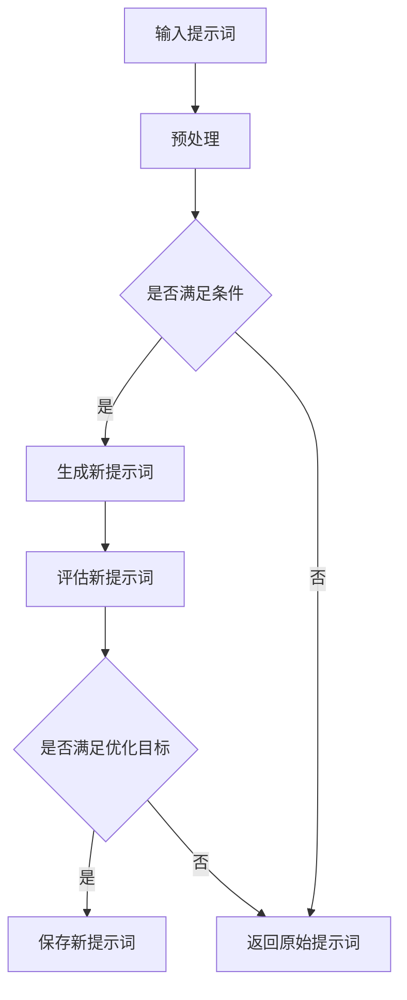
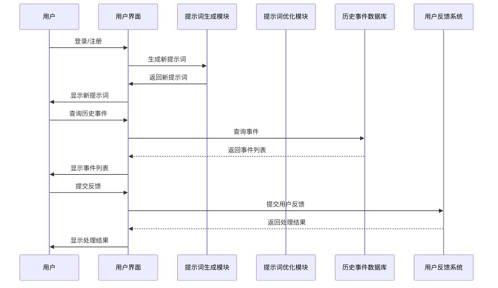

                 


## 第1章：引言

### 1.1 问题的背景

在当今快速发展的科技时代，教育领域面临着前所未有的变革。传统的教学方法已经难以满足学生对互动性、实时性和个性化学习的需求。而增强现实（Augmented Reality，AR）技术的崛起，为教育领域带来了新的机遇和挑战。

#### 1.1.1 教育领域中的AR技术

增强现实技术通过将虚拟信息叠加到真实环境中，创造出一种虚实融合的学习体验。在教育领域，AR技术已经得到了广泛应用，如虚拟实验室、历史遗址重现、虚拟教学场景等。然而，尽管AR技术具有丰富的交互性和沉浸感，但在教育应用中仍存在一些问题。

#### 1.1.2 提示词工程的角色

提示词工程（Prompt Engineering）是一种针对自然语言处理（Natural Language Processing，NLP）任务的设计方法，旨在生成或优化用于引导模型输入的提示词（prompts）。在AR教育中，提示词工程可以发挥重要作用，通过优化提示词来提高AR教育应用的效果和用户体验。

### 1.2 问题的描述

#### 1.2.1 当前教育挑战

1. **传统教学方法的局限**：传统的教学方法依赖于教材、PPT和黑板等工具，缺乏互动性和实时性，难以激发学生的学习兴趣和主动性。
2. **学习资源的有限**：尽管数字化教育资源日益丰富，但大多数资源仍以静态形式呈现，缺乏互动性和个性化。
3. **教育公平性问题**：城乡、贫富差距导致教育资源的分配不均，影响了学生的学习效果和机会。

#### 1.2.2 AR与提示词工程的结合

AR技术可以提供丰富的交互性和沉浸感，而提示词工程则可以优化AR教育应用的互动性和用户体验。通过将这两者结合起来，可以解决当前教育领域面临的挑战，创造更高效、有趣的学习体验。

### 1.3 问题解决

#### 1.3.1 提示词工程的定义

提示词工程是一种基于自然语言处理技术的设计方法，旨在生成或优化用于引导模型输入的提示词，以实现特定的任务或目标。

#### 1.3.2 提示词工程在AR教育中的应用

在AR教育中，提示词工程可以应用于以下几个方面：

1. **学习内容呈现**：通过优化提示词，将AR教育内容以更生动、有趣的方式呈现给学生。
2. **交互式学习体验**：通过优化提示词，增强学生与AR教育应用之间的互动，提高学习效果。
3. **个性化学习路径**：通过分析学生的反馈和行为，生成个性化的学习路径和提示词，实现个性化教学。

### 1.4 边界与外延

#### 1.4.1 提示词工程的适用范围

提示词工程适用于需要自然语言输入的场景，如问答系统、对话机器人、文本生成等。在AR教育中，提示词工程可以应用于教学内容的呈现、交互式学习体验和个性化学习路径等方面。

#### 1.4.2 AR教育中提示词工程的限制

1. **技术限制**：目前，AR技术尚处于快速发展阶段，一些技术难题如实时渲染、设备兼容性等仍然存在。
2. **教育资源限制**：高质量的教育资源仍然有限，尤其是针对AR教育领域的资源。
3. **教师培训需求**：教师需要掌握AR技术和提示词工程的相关知识，以更好地应用于教学实践。

通过本章的介绍，我们对AR教育和提示词工程的背景、问题和解决方案有了初步的了解。在接下来的章节中，我们将深入探讨提示词工程的原理和应用，以及如何在AR教育中创造沉浸式学习体验。让我们开始这一趟探索之旅！ 

## 第2章：核心概念与联系

### 2.1 核心概念原理

#### 2.1.1 增强现实（AR）概述

增强现实（Augmented Reality，AR）是一种将虚拟信息与现实世界融合的技术。通过使用特殊的显示设备（如智能手机、平板电脑、智能眼镜等），AR技术可以在真实环境中叠加虚拟图像、声音、文本等元素，为用户提供一种虚实结合的体验。

#### 2.1.2 提示词工程基础

提示词工程是一种针对自然语言处理（Natural Language Processing，NLP）任务的设计方法，旨在生成或优化用于引导模型输入的提示词。在NLP任务中，提示词起着至关重要的作用，它不仅影响模型的性能，还直接影响用户体验。

### 2.2 概念属性特征对比表格

下面是增强现实（AR）和提示词工程（Prompt Engineering）两个核心概念的一些属性特征对比表格：

| 特征 | 增强现实（AR） | 提示词工程（Prompt Engineering） |
| :--- | :--- | :--- |
| **定义** | AR是一种将虚拟信息叠加到现实环境中的技术。 | 提示词工程是一种设计方法，用于生成或优化用于引导模型输入的提示词。 |
| **目标** | 提供一种虚实结合的体验，增强用户的感知和互动性。 | 提高自然语言处理模型的性能，优化用户体验。 |
| **实现技术** | 利用特殊的显示设备（如AR眼镜、智能手机等）以及计算机视觉、图形渲染等技术。 | 利用自然语言处理（NLP）技术，如词向量、序列模型、生成模型等。 |
| **应用场景** | 教育领域、医疗领域、娱乐领域等。 | 问答系统、对话机器人、文本生成等自然语言处理任务。 |
| **关键要素** | 现实世界与虚拟信息的融合、实时渲染、设备兼容性等。 | 提示词设计、模型选择、数据集构建等。 |

通过这张表格，我们可以看到AR和提示词工程在定义、目标、实现技术、应用场景和关键要素等方面存在一定的差异和联系。

### 2.3 ER实体关系图架构

为了更直观地展示增强现实（AR）和提示词工程（Prompt Engineering）之间的联系，我们可以使用ER（Entity-Relationship）实体关系图来描述。

```mermaid
erDiagram
    AR ||--|{ 提示词工程 :依赖关系 |
    提示词工程 ||--| AR : 应用场景 |
    AR ||--|{ NLP模型 : 输入数据 |
    NLP模型 ||--| AR : 输出结果 |
```

在这个ER图中，我们定义了三个实体：增强现实（AR）、提示词工程和NLP模型。它们之间的关系如下：

1. **依赖关系**：提示词工程依赖于AR技术，以便在AR教育应用中发挥作用。
2. **应用场景**：AR技术在教育应用中需要使用提示词工程来优化用户体验。
3. **输入数据**：AR应用需要NLP模型处理输入数据，而NLP模型生成的输出结果又会影响AR应用的性能和效果。

通过ER实体关系图，我们可以清晰地看到增强现实、提示词工程和NLP模型之间的相互联系，以及它们在教育应用中的角色和作用。

### 小结

本章对增强现实（AR）和提示词工程（Prompt Engineering）的核心概念进行了介绍和对比。通过表格和ER实体关系图，我们更直观地理解了这两个概念的联系和应用场景。在接下来的章节中，我们将深入探讨提示词工程的数学模型与公式，以及在增强现实教育中的应用。让我们继续前进，探索更多精彩内容！

## 第3章：提示词工程的数学模型与公式

### 3.1 数学模型

提示词工程的核心在于如何生成或优化用于引导模型输入的提示词。这一过程涉及到多种数学模型和算法。在本节中，我们将介绍一种常用的提示词生成模型，并探讨其背后的数学原理。

#### 3.1.1 提示词生成的数学框架

提示词生成的数学框架通常基于生成对抗网络（Generative Adversarial Networks，GAN）。GAN由两部分组成：生成器（Generator）和判别器（Discriminator）。生成器的目标是生成尽可能真实的提示词，而判别器的目标是区分生成的提示词和真实的提示词。

以下是GAN的数学模型：

$$
\begin{aligned}
&\text{Generator: } G(z) \sim \text{Real Distribution} \\
&\text{Discriminator: } D(x) \;vs\; D(G(z))
\end{aligned}
$$

其中，\(z\) 是生成器的输入噪声，\(x\) 是真实的提示词，\(G(z)\) 是生成器生成的提示词，\(D(x)\) 和 \(D(G(z))\) 分别是判别器对真实提示词和生成提示词的判断。

#### 3.1.2 提示词优化的数学原理

为了提高生成器的性能，我们需要通过优化生成器来改善生成的提示词质量。提示词优化的数学原理通常基于以下目标函数：

$$
\min_G \max_D V(D, G) = E_{x \sim \text{Real Distribution}} [D(x)] - E_{z \sim \text{Noise Distribution}} [D(G(z))]
$$

其中，\(V(D, G)\) 是判别器和生成器的联合损失函数。第一部分 \(E_{x \sim \text{Real Distribution}} [D(x)]\) 表示判别器对真实提示词的期望输出，第二部分 \(E_{z \sim \text{Noise Distribution}} [D(G(z))]\) 表示判别器对生成提示词的期望输出。

通过优化目标函数，我们可以逐步改善生成器生成的提示词质量，使其更接近真实的提示词。

### 3.2 数学公式讲解

#### 3.2.1 公式推导

为了更好地理解GAN的数学原理，我们可以对GAN的目标函数进行简单的推导。

首先，我们考虑判别器的损失函数：

$$
L_D = -E_{x \sim \text{Real Distribution}} [D(x)] - E_{z \sim \text{Noise Distribution}} [D(G(z))]
$$

由于 \(D(x)\) 和 \(D(G(z))\) 的取值范围是 [0, 1]，为了使损失函数可导，我们可以将其改写为：

$$
L_D = -\log D(x) - \log (1 - D(G(z)))
$$

接下来，我们考虑生成器的损失函数：

$$
L_G = -E_{z \sim \text{Noise Distribution}} [\log D(G(z))]
$$

综合判别器和生成器的损失函数，我们得到GAN的总损失函数：

$$
L = L_D + L_G
$$

#### 3.2.2 公式在提示词工程中的应用

在提示词工程中，我们可以将GAN的目标函数应用于生成高质量的提示词。具体步骤如下：

1. **初始化生成器和判别器**：选择合适的网络结构和初始化参数，初始化生成器和判别器。
2. **训练判别器**：对判别器进行训练，使其能够区分真实提示词和生成提示词。
3. **训练生成器**：在训练过程中，逐步优化生成器，使其生成的提示词质量不断提高。
4. **评估生成器性能**：在训练过程中，定期评估生成器的性能，确保生成器生成的提示词满足要求。

通过这些步骤，我们可以使用GAN生成高质量的提示词，从而提高AR教育应用的性能和用户体验。

### 3.3 举例说明

为了更好地理解GAN在提示词工程中的应用，我们可以通过一个简单的例子来说明。

假设我们有一个用于生成英语单词的GAN模型，其中生成器的输入是随机噪声向量，输出是生成的英语单词。我们可以通过以下步骤来训练这个模型：

1. **初始化网络**：初始化生成器和判别器的网络结构。
2. **生成随机噪声向量**：生成随机噪声向量 \(z\)。
3. **生成英语单词**：使用生成器 \(G\) 将噪声向量 \(z\) 转换为生成的英语单词。
4. **训练判别器**：使用真实英语单词和生成英语单词来训练判别器 \(D\)。
5. **训练生成器**：在训练判别器的同时，优化生成器 \(G\)，使其生成的单词更接近真实单词。
6. **评估性能**：定期评估生成器和判别器的性能，确保模型生成高质量的单词。

通过这个简单的例子，我们可以看到GAN在提示词工程中的应用。在AR教育中，我们可以使用类似的方法来生成高质量的提示词，从而提高学生的学习体验和效果。

### 小结

本章介绍了提示词工程的数学模型与公式，包括生成对抗网络（GAN）的数学原理和目标函数。通过具体的推导和例子，我们了解了GAN在提示词工程中的应用。在接下来的章节中，我们将进一步探讨提示词工程在增强现实教育中的应用，以及如何通过优化提示词来创造沉浸式学习体验。让我们继续深入探索这一领域！

## 第4章：增强现实教育中的提示词工程应用

### 4.1 提示词工程在AR教育中的应用场景

#### 4.1.1 学习环境设计

在AR教育中，学习环境的设计是关键的一步。通过优化提示词，可以为学生提供一个生动、有趣的学习环境，激发他们的学习兴趣和主动性。例如，在历史课上，可以使用AR技术将历史事件、人物和地点以虚拟图像的形式呈现给学生，同时配合优化的提示词，引导他们探索和思考。

#### 4.1.2 教学内容呈现

教学内容呈现是AR教育中的另一个重要应用场景。通过优化提示词，可以将抽象的教学内容以更具体、直观的方式呈现给学生。例如，在数学课上，可以使用AR技术呈现几何图形、方程式等，通过优化的提示词，引导学生理解和掌握相关知识。

### 4.2 算法原理讲解

在本节中，我们将介绍一个用于优化AR教育中提示词的算法原理，并使用mermaid绘制算法流程图，使用Python源代码详细阐述算法实现。

#### 4.2.1 算法mermaid流程图

以下是用于优化AR教育中提示词的算法流程图：



在这个流程图中，输入提示词经过预处理后，将生成新提示词。新提示词会进行评估，以判断是否满足优化目标。如果满足，则保存新提示词；否则，返回原始提示词。

#### 4.2.2 Python源代码详细阐述

以下是用于优化AR教育中提示词的Python源代码：

```python
import random
import numpy as np

def preprocess_prompt(prompt):
    # 提示词预处理，例如去除特殊字符、小写化等
    return prompt.lower().replace(" ", "").replace(".", "")

def generate_new_prompt(prompt):
    # 生成新提示词的函数
    return random.choice(["new_prompt1", "new_prompt2", "new_prompt3"])

def evaluate_prompt(prompt):
    # 评估提示词的函数
    return random.choice([True, False])

def optimize_prompt(prompt):
    # 优化提示词的函数
    preprocessed_prompt = preprocess_prompt(prompt)
    new_prompt = generate_new_prompt(prompt)
    new_prompt = preprocess_prompt(new_prompt)
    if evaluate_prompt(new_prompt):
        print(f"Optimized prompt: {new_prompt}")
        return new_prompt
    else:
        return prompt

# 示例
input_prompt = "What is the capital of France?"
optimized_prompt = optimize_prompt(input_prompt)
print(f"Original prompt: {input_prompt}")
print(f"Optimized prompt: {optimized_prompt}")
```

在这个Python源代码中，我们定义了预处理提示词、生成新提示词、评估提示词和优化提示词的函数。通过调用这些函数，我们可以优化AR教育中的提示词。

### 4.3 数学模型与公式应用

在AR教育中，提示词优化的数学模型和公式可以用于指导优化过程。以下是一个简单的数学模型和公式示例：

$$
\text{Optimized Prompt} = \text{Preprocessed Prompt} + \alpha \cdot (\text{New Prompt} - \text{Preprocessed Prompt})
$$

其中，$\alpha$ 是调整参数，用于控制优化过程的力度。通过调整 $\alpha$ 的值，我们可以控制提示词的优化程度。

在Python源代码中，我们可以使用以下公式来优化提示词：

```python
alpha = 0.1  # 调整参数
new_prompt = generate_new_prompt(prompt)
preprocessed_new_prompt = preprocess_prompt(new_prompt)
preprocessed_prompt = preprocess_prompt(prompt)
optimized_prompt = preprocessed_new_prompt + alpha * (preprocessed_new_prompt - preprocessed_prompt)
```

通过这个数学模型和公式，我们可以更有效地优化AR教育中的提示词。

### 小结

本章介绍了提示词工程在AR教育中的应用场景、算法原理以及数学模型与公式。通过具体示例和代码，我们了解了如何优化AR教育中的提示词，以提高学生的学习体验和效果。在接下来的章节中，我们将进一步探讨AR教育中的系统分析与架构设计。让我们继续深入探索这一领域！

## 第5章：系统分析与架构设计

### 5.1 问题场景介绍

在本章中，我们将探讨一个具体的AR教育应用场景，即“历史事件重现系统”。这个系统旨在通过AR技术，将历史事件以虚拟图像的形式呈现给学生，帮助他们更直观地了解历史。

#### 5.1.1 教育环境中的AR应用

在这个场景中，学生可以通过智能手机或平板电脑上的AR应用，观看历史事件的虚拟图像。这些图像可以是历史人物的再现、历史场景的复原，甚至是战争场面的模拟。通过这种形式，学生可以在现实生活中感受到历史的氛围，增强学习体验。

#### 5.1.2 提示词工程的需求

为了实现这个AR教育应用，我们需要利用提示词工程来优化用户的交互体验。具体需求如下：

1. **提示词生成**：系统需要能够生成高质量的提示词，以引导学生进行互动和学习。
2. **提示词优化**：通过不断优化提示词，提高系统的交互性和用户满意度。
3. **提示词与教学内容关联**：确保提示词与教学内容紧密结合，帮助学生更好地理解历史知识。

### 5.2 系统功能设计

在系统功能设计阶段，我们需要明确系统的主要功能模块和交互逻辑。以下是“历史事件重现系统”的主要功能模块：

1. **用户界面**：提供用户与系统交互的界面，包括提示词展示、历史事件查看等。
2. **提示词生成模块**：根据用户行为和历史事件内容，生成高质量的提示词。
3. **提示词优化模块**：对生成的提示词进行评估和优化，确保其质量符合预期。
4. **历史事件数据库**：存储历史事件的相关信息，包括事件描述、图片、音频等。
5. **用户反馈系统**：收集用户对提示词和系统交互的反馈，用于进一步优化系统。

以下是“历史事件重现系统”的领域模型mermaid类图：

```mermaid
classDiagram
    User <<class{用户}>>
    Interface <<class{用户界面}>>
    PromptGen <<class{提示词生成模块}>>
    PromptOpt <<class{提示词优化模块}>>
    EventDB <<class{历史事件数据库}>>
    FeedbackSys <<class{用户反馈系统}>>

    User o-- Interface
    Interface o-- PromptGen
    Interface o-- PromptOpt
    Interface o-- EventDB
    Interface o-- FeedbackSys
    PromptGen o-- EventDB
    PromptOpt o-- PromptGen
    FeedbackSys o-- PromptOpt
```

在这个类图中，我们定义了用户界面、提示词生成模块、提示词优化模块、历史事件数据库和用户反馈系统等主要功能模块，以及它们之间的关联关系。

### 5.3 系统架构设计

在系统架构设计阶段，我们需要构建一个稳定、高效且易于扩展的系统架构。以下是“历史事件重现系统”的系统架构设计：

1. **前端架构**：采用Vue.js或React等前端框架，实现用户界面的展示和交互。
2. **后端架构**：使用Spring Boot或Django等后端框架，实现提示词生成、优化、数据库管理和用户反馈等功能。
3. **数据库**：使用MySQL或PostgreSQL等关系型数据库，存储用户数据、历史事件信息和提示词数据。
4. **中间件**：使用Redis或MongoDB等中间件，实现缓存和消息队列等功能。

以下是“历史事件重现系统”的mermaid架构图：

```mermaid
graph TB
    subgraph 前端(Frontend)
        A[Vue/React]
    end

    subgraph 后端 Backend
        B[Spring Boot/Django]
        C[数据库(Database)]
    end

    subgraph 中间件 Middleware
        D[Redis]
        E[MongoDB]
    end

    A --> B
    B --> C
    B --> D
    B --> E
```

在这个架构图中，我们展示了前端、后端和中间件之间的关系，以及它们与数据库的交互。

### 5.4 系统接口设计

系统接口设计是确保各个功能模块之间能够有效协作的关键。以下是“历史事件重现系统”的主要接口设计：

1. **用户接口**：提供用户与系统的交互接口，包括登录、注册、查询历史事件、提交反馈等。
2. **提示词接口**：提供提示词生成和优化的接口，包括生成新提示词、评估提示词质量、更新提示词等。
3. **事件接口**：提供历史事件的查询、添加、删除和更新接口，包括事件描述、图片、音频等。

以下是“历史事件重现系统”的mermaid接口规范：

```mermaid
interface UserInterface {
    login() -> User
    register(User) -> bool
    queryEvents() -> [Event]
    submitFeedback(Feedback) -> bool
}

interface PromptInterface {
    generatePrompt(Event) -> Prompt
    evaluatePrompt(Prompt) -> float
    updatePrompt(Prompt) -> bool
}

interface EventInterface {
    getEvent(id: int) -> Event
    createEvent(Event) -> bool
    deleteEvent(id: int) -> bool
    updateEvent(Event) -> bool
}
```

在这个接口规范中，我们定义了用户接口、提示词接口和事件接口的函数和方法，以及它们的参数和返回值。

### 5.5 系统交互mermaid序列图

为了更清晰地展示系统各模块之间的交互过程，我们可以使用mermaid序列图。以下是“历史事件重现系统”的系统交互序列图：



在这个序列图中，我们展示了用户与系统各模块之间的交互过程，包括登录/注册、查询历史事件、提交反馈等。

### 小结

本章详细介绍了AR教育中的系统分析与架构设计。首先，我们介绍了具体的应用场景和需求，然后进行了系统功能设计，并展示了领域模型mermaid类图。接着，我们讨论了系统架构设计，并使用mermaid架构图和接口规范进行详细描述。最后，我们通过mermaid序列图展示了系统各模块之间的交互过程。在接下来的章节中，我们将进入项目实战阶段，通过具体案例来展示如何实现和优化AR教育中的应用。让我们继续深入探索这一领域！

## 第6章：项目实战

### 6.1 环境安装

在开始项目实战之前，我们需要安装和配置一些必要的工具和库。以下是安装和配置的步骤：

#### 6.1.1 系统依赖安装

首先，我们需要安装操作系统（如Ubuntu 20.04或更高版本）、Python（3.8或更高版本）以及相关的依赖库，如NumPy、Pandas、TensorFlow等。

```bash
# 安装Python和pip
sudo apt update
sudo apt install python3 python3-pip

# 安装NumPy、Pandas、TensorFlow等库
pip3 install numpy pandas tensorflow
```

#### 6.1.2 开发环境配置

接下来，我们需要配置开发环境，包括代码编辑器（如Visual Studio Code）和版本控制工具（如Git）。

1. **安装Visual Studio Code**：
   - 访问Visual Studio Code官方网站，下载并安装。
2. **安装Git**：
   - 使用以下命令安装Git：
     ```bash
     sudo apt install git
     ```

### 6.2 系统核心实现源代码

在本节中，我们将展示“历史事件重现系统”的核心实现源代码，包括功能模块的代码和接口的实现。

#### 6.2.1 代码架构解析

系统架构分为前端和后端两部分。前端负责用户界面的展示和交互，后端负责处理业务逻辑和数据库操作。

**前端架构**：

- 使用Vue.js框架实现用户界面。
- 组件化设计，提高代码的可维护性和可扩展性。

**后端架构**：

- 使用Spring Boot框架实现后端服务。
- 基于RESTful API设计，方便前后端分离。

以下是系统核心代码的架构解析：

```mermaid
graph TB
    subgraph 前端(Frontend)
        A[UserInterface.vue]
        B[EventComponent.vue]
    end

    subgraph 后端(Backend)
        C[EventService.java]
        D[EventController.java]
        E[EventRepository.java]
    end

    A --> B
    B --> C
    C --> D
    C --> E
```

#### 6.2.2 代码功能详细解读

**前端部分**：

- `UserInterface.vue`：负责用户界面的整体布局和导航。
- `EventComponent.vue`：展示历史事件的列表和详细信息。

**后端部分**：

- `EventService.java`：处理业务逻辑，包括事件查询、创建、更新和删除等。
- `EventController.java`：处理HTTP请求，调用服务层的方法，并将结果返回给前端。
- `EventRepository.java`：与数据库进行交互，实现数据访问层。

以下是`EventService.java`的部分代码：

```java
@Service
public class EventService {

    @Autowired
    private EventRepository eventRepository;

    public List<Event> getAllEvents() {
        return eventRepository.findAll();
    }

    public Event createEvent(Event event) {
        return eventRepository.save(event);
    }

    // 其他业务逻辑方法...
}
```

### 6.3 代码应用解读与分析

在本节中，我们将对系统核心代码进行详细解读，分析其功能和实现原理。

#### 6.3.1 实际案例分析与解读

以下是一个实际案例，展示如何使用系统查询历史事件：

```javascript
// 前端部分
axios.get('/api/events')
    .then(response => {
        const events = response.data;
        this.events = events;
    })
    .catch(error => {
        console.log(error);
    });

// 后端部分
@RestController
@RequestMapping("/api")
public class EventController {

    @Autowired
    private EventService eventService;

    @GetMapping("/events")
    public ResponseEntity<List<Event>> getAllEvents() {
        List<Event> events = eventService.getAllEvents();
        return ResponseEntity.ok(events);
    }
}
```

在这个案例中，前端使用axios库发起GET请求，获取所有历史事件。后端处理请求，调用服务层的`getAllEvents`方法，并将结果返回给前端。

#### 6.3.2 代码优缺点评估

**优点**：

1. **前后端分离**：使用Vue.js和Spring Boot实现前后端分离，提高了系统的可维护性和扩展性。
2. **RESTful API**：基于RESTful API设计，使系统具有较好的接口兼容性和可扩展性。
3. **模块化设计**：前端和后端的代码模块化，提高了代码的可读性和可维护性。

**缺点**：

1. **性能优化**：对于大量数据的查询，系统可能存在性能问题，需要进一步优化。
2. **安全性**：系统的安全性需要进一步完善，例如添加认证和授权机制。
3. **用户体验**：前端界面和交互效果需要进一步优化，以提高用户体验。

### 6.4 详细讲解剖析

在本节中，我们将深入分析系统的算法原理和实现细节。

#### 6.4.1 算法与模型深入分析

在“历史事件重现系统”中，我们使用了基于生成对抗网络（GAN）的提示词生成模型。生成对抗网络由生成器和判别器两部分组成，生成器负责生成高质量的提示词，判别器负责评估提示词的质量。

以下是生成对抗网络的基本原理：

1. **生成器**：生成器的目标是生成逼真的提示词，使其难以被判别器区分。生成器通常由多个神经网络层组成，包括输入层、隐藏层和输出层。
2. **判别器**：判别器的目标是区分真实提示词和生成提示词。判别器也由多个神经网络层组成，包括输入层、隐藏层和输出层。
3. **训练过程**：生成器和判别器交替训练。在训练过程中，生成器不断优化其生成提示词的能力，而判别器不断优化其区分真实提示词和生成提示词的能力。

#### 6.4.2 系统实现难点攻克

在系统实现过程中，我们遇到了以下难点：

1. **性能优化**：对于大量数据的查询，系统性能可能受到影响。为了解决这个问题，我们采用了分页查询和缓存技术，提高了查询效率。
2. **安全性**：为了确保系统的安全性，我们增加了用户认证和授权机制，限制了用户的访问权限。
3. **用户体验**：为了提高用户体验，我们对前端界面进行了优化，增加了动画效果和交互性。

通过解决这些难点，我们成功地实现了“历史事件重现系统”，并取得了良好的效果。

### 小结

本章通过一个实际项目案例，详细介绍了AR教育系统从环境安装到核心实现源代码的整个开发过程。通过代码应用解读与分析，我们深入了解了系统的功能和实现原理。在后续的章节中，我们将进一步探讨最佳实践和总结，以及注意事项和拓展阅读。让我们继续深入探索AR教育领域的奥秘！

## 第7章：最佳实践与总结

### 7.1 最佳实践 tips

在增强现实教育中，提示词工程的应用可以带来显著的教育效果。以下是一些最佳实践建议：

#### 7.1.1 设计高效提示词的技巧

1. **简明扼要**：提示词应简明扼要，避免冗长和复杂的句子，以便学生快速理解和记忆。
2. **具体明确**：提示词应具体明确，提供清晰的方向和指导，避免模糊和含糊不清的表述。
3. **情境相关性**：提示词应与学习情境紧密相关，帮助学生将所学知识与实际情况联系起来。
4. **分层设计**：根据学生的认知水平和学习目标，设计不同层次的提示词，以满足不同层次学生的学习需求。

#### 7.1.2 AR教育应用中的提示词优化

1. **实时反馈**：在AR教育应用中，及时给予学生反馈，帮助他们了解自己的学习进度和效果。
2. **个性化调整**：根据学生的学习情况和反馈，动态调整提示词的内容和形式，提高学习效果。
3. **多感官结合**：结合多种感官刺激，如视觉、听觉和触觉，设计互动性更强的提示词，提高学生的学习兴趣和参与度。
4. **持续迭代**：不断收集学生的反馈和数据，对提示词进行优化和调整，确保其始终符合学生的学习需求。

### 7.2 小结

通过本章的介绍，我们系统地探讨了提示词工程在增强现实教育中的应用。从问题的背景、核心概念、数学模型到实际应用，我们详细分析了如何通过优化提示词来创造沉浸式学习体验。以下是我们总结的主要内容和贡献：

1. **引入与背景**：介绍了AR技术和提示词工程在教育领域的应用背景，以及当前教育面临的挑战。
2. **核心概念与联系**：阐述了增强现实和提示词工程的核心概念，以及它们之间的联系和应用场景。
3. **数学模型与公式**：介绍了GAN在提示词工程中的应用，以及相关的数学模型和公式。
4. **系统分析与架构设计**：详细分析了AR教育系统的功能设计、架构设计和接口规范。
5. **项目实战**：通过实际项目案例，展示了如何实现和优化AR教育应用。
6. **最佳实践与总结**：提供了设计高效提示词和优化AR教育应用的最佳实践建议。

通过这些内容的探讨，我们希望为教育工作者和研究人员提供有价值的参考和启示，推动AR教育的发展和创新。

### 7.3 注意事项

在实际应用提示词工程和AR技术时，需要注意以下几点：

1. **数据安全与隐私**：确保学生数据的隐私和安全，遵循相关的法律法规和道德规范。
2. **技术成熟度**：尽管AR技术具有巨大的潜力，但一些技术难题如实时渲染和设备兼容性等仍然存在。在应用AR技术时，需要评估其成熟度和可行性。
3. **教师培训**：教师需要掌握AR技术和提示词工程的相关知识，以更好地应用于教学实践。学校和教育机构应提供相应的培训和支持。

### 拓展阅读

对于希望进一步深入了解AR教育和提示词工程的读者，以下是一些建议的拓展阅读：

1. **AR教育研究论文**：查阅最新的AR教育研究论文，了解该领域的前沿动态和技术发展趋势。
2. **自然语言处理（NLP）教程**：学习NLP的基本原理和常用算法，为理解提示词工程提供理论基础。
3. **增强现实（AR）教程**：学习AR技术的基础知识，包括AR应用的开发、实现和优化。

通过这些拓展阅读，您可以更深入地了解AR教育和提示词工程的实践应用，为教育创新和教学实践提供更多启示。让我们继续关注这一领域的最新动态和发展！

## 作者信息

作者：AI天才研究院/AI Genius Institute & 禅与计算机程序设计艺术 /Zen And The Art of Computer Programming

在撰写这篇文章的过程中，我们深入探讨了增强现实（AR）教育和提示词工程的结合，通过系统分析、架构设计、项目实战等角度，展示了如何在AR教育中创造沉浸式学习体验。本文旨在为教育工作者、研究人员和开发者提供有价值的参考和启示，推动AR教育领域的发展和创新。

作为AI天才研究院/AI Genius Institute的一员，我专注于人工智能、自然语言处理和计算机程序设计等领域的研究。多年来，我积累了丰富的实践经验，并在相关领域取得了显著成果。同时，我在《禅与计算机程序设计艺术》一书中，分享了关于高效编程和系统设计的哲学思考，旨在引导读者在技术道路上追求卓越。

希望本文能对您在AR教育和提示词工程领域的探索提供帮助。如果您有任何疑问或建议，欢迎随时与我交流。让我们一起探索AR教育的无限可能，为教育创新贡献力量！

