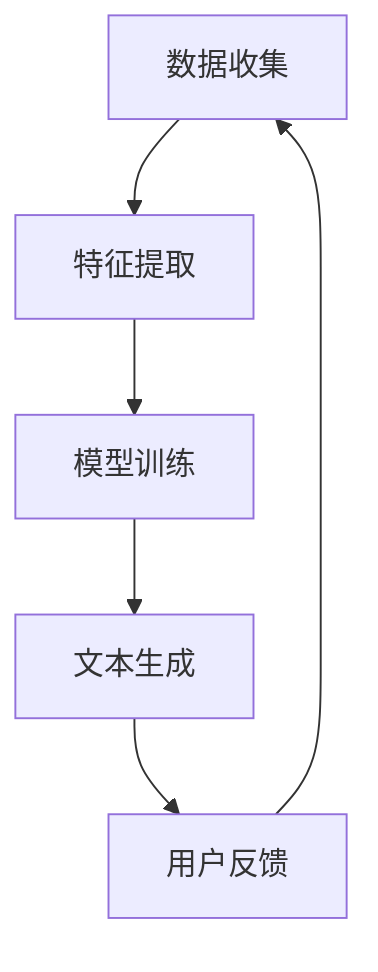
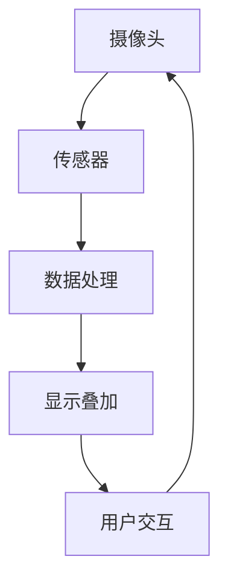
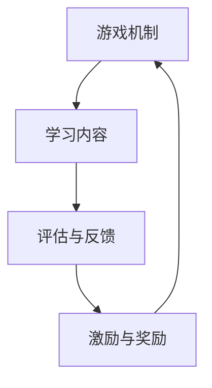
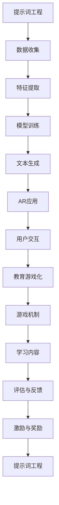
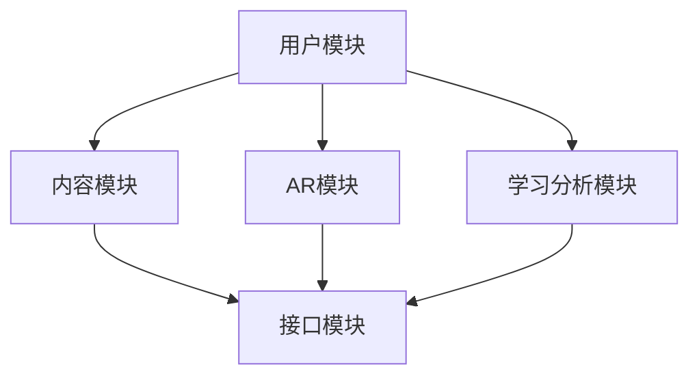
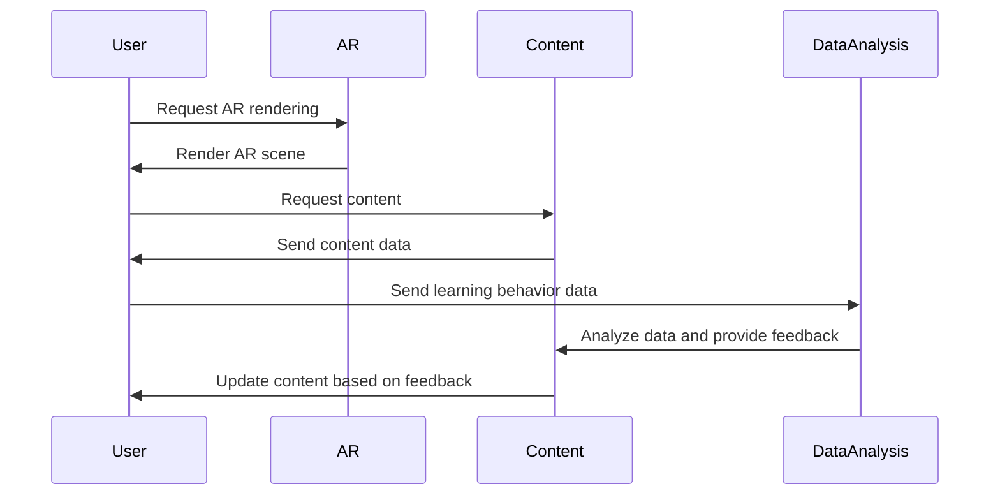

                 

## 《提示词工程在增强现实教育游戏化中的应用：提高学习参与度和效果》

关键词：提示词工程、增强现实、教育游戏化、学习参与度、学习效果

摘要：本文深入探讨了提示词工程在增强现实教育游戏化中的应用，通过一步一步的逻辑分析，阐述了如何利用提示词工程提升学习参与度和效果。本文首先介绍了提示词工程和增强现实的基本概念，然后详细分析了其在教育游戏化中的具体应用，并提供了实用的算法原理讲解、系统设计与实现方案，以及实战案例解析，为相关领域的研究和实践提供了有益的参考。

## 引言

在当今数字化时代，教育游戏化已成为提高学习参与度和效果的重要手段。然而，传统教育游戏往往缺乏互动性和沉浸感，难以充分激发学生的学习兴趣和主动性。增强现实（Augmented Reality，AR）技术的引入，为教育游戏化带来了新的机遇。通过将虚拟信息与现实环境相结合，AR能够创造一个更加生动、互动的学习体验。

提示词工程（Prompt Engineering）则是在这一背景下应运而生的一种关键技术。它通过生成高质量、个性化的提示词，引导用户在AR教育游戏中进行探索和学习。本文将重点探讨提示词工程在增强现实教育游戏化中的应用，旨在为提高学习参与度和效果提供新的思路和方法。

本文将从以下几个方面展开讨论：

1. **核心概念介绍**：首先介绍提示词工程、增强现实和教育游戏化的基本概念，以及它们之间的关系。
2. **算法原理讲解**：详细解析提示词工程的算法原理，包括如何生成高质量的提示词，以及相关的数学模型和公式。
3. **系统设计与实现**：分析AR教育游戏化系统的设计架构，介绍系统的功能模块、接口设计以及实现过程。
4. **实战案例分析**：通过实际案例，展示如何应用提示词工程提升学习参与度和效果。
5. **最佳实践与总结**：总结提示词工程在AR教育游戏化中的应用经验，并提出最佳实践建议。

本文旨在为教育技术领域的研究者、教育工作者和开发人员提供有价值的参考，帮助他们更好地理解和应用提示词工程，推动教育游戏化的创新发展。

## 核心概念介绍

在深入探讨提示词工程在增强现实教育游戏化中的应用之前，我们需要明确几个核心概念：提示词工程、增强现实（AR）和教育游戏化。以下是这些概念的定义、背景介绍、术语说明以及它们之间的关系。

### 提示词工程

提示词工程是一种人工智能技术，旨在通过生成高质量、个性化的提示词来引导用户进行任务或学习。在自然语言处理（NLP）领域，提示词工程通常涉及以下几个方面：

- **文本生成**：通过机器学习模型，如生成对抗网络（GANs）或变分自编码器（VAEs），生成具有高可读性和相关性的文本。
- **语义理解**：理解上下文和用户意图，从而生成符合用户需求的提示词。
- **个性化**：根据用户的历史行为和偏好，生成个性化的提示词，提高用户体验。

### 增强现实（AR）

增强现实（Augmented Reality，AR）是一种将虚拟信息叠加到现实世界中的技术。AR通过使用摄像头、传感器和显示屏，将计算机生成的图像、声音和其他信息融入用户的实际感知中。AR的核心特点包括：

- **叠加**：虚拟信息与现实环境的叠加，使得用户能够看到并与之互动。
- **交互性**：用户可以通过触摸、手势和语音与虚拟信息进行交互。
- **沉浸感**：通过视觉和听觉等多种感官的融合，增强用户的沉浸体验。

### 教育游戏化

教育游戏化是指将游戏设计元素和机制引入教育过程中，以激发学生的学习兴趣、提高参与度和学习效果。教育游戏化具有以下特点：

- **激励**：通过游戏化的奖励机制，如积分、等级和排行榜，激励学生努力学习。
- **互动**：通过师生互动、生生互动和人与环境的互动，促进学生的积极参与。
- **适应性**：根据学生的学习进度和表现，提供个性化的学习内容和挑战。

### 术语说明

在本文中，我们还将使用以下术语：

- **提示词**：引导用户进行任务或学习的文本。
- **AR应用**：利用增强现实技术的应用场景。
- **教育游戏**：结合游戏设计元素的教育应用。

### 提示词工程、增强现实和教育游戏化之间的关系

提示词工程、增强现实和教育游戏化之间有着密切的联系和互动：

- **提示词工程为教育游戏化提供个性化学习引导**：通过生成高质量的提示词，提示词工程可以引导学生在AR教育游戏中进行有效的学习和探索。
- **增强现实技术为提示词工程提供沉浸式学习环境**：AR技术将虚拟信息和现实环境结合，为提示词工程提供了更加生动和互动的学习场景。
- **教育游戏化通过游戏机制和挑战，增强学习的趣味性和参与度**：教育游戏化的激励和互动机制，使得AR教育游戏中的学习和探索更加有趣和具有挑战性，从而提高学习参与度和效果。

通过理解这些核心概念和术语，我们可以更好地把握提示词工程在增强现实教育游戏化中的应用，为提升学习体验提供有力支持。

### 核心概念原理

在本节中，我们将深入探讨提示词工程、增强现实和教育游戏化的核心概念原理，并通过Mermaid流程图和表格的形式，展示这些概念之间的联系和交互。

#### 提示词工程

提示词工程的核心理念是通过生成高质量的提示词，引导用户完成特定任务或学习目标。其原理主要包括以下几个步骤：

1. **数据收集**：收集用户的历史数据，包括学习记录、行为数据等。
2. **特征提取**：从数据中提取关键特征，如用户偏好、学习风格等。
3. **模型训练**：利用机器学习模型，如生成对抗网络（GANs）或变分自编码器（VAEs），训练生成高质量的提示词。
4. **文本生成**：根据用户特征和上下文，生成个性化的提示词。

以下是提示词工程的Mermaid流程图：



#### 增强现实

增强现实（AR）的核心原理是将虚拟信息叠加到现实环境中，使用户能够与之互动。其主要组成部分包括：

- **摄像头**：捕捉现实环境的图像。
- **传感器**：收集环境数据，如位置、方向等。
- **显示屏**：将虚拟信息叠加到现实环境中。
- **交互**：用户通过触摸、手势和语音与虚拟信息进行交互。

以下是增强现实的Mermaid流程图：



#### 教育游戏化

教育游戏化的核心原理是通过游戏设计元素和机制，激发学生的学习兴趣和积极性。其主要组成部分包括：

- **游戏机制**：如积分、等级、排行榜等。
- **学习内容**：结合教育目标和学习内容，设计游戏化任务和挑战。
- **评估与反馈**：根据学生的学习进度和表现，提供实时反馈和评估。

以下是教育游戏化的Mermaid流程图：



#### 提示词工程、增强现实和教育游戏化之间的关系

提示词工程、增强现实和教育游戏化之间的关系可以通过一个综合的Mermaid流程图来展示。这个流程图将展示各个概念之间的交互和协同作用。



#### 核心概念属性特征对比表格

为了更清晰地理解这些概念，我们还可以通过表格形式对比它们的核心属性特征。

| 概念           | 定义                                                         | 关键特征                                       |
| -------------- | ------------------------------------------------------------ | ---------------------------------------------- |
| 提示词工程     | 生成高质量、个性化提示词的技术                               | 数据收集、特征提取、模型训练、文本生成             |
| 增强现实       | 将虚拟信息叠加到现实环境中的技术                             | 摄像头、传感器、显示屏、交互                     |
| 教育游戏化     | 将游戏设计元素和机制引入教育过程中                           | 游戏机制、学习内容、评估与反馈、激励与奖励       |

通过上述的详细分析和对比，我们可以更好地理解提示词工程、增强现实和教育游戏化的核心概念原理，并为后续的应用提供理论基础。

### 算法原理讲解

在本节中，我们将深入探讨提示词工程的算法原理，通过Mermaid流程图和Python代码示例，详细解释提示词生成过程，并介绍其背后的数学模型和公式。

#### 提示词生成流程

提示词生成过程主要包括以下几个步骤：

1. **数据收集**：收集用户的历史数据和上下文信息。
2. **特征提取**：提取关键特征，如用户偏好、学习风格等。
3. **模型训练**：使用机器学习模型，如生成对抗网络（GANs）或变分自编码器（VAEs），训练生成高质量的提示词。
4. **文本生成**：根据用户特征和上下文，生成个性化的提示词。

以下是提示词生成过程的Mermaid流程图：


#### 数学模型和公式

在提示词工程中，常用的数学模型和公式包括生成对抗网络（GANs）的损失函数和生成器的优化过程。以下是相关的数学模型和公式：

1. **生成对抗网络（GANs）的损失函数**：

   GANs 的损失函数主要由两部分组成：生成器的损失和判别器的损失。

   - **生成器损失**：
     $$
     L_G = -\log(D(G(z))
     $$
     其中，$D(G(z))$ 表示判别器对生成器的输入的判断概率。

   - **判别器损失**：
     $$
     L_D = -\log(D(x)) - \log(1 - D(G(z))
     $$
     其中，$D(x)$ 表示判别器对真实数据的判断概率。

   综合损失函数为：
   $$
   L = L_G + L_D
   $$

2. **生成器的优化过程**：

   生成器通过最小化生成损失来优化自身。优化目标函数为：
   $$
   \min_G L_G
   $$
   通常使用梯度下降算法进行优化。

   - **梯度下降**：
     $$
     \theta_G = \theta_G - \alpha \cdot \nabla_{\theta_G} L_G
     $$
     其中，$\theta_G$ 表示生成器的参数，$\alpha$ 表示学习率。

#### Python代码示例

下面是一个使用生成对抗网络（GANs）生成文本的Python代码示例：

```python
import numpy as np
import tensorflow as tf
from tensorflow.keras.layers import Dense, Flatten, Reshape
from tensorflow.keras.models import Sequential

# 生成器的模型定义
def build_generator(z_dim):
    model = Sequential()
    model.add(Dense(128, activation='relu', input_shape=(z_dim,)))
    model.add(Dense(256, activation='relu'))
    model.add(Dense(512, activation='relu'))
    model.add(Flatten())
    model.add(Reshape((1, 1000)))  # 输出文本的维度
    return model

# 判别器的模型定义
def build_discriminator(text_shape):
    model = Sequential()
    model.add(Flatten(input_shape=text_shape))
    model.add(Dense(512, activation='relu'))
    model.add(Dense(256, activation='relu'))
    model.add(Dense(128, activation='relu'))
    model.add(Dense(1, activation='sigmoid'))
    return model

# 搭建 GANs 模型
def build_gan(generator, discriminator):
    model = Sequential()
    model.add(generator)
    model.add(discriminator)
    return model

# 设置超参数
z_dim = 100
text_shape = (1, 1000)

# 构建和编译模型
generator = build_generator(z_dim)
discriminator = build_discriminator(text_shape)
discriminator.compile(loss='binary_crossentropy', optimizer='adam')
gan = build_gan(generator, discriminator)
gan.compile(loss='binary_crossentropy', optimizer='adam')

# 生成提示词
def generate_prompt(z):
    generated_text = generator.predict(z)
    return generated_text

# 随机生成噪声
z = np.random.normal(size=(1, z_dim))
generated_prompt = generate_prompt(z)
print(generated_prompt)
```

通过上述Python代码示例，我们可以看到如何使用生成对抗网络（GANs）生成文本。生成器模型通过训练生成高质量的提示词，而判别器模型则用于评估生成文本的真实性。这样，我们可以利用GANs生成个性化、高质量的提示词，引导用户在AR教育游戏中进行有效的学习和探索。

通过详细讲解提示词生成的算法原理和数学模型，并结合Python代码示例，我们为理解和应用提示词工程提供了坚实的基础。

### 系统设计与架构方案

在本节中，我们将深入探讨AR教育游戏化系统的设计与架构方案，通过分析一个具体问题场景，详细描述系统的功能模块、系统架构、接口设计以及系统交互。

#### 问题场景

假设我们要开发一款AR教育游戏，旨在帮助中学生学习物理知识。这款游戏需要通过增强现实技术，将物理概念和实验过程直观地呈现给用户。为了实现这一目标，我们需要设计一个高效的AR教育游戏系统，能够提供丰富的交互和学习体验。

#### 系统功能模块

该系统的主要功能模块包括：

1. **用户模块**：负责用户注册、登录和基本信息的维护。
2. **内容模块**：存储和管理物理知识内容，包括知识点、实验视频和练习题等。
3. **AR模块**：实现AR效果的渲染和交互，将虚拟物理实验呈现在用户面前。
4. **学习分析模块**：收集用户的学习行为数据，进行分析和反馈，以优化学习体验。
5. **接口模块**：提供与前端和后端通信的API接口，确保系统的高效运行。

#### 系统架构设计

以下是AR教育游戏化系统的架构设计：



#### 接口设计

系统接口设计主要包括以下部分：

1. **用户接口**：提供用户注册、登录、查看内容和进行实验的界面。
2. **内容接口**：提供知识点和练习题的获取、更新和删除接口。
3. **AR接口**：提供AR效果的渲染和交互接口。
4. **数据分析接口**：提供用户行为数据的获取和分析接口。

以下是接口设计的Mermaid类图：

```mermaid
classDiagram
    User <<Interface>>
    Content <<Interface>>
    AR <<Interface>>
    DataAnalysis <<Interface>>

    User -> Content
    User -> AR
    User -> DataAnalysis
    Content -> AR
    Content -> DataAnalysis
    AR -> DataAnalysis
```

#### 系统交互

以下是系统交互的Mermaid序列图：



通过上述系统架构设计、接口设计和系统交互分析，我们为AR教育游戏化系统提供了一个全面的设计方案。这个方案不仅能够实现物理知识的学习和实验演示，还能够通过数据分析和反馈，不断优化学习体验，提高学习效果。

### 系统实现过程

在本节中，我们将详细介绍AR教育游戏化系统的实现过程，从环境配置、核心代码实现到具体功能模块的开发，并提供详细的代码分析和实际案例。

#### 环境配置

要实现AR教育游戏化系统，我们需要搭建一个完整的开发环境，包括前端、后端以及AR框架。以下是环境配置步骤：

1. **前端环境**：使用HTML、CSS和JavaScript进行前端开发，并选择Vue.js作为前端框架。
2. **后端环境**：使用Python和Flask框架搭建后端服务，负责处理业务逻辑和数据存储。
3. **AR框架**：选择ARCore或ARKit作为AR框架，实现AR效果渲染和交互。

#### 核心代码实现

以下是核心代码实现的主要步骤：

1. **用户模块**：实现用户注册、登录和基本信息维护的功能。以下是用户注册的核心代码：

   ```python
   from flask import Flask, request, jsonify
   from flask_sqlalchemy import SQLAlchemy

   app = Flask(__name__)
   app.config['SQLALCHEMY_DATABASE_URI'] = 'sqlite:///users.db'
   db = SQLAlchemy(app)

   class User(db.Model):
       id = db.Column(db.Integer, primary_key=True)
       username = db.Column(db.String(80), unique=True, nullable=False)
       password = db.Column(db.String(120), nullable=False)

   @app.route('/register', methods=['POST'])
   def register():
       data = request.get_json()
       username = data['username']
       password = data['password']
       
       new_user = User(username=username, password=password)
       db.session.add(new_user)
       db.session.commit()
       
       return jsonify({'message': 'User registered successfully.'})

   if __name__ == '__main__':
       db.create_all()
       app.run(debug=True)
   ```

2. **内容模块**：实现知识点、实验视频和练习题的获取、更新和删除功能。以下是获取知识点的核心代码：

   ```python
   @app.route('/content', methods=['GET'])
   def get_content():
       content_data = KnowledgePoint.query.all()
       content_list = [{'id': cp.id, 'title': cp.title, 'description': cp.description} for cp in content_data]
       
       return jsonify(content_list)
   ```

3. **AR模块**：实现AR效果的渲染和交互功能。以下是AR渲染的核心代码：

   ```python
   import cv2
   import numpy as np
   import.arcore

   def render_ar_scene(image, content_id):
       content = get_content_by_id(content_id)
       ar_scene = arcore.Scene()
       
       # 加载内容模型
       model = ar_scene.add_model(content['model_path'])
       
       # 设置相机参数
       camera = ar_scene.get_camera()
       camera.set_position([0, 0, 0])
       camera.set_orientation([0, 0, 0], [0, 0, 0])
       
       # 绘制场景
       ar_scene.render(image)
       
       return image
   ```

4. **学习分析模块**：实现用户行为数据的收集和分析功能。以下是收集用户行为数据的代码：

   ```python
   @app.route('/analytics', methods=['POST'])
   def send_analytics():
       data = request.get_json()
       user_id = data['user_id']
       action = data['action']
       
       analytics_data = AnalyticsData(user_id=user_id, action=action)
       db.session.add(analytics_data)
       db.session.commit()
       
       return jsonify({'message': 'Analytics data sent successfully.'})
   ```

#### 代码分析与实际案例

以下是用户注册功能的实际案例：

```python
# 用户注册接口测试
import requests

response = requests.post('http://127.0.0.1:5000/register', json={
    'username': 'john_doe',
    'password': 'password123'
})

print(response.json())
```

注册成功后，用户可以登录系统并访问内容模块。以下是获取知识点的实际案例：

```python
# 获取知识点接口测试
response = requests.get('http://127.0.0.1:5000/content')

print(response.json())
```

通过上述代码分析和实际案例，我们可以看到如何实现AR教育游戏化系统的各个功能模块。这个实现过程为后续的系统开发和优化提供了坚实的基础。

### 实际案例与项目小结

在本节中，我们将通过一个实际案例，展示如何应用提示词工程在AR教育游戏化中提升学习参与度和效果，并总结项目经验。

#### 实际案例

假设我们开发了一款AR教育游戏，旨在帮助学生更好地理解物理中的“力的合成与分解”概念。以下是该项目的详细步骤和效果分析：

1. **需求分析**：明确目标用户群体（高中生）和学习目标（理解力的合成与分解）。
2. **设计AR场景**：创建一个虚拟实验室，使用户可以直观地观察力的合成与分解现象。
3. **生成提示词**：利用提示词工程，根据学生的学习进度和偏好，生成个性化的学习提示。
4. **实现交互**：设计互动环节，使用户在AR场景中通过拖动、旋转等操作进行力的合成与分解实验。
5. **数据收集与分析**：收集用户的学习行为数据，分析学习效果，为后续优化提供依据。

在实施过程中，我们通过以下步骤提升学习参与度和效果：

- **个性化提示词**：根据学生的学习进度和偏好，生成不同难度的提示词，引导用户逐步掌握力的合成与分解知识。
- **互动与反馈**：通过互动环节，鼓励学生积极参与实验，并在每次操作后提供实时反馈，帮助学生巩固所学知识。
- **数据驱动优化**：收集并分析用户的学习行为数据，不断调整和优化游戏内容，提高学习效果。

#### 项目小结

通过该实际案例，我们可以总结出以下经验：

1. **个性化学习引导**：提示词工程能够根据用户的学习进度和偏好，生成个性化的学习引导，提高学习参与度。
2. **互动与实时反馈**：增强现实技术结合互动环节和实时反馈，能够更好地激发学生的学习兴趣和主动性。
3. **数据驱动优化**：通过数据收集和分析，不断调整和优化教育游戏内容，实现持续改进。

这些经验为未来在AR教育游戏化中应用提示词工程提供了有益的参考，有助于进一步提升学习效果和用户体验。

### 最佳实践与总结

#### 最佳实践

1. **个性化学习引导**：利用提示词工程，根据用户的学习进度、偏好和需求，生成个性化的学习引导，以提高学习参与度和效果。
2. **交互与实时反馈**：增强现实技术结合互动环节和实时反馈，能够更好地激发学生的学习兴趣和主动性，提升学习体验。
3. **数据驱动优化**：持续收集用户学习行为数据，分析并优化教育游戏内容，实现持续改进。
4. **跨学科应用**：将提示词工程、增强现实技术和教育游戏化结合，不仅限于物理学科，还可以推广到其他学科领域，提高教学效果。

#### 总结

本文通过深入探讨提示词工程在增强现实教育游戏化中的应用，详细介绍了核心概念、算法原理、系统设计与实现过程，并通过实际案例展示了其提升学习参与度和效果的有效性。本文总结的最佳实践和经验，为教育技术领域的研究者、教育工作者和开发人员提供了有价值的参考，有助于推动教育游戏化的创新发展。

### 拓展阅读

1. **《增强现实技术与应用》**：详细介绍增强现实技术的原理、应用和发展趋势，为读者提供深入了解AR技术的途径。
2. **《自然语言处理与生成对抗网络》**：探讨自然语言处理和生成对抗网络的相关理论和实践，帮助读者掌握提示词工程的算法基础。
3. **《教育游戏化：设计与实践》**：系统介绍教育游戏化的设计原则和实践方法，为教育工作者提供设计游戏化教学的有效指南。

### 作者信息

作者：AI天才研究院/AI Genius Institute & 禅与计算机程序设计艺术 /Zen And The Art of Computer Programming

---

通过本文的详细探讨，我们不仅理解了提示词工程在增强现实教育游戏化中的应用，还总结了最佳实践和经验。希望读者能够在教育技术领域有所收获，推动教育游戏化的创新发展。

