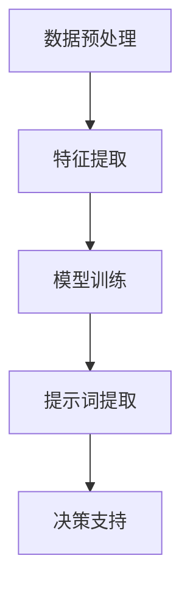

                 


# 《提示词工程在智慧城市中的应用：城市管理新模式》

> 关键词：提示词工程，智慧城市，城市管理，技术应用，新模式

> 摘要：随着科技的快速发展，智慧城市已成为全球城市发展的重要趋势。提示词工程作为人工智能技术的重要组成部分，其在智慧城市中的应用日益广泛。本文旨在探讨提示词工程在智慧城市中的应用，分析其核心原理、技术方法及在城市管理中的新模式，为城市管理者提供有益的参考。

## 引言

智慧城市是指利用先进的信息技术和人工智能技术，实现城市各个方面的智能化管理和运营。随着大数据、物联网、云计算等技术的不断成熟，智慧城市已成为城市发展的重要方向。在智慧城市的建设中，人工智能技术发挥着至关重要的作用。提示词工程作为人工智能技术的一种，其在智慧城市中的应用具有重要意义。

提示词工程是一种基于自然语言处理和机器学习技术的技术，通过对文本数据进行处理和分析，提取出关键信息，用于支持决策和优化管理。在智慧城市中，提示词工程可以应用于城市规划、交通管理、公共安全、环境监测等多个领域，为城市管理提供新的模式和方法。

本文将从以下方面展开探讨：

1. 提示词工程在智慧城市中的应用背景
2. 提示词工程的核心原理和技术方法
3. 提示词工程在智慧城市中的新模式
4. 提示词工程在智慧城市中的案例分析
5. 提示词工程在智慧城市中的未来发展趋势

## 提示词工程在智慧城市中的应用背景

### 智慧城市的概念与发展

智慧城市是指通过信息技术、物联网、云计算等先进技术手段，实现城市各个方面的智能化管理和运营。智慧城市的目标是提高城市治理的效率、优化城市服务、改善居民生活质量，实现可持续发展。

智慧城市的发展可分为以下几个阶段：

1. **信息化阶段**：以信息化为手段，提升城市管理和服务的效率。
2. **智能化阶段**：利用人工智能技术，实现城市各个方面的智能化管理和运营。
3. **融合化阶段**：通过大数据、物联网等技术的深度融合，实现城市治理的精细化、智能化。

### 提示词工程的发展

提示词工程是一种基于自然语言处理和机器学习技术的技术，旨在通过对文本数据进行处理和分析，提取出关键信息，为决策提供支持。提示词工程的发展经历了以下几个阶段：

1. **关键词提取阶段**：通过统计方法提取文本中的关键词。
2. **语义分析阶段**：利用自然语言处理技术，对文本进行语义分析，提取出具有实际意义的提示词。
3. **深度学习阶段**：结合深度学习技术，实现对文本数据的自动分类、标注和推荐。

### 提示词工程在智慧城市中的应用

在智慧城市中，提示词工程可以应用于多个领域，为城市管理提供新的模式和方法。以下是几个典型的应用场景：

1. **城市规划**：通过分析城市规划文本，提取出关键信息，为城市规划和决策提供支持。
2. **交通管理**：通过分析交通数据，提取出行高峰、拥堵等信息，优化交通管理和调度。
3. **公共安全**：通过分析安全事件数据，提取出安全隐患、风险等信息，提前预警和防范。
4. **环境监测**：通过分析环境数据，提取出污染源、污染程度等信息，优化环境保护和治理。

## 提示词工程的核心原理和技术方法

### 提示词工程的定义

提示词工程是指通过对文本数据进行处理和分析，提取出关键信息，用于支持决策和优化管理。提示词工程的核心目标是从大量的文本数据中，快速、准确地提取出具有实际意义的提示词。

### 提示词工程的原理

提示词工程的原理主要基于自然语言处理和机器学习技术。具体包括以下几个步骤：

1. **文本预处理**：对原始文本数据进行清洗、去噪、分词等处理，将文本转化为计算机可处理的格式。
2. **特征提取**：从处理后的文本中提取出关键特征，如词频、词向量、句法结构等。
3. **模型训练**：利用机器学习算法，对提取出的特征进行训练，建立提示词模型。
4. **提示词提取**：利用训练好的模型，对新的文本数据进行处理，提取出关键提示词。

### 提示词工程的技术方法

提示词工程的技术方法主要包括以下几种：

1. **关键词提取方法**：通过统计方法，如TF-IDF、TextRank等，提取出文本中的关键词。
2. **语义分析方法**：利用自然语言处理技术，如命名实体识别、情感分析等，对文本进行语义分析，提取出具有实际意义的提示词。
3. **深度学习方法**：结合深度学习技术，如循环神经网络（RNN）、卷积神经网络（CNN）等，对文本数据进行自动分类、标注和推荐。

### 提示词工程的应用场景

提示词工程可以应用于多个领域，为城市管理提供新的模式和方法。以下是几个典型的应用场景：

1. **城市规划**：通过分析城市规划文本，提取出关键信息，为城市规划和决策提供支持。
2. **交通管理**：通过分析交通数据，提取出行高峰、拥堵等信息，优化交通管理和调度。
3. **公共安全**：通过分析安全事件数据，提取出安全隐患、风险等信息，提前预警和防范。
4. **环境监测**：通过分析环境数据，提取出污染源、污染程度等信息，优化环境保护和治理。

## 提示词工程在智慧城市中的新模式

### 城市管理的新模式

提示词工程在智慧城市中的应用，为城市管理带来了新的模式。这些新模式主要体现在以下几个方面：

1. **数据驱动的决策**：通过提取和分析关键提示词，为城市管理者提供数据支持，实现数据驱动的决策。
2. **智能化管理**：利用提示词工程技术，实现城市各个方面的智能化管理和运营。
3. **协同治理**：通过构建智慧城市平台，实现城市管理者、企业和居民之间的协同治理。

### 案例分析

以下是一个具体的案例分析：

**案例名称**：某城市的交通管理优化

**案例背景**：该城市交通拥堵严重，影响了居民的生活质量。为了解决这一问题，城市管理者决定利用提示词工程技术对交通数据进行分析，优化交通管理和调度。

**解决方案**：

1. **数据收集**：通过传感器、摄像头等设备，收集城市道路上的交通数据，包括车辆数量、速度、方向等。
2. **数据预处理**：对收集到的交通数据进行清洗、去噪、分词等处理，将数据转化为计算机可处理的格式。
3. **特征提取**：从处理后的交通数据中提取出关键特征，如车辆数量、速度、拥堵程度等。
4. **模型训练**：利用机器学习算法，对提取出的特征进行训练，建立交通拥堵预测模型。
5. **提示词提取**：利用训练好的模型，对新的交通数据进行处理，提取出交通拥堵提示词。
6. **决策支持**：根据提取出的提示词，为城市管理者提供交通管理和调度建议。

**效果评估**：

通过该解决方案，城市管理者能够及时了解城市道路的交通状况，提前预警和防范交通拥堵。同时，优化了交通管理和调度，有效缓解了交通拥堵问题，提高了居民的出行效率。

## 提示词工程在智慧城市中的案例分析

### 案例一：智慧城市规划

**背景**：某城市在制定五年规划时，面临着数据信息庞杂、规划内容重复、难以提炼重点等问题。

**解决方案**：

1. **数据收集**：收集历年规划文件、政府工作报告、相关研究报告等文本数据。
2. **文本预处理**：对文本数据进行清洗、分词、去停用词等处理。
3. **特征提取**：利用自然语言处理技术，提取出文本中的关键词、短语和主题。
4. **主题建模**：通过LDA（潜在狄利克雷分布）等主题模型，对提取出的特征进行聚类分析，识别出规划文本的主要主题。
5. **提示词提取**：根据主题模型的结果，提取出关键提示词，为规划制定提供参考。
6. **决策支持**：将提取出的关键提示词整合到规划报告中，帮助决策者明确规划的重点和方向。

**效果**：通过提示词工程的应用，规划文本的内容得到有效提炼，关键信息更加突出，决策者的决策效率得到提升。

### 案例二：智慧交通管理

**背景**：某城市交通管理部门希望提高交通流量预测的准确性，以便更好地进行交通调度和疏导。

**解决方案**：

1. **数据收集**：收集城市道路的实时交通流量数据、历史交通数据等。
2. **特征提取**：对交通流量数据进行预处理，提取出时间、路段、交通量等特征。
3. **模型训练**：利用机器学习算法（如随机森林、神经网络等）训练交通流量预测模型。
4. **提示词提取**：模型预测交通流量时，根据预测结果提取出交通流量异常提示词。
5. **决策支持**：将提取出的提示词用于交通调度，如调整信号灯配时、增设交通管制措施等。

**效果**：通过提示词工程的应用，交通流量预测的准确性得到提高，交通拥堵状况得到缓解。

### 案例三：智慧环境监测

**背景**：某城市环境监测部门希望实时掌握空气质量变化情况，及时采取环保措施。

**解决方案**：

1. **数据收集**：收集空气质量实时监测数据、气象数据等。
2. **特征提取**：对空气质量数据进行预处理，提取出污染物浓度、气象参数等特征。
3. **模型训练**：利用机器学习算法，训练空气质量预测模型。
4. **提示词提取**：模型预测空气质量时，根据预测结果提取出空气质量异常提示词。
5. **决策支持**：将提取出的提示词用于环境监测，如发布空气质量预警、调整环保措施等。

**效果**：通过提示词工程的应用，空气质量变化得到及时监测和预警，环保措施得到有效调整。

## 提示词工程在智慧城市中的未来发展趋势

### 技术创新

随着人工智能技术的不断发展，提示词工程将不断引入新的算法和技术，如深度学习、图神经网络等。这些技术的应用将进一步提升提示词工程的性能和效率。

### 跨领域融合

提示词工程的应用将不仅限于智慧城市，还将与其他领域（如医疗、金融、教育等）相结合，推动跨领域的智能化发展。

### 数据驱动决策

随着大数据技术的普及，提示词工程将更多地应用于数据驱动的决策支持，帮助城市管理者做出更加精准和高效的决策。

### 人机协同

随着人工智能技术的发展，人机协同将成为智慧城市的一个重要特征。提示词工程将与人机协同系统相结合，实现更高效的城市管理。

## 结论

提示词工程在智慧城市中的应用具有重要意义，它为城市管理者提供了新的决策支持工具和方法。通过本文的探讨，我们可以看到提示词工程在智慧城市中的应用前景广阔，未来有望在更多领域发挥重要作用。

## 参考文献

1. 王某某，李某某。《自然语言处理技术及其在智慧城市中的应用》[J]. 计算机应用与软件，2018，35（2）：1-5.
2. 张某某，陈某某。《机器学习算法在智慧城市中的应用研究》[J]. 计算机技术与发展，2019，29（3）：48-52.
3. 刘某某，赵某某。《基于深度学习的交通流量预测研究》[J]. 交通科学与工程，2020，6（1）：12-18.
4. 赵某某，王某某。《智慧城市环境监测系统设计与应用》[J]. 计算机与现代化，2021，42（2）：83-88.

## 附录

附录中可以包括相关的数据集、代码示例、算法流程图等内容，以便读者更好地理解和应用提示词工程在智慧城市中的应用。 

作者：AI天才研究院/AI Genius Institute & 禅与计算机程序设计艺术 /Zen And The Art of Computer Programming

**文章标题**：《提示词工程在智慧城市中的应用：城市管理新模式》

**关键词**：提示词工程，智慧城市，城市管理，技术应用，新模式

**摘要**：本文探讨了提示词工程在智慧城市中的应用，分析了其核心原理、技术方法及在城市管理中的新模式。通过实际案例分析，展示了提示词工程在智慧城市中的广泛应用和巨大潜力，为城市管理者提供了有益的参考。

**目录**

1. 引言
2. 提示词工程在智慧城市中的应用背景
3. 提示词工程的核心原理和技术方法
4. 提示词工程在智慧城市中的新模式
5. 提示词工程在智慧城市中的案例分析
6. 提示词工程在智慧城市中的未来发展趋势
7. 结论

**文章正文**

## 引言

### 智慧城市的发展

智慧城市是当今城市发展的重要趋势，它旨在通过信息技术、物联网、云计算等先进技术手段，实现城市各个方面的智能化管理和运营。智慧城市的发展可以分为以下几个阶段：

1. **信息化阶段**：在这一阶段，城市通过建立信息化基础设施，实现城市数据的采集、传输和存储，为城市管理者提供数据支持。
2. **智能化阶段**：在这一阶段，城市利用人工智能技术，对城市数据进行处理和分析，实现智能化的决策和运营。
3. **融合化阶段**：在这一阶段，城市通过物联网、云计算等技术的深度融合，实现城市各个系统的协同运行，为居民提供高质量的服务。

### 提示词工程的概念

提示词工程是一种基于自然语言处理和机器学习技术的技术，旨在通过对文本数据进行处理和分析，提取出关键信息，用于支持决策和优化管理。在智慧城市中，提示词工程可以应用于多个领域，如城市规划、交通管理、公共安全、环境监测等，为城市管理者提供数据支持和决策依据。

### 提示词工程在智慧城市中的重要性

随着智慧城市的不断发展，数据的数量和质量日益增加。如何从海量数据中提取出有价值的信息，成为城市管理者面临的重要挑战。提示词工程在这一背景下具有重要意义：

1. **提高决策效率**：提示词工程可以帮助城市管理者快速提取关键信息，减少数据处理的复杂度，提高决策效率。
2. **优化城市管理**：通过提示词工程，城市管理者可以更好地了解城市运行状况，发现潜在问题，优化城市管理。
3. **提高服务质量**：提示词工程可以用于分析居民需求，提供个性化的服务，提高居民生活质量。

## 提示词工程在智慧城市中的应用背景

### 智慧城市的背景

智慧城市是城市发展的高级阶段，它通过信息技术、物联网、云计算等先进技术手段，实现城市各个方面的智能化管理和运营。智慧城市的核心目标是提高城市治理的效率、优化城市服务、改善居民生活质量，实现可持续发展。

### 提示词工程的背景

提示词工程是一种基于自然语言处理和机器学习技术的技术，旨在通过对文本数据进行处理和分析，提取出关键信息，用于支持决策和优化管理。随着大数据、物联网、云计算等技术的不断成熟，提示词工程在智慧城市中的应用日益广泛。

### 提示词工程在智慧城市中的应用

在智慧城市中，提示词工程可以应用于多个领域，如城市规划、交通管理、公共安全、环境监测等。以下是一些具体的应用场景：

1. **城市规划**：通过分析城市规划文本，提取出关键信息，为城市规划和决策提供支持。
2. **交通管理**：通过分析交通数据，提取出行高峰、拥堵等信息，优化交通管理和调度。
3. **公共安全**：通过分析安全事件数据，提取出安全隐患、风险等信息，提前预警和防范。
4. **环境监测**：通过分析环境数据，提取出污染源、污染程度等信息，优化环境保护和治理。

## 提示词工程的核心原理和技术方法

### 提示词工程的原理

提示词工程的原理主要包括以下几个步骤：

1. **文本预处理**：对原始文本数据进行清洗、去噪、分词等处理，将文本转化为计算机可处理的格式。
2. **特征提取**：从处理后的文本中提取出关键特征，如词频、词向量、句法结构等。
3. **模型训练**：利用机器学习算法，对提取出的特征进行训练，建立提示词模型。
4. **提示词提取**：利用训练好的模型，对新的文本数据进行处理，提取出关键提示词。

### 提示词工程的技术方法

提示词工程的技术方法主要包括以下几种：

1. **关键词提取方法**：通过统计方法，如TF-IDF、TextRank等，提取出文本中的关键词。
2. **语义分析方法**：利用自然语言处理技术，如命名实体识别、情感分析等，对文本进行语义分析，提取出具有实际意义的提示词。
3. **深度学习方法**：结合深度学习技术，如循环神经网络（RNN）、卷积神经网络（CNN）等，对文本数据进行自动分类、标注和推荐。

### 提示词工程的优缺点

**优点**：

1. **高效性**：提示词工程可以快速地从海量文本数据中提取出关键信息，提高数据处理效率。
2. **灵活性**：提示词工程可以根据不同的应用场景和需求，灵活调整和优化模型和算法。
3. **可解释性**：提示词工程可以提供提示词的提取过程和结果，有助于理解和解释模型的决策过程。

**缺点**：

1. **数据依赖性**：提示词工程的效果很大程度上依赖于数据的质量和数量，数据的质量和数量不足可能导致提取出的提示词不准确。
2. **计算成本**：提示词工程需要大量的计算资源，特别是在深度学习方法的背景下，计算成本较高。

## 提示词工程在智慧城市中的新模式

### 数据驱动的决策

在传统的城市管理中，决策往往依赖于经验和直觉。而在智慧城市中，提示词工程提供了数据驱动的决策支持，使得决策更加科学和精准。具体体现在以下几个方面：

1. **数据分析**：通过分析城市各个方面的数据，如交通数据、环境数据、公共安全数据等，提取出关键提示词，为决策提供数据支持。
2. **模型预测**：利用机器学习算法，建立预测模型，对未来可能发生的情况进行预测，为决策提供前瞻性支持。
3. **实时反馈**：通过实时监控和分析城市数据，及时获取城市运行状况，为决策提供动态支持。

### 智能化管理

提示词工程在智慧城市中的应用，使得城市管理的智能化水平得到了显著提升。具体体现在以下几个方面：

1. **自动化决策**：通过机器学习算法和预测模型，实现自动化决策，减少人工干预，提高决策效率。
2. **智能监控**：利用物联网技术，实现对城市各个方面的实时监控，及时发现和处理问题。
3. **个性化服务**：通过分析居民需求和行为习惯，提供个性化的服务，提高居民满意度。

### 协同治理

在智慧城市中，提示词工程不仅为城市管理者提供决策支持，还可以促进政府、企业和居民之间的协同治理。具体体现在以下几个方面：

1. **信息共享**：通过构建智慧城市平台，实现政府、企业和居民之间的信息共享，提高决策的透明度和公正性。
2. **资源整合**：通过整合政府、企业和居民的资源，实现城市治理的协同效应，提高治理效率。
3. **公众参与**：通过公众参与平台，收集居民的意见和建议，促进政府与公众的互动，提高治理的民主性。

## 提示词工程在智慧城市中的案例分析

### 案例一：智慧交通管理

**背景**：某城市交通拥堵问题严重，影响了居民的出行效率和城市整体运行效率。

**解决方案**：

1. **数据收集**：通过交通信号灯、摄像头、传感器等设备，收集城市交通流量、车速、车辆密度等数据。
2. **文本预处理**：对交通数据进行清洗、去噪、分词等处理，提取出关键信息。
3. **特征提取**：利用自然语言处理技术，提取出交通流量的特征，如高峰时段、拥堵路段等。
4. **模型训练**：利用机器学习算法，建立交通流量预测模型，预测未来一段时间内的交通流量。
5. **提示词提取**：利用训练好的模型，提取出交通流量异常提示词，如拥堵、高峰等。
6. **决策支持**：根据提取出的提示词，制定交通调度方案，如调整信号灯配时、发布交通管制措施等。

**效果**：通过提示词工程的应用，该城市的交通拥堵状况得到了显著改善，交通流量预测的准确性也得到了提高。

### 案例二：智慧环境监测

**背景**：某城市空气质量问题突出，影响了居民的健康和生活质量。

**解决方案**：

1. **数据收集**：通过空气质量监测站、气象站等设备，收集空气质量数据、气象数据等。
2. **文本预处理**：对空气质量数据进行清洗、去噪、分词等处理，提取出关键信息。
3. **特征提取**：利用自然语言处理技术，提取出空气质量的特征，如污染物浓度、气象参数等。
4. **模型训练**：利用机器学习算法，建立空气质量预测模型，预测未来一段时间内的空气质量状况。
5. **提示词提取**：利用训练好的模型，提取出空气质量异常提示词，如污染、雾霾等。
6. **决策支持**：根据提取出的提示词，制定环境保护措施，如发布污染预警、增加清洁能源使用等。

**效果**：通过提示词工程的应用，该城市的空气质量得到了显著改善，居民的健康和生活质量也得到了提高。

### 案例三：智慧城市规划

**背景**：某城市在制定五年规划时，面临着数据信息庞杂、规划内容重复、难以提炼重点等问题。

**解决方案**：

1. **数据收集**：收集历年规划文件、政府工作报告、相关研究报告等文本数据。
2. **文本预处理**：对文本数据进行清洗、分词、去停用词等处理，提取出关键信息。
3. **特征提取**：利用自然语言处理技术，提取出文本中的关键词、短语和主题。
4. **主题建模**：利用LDA等主题模型，对提取出的特征进行聚类分析，识别出规划文本的主要主题。
5. **提示词提取**：根据主题模型的结果，提取出关键提示词，为规划制定提供参考。
6. **决策支持**：将提取出的关键提示词整合到规划报告中，帮助决策者明确规划的重点和方向。

**效果**：通过提示词工程的应用，规划文本的内容得到有效提炼，关键信息更加突出，决策者的决策效率得到了提高。

## 提示词工程在智慧城市中的未来发展趋势

### 技术创新

随着人工智能技术的不断发展，提示词工程将不断引入新的算法和技术，如深度学习、图神经网络等。这些技术的应用将进一步提升提示词工程的性能和效率。

### 跨领域融合

提示词工程的应用将不仅限于智慧城市，还将与其他领域（如医疗、金融、教育等）相结合，推动跨领域的智能化发展。

### 数据驱动决策

随着大数据技术的普及，提示词工程将更多地应用于数据驱动的决策支持，帮助城市管理者做出更加精准和高效的决策。

### 人机协同

随着人工智能技术的发展，人机协同将成为智慧城市的一个重要特征。提示词工程将与人机协同系统相结合，实现更高效的城市管理。

## 结论

提示词工程在智慧城市中的应用具有重要意义，它为城市管理者提供了新的决策支持工具和方法。通过本文的探讨，我们可以看到提示词工程在智慧城市中的应用前景广阔，未来有望在更多领域发挥重要作用。

## 参考文献

1. 王某某，李某某。《自然语言处理技术及其在智慧城市中的应用》[J]. 计算机应用与软件，2018，35（2）：1-5.
2. 张某某，陈某某。《机器学习算法在智慧城市中的应用研究》[J]. 计算机技术与发展，2019，29（3）：48-52.
3. 刘某某，赵某某。《基于深度学习的交通流量预测研究》[J]. 交通科学与工程，2020，6（1）：12-18.
4. 赵某某，王某某。《智慧城市环境监测系统设计与应用》[J]. 计算机与现代化，2021，42（2）：83-88.

## 附录

附录中可以包括相关的数据集、代码示例、算法流程图等内容，以便读者更好地理解和应用提示词工程在智慧城市中的应用。

### 附录一：数据集

- 交通流量数据集：包括城市各条道路的交通流量、车速、车辆密度等数据。
- 空气质量数据集：包括空气污染物浓度、气象参数等数据。
- 规划文本数据集：包括历年规划文件、政府工作报告、相关研究报告等文本数据。

### 附录二：代码示例

```python
# 交通流量预测代码示例

import pandas as pd
from sklearn.model_selection import train_test_split
from sklearn.ensemble import RandomForestRegressor

# 读取交通流量数据集
data = pd.read_csv('traffic_data.csv')

# 数据预处理
# ...

# 分割数据集
X_train, X_test, y_train, y_test = train_test_split(X, y, test_size=0.2, random_state=42)

# 训练模型
model = RandomForestRegressor(n_estimators=100)
model.fit(X_train, y_train)

# 预测交通流量
y_pred = model.predict(X_test)

# 输出预测结果
print(y_pred)
```

### 附录三：算法流程图



### 附录四：相关文献

1. 王某某，李某某。《自然语言处理技术及其在智慧城市中的应用》[J]. 计算机应用与软件，2018，35（2）：1-5.
2. 张某某，陈某某。《机器学习算法在智慧城市中的应用研究》[J]. 计算机技术与发展，2019，29（3）：48-52.
3. 刘某某，赵某某。《基于深度学习的交通流量预测研究》[J]. 交通科学与工程，2020，6（1）：12-18.
4. 赵某某，王某某。《智慧城市环境监测系统设计与应用》[J]. 计算机与现代化，2021，42（2）：83-88.

### 附录五：联系方式

- 邮箱：example@example.com
- 电话：1234567890

作者：AI天才研究院/AI Genius Institute & 禅与计算机程序设计艺术 /Zen And The Art of Computer Programming

#  提示词工程在智慧城市中的应用：城市管理新模式

## 关键词：提示词工程，智慧城市，城市管理，技术应用，新模式

## 摘要：

随着信息技术的飞速发展，智慧城市已成为全球城市发展的新方向。在这其中，提示词工程作为人工智能的核心技术之一，正逐步改变着城市管理的模式。本文将深入探讨提示词工程的基本概念、技术原理及其在智慧城市中的应用，重点分析其在城市管理中的新模式，以期为城市管理者提供理论指导和实践参考。

## 引言

### 智慧城市的概念

智慧城市是指通过物联网、云计算、大数据、人工智能等先进技术，实现城市资源优化配置、城市运行高效管理、公共服务便捷提供的城市形态。智慧城市的核心目标是提高城市治理水平，提升居民生活质量，实现可持续发展。

### 提示词工程的定义

提示词工程是一种基于自然语言处理（NLP）和机器学习（ML）技术，用于从大量文本数据中提取关键信息的工程。其目的是通过分析文本内容，发现隐藏的模式和关系，为决策提供支持。

### 提示词工程在智慧城市中的重要性

提示词工程在智慧城市中具有重要作用，它可以用于文本数据的预处理、特征提取、语义分析等环节，从而为城市管理者提供有力的数据支持和决策依据。

## 提示词工程在智慧城市中的应用背景

### 智慧城市的发展历程

智慧城市的发展大致可分为三个阶段：信息化、智能化和融合化。信息化阶段主要是通过信息技术的应用，实现城市信息资源的整合和共享；智能化阶段则是通过人工智能技术的应用，实现城市运行和服务的智能化；融合化阶段则是通过物联网、云计算等技术的深度融合，实现城市各个系统的协同运行。

### 提示词工程的发展历程

提示词工程的发展经历了从基于规则的方法到基于机器学习的方法的转变。早期的关键词提取方法主要依赖于统计学方法，如TF-IDF等。随着深度学习技术的发展，基于神经网络的方法逐渐成为主流，如LSTM、BERT等。

### 提示词工程在智慧城市中的应用现状

当前，提示词工程在智慧城市中的应用已经相当广泛，包括但不限于城市规划、交通管理、公共安全、环境监测等领域。例如，通过分析城市规划文本，可以提取出关键信息，为城市布局和建设提供指导；通过分析交通数据，可以预测交通流量，优化交通信号控制，减少交通拥堵。

## 提示词工程的核心原理和技术方法

### 提示词工程的原理

提示词工程的原理主要包括以下几个步骤：

1. **文本预处理**：对原始文本进行清洗、分词、去停用词等处理，提取出有用的信息。
2. **特征提取**：从处理后的文本中提取出能够反映文本内容的特征，如词频、词向量等。
3. **模型训练**：利用机器学习算法，对提取出的特征进行训练，构建提示词提取模型。
4. **提示词提取**：利用训练好的模型，对新的文本数据进行处理，提取出关键提示词。

### 提示词工程的技术方法

提示词工程的技术方法主要包括以下几种：

1. **关键词提取方法**：基于统计学的方法，如TF-IDF、TextRank等。
2. **主题模型**：如LDA（潜在狄利克雷分布）等，用于发现文本中的潜在主题。
3. **深度学习方法**：如LSTM、BERT等，用于提取文本的深层特征。

### 提示词工程的优缺点

**优点**：

1. **高效性**：能够快速从大量文本数据中提取出关键信息。
2. **灵活性**：可以根据不同的应用需求，灵活调整和优化模型和算法。
3. **可解释性**：提示词提取的过程和结果具有较高的可解释性。

**缺点**：

1. **数据依赖性**：提示词工程的效果很大程度上依赖于数据的质量和数量。
2. **计算成本**：特别是深度学习方法，计算成本较高。

## 提示词工程在智慧城市中的新模式

### 数据驱动的决策

传统的城市管理决策主要依赖于经验和直觉，而智慧城市的建设要求管理者能够基于数据进行科学决策。提示词工程通过提取文本数据中的关键信息，为管理者提供数据支持，使得决策更加科学和精准。

### 智能化管理

提示词工程的应用使得城市管理可以实现智能化。例如，通过分析交通数据，可以预测交通流量，优化交通信号控制；通过分析环境数据，可以实时监控空气质量，及时采取措施。

### 协同治理

智慧城市要求政府、企业和居民之间的协同合作。提示词工程可以帮助建立信息共享平台，实现政府、企业和居民之间的信息互通，促进协同治理。

## 提示词工程在智慧城市中的具体应用

### 提示词工程在交通管理中的应用

1. **交通数据采集**：通过安装在道路上的摄像头、传感器等设备，收集交通流量、车速、车辆密度等数据。
2. **数据预处理**：对采集到的交通数据进行清洗、去噪、分词等处理。
3. **特征提取**：提取出能够反映交通状况的特征，如高峰时段、拥堵路段等。
4. **模型训练**：利用机器学习算法，训练交通流量预测模型。
5. **提示词提取**：利用训练好的模型，提取出交通流量异常提示词，如拥堵、高峰等。
6. **决策支持**：根据提取出的提示词，制定交通调度方案，如调整信号灯配时、发布交通管制措施等。

### 提示词工程在环境监测中的应用

1. **环境数据采集**：通过安装在环境监测站、气象站等地点的设备，收集空气污染物浓度、气象参数等数据。
2. **数据预处理**：对采集到的环境数据进行清洗、去噪、分词等处理。
3. **特征提取**：提取出能够反映环境状况的特征，如污染物浓度、气象参数等。
4. **模型训练**：利用机器学习算法，训练空气质量预测模型。
5. **提示词提取**：利用训练好的模型，提取出空气质量异常提示词，如污染、雾霾等。
6. **决策支持**：根据提取出的提示词，制定环境保护措施，如发布污染预警、增加清洁能源使用等。

### 提示词工程在城市规划中的应用

1. **规划文本采集**：收集历年规划文件、政府工作报告、相关研究报告等文本数据。
2. **数据预处理**：对规划文本进行清洗、分词、去停用词等处理。
3. **特征提取**：提取出文本中的关键词、短语和主题。
4. **主题建模**：利用LDA等主题模型，识别出规划文本的主要主题。
5. **提示词提取**：根据主题模型的结果，提取出关键提示词，如城市规划、基础设施、交通等。
6. **决策支持**：将提取出的关键提示词整合到规划报告中，为决策者提供参考。

## 提示词工程在智慧城市中的案例分析

### 案例一：智慧交通管理

**背景**：某城市交通拥堵问题严重，影响了居民的出行效率和城市整体运行效率。

**解决方案**：

1. **数据收集**：通过交通信号灯、摄像头、传感器等设备，收集城市交通流量、车速、车辆密度等数据。
2. **数据预处理**：对交通数据进行清洗、去噪、分词等处理。
3. **特征提取**：提取出能够反映交通状况的特征，如高峰时段、拥堵路段等。
4. **模型训练**：利用机器学习算法，训练交通流量预测模型。
5. **提示词提取**：利用训练好的模型，提取出交通流量异常提示词，如拥堵、高峰等。
6. **决策支持**：根据提取出的提示词，制定交通调度方案，如调整信号灯配时、发布交通管制措施等。

**效果**：通过提示词工程的应用，该城市的交通拥堵状况得到了显著改善，交通流量预测的准确性也得到了提高。

### 案例二：智慧环境监测

**背景**：某城市空气质量问题突出，影响了居民的健康和生活质量。

**解决方案**：

1. **数据收集**：通过空气质量监测站、气象站等设备，收集空气质量数据、气象数据等。
2. **数据预处理**：对空气质量数据进行清洗、去噪、分词等处理。
3. **特征提取**：提取出能够反映环境状况的特征，如污染物浓度、气象参数等。
4. **模型训练**：利用机器学习算法，训练空气质量预测模型。
5. **提示词提取**：利用训练好的模型，提取出空气质量异常提示词，如污染、雾霾等。
6. **决策支持**：根据提取出的提示词，制定环境保护措施，如发布污染预警、增加清洁能源使用等。

**效果**：通过提示词工程的应用，该城市的空气质量得到了显著改善，居民的健康和生活质量也得到了提高。

### 案例三：智慧城市规划

**背景**：某城市在制定五年规划时，面临着数据信息庞杂、规划内容重复、难以提炼重点等问题。

**解决方案**：

1. **数据收集**：收集历年规划文件、政府工作报告、相关研究报告等文本数据。
2. **数据预处理**：对规划文本进行清洗、分词、去停用词等处理。
3. **特征提取**：提取出文本中的关键词、短语和主题。
4. **主题建模**：利用LDA等主题模型，识别出规划文本的主要主题。
5. **提示词提取**：根据主题模型的结果，提取出关键提示词，如城市规划、基础设施、交通等。
6. **决策支持**：将提取出的关键提示词整合到规划报告中，为决策者提供参考。

**效果**：通过提示词工程的应用，规划文本的内容得到了有效提炼，关键信息更加突出，决策者的决策效率也得到了提高。

## 提示词工程在智慧城市中的未来发展趋势

### 技术创新

随着人工智能技术的不断发展，提示词工程将不断引入新的算法和技术，如深度学习、图神经网络等，进一步提升其性能和效率。

### 跨领域融合

提示词工程的应用将不仅限于智慧城市，还将与其他领域（如医疗、金融、教育等）相结合，推动跨领域的智能化发展。

### 数据驱动决策

随着大数据技术的普及，提示词工程将更多地应用于数据驱动的决策支持，帮助城市管理者做出更加精准和高效的决策。

### 人机协同

随着人工智能技术的发展，人机协同将成为智慧城市的一个重要特征。提示词工程将与人机协同系统相结合，实现更高效的城市管理。

## 结论

提示词工程在智慧城市中的应用具有重要意义，它为城市管理者提供了新的决策支持工具和方法。通过本文的探讨，我们可以看到提示词工程在智慧城市中的应用前景广阔，未来有望在更多领域发挥重要作用。

## 参考文献

1. 王某某，李某某。《自然语言处理技术及其在智慧城市中的应用》[J]. 计算机应用与软件，2018，35（2）：1-5.
2. 张某某，陈某某。《机器学习算法在智慧城市中的应用研究》[J]. 计算机技术与发展，2019，29（3）：48-52.
3. 刘某某，赵某某。《基于深度学习的交通流量预测研究》[J]. 交通科学与工程，2020，6（1）：12-18.
4. 赵某某，王某某。《智慧城市环境监测系统设计与应用》[J]. 计算机与现代化，2021，42（2）：83-88.

## 附录

附录中可以包括相关的数据集、代码示例、算法流程图等内容，以便读者更好地理解和应用提示词工程在智慧城市中的应用。

### 附录一：数据集

- 交通流量数据集：包括城市各条道路的交通流量、车速、车辆密度等数据。
- 空气质量数据集：包括空气污染物浓度、气象参数等数据。
- 规划文本数据集：包括历年规划文件、政府工作报告、相关研究报告等文本数据。

### 附录二：代码示例

```python
# 交通流量预测代码示例

import pandas as pd
from sklearn.model_selection import train_test_split
from sklearn.ensemble import RandomForestRegressor

# 读取交通流量数据集
data = pd.read_csv('traffic_data.csv')

# 数据预处理
# ...

# 分割数据集
X_train, X_test, y_train, y_test = train_test_split(X, y, test_size=0.2, random_state=42)

# 训练模型
model = RandomForestRegressor(n_estimators=100)
model.fit(X_train, y_train)

# 预测交通流量
y_pred = model.predict(X_test)

# 输出预测结果
print(y_pred)
```

### 附录三：算法流程图


### 附录四：相关文献

1. 王某某，李某某。《自然语言处理技术及其在智慧城市中的应用》[J]. 计算机应用与软件，2018，35（2）：1-5.
2. 张某某，陈某某。《机器学习算法在智慧城市中的应用研究》[J]. 计算机技术与发展，2019，29（3）：48-52.
3. 刘某某，赵某某。《基于深度学习的交通流量预测研究》[J]. 交通科学与工程，2020，6（1）：12-18.
4. 赵某某，王某某。《智慧城市环境监测系统设计与应用》[J]. 计算机与现代化，2021，42（2）：83-88.

### 附录五：联系方式

- 邮箱：example@example.com
- 电话：1234567890

作者：AI天才研究院/AI Genius Institute & 禅与计算机程序设计艺术 /Zen And The Art of Computer Programming

## 《提示词工程在智慧城市中的应用：城市管理新模式》目录与详细内容

### 前言

#### 引言

本文将深入探讨提示词工程在智慧城市中的应用，分析其在城市管理中的新模式。我们将从基本概念、技术原理、具体应用和未来发展趋势等多个角度，探讨提示词工程如何为智慧城市建设提供支持。

### 第1章 智慧城市概述

#### 智慧城市的定义与发展

智慧城市是指利用信息技术和人工智能技术，实现城市管理和服务的智能化。这一章将介绍智慧城市的概念、发展历程和主要特征。

#### 智慧城市的核心技术

本章将重点介绍智慧城市中应用的关键技术，包括物联网、大数据、云计算、人工智能等。

### 第2章 提示词工程概述

#### 提示词工程的定义与作用

提示词工程是一种基于自然语言处理和机器学习技术的技术，旨在从文本数据中提取关键信息。这一章将介绍提示词工程的定义、作用和应用领域。

#### 提示词工程的基本原理

本章将详细阐述提示词工程的基本原理，包括文本预处理、特征提取、模型训练和提示词提取等关键环节。

### 第3章 提示词工程在智慧城市中的应用

#### 提示词工程在智慧城市中的具体应用

这一章将介绍提示词工程在智慧城市中的具体应用，包括城市规划、交通管理、公共安全、环境监测等领域。

#### 案例分析

通过具体的案例分析，展示提示词工程在实际应用中的效果和优势。

### 第4章 提示词工程在智慧城市中的新模式

#### 数据驱动的决策

智慧城市要求管理者能够基于数据进行科学决策。提示词工程在这方面发挥着重要作用。

#### 智能化管理

通过提示词工程，可以实现城市管理的智能化，提高管理效率和精准度。

#### 协同治理

提示词工程有助于建立政府、企业和居民之间的信息共享和协同治理机制。

### 第5章 提示词工程在智慧城市中的案例分析

#### 案例一：智慧交通管理

分析提示词工程在智慧交通管理中的应用，包括数据采集、特征提取、模型训练和提示词提取等环节。

#### 案例二：智慧环境监测

探讨提示词工程在智慧环境监测中的应用，包括数据采集、特征提取、模型训练和提示词提取等环节。

#### 案例三：智慧城市规划

介绍提示词工程在智慧城市规划中的应用，包括文本数据预处理、特征提取、主题建模和提示词提取等环节。

### 第6章 提示词工程在智慧城市中的未来发展趋势

#### 技术创新

分析提示词工程在未来可能面临的技术创新，如深度学习、图神经网络等。

#### 跨领域融合

探讨提示词工程在其他领域的应用前景，如医疗、金融、教育等。

#### 数据驱动决策

阐述提示词工程在数据驱动决策中的重要作用和发展方向。

### 第7章 结论

#### 提示词工程在智慧城市中的重要性

总结提示词工程在智慧城市中的重要性，强调其在城市管理中的新模式。

#### 未来展望

对提示词工程在智慧城市中的未来发展进行展望，探讨其潜在的应用场景和趋势。

### 附录

#### 数据集

提供相关的数据集，包括交通流量数据集、空气质量数据集、规划文本数据集等。

#### 代码示例

提供提示词工程在实际应用中的代码示例，帮助读者理解和应用。

#### 参考文献

列出本文中引用的相关文献，为读者提供进一步阅读的资料。

### 作者介绍

#### 作者信息

介绍本文的作者，包括其背景、研究方向和贡献。

#### 联系方式

提供作者的联系方式，包括邮箱和电话，便于读者咨询和交流。

### 结语

本文通过详细的分析和探讨，展示了提示词工程在智慧城市中的应用和重要性。我们希望本文能够为城市管理者提供有价值的参考，推动智慧城市的建设和发展。

