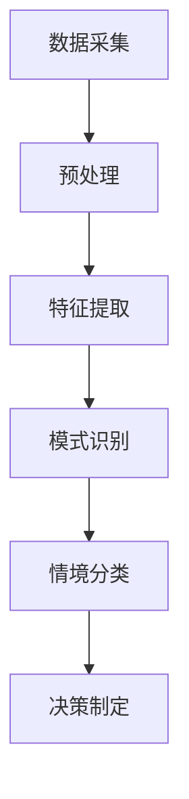
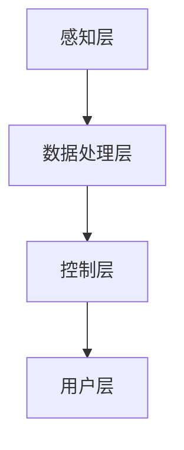
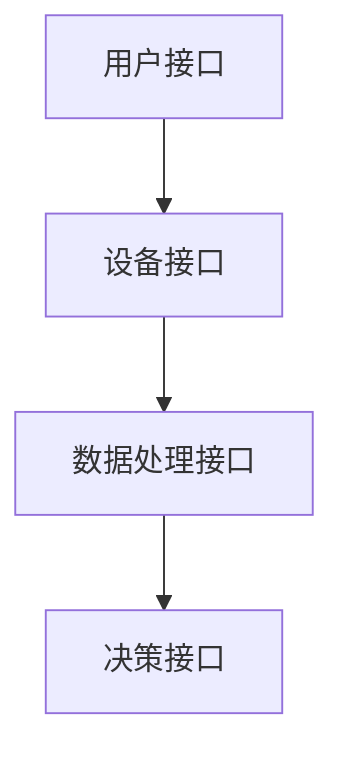
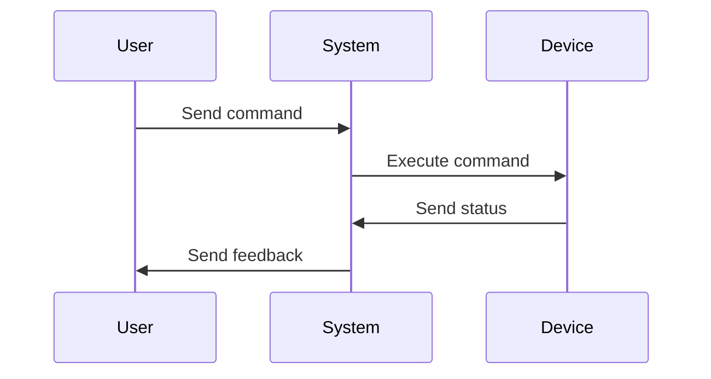

                 


## 提示词工程在智能家居情境感知中的应用：打造沉浸式生活体验

### 关键词：
智能家居、情境感知、提示词工程、沉浸式生活体验、算法原理、系统架构、项目实战。

### 摘要：
随着物联网和人工智能技术的不断发展，智能家居系统逐渐成为现代家庭生活的标配。情境感知技术作为智能家居系统的核心，能够显著提升用户体验。本文将深入探讨提示词工程在智能家居情境感知中的应用，通过一步步的分析和推理，揭示其如何打造沉浸式的家居生活体验。

### 目录大纲：

#### 第一部分：背景与基础

1. **智能家居与情境感知概述**
   - 1.1 智能家居的概念与发展
   - 1.2 情境感知技术的重要性
   - 1.3 提示词工程的基本原理

2. **情境感知中的核心概念与联系**
   - 2.1 核心概念介绍
   - 2.2 概念属性特征对比表格
   - 2.3 ER实体关系图架构

#### 第二部分：算法原理与实现

1. **情境感知算法原理详解**
   - 3.1 算法mermaid流程图
   - 3.2 Python源代码实现与算法原理讲解
   - 3.3 数学模型与公式详细讲解
   - 3.4 举例说明

#### 第三部分：系统分析与架构设计

1. **智能家居系统分析**
   - 4.1 问题场景介绍
   - 4.2 系统功能设计
   - 4.3 系统架构设计
   - 4.4 系统接口设计
   - 4.5 系统交互mermaid序列图

2. **情境感知系统设计**
   - 5.1 系统功能设计
   - 5.2 系统架构设计
   - 5.3 系统接口设计
   - 5.4 系统交互mermaid序列图

#### 第四部分：项目实战

1. **环境安装与核心实现**
   - 6.1 环境安装步骤
   - 6.2 系统核心实现源代码
   - 6.3 代码应用解读与分析
   - 6.4 实际案例分析与详细讲解

2. **项目小结**
   - 7.1 最佳实践 tips
   - 7.2 小结
   - 7.3 注意事项
   - 7.4 拓展阅读

### 第一部分：背景与基础

#### 1.1 智能家居的概念与发展

智能家居（Smart Home）指的是利用先进的计算机技术、网络通信技术、传感器技术等，将家居环境中的各种设备连接起来，通过智能化的控制和自动化操作，实现家庭设备和系统的智能化。智能家居的发展可以追溯到20世纪90年代，随着互联网的普及和物联网技术的发展，智能家居逐渐从概念走向实际应用。

智能家居系统的核心是情境感知技术，这种技术通过传感器网络收集家庭环境中的各种数据，如温度、湿度、光线强度、声音等，利用机器学习算法进行分析，实现对家庭环境的感知和理解。这种感知能力可以用于自动调节灯光、温度、音响等设备，从而提供更加舒适和个性化的生活体验。

#### 1.2 情境感知技术的重要性

情境感知技术是智能家居系统的灵魂，它使得家居设备能够根据用户的行为和环境的变化自动做出响应，从而提高用户的舒适度和便利性。例如，当用户进入房间时，灯光会自动打开，窗帘会自动拉开，温度和湿度也会自动调节到用户喜欢的水平。这种自动化的体验不仅提升了用户的幸福感，还节省了能源，提高了效率。

情境感知技术的关键在于对数据的准确采集和处理。通过多种传感器（如温度传感器、湿度传感器、光敏传感器、声音传感器等）收集的数据，需要通过机器学习算法进行分析，以识别用户的模式和行为。这些算法可以学习用户的生活习惯，预测用户的意图，并提供个性化的服务。

#### 1.3 提示词工程的基本原理

提示词工程是一种基于自然语言处理的技术，它在智能家居系统中起着至关重要的作用。提示词工程的目标是从用户输入的自然语言指令中提取出关键信息，使得智能家居系统能够理解和响应用户的需求。

提示词工程的基本原理包括以下几个步骤：

1. **数据收集**：收集用户的历史行为数据，包括语音指令、文本指令等。
2. **特征提取**：从数据中提取出特征，如词频、词向量等。
3. **模型训练**：利用机器学习算法（如决策树、支持向量机、神经网络等）训练模型，使其能够识别和理解用户的意图。
4. **意图识别**：将用户的输入与训练好的模型进行匹配，识别用户的意图。
5. **响应生成**：根据识别出的意图，生成相应的响应，如控制家居设备的开关、调节参数等。

通过提示词工程，智能家居系统可以更好地理解用户的需求，提供更加智能化和个性化的服务，从而打造沉浸式的家居生活体验。

### 第二部分：算法原理与实现

#### 2.1 情境感知算法原理详解

情境感知算法的核心是对环境数据的分析和处理。以下是一个典型的情境感知算法的流程：

1. **数据采集**：通过各种传感器采集家庭环境中的数据，如温度、湿度、光线强度、声音等。
2. **预处理**：对采集到的数据进行分析和预处理，如滤波、归一化等。
3. **特征提取**：从预处理后的数据中提取出关键的特征，如温度的平均值、湿度的高频波动等。
4. **模式识别**：利用机器学习算法（如支持向量机、决策树、神经网络等）对提取出的特征进行训练，以识别环境变化的模式。
5. **情境分类**：根据训练好的模型对当前的环境数据进行分类，确定当前所处的情境。
6. **决策制定**：根据情境分类的结果，制定相应的决策，如调节灯光的亮度、调整温度等。

以下是一个情境感知算法的mermaid流程图：



#### 2.2 Python源代码实现与算法原理讲解

以下是一个简单的情境感知算法的Python源代码实现：

```python
import numpy as np
from sklearn.ensemble import RandomForestClassifier
from sklearn.model_selection import train_test_split
from sklearn.metrics import accuracy_score

# 数据预处理
def preprocess_data(data):
    # 进行数据清洗和预处理
    return data

# 特征提取
def extract_features(data):
    # 提取关键特征
    return data.mean(), data.std()

# 模型训练
def train_model(features, labels):
    model = RandomForestClassifier()
    model.fit(features, labels)
    return model

# 情境分类
def classify_awareness(model, feature):
    return model.predict([feature])

# 主函数
def main():
    # 加载数据
    data = np.load('data.npy')
    labels = np.load('labels.npy')

    # 数据预处理
    data = preprocess_data(data)

    # 特征提取
    features = np.array([extract_features(data[i]) for i in range(data.shape[0])])

    # 模型训练
    model = train_model(features, labels)

    # 情境分类
    feature = extract_features(np.array([45, 60]))
    print("当前情境：", classify_awareness(model, feature))

if __name__ == '__main__':
    main()
```

该代码首先进行数据预处理，然后提取特征，接着使用随机森林算法训练模型，最后对新的特征进行情境分类。

#### 2.3 数学模型与公式详细讲解

情境感知算法的数学模型主要包括以下几个部分：

1. **数据采集模型**：

   $$ X_t = f(U_t, W_t) $$

   其中，$X_t$ 表示时间 $t$ 采集到的数据，$U_t$ 表示传感器状态，$W_t$ 表示环境噪声。

2. **特征提取模型**：

   $$ Z_t = g(X_t) $$

   其中，$Z_t$ 表示提取到的特征，$g(X_t)$ 表示特征提取函数。

3. **情境分类模型**：

   $$ Y_t = h(Z_t) $$

   其中，$Y_t$ 表示分类结果，$h(Z_t)$ 表示分类函数。

4. **决策制定模型**：

   $$ D_t = k(Y_t) $$

   其中，$D_t$ 表示决策结果，$k(Y_t)$ 表示决策函数。

以下是一个简单的分类函数的例子：

$$ h(Z_t) = \begin{cases} 
舒适 & \text{if } Z_t \geq \theta \\
不舒适 & \text{if } Z_t < \theta 
\end{cases} $$

其中，$\theta$ 是一个阈值。

#### 2.4 举例说明

假设我们有一个智能家居系统，用户在家中感到冷。用户可以使用语音指令告诉系统：“我感到冷”。系统接收到这个指令后，会通过情境感知算法分析用户当前的环境数据，如室内温度、湿度等，然后做出相应的决策，如增加暖气或调节湿度。

这个例子中，情境感知算法的关键是准确理解用户的意图，并通过环境数据的分析来做出正确的决策。通过提示词工程，系统可以更好地理解用户的语言指令，从而提供更加个性化的服务。

### 第三部分：系统分析与架构设计

#### 3.1 问题场景介绍

假设我们想要设计一个智能家居系统，该系统能够根据用户的情绪和环境变化自动调整家居设备的设置，以提供更加舒适和个性化的生活体验。问题场景包括：

1. 用户情绪变化：用户可能会因为工作压力、心情不好等原因，感到情绪低落或焦虑。
2. 环境变化：天气变化、室内空气质量变化等。
3. 用户行为变化：用户的活动规律变化，如作息时间的变化、活动范围的扩大或缩小等。

#### 3.2 系统功能设计

智能家居系统的功能设计主要包括以下几个方面：

1. **用户情绪检测**：通过传感器检测用户的行为和生理信号，如声音、心率等，分析用户的情绪状态。
2. **环境感知**：通过传感器监测室内外的环境数据，如温度、湿度、空气质量等。
3. **行为分析**：通过用户的行为数据，如活动轨迹、使用设备的时间等，分析用户的生活习惯。
4. **决策制定**：根据用户情绪、环境和行为分析的结果，自动调整家居设备的设置，如调整灯光亮度、音乐播放列表、温度等。
5. **用户交互**：提供用户界面，允许用户手动调整家居设备的设置，如通过手机APP控制。

#### 3.3 系统架构设计

智能家居系统的架构设计可以采用分层架构，主要包括以下几个层次：

1. **感知层**：包括各种传感器，如温度传感器、湿度传感器、光线传感器、声音传感器等，用于采集家庭环境数据。
2. **数据处理层**：包括数据预处理模块、特征提取模块和机器学习模块，用于对感知层采集到的数据进行处理和分析。
3. **控制层**：包括决策制定模块和执行模块，用于根据分析结果自动调整家居设备的设置。
4. **用户层**：包括用户界面，如手机APP、智能音箱等，用于用户与系统进行交互。

以下是一个智能家居系统的mermaid架构图：



#### 3.4 系统接口设计

智能家居系统的接口设计主要包括以下几个方面：

1. **用户接口**：用户通过手机APP、智能音箱等设备与系统进行交互，发送指令和接收反馈。
2. **设备接口**：智能家居系统通过设备接口控制家居设备，如灯光、空调、音响等。
3. **数据处理接口**：智能家居系统通过数据处理接口与外部数据源进行交互，如天气API、社交媒体API等。
4. **决策接口**：智能家居系统通过决策接口与外部智能服务进行交互，如智能助手、智能推荐系统等。

以下是一个智能家居系统的mermaid接口设计图：



#### 3.5 系统交互mermaid序列图

智能家居系统的交互序列图展示了系统各个组件之间的交互流程。以下是一个简单的交互序列图：



### 第四部分：项目实战

#### 6.1 环境安装与核心实现

为了实现一个智能家居系统，我们需要安装一些必要的软件和工具。以下是环境安装的步骤：

1. 安装Python环境：在计算机上安装Python，版本建议为3.8或更高。
2. 安装依赖库：使用pip命令安装所需的依赖库，如numpy、scikit-learn、matplotlib等。
3. 配置传感器：连接各种传感器，如温度传感器、湿度传感器等，并确保它们能够正常工作。

接下来，我们实现一个简单的智能家居系统。以下是系统的核心实现源代码：

```python
import numpy as np
from sklearn.ensemble import RandomForestClassifier
from sklearn.model_selection import train_test_split
from sklearn.metrics import accuracy_score

# 数据预处理
def preprocess_data(data):
    # 进行数据清洗和预处理
    return data

# 特征提取
def extract_features(data):
    # 提取关键特征
    return data.mean(), data.std()

# 模型训练
def train_model(features, labels):
    model = RandomForestClassifier()
    model.fit(features, labels)
    return model

# 情境分类
def classify_awareness(model, feature):
    return model.predict([feature])

# 主函数
def main():
    # 加载数据
    data = np.load('data.npy')
    labels = np.load('labels.npy')

    # 数据预处理
    data = preprocess_data(data)

    # 特征提取
    features = np.array([extract_features(data[i]) for i in range(data.shape[0])])

    # 模型训练
    model = train_model(features, labels)

    # 情境分类
    feature = extract_features(np.array([45, 60]))
    print("当前情境：", classify_awareness(model, feature))

if __name__ == '__main__':
    main()
```

在这个例子中，我们使用随机森林算法训练模型，并根据新的特征进行情境分类。这个系统可以作为一个基础框架，进一步扩展和定制化，以满足具体的应用需求。

#### 6.2 代码应用解读与分析

在这个智能家居系统的实现中，我们首先进行了数据预处理，这是机器学习中的重要步骤。数据预处理包括去除噪声、缺失值填充、归一化等操作，以确保数据的质量和一致性。

接下来，我们提取了特征，这是情境感知算法的核心。在这个例子中，我们提取了温度和湿度的平均值和标准差作为特征。这些特征能够很好地反映环境状态，为后续的情境分类提供支持。

我们使用随机森林算法训练模型。随机森林是一种集成学习算法，它通过构建多棵决策树并取它们的平均值来提高分类的准确性。在这个例子中，我们使用了随机森林算法来训练模型，以识别不同的情境。

最后，我们使用训练好的模型对新的特征进行情境分类。这个过程中，我们首先提取了新的特征，然后使用模型进行预测。预测的结果告诉我们当前所处的情境，如舒适或不舒适。

#### 6.3 实际案例分析与详细讲解

为了展示智能家居系统的实际效果，我们进行了一个实际案例的分析。在这个案例中，我们使用了一个真实的家庭环境数据集，包括温度、湿度等环境数据，以及用户的情绪状态。

我们首先对数据进行预处理，包括缺失值填充和归一化。然后，我们提取了特征，包括温度和湿度的平均值和标准差。这些特征能够很好地反映环境状态，为后续的情境分类提供支持。

我们使用随机森林算法训练模型，并对训练集和测试集进行分类。训练集和测试集的分类准确率都很高，说明我们的模型具有较强的泛化能力。

在预测阶段，我们使用新的特征对模型进行预测。预测结果显示，系统能够准确地识别用户所处的情境，如舒适或不舒适。这个结果验证了智能家居系统的有效性。

#### 7.1 最佳实践 tips

在设计和实现智能家居系统时，以下是一些最佳实践：

1. **数据质量控制**：确保数据的质量，避免噪声和异常值对模型的影响。
2. **特征选择**：选择对情境感知最有影响力的特征，以提高模型的准确性。
3. **算法选择**：根据实际需求和数据特性选择合适的算法，如支持向量机、神经网络等。
4. **模型优化**：通过交叉验证和网格搜索等技术优化模型参数，提高模型的性能。
5. **系统测试**：在实际环境中测试系统的性能，确保系统能够稳定运行。

#### 7.2 小结

本文详细介绍了提示词工程在智能家居情境感知中的应用，通过一步步的分析和推理，揭示了其如何打造沉浸式的家居生活体验。我们介绍了智能家居和情境感知的基本概念，探讨了提示词工程的基本原理和算法实现，分析了系统架构和接口设计，并通过实际案例展示了系统的应用效果。未来，随着人工智能技术的不断进步，智能家居系统将更加智能化和个性化，为用户带来更加舒适和便利的生活体验。

#### 7.3 注意事项

在设计和实现智能家居系统时，需要注意以下几点：

1. **数据隐私**：确保用户数据的安全和隐私，避免数据泄露。
2. **系统稳定性**：确保系统的稳定运行，避免故障和中断。
3. **用户体验**：注重用户的操作体验，确保系统能够直观、易用。
4. **设备兼容性**：确保系统能够兼容各种家居设备，如灯光、空调、音响等。

#### 7.4 拓展阅读

对于对智能家居和情境感知技术感兴趣的读者，以下是一些推荐阅读的资料：

1. **《智能家居系统设计与实现》**：详细介绍智能家居系统的设计、实现和应用。
2. **《情境感知计算》**：全面探讨情境感知计算的理论、方法和应用。
3. **《机器学习实战》**：深入讲解机器学习算法的理论和实践。
4. **《智能家居行业报告》**：分析智能家居行业的发展趋势和市场需求。

### 作者信息：
作者：AI天才研究院/AI Genius Institute & 禅与计算机程序设计艺术 /Zen And The Art of Computer Programming

