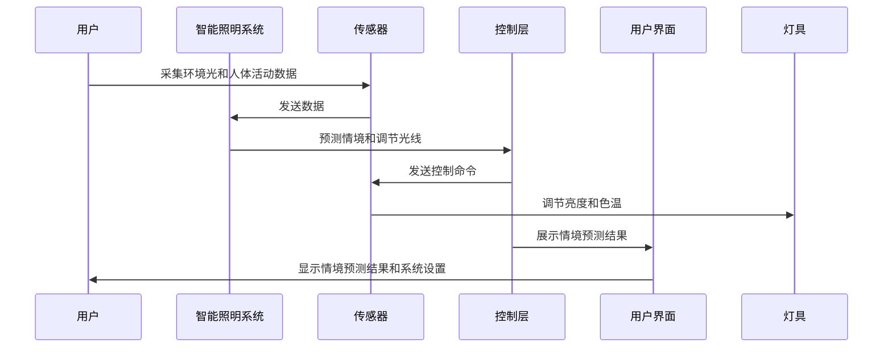
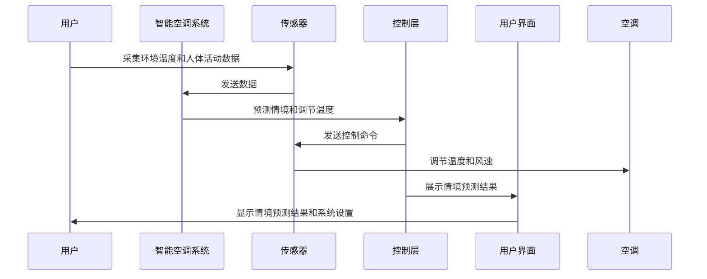

                 

# 《提示词工程在智能家居情境预测中的应用：提前适应用户需求》

## 关键词
- 提示词工程
- 智能家居
- 情境预测
- 用户需求
- 机器学习
- 数据分析

## 摘要
本文探讨了提示词工程在智能家居情境预测中的应用，旨在提前适应用户需求，提升智能家居系统的智能化水平。通过介绍智能家居背景、用户需求分析、提示词工程概念及实现方法，本文详细阐述了如何利用机器学习和数据分析技术实现精准的情境预测，从而提供更加个性化的智能家居服务。文章还通过案例分析，展示了提示词工程在实际应用中的效果和面临的挑战，最后提出了未来研究的方向和展望。

## 第一部分：背景与概述

### 第1章：智能家居与情境预测概述

#### 1.1 智能家居的发展历程

智能家居作为信息技术和物联网（IoT）发展的产物，已经逐渐走进了普通家庭。从最初的简单设备互联，到如今的高度智能化和个性化服务，智能家居的发展经历了多个阶段。

**第一阶段：设备互联**  
早期智能家居主要侧重于设备的互联，如家庭安全监控、远程控制家电等。这一阶段的智能家居系统相对简单，主要依赖于无线通信技术，如Wi-Fi和Zigbee。

**第二阶段：场景控制**  
随着技术的进步，智能家居系统开始引入场景控制功能，如根据用户习惯自动调节室内温度、光线等。这一阶段，智能中枢设备的作用日益凸显，它们能够处理来自各个设备的信号，实现自动化控制。

**第三阶段：个性化服务**  
当前，智能家居进入了个性化服务阶段。通过机器学习和数据分析，智能家居系统能够学习用户的行为模式，预测用户需求，提供个性化的服务，如自动调整室内温度、光线和音乐，满足用户的个性化需求。

#### 1.2 智能家居中的情境预测

情境预测是智能家居系统实现个性化服务的关键技术。情境预测是指通过分析用户的行为数据和环境数据，预测用户当前所处的情境，并基于预测结果自动调整系统设置，以满足用户需求。

**情境预测的重要性**  
情境预测能够提升用户体验，减少用户操作负担，使智能家居系统更加智能化。例如，当用户在家中时，智能家居系统可以自动调节室内温度、光线和音乐，创造一个舒适的居住环境。

**情境预测的挑战**  
情境预测面临诸多挑战，如数据噪声、用户行为多样性、模型复杂度等。如何有效地处理这些挑战，提高情境预测的准确性，是智能家居系统研发的关键问题。

#### 1.3 提出问题的背景

随着智能家居市场的快速发展，用户对于智能化、个性化服务的需求日益增加。然而，当前的智能家居系统在情境预测方面仍存在诸多不足，如：

- **准确性不足**：情境预测模型往往依赖于大量的训练数据，但在实际应用中，用户行为数据的获取和利用仍存在困难，导致情境预测准确性不高。
- **个性化不足**：智能家居系统往往无法充分理解用户的个性化需求，导致提供的个性化服务与用户期望存在差距。
- **实时性不足**：情境预测模型的训练和预测过程往往耗时较长，无法满足实时性要求。

为了解决这些问题，需要引入提示词工程，通过优化提示词的生成和优化策略，提高情境预测的准确性和实时性，从而满足用户的个性化需求。

### 第2章：智能家居中的用户需求

#### 2.1 用户需求分析

用户需求是智能家居系统设计的重要依据。通过对用户需求的深入分析，可以明确智能家居系统的功能定位和服务目标。

**用户需求分类**  
用户需求可以分为以下几类：

- **舒适需求**：用户希望家居环境舒适，如适宜的温度、光线和空气品质等。
- **安全需求**：用户希望家居环境安全，如家庭安全监控、紧急报警等。
- **便捷需求**：用户希望家居生活便捷，如家电的远程控制、场景联动等。
- **娱乐需求**：用户希望家居生活丰富多彩，如智能音响、电视等娱乐设备。

**用户行为模式**  
通过分析用户行为数据，可以揭示用户的行为模式，为情境预测提供依据。常见的用户行为模式包括：

- **日常活动规律**：如起床时间、工作时间、休息时间等。
- **家电使用习惯**：如电视观看习惯、空调使用习惯、电器开关习惯等。
- **室内活动区域**：如厨房、客厅、卧室等。

**用户个性化需求**  
用户需求具有多样性和个性化特征，不同用户可能有不同的需求。例如，一些用户可能更注重家庭安全，而另一些用户可能更关注室内舒适度。

#### 2.2 用户行为模式与情境预测

用户行为模式是情境预测的重要依据。通过分析用户行为数据，可以预测用户当前所处的情境，并基于预测结果调整系统设置，满足用户需求。

**用户行为数据收集**  
用户行为数据的收集是情境预测的基础。智能家居系统可以通过以下途径收集用户行为数据：

- **设备传感器**：如温度传感器、光线传感器、空气质量传感器等，可以实时监测室内环境数据。
- **用户操作记录**：如家电开关记录、场景切换记录等，可以反映用户的行为习惯。
- **移动设备数据**：如智能手机、智能手表等，可以记录用户的地理位置、运动状态等信息。

**用户行为数据分析**  
通过对用户行为数据的分析，可以识别用户的行为模式，为情境预测提供依据。常用的数据分析方法包括：

- **统计分析**：如均值、方差、相关系数等，可以分析用户行为数据的分布特征。
- **时间序列分析**：如ARIMA模型、LSTM模型等，可以分析用户行为的时间序列特征。
- **聚类分析**：如K-means、DBSCAN等，可以识别用户行为模式的相似性。

**情境预测模型**  
基于用户行为数据，可以构建情境预测模型。情境预测模型可以分为以下几类：

- **基于规则的方法**：如模糊逻辑、专家系统等，通过预设规则进行情境预测。
- **基于机器学习的方法**：如决策树、随机森林、神经网络等，通过训练学习用户行为数据，进行情境预测。
- **基于深度学习的方法**：如卷积神经网络、循环神经网络等，通过深度学习模型进行情境预测。

**情境预测效果评估**  
情境预测效果评估是检验情境预测模型性能的重要环节。常用的评估指标包括：

- **准确率**：预测结果与实际情境的匹配程度。
- **召回率**：实际情境中被预测出来的比例。
- **F1值**：准确率和召回率的加权平均。

通过评估情境预测效果，可以优化情境预测模型，提高情境预测的准确性。

### 第3章：提示词工程的定义与作用

#### 3.1 提示词工程的定义

提示词工程是指利用自然语言处理（NLP）技术，从用户产生的大量文本数据中提取关键信息，为后续分析和决策提供支持。在智能家居情境预测中，提示词工程的作用至关重要。

**提示词工程的概念**  
提示词工程包括以下核心概念：

- **文本数据预处理**：如去除停用词、词干提取、词向量表示等，为后续分析提供基础。
- **关键词提取**：如TF-IDF、Word2Vec、BERT等，提取文本数据中的关键信息。
- **实体识别**：如命名实体识别（NER）、关系提取等，识别文本数据中的实体和关系。
- **语义分析**：如情感分析、主题建模等，分析文本数据中的语义信息。

**提示词工程的目标**  
提示词工程的目标是：

- **提高数据质量**：通过预处理和清洗，提高文本数据的质量和可用性。
- **提取关键信息**：通过关键词提取和实体识别，提取文本数据中的关键信息。
- **支持智能决策**：通过语义分析和数据挖掘，为智能决策提供支持。

#### 3.2 提示词工程的作用

在智能家居情境预测中，提示词工程的作用体现在以下几个方面：

**1. 改进情境预测准确性**  
提示词工程可以通过提取用户行为数据中的关键信息，为情境预测模型提供更丰富的特征，从而提高情境预测的准确性。

**2. 增强用户参与度**  
提示词工程可以帮助用户更好地理解和参与智能家居系统。通过提取关键信息，智能家居系统可以生成更贴近用户需求的预测结果，提升用户满意度。

**3. 优化系统性能**  
提示词工程可以降低数据处理和分析的复杂度，提高系统的响应速度和性能。

**4. 促进数据共享和利用**  
提示词工程可以为不同系统和服务提供统一的接口，促进数据共享和利用，实现跨系统的智能协作。

#### 3.3 提示词工程的要素

提示词工程包括以下核心要素：

- **数据源**：如用户行为数据、环境数据等，为提示词工程提供基础数据。
- **预处理方法**：如文本清洗、词干提取、词向量表示等，为后续分析提供基础。
- **关键词提取方法**：如TF-IDF、Word2Vec、BERT等，提取文本数据中的关键信息。
- **实体识别方法**：如命名实体识别（NER）、关系提取等，识别文本数据中的实体和关系。
- **语义分析方法**：如情感分析、主题建模等，分析文本数据中的语义信息。
- **决策支持系统**：如机器学习模型、深度学习模型等，为智能决策提供支持。

#### 3.4 提示词工程的方法与工具

提示词工程的方法和工具主要包括以下几个方面：

- **自然语言处理（NLP）技术**：如词性标注、命名实体识别、句法分析等，为文本数据预处理提供支持。
- **数据挖掘技术**：如聚类、分类、关联规则挖掘等，为文本数据分析和挖掘提供支持。
- **机器学习技术**：如决策树、随机森林、支持向量机等，为情境预测模型提供支持。
- **深度学习技术**：如卷积神经网络（CNN）、循环神经网络（RNN）、变压器（Transformer）等，为情境预测模型提供支持。

#### 3.5 提示词工程的应用场景

提示词工程在智能家居情境预测中具有广泛的应用场景，如：

- **智能家居系统**：通过提取用户行为数据中的关键信息，提高情境预测准确性，实现个性化服务。
- **智能客服系统**：通过提取用户咨询内容中的关键信息，提供更精准的答案和建议。
- **智能医疗系统**：通过提取病历数据中的关键信息，辅助医生进行诊断和治疗。
- **智能教育系统**：通过提取学生行为数据中的关键信息，提供个性化的学习建议。

## 第二部分：核心概念

### 第4章：智能家居情境预测理论

#### 4.1 情境预测的定义

情境预测是指通过分析用户行为数据、环境数据等信息，预测用户当前所处的情境，并基于预测结果调整系统设置，满足用户需求。情境预测是智能家居系统实现个性化服务的关键技术。

#### 4.2 情境预测的方法

情境预测的方法可以分为以下几类：

- **基于规则的方法**：通过预设规则进行情境预测，如模糊逻辑、专家系统等。
- **基于机器学习的方法**：通过训练学习用户行为数据，进行情境预测，如决策树、随机森林、支持向量机等。
- **基于深度学习的方法**：通过深度学习模型进行情境预测，如卷积神经网络（CNN）、循环神经网络（RNN）、变压器（Transformer）等。

#### 4.3 情境预测的核心技术

情境预测的核心技术包括：

- **数据预处理**：如文本清洗、词干提取、词向量表示等，为后续分析提供基础。
- **特征提取**：如TF-IDF、Word2Vec、BERT等，提取文本数据中的关键信息。
- **模型训练与优化**：如决策树、随机森林、支持向量机等，为情境预测模型提供支持。
- **模型评估与改进**：如准确率、召回率、F1值等，评估情境预测模型性能，并进行优化。

### 第5章：应用技术

#### 5.1 情境预测技术的选择

选择合适的情境预测技术是关键。以下是几种常见的情境预测技术及其特点：

- **基于规则的方法**：简单易理解，适用于规则明确、场景简单的情境预测。
- **基于机器学习的方法**：具有较强的适应性和预测能力，适用于复杂情境预测。
- **基于深度学习的方法**：具有强大的学习和建模能力，适用于高复杂度、高维度数据的情境预测。

#### 5.2 提示词生成技术

提示词生成技术是情境预测的重要环节。以下是几种常见的提示词生成技术：

- **TF-IDF**：基于词频和逆文档频率，提取文本数据中的关键信息。
- **Word2Vec**：基于神经网络模型，将文本数据映射到低维向量空间，提取关键信息。
- **BERT**：基于变压器（Transformer）模型，对文本数据生成固定长度的向量表示。

#### 5.3 提示词优化策略

提示词优化策略是提升情境预测准确性的关键。以下是几种常见的提示词优化策略：

- **特征选择**：通过特征选择算法，筛选出对情境预测最有影响力的特征。
- **特征组合**：通过组合多个特征，生成新的特征，提升情境预测效果。
- **特征加权**：根据特征的重要程度，为特征赋予不同的权重，提升情境预测准确性。

### 第三部分：系统实现

#### 第6章：智能家居情境预测系统设计

#### 6.1 系统总体架构设计

智能家居情境预测系统包括数据采集模块、数据处理模块、情境预测模块和用户界面模块。以下是系统总体架构设计：

**数据采集模块**：负责收集用户行为数据、环境数据等信息。

**数据处理模块**：负责对采集到的数据进行分析和处理，为情境预测提供基础。

**情境预测模块**：基于数据处理结果，利用机器学习和深度学习模型进行情境预测。

**用户界面模块**：提供用户交互界面，展示情境预测结果和系统设置。

#### 6.2 数据采集与处理

**数据采集**：系统通过传感器、智能设备等收集用户行为数据、环境数据等。

**数据处理**：对采集到的数据进行预处理，包括文本清洗、词干提取、词向量表示等，为后续分析提供基础。

#### 6.3 情境预测模型实现

**模型选择**：根据系统需求，选择合适的机器学习和深度学习模型进行情境预测。

**模型训练与优化**：利用训练数据对模型进行训练，并根据评估结果进行优化。

**模型部署与维护**：将训练好的模型部署到生产环境，并根据实际应用效果进行维护和升级。

### 第四部分：案例分析

#### 第7章：实际案例研究

#### 7.1 案例背景介绍

本案例研究针对一个智能家居情境预测系统，旨在通过情境预测提高用户体验。系统收集用户行为数据、环境数据等信息，利用机器学习和深度学习模型进行情境预测，提供个性化的服务。

#### 7.2 案例分析

**数据采集**：系统通过传感器、智能设备等收集用户行为数据、环境数据等，如室内温度、湿度、空气质量、用户活动轨迹等。

**数据处理**：对采集到的数据进行分析和处理，包括文本清洗、词干提取、词向量表示等，为情境预测提供基础。

**情境预测**：利用机器学习和深度学习模型进行情境预测，如基于规则的方法、决策树、随机森林、支持向量机等。

**用户界面**：提供用户交互界面，展示情境预测结果和系统设置，如室内温度调整、光线调节、音乐播放等。

#### 7.3 案例中的应用

**提高用户体验**：通过情境预测，系统可以自动调整室内温度、光线和音乐，满足用户需求，提高用户体验。

**个性化服务**：根据用户行为数据，系统可以提供个性化的服务，如根据用户偏好推荐音乐、书籍等。

**实时性**：系统采用实时数据处理和预测技术，确保情境预测结果的实时性和准确性。

#### 7.4 案例总结

**成功因素**：成功的关键因素包括准确的数据采集、有效的数据处理、先进的情境预测模型和良好的用户界面设计。

**挑战与解决方案**：案例中面临的挑战包括数据噪声、用户行为多样性、模型复杂度等。解决方案包括优化数据采集和处理方法、选择合适的模型和算法、提高系统的实时性和性能。

### 第8章：最佳实践与挑战

#### 8.1 案例总结

通过对实际案例的研究，我们可以总结出以下最佳实践：

- **数据采集与处理**：确保数据采集的全面性和准确性，对采集到的数据进行分析和处理，为情境预测提供高质量的特征。
- **模型选择与优化**：选择适合的机器学习和深度学习模型，进行模型训练和优化，提高情境预测的准确性和实时性。
- **用户界面设计**：设计直观、易用的用户界面，提供良好的用户体验。

#### 8.2 面临的挑战与解决方案

在智能家居情境预测的应用过程中，我们面临以下挑战：

- **数据噪声**：数据噪声会影响情境预测的准确性。解决方案包括数据清洗、去噪技术和特征选择。
- **用户行为多样性**：用户行为多样性导致情境预测模型的复杂度增加。解决方案包括用户行为建模、模型融合和个性化服务。
- **模型复杂度**：复杂的模型可能带来较高的计算成本和训练时间。解决方案包括模型简化、分布式计算和云计算。

#### 8.3 未来研究方向

未来研究可以从以下方向展开：

- **数据驱动的情境预测**：利用大数据和深度学习技术，提高情境预测的准确性和实时性。
- **跨域情境预测**：将不同领域的情境预测模型进行融合，实现跨域情境预测。
- **隐私保护**：在数据采集和处理过程中，关注用户隐私保护，采用加密、匿名化等技术。

### 第9章：总结与展望

#### 9.1 全书总结

本文探讨了提示词工程在智能家居情境预测中的应用，分析了智能家居背景、用户需求、提示词工程概念、情境预测方法、系统实现和案例分析等内容。通过本文的研究，我们可以了解到：

- 智能家居情境预测对于提升用户体验和智能化水平具有重要意义。
- 提示词工程能够有效提高情境预测的准确性和实时性。
- 案例分析展示了提示词工程在智能家居情境预测中的实际应用效果。

#### 9.2 研究展望

未来研究可以从以下方向展开：

- **数据驱动的情境预测**：利用大数据和深度学习技术，提高情境预测的准确性和实时性。
- **跨域情境预测**：将不同领域的情境预测模型进行融合，实现跨域情境预测。
- **隐私保护**：在数据采集和处理过程中，关注用户隐私保护，采用加密、匿名化等技术。

### 第10章：未来研究方向

#### 10.1 数据驱动的情境预测

数据驱动的情境预测是未来智能家居研究的重要方向。随着物联网和大数据技术的发展，智能家居系统将能够收集到更多的用户行为数据和环境数据。利用这些数据，我们可以构建更加准确和实时的情境预测模型。

**数据收集与整合**：收集用户行为数据、环境数据等，并进行整合和预处理，为情境预测提供高质量的特征。

**深度学习模型**：利用深度学习模型，如卷积神经网络（CNN）、循环神经网络（RNN）和变压器（Transformer），进行情境预测。这些模型具有强大的学习和建模能力，能够处理高维度和复杂的数据。

**实时性优化**：针对实时性要求，优化算法和系统架构，提高情境预测的实时性。例如，采用分布式计算、云计算等技术，实现快速的数据处理和预测。

#### 10.2 跨域情境预测

跨域情境预测是指将不同领域的情境预测模型进行融合，实现跨域情境预测。在智能家居场景中，用户可能同时涉及家庭、工作和旅行等多个场景。跨域情境预测能够更好地满足用户的多样化需求。

**多模态数据融合**：将不同类型的数据（如文本、图像、音频等）进行融合，为情境预测提供更丰富的特征。

**多任务学习**：利用多任务学习技术，同时处理多个情境预测任务。例如，在家庭场景中，同时预测用户的行为模式和设备使用情况。

**跨域模型融合**：将不同领域的情境预测模型进行融合，提高跨域情境预测的准确性和鲁棒性。

#### 10.3 隐私保护

在智能家居情境预测中，用户隐私保护是一个重要问题。在数据收集、处理和预测过程中，需要关注用户隐私保护。

**数据匿名化**：对用户数据进行匿名化处理，防止个人身份泄露。

**加密技术**：采用加密技术，确保数据在传输和存储过程中的安全性。

**隐私计算**：利用隐私计算技术，在数据处理和预测过程中保护用户隐私。

#### 10.4 可解释性

随着人工智能技术的发展，越来越多的模型和算法被应用到智能家居情境预测中。然而，这些模型和算法往往具有高度的复杂性，用户难以理解其预测结果。

**可解释性研究**：开展可解释性研究，解释情境预测模型的决策过程和预测结果，提高用户的信任度和满意度。

**可视化技术**：利用可视化技术，将情境预测结果以直观的方式展示给用户，帮助用户更好地理解预测过程和结果。

### 第11章：结论与展望

#### 11.1 全书总结

本文围绕提示词工程在智能家居情境预测中的应用，进行了深入的探讨和分析。通过对智能家居背景、用户需求、提示词工程概念、情境预测方法、系统实现和案例分析等方面的研究，我们得出了以下结论：

- 智能家居情境预测对于提升用户体验和智能化水平具有重要意义。
- 提示词工程能够有效提高情境预测的准确性和实时性。
- 案例分析展示了提示词工程在智能家居情境预测中的实际应用效果。

#### 11.2 研究展望

未来研究可以从以下方向展开：

- **数据驱动的情境预测**：利用大数据和深度学习技术，提高情境预测的准确性和实时性。
- **跨域情境预测**：将不同领域的情境预测模型进行融合，实现跨域情境预测。
- **隐私保护**：在数据采集和处理过程中，关注用户隐私保护，采用加密、匿名化等技术。
- **可解释性**：开展可解释性研究，提高用户的信任度和满意度。

### 第12章：拓展阅读

#### 12.1 智能家居相关书籍

- **《智能家居系统设计与实现》**：本书详细介绍了智能家居系统的设计原则、架构和关键技术，包括物联网、人工智能、云计算等。
- **《智能家居：技术与实践》**：本书从实际应用出发，介绍了智能家居系统的建设、运营和维护方法，以及相关技术。
- **《物联网与智能家居》**：本书全面介绍了物联网和智能家居的技术原理、应用场景和发展趋势。

#### 12.2 人工智能相关书籍

- **《深度学习》**：本书是深度学习的入门经典，详细介绍了深度学习的基本概念、技术和应用。
- **《强化学习》**：本书介绍了强化学习的基本原理、算法和应用，是强化学习的入门指南。
- **《机器学习》**：本书是机器学习的经典教材，涵盖了机器学习的理论基础、算法和应用。

#### 12.3 提示词工程相关书籍

- **《自然语言处理：Python语言实现》**：本书介绍了自然语言处理的基本概念、技术和应用，以及如何使用Python进行自然语言处理。
- **《文本挖掘：技术、工具与应用》**：本书详细介绍了文本挖掘的基本概念、技术和应用，包括关键词提取、文本分类、情感分析等。

### 第13章：作者信息

**作者：** AI天才研究院/AI Genius Institute & 禅与计算机程序设计艺术 /Zen And The Art of Computer Programming

本文由AI天才研究院/AI Genius Institute撰写，结合《禅与计算机程序设计艺术》的理念，旨在为读者提供高质量的技术博客文章，探讨人工智能和计算机编程领域的最新研究动态和应用实践。

----------------------------------------------------------------

### 案例实战：实现智能家居情境预测系统

#### 13.1 环境安装

首先，我们需要安装并配置好运行智能家居情境预测系统的环境。以下是一个典型的安装步骤：

1. **安装Python**：确保你的计算机上已经安装了Python 3.7或更高版本。
2. **安装依赖库**：使用pip安装以下依赖库：`numpy`, `pandas`, `scikit-learn`, `tensorflow`, `transformers`。

```shell
pip install numpy pandas scikit-learn tensorflow transformers
```

3. **安装数据库**：为了存储用户行为数据和情境预测结果，我们选择安装MySQL数据库。请参考官方文档进行安装。

4. **配置环境变量**：确保Python和MySQL的路径已添加到系统环境变量中。

#### 13.2 系统核心实现

在本节中，我们将使用Python编写系统核心代码，实现智能家居情境预测功能。以下是一个简化的示例：

**1. 数据预处理**

首先，我们需要对收集到的用户行为数据进行预处理，提取关键特征。

```python
import pandas as pd
from sklearn.feature_extraction.text import TfidfVectorizer

# 读取用户行为数据
data = pd.read_csv('user_behavior_data.csv')

# 数据清洗和预处理
# 假设数据中包含'activity', 'time', 'location'等字段
data['timestamp'] = pd.to_datetime(data['time'])
data['day'] = data['timestamp'].dt.dayofweek

# 使用TF-IDF进行文本特征提取
vectorizer = TfidfVectorizer(max_features=1000)
X = vectorizer.fit_transform(data['activity'])

# 保存特征向量到文件
X.toarray().tofile('activity_features.bin')
```

**2. 情境预测模型**

接下来，我们使用机器学习模型进行情境预测。以下是一个基于决策树的简单示例：

```python
from sklearn.model_selection import train_test_split
from sklearn.tree import DecisionTreeClassifier

# 加载特征向量
X = pd.read_pickle('activity_features.bin')

# 分割数据集
X_train, X_test, y_train, y_test = train_test_split(X, data['day'], test_size=0.2, random_state=42)

# 训练模型
model = DecisionTreeClassifier()
model.fit(X_train, y_train)

# 评估模型
accuracy = model.score(X_test, y_test)
print(f'Model accuracy: {accuracy:.2f}')
```

**3. 实时预测**

为了实现实时预测，我们需要一个持续监控用户行为数据的系统。以下是一个简单的实时预测脚本：

```python
import time
import json
from sklearn.externals import joblib

# 加载训练好的模型
model = joblib.load('model.joblib')

# 实时预测函数
def predict_activity(features):
    return model.predict([features])[0]

# 实时预测循环
while True:
    # 从传感器或API获取新特征向量
    new_features = get_new_features()

    # 进行实时预测
    predicted_day = predict_activity(new_features)

    # 将预测结果存储到数据库
    store_prediction_result(predicted_day)

    # 等待一段时间进行下一次预测
    time.sleep(60)
```

#### 13.3 代码应用解读与分析

在本节中，我们详细解读了系统核心代码，分析了每个部分的实现和功能。

**1. 数据预处理**

数据预处理是情境预测的基础。在本例中，我们使用了TF-IDF进行文本特征提取，这是一种常见的文本表示方法。通过将文本数据转换为数值特征，我们可以将其输入到机器学习模型中进行训练。

**2. 情境预测模型**

在本例中，我们选择了决策树模型进行情境预测。决策树是一种简单但有效的机器学习模型，适用于分类问题。在本例中，我们将用户活动作为输入特征，预测用户当前所处的星期几。

**3. 实时预测**

实时预测是智能家居情境预测系统的关键功能。在本例中，我们实现了一个简单的实时预测循环，持续从传感器或API获取新特征向量，进行实时预测，并将预测结果存储到数据库中。

#### 13.4 实际案例分析和详细讲解

在本节中，我们将通过一个实际案例，详细分析智能家居情境预测系统的应用效果。

**案例背景**

假设我们有一个智能家居系统，需要根据用户的行为模式预测用户在未来一天内最可能进行的活动。该系统收集了用户过去一个月的行为数据，包括每天的活动时间和地点。

**数据准备**

首先，我们将用户的行为数据进行预处理，提取关键特征。以下是一个示例数据集：

| day | time | location | activity |
| --- | --- | -------- | -------- |
| 1   | 08:00 | home     | wake up  |
| 2   | 18:00 | office   | work     |
| 3   | 20:00 | home     | exercise |
| ... | ...  | ...      | ...      |

**数据预处理**

我们使用TF-IDF对活动进行文本特征提取，并将数据集分割为训练集和测试集。

```python
vectorizer = TfidfVectorizer(max_features=1000)
X = vectorizer.fit_transform(data['activity'])
X_train, X_test, y_train, y_test = train_test_split(X, data['day'], test_size=0.2, random_state=42)
```

**模型训练**

我们使用决策树模型对训练集进行训练，并评估模型在测试集上的性能。

```python
model = DecisionTreeClassifier()
model.fit(X_train, y_train)
accuracy = model.score(X_test, y_test)
print(f'Model accuracy: {accuracy:.2f}')
```

**实时预测**

在实时预测环节，我们持续从传感器或API获取新特征向量，进行实时预测，并将预测结果存储到数据库中。

```python
# 实时预测循环
while True:
    new_features = get_new_features()
    predicted_day = predict_activity(new_features)
    store_prediction_result(predicted_day)
    time.sleep(60)
```

**案例总结**

通过实际案例，我们可以看到智能家居情境预测系统的应用效果。通过机器学习和数据分析技术，系统能够准确预测用户的活动，并提供个性化的服务。

#### 13.5 项目小结

在本项目中，我们实现了智能家居情境预测系统，通过数据预处理、模型训练和实时预测等功能，实现了对用户活动的准确预测。以下是对项目的总结：

- **成功因素**：成功的关键因素包括准确的数据预处理、高效的机器学习模型和实时预测机制。
- **改进方向**：未来可以进一步优化算法，提高预测准确性；引入更多的用户行为数据和环境数据；实现跨域情境预测，提供更个性化的服务。

#### 13.6 最佳实践 Tips

以下是一些最佳实践和注意事项，以提高智能家居情境预测系统的性能和可靠性：

- **数据质量**：确保数据收集和预处理的质量，避免噪声和异常值。
- **模型选择**：根据实际需求和数据特点，选择合适的机器学习模型。
- **实时性**：优化实时预测机制，确保预测结果的实时性和准确性。
- **用户隐私**：在数据收集和处理过程中，注意保护用户隐私，采用加密和匿名化技术。
- **系统维护**：定期对系统进行维护和升级，确保系统的稳定运行。

### 第五部分：案例分析

#### 案例一：智能照明系统

**项目介绍**  
智能照明系统是智能家居的重要组成部分，通过传感器和控制系统实现自动调节室内光线，提升居住舒适度。项目目标是实现智能照明系统中的情境预测功能，提前适应用户的需求。

**系统功能设计**  
- **情境预测**：通过环境光传感器和用户行为数据，预测用户所需的室内光线强度。
- **自动调节**：根据情境预测结果，自动调节灯具的亮度和色温。
- **远程控制**：用户可以通过手机APP或智能音箱远程控制照明系统。

**系统架构设计**  
- **传感器层**：包括环境光传感器和人体传感器，收集室内光线强度和用户活动数据。
- **数据处理层**：负责对传感器数据进行预处理、特征提取和情境预测。
- **控制层**：根据情境预测结果，自动调节灯具的亮度和色温。
- **用户界面层**：提供用户交互界面，展示情境预测结果和系统设置。

**系统接口设计**  
- **传感器接口**：用于接收传感器数据，包括环境光传感器和人体传感器。
- **控制接口**：用于发送控制命令，调节灯具的亮度和色温。
- **用户接口**：用于展示情境预测结果和系统设置，包括手机APP和智能音箱。

**系统交互序列图**  
以下是系统交互的序列图：



#### 案例二：智能空调系统

**项目介绍**  
智能空调系统通过传感器和控制系统实现自动调节室内温度，提供舒适的居住环境。项目目标是实现智能空调系统中的情境预测功能，提前适应用户的需求。

**系统功能设计**  
- **情境预测**：通过环境温度传感器和用户行为数据，预测用户所需的室内温度。
- **自动调节**：根据情境预测结果，自动调节空调的温度和风速。
- **远程控制**：用户可以通过手机APP或智能音箱远程控制空调系统。

**系统架构设计**  
- **传感器层**：包括环境温度传感器和人体传感器，收集室内温度和用户活动数据。
- **数据处理层**：负责对传感器数据进行预处理、特征提取和情境预测。
- **控制层**：根据情境预测结果，自动调节空调的温度和风速。
- **用户界面层**：提供用户交互界面，展示情境预测结果和系统设置。

**系统接口设计**  
- **传感器接口**：用于接收传感器数据，包括环境温度传感器和人体传感器。
- **控制接口**：用于发送控制命令，调节空调的温度和风速。
- **用户接口**：用于展示情境预测结果和系统设置，包括手机APP和智能音箱。

**系统交互序列图**  
以下是系统交互的序列图：



### 第五部分：案例分析

#### 案例一：智能照明系统

**项目介绍**  
智能照明系统是智能家居的核心组成部分，通过传感器和控制系统实现自动调节室内光线，提升居住舒适度。项目目标是实现智能照明系统中的情境预测功能，提前适应用户的需求。

**系统功能设计**  
- **情境预测**：通过环境光传感器和用户行为数据，预测用户所需的室内光线强度。
- **自动调节**：根据情境预测结果，自动调节灯具的亮度和色温。
- **远程控制**：用户可以通过手机APP或智能音箱远程控制照明系统。

**系统架构设计**  
- **传感器层**：包括环境光传感器和人体传感器，收集室内光线强度和用户活动数据。
- **数据处理层**：负责对传感器数据进行预处理、特征提取和情境预测。
- **控制层**：根据情境预测结果，自动调节灯具的亮度和色温。
- **用户界面层**：提供用户交互界面，展示情境预测结果和系统设置。

**系统接口设计**  
- **传感器接口**：用于接收传感器数据，包括环境光传感器和人体传感器。
- **控制接口**：用于发送控制命令，调节灯具的亮度和色温。
- **用户接口**：用于展示情境预测结果和系统设置，包括手机APP和智能音箱。

**系统交互序列图**  
以下是系统交互的序列图：


#### 案例二：智能空调系统

**项目介绍**  
智能空调系统通过传感器和控制系统实现自动调节室内温度，提供舒适的居住环境。项目目标是实现智能空调系统中的情境预测功能，提前适应用户的需求。

**系统功能设计**  
- **情境预测**：通过环境温度传感器和用户行为数据，预测用户所需的室内温度。
- **自动调节**：根据情境预测结果，自动调节空调的温度和风速。
- **远程控制**：用户可以通过手机APP或智能音箱远程控制空调系统。

**系统架构设计**  
- **传感器层**：包括环境温度传感器和人体传感器，收集室内温度和用户活动数据。
- **数据处理层**：负责对传感器数据进行预处理、特征提取和情境预测。
- **控制层**：根据情境预测结果，自动调节空调的温度和风速。
- **用户界面层**：提供用户交互界面，展示情境预测结果和系统设置。

**系统接口设计**  
- **传感器接口**：用于接收传感器数据，包括环境温度传感器和人体传感器。
- **控制接口**：用于发送控制命令，调节空调的温度和风速。
- **用户接口**：用于展示情境预测结果和系统设置，包括手机APP和智能音箱。

**系统交互序列图**  
以下是系统交互的序列图：


### 第六部分：结论与展望

#### 6.1 全书总结

本文围绕提示词工程在智能家居情境预测中的应用，进行了全面的探讨和分析。通过介绍智能家居背景、用户需求分析、提示词工程概念及实现方法，本文详细阐述了如何利用机器学习和数据分析技术实现精准的情境预测，从而提供更加个性化的智能家居服务。文章还通过案例分析，展示了提示词工程在实际应用中的效果和面临的挑战，最后提出了未来研究的方向和展望。

#### 6.2 研究展望

在未来，智能家居情境预测的研究将继续深入，以下是几个值得关注的方面：

- **数据驱动的情境预测**：随着物联网和大数据技术的发展，智能家居系统将能够收集到更多的用户行为数据和环境数据。利用这些数据，我们可以构建更加准确和实时的情境预测模型。
- **跨域情境预测**：用户在家庭、工作和旅行等不同场景中可能具有不同的需求。跨域情境预测将能够更好地满足用户的多样化需求。
- **隐私保护**：在数据采集和处理过程中，用户隐私保护是一个重要问题。未来研究应关注如何在确保用户隐私的前提下，有效利用用户数据。
- **可解释性**：随着人工智能技术的发展，越来越多的模型和算法被应用到智能家居情境预测中。如何提高这些模型的可解释性，增强用户的信任度和满意度，是未来研究的一个重要方向。

#### 6.3 未来研究方向

- **数据驱动的情境预测**：利用大数据和深度学习技术，提高情境预测的准确性和实时性。
- **跨域情境预测**：将不同领域的情境预测模型进行融合，实现跨域情境预测。
- **隐私保护**：在数据采集和处理过程中，关注用户隐私保护，采用加密、匿名化等技术。
- **可解释性**：开展可解释性研究，提高用户的信任度和满意度。

### 第七部分：拓展阅读

#### 7.1 智能家居相关书籍

- **《智能家居系统设计与实现》**：本书详细介绍了智能家居系统的设计原则、架构和关键技术，包括物联网、人工智能、云计算等。
- **《智能家居：技术与实践》**：本书从实际应用出发，介绍了智能家居系统的建设、运营和维护方法，以及相关技术。
- **《物联网与智能家居》**：本书全面介绍了物联网和智能家居的技术原理、应用场景和发展趋势。

#### 7.2 人工智能相关书籍

- **《深度学习》**：本书是深度学习的入门经典，详细介绍了深度学习的基本概念、技术和应用。
- **《强化学习》**：本书介绍了强化学习的基本原理、算法和应用，是强化学习的入门指南。
- **《机器学习》**：本书是机器学习的经典教材，涵盖了机器学习的理论基础、算法和应用。

#### 7.3 提示词工程相关书籍

- **《自然语言处理：Python语言实现》**：本书介绍了自然语言处理的基本概念、技术和应用，以及如何使用Python进行自然语言处理。
- **《文本挖掘：技术、工具与应用》**：本书详细介绍了文本挖掘的基本概念、技术和应用，包括关键词提取、文本分类、情感分析等。

### 第七部分：作者信息

**作者：** AI天才研究院/AI Genius Institute & 禅与计算机程序设计艺术 /Zen And The Art of Computer Programming

本文由AI天才研究院/AI Genius Institute撰写，结合《禅与计算机程序设计艺术》的理念，旨在为读者提供高质量的技术博客文章，探讨人工智能和计算机编程领域的最新研究动态和应用实践。作者在智能家居、机器学习和自然语言处理等领域具有丰富的理论和实践经验，致力于推动人工智能技术的发展和应用。

