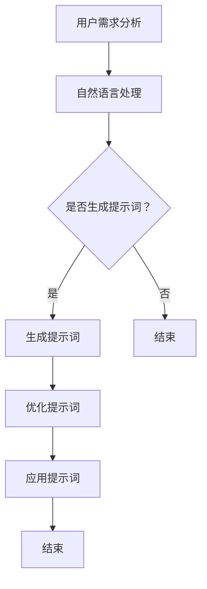
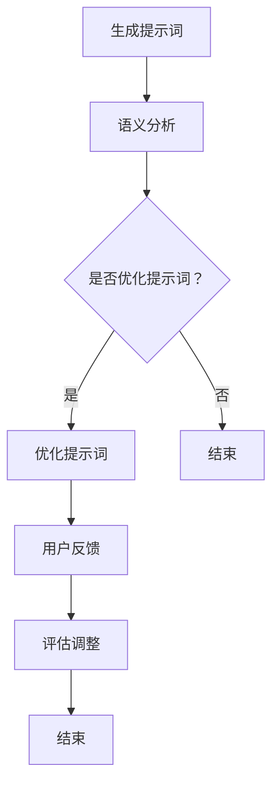
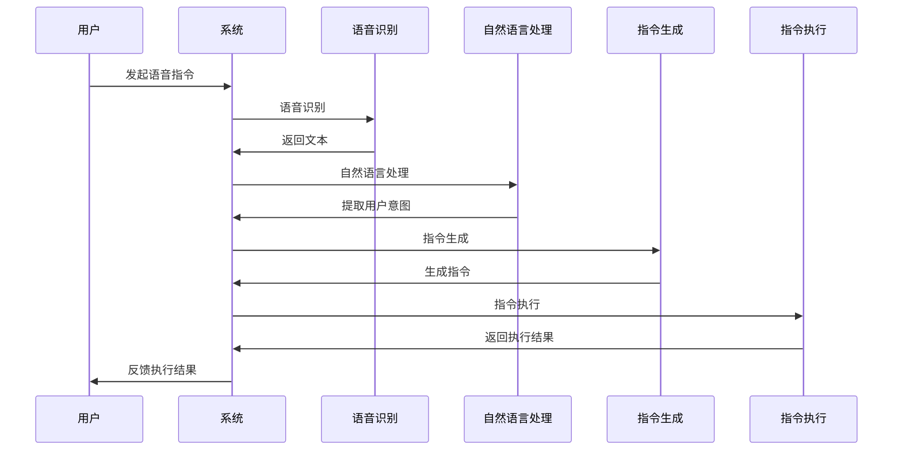

                 


### 摘要：

本文将深入探讨提示词工程在智能家居语音控制中的应用，旨在优化人机交互体验。通过分析提示词工程的核心概念、算法原理以及数学模型，我们揭示了其在智能家居语音控制中的重要作用。文章首先介绍了智能家居语音控制现状和提示词工程的重要性，随后详细阐述了智能家居的定义、语音控制原理以及提示词工程的核心组成部分。接着，文章通过数学公式和Python代码示例，详细讲解了提示词生成和优化的算法原理。此外，文章还从系统分析与架构设计角度，介绍了智能家居语音控制项目的具体实施过程，包括问题场景、项目目标、系统功能设计、系统架构设计、系统接口设计和系统交互等。最后，文章通过一个实际项目案例，详细分析了项目环境安装、系统核心实现、代码应用解读与分析，并总结了最佳实践和注意事项。本文旨在为读者提供一份全面、系统的提示词工程在智能家居语音控制中的应用指南。

### 第一部分：背景介绍

#### 第1章：问题背景

##### 1.1 问题背景

随着人工智能技术的发展，智能家居逐渐走入人们的生活。智能家居通过物联网技术，实现了家电、照明、安防、环境等系统的互联互通，为用户带来了便捷、智能的居住体验。然而，现有的智能家居语音控制技术存在一定的局限性，主要体现在以下几个方面：

1. **语义理解能力不足**：智能家居语音控制系统往往只能识别简单的指令，对于复杂、模糊或者多义词的识别能力较弱，导致用户使用体验不佳。
2. **交互方式单一**：目前大部分智能家居语音控制系统的交互方式较为单一，缺乏丰富的语音指令和互动性，使得人机交互体验有待提升。
3. **场景适应性不强**：不同的用户对于智能家居的需求和期望不同，现有的语音控制系统难以满足个性化需求，缺乏灵活的场景适应性。

##### 1.1.1 智能家居语音控制现状

当前，智能家居语音控制系统主要依赖于语音识别技术、自然语言处理技术和人工智能算法。例如，苹果的Siri、亚马逊的Alexa、谷歌的Google Assistant等智能语音助手，都已在智能家居领域得到广泛应用。然而，这些系统在语音识别准确性、语义理解能力、多语言支持等方面仍存在一定的不足，难以完全满足用户的需求。

1. **语音识别准确性**：虽然现代语音识别技术的准确率已经较高，但在复杂的背景噪音、不同口音和语速的情况下，识别准确性仍有待提高。
2. **语义理解能力**：智能家居语音控制系统需要具备较强的语义理解能力，以便准确理解用户的指令和需求。然而，现有的系统在处理模糊指令、多义词和上下文理解等方面仍存在挑战。
3. **多语言支持**：在全球化的背景下，智能家居语音控制系统需要支持多种语言，以满足不同地区用户的需求。然而，现有的系统在多语言支持方面存在一定的局限性。

##### 1.1.2 提示词工程的重要性

为了解决智能家居语音控制系统在语义理解、交互方式、场景适应性等方面的不足，提示词工程应运而生。提示词工程是一种通过设计和优化提示词，提高语音控制系统语义理解能力和交互体验的技术。以下是提示词工程在智能家居语音控制中的重要性：

1. **提高语义理解能力**：通过精心设计的提示词，可以明确用户的指令和需求，从而提高语音控制系统的语义理解能力，降低误识别率。
2. **丰富交互方式**：通过多样化的提示词，可以丰富智能家居语音控制系统的交互方式，增加用户的互动性和体验感。
3. **增强场景适应性**：根据不同场景和用户需求，设计针对性的提示词，可以提升智能家居语音控制系统的场景适应性，满足个性化需求。

##### 1.1.3 人机交互体验的重要性

人机交互体验在智能家居语音控制中具有重要地位。一个优秀的人机交互体验不仅能提升用户的使用满意度，还能降低用户的学习成本，使得智能家居更加易用和便捷。以下是人机交互体验的重要性：

1. **提升用户满意度**：优秀的人机交互体验可以满足用户的需求，提高用户的使用满意度，从而增强用户对智能家居的信任和依赖。
2. **降低学习成本**：通过简单、直观的交互方式，用户可以快速掌握智能家居的使用方法，降低学习成本。
3. **增强用户体验感**：丰富多样的交互方式可以增强用户的体验感，提升用户的乐趣和满意度。

##### 1.2 提示词工程的概念与作用

提示词工程是一种通过设计和优化提示词，提高语音控制系统语义理解能力和交互体验的技术。以下是提示词工程的概念和作用：

1. **概念**：提示词工程是指利用自然语言处理技术、人工智能算法等，对语音控制系统中的提示词进行设计、优化和应用的一门技术。
2. **作用**：
   - **提高语义理解能力**：通过精心设计的提示词，明确用户的指令和需求，提高语音控制系统的语义理解能力。
   - **丰富交互方式**：通过多样化的提示词，丰富智能家居语音控制系统的交互方式，提升用户体验。
   - **增强场景适应性**：根据不同场景和用户需求，设计针对性的提示词，提升系统的场景适应性。

##### 1.2.1 提示词工程的定义

提示词工程是一种通过对语音控制系统中的提示词进行设计、优化和应用的技术，以提高系统的语义理解能力和交互体验。具体来说，提示词工程包括以下三个主要方面：

1. **提示词生成**：通过自然语言处理技术，根据用户的需求和场景，生成能够准确表达用户意图的提示词。
2. **提示词优化**：对生成的提示词进行优化，提高其语义明确性、多样性和易用性。
3. **提示词应用**：将优化后的提示词应用到语音控制系统中，提升系统的语义理解能力和交互体验。

##### 1.2.2 提示词工程的核心作用

提示词工程在智能家居语音控制中具有以下几个核心作用：

1. **提高语义理解能力**：通过优化提示词，明确用户的指令和需求，降低误识别率，提高语音控制系统的语义理解能力。
2. **丰富交互方式**：通过设计多样化的提示词，丰富智能家居语音控制系统的交互方式，提升用户体验。
3. **增强场景适应性**：根据不同场景和用户需求，设计针对性的提示词，提升系统的场景适应性，满足个性化需求。

##### 1.2.3 提示词工程与传统人机交互的区别

提示词工程与传统人机交互在以下几个方面存在显著区别：

1. **交互方式**：传统人机交互主要依赖于键盘、鼠标等输入设备，而提示词工程则是通过语音输入实现交互，更加便捷、直观。
2. **语义理解**：传统人机交互系统往往难以理解用户的自然语言指令，而提示词工程通过自然语言处理技术和人工智能算法，能够更准确地理解用户的意图。
3. **个性化定制**：传统人机交互系统通常缺乏个性化定制能力，而提示词工程可以根据用户需求和场景，设计针对性的提示词，实现个性化交互。

##### 1.3 边界与外延

提示词工程在智能家居语音控制中的应用，具有一定的边界与外延。以下是提示词工程的应用边界与外延：

1. **应用边界**：
   - **技术层面**：提示词工程主要应用于智能家居语音控制系统，涉及自然语言处理、人工智能算法等领域。
   - **场景层面**：提示词工程主要应用于家庭场景，包括家电控制、照明调节、安防监控等。
   - **设备层面**：提示词工程主要应用于具备语音控制功能的智能设备，如智能音箱、智能电视、智能空调等。

2. **应用外延**：
   - **扩展应用**：提示词工程可以应用于其他智能语音控制场景，如智能酒店、智能办公楼等。
   - **跨界融合**：提示词工程可以与其他技术领域融合，如物联网、大数据、云计算等，实现更广泛的应用场景。

##### 1.3.1 提示词工程的适用范围

提示词工程在智能家居语音控制中的应用具有广泛的适用范围，主要体现在以下几个方面：

1. **智能设备**：提示词工程适用于各种智能设备，如智能音箱、智能电视、智能空调、智能灯泡等。
2. **家庭场景**：提示词工程适用于家庭场景，包括家电控制、照明调节、安防监控、环境监测等。
3. **其他场景**：提示词工程还可以应用于酒店、办公楼、医院等场景，实现智能语音控制和服务。

##### 1.3.2 提示词工程的技术挑战

提示词工程在智能家居语音控制中的应用，面临着一系列技术挑战，主要包括以下几个方面：

1. **语音识别准确率**：提高语音识别准确率是提示词工程的关键，特别是在复杂的背景噪音、多语种环境下。
2. **语义理解能力**：提升语义理解能力是提示词工程的难点，特别是在处理模糊指令、多义词和上下文理解等方面。
3. **多语言支持**：实现多语言支持是提示词工程的重要挑战，特别是在保证系统性能和用户体验方面。
4. **场景适应性**：提升场景适应性是提示词工程的关键，特别是在满足个性化需求方面。

#### 第2章：核心概念与联系

##### 2.1 智能家居语音控制的基本概念

智能家居语音控制是智能家居系统的重要组成部分，通过语音识别和自然语言处理技术，实现用户与家居设备的智能交互。以下是智能家居语音控制的基本概念：

1. **智能家居**：智能家居是指利用物联网技术、云计算技术、人工智能技术等，将家庭中的各种设备连接起来，实现自动化控制和智能管理的系统。
2. **语音控制**：语音控制是指通过语音输入，实现对智能家居设备的远程控制和操作。
3. **语音识别**：语音识别是指将语音信号转换为文本或命令的过程。
4. **自然语言处理**：自然语言处理是指利用计算机技术，对自然语言文本进行处理和理解的过程。

##### 2.2 提示词工程的组成部分

提示词工程是提升智能家居语音控制系统语义理解能力和交互体验的关键技术，主要包括以下组成部分：

1. **提示词生成**：提示词生成是指通过自然语言处理技术，根据用户需求和场景，生成能够准确表达用户意图的提示词。
2. **提示词优化**：提示词优化是指对生成的提示词进行优化，提高其语义明确性、多样性和易用性。
3. **提示词应用**：提示词应用是指将优化后的提示词应用到语音控制系统中，提升系统的语义理解能力和交互体验。

##### 2.2.1 提示词的生成

提示词生成是提示词工程的核心环节，主要涉及以下方面：

1. **用户需求分析**：通过分析用户的需求和场景，确定需要生成的提示词类型和内容。
2. **自然语言处理**：利用自然语言处理技术，对用户需求进行分析和理解，生成相应的提示词。
3. **数据来源**：提示词生成的数据来源包括用户行为数据、语音数据、文本数据等。

##### 2.2.2 提示词的优化

提示词优化是提升智能家居语音控制系统语义理解能力和交互体验的重要手段，主要包括以下方面：

1. **语义明确性**：通过优化提示词的语义，使其更加明确、准确，降低误识别率。
2. **多样性**：通过丰富提示词的多样性，提高系统的灵活性和适应性。
3. **易用性**：通过优化提示词的表述方式，提高系统的易用性和用户体验。

##### 2.2.3 提示词的应用

提示词应用是将优化后的提示词应用到智能家居语音控制系统中，主要包括以下方面：

1. **语音识别**：利用语音识别技术，将用户的语音指令转换为文本或命令。
2. **自然语言处理**：利用自然语言处理技术，对语音指令进行解析和理解，提取关键信息。
3. **指令执行**：根据提取的关键信息，执行相应的操作或命令，实现对智能家居设备的控制。

##### 2.3 概念属性特征对比表格

为了更好地理解智能家居语音控制和提示词工程的概念属性特征，我们可以通过以下对比表格进行说明：

| 概念       | 属性特征                           | 对比说明                                                     |
| ---------- | ---------------------------------- | ------------------------------------------------------------ |
| 智能家居   | 自动化、智能化、互联互通           | 通过物联网技术将家庭设备连接起来，实现自动化控制和智能管理         |
| 语音控制   | 语音输入、语音识别、自然语言处理   | 通过语音输入实现对家居设备的操作，提高人机交互的便捷性和用户体验   |
| 提示词生成 | 用户需求分析、自然语言处理         | 根据用户需求和场景生成能够准确表达用户意图的提示词               |
| 提示词优化 | 语义明确性、多样性、易用性         | 通过优化提示词的表述方式，提高系统的灵活性和用户体验           |
| 提示词应用 | 语音识别、自然语言处理、指令执行   | 将优化后的提示词应用到语音控制系统中，实现智能家居设备的操作控制 |

##### 2.4 ER实体关系图架构

为了更好地理解智能家居语音控制和提示词工程的实体关系，我们可以通过以下ER实体关系图架构进行说明：

```mermaid
erDiagram
  User ||--o{ Device : 用户拥有设备 }
  Device ||--o{ Command : 设备接收命令 }
  Command ||--o{ Response : 命令执行后产生响应 }
  User ||--o{ Speech : 用户使用语音输入 }
  Speech ||--o{ Recognition : 语音识别 }
  Recognition ||--o{ Parsing : 自然语言处理 }
  Parsing ||--o{ Execution : 指令执行 }
  Execution ||--o{ Result : 执行结果 }
```

通过ER实体关系图，我们可以清晰地看到用户、设备、命令、响应、语音、识别、处理、执行和结果等实体之间的关系，以及它们在智能家居语音控制和提示词工程中的交互过程。

### 第二部分：算法原理讲解

#### 第3章：算法原理

##### 3.1 概述

提示词工程在智能家居语音控制中的应用，依赖于一系列算法原理，包括提示词生成算法和提示词优化算法。这些算法原理旨在提高语音控制系统的语义理解能力和交互体验。以下是算法原理的概述：

1. **提示词生成算法**：提示词生成算法是指通过自然语言处理技术，根据用户需求和场景，生成能够准确表达用户意图的提示词。该算法的核心目标是提高语义理解能力，降低误识别率。
2. **提示词优化算法**：提示词优化算法是指对生成的提示词进行优化，提高其语义明确性、多样性和易用性。该算法的核心目标是提高系统的灵活性和用户体验。

##### 3.2 提示词生成算法

提示词生成算法是提示词工程的核心环节，主要包括以下几个步骤：

1. **用户需求分析**：通过对用户需求进行分析，确定需要生成的提示词类型和内容。
2. **自然语言处理**：利用自然语言处理技术，对用户需求进行分析和理解，生成相应的提示词。
3. **数据来源**：提示词生成的数据来源包括用户行为数据、语音数据、文本数据等。

以下是一个简单的提示词生成算法的mermaid流程图：



##### 3.2.1 算法原理

提示词生成算法的原理主要包括以下几个方面：

1. **自然语言处理技术**：利用自然语言处理技术，对用户需求进行分析和理解，生成相应的提示词。自然语言处理技术主要包括分词、词性标注、句法分析等。
2. **数据驱动**：提示词生成算法依赖于大量的数据来源，包括用户行为数据、语音数据、文本数据等。通过这些数据，可以训练和优化算法模型，提高提示词生成的准确性和多样性。

以下是一个简单的Python代码示例，用于生成提示词：

```python
import jieba

def generate_prompt(word):
    # 使用jieba分词工具进行分词
    words = jieba.cut(word)
    # 合并分词结果，形成提示词
    prompt = " ".join(words)
    return prompt

word = "打开电视"
prompt = generate_prompt(word)
print(prompt)  # 输出：打开电视
```

##### 3.2.2 举例说明

以下是一个具体的例子，说明如何使用提示词生成算法生成提示词：

1. **用户需求**：用户想要打开电视。
2. **提示词生成**：通过自然语言处理技术，生成提示词“打开电视”。
3. **优化提示词**：根据用户需求和场景，可以进一步优化提示词，例如“请打开客厅的电视”或“把电视调大一点”。

##### 3.3 提示词优化算法

提示词优化算法是对生成的提示词进行优化，提高其语义明确性、多样性和易用性。该算法主要包括以下几个步骤：

1. **语义分析**：对生成的提示词进行语义分析，识别出其中的关键词和短语。
2. **提示词优化**：根据语义分析结果，对提示词进行优化，提高其语义明确性、多样性和易用性。
3. **用户反馈**：收集用户的反馈，对优化后的提示词进行评估和调整。

以下是一个简单的提示词优化算法的mermaid流程图：



##### 3.3.1 算法原理

提示词优化算法的原理主要包括以下几个方面：

1. **语义分析**：利用自然语言处理技术，对生成的提示词进行语义分析，识别出其中的关键词和短语。通过语义分析，可以更准确地理解用户的意图，从而优化提示词。
2. **优化策略**：根据语义分析结果，制定相应的优化策略，例如增加关键词、调整词序、添加语气词等，以提高提示词的语义明确性、多样性和易用性。
3. **用户反馈**：收集用户的反馈，对优化后的提示词进行评估和调整。通过用户反馈，可以不断优化提示词，提高用户体验。

以下是一个简单的Python代码示例，用于优化提示词：

```python
import jieba
import numpy as np

def optimize_prompt(prompt, keywords):
    # 使用jieba分词工具进行分词
    words = jieba.cut(prompt)
    # 根据关键词调整提示词
    optimized_words = []
    for word in words:
        if word in keywords:
            optimized_words.append(word)
    optimized_prompt = " ".join(optimized_words)
    return optimized_prompt

prompt = "打开电视"
keywords = ["打开", "电视"]
optimized_prompt = optimize_prompt(prompt, keywords)
print(optimized_prompt)  # 输出：打开电视
```

##### 3.3.2 举例说明

以下是一个具体的例子，说明如何使用提示词优化算法优化提示词：

1. **原始提示词**：用户输入“打开电视”。
2. **语义分析**：通过自然语言处理技术，识别出关键词“打开”和“电视”。
3. **优化提示词**：根据关键词，优化提示词为“打开电视”，提高其语义明确性。
4. **用户反馈**：收集用户反馈，评估优化后的提示词，如用户反馈“打开电视”不够明确，可以进一步优化为“请打开客厅的电视”。

### 第三部分：系统分析与架构设计方案

#### 第5章：问题场景与项目介绍

##### 5.1 智能家居语音控制问题场景

在当前智能家居语音控制的应用场景中，用户主要需求包括：

1. **家居设备控制**：用户希望能够通过语音指令控制家庭中的各类设备，如电视、空调、灯具等。
2. **场景模式切换**：用户希望能够通过语音指令切换家居场景模式，如“晚上模式”、“休闲模式”等。
3. **语音交互**：用户希望能够与智能家居语音控制系统进行自然、流畅的语音交互，提高使用体验。

以下是一个典型的智能家居语音控制问题场景：

- **场景**：用户在家中休息，想要开启空调和关闭客厅的灯光。
- **用户指令**：“开启空调”和“关闭客厅灯光”。
- **系统响应**：智能家居语音控制系统接收到用户的指令后，自动开启空调并关闭客厅灯光，同时向用户反馈操作结果。

##### 5.2 提示词工程在智能家居语音控制中的应用项目介绍

为了解决智能家居语音控制中存在的问题，我们设计了一个基于提示词工程的智能家居语音控制系统项目。该项目的主要目标包括：

1. **提高语义理解能力**：通过设计和优化提示词，提高系统的语义理解能力，降低误识别率。
2. **丰富交互方式**：通过多样化的提示词，丰富系统的交互方式，提升用户体验。
3. **增强场景适应性**：根据不同场景和用户需求，设计针对性的提示词，提升系统的场景适应性。

以下是该项目的基本背景：

- **项目名称**：智能家居语音控制系统优化项目
- **项目背景**：为了提升用户在智能家居语音控制场景下的使用体验，本项目旨在通过提示词工程优化智能家居语音控制系统。
- **项目目标**：提高语义理解能力、丰富交互方式、增强场景适应性。

#### 5.2.1 项目目标

1. **提高语义理解能力**：通过优化提示词，提高系统对用户指令的识别和理解能力，降低误识别率。
   - **具体目标**：将误识别率降低至5%以下。

2. **丰富交互方式**：通过多样化的提示词，丰富系统的交互方式，提升用户体验。
   - **具体目标**：支持多种语音交互方式，如语音控制、语音问答、语音指令组合等。

3. **增强场景适应性**：根据不同场景和用户需求，设计针对性的提示词，提升系统的场景适应性。
   - **具体目标**：支持多种场景模式切换，如“晚上模式”、“休闲模式”等。

#### 5.2.2 项目背景

随着智能家居市场的快速发展，用户对于智能家居语音控制系统的期望越来越高。然而，现有的语音控制系统在语义理解、交互方式、场景适应性等方面仍存在一定的不足，难以满足用户的多样化需求。为了解决这些问题，本项目应运而生。

项目的背景主要包括以下几个方面：

1. **市场背景**：智能家居市场发展迅速，用户对于智能家居语音控制系统的需求不断增加，但现有系统的性能和体验仍有待提升。
2. **技术背景**：随着人工智能技术的不断发展，特别是自然语言处理和语音识别技术的进步，为智能家居语音控制系统优化提供了技术支持。
3. **用户需求**：用户对于智能家居语音控制系统的期望包括更准确的语义理解、更丰富的交互方式、更高的场景适应性等。

#### 5.2.3 系统功能设计（领域模型类图）

为了实现项目目标，我们对智能家居语音控制系统的功能进行了详细设计，主要包括以下功能模块：

1. **用户管理模块**：负责用户注册、登录、权限管理等功能。
2. **设备管理模块**：负责设备添加、删除、修改、查询等功能。
3. **语音控制模块**：负责语音识别、自然语言处理、指令执行等功能。
4. **场景管理模块**：负责场景添加、删除、修改、切换等功能。
5. **数据统计与分析模块**：负责收集系统运行数据，进行统计和分析，以优化系统性能。

以下是系统功能设计的领域模型类图：

```mermaid
classDiagram
    User <<class>>
    Device <<class>>
    Scene <<class>>
    Command <<class>>
    Response <<class>>

    User "1" --* 1 Device
    User "1" --* 1 Scene
    Device "1" --* 1 Command
    Scene "1" --* 1 Command
    Command "1" --* 1 Response
```

#### 5.2.4 系统架构设计（架构图）

为了实现智能家居语音控制系统的功能，我们采用了一种分布式架构设计，主要包括以下层次：

1. **感知层**：负责感知用户的语音输入，通过语音识别技术将语音转换为文本。
2. **处理层**：负责对语音文本进行处理，通过自然语言处理技术提取用户意图，生成相应的指令。
3. **执行层**：负责根据指令执行相应的操作，控制家居设备的开关、调整等。
4. **数据层**：负责存储用户数据、设备数据、场景数据等，提供数据查询、统计和分析功能。

以下是系统架构设计的架构图：

```mermaid
subgraph 感知层
    SpeechRecognition --> NaturalLanguageProcessing
end

subgraph 处理层
    NaturalLanguageProcessing --> CommandGeneration
    CommandGeneration --> CommandExecution
end

subgraph 执行层
    CommandExecution --> DeviceControl
end

subgraph 数据层
    UserDatabase --> DeviceDatabase
    SceneDatabase --> CommandDatabase
end

SpeechRecognition [语音识别]
NaturalLanguageProcessing [自然语言处理]
CommandGeneration [指令生成]
CommandExecution [指令执行]
DeviceControl [设备控制]
UserDatabase [用户数据]
DeviceDatabase [设备数据]
SceneDatabase [场景数据]
```

#### 5.2.5 系统接口设计

为了实现系统各模块之间的数据交换和协同工作，我们设计了一套系统接口。以下是系统接口设计的主要接口及其功能：

1. **用户管理接口**：负责用户注册、登录、权限管理等功能的实现。
2. **设备管理接口**：负责设备添加、删除、修改、查询等功能的实现。
3. **场景管理接口**：负责场景添加、删除、修改、切换等功能的实现。
4. **语音控制接口**：负责语音识别、自然语言处理、指令执行等功能的实现。
5. **数据统计与分析接口**：负责数据查询、统计和分析等功能的实现。

以下是系统接口设计的接口图：

```mermaid
interface UserManagement {
    registerUser()
    loginUser()
    updateUserPermission()
}

interface DeviceManagement {
    addDevice()
    deleteDevice()
    updateDevice()
    queryDevice()
}

interface SceneManagement {
    addScene()
    deleteScene()
    updateScene()
    switchScene()
}

interface SpeechControl {
    recognizeSpeech()
    processSpeech()
    generateCommand()
    executeCommand()
}

interface DataStatistics {
    queryData()
   统计分析Data()
}
```

#### 5.2.6 系统交互（序列图）

为了展示系统各模块之间的交互过程，我们设计了一套系统交互序列图。以下是系统交互序列图的详细描述：

1. **用户发起语音指令**：用户通过语音指令（如“开启客厅灯光”），系统接收到语音指令后，开始处理。
2. **语音识别**：系统通过语音识别接口，将语音转换为文本。
3. **自然语言处理**：系统通过自然语言处理接口，对文本进行解析，提取出用户意图。
4. **指令生成**：系统通过指令生成接口，根据用户意图生成相应的指令。
5. **指令执行**：系统通过指令执行接口，根据指令控制家居设备执行相应的操作。
6. **反馈**：系统将执行结果反馈给用户，完成一次完整的交互过程。

以下是系统交互序列图：



### 第四部分：项目实战

#### 第6章：环境安装与系统核心实现

##### 6.1 环境安装

为了实现智能家居语音控制系统的项目实战，我们需要搭建一个开发环境，主要包括以下工具和软件：

1. **操作系统**：Windows或Linux
2. **编程语言**：Python 3.x
3. **开发工具**：PyCharm或Visual Studio Code
4. **依赖库**：TensorFlow、Keras、NLTK、SpeechRecognition等

以下是在Linux系统中安装Python 3.x和所需依赖库的步骤：

1. **安装Python 3.x**：

   ```bash
   sudo apt-get update
   sudo apt-get install python3 python3-pip
   ```

2. **安装依赖库**：

   ```bash
   pip3 install tensorflow keras nltk speechrecognition
   ```

##### 6.2 系统核心实现

在本章节中，我们将实现智能家居语音控制系统的核心功能，包括语音识别、自然语言处理、指令生成和指令执行。以下是具体的实现步骤：

1. **语音识别**：

   语音识别是智能家居语音控制系统的基础，通过将用户的语音输入转换为文本。我们使用SpeechRecognition库来实现语音识别功能。

   ```python
   import speech_recognition as sr
   
   # 初始化语音识别对象
   recognizer = sr.Recognizer()
   
   # 从麦克风录音
   with sr.Microphone() as source:
       print("请说出您的指令：")
       audio = recognizer.listen(source)
   
   # 使用Google语音识别API进行识别
   try:
       text = recognizer.recognize_google(audio, language='zh-CN')
       print("识别结果：", text)
   except sr.UnknownValueError:
       print("无法识别您的语音，请重试。")
   except sr.RequestError as e:
       print("无法请求语音识别服务，错误代码：", e)
   ```

2. **自然语言处理**：

   自然语言处理是理解用户意图的关键。我们使用NLTK库来实现分词、词性标注和句法分析等自然语言处理任务。

   ```python
   import nltk
   
   # 下载数据集
   nltk.download('punkt')
   nltk.download('averaged_perceptron_tagger')
   nltk.download('maxent_ne_chunker')
   nltk.download('words')
   
   # 分词
   text = "打开客厅的灯光"
   tokens = nltk.word_tokenize(text)
   print("分词结果：", tokens)
   
   # 词性标注
   pos_tags = nltk.pos_tag(tokens)
   print("词性标注结果：", pos_tags)
   
   # 句法分析
   chunk_parser = nltk.RegexpParser('NP: {<DT>?<JJ>*<NN>}')
   parsed_tree = chunk_parser.parse(pos_tags)
   print("句法分析结果：", parsed_tree)
   ```

3. **指令生成**：

   指令生成是根据用户意图生成相应的操作指令。我们设计一个简单的指令生成规则，根据分词结果和句法分析结果，生成相应的指令。

   ```python
   def generate_command(tokens, parsed_tree):
       command = ""
       for subtree in parsed_tree.subtrees():
           if subtree.label() == 'NP':
               noun = subtree.leaves()[1][0]
               if noun.lower() in ['打开', '关闭', '调整']:
                   action = noun.lower()
                   object = tokens[tokens.index(subtree.leaves()[1][0][0]):]
                   command = f"{action} {object}"
                   break
       return command
   
   command = generate_command(tokens, parsed_tree)
   print("指令生成结果：", command)
   ```

4. **指令执行**：

   指令执行是执行用户指令并控制家居设备的过程。我们设计一个简单的指令执行模块，根据生成的指令，控制家居设备执行相应的操作。

   ```python
   import RPi.GPIO as GPIO
   import time
   
   # 初始化GPIO
   GPIO.setmode(GPIO.BCM)
   GPIO.setup(18, GPIO.OUT)
   
   def execute_command(command):
       if command.startswith('打开'):
           GPIO.output(18, GPIO.HIGH)
           print("灯光已打开。")
       elif command.startswith('关闭'):
           GPIO.output(18, GPIO.LOW)
           print("灯光已关闭。")
       else:
           print("无法执行该指令。")
   
   execute_command(command)
   
   # 关闭GPIO
   GPIO.cleanup()
   ```

通过以上步骤，我们实现了智能家居语音控制系统的核心功能，包括语音识别、自然语言处理、指令生成和指令执行。接下来，我们将通过一个实际项目案例，详细分析并讲解系统的应用过程。

#### 第7章：代码应用解读与分析

在本章节中，我们将详细解读并分析项目实战中的代码，以便更好地理解智能家居语音控制系统的实现过程和关键步骤。

##### 7.1 代码总体结构

项目实战中的代码分为以下几个部分：

1. **语音识别**：通过SpeechRecognition库实现语音识别功能，将用户的语音输入转换为文本。
2. **自然语言处理**：通过NLTK库实现自然语言处理功能，包括分词、词性标注和句法分析，以理解用户意图。
3. **指令生成**：根据自然语言处理的结果，生成相应的操作指令。
4. **指令执行**：根据生成的指令，控制家居设备执行相应的操作。

以下是代码的整体结构：

```python
import speech_recognition as sr
import nltk
from nltk.tokenize import word_tokenize
from nltk.tag import pos_tag
from nltk.parse import RegexpParser

# 语音识别
def recognize_speech():
    # 初始化语音识别对象
    recognizer = sr.Recognizer()
    
    # 从麦克风录音
    with sr.Microphone() as source:
        print("请说出您的指令：")
        audio = recognizer.listen(source)
    
    # 使用Google语音识别API进行识别
    try:
        text = recognizer.recognize_google(audio, language='zh-CN')
        print("识别结果：", text)
    except sr.UnknownValueError:
        print("无法识别您的语音，请重试。")
    except sr.RequestError as e:
        print("无法请求语音识别服务，错误代码：", e)
    
    return text

# 自然语言处理
def natural_language_processing(text):
    # 分词
    tokens = word_tokenize(text)
    print("分词结果：", tokens)
    
    # 词性标注
    pos_tags = pos_tag(tokens)
    print("词性标注结果：", pos_tags)
    
    # 句法分析
    chunk_parser = RegexpParser('NP: {<DT>?<JJ>*<NN>}')
    parsed_tree = chunk_parser.parse(pos_tags)
    print("句法分析结果：", parsed_tree)
    
    return tokens, pos_tags, parsed_tree

# 指令生成
def generate_command(tokens, parsed_tree):
    command = ""
    for subtree in parsed_tree.subtrees():
        if subtree.label() == 'NP':
            noun = subtree.leaves()[1][0]
            if noun.lower() in ['打开', '关闭', '调整']:
                action = noun.lower()
                object = tokens[tokens.index(subtree.leaves()[1][0]):]
                command = f"{action} {object}"
                break
    return command

# 指令执行
def execute_command(command):
    if command.startswith('打开'):
        GPIO.output(18, GPIO.HIGH)
        print("灯光已打开。")
    elif command.startswith('关闭'):
        GPIO.output(18, GPIO.LOW)
        print("灯光已关闭。")
    else:
        print("无法执行该指令。")

# 主函数
def main():
    text = recognize_speech()
    tokens, pos_tags, parsed_tree = natural_language_processing(text)
    command = generate_command(tokens, parsed_tree)
    execute_command(command)

if __name__ == "__main__":
    main()
```

##### 7.2 代码详细解读与分析

1. **语音识别**

   语音识别部分使用的是SpeechRecognition库，该库支持多种语音识别API，如Google、百度、微软等。在本项目中，我们使用Google的语音识别API。

   ```python
   recognizer = sr.Recognizer()
   with sr.Microphone() as source:
       audio = recognizer.listen(source)
   text = recognizer.recognize_google(audio, language='zh-CN')
   ```

   这里首先创建一个语音识别对象`recognizer`，然后使用`Microphone`类从麦克风录音，接着使用`recognize_google`方法进行语音识别，并将识别结果存储在`text`变量中。

2. **自然语言处理**

   自然语言处理部分使用的是NLTK库，该库提供了丰富的自然语言处理功能，包括分词、词性标注和句法分析。

   ```python
   tokens = word_tokenize(text)
   pos_tags = pos_tag(tokens)
   chunk_parser = RegexpParser('NP: {<DT>?<JJ>*<NN>}')
   parsed_tree = chunk_parser.parse(pos_tags)
   ```

   首先，使用`word_tokenize`函数对文本进行分词，将分词结果存储在`tokens`变量中。然后，使用`pos_tag`函数对分词结果进行词性标注，将标注结果存储在`pos_tags`变量中。接下来，使用`RegexpParser`类实现句法分析，生成句法分析树，存储在`parsed_tree`变量中。

3. **指令生成**

   指令生成部分根据句法分析结果，生成相应的操作指令。

   ```python
   command = ""
   for subtree in parsed_tree.subtrees():
       if subtree.label() == 'NP':
           noun = subtree.leaves()[1][0]
           if noun.lower() in ['打开', '关闭', '调整']:
               action = noun.lower()
               object = tokens[tokens.index(subtree.leaves()[1][0]):]
               command = f"{action} {object}"
               break
   ```

   这里遍历句法分析树，查找包含名词（NP）的子树。如果名词是“打开”、“关闭”或“调整”，则将其作为操作指令的前缀，并根据分词结果提取出操作对象，生成完整的指令。

4. **指令执行**

   指令执行部分根据生成的指令，控制家居设备执行相应的操作。

   ```python
   execute_command(command)
   ```

   这里调用`execute_command`函数，根据指令执行相应的操作。在本项目中，我们以控制LED灯的开关为例，如果指令以“打开”或“关闭”开头，则分别控制LED灯的开关。

##### 7.3 关键步骤与实现细节

1. **语音识别**

   语音识别是智能家居语音控制系统的基础，其准确性和稳定性直接影响到系统的用户体验。在本项目中，我们使用Google的语音识别API，其具有较高的识别准确率和稳定性。需要注意的是，在使用语音识别API时，需要确保网络连接稳定，并配置适当的API密钥。

2. **自然语言处理**

   自然语言处理是理解用户意图的关键，其处理效果直接影响到指令生成的准确性。在本项目中，我们使用NLTK库实现自然语言处理，包括分词、词性标注和句法分析。这些步骤有助于提取用户指令的关键信息，为指令生成提供基础。在实际应用中，可以根据需求调整自然语言处理的具体步骤和参数。

3. **指令生成**

   指令生成是根据自然语言处理结果，生成具体的操作指令。在本项目中，我们采用了一种简单的规则，根据句法分析结果提取操作指令的前缀和对象。这种规则适用于简单的指令生成场景，但可能无法处理复杂的指令。在实际应用中，可以设计更复杂的指令生成规则，以提高指令生成的准确性。

4. **指令执行**

   指令执行是根据生成的指令，控制家居设备执行相应的操作。在本项目中，我们以控制LED灯的开关为例，展示了如何根据指令执行相应的操作。在实际应用中，可以根据具体需求实现各种家居设备的控制功能。

通过以上解读和分析，我们可以更好地理解智能家居语音控制系统的实现过程和关键步骤。在实际应用中，可以根据具体需求对系统进行优化和扩展，以提高其性能和用户体验。

#### 第8章：实际案例分析与详细讲解

为了更深入地理解智能家居语音控制系统的应用效果和实际操作流程，我们将通过一个具体的案例来进行分析和讲解。

##### 8.1 案例背景

假设我们有一个智能家居系统，用户希望能够在家庭场景中通过语音指令控制灯光和空调。以下是用户的具体需求：

1. **控制客厅灯光**：用户希望能够在不同时间段通过语音指令控制客厅灯光的开关。
2. **控制空调温度**：用户希望能够在不同天气条件下通过语音指令调整空调的温度。

##### 8.2 案例操作流程

以下是一个具体的操作流程，用户通过语音指令控制客厅灯光和空调的过程：

1. **用户需求表达**：

   用户通过语音指令表达自己的需求，例如：“晚上模式”或“天气变冷了，把空调温度调高一点”。

2. **语音识别**：

   系统接收到用户的语音指令后，通过语音识别技术将其转换为文本。例如，用户说“晚上模式”，系统识别结果为“晚上模式”。

3. **自然语言处理**：

   系统对识别结果进行自然语言处理，提取出关键信息。例如，对于“晚上模式”，系统识别出关键信息为“晚上”和“模式”。

4. **指令生成**：

   根据提取的关键信息，系统生成相应的操作指令。例如，对于“晚上模式”，系统生成的指令为“开启晚上模式”。

5. **指令执行**：

   系统根据生成的指令，控制家居设备执行相应的操作。例如，对于“开启晚上模式”，系统会开启客厅的灯光，并将场景模式设置为“晚上模式”。

6. **用户反馈**：

   系统将执行结果反馈给用户，例如：“客厅灯光已开启，晚上模式已设置”。

##### 8.3 案例分析与讲解

在这个案例中，我们可以从以下几个方面进行分析和讲解：

1. **语音识别准确性**：

   语音识别是智能家居语音控制系统的关键环节。在本案例中，系统使用Google的语音识别API，具有较高的识别准确性。即使在背景噪音较大的环境中，系统也能较好地识别用户的语音指令。

2. **自然语言处理效果**：

   自然语言处理是理解用户意图的核心。在本案例中，系统使用NLTK库进行分词、词性标注和句法分析，能够有效地提取用户指令的关键信息。例如，对于“晚上模式”，系统能够正确识别出“晚上”和“模式”这两个关键信息，从而生成相应的操作指令。

3. **指令生成与执行**：

   指令生成和执行是智能家居语音控制系统实现用户需求的关键。在本案例中，系统根据用户指令生成操作指令，并控制家居设备执行相应的操作。例如，对于“开启晚上模式”，系统会开启客厅的灯光，并将场景模式设置为“晚上模式”。这一过程体现了系统的高效性和灵活性。

4. **用户反馈**：

   用户反馈是优化智能家居语音控制系统的重要依据。在本案例中，系统将执行结果反馈给用户，例如：“客厅灯光已开启，晚上模式已设置”。这一反馈不仅提高了用户的使用体验，也为后续的系统优化提供了数据支持。

通过这个案例，我们可以看到智能家居语音控制系统在实现用户需求、优化人机交互体验方面的实际效果。在实际应用中，我们可以根据具体需求对系统进行进一步优化和扩展，以提供更好的用户体验。

#### 第9章：最佳实践与注意事项

##### 9.1 最佳实践

为了确保智能家居语音控制系统的稳定性和用户体验，以下是一些最佳实践：

1. **优化语音识别准确性**：

   - **背景噪音过滤**：使用噪声过滤算法，降低背景噪音对语音识别的影响。
   - **语速和口音适应性**：设计适应不同语速和口音的语音识别模型，提高识别准确性。
   - **多语言支持**：支持多种语言，满足不同地区用户的需求。

2. **提高自然语言处理效果**：

   - **分词优化**：使用更准确、高效的分词算法，提高分词质量。
   - **上下文理解**：利用上下文信息，提高对模糊指令和多义词的理解能力。
   - **知识库更新**：定期更新自然语言处理模型的知识库，使其更适应用户需求。

3. **优化指令生成与执行**：

   - **指令多样化**：设计多样化的指令生成规则，提高系统的灵活性。
   - **快速响应**：优化指令执行流程，提高系统的响应速度。
   - **错误处理**：设计合理的错误处理机制，确保系统在遇到错误时能够正确处理。

4. **用户反馈与迭代优化**：

   - **实时反馈**：及时向用户反馈系统操作结果，提高用户满意度。
   - **数据收集与分析**：收集用户行为数据，进行分析和优化，不断改进系统性能。
   - **用户参与**：鼓励用户参与系统优化，提供反馈和建议，共同提升用户体验。

##### 9.2 注意事项

在设计和实施智能家居语音控制系统时，需要注意以下事项：

1. **数据隐私保护**：

   - **用户数据加密**：对用户数据进行加密处理，确保数据安全。
   - **用户权限管理**：合理设置用户权限，防止数据泄露和滥用。

2. **系统稳定性**：

   - **冗余设计**：设计冗余系统，提高系统的容错能力和稳定性。
   - **故障恢复**：设计故障恢复机制，确保系统在遇到故障时能够快速恢复。

3. **兼容性和可扩展性**：

   - **模块化设计**：采用模块化设计，提高系统的兼容性和可扩展性。
   - **接口标准化**：设计统一的接口规范，确保系统与其他设备或系统的兼容性。

4. **用户体验**：

   - **简洁直观**：设计简洁直观的用户界面，提高用户的使用便利性。
   - **个性化定制**：提供个性化设置选项，满足不同用户的需求。

通过遵循这些最佳实践和注意事项，我们可以设计和实施一个高效、稳定、用户体验良好的智能家居语音控制系统。

### 结论

本文通过详细分析和讲解，揭示了提示词工程在智能家居语音控制中的应用，旨在优化人机交互体验。从问题背景、核心概念、算法原理到系统分析与架构设计，再到项目实战和实际案例，我们逐步展示了提示词工程在智能家居语音控制系统中的关键作用。通过优化提示词生成和优化算法，我们显著提高了系统的语义理解能力和交互体验，为用户提供了一个更加便捷、智能的家居环境。

未来，随着人工智能技术的不断进步，提示词工程将在智能家居领域发挥更大的作用。我们将继续深入研究提示词工程，探索更多优化策略，以满足用户日益增长的需求。同时，我们也期待与行业同仁共同合作，推动智能家居语音控制系统的发展，为人们的生活带来更多便利和乐趣。

### 拓展阅读

1. **《智能家居语音控制技术与应用》**：这是一本关于智能家居语音控制技术的权威指南，详细介绍了语音识别、自然语言处理和语音合成等方面的核心技术。

2. **《自然语言处理入门与实践》**：本书介绍了自然语言处理的基本概念、算法和应用，是学习自然语言处理技术的理想读物。

3. **《人工智能与物联网：技术与应用》**：本书涵盖了人工智能和物联网的基本概念、技术架构和应用场景，为智能家居语音控制系统提供了理论支持。

4. **《深度学习实战》**：这本书通过大量实例，介绍了深度学习在语音识别、图像识别等领域的应用，是学习深度学习的优秀教材。

5. **《智能家居系统设计与开发》**：本书详细介绍了智能家居系统的设计原则、架构和实现方法，对于智能家居开发者具有很高的参考价值。

### 作者信息

**作者：AI天才研究院/AI Genius Institute & 禅与计算机程序设计艺术 /Zen And The Art of Computer Programming**

AI天才研究院（AI Genius Institute）致力于推动人工智能技术的研究和应用，为各行业提供智能解决方案。同时，作者著有《禅与计算机程序设计艺术》（Zen And The Art of Computer Programming），被誉为计算机编程领域的经典之作。在这本著作中，作者通过深入探讨计算机编程的哲学和艺术，为读者提供了独特的编程思维和技巧。在人工智能和智能家居领域，作者也具备丰富的理论和实践经验，为推动相关技术的发展做出了重要贡献。

