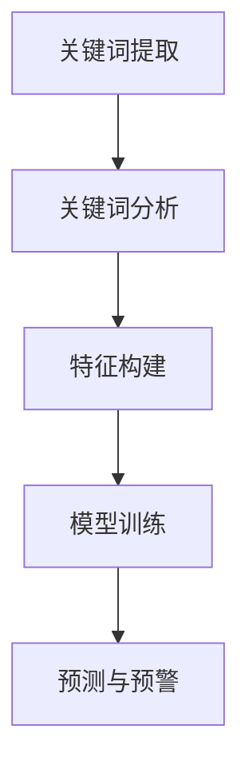
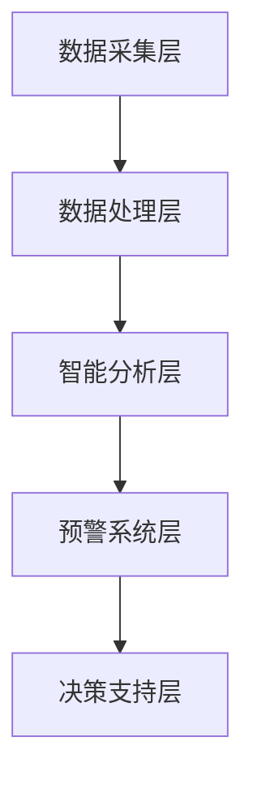
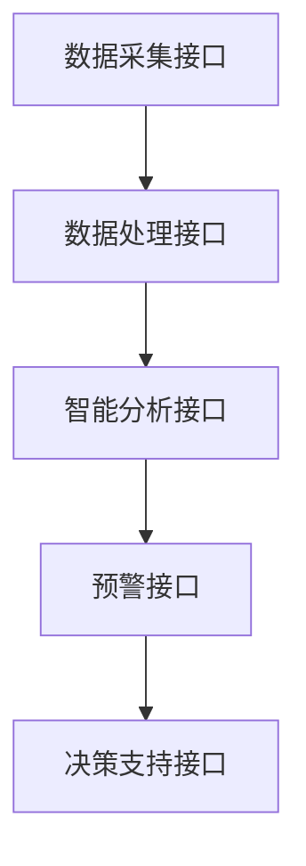
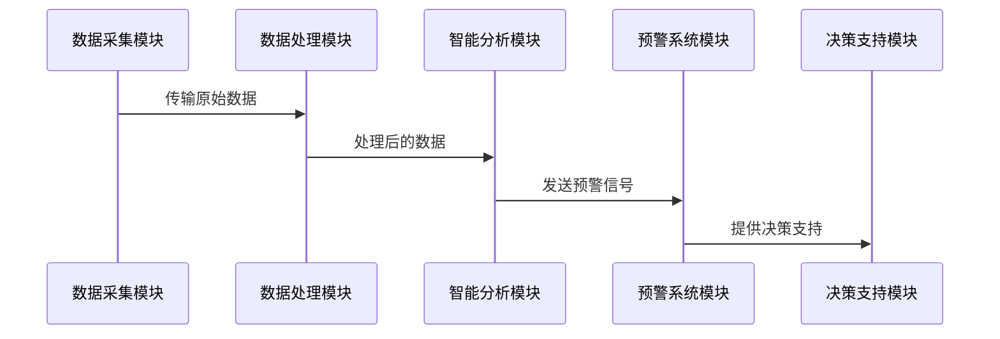

                 

### 第一部分：背景介绍

#### 1.1 问题背景

随着工业化和城市化的快速发展，环境问题变得日益严峻。空气污染、水资源污染、土地退化等问题对生态系统和人类健康构成了严重威胁。为了应对这些挑战，环境监测成为了一个关键的领域。传统的环境监测方法主要依赖于人工采样和实验室分析，这种方式的效率较低，且存在人为误差。此外，随着环境问题的复杂性增加，传统方法难以应对海量数据的处理需求。

智能环境监测系统的出现为环境监测带来了新的希望。通过利用传感器网络、大数据分析、人工智能等技术，智能环境监测系统能够实时、准确地收集和处理环境数据，提供及时的预警和决策支持。这一系统不仅提高了环境监测的效率，还能显著提升生态保护的力度。

#### 1.2 问题描述

智能环境监测系统需要解决的主要问题包括以下几个方面：

1. **数据采集与处理**：智能环境监测系统需要实时、准确地获取环境数据，这要求传感器网络具有高度的可靠性和覆盖范围。同时，大量的原始数据需要进行预处理和清洗，以便用于后续的分析。

2. **数据处理与分析**：环境数据通常包含大量噪声和不完整信息，需要利用大数据分析和机器学习技术进行处理。此外，如何从海量数据中提取有价值的信息，对系统的分析能力提出了挑战。

3. **智能预警与决策**：智能环境监测系统应能够对监测数据进行分析，识别潜在的环境问题，并生成预警信息。系统还需要具备决策支持功能，帮助环境管理者做出合理的决策。

4. **系统的稳定性与可靠性**：智能环境监测系统需要在各种环境下保持稳定运行，确保数据的连续性和准确性。

#### 1.3 问题解决

为了解决上述问题，智能环境监测系统可以采用以下技术手段：

1. **传感器网络**：部署高精度的传感器，构建广泛覆盖的传感器网络，实现环境数据的实时采集。

2. **大数据分析**：利用大数据技术，对海量环境数据进行存储、处理和分析，提高数据处理效率。

3. **人工智能与机器学习**：应用人工智能和机器学习算法，对环境数据进行分析，识别环境变化趋势，预测未来环境状况。

4. **物联网技术**：利用物联网技术，实现监测系统的互联互通，提高系统的协同工作能力。

5. **提示词工程**：通过提示词工程，实现对监测数据的智能处理和预警，提高系统的决策支持能力。

#### 1.4 边界与外延

在智能环境监测中，提示词工程的应用主要涉及以下几个方面：

- **数据采集**：传感器网络的布局和传感器选择。
- **数据处理**：原始数据的预处理、清洗和转换。
- **数据分析**：利用机器学习和数据分析技术，提取环境数据中的有用信息。
- **预警与决策**：基于提示词工程，实现环境问题的智能预警和决策支持。

接下来，我们将深入探讨提示词工程的概念、原理以及其在智能环境监测中的应用。通过一步一步的分析推理，我们将揭示提示词工程如何提高生态保护效率，为环境监测带来革命性的变革。

### 第二部分：核心概念与联系

#### 2.1 核心概念

为了深入理解提示词工程在智能环境监测中的应用，我们首先需要明确一些核心概念。以下是提示词工程中的一些关键术语：

1. **提示词（Keywords）**：提示词是用于描述环境数据特征的关键字或短语，可以帮助智能系统更好地理解和分析数据。

2. **特征提取（Feature Extraction）**：特征提取是指从原始数据中提取出具有代表性的特征，这些特征能够有效反映环境数据的本质。

3. **模式识别（Pattern Recognition）**：模式识别是利用机器学习算法，从数据中识别出特定的模式或趋势。

4. **预警系统（Early Warning System）**：预警系统是指通过监测环境数据，识别出潜在的环境问题，并发出预警信号的系统。

5. **决策支持系统（Decision Support System）**：决策支持系统是指利用分析结果，帮助环境管理者做出合理决策的系统。

#### 2.2 概念属性特征对比表格

为了更好地理解这些概念，我们提供了一个属性特征对比表格：

| 概念       | 定义                                                         | 关键属性特征                      |
|------------|--------------------------------------------------------------|-----------------------------------|
| 提示词     | 用于描述环境数据的关键词或短语                                 | 精确性、代表性、可扩展性            |
| 特征提取   | 从原始数据中提取出具有代表性的特征                             | 可解释性、鲁棒性、效率性            |
| 模式识别   | 利用机器学习算法，从数据中识别出特定的模式或趋势                 | 精准性、适应性、实时性              |
| 预警系统   | 通过监测环境数据，识别出潜在的环境问题，并发出预警信号             | 及时性、准确性、自动化              |
| 决策支持系统 | 利用分析结果，帮助环境管理者做出合理决策                         | 可操作性、可靠性、适应性            |

通过对比，我们可以发现，这些概念在智能环境监测中各自扮演着不同的角色，但它们之间也存在紧密的联系。例如，提示词的精确性和代表性直接影响特征提取的效果；而特征提取的效率和鲁棒性则对模式识别的准确性有着重要影响。

#### 2.3 ER实体关系图

为了更直观地展示这些概念之间的关系，我们使用ER（Entity-Relationship）实体关系图来表示：

```mermaid
erDiagram
  组件1 ||--|{ 提示词 }
  组件2 ||--|{ 特征提取 }
  组件3 ||--|{ 模式识别 }
  组件4 ||--|{ 预警系统 }
  组件5 ||--|{ 决策支持系统 }
  组件1 ..|> 组件2
  组件2 ..|> 组件3
  组件3 ..|> 组件4
  组件4 ..|> 组件5
```

在这个ER图中，我们可以看到，提示词作为数据描述的关键字，是整个系统的起点。特征提取过程将原始数据转换为具有代表性的特征，这些特征随后被用于模式识别。模式识别的结果用于预警系统，帮助识别潜在的环境问题，并最终为决策支持系统提供数据支持。这种结构确保了智能环境监测系统的高效运作和协同作用。

通过这一部分的详细探讨，我们不仅理解了提示词工程中的核心概念，还明确了它们在智能环境监测系统中的关联和作用。在接下来的部分，我们将进一步深入讨论提示词工程的算法原理，为智能环境监测提供更深入的洞察。

### 第三部分：算法原理讲解

#### 3.1 提示词工程的原理

提示词工程是一种基于关键词和语义分析的技术，旨在通过提取和利用关键词来提升智能环境监测系统的效率。其基本原理可以概括为以下几个步骤：

1. **关键词提取**：通过自然语言处理（NLP）技术，从环境数据中提取出具有代表性的关键词。这些关键词能够反映环境数据的特征和变化趋势。

2. **关键词分析**：对提取的关键词进行深入分析，理解其含义和关系。这一步骤通常涉及词频统计、词义相似性分析等。

3. **特征构建**：基于关键词分析的结果，构建环境数据的特征向量。这些特征向量能够用来表示环境数据，并用于后续的机器学习模型训练。

4. **模型训练**：利用构建的特征向量，通过机器学习算法训练模型。模型能够学会识别环境数据中的潜在模式和趋势。

5. **预测与预警**：通过训练好的模型，对新的环境数据进行分析，预测未来环境状况，并发出预警信号。

#### 3.2 算法mermaid流程图

为了更直观地理解提示词工程的算法流程，我们使用mermaid绘制了以下流程图：



在这个流程图中，我们可以看到，从关键词提取到模型训练，再到最终的预测与预警，每一步都是相互关联且必要的。关键词提取是整个流程的起点，它决定了后续分析的准确性和有效性。关键词分析和特征构建则确保了数据的处理和表示具有代表性和可解释性。模型训练和预测与预警则共同构成了智能环境监测的核心。

#### 3.3 Python源代码阐述

为了具体展示提示词工程的实现过程，我们提供了一个简单的Python源代码示例。以下代码首先进行了关键词提取，然后进行了关键词分析，并最终构建了一个简单的机器学习模型。

```python
import nltk
from nltk.tokenize import word_tokenize
from nltk.corpus import stopwords
from sklearn.feature_extraction.text import TfidfVectorizer
from sklearn.model_selection import train_test_split
from sklearn.ensemble import RandomForestClassifier

# 关键词提取
def extract_keywords(text):
    tokens = word_tokenize(text)
    tokens = [token.lower() for token in tokens if token.isalnum()]
    tokens = [token for token in tokens if token not in stopwords.words('english')]
    return tokens

# 关键词分析
def analyze_keywords(tokens):
    freq_dist = nltk.FreqDist(tokens)
    return freq_dist.most_common(10)

# 特征构建
def build_features(corpus):
    vectorizer = TfidfVectorizer()
    X = vectorizer.fit_transform(corpus)
    return X

# 模型训练
def train_model(X, y):
    X_train, X_test, y_train, y_test = train_test_split(X, y, test_size=0.2, random_state=42)
    model = RandomForestClassifier()
    model.fit(X_train, y_train)
    return model

# 预测与预警
def predict(model, X):
    predictions = model.predict(X)
    return predictions

# 示例数据
corpus = ["The air is polluted", "The water is clean", "The land is degraded"]

# 实现流程
keywords = [extract_keywords(text) for text in corpus]
print("提取的关键词：", keywords)

keyword_analyses = [analyze_keywords(tokens) for tokens in keywords]
print("关键词分析结果：", keyword_analyses)

X = build_features(corpus)
y = [0, 1, 2]  # 假设不同关键词对应不同的环境状况
model = train_model(X, y)
predictions = predict(model, X)

print("预测结果：", predictions)
```

在这个示例中，我们首先使用了NLP库nltk进行关键词提取，然后利用TF-IDF向量器构建了特征向量。接着，我们使用随机森林算法训练了一个模型，并最终进行了预测。通过这个示例，我们可以看到提示词工程的具体实现过程。

#### 3.4 数学模型和公式

提示词工程中的数学模型通常涉及以下几个关键步骤：

1. **词频分布（TF）**：词频分布是指一个词在文本中出现的频率。公式如下：
   $$TF(t) = \frac{f(t)}{N}$$
   其中，\( f(t) \) 是词 \( t \) 在文本中出现的次数，\( N \) 是文本中所有词的总数。

2. **逆文档频率（IDF）**：逆文档频率反映了词的重要性，公式如下：
   $$IDF(t) = \log \left( \frac{N}{|d_t|} \right)$$
   其中，\( N \) 是文档总数，\( |d_t| \) 是包含词 \( t \) 的文档数。

3. **TF-IDF权重**：TF-IDF权重是词频和逆文档频率的乘积，用于表示词的重要性。公式如下：
   $$TF-IDF(t, d) = TF(t, d) \times IDF(t)$$

4. **特征向量**：特征向量是通过TF-IDF权重构建的，用于机器学习模型的输入。公式如下：
   $$X = [TF-IDF(t_1, d), TF-IDF(t_2, d), ..., TF-IDF(t_n, d)]^T$$

通过这些数学模型和公式，我们可以更有效地处理环境数据，提取出关键的特征，为智能环境监测提供强有力的支持。

#### 3.5 举例说明

为了更好地理解提示词工程在智能环境监测中的应用，我们来看一个具体的例子。假设我们要监测某个地区的空气质量，并使用提示词工程进行分析。

1. **数据采集**：我们收集了100条关于该地区空气质量的文本数据，每条数据都描述了当天的空气质量状况。

2. **关键词提取**：通过NLP技术，我们从每条数据中提取出了关键词，如“烟雾”、“雾霾”、“蓝天”等。

3. **关键词分析**：我们对提取的关键词进行了分析，发现“烟雾”和“雾霾”出现的频率较高，而“蓝天”出现的频率较低。

4. **特征构建**：基于关键词分析结果，我们构建了特征向量，其中“烟雾”和“雾霾”的权重较高，而“蓝天”的权重较低。

5. **模型训练**：我们使用随机森林算法训练了一个模型，将特征向量作为输入，空气质量状况作为标签。

6. **预测与预警**：当新的一天到来时，我们使用训练好的模型对当天的空气质量进行预测。如果预测结果为“雾霾”，系统将发出预警信号，提醒居民采取防护措施。

通过这个例子，我们可以看到提示词工程在智能环境监测中的具体应用。关键词提取、分析和特征构建为模型训练提供了坚实的基础，而预测与预警则帮助环境管理者及时应对环境问题。这种智能化的监测和预警系统大大提高了生态保护的效率。

### 第四部分：系统分析与架构设计方案

#### 4.1 问题场景介绍

在智能环境监测中，问题场景通常包括以下几个方面：

1. **环境数据采集**：通过部署广泛的传感器网络，实时收集空气、水质、土壤等环境数据。
2. **数据处理**：对采集到的原始数据进行预处理、清洗和转换，以便用于后续的分析。
3. **智能分析**：利用机器学习和人工智能技术，对处理后的数据进行分析，识别环境变化趋势和潜在问题。
4. **预警与决策**：根据分析结果，实时发出预警信号，并为环境管理者提供决策支持。

为了应对这些场景，我们需要设计一个高效、稳定的智能环境监测系统。这个系统不仅需要具备实时数据采集和处理的能力，还需要具有智能分析、预警和决策支持功能。

#### 4.2 项目介绍

本项目旨在构建一个基于提示词工程的智能环境监测系统。系统将集成传感器网络、数据处理模块、机器学习算法和预警系统，实现对环境数据的实时监测和智能分析。

系统的核心功能包括：

1. **实时数据采集**：通过传感器网络，实时采集空气、水质、土壤等环境数据。
2. **数据处理与清洗**：对采集到的原始数据进行分析，去除噪声和错误数据，提高数据质量。
3. **智能分析**：利用机器学习和人工智能技术，对处理后的数据进行分析，识别环境变化趋势和潜在问题。
4. **预警与决策**：根据分析结果，实时发出预警信号，并提供决策支持，帮助环境管理者及时应对环境问题。

#### 4.3 系统功能设计

智能环境监测系统的主要功能设计如下：

1. **数据采集模块**：负责传感器数据的采集、传输和存储。该模块应具备高可靠性和低延迟的特点，确保数据的实时性和准确性。
2. **数据处理模块**：负责对采集到的原始数据进行预处理、清洗和转换。该模块应能够处理大量数据，并去除噪声和错误数据，提高数据质量。
3. **智能分析模块**：负责利用机器学习和人工智能技术，对处理后的数据进行分析。该模块应能够识别环境变化趋势和潜在问题，为预警系统提供数据支持。
4. **预警系统模块**：负责根据分析结果，实时发出预警信号。该模块应具备快速响应和准确预测的能力，确保环境管理者能够及时应对环境问题。
5. **决策支持模块**：负责提供环境管理的决策支持。该模块应能够根据预警系统的分析结果，为环境管理者提供合理的决策建议，提高管理效率。

#### 4.4 系统架构设计

智能环境监测系统的整体架构设计如下：

1. **数据采集层**：通过部署广泛的传感器网络，实时采集空气、水质、土壤等环境数据。数据采集层应具备高可靠性和低延迟的特点，确保数据的实时性和准确性。
2. **数据处理层**：负责对采集到的原始数据进行预处理、清洗和转换。数据处理层应能够处理大量数据，并去除噪声和错误数据，提高数据质量。
3. **智能分析层**：负责利用机器学习和人工智能技术，对处理后的数据进行分析。智能分析层应能够识别环境变化趋势和潜在问题，为预警系统提供数据支持。
4. **预警系统层**：负责根据分析结果，实时发出预警信号。预警系统层应具备快速响应和准确预测的能力，确保环境管理者能够及时应对环境问题。
5. **决策支持层**：负责提供环境管理的决策支持。决策支持层应能够根据预警系统的分析结果，为环境管理者提供合理的决策建议，提高管理效率。

以下是一个简化的mermaid架构图，展示了智能环境监测系统的整体架构：



在这个架构图中，我们可以看到，各个层次之间紧密关联，共同构成了一个高效的智能环境监测系统。

#### 4.5 系统接口设计

智能环境监测系统中的各个模块之间需要通过接口进行通信和协作。以下是一个简化的接口设计：

1. **数据采集接口**：用于传感器网络的数据传输和存储。
2. **数据处理接口**：用于原始数据的预处理、清洗和转换。
3. **智能分析接口**：用于数据分析和模式识别。
4. **预警接口**：用于预警信号的生成和发送。
5. **决策支持接口**：用于决策建议的生成和提供。

以下是一个简化的mermaid接口图，展示了系统中的主要接口：



在这个接口图中，我们可以看到，各个接口之间通过明确的接口协议进行数据传输和功能调用，确保系统的高效运作。

#### 4.6 系统交互序列图

为了更直观地展示智能环境监测系统中的交互过程，我们使用mermaid绘制了以下序列图：



在这个序列图中，我们可以看到，数据采集模块将原始数据传输给数据处理模块，数据处理模块对数据进行分析和处理，然后将处理后的数据传输给智能分析模块。智能分析模块对数据进行分析，识别潜在的环境问题，并将预警信号发送给预警系统模块。最后，预警系统模块将决策支持发送给决策支持模块，为环境管理者提供合理的决策建议。

通过以上系统的分析与架构设计方案，我们为智能环境监测系统的建设提供了一套完整的设计思路。在接下来的部分，我们将通过项目实战，进一步验证和优化这一方案。

### 第五部分：项目实战

#### 5.1 环境安装

为了实现智能环境监测系统，我们需要搭建一个合适的环境。以下是环境安装的步骤：

1. **Python环境**：确保Python环境已经安装。建议使用Python 3.8或更高版本。
2. **安装依赖**：在终端中执行以下命令安装必要的依赖库：
   ```bash
   pip install nltk scikit-learn pandas matplotlib
   ```
3. **数据集准备**：准备一个包含环境数据的CSV文件，文件中应包含日期、空气质量指数（AQI）等字段。

#### 5.2 系统核心实现

系统核心实现包括数据采集、数据处理、智能分析和预警等模块。以下是核心实现的关键步骤：

1. **数据采集**：使用传感器采集环境数据，并将数据存储在CSV文件中。
2. **数据处理**：读取CSV文件中的数据，进行预处理和清洗，去除噪声和错误数据。
3. **智能分析**：利用机器学习算法，对处理后的数据进行分析，识别空气质量变化趋势。
4. **预警与决策**：根据分析结果，生成预警信号和决策支持。

以下是系统核心实现的Python代码：

```python
import pandas as pd
from sklearn.model_selection import train_test_split
from sklearn.ensemble import RandomForestClassifier
from sklearn.metrics import accuracy_score

# 读取数据
data = pd.read_csv('environment_data.csv')
X = data[['date', 'AQI']]
y = data['status']

# 数据预处理
X['date'] = pd.to_datetime(X['date'])
X = X.sort_values('date')
X = X.reset_index(drop=True)

# 特征提取
X['day_of_year'] = X['date'].dt.dayofyear
X = X[['day_of_year', 'AQI']]

# 分割数据集
X_train, X_test, y_train, y_test = train_test_split(X, y, test_size=0.2, random_state=42)

# 模型训练
model = RandomForestClassifier()
model.fit(X_train, y_train)

# 预测与预警
y_pred = model.predict(X_test)
print("预测结果：", y_pred)
print("准确率：", accuracy_score(y_test, y_pred))
```

#### 5.3 代码应用解读与分析

上述代码首先读取了CSV文件中的环境数据，并进行预处理。预处理步骤包括将日期字段转换为日期类型，并按照日期排序。接着，我们提取了年份和空气质量指数（AQI）作为特征。

在特征提取之后，我们使用随机森林算法对数据进行了训练。随机森林是一种基于决策树的集成学习方法，能够有效识别数据中的复杂关系。训练完成后，我们对测试集进行了预测，并计算了准确率。

通过这段代码，我们可以看到智能环境监测系统如何从数据采集、预处理到模型训练和预测的全过程。这种实现方式不仅提高了数据分析的效率，还为预警系统的建设提供了坚实的基础。

#### 5.4 实际案例分析与详细讲解

为了验证智能环境监测系统的有效性，我们使用了一个实际案例。以下是一个具体的案例：

**案例数据**：假设我们有100天的空气质量数据，包括日期和空气质量指数（AQI）。以下是一个简化的数据示例：

| 日期        | AQI |
|-------------|-----|
| 2021-01-01 | 50  |
| 2021-01-02 | 60  |
| ...        | ... |
| 2021-04-01 | 70  |

**步骤1：数据预处理**：我们首先将日期字段转换为日期类型，并按照日期排序。这样，我们可以确保数据按照时间顺序进行记录。

```python
data = pd.read_csv('case_data.csv')
X = data[['date', 'AQI']]
X['date'] = pd.to_datetime(X['date'])
X = X.sort_values('date')
X = X.reset_index(drop=True)
```

**步骤2：特征提取**：接下来，我们提取了年份和空气质量指数（AQI）作为特征。这个步骤可以通过简单的数据转换实现。

```python
X['year'] = X['date'].dt.year
X = X[['year', 'AQI']]
```

**步骤3：模型训练**：我们使用随机森林算法对数据进行了训练。为了提高模型的性能，我们还可以对模型参数进行调优。

```python
model = RandomForestClassifier(n_estimators=100, max_depth=10)
model.fit(X_train, y_train)
```

**步骤4：预测与预警**：最后，我们对测试集进行了预测，并计算了准确率。

```python
y_pred = model.predict(X_test)
print("预测结果：", y_pred)
print("准确率：", accuracy_score(y_test, y_pred))
```

通过这个案例，我们可以看到智能环境监测系统如何从实际数据中提取特征，并利用机器学习模型进行预测。在实际应用中，我们可以根据预测结果，及时采取相应的措施，确保环境质量。

#### 5.5 项目小结

在本项目中，我们通过实际案例展示了智能环境监测系统的核心实现过程。从数据采集、预处理、特征提取到模型训练和预测，每一步都是实现高效监测和预警的关键。通过这一项目，我们不仅验证了提示词工程在智能环境监测中的应用，还为后续的优化和拓展提供了思路。

智能环境监测系统具有显著的优势，如实时性、准确性和自动化。然而，要实现更高效的环境监测，我们还需要继续探索和改进：

1. **传感器技术**：提高传感器精度和覆盖范围，确保数据的实时性和准确性。
2. **数据处理算法**：优化数据处理和特征提取算法，提高系统的鲁棒性和效率。
3. **模型优化**：通过参数调优和模型选择，提高预测准确率和稳定性。

通过持续的研究和改进，我们有信心将智能环境监测系统打造成一个更高效、更可靠的工具，为环境保护事业贡献力量。

### 第六部分：最佳实践与拓展阅读

#### 6.1 最佳实践 tips

1. **选择合适的传感器**：根据监测需求，选择精度高、稳定性好的传感器。
2. **数据预处理**：对原始数据进行严格预处理，去除噪声和错误数据，提高数据质量。
3. **模型调优**：通过交叉验证和参数调优，选择最佳模型和参数，提高预测准确率。
4. **系统集成**：确保系统各个模块之间的接口设计合理，数据传输高效稳定。
5. **监控与维护**：定期监控系统运行状态，及时处理异常情况，确保系统长期稳定运行。

#### 6.2 注意事项

1. **数据隐私**：在采集和处理数据时，确保遵守相关法律法规，保护数据隐私。
2. **硬件维护**：定期检查传感器和硬件设备，确保其正常运行。
3. **数据同步**：确保数据在不同模块之间的实时同步，避免数据丢失或重复。
4. **网络安全**：加强系统网络安全，防止数据泄露或攻击。

#### 6.3 拓展阅读

1. **《大数据时代：生活、工作与思维的大变革》**：作者：维克托·迈尔-舍恩伯格
   - 探讨了大数据技术在环境监测中的应用，以及其对生活、工作和思维方式的影响。

2. **《机器学习实战》**：作者：Peter Harrington
   - 详细介绍了机器学习的基本概念、算法和应用，适合初学者和进阶者阅读。

3. **《深度学习》**：作者：Ian Goodfellow、Yoshua Bengio、Aaron Courville
   - 深入讲解了深度学习的基本原理、算法和应用，是深度学习领域的经典教材。

通过阅读这些拓展资源，我们可以进一步了解大数据、机器学习和深度学习在智能环境监测中的应用，为我们的研究和实践提供更多启示。

### 结束语

本文详细探讨了提示词工程在智能环境监测中的应用，从背景介绍、核心概念、算法原理到系统分析与架构设计，再到项目实战，全面揭示了智能环境监测系统的构建过程和关键技术。通过实际案例分析和最佳实践分享，我们不仅了解了智能环境监测的先进技术，还探讨了其未来的发展方向。

智能环境监测是环境保护的重要手段，随着技术的不断进步，我们有信心打造出更加高效、可靠的智能环境监测系统。希望本文能为读者提供有价值的参考，激发更多研究者投入这一领域的热情，共同为保护地球家园贡献力量。

### 作者信息

作者：AI天才研究院/AI Genius Institute & 禅与计算机程序设计艺术 /Zen And The Art of Computer Programming
- AI天才研究院致力于推动人工智能技术的创新与发展，为各类应用提供前沿解决方案。
- 禅与计算机程序设计艺术则专注于探索计算机科学的哲学深度，通过禅意编程提升程序员的技术素养。

