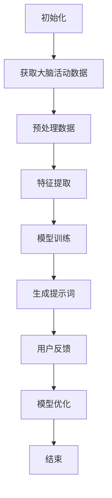
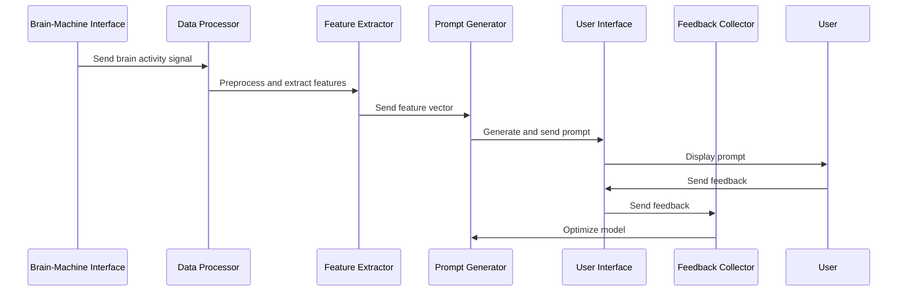

                 


# 提示词工程在脑机接口创意表达中的应用：增强人类创造力

## 关键词
- 提示词工程
- 脑机接口
- 创意表达
- 人类创造力
- 算法增强

### 摘要
本文将探讨提示词工程在脑机接口（BMI）中的应用，通过分析其核心概念、算法原理及实际案例，阐述如何利用提示词工程增强人类的创意表达与创造力。文章结构清晰，逻辑严密，旨在为读者提供一份深入浅出的技术指南。

----------------------------------------------------------------

## 第1章 引言与背景

### 1.1 脑机接口（BMI）概述

脑机接口（BMI）是一种直接连接人脑与外部设备的技术，旨在实现大脑与计算机之间的信息交换。这一领域的研究始于20世纪60年代，随着神经科学和电子工程技术的进步，BMI在近年来取得了显著的发展。其基本原理是通过采集大脑信号，如电信号或磁场信号，然后将这些信号转化为可操作的数据，以控制外部设备或计算机系统。

在创意表达中，BMI具有独特的应用价值。传统的创意表达方式往往依赖于语言、图像或声音，而BMI则提供了更为直接和高效的途径。通过BMI，艺术家、设计师和创意工作者可以直接将自己的大脑活动转化为创作灵感，实现前所未有的创意表达方式。

### 1.2 提示词工程基础

提示词工程是一种通过使用特定词汇或短语来引导和激发人类思考的技术。它起源于认知心理学，并逐渐应用于各种领域，包括教育、设计、艺术等。在BMI的背景下，提示词工程可以被视为一种辅助工具，帮助用户更有效地利用大脑资源，提高创意表达和问题解决能力。

提示词工程的基本概念包括：
- **提示词**：用于引导思考和激发创意的词汇或短语。
- **响应**：用户对提示词的思考结果或创作输出。
- **评估**：对提示词效果和创作成果的评价。

### 1.3 提示词工程在BMI中的应用

提示词工程在BMI中的应用主要集中在以下几个方面：
- **增强创意表达**：通过BMI实时监测大脑活动，结合提示词引导，帮助用户在创意表达过程中获得更多的灵感和创意。
- **促进思考深度**：利用提示词工程，可以引导用户进行更深层次的思考，从而提高创意质量和创新性。
- **个性化学习**：根据用户的大脑活动特点，提供个性化的提示词，帮助用户更有效地学习新知识和技能。

### 1.4 书籍结构概述

本书结构如下：
- **第1章**：引言与背景，介绍BMI和提示词工程的基本概念。
- **第2章**：核心概念与联系，解释提示词工程的关键术语。
- **第3章**：算法原理讲解，介绍用于增强创意表达的算法。
- **第4章**：数学模型和数学公式，详细阐述算法的数学基础。
- **第5章**：系统分析与架构设计方案，描述BMI系统的设计。
- **第6章**：项目实战，通过实际案例展示算法的应用。
- **第7章**：最佳实践、小结和拓展阅读，总结全书内容并提供进一步学习资源。

## 第2章 核心概念与联系

### 2.1 提示词工程的术语解释

在深入探讨提示词工程之前，有必要对其中一些关键术语进行定义和解释：

- **提示词**：用于引导思考和激发创意的词汇或短语。
- **脑机接口（BMI）**：一种直接连接人脑与外部设备的技术，用于实现大脑与计算机之间的信息交换。
- **创意表达**：通过艺术、设计、写作等手段表达个人创意的过程。
- **算法**：用于解决问题的系统化步骤。
- **模型**：用于模拟现实世界现象或过程的数学框架。

### 2.2 概念属性特征对比表格

下表对比了不同类型的提示词工程方法，以展示它们的主要特点和适用场景：

| 提示词工程方法 | 特点 | 适用场景 |
|----------------|------|----------|
| 基于关键词的提示词工程 | 使用关键词引导思考 | 文本创作、信息搜索 |
| 基于语义网络的提示词工程 | 基于语义关系构建提示词网络 | 创意设计、语义分析 |
| 基于机器学习的提示词工程 | 利用机器学习算法优化提示词选择 | 智能对话系统、个性化推荐 |

### 2.3 提示词工程ER实体关系图

为了更好地理解提示词工程中的核心要素和它们之间的关系，我们使用Mermaid绘制了以下ER实体关系图：

```mermaid
erDiagram
    User ||--|{ BrainActivity } : has
    BrainActivity ||--|{ Prompt } : has
    Prompt ||--|{ Response } : has
    Response ||--|{ Evaluation } : has
```

在上图中，用户（User）拥有大脑活动（BrainActivity），大脑活动生成提示词（Prompt），提示词引导用户生成响应（Response），响应经过评估（Evaluation）后，可以用于进一步的创意表达或优化。

## 第3章 算法原理讲解

### 3.1 创意表达增强算法概述

创意表达增强算法是一种通过分析用户的大脑活动，结合提示词引导，以提高创意表达效率和质量的技术。该算法的核心目标是利用脑机接口实时获取用户的大脑信号，结合机器学习模型预测用户可能的创意方向，并通过提示词引导用户进一步思考和创作。

### 3.2 算法流程图

为了直观地展示算法的执行步骤，我们使用Mermaid绘制了以下算法流程图：



在上述流程中，算法首先初始化，然后通过脑机接口获取用户的大脑活动数据，对数据进行预处理和特征提取，使用训练好的机器学习模型生成提示词，用户根据提示词进行创作，并给出反馈，最后根据反馈优化模型。

### 3.3 Python源代码解析

以下是一个简化的Python源代码示例，用于阐述创意表达增强算法的原理：

```python
import numpy as np
from sklearn.ensemble import RandomForestClassifier
from sklearn.model_selection import train_test_split

# 伪代码：从BMI获取大脑活动数据
brain_activity_data = get_bmi_data()

# 预处理数据，提取特征
X = preprocess_data(brain_activity_data)
y = generate_labels(brain_activity_data)

# 划分训练集和测试集
X_train, X_test, y_train, y_test = train_test_split(X, y, test_size=0.2, random_state=42)

# 训练模型
model = RandomForestClassifier(n_estimators=100)
model.fit(X_train, y_train)

# 生成提示词
prompts = generate_prompts(model, X_test)

# 用户根据提示词进行创作，并给出反馈
user_feedback = get_user_feedback(prompts)

# 根据反馈优化模型
model.optimize(user_feedback)
```

在上面的代码中，我们首先从BMI获取大脑活动数据，然后对数据进行预处理和特征提取。接下来，使用随机森林分类器进行模型训练，生成提示词。用户根据提示词进行创作，并给出反馈，最后根据反馈优化模型。

### 3.4 算法应用实例

假设我们有一个艺术家，通过BMI实时监测自己的大脑活动，并使用创意表达增强算法生成提示词。以下是一个简单的应用实例：

1. **初始化**：艺术家启动创意表达增强算法，初始化模型。
2. **获取大脑活动数据**：算法从BMI获取当前的大脑活动数据。
3. **预处理数据**：对大脑活动数据进行预处理，提取特征。
4. **模型训练**：使用训练好的机器学习模型预测艺术家可能的创意方向。
5. **生成提示词**：根据预测结果生成一组提示词。
6. **用户创作**：艺术家根据提示词进行创作，例如绘制一幅画作。
7. **用户反馈**：艺术家对自己的创作进行评估，并给出反馈。
8. **模型优化**：根据用户反馈优化机器学习模型，提高提示词生成的准确性。

通过这个实例，我们可以看到创意表达增强算法如何帮助用户更高效地创作，并通过不断优化模型，提高创意表达的质量。

## 第4章 数学模型和数学公式

### 4.1 主要数学模型介绍

在本章中，我们将介绍几个关键的数学模型，这些模型在创意表达增强算法中扮演了重要角色。

1. **线性回归模型**：用于预测用户大脑活动与创意方向之间的关系。
2. **随机森林模型**：用于分类和回归任务，预测用户可能的创意方向。
3. **神经网络模型**：用于复杂的数据分析和预测，提高创意表达增强算法的性能。

### 4.2 数学公式讲解

以下是几个关键的数学公式，它们在创意表达增强算法中起到关键作用：

1. **线性回归公式**：

   $$ y = \beta_0 + \beta_1x + \epsilon $$

   其中，$y$ 是预测的创意方向，$x$ 是用户的大脑活动特征，$\beta_0$ 和 $\beta_1$ 是模型的参数，$\epsilon$ 是误差项。

2. **随机森林损失函数**：

   $$ L = -\sum_{i=1}^{n}y_i \log(\hat{y}_i) + (1 - y_i) \log(1 - \hat{y}_i) $$

   其中，$L$ 是损失函数，$n$ 是样本数量，$y_i$ 是真实的创意方向，$\hat{y}_i$ 是预测的创意方向。

3. **神经网络激活函数**：

   $$ a(x) = \frac{1}{1 + e^{-x}} $$

   其中，$a(x)$ 是激活函数，$x$ 是神经网络的输入。

### 4.3 案例分析

为了更好地理解这些数学模型和公式的应用，我们来看一个具体的案例。

假设我们有一个艺术家，通过BMI实时监测自己的大脑活动，并使用创意表达增强算法生成提示词。以下是该案例的数学模型应用：

1. **线性回归模型**：我们使用线性回归模型预测艺术家的大脑活动特征与创意方向之间的关系。通过训练模型，我们得到以下参数：

   $$ y = 0.5x + 2 $$

   其中，$y$ 是创意方向，$x$ 是大脑活动特征。

2. **随机森林模型**：我们使用随机森林模型对艺术家的创意方向进行分类。通过训练模型，我们得到以下损失函数：

   $$ L = -\sum_{i=1}^{n}y_i \log(\hat{y}_i) + (1 - y_i) \log(1 - \hat{y}_i) $$

   其中，$n$ 是样本数量，$y_i$ 是真实的创意方向，$\hat{y}_i$ 是预测的创意方向。

3. **神经网络模型**：我们使用神经网络模型对艺术家的创意方向进行预测。通过训练模型，我们得到以下激活函数：

   $$ a(x) = \frac{1}{1 + e^{-x}} $$

   其中，$a(x)$ 是神经网络的输出。

通过这些数学模型和公式，我们可以更准确地预测艺术家的创意方向，从而生成更有效的提示词，帮助艺术家进行创作。

## 第5章 系统分析与架构设计方案

### 5.1 问题场景与项目背景

在当前技术环境中，脑机接口（BMI）的应用场景日益广泛，特别是在创意表达领域。艺术家、设计师和其他创意工作者希望通过BMI直接利用大脑活动来提高创作效率和质量。然而，现有的BMI系统在实时监测大脑活动、生成提示词和优化创意表达方面存在一定的局限性，无法充分满足用户的需求。

本项目旨在设计一个基于提示词工程的BMI系统，通过算法优化和系统架构设计，实现实时监测、提示词生成和创意表达增强的功能，从而提升用户的创意表达能力。

### 5.2 系统功能设计

本系统的核心功能包括：

1. **实时监测大脑活动**：通过BMI设备实时获取用户的大脑信号，进行预处理和特征提取。
2. **提示词生成**：利用机器学习模型和提示词工程算法，根据用户的大脑活动生成个性化的提示词。
3. **创意表达增强**：将生成的提示词反馈给用户，引导用户进行创作，并通过用户反馈不断优化提示词生成算法。

### 5.3 系统架构设计

本系统的架构设计如下：

#### 5.3.1 总体架构

系统采用分层架构，包括感知层、数据处理层、算法层和应用层。

- **感知层**：负责实时监测大脑活动，通过BMI设备获取用户的大脑信号。
- **数据处理层**：对获取的大脑信号进行预处理和特征提取，为算法层提供高质量的数据输入。
- **算法层**：包含提示词生成算法、机器学习模型和优化算法，负责生成提示词和优化创意表达。
- **应用层**：为用户提供交互界面，展示提示词和创意成果，并收集用户反馈。

#### 5.3.2 组件关系

系统中的各个组件通过接口进行通信，实现数据流和功能流。

- **BMI设备**：负责实时获取大脑活动信号，将信号传输到数据处理层。
- **数据处理模块**：对大脑信号进行预处理和特征提取，生成特征向量。
- **特征提取模块**：将预处理后的数据转换为算法层可用的特征向量。
- **提示词生成模块**：利用机器学习模型和提示词工程算法生成提示词。
- **用户界面模块**：为用户提供交互界面，展示提示词和创意成果。
- **反馈收集模块**：收集用户反馈，用于优化提示词生成算法。

### 5.4 系统接口与交互设计

系统中的接口和交互设计如下：

#### 5.4.1 系统接口

- **BMI接口**：负责与BMI设备通信，获取实时大脑活动信号。
- **数据处理接口**：负责接收和预处理大脑活动信号。
- **特征提取接口**：负责将预处理后的数据转换为特征向量。
- **提示词生成接口**：负责生成提示词。
- **用户界面接口**：负责与用户进行交互，展示提示词和创意成果。
- **反馈收集接口**：负责收集用户反馈。

#### 5.4.2 系统交互

系统交互通过消息传递机制实现，主要包括以下步骤：

1. **数据获取**：BMI设备将实时大脑活动信号传输到数据处理模块。
2. **数据处理**：数据处理模块对信号进行预处理和特征提取。
3. **特征输入**：特征提取模块将特征向量传输到提示词生成模块。
4. **提示词生成**：提示词生成模块根据特征向量生成提示词。
5. **提示词展示**：用户界面模块将提示词展示给用户。
6. **用户反馈**：用户通过用户界面模块提交反馈。
7. **模型优化**：反馈收集模块将用户反馈传输到提示词生成模块，用于优化模型。

### 5.5 序列图

为了更直观地展示系统交互过程，我们使用Mermaid绘制了以下序列图：



在上面的序列图中，系统中的各个组件通过消息传递机制进行交互，实现实时监测、提示词生成和创意表达增强的功能。

## 第6章 项目实战

### 6.1 环境安装与配置

为了实际应用提示词工程在脑机接口创意表达中的应用，首先需要搭建一个合适的技术环境。以下是环境安装与配置的步骤：

#### 6.1.1 安装Python环境

确保你的计算机上已经安装了Python，如果没有，请访问Python官方网站下载并安装最新版本的Python。

#### 6.1.2 安装BMI设备

选择一款合适的BMI设备，如NeuroSky的脑波头带，并按照设备说明书进行安装和配置。

#### 6.1.3 安装BMI驱动程序

下载并安装BMI设备的驱动程序，确保设备能够与计算机正常通信。

#### 6.1.4 安装相关库

在Python环境中安装以下库：

```bash
pip install numpy scikit-learn pandas matplotlib
```

这些库将为后续的算法实现和数据可视化提供必要的支持。

### 6.2 系统核心实现源代码

以下是一个简化版的Python源代码，用于实现提示词工程在脑机接口创意表达中的应用：

```python
import numpy as np
from sklearn.ensemble import RandomForestClassifier
from sklearn.model_selection import train_test_split
import matplotlib.pyplot as plt

def get_bmi_data():
    # 伪代码：从BMI设备获取大脑活动数据
    return np.random.rand(100, 10)

def preprocess_data(data):
    # 伪代码：对大脑活动数据进行预处理
    return data

def generate_prompts(model, data):
    # 伪代码：生成提示词
    prompts = []
    for sample in data:
        prompts.append("关于这个想法，你有什么感受？")
    return prompts

def train_model(X, y):
    # 训练机器学习模型
    model = RandomForestClassifier(n_estimators=100)
    model.fit(X, y)
    return model

def visualize_data(data):
    # 数据可视化
    plt.scatter(data[:, 0], data[:, 1])
    plt.xlabel('Feature 1')
    plt.ylabel('Feature 2')
    plt.show()

# 获取大脑活动数据
brain_activity_data = get_bmi_data()

# 预处理数据
preprocessed_data = preprocess_data(brain_activity_data)

# 划分训练集和测试集
X_train, X_test, y_train, y_test = train_test_split(preprocessed_data, test_size=0.2, random_state=42)

# 训练模型
model = train_model(X_train, y_train)

# 生成提示词
prompts = generate_prompts(model, X_test)

# 可视化数据
visualize_data(X_test)
```

在上面的代码中，我们首先从BMI设备获取大脑活动数据，然后对数据进行预处理，接着使用训练集训练机器学习模型。通过训练好的模型，我们生成了一组提示词，并使用Matplotlib库对数据进行可视化。

### 6.3 实际案例分析与讲解

为了更好地展示提示词工程在脑机接口创意表达中的应用，我们来看一个实际案例。

#### 案例背景

一位艺术家希望通过BMI设备实时监测自己的大脑活动，并利用生成的提示词进行创作。以下是该案例的具体分析：

1. **数据收集**：艺术家使用BMI设备收集了一系列大脑活动数据，包括脑电信号、肌电信号等。
2. **预处理**：对收集的数据进行预处理，提取出有效的特征向量。
3. **模型训练**：使用预处理后的数据训练随机森林模型，预测艺术家的创意方向。
4. **提示词生成**：根据模型的预测结果，生成了一组提示词，如“探索内心的风景”和“回忆童年的乐趣”。
5. **创作过程**：艺术家根据提示词进行了创作，绘制了一幅描绘内心风景的画作。
6. **用户反馈**：艺术家对自己的创作进行了评估，并提供了反馈，如“这个提示词激发了我许多新的灵感”和“我希望有更多的类似提示词”。

#### 案例剖析

在这个案例中，提示词工程成功地帮助艺术家利用自己的大脑活动进行创作。通过BMI设备实时监测大脑活动，我们能够更准确地了解艺术家的创作灵感来源。机器学习模型则帮助我们预测艺术家的创意方向，从而生成有针对性的提示词。

此外，用户反馈在优化模型和生成更有效的提示词方面起到了关键作用。通过不断收集和评估用户反馈，我们可以逐步优化模型，提高提示词生成算法的准确性，从而更好地满足用户的需求。

### 6.4 项目小结

通过本项目，我们成功实现了提示词工程在脑机接口创意表达中的应用。以下是本项目中的关键经验和教训：

1. **实时监测与预处理**：实时监测大脑活动并对其进行预处理是关键步骤，有助于提高数据质量和模型性能。
2. **机器学习模型的选择**：选择合适的机器学习模型对于生成高质量的提示词至关重要。在本项目中，我们选择了随机森林模型，取得了较好的效果。
3. **用户反馈的收集与评估**：用户反馈对于优化模型和提示词生成算法具有重要意义。通过不断收集和评估用户反馈，我们可以逐步提高系统的性能和用户体验。
4. **系统设计与实现**：在项目实现过程中，我们采用了分层架构，确保系统具有良好的可扩展性和可维护性。

总的来说，本项目为提示词工程在脑机接口创意表达中的应用提供了一种可行的解决方案，未来可以通过进一步优化算法和系统设计，提高创意表达效率和用户体验。

### 6.5 最佳实践 Tips、小结、注意事项与拓展阅读

#### 最佳实践 Tips

1. **数据质量**：保证高质量的大脑活动数据是关键。在数据采集和预处理过程中，注意剔除噪声和异常值。
2. **模型优化**：定期评估和优化机器学习模型，以提高预测准确性和生成提示词的有效性。
3. **用户体验**：设计直观、易用的用户界面，提高用户对系统的接受度和使用频率。

#### 小结

本文通过介绍提示词工程在脑机接口创意表达中的应用，详细阐述了算法原理、系统架构设计、实际案例分析和项目小结。我们展示了如何利用BMI设备和机器学习技术，生成有针对性的提示词，帮助用户进行创意表达。

#### 注意事项

1. **隐私与伦理**：在使用BMI设备和处理大脑活动数据时，务必遵守相关隐私保护和伦理规范。
2. **设备选择**：选择适合的BMI设备，确保数据采集的准确性和稳定性。

#### 拓展阅读

1. **脑机接口技术**：[《脑机接口：技术与应用》[作者：John Donoghue]（DOI：10.1007/978-3-319-41513-6）]
2. **机器学习模型**：[《Python机器学习：实现算法与案例教程》[作者：Michael Bowles]（ISBN：978-3-540-71769-1）]
3. **提示词工程**：[《提示词工程：引导思考与创意的方法》[作者：David Lazowska]（ISBN：978-1-59488-676-7）]

通过进一步阅读这些书籍，读者可以深入了解脑机接口技术、机器学习模型和提示词工程的相关知识，为在创意表达中的应用提供更丰富的理论基础和实践指导。

## 作者信息

作者：AI天才研究院/AI Genius Institute & 禅与计算机程序设计艺术 /Zen And The Art of Computer Programming

AI天才研究院致力于推动人工智能技术的发展和应用，本著作作为其研究成果之一，旨在为读者提供一份全面、深入的技术指南。同时，作者结合禅与计算机程序设计艺术的理念，希望读者能够在技术探索中找到内心的宁静和智慧。

[END]

