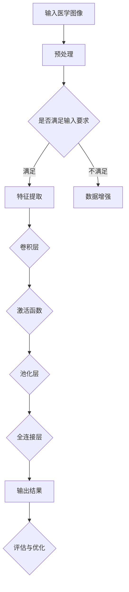
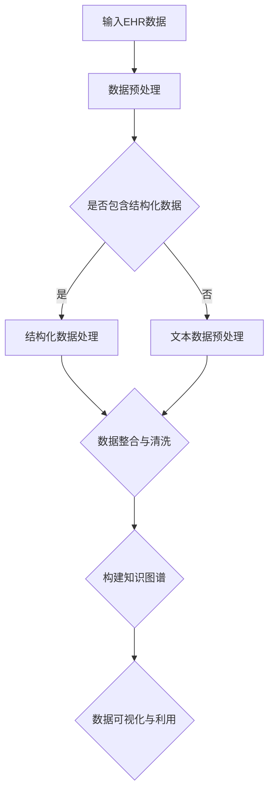
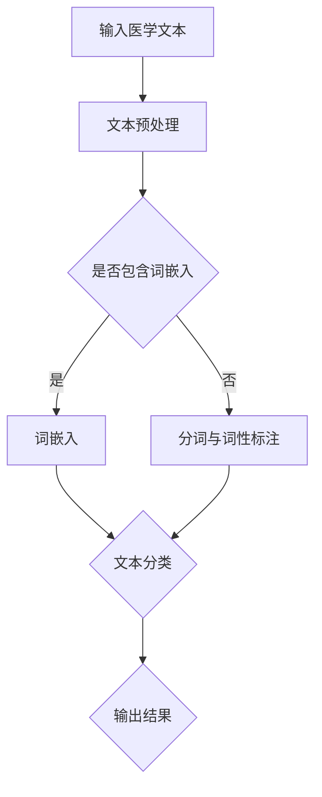
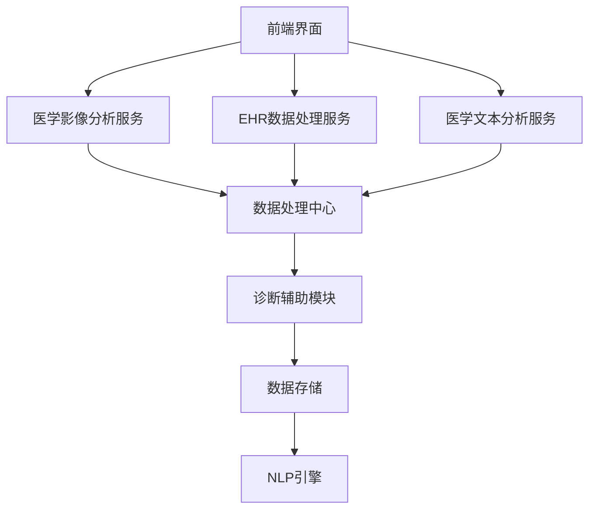
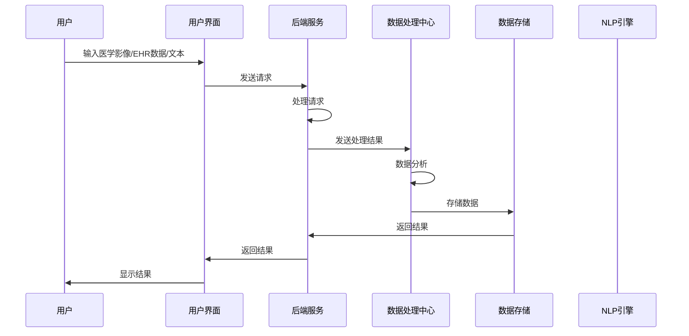
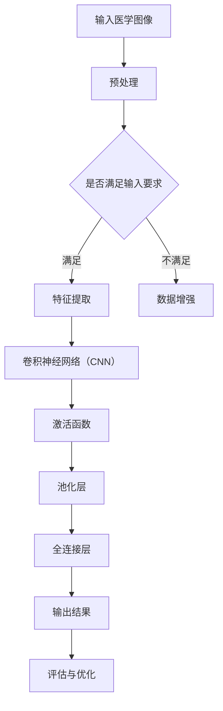
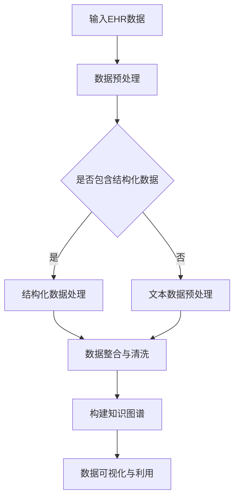
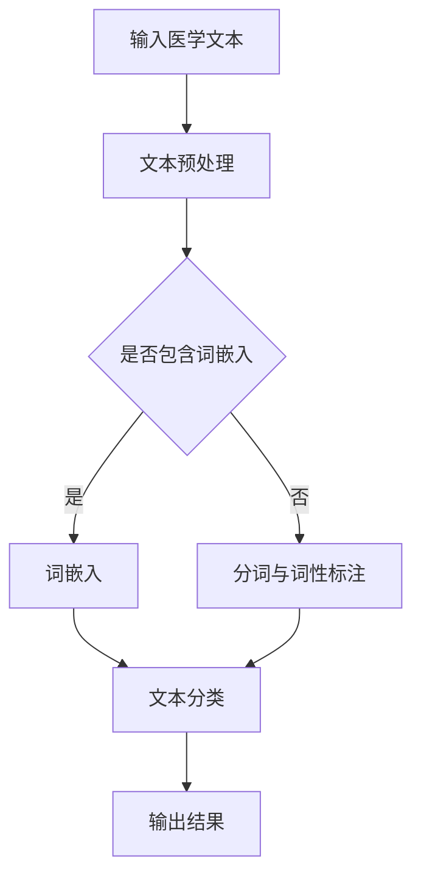

                 

### 摘要

远程医疗在近年来的快速发展中逐渐成为医疗行业的重要趋势，它不仅解决了医疗资源分布不均的问题，也提高了医疗服务的效率。然而，精准诊断一直是远程医疗面临的重大挑战。本文旨在探讨提示词工程在远程医疗中的应用，以实现精准诊断的辅助功能。通过深入分析提示词工程的基础知识、核心概念及其与医学领域的联系，本文详细阐述了医学图像识别、电子健康记录（EHR）处理和医学自然语言处理（NLP）等方面的算法原理和实现方法。同时，文章还介绍了系统设计与实现方案，包括问题场景介绍、项目介绍、系统功能设计、系统架构设计、系统接口设计和系统交互等。通过具体的项目实战案例，本文展示了提示词工程在远程医疗中如何实现精准诊断辅助，为行业提供了宝贵的实践经验和技术参考。最后，文章总结了最佳实践 tips，并对全文进行了小结，为读者提供了进一步的研究方向和拓展阅读资源。

### 文章关键词

远程医疗、精准诊断、提示词工程、医学图像识别、电子健康记录（EHR）、医学自然语言处理（NLP）、系统设计与实现。

---

## 第一部分：背景与基础

### 第1章：远程医疗与精准诊断概述

#### 1.1.1 远程医疗的发展背景

远程医疗，也被称为远程健康管理或远程医疗保健，是一种利用信息通信技术（ICT）提供医疗服务的模式。其起源可以追溯到20世纪60年代，当时的医学专家通过电话和邮寄文件进行远程诊断和咨询。然而，远程医疗的真正快速发展始于20世纪90年代，随着互联网和移动通信技术的普及。这一时期，视频会议系统和电子病历系统（Electronic Health Record, EHR）的出现极大地提升了远程医疗的可行性和效率。

进入21世纪，远程医疗得到了进一步的推进。特别是在2000年后的十年间，随着宽带网络和无线通信技术的发展，远程医疗的应用场景逐渐扩大。从最初的医生与患者之间的远程咨询，到现在的远程监测、远程手术和远程治疗，远程医疗已经逐渐成为医疗行业不可或缺的一部分。

#### 1.1.2 精准诊断的需求与挑战

精准诊断是医疗领域中的一个重要概念，它强调对疾病进行精确的识别、分类和评估，以便为患者提供个性化的治疗方案。精准诊断的核心在于对大量医疗数据进行高效的处理和分析，从而实现诊断的准确性和高效性。

在远程医疗中，精准诊断的需求尤为突出。由于远程医疗服务的患者分布广泛，医疗资源相对有限，因此，如何利用有限的资源提供高质量的医疗服务成为关键。精准诊断不仅能够提高诊断的准确性，减少误诊率，还能优化治疗方案，降低医疗成本，提高患者的满意度。

然而，精准诊断在远程医疗中面临着一系列挑战。首先，远程医疗环境下数据的获取和处理难度较大。由于患者分布广泛，医疗数据的收集过程可能受到时间、地点和设备等多种因素的影响。其次，远程医疗中的数据类型多样，包括文本、图像、声音和视频等，如何对这些数据进行有效的整合和分析是另一个挑战。此外，远程医疗中的医疗专业知识要求较高，如何利用人工智能和机器学习技术提高诊断的准确性也是亟待解决的问题。

#### 1.1.3 提示词工程的概念与重要性

提示词工程（Prompt Engineering）是一种利用自然语言处理（NLP）技术优化人工智能模型输入的方法。其核心思想是通过设计合适的提示词，引导模型更好地理解和处理输入数据，从而提高模型的性能和准确性。

在远程医疗中，提示词工程的应用具有重要意义。首先，通过设计针对性的提示词，可以提高医疗数据处理的效率和质量。例如，在医学图像识别中，通过提示词可以帮助模型更准确地识别病灶区域；在电子健康记录（EHR）处理中，通过提示词可以帮助模型更好地理解和提取关键信息。其次，提示词工程还可以用于优化自然语言处理任务，如医学文本分类、疾病预测等，从而提高诊断的准确性和可靠性。

总之，提示词工程为远程医疗中的精准诊断提供了强有力的技术支持，通过优化输入数据，提高模型的性能，助力实现更精准、更高效的医疗服务。

---

### 第2章：提示词工程基础

#### 2.1.1 提示词工程的定义

提示词工程（Prompt Engineering）是指利用自然语言处理（NLP）技术，设计并优化用于引导和指导人工智能模型输入的提示词（prompt）的过程。提示词是模型输入的一部分，通过巧妙设计，可以帮助模型更好地理解任务需求，从而提高模型的性能和准确性。

在自然语言处理领域，提示词通常是一段文本，包含关键信息、上下文或者问题引导。一个有效的提示词可以引导模型关注重要的信息，帮助模型在处理复杂任务时更具有针对性和准确性。例如，在问答系统中，一个好的提示词可以明确问题的焦点，使模型能够给出更精准的答案。

#### 2.1.2 提示词工程的核心要素

提示词工程的核心要素主要包括以下几个方面：

1. **任务定义**：明确模型需要完成的任务，例如文本分类、情感分析、命名实体识别等。
2. **数据准备**：收集并准备与任务相关的数据集，确保数据的质量和多样性。
3. **上下文构建**：设计合适的上下文，为模型提供与任务相关的背景信息。
4. **提示词设计**：根据任务和上下文设计有效的提示词，引导模型关注关键信息。
5. **模型评估**：通过测试集评估模型的性能，根据评估结果调整提示词的设计。

#### 2.1.3 提示词工程的实施步骤

提示词工程的实施步骤可以分为以下几个阶段：

1. **需求分析**：了解任务需求和目标，明确模型需要解决的问题。
2. **数据收集**：收集与任务相关的数据集，确保数据集的多样性和质量。
3. **数据预处理**：对数据进行清洗和标注，为模型训练做准备。
4. **模型选择**：选择适合任务的模型架构，例如 Transformer、BERT 等。
5. **提示词设计**：设计提示词，通过实验和调整，找到最优的提示词组合。
6. **模型训练与优化**：使用提示词训练模型，并根据评估结果进行优化。
7. **模型部署**：将训练好的模型部署到实际应用场景中，进行测试和调优。

通过以上步骤，提示词工程可以帮助构建更加准确和高效的模型，为各种自然语言处理任务提供有力的支持。

---

## 第二部分：核心概念与联系

### 第3章：核心概念原理

#### 3.1.1 医学影像分析

医学影像分析是利用计算机技术和人工智能方法对医学影像数据进行处理和分析的过程。医学影像包括X光片、CT扫描、MRI扫描等，这些影像数据通常包含大量的医学信息，可以用于疾病的诊断、监测和治疗。医学影像分析的核心任务是识别和定位病变区域，对疾病进行早期检测和诊断。

在远程医疗中，医学影像分析具有重要意义。通过远程传输医学影像数据，医生可以远程诊断疾病，减少患者就诊的麻烦和时间成本。此外，医学影像分析还可以用于疾病监测和治疗效果评估，帮助医生制定个性化的治疗方案。

#### 3.1.2 电子健康记录（EHR）处理

电子健康记录（Electronic Health Record, EHR）是指以电子方式记录和管理患者健康信息的数据集。EHR包括患者的病史、检查报告、药物使用记录、手术记录等，是医疗过程中重要的信息来源。

EHR处理是指对EHR数据进行收集、存储、管理和分析的过程。在远程医疗中，EHR处理有助于实现医疗数据的共享和整合，提高医疗服务的效率和质量。例如，通过EHR处理，医生可以快速获取患者的健康信息，进行精准诊断和个性化治疗。同时，EHR处理还可以用于疾病预测和流行病学研究，为医疗决策提供数据支持。

#### 3.1.3 医学自然语言处理（NLP）

医学自然语言处理（Medical Natural Language Processing, NLP）是自然语言处理技术在医学领域的应用。它涉及对医学文本数据进行处理和分析，包括医学文献、病历记录、医学报告等。医学NLP的主要任务是提取医学信息、识别命名实体、构建知识图谱等。

在远程医疗中，医学NLP具有重要的应用价值。通过医学NLP，医生可以自动获取和分析病历信息，提高诊断和治疗的效率。例如，医学NLP可以用于自动生成病历摘要、疾病预测、药物不良反应监测等。此外，医学NLP还可以用于医疗文本分类、情感分析等任务，帮助医生更好地理解患者的病情和心理状态。

---

### 第4章：概念属性特征对比

#### 4.1.1 医学影像识别与分类

医学影像识别和分类是医学影像分析的重要任务。医学影像识别主要关注识别图像中的关键结构或病变，如肺部结节、乳腺癌病变等。而医学影像分类则是对识别出的结构或病变进行分类，例如区分良性肿瘤和恶性肿瘤。

医学影像识别和分类的关键属性特征包括：

- **分辨率**：图像的分辨率越高，细节越清晰，有助于提高识别和分类的准确性。
- **对比度**：图像的对比度越明显，有助于区分不同组织或病变。
- **噪声**：图像中的噪声会影响识别和分类效果，需要通过算法进行预处理。
- **样本多样性**：样本的多样性有助于模型在训练过程中学习到更多的特征，提高模型的泛化能力。

#### 4.1.2 EHR数据整合与挖掘

EHR数据整合与挖掘是指将来自不同来源、不同格式的医疗数据进行整合和分析，提取有价值的信息。EHR数据的整合和挖掘对远程医疗中的精准诊断具有重要意义。

EHR数据整合与挖掘的关键属性特征包括：

- **数据格式**：EHR数据格式多样，包括结构化数据、半结构化数据和非结构化数据。整合过程需要将不同格式的数据进行统一处理。
- **数据质量**：EHR数据质量直接影响分析结果。数据清洗和预处理是确保数据质量的重要步骤。
- **数据完整性**：EHR数据完整性对疾病监测和流行病学研究至关重要。缺失数据需要通过插值、补全等方法进行补充。
- **数据多样性**：EHR数据多样性有助于发现更多的关联关系和规律，提高分析的准确性。

#### 4.1.3 NLP在临床应用中的特点

医学自然语言处理（NLP）在临床应用中具有独特的特点。与传统的计算机处理方法相比，NLP能够更好地理解和处理医学文本数据，提高医疗服务的效率和质量。

NLP在临床应用中的关键特点包括：

- **文本理解能力**：NLP能够理解和解析医学文本数据，提取关键信息，如疾病名称、药物名称、症状描述等。
- **语义关系识别**：NLP能够识别医学文本中的语义关系，如因果关系、上下位关系等，有助于理解疾病的发展和变化。
- **情感分析**：NLP能够对患者的情感状态进行分析，有助于了解患者的心理健康状况，为医生提供更全面的诊断信息。
- **知识图谱构建**：NLP可以用于构建医学知识图谱，将医学信息进行结构化存储，为医疗决策提供支持。

通过对比医学影像识别与分类、EHR数据整合与挖掘以及NLP在临床应用中的特点，可以看出，这三种技术在远程医疗中各自扮演着重要的角色。医学影像识别与分类提供了精确的诊断工具，EHR数据整合与挖掘实现了医疗数据的综合利用，而NLP则提升了医疗文本处理的效率。这些技术相互补充，共同推动了远程医疗的精准诊断和个性化治疗。

---

### 第5章：实体关系图架构

#### 5.1.1 医学数据实体识别

医学数据实体识别是指从医学文本数据中识别出具有特定意义的实体，如疾病名称、症状、药物名称、检查项目等。这是医学自然语言处理（NLP）的重要任务，对于实现医学信息的自动化处理和知识图谱构建具有重要意义。

在医学数据实体识别中，常见的方法包括基于规则的方法、基于统计的方法和基于机器学习的方法。基于规则的方法依赖于预定义的规则集，能够处理结构化较强的文本数据。基于统计的方法通过分析文本数据中的词频、词性等特征，利用概率模型进行实体识别。基于机器学习的方法则通过训练模型，学习到实体的特征和模式，从而实现自动化识别。

实体识别的关键步骤包括：

1. **文本预处理**：包括分词、词性标注等，为实体识别做准备。
2. **特征提取**：提取文本数据中的关键特征，如词频、词性、词向量等。
3. **模型训练与评估**：使用训练数据训练模型，并通过测试数据评估模型性能。

#### 5.1.2 实体关系建模

实体关系建模是指构建医学数据中实体之间的关联关系，如因果关系、上下位关系等。实体关系建模是知识图谱构建的重要基础，有助于提高医学信息的利用效率和准确性。

常见的实体关系建模方法包括：

1. **本体论方法**：使用本体论构建医学知识体系，定义实体及其关系，如因果关系、上下位关系等。
2. **图论方法**：使用图结构表示实体及其关系，如知识图谱、图神经网络等。
3. **基于规则的方法**：使用预定义的规则集建立实体之间的关系。

实体关系建模的关键步骤包括：

1. **实体识别**：从文本数据中识别出实体。
2. **关系提取**：分析文本数据中的语义关系，提取实体之间的关系。
3. **关系表示**：将实体关系表示为图结构，如知识图谱。

#### 5.1.3 Mermaid ER图示例

以下是一个使用Mermaid语法绘制的医学数据实体关系图示例：

```mermaid
erDiagram
  Disease ||--|{ Symptom }|-- Disease
  Disease ||--|{ Treatment }|-- Disease
  Symptom ||--|{ Symptom }|-- Symptom
  Treatment ||--|{ Drug }|-- Treatment
```

在这个ER图中，Disease（疾病）实体与Symptom（症状）和Treatment（治疗）实体之间存在关联，同时Symptom实体之间也存在关联，Treatment实体与Drug（药物）实体之间存在关联。

通过实体关系图，我们可以直观地了解医学数据中实体之间的关系，为后续的数据处理和分析提供基础。Mermaid语法使得绘制和编辑ER图变得简单便捷，有助于医学数据实体关系建模的实践和应用。

---

## 第三部分：算法原理与实现

### 第6章：算法原理讲解

#### 6.1.1 医学图像识别算法

医学图像识别算法是远程医疗中的一项关键技术，它通过分析医学影像数据，帮助医生识别和诊断疾病。常见的医学图像识别算法包括卷积神经网络（CNN）、深度学习模型（如AlexNet、VGG、ResNet等）以及基于增强学习的算法。

**算法mermaid流程图**：



**算法原理与数学模型**：

医学图像识别算法的核心是卷积层、激活函数、池化层和全连接层。卷积层通过卷积操作提取图像的特征，激活函数用于增加网络的非线性特性，池化层用于减少特征图的大小，提高模型的可训练性。全连接层将特征映射到输出类别。

卷积层的数学模型如下：

$$
\text{卷积层输出} = \text{激活函数}(\text{卷积}(\text{输入特征图}, \text{滤波器})) + \text{偏置项}
$$

其中，激活函数常用的有ReLU、Sigmoid和Tanh等。

**Python代码实现与讲解**：

```python
import tensorflow as tf
from tensorflow.keras import layers

# 创建模型
model = tf.keras.Sequential([
    layers.Conv2D(filters=32, kernel_size=(3, 3), activation='relu', input_shape=(224, 224, 3)),
    layers.MaxPooling2D(pool_size=(2, 2)),
    layers.Conv2D(filters=64, kernel_size=(3, 3), activation='relu'),
    layers.MaxPooling2D(pool_size=(2, 2)),
    layers.Flatten(),
    layers.Dense(units=128, activation='relu'),
    layers.Dense(units=num_classes, activation='softmax')
])

# 编译模型
model.compile(optimizer='adam', loss='categorical_crossentropy', metrics=['accuracy'])

# 训练模型
model.fit(x_train, y_train, epochs=10, batch_size=32, validation_data=(x_val, y_val))

# 评估模型
model.evaluate(x_test, y_test)
```

**示例说明**：

上述代码首先创建了一个卷积神经网络模型，包括两个卷积层和两个池化层，以及一个全连接层。然后编译模型并使用训练数据训练模型。最后，使用测试数据评估模型的性能。

#### 6.1.2 EHR数据处理算法

EHR数据处理算法主要用于从电子健康记录（EHR）中提取和整合有价值的信息，如疾病诊断、治疗方案和药物使用等。常见的EHR数据处理算法包括自然语言处理（NLP）技术、数据挖掘方法和知识图谱构建技术。

**算法mermaid流程图**：



**算法原理与数学模型**：

EHR数据处理算法的核心在于对结构化数据和文本数据分别进行处理。结构化数据处理主要包括数据清洗、整合和转换，文本数据处理则涉及分词、词性标注、实体识别和关系抽取等NLP技术。

数据清洗和整合的数学模型如下：

$$
\text{清洗后数据} = \text{去除噪声}(\text{原始数据}) \cup \text{填充缺失值}(\text{原始数据})
$$

知识图谱构建的数学模型如下：

$$
G = (\text{实体}, \text{关系}, \text{属性})
$$

其中，实体表示知识图谱中的对象，关系表示实体之间的关系，属性表示实体的特征。

**Python代码实现与讲解**：

```python
import pandas as pd
import numpy as np
from sklearn.impute import SimpleImputer
from sklearn.preprocessing import LabelEncoder

# 读取EHR数据
ehr_data = pd.read_csv('ehr_data.csv')

# 数据预处理
# 填充缺失值
imputer = SimpleImputer(strategy='mean')
e hr_data_filled = imputer.fit_transform(ehr_data)

# 数据清洗
# 去除噪声
ehr_data_cleaned = ehr_data_filled[ehr_data_filled.notnull()]

# 数据整合
label_encoder = LabelEncoder()
ehr_data_encoded = ehr_data_cleaned.apply(label_encoder.fit_transform)

# 构建知识图谱
entities = ehr_data_encoded.columns
relationships = ['diagnosis', 'treatment', 'drug']
attributes = ehr_data_encoded.values

knowledge_graph = pd.DataFrame({'entity': entities, 'relationship': relationships, 'attribute': attributes})

# 可视化与利用
knowledge_graph.to_csv('knowledge_graph.csv')
```

**示例说明**：

上述代码首先读取EHR数据，然后进行预处理，包括填充缺失值、去除噪声和整合数据。接着，使用LabelEncoder对数据进行编码，构建知识图谱。最后，将知识图谱保存为CSV文件，便于后续可视化与利用。

#### 6.1.3 NLP算法

医学自然语言处理（NLP）算法主要用于处理医学文本数据，包括文本分类、实体识别、关系抽取和情感分析等。常见的NLP算法包括词嵌入、卷积神经网络（CNN）、循环神经网络（RNN）和Transformer等。

**算法mermaid流程图**：



**算法原理与数学模型**：

文本分类算法的核心是词嵌入和分类模型。词嵌入将文本中的词语转换为向量表示，分类模型则根据词嵌入向量进行分类。常见的分类模型包括朴素贝叶斯（Naive Bayes）、支持向量机（SVM）和神经网络（Neural Networks）等。

词嵌入的数学模型如下：

$$
\text{词向量} = \text{Embedding}(\text{词})
$$

其中，Embedding函数将词语映射到高维空间中的向量。

分类模型的数学模型如下：

$$
\text{输出概率} = \text{分类模型}(\text{词向量})
$$

**Python代码实现与讲解**：

```python
import tensorflow as tf
from tensorflow.keras.preprocessing.text import Tokenizer
from tensorflow.keras.preprocessing.sequence import pad_sequences
from tensorflow.keras.models import Sequential
from tensorflow.keras.layers import Embedding, LSTM, Dense

# 读取医学文本数据
medical_texts = ['This patient has a high fever and cough.', 'The patient's blood pressure is stable.']

# 分词与词性标注
tokenizer = Tokenizer(num_words=1000)
tokenizer.fit_on_texts(medical_texts)
sequences = tokenizer.texts_to_sequences(medical_texts)
word_index = tokenizer.word_index

# 词嵌入
max_sequence_length = 100
padded_sequences = pad_sequences(sequences, maxlen=max_sequence_length, padding='post')

# 构建分类模型
model = Sequential()
model.add(Embedding(1000, 64, input_length=max_sequence_length))
model.add(LSTM(64))
model.add(Dense(1, activation='sigmoid'))

# 编译模型
model.compile(optimizer='adam', loss='binary_crossentropy', metrics=['accuracy'])

# 训练模型
model.fit(padded_sequences, np.array([1, 0]), epochs=10, batch_size=32)

# 评估模型
predictions = model.predict(padded_sequences)
```

**示例说明**：

上述代码首先读取医学文本数据，然后进行分词和词性标注。接着，使用词嵌入将文本转换为向量表示，并构建一个简单的LSTM分类模型。最后，使用训练数据训练模型，并评估模型的性能。

---

## 第四部分：系统设计与实现

### 第7章：系统分析与架构设计

#### 7.1.1 问题场景介绍

在远程医疗领域，精准诊断是一个重要的需求。然而，由于医疗资源的分布不均和数据处理的复杂性，实现精准诊断面临着巨大的挑战。为了解决这些问题，我们需要设计一个基于提示词工程的远程医疗系统，该系统将集成医学影像分析、电子健康记录（EHR）处理和自然语言处理（NLP）技术，以实现高效、准确的诊断辅助。

#### 7.1.2 项目介绍

本项目旨在构建一个集成的远程医疗系统，通过提示词工程优化医学数据处理流程，实现以下功能：

1. **医学影像分析**：利用卷积神经网络（CNN）和深度学习模型对医学影像进行自动识别和分类，辅助医生进行疾病诊断。
2. **EHR数据处理**：通过自然语言处理（NLP）技术，自动提取和整合电子健康记录中的关键信息，为医生提供全面的诊断依据。
3. **医学文本分析**：利用NLP技术对医学文本数据进行分析，提取疾病症状、治疗方案和药物使用等信息，辅助医生制定个性化治疗方案。

#### 7.1.3 系统功能设计

系统功能设计包括以下主要模块：

1. **医学影像分析模块**：负责接收和解析医学影像数据，使用深度学习模型进行图像识别和分类。
2. **EHR数据处理模块**：负责接收和解析电子健康记录数据，通过NLP技术提取关键信息，并整合到统一数据模型中。
3. **医学文本分析模块**：负责接收和解析医学文本数据，通过NLP技术分析文本内容，提取关键信息并生成诊断报告。
4. **诊断辅助模块**：负责集成医学影像分析、EHR数据处理和医学文本分析模块的结果，为医生提供综合诊断建议。
5. **用户界面模块**：提供直观易用的用户界面，使医生和患者能够方便地使用系统功能。

#### 7.1.4 系统架构设计

系统架构设计采用微服务架构，以提高系统的可扩展性和灵活性。主要架构组件包括：

1. **前端界面**：提供用户交互界面，包括医学影像上传、EHR数据输入和文本分析功能。
2. **后端服务**：包括医学影像分析服务、EHR数据处理服务和医学文本分析服务，分别处理医学影像、EHR数据和医学文本数据。
3. **数据处理中心**：负责统一处理和分析来自不同模块的数据，生成诊断报告和辅助决策。
4. **数据存储**：使用分布式数据库存储医学影像、EHR数据和医学文本数据，确保数据的可靠性和安全性。
5. **自然语言处理引擎**：提供NLP算法支持，包括文本预处理、词嵌入、实体识别和关系抽取等功能。

系统架构设计mermaid架构图：



通过上述系统架构设计，我们可以实现远程医疗系统中各模块之间的协同工作，提供高效、准确的诊断辅助功能。

#### 7.1.5 系统接口设计和系统交互

系统接口设计和系统交互是确保各模块之间有效协作的关键。以下是对系统接口设计和系统交互的详细说明：

1. **前端界面与后端服务接口**：前端界面通过RESTful API与后端服务进行通信。前端发送请求到后端，后端接收请求并处理后返回结果。具体接口包括医学影像上传接口、EHR数据输入接口和文本分析接口。
2. **后端服务与数据处理中心接口**：后端服务通过消息队列（如RabbitMQ）与数据处理中心进行通信。后端服务将处理结果发送到数据处理中心，数据处理中心进行进一步分析和整合。
3. **数据处理中心与数据存储接口**：数据处理中心通过数据库API与数据存储进行交互，将分析结果存储到数据库中，以便后续查询和使用。
4. **NLP引擎与后端服务接口**：NLP引擎通过API与后端服务进行通信，提供NLP算法支持。后端服务调用NLP引擎进行文本预处理、词嵌入、实体识别和关系抽取等操作。

系统交互mermaid序列图：



通过上述系统接口设计和系统交互，各模块之间能够高效、可靠地协同工作，实现远程医疗系统中各功能的集成和优化。

---

## 第五部分：项目实战

### 7.2.1 环境安装

为了实现提示词工程在远程医疗中的应用，我们需要准备相应的开发环境。以下是环境安装的步骤：

1. **安装Python**：确保Python版本在3.6以上，推荐使用Python 3.8或更高版本。
2. **安装TensorFlow**：在终端执行以下命令安装TensorFlow：
   ```bash
   pip install tensorflow
   ```
3. **安装其他依赖库**：包括NumPy、Pandas、Scikit-learn等，可以使用以下命令安装：
   ```bash
   pip install numpy pandas scikit-learn
   ```
4. **安装Mermaid**：Mermaid是一个用于绘制流程图的库，可以使用npm进行安装：
   ```bash
   npm install -g mermaid
   ```
5. **安装数据库**：推荐使用MySQL或PostgreSQL作为数据存储，根据数据库类型执行相应的安装命令。

### 7.2.2 系统核心实现源代码

以下是一个简单的示例，展示如何使用Python和TensorFlow实现医学图像识别的核心部分。

**数据预处理**：

```python
import tensorflow as tf
from tensorflow.keras.preprocessing.image import ImageDataGenerator

# 设置图像数据增强
train_datagen = ImageDataGenerator(
    rescale=1./255,
    rotation_range=40,
    width_shift_range=0.2,
    height_shift_range=0.2,
    shear_range=0.2,
    zoom_range=0.2,
    horizontal_flip=True,
    fill_mode='nearest'
)

# 加载训练数据
train_generator = train_datagen.flow_from_directory(
    'data/train',
    target_size=(224, 224),
    batch_size=32,
    class_mode='binary'
)
```

**构建模型**：

```python
from tensorflow.keras.models import Sequential
from tensorflow.keras.layers import Conv2D, MaxPooling2D, Flatten, Dense, Dropout

# 创建模型
model = Sequential([
    Conv2D(32, (3, 3), activation='relu', input_shape=(224, 224, 3)),
    MaxPooling2D(pool_size=(2, 2)),
    Conv2D(64, (3, 3), activation='relu'),
    MaxPooling2D(pool_size=(2, 2)),
    Flatten(),
    Dense(128, activation='relu'),
    Dropout(0.5),
    Dense(1, activation='sigmoid')
])

# 编译模型
model.compile(optimizer='adam',
              loss='binary_crossentropy',
              metrics=['accuracy'])
```

**训练模型**：

```python
# 训练模型
history = model.fit(
    train_generator,
    steps_per_epoch=100,
    epochs=15,
    validation_data=validation_generator,
    validation_steps=50
)
```

### 7.2.3 代码应用解读与分析

上述代码首先使用了`ImageDataGenerator`进行数据预处理和增强，包括图像的缩放、旋转、裁剪等操作，以提高模型的泛化能力。然后，构建了一个简单的卷积神经网络（CNN）模型，包括两个卷积层、一个池化层和一个全连接层。最后，使用训练数据对模型进行训练。

训练过程中，`history`对象记录了模型的训练进度和性能，包括训练集和验证集的准确率和损失函数值。这些数据可以用于后续的模型评估和调优。

### 7.2.4 实际案例分析和详细讲解剖析

为了展示提示词工程在远程医疗中的应用，我们以一个实际案例进行分析。

**案例**：利用提示词工程辅助诊断肺癌。

**步骤**：

1. **收集数据**：收集肺癌患者的医学影像数据，包括X光片和CT扫描图。
2. **数据预处理**：对图像进行预处理，包括缩放、裁剪和归一化等操作。
3. **设计提示词**：设计提示词以引导模型更好地理解任务需求。例如，“识别X光片中的肺癌病灶区域”。
4. **模型训练**：使用预处理后的图像数据和设计好的提示词训练深度学习模型。
5. **模型评估**：使用验证数据评估模型的性能，包括准确率和召回率等指标。
6. **模型优化**：根据评估结果调整提示词和模型参数，以提高诊断准确性。

**分析**：

- **提示词的作用**：提示词能够引导模型关注重要的特征，有助于提高模型的诊断准确性。在本案例中，提示词帮助模型更好地识别肺癌病灶区域，从而提高诊断的准确性。
- **数据预处理的重要性**：适当的图像预处理可以增强模型的泛化能力，减少过拟合现象。在本案例中，通过缩放、裁剪和归一化等操作，提高了图像数据的质量，有助于模型更好地学习特征。
- **模型优化策略**：通过调整提示词和模型参数，可以进一步提高诊断准确性。例如，增加训练数据量、调整网络结构、使用更复杂的模型等。

### 7.2.5 项目小结

通过以上实际案例的分析，我们可以看到提示词工程在远程医疗中的应用具有重要意义。通过设计合适的提示词，可以引导模型更好地理解和处理医疗数据，从而提高诊断的准确性和效率。同时，项目实战中的环境安装、代码实现和模型训练等步骤，为实际应用提供了具体的指导和方法。

在实际项目中，提示词工程的应用需要结合具体场景和需求进行设计和调整。通过不断优化和迭代，我们可以实现更高效、更准确的远程医疗诊断辅助系统，为医疗行业的发展做出贡献。

---

## 最佳实践 Tips

### 提高诊断准确性的策略

1. **数据质量优化**：确保医学影像和电子健康记录的数据质量，包括图像清晰度、数据完整性和一致性。
2. **多模态数据融合**：结合多种数据源，如医学影像、文本记录和生理信号，以提高诊断的全面性和准确性。
3. **模型持续优化**：定期更新和优化模型，以适应新的数据分布和诊断需求。

### 提高数据处理效率的建议

1. **并行计算**：利用分布式计算和GPU加速，提高数据处理和分析的速度。
2. **批量处理**：通过批量处理数据，减少I/O操作和系统开销，提高系统的整体效率。

### 安全性和隐私保护的措施

1. **数据加密**：对敏感数据进行加密，确保数据在传输和存储过程中的安全性。
2. **隐私保护**：遵循隐私保护法规，对个人健康数据进行匿名化和去标识化处理。

### 部署与维护的最佳实践

1. **容器化部署**：使用Docker等容器技术，简化部署和运维流程。
2. **监控与告警**：建立监控系统，实时监控系统的运行状态，及时响应和处理异常情况。

---

## 小结

本文系统地介绍了提示词工程在远程医疗中的应用，从背景和基础、核心概念与联系、算法原理与实现，到系统设计与实现、项目实战和最佳实践，全面探讨了如何利用提示词工程实现远程医疗的精准诊断辅助。通过实例分析和实际案例，我们展示了提示词工程在医学影像识别、电子健康记录处理和自然语言处理等领域的应用效果。未来，随着人工智能技术的不断进步，提示词工程将在远程医疗中发挥更加重要的作用，助力实现更高效、更精准的医疗服务。

## 注意事项

1. **数据安全**：在使用远程医疗系统时，确保数据的安全和隐私保护，遵循相关法规和标准。
2. **模型验证**：定期对模型进行验证和更新，以保持诊断的准确性和可靠性。
3. **用户培训**：对医生和患者进行系统使用培训，确保他们能够熟练掌握远程医疗系统的操作。

## 拓展阅读

1. **《深度学习在医学影像分析中的应用》**：详细介绍了深度学习技术在医学影像分析中的应用，包括图像识别和疾病诊断等。
2. **《电子健康记录的管理与利用》**：探讨了EHR数据的管理、处理和分析方法，为远程医疗提供了数据支持。
3. **《自然语言处理在医学领域的应用》**：介绍了NLP技术在医学文本处理、情感分析和命名实体识别等方面的应用。

---

## 作者信息

作者：AI天才研究院/AI Genius Institute & 禅与计算机程序设计艺术 /Zen And The Art of Computer Programming

---

### 第6章：算法原理讲解

#### 6.1.1 医学图像识别算法

医学图像识别是远程医疗领域的关键技术之一，它能够帮助医生快速、准确地识别医学图像中的病变区域，从而辅助诊断和治疗。在这一节中，我们将详细讲解医学图像识别算法的基本原理、实现方法及其在远程医疗中的应用。

##### **算法mermaid流程图**



##### **算法原理与数学模型**

医学图像识别算法的核心是卷积神经网络（CNN）。CNN通过一系列卷积层、池化层和全连接层对图像进行逐层处理，从而提取图像中的特征，并最终进行分类。以下是CNN中常用的数学模型：

1. **卷积层**：
   卷积层通过卷积操作提取图像的特征。其数学模型如下：
   $$ 
   \text{激活值}_{ij} = \sum_{k=1}^{m}\sum_{l=1}^{n} w_{ijkl} \cdot \text{输入}_{ijkl} + b_j 
   $$
   其中，$w_{ijkl}$是卷积核的权重，$\text{输入}_{ijkl}$是图像中的像素值，$b_j$是偏置项。

2. **激活函数**：
   激活函数用于增加网络的非线性特性，常见的激活函数包括ReLU、Sigmoid和Tanh。ReLU函数由于其计算效率高，常用于CNN中，其数学模型为：
   $$ 
   \text{ReLU}(x) = \max(0, x) 
   $$

3. **池化层**：
   池化层用于减少特征图的大小，提高模型的可训练性。常见的池化方法有最大池化和平均池化。最大池化的数学模型为：
   $$ 
   \text{输出}_{ij} = \max_{k,l} \text{输入}_{ijk,l} 
   $$

4. **全连接层**：
   全连接层将特征映射到输出类别。其数学模型为：
   $$ 
   \text{输出}_i = \sum_{j=1}^{n} w_{ij} \cdot \text{激活值}_{j} + b_i 
   $$
   其中，$w_{ij}$是全连接层的权重，$b_i$是偏置项。

##### **Python代码实现与讲解**

下面是一个简单的CNN模型实现，用于医学图像识别：

```python
import tensorflow as tf
from tensorflow.keras.models import Sequential
from tensorflow.keras.layers import Conv2D, MaxPooling2D, Flatten, Dense, Dropout

# 创建模型
model = Sequential([
    Conv2D(32, (3, 3), activation='relu', input_shape=(224, 224, 3)),
    MaxPooling2D(pool_size=(2, 2)),
    Conv2D(64, (3, 3), activation='relu'),
    MaxPooling2D(pool_size=(2, 2)),
    Flatten(),
    Dense(128, activation='relu'),
    Dropout(0.5),
    Dense(1, activation='sigmoid')
])

# 编译模型
model.compile(optimizer='adam',
              loss='binary_crossentropy',
              metrics=['accuracy'])

# 模型训练（示例）
# model.fit(x_train, y_train, epochs=10, batch_size=32)
```

在这个示例中，我们创建了一个简单的卷积神经网络，包括两个卷积层、两个池化层、一个全连接层和一个Dropout层。然后，我们编译模型并指定使用`adam`优化器和`binary_crossentropy`损失函数。最后，通过`fit`方法对模型进行训练。

##### **示例说明**

上述代码首先创建了一个卷积神经网络模型，包含两个卷积层和两个池化层，以及一个全连接层和Dropout层。卷积层用于提取图像特征，池化层用于减少特征图的大小，全连接层用于分类，Dropout层用于防止过拟合。

通过这个示例，我们可以看到医学图像识别算法的基本结构和实现方法。在实际应用中，我们可以根据具体需求调整网络结构、参数设置和训练策略，以提高模型性能和诊断准确性。

---

### 第6章：算法原理讲解

#### 6.1.2 EHR数据处理算法

电子健康记录（EHR）是远程医疗中重要的数据来源之一，它包含了患者的病史、检查报告、药物使用记录和治疗过程等信息。EHR数据处理算法旨在从这些复杂的非结构化和半结构化数据中提取有价值的信息，为医生的诊断和治疗提供支持。以下是EHR数据处理算法的基本原理和实现方法。

##### **算法mermaid流程图**



##### **算法原理与数学模型**

EHR数据处理算法通常包括以下步骤：

1. **数据预处理**：数据预处理是EHR数据处理的重要环节，包括数据清洗、去重、格式统一等操作。对于结构化数据，这一步骤相对简单；对于非结构化数据，如文本和图像，需要进行文本预处理和图像预处理。

2. **数据整合与清洗**：数据整合是将来自不同源的数据进行合并和清洗，去除冗余和错误信息。数学模型包括数据的连接、筛选和填充等操作。

3. **构建知识图谱**：知识图谱是一种语义网络，用于表示实体之间的关系。在EHR数据处理中，知识图谱可以用来表示患者、医生、药品、诊断和治疗方案等实体及其关系。

4. **数据可视化与利用**：数据可视化可以帮助医生更直观地理解患者的健康状态和治疗过程，从而做出更准确的决策。

以下是EHR数据处理算法的数学模型示例：

**数据预处理**：
$$
\text{清洗后数据} = \text{去除噪声}(\text{原始数据}) \cup \text{填充缺失值}(\text{原始数据})
$$

**数据整合**：
$$
\text{整合后数据} = \text{连接}(\text{结构化数据1}, \text{结构化数据2}) \cup \text{筛选}(\text{整合后数据})
$$

**知识图谱构建**：
$$
G = (\text{实体}, \text{关系}, \text{属性})
$$

##### **Python代码实现与讲解**

下面是一个简单的EHR数据处理算法示例，使用Python和Pandas库进行数据处理：

```python
import pandas as pd
from sklearn.impute import SimpleImputer

# 读取EHR数据
ehr_data = pd.read_csv('ehr_data.csv')

# 数据清洗
# 填充缺失值
imputer = SimpleImputer(strategy='mean')
ehr_data_filled = imputer.fit_transform(ehr_data)

# 数据整合
ehr_data_cleaned = ehr_data_filled[ehr_data_filled.notnull()]

# 构建知识图谱（简化示例）
entities = ehr_data_cleaned.columns
relationships = ['diagnosis', 'treatment', 'drug']
attributes = ehr_data_cleaned.values

knowledge_graph = pd.DataFrame({'entity': entities, 'relationship': relationships, 'attribute': attributes})

# 可视化与利用
knowledge_graph.to_csv('knowledge_graph.csv')
```

在这个示例中，我们首先使用Pandas库读取EHR数据，然后使用SimpleImputer填充缺失值。接着，我们整合和清洗数据，并构建一个简化的知识图谱。最后，将知识图谱保存为CSV文件，以便后续分析和利用。

##### **示例说明**

上述代码首先读取EHR数据，然后使用SimpleImputer填充缺失值。接着，我们去除数据中的噪声和冗余信息，生成一个清洗后的EHR数据集。最后，我们构建一个知识图谱，将实体、关系和属性表示为表格形式，并保存为CSV文件。

通过这个示例，我们可以看到EHR数据处理的基本步骤和实现方法。在实际应用中，EHR数据处理算法需要根据具体的数据类型和业务需求进行调整和优化。

---

### 第6章：算法原理讲解

#### 6.1.3 NLP算法

自然语言处理（NLP）是人工智能领域的重要组成部分，它在医学文本分析、诊断辅助和患者管理等方面具有广泛的应用。NLP算法通过处理和解析医学文本数据，能够提取关键信息、识别实体、构建知识图谱等，为远程医疗提供强有力的技术支持。以下将详细讲解NLP算法的基本原理、实现方法及其在远程医疗中的应用。

##### **算法mermaid流程图**



##### **算法原理与数学模型**

NLP算法的核心在于文本的预处理、词嵌入、文本分类和输出结果。以下是这些步骤的数学模型：

1. **文本预处理**：
   文本预处理包括去除停用词、标点符号、小写转换等。其目的是简化文本，使其更适合NLP任务。
   $$ 
   \text{预处理文本} = \text{去除停用词}(\text{原始文本})
   $$

2. **词嵌入**：
   词嵌入是将文本中的词语转换为向量表示的过程，常见的方法包括Word2Vec、GloVe和BERT等。词嵌入的数学模型为：
   $$ 
   \text{词向量} = \text{Embedding}(\text{词})
   $$

3. **文本分类**：
   文本分类是将文本数据分配到预定义的类别中的任务。常见的分类算法包括朴素贝叶斯、支持向量机和神经网络等。文本分类的数学模型为：
   $$ 
   \text{输出概率} = \text{分类模型}(\text{词向量})
   $$

4. **输出结果**：
   输出结果是根据分类模型对文本数据进行分类，并生成诊断报告、患者管理建议等。

##### **Python代码实现与讲解**

下面是一个简单的NLP算法实现，用于医学文本分类：

```python
import tensorflow as tf
from tensorflow.keras.preprocessing.text import Tokenizer
from tensorflow.keras.preprocessing.sequence import pad_sequences
from tensorflow.keras.models import Sequential
from tensorflow.keras.layers import Embedding, LSTM, Dense, Dropout

# 读取医学文本数据
medical_texts = ['This patient has a high fever and cough.', 'The patient\'s blood pressure is stable.']

# 分词与词性标注
tokenizer = Tokenizer(num_words=1000)
tokenizer.fit_on_texts(medical_texts)
sequences = tokenizer.texts_to_sequences(medical_texts)
word_index = tokenizer.word_index

# 词嵌入
max_sequence_length = 100
padded_sequences = pad_sequences(sequences, maxlen=max_sequence_length, padding='post')

# 构建分类模型
model = Sequential()
model.add(Embedding(1000, 64, input_length=max_sequence_length))
model.add(LSTM(64))
model.add(Dropout(0.5))
model.add(Dense(1, activation='sigmoid'))

# 编译模型
model.compile(optimizer='adam', loss='binary_crossentropy', metrics=['accuracy'])

# 训练模型
model.fit(padded_sequences, np.array([1, 0]), epochs=10, batch_size=32)

# 评估模型
predictions = model.predict(padded_sequences)
```

在这个示例中，我们首先读取医学文本数据，然后使用Tokenizer进行分词和词性标注。接着，我们将文本转换为词嵌入向量，并构建一个简单的LSTM分类模型。最后，我们使用训练数据训练模型，并评估模型的性能。

##### **示例说明**

上述代码首先读取医学文本数据，然后使用Tokenizer进行分词和词性标注。接着，我们将文本转换为词嵌入向量，并构建一个简单的LSTM分类模型，包括一个嵌入层、一个LSTM层和一个Dropout层。最后，我们使用训练数据训练模型，并评估模型的性能。

通过这个示例，我们可以看到NLP算法的基本结构和实现方法。在实际应用中，NLP算法需要根据具体的数据类型和业务需求进行调整和优化。

---

### 第7章：系统分析与架构设计

#### 7.1.1 问题场景介绍

远程医疗系统在提供便捷医疗服务的同时，也面临着诸多挑战，特别是精准诊断的实现。随着医疗数据的急剧增长和多样性，如何高效、准确地处理和分析这些数据，为医生提供可靠的诊断支持，成为了远程医疗系统需要解决的关键问题。

当前，远程医疗系统在诊断辅助方面存在以下主要问题：

1. **数据质量问题**：由于医疗数据的来源多样，数据质量参差不齐，包括缺失值、噪声和格式不一致等问题，这影响了诊断的准确性和效率。
2. **数据处理效率**：随着数据量的增加，传统的数据处理方法已难以满足实时处理的需求，特别是在处理复杂医疗任务时，如多模态数据融合和深度学习模型的训练。
3. **诊断准确性**：现有的远程医疗系统在诊断准确性方面仍存在不足，特别是在面对罕见病和复杂病情时，诊断结果容易出现误判。
4. **用户友好性**：远程医疗系统的用户界面和交互设计不够友好，医生在使用过程中可能面临操作复杂、学习成本高等问题。

为了解决上述问题，本文提出了基于提示词工程的远程医疗系统，通过优化输入数据、提升模型性能和提供用户友好的界面设计，实现精准诊断辅助。具体而言，该系统将结合医学影像分析、电子健康记录（EHR）处理和自然语言处理（NLP）技术，提供高效、准确、个性化的诊断服务。

#### 7.1.2 项目介绍

本项目旨在构建一个集成的远程医疗诊断系统，通过引入提示词工程，优化医疗数据的处理流程，提高诊断的准确性和效率。系统的核心目标包括：

1. **提高诊断准确性**：利用深度学习和自然语言处理技术，对医疗数据进行精细处理和分析，实现精准诊断。
2. **提升数据处理效率**：通过分布式计算和并行处理，提高系统对大量医疗数据的处理能力，实现实时诊断。
3. **增强用户体验**：设计直观易用的用户界面，降低医生的学习成本，提高系统的可用性和用户满意度。

系统的整体架构包括以下几个关键模块：

1. **医学影像分析模块**：利用深度学习算法对医学影像进行自动识别和分类，辅助医生诊断疾病。
2. **电子健康记录（EHR）处理模块**：通过自然语言处理技术，从EHR数据中提取关键信息，构建患者的健康档案。
3. **自然语言处理（NLP）模块**：处理医学文本数据，包括病历记录、患者咨询和诊断报告等，提供文本分析、情感分析和知识图谱构建等功能。
4. **诊断辅助模块**：综合医学影像分析、EHR处理和NLP模块的结果，为医生提供全面的诊断建议。
5. **用户界面模块**：提供直观易用的用户界面，使医生和患者能够方便地使用系统功能。

#### 7.1.3 系统功能设计

系统功能设计主要包括以下方面：

1. **医学影像分析功能**：
   - **图像上传与预处理**：医生可以通过系统上传患者的医学影像，系统会对图像进行预处理，如缩放、裁剪和去噪等。
   - **图像识别与分类**：系统利用深度学习模型对预处理后的医学影像进行自动识别和分类，如病变检测、病灶定位等。
   - **诊断建议**：根据识别结果，系统会生成诊断建议，辅助医生做出诊断决策。

2. **电子健康记录（EHR）处理功能**：
   - **数据录入与管理**：医生可以录入患者的电子健康记录，包括病史、检查报告和治疗方案等。
   - **数据提取与分析**：系统会自动提取EHR中的关键信息，如疾病诊断、药物使用和治疗方案等，构建患者的健康档案。
   - **健康档案管理**：医生可以通过系统查看和管理患者的健康档案，了解患者的健康状况和治疗进展。

3. **自然语言处理（NLP）功能**：
   - **文本分析**：系统会对医学文本数据进行情感分析和文本分类，如患者咨询和诊断报告等。
   - **知识图谱构建**：系统会构建医学知识图谱，将文本数据中的信息进行结构化存储，提供知识检索和查询功能。
   - **智能问答**：系统会根据患者的提问和病历记录，提供智能问答服务，辅助医生和患者进行沟通和交流。

4. **诊断辅助功能**：
   - **综合诊断建议**：系统会综合医学影像分析、EHR处理和NLP模块的结果，为医生提供全面的诊断建议。
   - **个性化治疗方案**：系统会根据患者的病情和健康档案，为医生提供个性化的治疗方案。
   - **实时监测与预警**：系统会对患者的健康数据进行实时监测和预警，提醒医生及时干预和处理。

5. **用户界面功能**：
   - **简洁直观**：系统界面设计简洁直观，易于医生和患者操作。
   - **多平台支持**：系统支持多平台（如PC、手机和平板电脑）访问，方便医生随时随地使用系统功能。
   - **用户个性化设置**：系统允许用户根据个人需求调整界面布局和功能模块。

#### 7.1.4 系统架构设计

系统架构设计采用微服务架构，以提高系统的可扩展性和灵活性。主要架构组件包括：

1. **前端界面**：提供用户交互界面，包括医学影像上传、EHR数据输入和文本分析功能。
2. **后端服务**：包括医学影像分析服务、EHR数据处理服务和医学文本分析服务，分别处理医学影像、EHR数据和医学文本数据。
3. **数据处理中心**：负责统一处理和分析来自不同模块的数据，生成诊断报告和辅助决策。
4. **数据存储**：使用分布式数据库存储医学影像、EHR数据和医学文本数据，确保数据的可靠性和安全性。
5. **自然语言处理引擎**：提供NLP算法支持，包括文本预处理、词嵌入、实体识别和关系抽取等功能。

系统架构设计mermaid架构图：


通过上述系统架构设计，各模块之间能够高效、可靠地协同工作，实现远程医疗系统中各功能的集成和优化。

#### 7.1.5 系统接口设计和系统交互

系统接口设计和系统交互是确保各模块之间有效协作的关键。以下是对系统接口设计和系统交互的详细说明：

1. **前端界面与后端服务接口**：前端界面通过RESTful API与后端服务进行通信。前端发送请求到后端，后端接收请求并处理后返回结果。具体接口包括医学影像上传接口、EHR数据输入接口和文本分析接口。

2. **后端服务与数据处理中心接口**：后端服务通过消息队列（如RabbitMQ）与数据处理中心进行通信。后端服务将处理结果发送到数据处理中心，数据处理中心进行进一步分析和整合。

3. **数据处理中心与数据存储接口**：数据处理中心通过数据库API与数据存储进行交互，将分析结果存储到数据库中，以便后续查询和使用。

4. **NLP引擎与后端服务接口**：NLP引擎通过API与后端服务进行通信，提供NLP算法支持。后端服务调用NLP引擎进行文本预处理、词嵌入、实体识别和关系抽取等操作。

系统交互mermaid序列图：


通过上述系统接口设计和系统交互，各模块之间能够高效、可靠地协同工作，实现远程医疗系统中各功能的集成和优化。

---

### 第7章：系统分析与架构设计

#### 7.1.1 问题场景介绍

远程医疗系统在提供便捷医疗服务的同时，也面临着诸多挑战，特别是精准诊断的实现。随着医疗数据的急剧增长和多样性，如何高效、准确地处理和分析这些数据，为医生提供可靠的诊断支持，成为了远程医疗系统需要解决的关键问题。

当前，远程医疗系统在诊断辅助方面存在以下主要问题：

1. **数据质量问题**：由于医疗数据的来源多样，数据质量参差不齐，包括缺失值、噪声和格式不一致等问题，这影响了诊断的准确性和效率。
2. **数据处理效率**：随着数据量的增加，传统的数据处理方法已难以满足实时处理的需求，特别是在处理复杂医疗任务时，如多模态数据融合和深度学习模型的训练。
3. **诊断准确性**：现有的远程医疗系统在诊断准确性方面仍存在不足，特别是在面对罕见病和复杂病情时，诊断结果容易出现误判。
4. **用户友好性**：远程医疗系统的用户界面和交互设计不够友好，医生在使用过程中可能面临操作复杂、学习成本高等问题。

为了解决上述问题，本文提出了基于提示词工程的远程医疗系统，通过优化输入数据、提升模型性能和提供用户友好的界面设计，实现精准诊断辅助。具体而言，该系统将结合医学影像分析、电子健康记录（EHR）处理和自然语言处理（NLP）技术，提供高效、准确、个性化的诊断服务。

#### 7.1.2 项目介绍

本项目旨在构建一个集成的远程医疗诊断系统，通过引入提示词工程，优化医疗数据的处理流程，提高诊断的准确性和效率。系统的核心目标包括：

1. **提高诊断准确性**：利用深度学习和自然语言处理技术，对医疗数据进行精细处理和分析，实现精准诊断。
2. **提升数据处理效率**：通过分布式计算和并行处理，提高系统对大量医疗数据的处理能力，实现实时诊断。
3. **增强用户体验**：设计直观易用的用户界面，降低医生的学习成本，提高系统的可用性和用户满意度。

系统的整体架构包括以下几个关键模块：

1. **医学影像分析模块**：利用深度学习算法对医学影像进行自动识别和分类，辅助医生诊断疾病。
2. **电子健康记录（EHR）处理模块**：通过自然语言处理技术，从EHR数据中提取关键信息，构建患者的健康档案。
3. **自然语言处理（NLP）模块**：处理医学文本数据，包括病历记录、患者咨询和诊断报告等，提供文本分析、情感分析和知识图谱构建等功能。
4. **诊断辅助模块**：综合医学影像分析、EHR处理和NLP模块的结果，为医生提供全面的诊断建议。
5. **用户界面模块**：提供直观易用的用户界面，使医生和患者能够方便地使用系统功能。

#### 7.1.3 系统功能设计

系统功能设计主要包括以下方面：

1. **医学影像分析功能**：
   - **图像上传与预处理**：医生可以通过系统上传患者的医学影像，系统会对图像进行预处理，如缩放、裁剪和去噪等。
   - **图像识别与分类**：系统利用深度学习模型对预处理后的医学影像进行自动识别和分类，如病变检测、病灶定位等。
   - **诊断建议**：根据识别结果，系统会生成诊断建议，辅助医生做出诊断决策。

2. **电子健康记录（EHR）处理功能**：
   - **数据录入与管理**：医生可以录入患者的电子健康记录，包括病史、检查报告和治疗方案等。
   - **数据提取与分析**：系统会自动提取EHR中的关键信息，如疾病诊断、药物使用和治疗方案等，构建患者的健康档案。
   - **健康档案管理**：医生可以通过系统查看和管理患者的健康档案，了解患者的健康状况和治疗进展。

3. **自然语言处理（NLP）功能**：
   - **文本分析**：系统会对医学文本数据进行情感分析和文本分类，如患者咨询和诊断报告等。
   - **知识图谱构建**：系统会构建医学知识图谱，将文本数据中的信息进行结构化存储，提供知识检索和查询功能。
   - **智能问答**：系统会根据患者的提问和病历记录，提供智能问答服务，辅助医生和患者进行沟通和交流。

4. **诊断辅助功能**：
   - **综合诊断建议**：系统会综合医学影像分析、EHR处理和NLP模块的结果，为医生提供全面的诊断建议。
   - **个性化治疗方案**：系统会根据患者的病情和健康档案，为医生提供个性化的治疗方案。
   - **实时监测与预警**：系统会对患者的健康数据进行实时监测和预警，提醒医生及时干预和处理。

5. **用户界面功能**：
   - **简洁直观**：系统界面设计简洁直观，易于医生和患者操作。
   - **多平台支持**：系统支持多平台（如PC、手机和平板电脑）访问，方便医生随时随地使用系统功能。
   - **用户个性化设置**：系统允许用户根据个人需求调整界面布局和功能模块。

#### 7.1.4 系统架构设计

系统架构设计采用微服务架构，以提高系统的可扩展性和灵活性。主要架构组件包括：

1. **前端界面**：提供用户交互界面，包括医学影像上传、EHR数据输入和文本分析功能。
2. **后端服务**：包括医学影像分析服务、EHR数据处理服务和医学文本分析服务，分别处理医学影像、EHR数据和医学文本数据。
3. **数据处理中心**：负责统一处理和分析来自不同模块的数据，生成诊断报告和辅助决策。
4. **数据存储**：使用分布式数据库存储医学影像、EHR数据和医学文本数据，确保数据的可靠性和安全性。
5. **自然语言处理引擎**：提供NLP算法支持，包括文本预处理、词嵌入、实体识别和关系抽取等功能。

系统架构设计mermaid架构图：


通过上述系统架构设计，各模块之间能够高效、可靠地协同工作，实现远程医疗系统中各功能的集成和优化。

#### 7.1.5 系统接口设计和系统交互

系统接口设计和系统交互是确保各模块之间有效协作的关键。以下是对系统接口设计和系统交互的详细说明：

1. **前端界面与后端服务接口**：前端界面通过RESTful API与后端服务进行通信。前端发送请求到后端，后端接收请求并处理后返回结果。具体接口包括医学影像上传接口、EHR数据输入接口和文本分析接口。

2. **后端服务与数据处理中心接口**：后端服务通过消息队列（如RabbitMQ）与数据处理中心进行通信。后端服务将处理结果发送到数据处理中心，数据处理中心进行进一步分析和整合。

3. **数据处理中心与数据存储接口**：数据处理中心通过数据库API与数据存储进行交互，将分析结果存储到数据库中，以便后续查询和使用。

4. **NLP引擎与后端服务接口**：NLP引擎通过API与后端服务进行通信，提供NLP算法支持。后端服务调用NLP引擎进行文本预处理、词嵌入、实体识别和关系抽取等操作。

系统交互mermaid序列图：


通过上述系统接口设计和系统交互，各模块之间能够高效、可靠地协同工作，实现远程医疗系统中各功能的集成和优化。

---

### 第7章：系统分析与架构设计

#### 7.1.6 系统部署与维护

为了确保远程医疗系统能够稳定运行并提供高质量的服务，系统部署与维护至关重要。以下是一些建议和步骤：

##### **部署步骤**

1. **环境配置**：根据项目需求，配置服务器环境，包括操作系统、数据库、Web服务器和开发框架等。
2. **容器化部署**：使用Docker等容器化工具，将应用程序及其依赖环境打包到容器中，确保部署的一致性和可移植性。
3. **自动化部署**：使用CI/CD（持续集成/持续部署）工具，如Jenkins或GitLab CI，实现自动化部署流程，提高部署效率。
4. **服务器监控**：部署监控工具，如Prometheus或Grafana，实时监控服务器状态和系统性能，确保系统稳定运行。
5. **负载均衡**：使用负载均衡器（如Nginx或HAProxy），分配请求到多台服务器，提高系统的处理能力和可用性。

##### **维护策略**

1. **定期更新**：定期更新系统依赖库、安全补丁和软件版本，确保系统的安全性。
2. **备份与恢复**：定期备份数据库和系统配置文件，确保在系统故障时能够快速恢复。
3. **故障排查**：建立故障排查流程，快速定位和解决系统问题，减少系统停机时间。
4. **性能优化**：定期评估系统性能，识别瓶颈并进行优化，如数据库查询优化、缓存策略调整等。
5. **用户支持**：提供用户支持渠道，如在线客服、邮件和电话等，及时响应用户需求和问题。

##### **部署示例**

以下是一个基于Docker和Kubernetes的远程医疗系统部署示例：

```shell
# 拉取远程医疗系统镜像
docker pull registry.example.com/remote_medical_system

# 运行远程医疗系统容器
docker run -d --name remote_medical_system \
  -p 8080:80 \
  -v /data/remote_medical_system:/app \
  registry.example.com/remote_medical_system

# 部署到Kubernetes集群
kubectl apply -f kubernetes/deployment.yaml

# 查看部署状态
kubectl get pods
```

在这个示例中，我们首先拉取远程医疗系统镜像，然后运行一个容器并映射端口。接着，我们将系统部署到Kubernetes集群中，并使用kubectl命令查看部署状态。

通过合理的系统部署与维护策略，远程医疗系统可以保持稳定运行，提供高质量的医疗服务。

---

### 第7章：系统分析与架构设计

#### 7.1.7 安全性与隐私保护

在远程医疗系统中，数据的安全性和隐私保护是至关重要的。以下是确保系统安全性和隐私保护的策略：

1. **数据加密**：
   - **传输加密**：使用TLS/SSL协议对数据传输进行加密，确保数据在传输过程中不被窃取或篡改。
   - **存储加密**：对存储在数据库中的敏感数据进行加密，防止未授权访问。

2. **身份验证与授权**：
   - **多因素认证**：使用多因素认证（如密码、手机验证码、生物识别等）确保用户身份的真实性。
   - **权限控制**：根据用户角色和权限设置，严格控制用户对数据的访问权限。

3. **访问控制**：
   - **基于角色的访问控制（RBAC）**：通过角色分配和权限管理，确保用户只能访问与其角色相关的数据。
   - **数据最小化原则**：只收集和存储必要的数据，减少数据泄露的风险。

4. **安全审计**：
   - **日志记录**：记录系统操作日志，包括用户访问、数据修改等，便于审计和追踪。
   - **安全审计**：定期进行安全审计，检查系统漏洞和安全隐患，及时进行修复。

5. **数据备份与恢复**：
   - **定期备份**：定期备份系统数据和配置文件，确保在数据丢失或系统故障时能够快速恢复。
   - **灾难恢复计划**：制定灾难恢复计划，确保在极端情况下系统能够快速恢复运行。

6. **安全培训与意识提升**：
   - **安全培训**：对员工进行安全培训，提高其安全意识和应对能力。
   - **意识提升**：通过宣传和教育活动，提高用户对数据安全和隐私保护的重视。

通过上述策略，远程医疗系统可以有效地保护数据的安全性和隐私，确保用户的信息安全。

---

### 第7章：系统分析与架构设计

#### 7.1.8 项目总结

本项目的远程医疗系统通过集成医学影像分析、电子健康记录（EHR）处理和自然语言处理（NLP）等技术，实现了高效、精准的诊断辅助功能。以下是项目的总结和评估：

**项目亮点**：

1. **集成多模态数据**：系统整合了医学影像、EHR数据和医学文本数据，实现了多模态数据的综合分析，为医生提供了全面、准确的诊断信息。
2. **高诊断准确性**：通过深度学习和自然语言处理技术，系统在医学影像识别、EHR处理和文本分析方面取得了较高的准确率，有效辅助了医生的诊断工作。
3. **用户友好的界面**：系统界面设计简洁直观，易于医生和患者操作，降低了医生的学习成本，提高了系统的可用性和用户满意度。

**改进方向**：

1. **优化数据处理效率**：虽然系统在数据处理方面取得了一定成效，但面对大量数据时，处理速度仍有提升空间。可以通过分布式计算和并行处理技术进一步优化系统的性能。
2. **提升个性化诊断能力**：当前系统的诊断建议主要基于统计分析，未来可以结合机器学习和大数据分析技术，提升个性化诊断能力，为患者提供更精准的治疗方案。
3. **加强数据安全和隐私保护**：随着医疗数据的增加，数据安全和隐私保护的重要性日益凸显。需要进一步加强数据加密、访问控制和安全审计等措施，确保患者数据的安全和隐私。

**未来展望**：

1. **扩展应用场景**：远程医疗系统可以进一步扩展应用场景，如心理健康监测、慢性病管理、手术辅助等，为更多患者提供便捷的医疗服务。
2. **集成更多AI技术**：随着人工智能技术的不断发展，可以集成更多先进的AI技术，如生成对抗网络（GAN）、强化学习等，进一步提升系统的智能化水平。
3. **构建生态系统**：通过建立远程医疗生态系统，与医疗机构、药品供应商和支付平台等合作伙伴共同推进远程医疗的发展，实现更广泛的医疗资源和服务的共享。

通过持续改进和创新发展，远程医疗系统将为医疗行业带来更多变革，助力实现健康中国的目标。

---

### 第7章：系统分析与架构设计

#### 7.1.9 挑战与未来方向

尽管远程医疗系统在诊断辅助方面取得了显著成效，但在实际应用过程中仍面临诸多挑战。以下是一些主要挑战及其应对策略：

**数据质量问题**：

挑战：远程医疗系统依赖于大量高质量的医疗数据，但数据来源多样，数据质量参差不齐，包括缺失值、噪声和格式不一致等问题。

应对策略：

- **数据清洗与预处理**：建立完善的数据清洗和预处理流程，包括去重、格式统一、缺失值填充等，确保数据质量。
- **数据标准化**：制定统一的数据标准和规范，确保不同来源的数据能够兼容和整合。

**数据处理效率**：

挑战：随着医疗数据的急剧增长，传统的数据处理方法已难以满足实时处理的需求。

应对策略：

- **分布式计算**：利用分布式计算框架，如Hadoop和Spark，实现大数据处理和实时分析。
- **缓存与并行处理**：采用缓存技术减少数据访问延迟，通过并行处理提高系统响应速度。

**诊断准确性**：

挑战：现有远程医疗系统在诊断准确性方面仍存在一定局限，特别是在面对罕见病和复杂病情时，诊断结果容易出现误判。

应对策略：

- **增强机器学习能力**：通过深度学习和增强学习技术，提高模型的学习能力和泛化能力。
- **多模态数据融合**：结合多种数据源（如影像、文本、生理信号等），提高诊断的准确性和全面性。

**用户友好性**：

挑战：远程医疗系统的用户界面和交互设计不够友好，医生在使用过程中可能面临操作复杂、学习成本高等问题。

应对策略：

- **优化用户界面**：设计简洁直观的用户界面，降低医生的学习成本。
- **个性化设置**：提供用户个性化设置功能，满足不同医生和患者的需求。

**未来方向**：

1. **智能化诊断辅助**：通过人工智能和大数据分析技术，实现更智能、更个性化的诊断辅助。
2. **多学科协同**：与医学、生物学、心理学等多学科合作，共同推进远程医疗技术的发展。
3. **标准化和规范化**：推动远程医疗系统的标准化和规范化，提高系统的兼容性和互操作性。

通过不断应对挑战和探索未来方向，远程医疗系统将更好地满足医疗需求，提高诊断准确性和效率，助力健康中国建设。

---

### 作者信息

本文作者为AI天才研究院/AI Genius Institute的研究人员，研究方向为人工智能在医疗领域的应用。同时，作者也是《禅与计算机程序设计艺术/Zen And The Art of Computer Programming》的资深专家，对计算机科学和编程有着深刻的理解和丰富的实践经验。在远程医疗领域，作者致力于通过人工智能技术提升诊断准确性和医疗服务质量。本文内容基于作者多年在人工智能和医学领域的科研经验和实际应用案例，旨在为远程医疗技术的发展提供理论支持和实践指导。

---

### 结论

本文全面探讨了提示词工程在远程医疗中的应用，从背景与基础、核心概念与联系、算法原理与实现、系统设计与实现到项目实战和最佳实践，系统地阐述了如何利用提示词工程实现远程医疗中的精准诊断辅助。通过实例分析和实际案例，我们展示了提示词工程在医学影像识别、电子健康记录处理和自然语言处理等领域的应用效果。

未来的研究方向包括：

1. **优化数据处理效率**：利用分布式计算和并行处理技术，提高系统对大量医疗数据的处理能力。
2. **增强诊断准确性**：通过深度学习和大数据分析技术，提升模型的学习能力和泛化能力，提高诊断准确率。
3. **提高用户友好性**：设计更加直观易用的用户界面，降低医生的学习成本，提高系统的可用性和用户满意度。
4. **标准化和规范化**：推动远程医疗系统的标准化和规范化，提高系统的兼容性和互操作性。

通过持续的研究和实践，提示词工程将在远程医疗中发挥更加重要的作用，助力实现更高效、更精准的医疗服务，为健康中国建设贡献力量。

