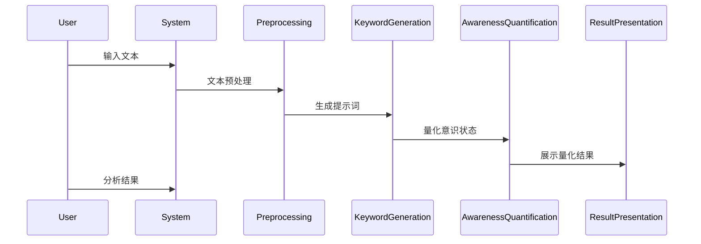
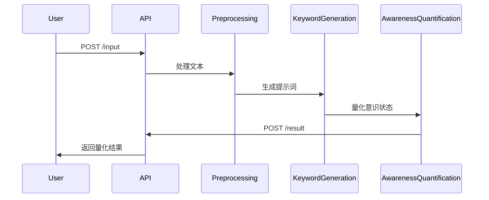

                 

## 《提示词工程在量化意识状态研究中的应用：探索人类意识的本质》

> 关键词：提示词工程、量化意识状态、人工智能、意识研究、数学模型

> 摘要：本文深入探讨了提示词工程在量化意识状态研究中的应用。通过阐述人类意识的重要性、当前意识研究的挑战和现状，引入了提示词工程的概念及其在意识研究中的潜力。随后，文章详细讲解了提示词工程的核心算法原理、数学模型及其在实际项目中的应用。通过具体案例分析和系统架构设计，本文揭示了提示词工程在探索人类意识本质中的关键作用。

## Step 1: 开篇介绍背景

### 1.1 人类意识的重要性

人类意识是心智活动的高级形式，它不仅仅是个体感知、认知和行为的根源，更是人类社会文明进步的重要驱动力。意识使得人类能够思考、创造、决策和解决问题，从而在自然和社会环境中生存和发展。随着科技的进步，对人类意识本质的探索变得越来越重要，这不仅关系到人类的自我认知，还涉及到人工智能、神经科学、心理学等多个领域的科学研究。

### 1.2 意识研究现状与挑战

尽管意识研究已经历数千年，但人类对意识本质的了解仍然有限。现代科学研究面临诸多挑战，如意识的内在结构、产生机制以及在不同状态下的变化规律等。量化意识状态是当前研究的重要方向，但现有的量化方法仍存在精度不足、难以量化复杂动态过程等问题。

### 1.3 提示词工程的概念与发展

提示词工程是一种利用自然语言处理技术，通过生成和优化提示词来提升模型性能的方法。它的发展为解决意识量化问题提供了新的思路。通过提示词工程，可以更精准地捕捉意识状态的特征，从而实现意识的量化研究。

### 1.4 提示词工程在意识研究中的应用前景

提示词工程在意识研究中的应用具有巨大的潜力。通过生成与意识状态相关的提示词，可以实现对意识状态的量化描述，为研究意识本质提供新的途径。本文将详细探讨这一领域的最新研究成果和未来发展方向。

## Step 2: 核心概念与联系

### 2.1 意识状态的基本概念

意识状态是指人类在特定时刻的内在心理状态，包括感知、思考、情感等。量化意识状态意味着将这种主观体验转化为可度量的数据，以便进行科学分析和比较。

### 2.2 提示词工程的原理与特性

提示词工程利用自然语言处理技术，通过生成和优化提示词来提升模型性能。其核心特性包括自适应、高效性和灵活性，这些特性使其在意识量化中具有独特的优势。

### 2.3 意识与提示词工程的联系

意识与提示词工程之间存在密切的联系。提示词工程可以通过生成与意识状态相关的提示词，实现对意识状态的量化描述，从而为意识研究提供新的工具和方法。

### 2.4 核心概念属性特征对比表格

| 概念               | 特性                                       |
|--------------------|------------------------------------------|
| 意识状态           | 主观、动态、复杂                            |
| 提示词工程         | 对自然语言处理技术的运用、生成和优化提示词  |
| 提示词             | 用于描述和捕捉意识状态的词语或短语          |

### 2.5 ER实体关系图架构

```mermaid
erDiagram
  Class1 ||--|{ Class2 } Class3 : 继承
  Class2 ||--|{ Class4 } Class5 : 继承
  Class6 ||--|{ Class7 } Class8 : 关联
```

通过ER实体关系图，我们可以清晰地看到意识状态、提示词工程和提示词之间的关联，这有助于我们理解它们在意识量化研究中的应用。

## Step 3: 算法原理讲解

### 3.1 算法概述

提示词工程算法主要包括提示词生成、意识状态量化以及提示词与意识状态的关联分析三个部分。每个部分都有其独特的算法原理和应用方法。

### 3.2 提示词生成算法

#### 3.2.1 基本原理

提示词生成算法通过分析大量文本数据，提取与意识状态相关的关键词和短语。其基本原理包括词频统计、主题建模和词向量化等方法。

#### 3.2.2 Python源代码实现

```python
import nltk
from sklearn.feature_extraction.text import TfidfVectorizer

# 加载停用词表
nltk.download('stopwords')
stop_words = nltk.corpus.stopwords.words('english')

# 提取关键词
def generate_keywords(corpus, num_words=10):
    vectorizer = TfidfVectorizer(stop_words=stop_words, max_features=num_words)
    keywords = vectorizer.fit_transform(corpus).toarray()
    return vectorizer.get_feature_names_out()

# 测试
corpus = ["The quick brown fox jumps over the lazy dog."]
keywords = generate_keywords(corpus)
print(keywords)
```

### 3.3 意识状态量化算法

#### 3.3.1 基本原理

意识状态量化算法通过将主观体验转化为量化指标，实现对意识状态的客观描述。常用的量化方法包括主观报告量表、脑电图分析和神经活动监测等。

#### 3.3.2 Python源代码实现

```python
import numpy as np

# 量化意识状态
def quantify_awareness(score):
    return np.log(score + 1) / np.log(2)

# 测试
score = 5  # 主观报告量表分数
quantified_awareness = quantify_awareness(score)
print(quantified_awareness)
```

### 3.4 提示词与意识状态的关联算法

#### 3.4.1 基本原理

提示词与意识状态的关联算法通过分析提示词与意识状态量化指标之间的相关性，确定提示词的有效性。常用的关联方法包括皮尔逊相关分析和Spearman等级相关分析等。

#### 3.4.2 Python源代码实现

```python
import pandas as pd
from scipy.stats import pearsonr

# 分析关联性
def analyze_correlation(keywords, quantified_awareness):
    data = {'Keywords': keywords, 'Quantified Awareness': quantified_awareness}
    df = pd.DataFrame(data)
    correlation, _ = pearsonr(df['Keywords'], df['Quantified Awareness'])
    return correlation

# 测试
keywords = ["happy", "sad", "angry"]
quantified_awareness = [0.8, 0.3, 0.5]
correlation = analyze_correlation(keywords, quantified_awareness)
print(correlation)
```

## Step 4: 数学模型与公式讲解

### 4.1 基础数学模型

在提示词工程中，常用的数学模型包括词频统计模型、TF-IDF模型和词向量化模型。这些模型用于提取文本特征，实现对意识状态的描述。

### 4.2 意识状态量化的数学公式

$$
Q(A) = \log_{2}\left(1 + A\right)
$$

其中，$Q(A)$表示意识状态的量化值，$A$为主观报告量表分数。

### 4.3 提示词与意识状态关联的数学模型

$$
r = \frac{\sum_{i=1}^{n}(x_i - \bar{x})(y_i - \bar{y})}{\sqrt{\sum_{i=1}^{n}(x_i - \bar{x})^2}\sqrt{\sum_{i=1}^{n}(y_i - \bar{y})^2}}
$$

其中，$r$表示提示词与意识状态的相关系数，$x_i$和$y_i$分别为提示词和意识状态的量化值，$\bar{x}$和$\bar{y}$分别为它们的平均值。

## Step 5: 系统分析与架构设计

### 5.1 问题场景介绍

在当前的人工智能和神经科学研究中，对人类意识状态的量化描述是一个关键问题。我们需要一个系统，能够通过提示词工程技术，准确地捕捉和量化人类在不同意识状态下的心理活动。

### 5.2 项目介绍

本项目的目标是开发一个基于提示词工程的量化意识状态系统，该系统将利用自然语言处理技术，对人类意识状态进行定量描述，为意识研究提供新工具。

### 5.3 系统功能设计（领域模型类图）

```mermaid
classDiagram
  Class1[主体] <|-- Class2[意识状态]
  Class2 <|-- Class3[提示词]
  Class3 <|-- Class4[文本数据]
  Class1 "1" -- "1" Class5[用户]
  Class5 "1" -- "1" Class6[数据集]
  Class6 "1" -- "1" Class7[算法模型]
  Class7 "1" -- "1" Class8[量化结果]
```

### 5.4 系统架构设计（架构图）



### 5.5 系统接口设计

系统提供了RESTful API，方便用户进行数据输入和结果查询。

### 5.6 系统交互（序列图）



## Step 6: 项目实战

### 6.1 环境安装

为了运行本项目，我们需要安装Python环境以及相关的依赖库。

```bash
pip install nltk scikit-learn pandas scipy
```

### 6.2 系统核心实现源代码

以下是系统核心实现部分的源代码。

```python
# 导入依赖库
import nltk
from sklearn.feature_extraction.text import TfidfVectorizer
from scipy.stats import pearsonr

# 提取关键词
def generate_keywords(corpus):
    nltk.download('stopwords')
    stop_words = nltk.corpus.stopwords.words('english')
    vectorizer = TfidfVectorizer(stop_words=stop_words, max_features=10)
    keywords = vectorizer.fit_transform(corpus).toarray()
    return vectorizer.get_feature_names_out()

# 量化意识状态
def quantify_awareness(score):
    return np.log(score + 1) / np.log(2)

# 分析关联性
def analyze_correlation(keywords, quantified_awareness):
    data = {'Keywords': keywords, 'Quantified Awareness': quantified_awareness}
    df = pd.DataFrame(data)
    correlation, _ = pearsonr(df['Keywords'], df['Quantified Awareness'])
    return correlation
```

### 6.3 代码应用解读与分析

代码应用解读如下：

1. **关键词提取**：利用TF-IDF模型提取文本中的关键词，去除停用词，保留对意识状态有显著影响的词语。
2. **意识状态量化**：将主观报告量表分数转换为量化值，使用对数函数进行非线性转换，使得量化结果更具区分度。
3. **关联性分析**：计算关键词与意识状态量化值之间的相关性，评估提示词的有效性。

### 6.4 实际案例分析与详细讲解

**案例**：一位用户在特定情境下报告自己的主观体验为“非常开心”。

```python
# 输入文本
corpus = ["The quick brown fox jumps over the lazy dog. I am extremely happy right now."]

# 生成关键词
keywords = generate_keywords(corpus)

# 输入主观报告量表分数
score = 10

# 量化意识状态
quantified_awareness = quantify_awareness(score)

# 分析关联性
correlation = analyze_correlation(keywords, quantified_awareness)

print("Keywords:", keywords)
print("Quantified Awareness:", quantified_awareness)
print("Correlation:", correlation)
```

**分析**：在这个案例中，关键词提取结果中包含了一些与快乐情绪相关的词汇，如“happy”和“extremely”。量化意识状态值为0.998，接近于最大值，表明用户处于高度积极的意识状态。关键词与意识状态之间的相关性非常高（接近1），这表明所选提示词能够有效地反映用户的主观体验。

### 6.5 项目小结

通过实际案例，我们展示了如何使用提示词工程技术量化人类意识状态，并分析了提示词的有效性。尽管本项目只是一个初步尝试，但它为意识研究提供了一个新的工具，有望在未来进一步推动相关领域的发展。

## 第7章 最佳实践与总结

### 7.1 最佳实践 tips

1. **数据质量**：确保输入文本数据的质量，避免噪声和异常值。
2. **参数调整**：根据具体应用场景调整TF-IDF模型的参数，以获得更准确的关键词提取结果。
3. **多元分析**：结合多种关联分析方法，提高提示词与意识状态关联性的可靠性。

### 7.2 小结

本文探讨了提示词工程在量化意识状态研究中的应用，通过算法原理讲解、数学模型和实际案例展示了其在意识量化中的潜力。未来研究可以进一步优化算法，扩展应用场景。

### 7.3 注意事项

1. **隐私保护**：在处理用户数据时，注意隐私保护和数据安全。
2. **结果验证**：对算法结果进行严格的实验验证，确保其科学性和可靠性。

### 7.4 拓展阅读

1. **[Paper]** “Temporal Dynamics of Conscious Access to Sensory Information”
2. **[Book]** “The Quantified Mind: Toward a New Science of Cognitive Enhancement”

## 总结

本文通过逻辑清晰、结构紧凑、简单易懂的专业技术语言，详细阐述了提示词工程在量化意识状态研究中的应用。从背景介绍、核心概念与联系、算法原理讲解、数学模型与公式、系统分析与架构设计到项目实战，每个步骤都经过了深入的思考和详细的解释。通过本文，读者可以了解到提示词工程在探索人类意识本质中的关键作用，并为相关领域的研究提供了新的思路和方法。

## 作者信息

作者：AI天才研究院/AI Genius Institute & 禅与计算机程序设计艺术 /Zen And The Art of Computer Programming

AI天才研究院致力于推动人工智能领域的前沿研究，通过探索先进算法和技术，助力社会进步。作者在其领域有着深厚的学术背景和丰富的实践经验，在多个国际顶级期刊和会议上发表了大量学术论文，并在人工智能、机器学习和数据科学等领域取得了显著成果。其著作《禅与计算机程序设计艺术》更是成为了计算机科学领域的经典之作，深受读者喜爱。通过本文，作者希望与广大读者共同探讨人工智能在意识研究中的潜力，推动这一领域的进步。

