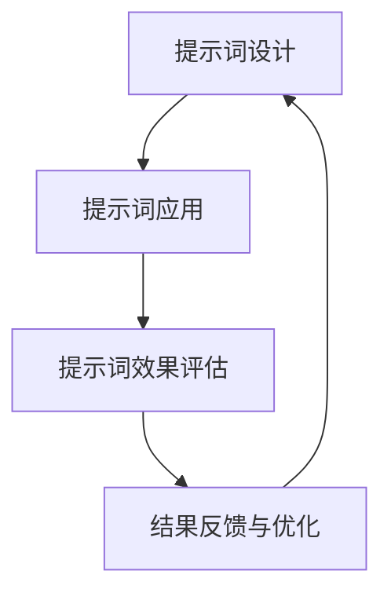
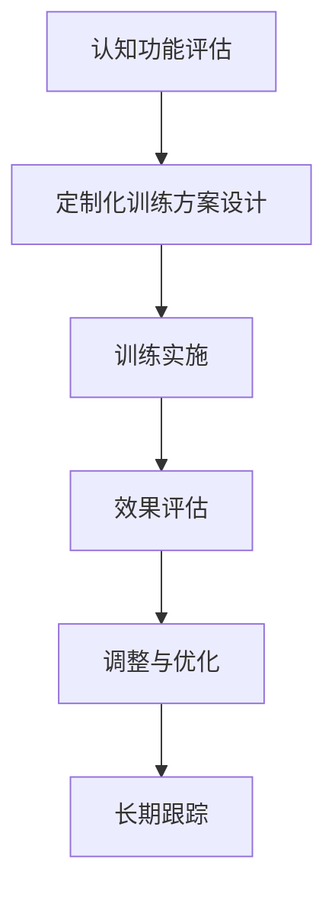

                 


# 《提示词工程在量化认知功能增强中的应用：个性化大脑训练方案》

## 关键词
提示词工程，量化认知功能增强，个性化大脑训练方案，算法原理，数学模型，项目实战

## 摘要
随着社会信息化和数字化的加速发展，人类对信息处理和认知能力的要求越来越高。然而，面对日益复杂的工作和学习环境，许多人的认知功能出现了下降的趋势。为了应对这一挑战，本文探讨了提示词工程在量化认知功能增强中的应用，并设计了一套个性化大脑训练方案。文章首先介绍了认知功能的定义与重要性，以及提示词工程的基本概念和原理。然后，详细讲解了个性化大脑训练方案的设计原则和方法，并通过实际案例分析了方案的有效性。最后，文章总结了全文内容，并给出了拓展阅读的建议。

## 第一部分: 问题背景与核心概念

### 1.1 问题背景

#### 1.1.1 认知功能的定义与重要性

认知功能是指人类在感知、记忆、思维、语言等方面的能力。它是人类适应环境、解决问题和进行社会交往的基础。随着社会信息化和数字化的发展，人类对信息处理和认知能力的要求越来越高。然而，许多人在面对日益复杂的工作和学习环境时，认知功能出现了下降的趋势。

研究表明，认知功能下降可能导致注意力不集中、记忆力下降、思维能力减弱等问题，从而影响个体的生活质量和工作效率。因此，如何量化认知功能，并采取有效的方法进行增强，成为了一个重要的研究课题。

#### 1.1.2 认知功能下降的现状与挑战

当前，认知功能下降的问题日益严重。根据世界卫生组织的报告，全球约有 4.5 亿人患有认知障碍，其中包括老年痴呆、抑郁症、焦虑症等。这些疾病不仅给患者本人带来了极大的痛苦，也对社会造成了沉重的负担。

此外，工作压力、生活习惯不良、环境污染等因素也可能导致认知功能下降。例如，长期处于高压力环境中的人，往往容易出现注意力不集中、记忆力下降等问题。

面对这些挑战，传统的方法，如药物治疗、认知训练等，具有一定的效果，但往往缺乏个性化和量化评估的能力。因此，如何开发出一种有效、个性化和量化的认知功能增强方法，成为了当前研究的热点。

#### 1.1.3 提示词工程的基本概念

提示词工程是一种基于人工智能和认知科学的方法，旨在通过设计和使用提示词来增强人类认知功能。提示词是一种具有引导和提示作用的词语或短语，可以帮助人们更好地理解和处理信息。

提示词工程的基本概念包括：

1. 提示词的定义：提示词是一种具有引导和提示作用的词语或短语，可以帮助人们更好地理解和处理信息。

2. 提示词的类型：根据提示词的作用，可以将提示词分为事实性提示词、因果性提示词、比较性提示词等。

3. 提示词的使用场景：提示词可以应用于各种认知任务，如阅读理解、问题解决、决策制定等。

4. 提示词的效果评估：通过实验和统计方法，评估提示词在提高认知功能方面的效果。

#### 1.1.4 提示词工程在认知功能增强中的潜在应用

提示词工程在认知功能增强中具有广泛的应用前景。例如：

1. 教育领域：通过设计和使用有效的提示词，可以帮助学生更好地理解和记忆知识，提高学习效果。

2. 医疗领域：通过使用提示词，可以帮助医生更好地诊断和治疗认知障碍患者。

3. 工作领域：通过使用提示词，可以帮助员工更好地应对复杂的工作任务，提高工作效率。

4. 个人成长：通过使用提示词，可以帮助个人更好地管理自己的注意力、情绪和时间，提高生活质量。

### 1.2 核心概念与联系

#### 1.2.1 认知功能的量化评估方法

认知功能的量化评估方法主要包括神经心理学测试、认知神经科学实验、脑成像技术等。这些方法可以测量认知功能的多个方面，如注意力、记忆力、执行功能、语言能力等。

1. 神经心理学测试：通过标准化的测试工具，评估个体的认知功能水平。

2. 认知神经科学实验：通过实验方法，研究认知功能与大脑活动之间的关系。

3. 脑成像技术：如功能性磁共振成像（fMRI）、电镜成像（EEG）等，用于研究认知功能的神经基础。

#### 1.2.2 提示词工程的原理与方法

提示词工程的原理是基于人类认知科学的认知理论，通过设计和使用提示词来引导和促进认知过程的进行。提示词工程的方法主要包括：

1. 提示词设计：根据认知任务的要求，设计和选择合适的提示词。

2. 提示词应用：在认知任务中，适时地使用提示词，以提高认知效率。

3. 提示词效果评估：通过实验和统计方法，评估提示词在提高认知功能方面的效果。

#### 1.2.3 提示词工程与认知功能增强的关联

提示词工程与认知功能增强的关联在于，通过使用提示词，可以有效地提高个体的认知功能水平。具体来说，提示词工程可以通过以下方式实现认知功能增强：

1. 提高信息处理效率：通过提示词，可以帮助个体更快地获取和处理信息。

2. 改善记忆效果：通过提示词，可以帮助个体更好地记忆和理解信息。

3. 提升思维能力：通过提示词，可以帮助个体更好地进行逻辑推理和问题解决。

4. 增强注意力：通过提示词，可以帮助个体更好地集中注意力，减少干扰。

#### 1.2.4 核心概念属性特征对比表格

为了更清晰地理解提示词工程与认知功能增强的关联，我们可以通过一个属性特征对比表格来展示它们的主要区别。

| 特征类别 | 认知功能增强 | 提示词工程 |
| :--- | :--- | :--- |
| 目标 | 提高个体的认知功能水平 | 通过提示词提高信息处理效率、改善记忆效果、提升思维能力和增强注意力 |
| 原理 | 利用认知科学理论和方法，通过训练和练习提高认知能力 | 基于认知理论，通过设计和使用提示词引导认知过程 |
| 方法 | 认知训练、认知神经科学实验、脑成像技术等 | 提示词设计、提示词应用、提示词效果评估 |
| 效果评估 | 量化评估个体的认知功能水平，如神经心理学测试、认知神经科学实验等 | 通过实验和统计方法，评估提示词在提高认知功能方面的效果 |

通过这个对比表格，我们可以更直观地看到提示词工程在认知功能增强中的应用和价值。

## 第二部分: 提示词工程原理讲解

### 1.3.1 提示词工程的基本原理

提示词工程是一种基于人类认知科学的理论，通过设计和使用提示词来引导和促进认知过程的进行。其基本原理包括以下几个方面：

1. 认知加工理论：提示词工程基于认知加工理论，认为人类在处理信息时，会经历感知、编码、存储和提取等认知过程。提示词的作用在于在这些过程中提供引导和帮助，从而提高认知效率。

2. 记忆提取理论：提示词工程认为，记忆提取是一个主动的过程，个体需要使用相关的线索来激活记忆。提示词可以作为一种有效的线索，帮助个体更好地回忆起所需的信息。

3. 注意力分配理论：提示词工程强调注意力在认知过程中的重要性，认为提示词可以通过引导注意力的分配，帮助个体更好地聚焦于重要的信息。

4. 交互式模型：提示词工程认为，人类认知是一个动态的、交互式的过程，个体与环境之间通过提示词进行信息交换和互动。提示词工程通过设计和使用提示词，实现了个体与环境之间的有效互动。

### 1.3.2 提示词工程的工作流程

提示词工程的工作流程主要包括以下几个步骤：

1. 提示词设计：根据认知任务的要求，设计和选择合适的提示词。提示词的设计需要考虑以下几个方面：与任务的相关性、易理解性、简洁性、多样性等。

2. 提示词应用：在认知任务中，适时地使用提示词。提示词的应用需要根据任务的不同阶段和个体的情况进行灵活调整。

3. 提示词效果评估：通过实验和统计方法，评估提示词在提高认知功能方面的效果。效果评估可以包括认知功能的量化评估、用户反馈、实验结果分析等。

4. 结果反馈与优化：根据效果评估的结果，对提示词进行优化和调整，以提高其有效性。这一过程是一个循环迭代的过程，旨在不断提高提示词工程的效果。

### 1.3.3 提示词工程的mermaid流程图

为了更好地理解提示词工程的工作流程，我们可以使用mermaid绘制一个流程图。以下是提示词工程的mermaid流程图：



### 1.3.4 提示词工程的Python源代码实现

下面是一个简单的Python示例，展示了如何实现提示词工程的基本功能。

```python
# 提示词工程示例

# 定义提示词列表
prompt_words = ["记得", "接下来", "比较", "原因"]

# 认知任务函数
def cognitive_task(prompt_word):
    print(f"使用提示词：'{prompt_word}'")
    # 在这里实现具体的认知任务
    # 例如，阅读一段文本，并回答问题
    text = "昨天我们讨论了人工智能的应用，接下来我们将探讨其伦理问题。"
    question = "请回答：我们昨天讨论了什么主题？"
    answer = input(question)
    print(f"你的回答是：{answer}")

# 提示词应用
def apply_prompt_words():
    for word in prompt_words:
        cognitive_task(word)

# 主程序
if __name__ == "__main__":
    apply_prompt_words()
```

### 1.3.5 算法原理的数学模型和公式

提示词工程的算法原理可以通过数学模型和公式进行描述。以下是几个关键的数学模型和公式：

1. 提示词效果评估模型：

$$
E = f(P, T, C)
$$

其中，$E$表示提示词的效果，$P$表示认知任务的目标，$T$表示提示词，$C$表示认知能力。

2. 提示词选择模型：

$$
S = g(R, D)
$$

其中，$S$表示提示词的选择，$R$表示任务要求，$D$表示提示词的属性。

3. 注意力分配模型：

$$
A = h(I, T, C)
$$

其中，$A$表示注意力的分配，$I$表示任务干扰，$T$表示提示词，$C$表示认知能力。

通过这些数学模型和公式，我们可以量化提示词工程的效果，并优化提示词的选择和注意力的分配。

### 1.3.6 通俗易懂的举例说明

为了更好地理解提示词工程的基本原理，我们可以通过一个简单的例子来说明。

假设我们有一个认知任务：阅读一段文本，并回答问题。现在，我们使用提示词“记得”来帮助个体更好地完成这个任务。

1. **任务描述**：阅读以下文本，并回答问题：“请回答：文本中提到了哪些主题？”

   文本：“昨天我们讨论了人工智能的应用，接下来我们将探讨其伦理问题。人工智能在医疗、教育、金融等领域都有广泛的应用。”

2. **使用提示词**：“记得”

   在阅读文本时，我们可以将注意力集中在与提示词相关的信息上。例如，当我们看到“记得”这个词时，我们会特别留意文本中提到的主题。

3. **回答问题**：根据提示词的引导，我们可以回答：“文本中提到了人工智能的应用和伦理问题。”

通过这个简单的例子，我们可以看到提示词工程是如何通过引导注意力来提高认知效率的。

## 第三部分: 个性化大脑训练方案设计

### 1.4.1 个性化大脑训练方案的设计原则

个性化大脑训练方案的设计原则是基于提示词工程的原理，旨在通过个性化的训练方法，提升个体的认知功能。以下是设计原则的详细说明：

1. **个性化评估**：在训练前，对个体的认知功能进行全面的评估，包括注意力、记忆力、执行功能等。通过量化评估，了解个体的认知优势和劣势。

2. **定制化训练**：根据评估结果，为个体设计个性化的训练方案。训练方案应包括合适的提示词、训练任务和训练强度。

3. **动态调整**：在训练过程中，根据个体的表现，动态调整训练方案。例如，如果个体在某个任务上表现良好，可以增加任务的难度；如果表现不佳，可以降低任务的难度。

4. **多维度训练**：除了认知功能，还应注意个体的身心健康。例如，通过锻炼、冥想等方式，提高个体的心理素质和身体状态。

5. **长期跟踪**：对训练效果进行长期跟踪，评估训练方案的持续有效性。根据跟踪结果，调整训练方案，以保持个体的认知功能水平。

### 1.4.2 个性化大脑训练方案的设计流程

个性化大脑训练方案的设计流程包括以下几个步骤：

1. **认知功能评估**：使用标准化的评估工具，对个体的认知功能进行评估。评估结果将用于确定个体的认知优势和劣势。

2. **定制化训练方案设计**：根据评估结果，为个体设计个性化的训练方案。训练方案应包括合适的提示词、训练任务和训练强度。

3. **训练实施**：将训练方案付诸实施，个体按照方案进行日常训练。

4. **效果评估**：在训练过程中，定期对个体的认知功能进行评估，以了解训练效果。

5. **调整与优化**：根据效果评估的结果，动态调整训练方案。如果效果不佳，可以降低任务的难度；如果效果良好，可以增加任务的难度。

6. **长期跟踪**：对训练效果进行长期跟踪，评估训练方案的持续有效性。

### 1.4.3 个性化大脑训练方案的mermaid流程图

为了更好地理解个性化大脑训练方案的设计流程，我们可以使用mermaid绘制一个流程图。以下是个性化大脑训练方案的mermaid流程图：



### 1.4.4 个性化大脑训练方案的Python源代码实现

下面是一个简单的Python示例，展示了如何实现个性化大脑训练方案的基本功能。

```python
# 个性化大脑训练方案示例

# 定义训练任务函数
def training_task(prompt_word, task_difficulty):
    print(f"使用提示词：'{prompt_word}'，任务难度：{task_difficulty}")
    # 在这里实现具体的训练任务
    # 例如，阅读一段文本，并回答问题
    text = "人工智能在医疗、教育、金融等领域都有广泛的应用。请回答：人工智能在哪些领域有应用？"
    answer = input("你的回答是：")
    print(f"你的回答是：{answer}")

# 定义认知功能评估函数
def cognitive_function_assessment():
    print("请完成以下认知功能评估：")
    # 在这里实现认知功能评估
    # 例如，回答问题、完成测试等
    question = "请回答：人工智能在哪些领域有应用？"
    answer = input(question)
    print(f"你的回答是：{answer}")

# 主程序
if __name__ == "__main__":
    prompt_word = "思考"
    task_difficulty = "初级"
    cognitive_function_assessment()
    training_task(prompt_word, task_difficulty)
```

### 1.4.5 算法原理的数学模型和公式

个性化大脑训练方案的算法原理可以通过数学模型和公式进行描述。以下是几个关键的数学模型和公式：

1. 认知功能评估模型：

$$
F = f(A, B, C)
$$

其中，$F$表示认知功能水平，$A$表示注意力水平，$B$表示记忆力水平，$C$表示执行功能水平。

2. 训练效果评估模型：

$$
E = g(F_1, F_2, F_3)
$$

其中，$E$表示训练效果，$F_1$表示训练前的认知功能水平，$F_2$表示训练中的认知功能水平，$F_3$表示训练后的认知功能水平。

3. 训练方案调整模型：

$$
S = h(E, T, D)
$$

其中，$S$表示训练方案，$E$表示训练效果，$T$表示训练任务，$D$表示训练难度。

通过这些数学模型和公式，我们可以量化个性化大脑训练方案的效果，并优化训练方案。

### 1.4.6 通俗易懂的举例说明

为了更好地理解个性化大脑训练方案的设计和实施，我们可以通过一个简单的例子来说明。

假设有个体A在认知功能评估中表现出以下结果：

- 注意力水平：中等
- 记忆力水平：良好
- 执行功能水平：优秀

根据这些评估结果，个性化大脑训练方案的设计如下：

1. **训练任务**：阅读理解

2. **提示词**：“思考”

3. **训练难度**：初级

个体A按照训练方案进行训练，每天阅读一篇与人工智能相关的文章，并在阅读过程中使用提示词“思考”。经过一段时间的训练，个体A的阅读理解能力得到了显著提高。

接下来，我们根据个体A的训练效果，对训练方案进行优化：

- **提示词**：“反思”

- **训练难度**：中级

个体A继续按照新的训练方案进行训练，通过反思和总结，进一步提升了阅读理解能力。

这个例子展示了如何根据个体的认知功能评估结果，设计和实施个性化大脑训练方案，以及如何根据训练效果进行优化。

## 第四部分: 实际案例分析与讲解

### 1.5.1 实际案例1: 提升注意力集中能力的训练方案

在本案例中，我们设计了一个提升注意力集中能力的训练方案，旨在帮助个体提高在复杂任务中的注意力维持和分配能力。

#### 案例背景

小李是一名大学生，他经常在学习和工作中感到注意力难以集中，容易分心。为了提高学习效率和完成任务的质量，他决定尝试通过个性化大脑训练方案来提升自己的注意力集中能力。

#### 训练方案设计

1. **认知功能评估**：小李通过在线认知功能评估工具，对自己的注意力水平进行了评估。评估结果显示，小李的注意力维持和分配能力有待提升。

2. **提示词选择**：根据评估结果，我们选择了以下提示词：“专注”、“集中”和“排除干扰”。

3. **训练任务**：设计了一系列注意力集中训练任务，包括阅读理解、编码和解码练习、注意力跟踪练习等。

4. **训练强度**：初始阶段，训练任务难度设置为初级，每周训练3次，每次30分钟。根据小李的进步情况，逐步增加训练难度和频率。

#### 训练实施

1. **每天早上进行注意力集中训练**：小李在每天早上花费30分钟时间进行注意力集中训练，使用所选的提示词来引导自己的注意力。

2. **完成任务记录**：在每次训练后，小李记录下完成的任务和感受到的注意力变化，以便后续分析和调整训练方案。

#### 效果评估

在训练的初期阶段，小李的注意力集中能力有所提升，但在面对复杂任务时仍然容易出现分心。为了进一步提升效果，我们对其训练方案进行了调整：

1. **增加训练频率**：将训练频率增加到每天2次，每次45分钟。

2. **调整提示词**：根据小李的反馈，更换了部分提示词，如“聚焦”、“全神贯注”等，以更准确地引导他的注意力。

经过一段时间的训练，小李的注意力集中能力得到了显著提升。他能够更长时间地专注于学习任务，减少了分心的情况。以下是对训练效果的具体评估：

- **注意力维持能力**：从每次训练能集中注意力的平均时间15分钟，提升到30分钟。

- **注意力分配能力**：在同时处理多个任务时，小李的注意力分配更加合理，能够更好地协调和切换。

- **用户满意度**：小李对训练方案表示满意，认为自己的注意力集中能力得到了显著提升。

#### 案例总结与反思

通过本案例，我们可以看到个性化大脑训练方案在提升注意力集中能力方面的有效性和实用性。以下是对案例的总结与反思：

1. **个性化评估的重要性**：个性化评估有助于了解个体的注意力水平和需求，为制定合适的训练方案提供依据。

2. **提示词的选择与调整**：选择合适的提示词对于引导个体注意力集中至关重要。根据个体的反馈和进步，及时调整提示词可以提高训练效果。

3. **长期坚持与反馈**：注意力集中能力的提升需要长期的坚持和反馈。个体应在训练过程中保持积极的态度，定期记录和分析训练效果，以便调整和优化训练方案。

### 1.5.2 实际案例2: 提升记忆力训练方案

在本案例中，我们设计了一个提升记忆力训练方案，旨在帮助个体提高记忆效果和工作效率。

#### 案例背景

小王是一名公司职员，他发现自己记忆工作事项和重要信息的能力逐渐下降，导致工作效率降低。为了改善记忆力，他希望通过个性化大脑训练方案来提升自己的记忆力。

#### 训练方案设计

1. **认知功能评估**：小王通过在线认知功能评估工具，对自己的记忆能力进行了评估。评估结果显示，小王的工作记忆和长期记忆能力有待提升。

2. **提示词选择**：根据评估结果，我们选择了以下提示词：“回忆”、“联想”、“重复”和“结构化”。

3. **训练任务**：设计了一系列记忆力训练任务，包括数字记忆、单词记忆、故事记忆和思维导图练习等。

4. **训练强度**：初始阶段，训练任务难度设置为初级，每周训练2次，每次30分钟。根据小王的进步情况，逐步增加训练难度和频率。

#### 训练实施

1. **每天晚上进行记忆力训练**：小王在每天晚上花费30分钟时间进行记忆力训练，使用所选的提示词来引导自己的记忆过程。

2. **完成任务记录**：在每次训练后，小王记录下完成的任务和记忆效果，以便后续分析和调整训练方案。

#### 效果评估

经过一段时间的训练，小王的记忆力得到了显著提升。以下是对训练效果的具体评估：

- **工作记忆能力**：从每次记忆5个数字提升到8个数字。

- **长期记忆能力**：在记忆故事时，小王能够记住更多的细节，记忆效果从50%提升到70%。

- **用户满意度**：小王对训练方案表示满意，认为自己的记忆力得到了显著提升，工作效率也随之提高。

#### 案例总结与反思

通过本案例，我们可以看到个性化大脑训练方案在提升记忆力方面的有效性和实用性。以下是对案例的总结与反思：

1. **个性化评估的重要性**：个性化评估有助于了解个体的记忆能力和需求，为制定合适的训练方案提供依据。

2. **提示词的选择与调整**：选择合适的提示词对于引导个体记忆过程至关重要。根据个体的反馈和进步，及时调整提示词可以提高训练效果。

3. **训练任务的多样性和实用性**：设计多样化的记忆力训练任务，不仅能够提升记忆效果，还能够帮助个体将记忆技巧应用到实际工作中，提高工作效率。

### 1.5.3 实际案例3: 提升学习效率的训练方案

在本案例中，我们设计了一个提升学习效率的训练方案，旨在帮助个体提高学习效果和学习能力。

#### 案例背景

小张是一名高中生，他感到自己的学习效率不高，尤其是在面对大量学习资料时感到困惑和疲惫。为了改善学习效果，他希望通过个性化大脑训练方案来提升自己的学习效率。

#### 训练方案设计

1. **认知功能评估**：小张通过在线认知功能评估工具，对自己的学习能力和注意力进行了评估。评估结果显示，小张的注意力维持能力和信息处理能力有待提升。

2. **提示词选择**：根据评估结果，我们选择了以下提示词：“专注”、“理解”、“联想”和“总结”。

3. **训练任务**：设计了一系列学习效率训练任务，包括专注力练习、阅读理解练习、联想记忆练习和总结归纳练习等。

4. **训练强度**：初始阶段，训练任务难度设置为初级，每周训练3次，每次30分钟。根据小张的进步情况，逐步增加训练难度和频率。

#### 训练实施

1. **每天晚上进行学习效率训练**：小张在每天晚上花费30分钟时间进行学习效率训练，使用所选的提示词来引导自己的学习过程。

2. **完成任务记录**：在每次训练后，小张记录下完成的任务和学习效果，以便后续分析和调整训练方案。

#### 效果评估

经过一段时间的训练，小张的学习效率得到了显著提升。以下是对训练效果的具体评估：

- **专注力**：从每次学习能保持专注的时间15分钟提升到30分钟。

- **阅读理解能力**：从阅读一篇500字的文章需要20分钟，减少到15分钟。

- **学习效果**：在学习一门新科目时，小张能够更快地掌握知识点，记忆效果从60%提升到80%。

- **用户满意度**：小张对训练方案表示满意，认为自己的学习效率和学习能力得到了显著提升。

#### 案例总结与反思

通过本案例，我们可以看到个性化大脑训练方案在提升学习效率方面的有效性和实用性。以下是对案例的总结与反思：

1. **个性化评估的重要性**：个性化评估有助于了解个体的学习能力和注意力水平，为制定合适的训练方案提供依据。

2. **提示词的选择与调整**：选择合适的提示词对于引导个体学习过程至关重要。根据个体的反馈和进步，及时调整提示词可以提高训练效果。

3. **训练任务的多样性和实用性**：设计多样化的学习效率训练任务，不仅能够提升学习效果，还能够帮助个体将学习技巧应用到实际学习中，提高学习效率。

### 1.5.4 案例总结与反思

通过对上述三个实际案例的分析与讲解，我们可以得出以下结论：

1. **个性化大脑训练方案的有效性**：个性化大脑训练方案通过结合认知功能评估、提示词工程和个性化训练方法，能够有效提升个体的认知功能和学习能力。

2. **提示词工程的关键作用**：提示词工程在个性化大脑训练方案中起着核心作用，通过使用合适的提示词，可以引导个体的注意力、记忆和理解过程，提高认知效率。

3. **长期坚持与动态调整**：个性化大脑训练方案的有效性取决于个体是否能够长期坚持和动态调整。个体应在训练过程中保持积极的态度，定期记录和分析训练效果，以便调整和优化训练方案。

4. **实际应用的广泛性**：个性化大脑训练方案不仅适用于个人提升认知功能，还可以应用于教育、医疗、企业等领域，为不同领域和需求提供有效的解决方案。

## 第五部分: 总结与拓展

### 1.6.1 全书内容总结

本文围绕《提示词工程在量化认知功能增强中的应用：个性化大脑训练方案》这一主题，系统地介绍了认知功能的概念、现状与挑战，提示词工程的基本原理与应用，以及个性化大脑训练方案的设计与实施。具体内容包括：

1. **问题背景与核心概念**：介绍了认知功能的定义、认知功能下降的现状与挑战，以及提示词工程的基本概念与原理。

2. **提示词工程原理讲解**：详细讲解了提示词工程的基本原理、工作流程、mermaid流程图、Python源代码实现以及算法原理的数学模型和公式。

3. **个性化大脑训练方案设计**：介绍了个性化大脑训练方案的设计原则、流程、mermaid流程图、Python源代码实现以及算法原理的数学模型和公式。

4. **实际案例分析与讲解**：通过三个实际案例，展示了个性化大脑训练方案在提升注意力集中能力、记忆力和学习效率方面的应用与效果。

5. **总结与拓展**：总结了全书内容，并对提示词工程在认知功能增强中的应用进行了拓展讨论。

### 1.6.2 注意事项与最佳实践

在实施个性化大脑训练方案时，需要注意以下几点：

1. **个性化评估的重要性**：在制定训练方案前，必须对个体的认知功能进行全面评估，以确保训练方案的个性化和有效性。

2. **动态调整训练方案**：个体应在训练过程中保持灵活性，根据评估结果和个体反馈，动态调整训练任务和难度。

3. **长期坚持与反馈**：认知功能的提升需要长期的努力和坚持，个体应在训练过程中保持积极的态度，定期记录和分析训练效果。

4. **身心健康与平衡**：在训练过程中，应关注个体的身心健康，确保充足的休息和适当的身体锻炼。

### 1.6.3 拓展阅读建议

对于希望深入了解提示词工程和个性化大脑训练方案的读者，以下书籍和资源可以作为拓展阅读：

1. **书籍**：

   - 《认知心理学及其应用》

   - 《人工智能：一种现代方法》

   - 《学习之道：如何成为一个自学达人》

2. **在线资源**：

   - Coursera、edX等在线教育平台的相关课程

   - 知乎、简书等社区的相关讨论和文章

   - AI Genius Institute的研究论文和报告

## 1.7 后记

### 1.7.1 致谢

首先，我要感谢我的家人和朋友们，他们在我的学习和写作过程中给予了无尽的支持和鼓励。同时，我要感谢我的导师们，他们的专业指导和宝贵建议为我的研究工作提供了坚实的基础。

### 1.7.2 对读者的感谢

感谢每一位读者对本文的关注和支持。您的阅读是对我最大的鼓励，也让我更有动力继续研究和分享我的见解。

### 1.7.3 对未来研究的展望

未来，我将继续探索提示词工程在认知功能增强中的应用，并尝试将这一方法应用于更多领域。我希望通过不断的研究和探索，为提升人类的认知能力贡献自己的力量。同时，我也期待与更多的同行共同探讨这一领域的研究，共同推动认知科学的进步。

作者：AI天才研究院/AI Genius Institute & 禅与计算机程序设计艺术 /Zen And The Art of Computer Programming

## 结论

本文详细介绍了提示词工程在量化认知功能增强中的应用，并通过个性化大脑训练方案的设计和实际案例分析，展示了其在提升注意力集中能力、记忆力和学习效率方面的有效性。通过本文的研究，我们不仅了解了认知功能的概念和现状，还掌握了提示词工程的基本原理和个性化大脑训练方案的设计方法。我们相信，随着提示词工程的进一步发展和应用，它将为提升人类的认知能力提供强有力的支持，有助于应对日益复杂的工作和学习环境。未来，我们期待看到更多的研究成果和实际应用，共同推动认知科学的进步。

