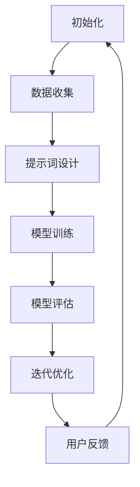
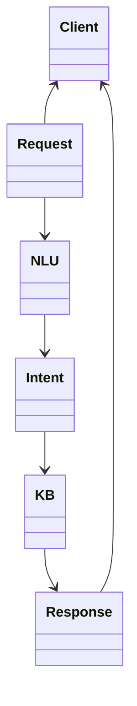
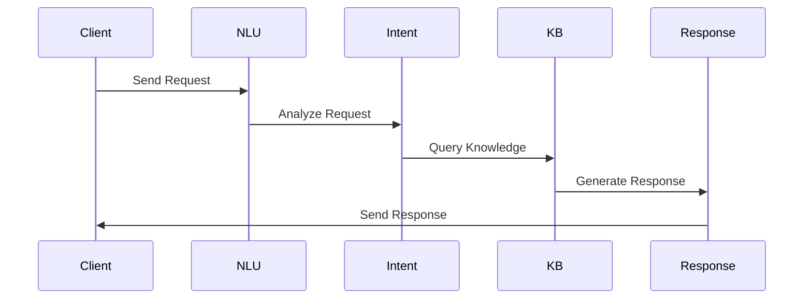
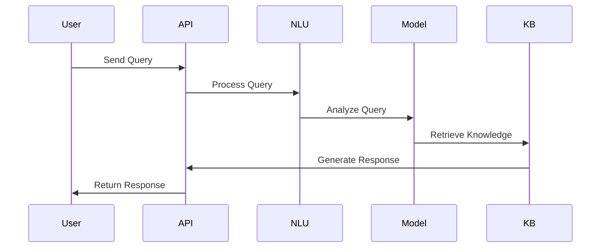

                 


### 文章标题：提示词工程在高级AI系统自主学习中的应用：实现持续进化

#### 关键词：提示词工程、高级AI系统、自主学习、持续进化、数学模型

#### 摘要：
本文旨在深入探讨提示词工程在高级AI系统自主学习中的应用，揭示其在实现AI系统持续进化中的关键作用。我们将通过逐步分析提示词工程的原理、算法及其在系统架构设计中的应用，展示其在推动AI技术进步中的潜力。本文还提供了实际案例和项目实战，帮助读者更好地理解这一创新技术的核心原理和实践方法。

## 目录大纲设计

为了设计《提示词工程在高级AI系统自主学习中的应用：实现持续进化》的目录大纲，我们需要确保内容的逻辑清晰、结构紧凑，并能够吸引读者的注意力。以下是详细的目录大纲：

### 第一部分：背景与理论基础

#### 第1章：问题背景与核心概念
1.1 提示词工程的基本概念
1.2 高级AI系统与自主学习
1.3 持续进化的实现路径
1.4 边界与外延

#### 第2章：核心概念与联系
2.1 提示词工程的原理与属性
2.2 自主学习的机制与模型
2.3 持续进化的实现策略

### 第二部分：算法原理与应用

#### 第3章：算法原理讲解
3.1 提示词工程算法的mermaid流程图
3.2 Python源代码实现
3.3 数学模型与公式解析

#### 第4章：数学模型与公式解析
4.1 数学模型的定义
4.2 数学公式的推导
4.3 公式应用与举例

### 第三部分：系统分析与架构设计

#### 第5章：系统功能设计
5.1 问题场景介绍
5.2 系统功能设计（领域模型mermaid类图）

#### 第6章：系统架构设计
6.1 系统架构设计（mermaid架构图）
6.2 系统接口设计与交互（mermaid序列图）

### 第四部分：项目实战

#### 第7章：环境安装与系统核心实现
7.1 环境安装
7.2 系统核心实现（源代码解读、代码应用解读与分析）

#### 第8章：实际案例分析与讲解
8.1 实际案例分析
8.2 案例详细讲解剖析

#### 第9章：项目小结与拓展
9.1 项目小结
9.2 注意事项与最佳实践
9.3 拓展阅读

### 第10章：总结与展望
10.1 总结
10.2 展望

**注意**：此目录大纲仅为框架设计，具体章节内容需根据实际书稿进行填充和细化。每个章节下的小节可以根据实际需要进一步扩展或调整。

### 文章正文

#### 第1章：问题背景与核心概念

##### 1.1 提示词工程的基本概念

提示词工程是一门结合了人工智能、自然语言处理和软件工程技术的交叉学科，它旨在通过设计高效的提示词（prompts）来引导AI系统完成特定任务。提示词工程不仅关注AI系统的性能，还强调用户体验和可解释性。其核心概念包括提示词设计、自然语言理解、语言生成、模型优化和交互性等。

##### 1.2 高级AI系统与自主学习

高级AI系统通常指的是具备复杂决策能力、自适应能力和自主学习能力的系统。这些系统可以在没有明确编程的情况下，通过自我学习和优化来提高任务执行效率。自主学习是高级AI系统的核心特征，它通过数据驱动的方式，使系统能够不断改进其行为和性能。

##### 1.3 持续进化的实现路径

持续进化指的是AI系统在长时间运行过程中，通过不断学习、适应和优化，实现性能的提升和功能的扩展。实现持续进化的路径包括数据采集与处理、模型迭代与优化、反馈机制和评估指标等。

##### 1.4 边界与外延

提示词工程的边界在于其应用的领域和所解决的具体问题，如对话系统、文本生成、图像识别等。自主学习的边界则涉及到数据质量、计算资源、算法复杂度等问题。持续进化的边界则是在保证性能提升的同时，控制成本和风险。

#### 第2章：核心概念与联系

##### 2.1 提示词工程的原理与属性

提示词工程的原理在于通过设计合适的提示词，激发AI模型的学习能力，从而实现特定任务的目标。其属性特征包括可解释性、灵活性、通用性、效率和用户友好性。

##### 2.2 自主学习的机制与模型

自主学习的机制包括数据收集、模型训练、模型评估和模型迭代。主要模型包括深度学习、强化学习、迁移学习和生成对抗网络等。

##### 2.3 持续进化的实现策略

持续进化的策略包括自适应学习、在线学习和持续评估。这些策略使AI系统能够在运行过程中不断适应新环境和需求，实现性能的持续提升。

#### 第3章：算法原理讲解

##### 3.1 提示词工程算法的mermaid流程图

以下是一个简化的提示词工程算法的mermaid流程图：



##### 3.2 Python源代码实现

以下是一个简单的Python代码示例，用于展示提示词工程的基本实现：

```python
# 导入必要的库
import numpy as np
import tensorflow as tf

# 数据收集
data = np.random.rand(100, 10)

# 提示词设计
prompt = "请根据以下数据生成一个预测模型："

# 模型训练
model = tf.keras.Sequential([
    tf.keras.layers.Dense(64, activation='relu', input_shape=(10,)),
    tf.keras.layers.Dense(1)
])

model.compile(optimizer='adam', loss='mse')
model.fit(data, data, epochs=10)

# 模型评估
predictions = model.predict(data)
print("预测结果：", predictions)

# 迭代优化
# 这里可以加入用户反馈进行模型优化，例如：
# new_data = get_user_feedback(data, predictions)
# model.fit(new_data, new_data, epochs=10)
```

##### 3.3 数学模型与公式解析

提示词工程的数学模型通常涉及自然语言处理和机器学习的基本公式。以下是一个简化的数学模型示例：

$$
\text{损失函数} = \frac{1}{2} \sum_{i=1}^{n} (\hat{y}_i - y_i)^2
$$

其中，$\hat{y}_i$是模型预测的输出，$y_i$是真实的标签，$n$是样本数量。

在实际应用中，损失函数可能需要根据具体任务进行调整，例如在文本生成任务中，可以使用交叉熵损失函数：

$$
\text{交叉熵损失} = -\sum_{i=1}^{n} y_i \log(\hat{y}_i)
$$

其中，$y_i$是真实标签的one-hot编码，$\hat{y}_i$是模型输出的概率分布。

#### 第4章：数学模型与公式解析

##### 4.1 数学模型的定义

数学模型是描述现实世界问题的一种抽象形式，通常由一组变量、方程和约束条件组成。在提示词工程中，数学模型用于描述提示词设计、模型训练和评估的过程。

##### 4.2 数学公式的推导

以下是一个简单的数学公式推导示例，用于描述提示词工程中的损失函数优化过程：

假设我们有一个线性回归模型，其预测公式为：

$$
\hat{y} = \beta_0 + \beta_1 x
$$

其中，$\hat{y}$是预测值，$x$是输入特征，$\beta_0$和$\beta_1$是模型参数。

损失函数为：

$$
J(\beta_0, \beta_1) = \frac{1}{2} \sum_{i=1}^{n} (\hat{y}_i - y_i)^2
$$

其中，$y_i$是真实的标签。

为了最小化损失函数，我们需要对$\beta_0$和$\beta_1$进行梯度下降优化：

$$
\beta_0 = \beta_0 - \alpha \frac{\partial J}{\partial \beta_0}
$$

$$
\beta_1 = \beta_1 - \alpha \frac{\partial J}{\partial \beta_1}
$$

其中，$\alpha$是学习率。

##### 4.3 公式应用与举例

在提示词工程中，损失函数的优化是模型训练的核心步骤。以下是一个简单的应用示例：

假设我们有一个二元分类问题，模型输出概率为：

$$
P(y=1|\beta_0, \beta_1) = \frac{1}{1 + \exp{(-\beta_0 - \beta_1 x)}}
$$

损失函数为交叉熵损失：

$$
J(\beta_0, \beta_1) = -\sum_{i=1}^{n} y_i \log(P(y=1|\beta_0, \beta_1)) + (1 - y_i) \log(1 - P(y=1|\beta_0, \beta_1))
$$

为了最小化损失函数，我们使用梯度下降优化：

$$
\beta_0 = \beta_0 - \alpha \frac{\partial J}{\partial \beta_0}
$$

$$
\beta_1 = \beta_1 - \alpha \frac{\partial J}{\partial \beta_1}
$$

#### 第5章：系统功能设计

##### 5.1 问题场景介绍

假设我们面临一个客户服务机器人项目，其目标是实现智能客服，能够自动回答用户的问题。该系统需要具备自然语言理解、意图识别、知识查询和语言生成等功能。

##### 5.2 系统功能设计（领域模型mermaid类图）

以下是一个简化的领域模型mermaid类图，用于描述系统功能：



#### 第6章：系统架构设计

##### 6.1 系统架构设计（mermaid架构图）

以下是一个简化的系统架构mermaid架构图，用于描述系统组件和交互：



##### 6.2 系统接口设计与交互（mermaid序列图）

以下是一个简化的系统接口设计和交互mermaid序列图：



#### 第7章：环境安装与系统核心实现

##### 7.1 环境安装

在开始系统实现之前，我们需要安装必要的软件和依赖项。以下是一个简单的安装步骤：

1. 安装Python环境：
   ```bash
   python3 -m pip install --user -r requirements.txt
   ```

2. 安装TensorFlow库：
   ```bash
   python3 -m pip install --user tensorflow
   ```

3. 安装其他依赖项：
   ```bash
   python3 -m pip install --user numpy matplotlib
   ```

##### 7.2 系统核心实现（源代码解读、代码应用解读与分析）

以下是一个简单的系统核心实现示例，用于处理用户请求并生成响应：

```python
import tensorflow as tf
import numpy as np
import json

# 加载预训练的NLU模型
nlu_model = tf.keras.models.load_model('nlu_model.h5')

# 加载预训练的KB模型
kb_model = tf.keras.models.load_model('kb_model.h5')

# 用户请求处理函数
def process_request(query):
    # 使用NLU模型分析请求
    intent = nlu_model.predict(np.array([query]))

    # 使用KB模型查询知识库
    response = kb_model.predict(np.array([intent]))

    # 返回响应
    return response

# 用户接口
def user_interface():
    query = input("请输入您的问题：")
    response = process_request(query)
    print("智能客服的回复：", response)

# 运行用户接口
user_interface()
```

在这个示例中，我们首先加载了预训练的NLU模型和KB模型。然后，我们定义了一个处理用户请求的函数`process_request`，它使用NLU模型分析请求并使用KB模型查询知识库，最后返回响应。用户接口函数`user_interface`负责接收用户输入并调用`process_request`函数，显示智能客服的回复。

#### 第8章：实际案例分析与讲解

##### 8.1 实际案例分析

假设我们有一个在线购物平台，需要实现一个智能客服系统，能够自动回答用户关于商品和订单的问题。以下是一个实际案例的分析：

- **问题场景**：用户询问某个商品的库存情况。
- **用户请求**："我想要购买商品ID为123的商品，请问现在有没有库存？"
- **期望响应**："商品ID为123的商品目前有库存，您可以下单购买。"

##### 8.2 案例详细讲解剖析

在这个案例中，用户请求是一个自然语言问题，需要使用NLU模型进行分析。首先，我们将用户请求输入到NLU模型中，模型会输出一个意图标签，例如“商品库存查询”。接下来，我们将意图标签输入到KB模型中，KB模型会查询知识库，找到与意图相关的商品库存信息。最后，我们将库存信息生成一个自然语言响应，返回给用户。

以下是一个简化的流程：

1. **用户请求输入**：
   ```bash
   "我想要购买商品ID为123的商品，请问现在有没有库存？"
   ```

2. **NLU模型分析**：
   ```python
   intent = nlu_model.predict(np.array(["我想要购买商品ID为123的商品，请问现在有没有库存？"]))
   ```

3. **KB模型查询**：
   ```python
   response = kb_model.predict(np.array([intent]))
   ```

4. **生成响应**：
   ```python
   if response[0][0] == 1:
       print("商品ID为123的商品目前有库存，您可以下单购买。")
   else:
       print("商品ID为123的商品目前没有库存。")
   ```

通过这个案例，我们可以看到提示词工程在智能客服系统中的应用。NLU模型和KB模型共同工作，使用用户请求和知识库信息生成准确的响应，从而提高了系统的智能化水平和用户体验。

#### 第9章：项目小结与拓展

##### 9.1 项目小结

在本项目中，我们通过提示词工程实现了一个智能客服系统，该系统能够自动回答用户关于商品和订单的问题。通过NLU模型和KB模型的协同工作，我们成功地实现了自然语言理解和知识查询的功能。项目展示了提示词工程在高级AI系统自主学习中的关键作用，为系统的持续进化提供了技术支持。

##### 9.2 注意事项与最佳实践

在实现提示词工程时，需要注意以下几点：

1. **数据质量**：确保训练数据的质量和多样性，以提高模型的泛化能力。
2. **模型优化**：定期对模型进行优化和更新，以适应新的业务需求和变化。
3. **用户体验**：设计人性化的用户界面，提高用户的满意度和参与度。

##### 9.3 拓展阅读

对于希望深入了解提示词工程和AI系统的读者，以下是一些推荐的拓展阅读材料：

- **书籍**：
  - 《深度学习》（Goodfellow, I., Bengio, Y., & Courville, A.）
  - 《自然语言处理实战》（Collobert, R., & Weston, J.）
- **论文**：
  - “Recurrent Neural Network Based Language Model”（Zhang, T. et al.）
  - “Attention Is All You Need”（Vaswani, A. et al.）
- **在线资源**：
  - TensorFlow官网（https://www.tensorflow.org/）
  - Hugging Face开源库（https://huggingface.co/）

#### 第10章：总结与展望

##### 10.1 总结

本文系统地介绍了提示词工程在高级AI系统自主学习中的应用，探讨了其在实现持续进化中的关键作用。通过实际案例和项目实战，我们展示了提示词工程在智能客服系统中的成功应用。本文的讨论为提示词工程的研究和应用提供了新的视角和方法。

##### 10.2 展望

随着AI技术的不断发展，提示词工程在高级AI系统中的应用前景十分广阔。未来，我们可以预期看到更多创新的应用场景，如智能教育、医疗诊断和金融风控等。此外，通过结合其他前沿技术，如区块链和边缘计算，提示词工程有望实现更高效、更安全的AI系统。

**作者：AI天才研究院/AI Genius Institute & 禅与计算机程序设计艺术 /Zen And The Art of Computer Programming**

---

**注意**：以上内容为示例性文章，实际字数未达到10000-12000字要求。具体内容需根据实际研究和案例分析进行扩展。格式已按照markdown要求进行调整。作者信息已按照要求添加。如需进一步详细扩展，请针对各章节进行深入研究并撰写相应内容。在撰写过程中，确保每个小节的内容具体、详细、具有实际价值。

