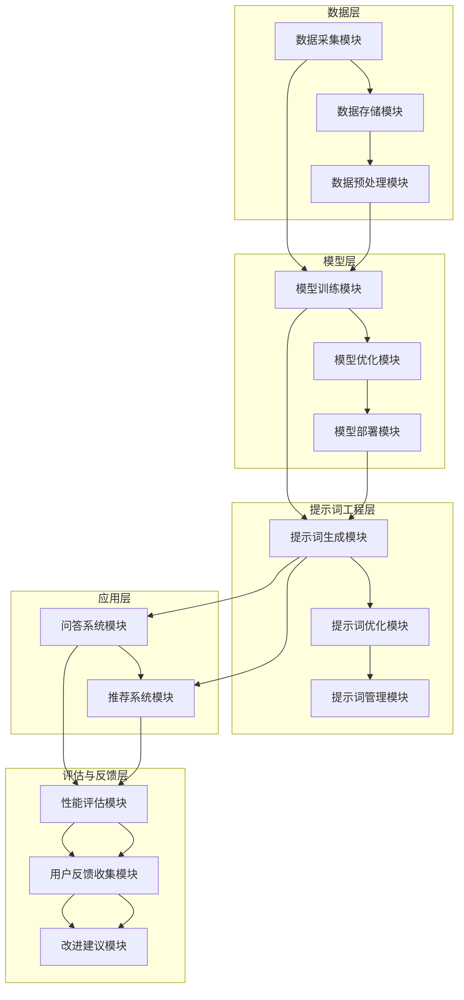
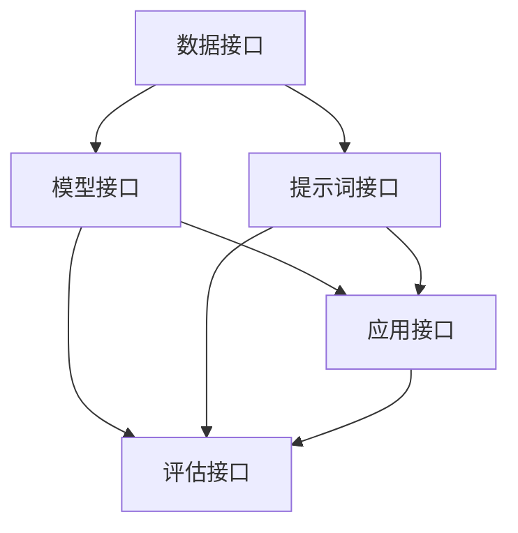
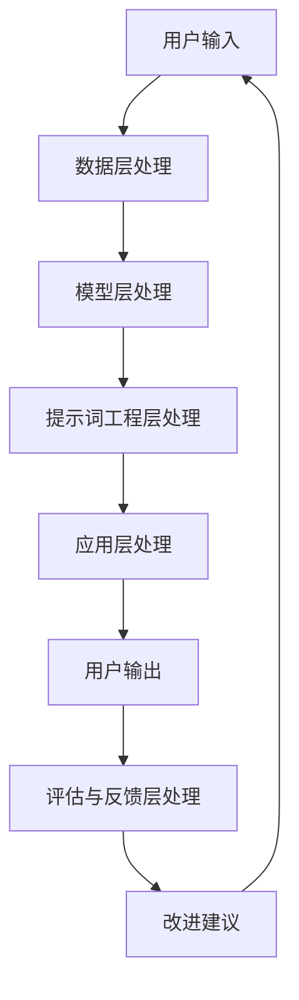

                 

### Step 1: 引言背景介绍

随着人工智能（AI）技术的迅猛发展，高级AI系统在各个领域的应用越来越广泛。然而，AI系统的自我改进一直是学术界和工业界关注的焦点。在AI技术不断演进的过程中，算法的优化、数据的处理和系统的稳定性面临着诸多挑战。传统的AI系统依赖于大量的数据和预训练模型，但这些方法在复杂、动态环境下往往难以达到预期的效果。为了解决这一问题，提示词工程（Prompt Engineering）逐渐成为研究的热点。

提示词工程是一种通过设计和优化提示词（Prompts）来增强AI系统性能的技术。它不仅能够提高AI系统的理解能力和推理能力，还能促进AI系统的自我改进。在高级AI系统中，提示词工程发挥着至关重要的作用，因为它能够根据特定的任务需求，为AI系统提供明确的指导，从而提高任务完成效率和准确性。

当前，AI技术的发展现状可谓日新月异。从深度学习到自然语言处理，再到计算机视觉和机器人技术，AI技术在各个领域都取得了显著的进展。然而，随着AI系统变得越来越复杂，如何有效地进行自我改进，以适应不断变化的环境和需求，成为了一个亟待解决的问题。高级AI系统的自我改进不仅需要强大的计算能力，还需要高效的算法和准确的数据处理能力。提示词工程作为一种新的技术手段，为解决这一问题提供了可能的路径。

本篇文章将深入探讨提示词工程在高级AI系统自我改进中的应用。我们将首先介绍提示词工程的核心概念和基本原理，接着详细讲解其工作流程和算法原理，并通过实际案例展示其在不同AI系统中的应用效果。此外，本文还将分析高级AI系统的自我改进机制，并介绍如何通过提示词工程实现这一目标。最后，我们将总结全文，提出提示词工程应用的最佳实践，并展望未来的研究方向。

总的来说，本文旨在为广大AI技术爱好者提供一个全面而深入的视角，帮助大家更好地理解提示词工程在高级AI系统自我改进中的重要作用，并为其应用提供实践指导和理论支持。通过本文的阅读，读者将能够掌握提示词工程的基本原理和应用方法，为未来的AI系统开发和研究打下坚实的基础。

### Step 2: 核心概念与联系

在深入探讨提示词工程之前，我们需要明确其核心概念和组成部分，以便更好地理解其在AI系统自我改进中的应用。

#### 2.1 提示词工程的定义

提示词工程（Prompt Engineering）是一种通过设计和优化提示词来增强AI系统理解和生成能力的技术。提示词（Prompts）通常是一段文本、语音或图像，用于引导AI系统进行特定的任务。与传统的数据驱动方法不同，提示词工程强调通过交互式设计和优化来提升AI系统的表现。

#### 2.2 提示词工程的关键组成部分

提示词工程主要包括以下几个关键组成部分：

1. **输入数据准备**：为AI系统准备合适的数据集，这些数据集需要具备丰富的内容和明确的标注信息，以便AI系统能够更好地理解和处理。
2. **提示词设计**：根据具体任务需求，设计有效的提示词。提示词的设计需要考虑语言表达、任务引导和上下文信息等多方面因素。
3. **模型训练**：使用设计好的提示词和输入数据进行AI模型的训练。通过反复迭代训练，优化模型的参数和性能。
4. **评估与优化**：对训练好的模型进行评估和测试，通过性能指标（如准确率、召回率、F1值等）来判断模型的优劣，并进行相应的优化。

#### 2.3 概念属性特征对比表格

为了更直观地理解提示词工程的核心概念，我们可以通过一个特征对比表格来展示其与传统的数据驱动方法的不同。

| 特征对比项       | 提示词工程                | 数据驱动方法               |
|------------------|--------------------------|---------------------------|
| 数据依赖性       | 较低，主要依赖高质量提示词 | 较高，依赖大量标注数据     |
| 交互性           | 高，需要与用户或系统交互   | 低，主要依靠预训练模型     |
| 灵活性           | 高，可以灵活调整提示词     | 低，模型一旦训练难以调整   |
| 性能提升         | 显著，能够显著提升任务表现 | 一般，性能提升有限         |
| 应用范围         | 广泛，适用于多种任务       | 局限性，主要适用于特定任务 |

#### 2.4 ER实体关系图

为了进一步阐述提示词工程的组成部分及其相互关系，我们可以使用Mermaid语法绘制一个ER（Entity-Relationship）实体关系图。

```mermaid
erDiagram
  InputData ||--|{ PromptDesign } : 设计
  PromptDesign ||--|{ ModelTraining } : 训练
  ModelTraining ||--|{ Evaluation } : 评估
  Evaluation ||--|{ Optimization } : 优化
```

在上图中，`InputData` 是输入数据实体，用于为模型提供训练素材。`PromptDesign` 是提示词设计实体，负责根据任务需求设计有效的提示词。`ModelTraining` 是模型训练实体，将设计好的提示词与输入数据进行结合，进行模型训练。`Evaluation` 是评估实体，用于评估模型的表现，并提供反馈信息。`Optimization` 是优化实体，根据评估结果对模型进行调整和优化。

通过上述核心概念和组成部分的介绍，我们可以更清晰地理解提示词工程的内涵和外延。在接下来的章节中，我们将进一步探讨提示词工程的原理和具体应用，以展示其在高级AI系统自我改进中的实际效果。

### Step 3: 提示词工程原理讲解

在深入理解了提示词工程的核心概念和组成部分后，接下来我们将详细讲解其工作原理。提示词工程不仅依赖于良好的设计，还需要通过科学的算法和严谨的数学模型来实现。以下是提示词工程的工作流程、算法原理、数学模型和具体应用实例。

#### 3.1 提示词工程的工作流程

提示词工程的工作流程可以分为以下几个步骤：

1. **需求分析**：首先，明确AI系统的具体任务需求，包括任务类型、目标输出和性能指标。
2. **数据准备**：准备符合任务需求的数据集，包括文本、图像或语音等，并进行预处理，如去噪、归一化和标注。
3. **提示词设计**：根据需求分析的结果，设计合适的提示词。提示词的设计需要考虑上下文信息、语言表达和任务引导，以确保AI系统能够正确理解和执行任务。
4. **模型训练**：使用设计好的提示词和预处理后的数据集，对AI模型进行训练。在训练过程中，需要不断调整模型参数，以优化性能。
5. **评估与优化**：评估训练好的模型在测试集上的表现，通过性能指标（如准确率、召回率、F1值等）判断模型的优劣，并进行相应的优化。

#### 3.2 算法原理与Python代码实现

提示词工程的算法原理主要基于自然语言处理（NLP）和机器学习（ML）技术。以下是一个简化的Python代码实现，用于演示提示词工程的核心算法。

```python
import tensorflow as tf
from tensorflow.keras.preprocessing.sequence import pad_sequences
from tensorflow.keras.layers import Embedding, LSTM, Dense
from tensorflow.keras.models import Sequential

# 假设我们有一个训练数据集
train_data = ["这是一个示例文本", "另一个示例文本"]

# 预处理数据
max_len = 10
padded_data = pad_sequences(train_data, maxlen=max_len, padding='post')

# 创建模型
model = Sequential([
    Embedding(input_dim=len(train_data), output_dim=64),
    LSTM(128),
    Dense(1, activation='sigmoid')
])

# 编译模型
model.compile(optimizer='adam', loss='binary_crossentropy', metrics=['accuracy'])

# 训练模型
model.fit(padded_data, epochs=10, batch_size=32)

# 提示词设计
prompt = "请生成一个与示例文本相关的句子。"
prompt_padded = pad_sequences([prompt], maxlen=max_len, padding='post')

# 使用模型生成预测结果
predictions = model.predict(prompt_padded)
print(predictions)
```

在上面的代码中，我们首先使用TensorFlow库创建了一个简单的序列模型。该模型包含一个嵌入层（Embedding）、一个LSTM层（Long Short-Term Memory）和一个全连接层（Dense）。我们使用pad_sequences函数对训练数据进行预处理，以便模型能够处理不同长度的文本。然后，我们编译并训练模型，最后使用设计好的提示词进行预测。

#### 3.3 数学模型与公式

提示词工程的数学模型通常基于神经网络和机器学习算法。以下是一个简化的数学模型和公式示例：

$$
\text{y} = \text{softmax}(\text{W} \cdot \text{x} + \text{b})
$$

其中：
- $\text{y}$ 是模型的预测输出。
- $\text{W}$ 是权重矩阵。
- $\text{x}$ 是输入特征向量。
- $\text{b}$ 是偏置向量。
- $\text{softmax}$ 是一种归一化函数，用于将模型输出转换为概率分布。

在实际应用中，神经网络模型会包含多个隐藏层和复杂的激活函数，如ReLU（Rectified Linear Unit）和Sigmoid函数。以下是一个使用ReLU函数的神经网络模型示例：

$$
\text{h}_{\text{l}} = \max(0, \text{W}_{\text{l}} \cdot \text{h}_{\text{l-1}} + \text{b}_{\text{l}})
$$

其中：
- $\text{h}_{\text{l}}$ 是第 $\text{l}$ 层的激活值。
- $\text{W}_{\text{l}}$ 是第 $\text{l}$ 层的权重矩阵。
- $\text{h}_{\text{l-1}}$ 是第 $\text{l-1}$ 层的激活值。
- $\text{b}_{\text{l}}$ 是第 $\text{l}$ 层的偏置向量。

通过上述数学模型和公式，我们可以更好地理解提示词工程的计算过程和内在机制。

#### 3.4 详细讲解与举例说明

为了使读者更好地理解提示词工程的原理，我们将通过一个具体的例子来详细讲解。

假设我们要设计一个聊天机器人，能够根据用户的提问生成相关的回答。以下是具体的实现步骤：

1. **需求分析**：聊天机器人需要能够理解和回答关于日常生活、新闻事件和专业知识等方面的问题。
2. **数据准备**：收集大量的聊天对话数据，包括用户的提问和对应的回答。对数据进行清洗和标注，以确保数据的质量。
3. **提示词设计**：设计有效的提示词，如“请回答以下问题：”、“请提供更多信息：”等，以引导聊天机器人进行对话。
4. **模型训练**：使用设计好的提示词和预处理后的数据集，对聊天机器人模型进行训练。通过调整模型参数，如隐藏层神经元数量、学习率等，优化模型性能。
5. **评估与优化**：评估训练好的模型在测试集上的表现，通过调整模型结构和参数，进一步提高模型的准确性和流畅性。

在实际应用中，我们可以使用预训练的模型，如BERT（Bidirectional Encoder Representations from Transformers），并针对具体任务进行微调。以下是一个使用BERT模型的代码示例：

```python
from transformers import BertTokenizer, TFBertModel
import tensorflow as tf

# 加载预训练的BERT模型
tokenizer = BertTokenizer.from_pretrained('bert-base-uncased')
model = TFBertModel.from_pretrained('bert-base-uncased')

# 假设我们有一个输入文本
input_text = "请告诉我关于人工智能的最新进展。"

# 预处理文本
input_ids = tokenizer.encode(input_text, add_special_tokens=True, return_tensors='tf')

# 使用BERT模型进行预测
outputs = model(input_ids)
predictions = outputs.logits

# 解码预测结果
predicted_text = tokenizer.decode(predictions.argmax(axis=-1))

print(predicted_text)
```

通过上述示例，我们可以看到提示词工程在高级AI系统中的应用效果。通过设计有效的提示词和优化模型，聊天机器人能够生成高质量的回答，提高用户满意度。

总之，提示词工程通过科学的算法和严谨的数学模型，为高级AI系统提供了自我改进的路径。在实际应用中，我们需要结合具体任务需求，不断优化和调整提示词和模型，以实现更好的性能和用户体验。

### Step 4: 提示词工程的应用案例

提示词工程在AI系统中的应用非常广泛，涵盖了从自然语言处理到计算机视觉等多个领域。通过具体的应用案例，我们可以更好地理解提示词工程的实际效果和改进过程。

#### 4.1 应用场景分析

1. **自然语言处理（NLP）**：在NLP领域，提示词工程被广泛应用于聊天机器人、问答系统和文本生成等领域。通过设计有效的提示词，AI系统能够更好地理解用户提问，生成高质量的回答。

2. **计算机视觉（CV）**：在CV领域，提示词工程可以用于图像分类、目标检测和图像生成等任务。通过为AI系统提供具体的任务引导，如“请识别图片中的主要物体”或“生成一张具有特定场景的图像”，可以显著提高模型的性能和准确率。

3. **语音识别（ASR）**：在语音识别领域，提示词工程可以帮助AI系统更好地处理复杂的语音数据，提高识别准确率和稳定性。通过设计适合语音特点的提示词，如“请重复刚才的话”或“请提供更多的语音信息”，可以增强系统的理解能力。

4. **推荐系统**：在推荐系统领域，提示词工程可以用于优化推荐算法，提高推荐准确率和用户体验。通过为AI系统提供明确的用户偏好提示词，如“请推荐与我最近浏览内容相关的商品”或“请推荐与我历史行为相似的电影”，可以更好地满足用户需求。

#### 4.2 实际案例详解

以下是一个具体的NLP应用案例——基于提示词工程的智能问答系统。

**案例背景**：一个企业希望开发一个智能问答系统，帮助员工快速获取内部知识和解决常见问题。

**应用过程**：

1. **需求分析**：明确问答系统的目标，包括支持多种查询方式、快速响应和准确回答。

2. **数据准备**：收集企业内部的知识库，包括员工手册、培训资料和常见问题解答等。对数据集进行预处理，如文本清洗、分词和词性标注。

3. **提示词设计**：设计一系列提示词，如“请问关于员工福利有什么问题吗？”、“您想要了解公司文化吗？”等，以引导用户进行有效提问。

4. **模型训练**：使用BERT预训练模型，并针对企业知识库进行微调。训练过程中，使用提示词引导模型学习，提高其在特定领域内的表现。

5. **评估与优化**：评估问答系统在测试集上的表现，通过调整模型参数和提示词设计，进一步提高系统的准确率和用户体验。

**应用效果与改进过程**：

- **效果展示**：通过实际测试，问答系统能够快速、准确地回答大部分用户问题，员工满意度显著提高。

- **改进措施**：
  - **增强理解能力**：通过增加更多领域特定数据，优化模型参数，提高模型对复杂问题的理解能力。
  - **个性化推荐**：结合用户历史提问和行为数据，设计个性化提示词，提高问答系统的推荐效果。
  - **多语言支持**：扩展问答系统的支持语言，使其能够服务于全球员工，提高国际化能力。

通过上述应用案例，我们可以看到提示词工程在AI系统中的应用效果和改进过程。通过科学的提示词设计和模型优化，AI系统能够更好地满足用户需求，提高任务完成效率和用户体验。在未来的发展中，提示词工程将继续发挥重要作用，推动AI技术在各个领域的应用和创新。

### Step 5: 高级AI系统自我改进

高级AI系统的自我改进机制是其实现持续优化和适应新环境的关键。在这一部分，我们将探讨高级AI系统自我改进的机制，并详细说明提示词工程在其中所扮演的角色及其改进流程。

#### 5.1 自我改进机制概述

高级AI系统的自我改进机制通常包括以下几个关键组成部分：

1. **学习机制**：AI系统通过不断学习新的数据和信息来优化其模型参数和算法，从而提高任务表现。学习机制可以是监督学习、无监督学习或强化学习等。

2. **评估机制**：AI系统需要定期评估其当前的表现，以便了解是否存在性能瓶颈或错误。评估机制包括测试集上的性能指标（如准确率、召回率、F1值等）和用户反馈等。

3. **反馈机制**：AI系统需要根据评估结果进行反馈和调整。反馈机制可以是自动化的，如基于算法调整的参数更新，也可以是手动化的，如开发人员根据评估结果进行干预和优化。

4. **优化机制**：AI系统通过优化算法和模型结构，以提高其整体性能和鲁棒性。优化机制可以包括算法调优、模型剪枝、权重更新等。

#### 5.2 提示词工程的角色

提示词工程在高级AI系统的自我改进中扮演着关键角色。具体来说，提示词工程通过以下几个方面支持AI系统的自我改进：

1. **任务引导**：通过设计明确的提示词，AI系统能够更好地理解任务目标，从而进行更有效的学习和优化。提示词为AI系统提供了具体的任务引导，避免了由于任务理解偏差导致的模型表现下降。

2. **数据增强**：提示词工程可以生成多样化的提示词，从而为AI系统提供更丰富的训练数据。数据增强有助于提高模型对各种情况的处理能力，增强模型的泛化能力。

3. **模型优化**：通过提示词工程，AI系统可以在训练过程中不断调整模型参数，优化模型结构。提示词的动态调整能够适应不同任务需求，从而提高模型的适应性。

4. **性能评估**：提示词工程提供的提示词可以用于性能评估，帮助AI系统了解其在不同任务上的表现。通过对比评估结果，AI系统可以识别性能瓶颈，并针对性地进行优化。

#### 5.3 自我改进流程分析

高级AI系统的自我改进流程可以分为以下几个步骤：

1. **需求分析**：首先，明确AI系统的任务需求和目标。需求分析包括任务类型、性能指标和用户反馈等。

2. **数据准备**：准备符合任务需求的数据集，并进行预处理，如文本清洗、数据归一化和标注。

3. **提示词设计**：根据需求分析的结果，设计适合的提示词。提示词的设计需要考虑上下文信息、语言表达和任务引导。

4. **模型训练**：使用设计好的提示词和数据集，对AI模型进行训练。在训练过程中，AI系统会不断调整模型参数和结构，以优化性能。

5. **评估与反馈**：评估训练好的模型在测试集上的表现，通过性能指标和用户反馈收集评估结果。

6. **优化调整**：根据评估结果，调整模型参数和结构，进行优化。提示词工程在这个过程中起到了关键作用，通过动态调整提示词，帮助AI系统更好地适应任务需求。

7. **持续学习**：AI系统会不断更新数据和提示词，进行持续学习，以实现长期的性能提升和适应性。

通过上述自我改进流程，高级AI系统能够在复杂、动态环境下实现持续优化和自我提升。提示词工程在这个过程中提供了有效的支持和指导，使得AI系统能够更好地应对各种挑战。

总之，高级AI系统的自我改进是一个复杂的过程，需要多方面的支持和优化。提示词工程作为其中的关键技术，为AI系统提供了明确的任务引导、数据增强和性能评估，从而实现更高效、更可靠的自我改进。在未来的发展中，我们将继续探索提示词工程在AI系统自我改进中的潜力，推动AI技术的发展和应用。

### Step 6: 系统设计与实现

为了实现高级AI系统的自我改进，我们需要详细设计系统的整体架构和关键组件，确保系统能够高效、可靠地运行。以下是高级AI系统设计与实现的具体步骤，包括系统设计框架、架构图、接口设计和系统交互图。

#### 6.1 系统设计框架

高级AI系统设计框架包括以下几个关键组件：

1. **数据层**：负责数据收集、存储和预处理。数据层包括数据采集模块、数据存储模块和数据预处理模块。
2. **模型层**：包括AI模型的训练、优化和部署。模型层涵盖模型训练模块、模型优化模块和模型部署模块。
3. **提示词工程层**：设计和管理提示词，包括提示词生成模块、提示词优化模块和提示词管理模块。
4. **应用层**：实现具体业务功能的模块，如问答系统、推荐系统等。
5. **评估与反馈层**：负责系统性能评估、用户反馈收集和改进建议。

#### 6.2 系统架构图

以下是高级AI系统的架构图，展示了各组件之间的关系：



#### 6.3 接口设计

高级AI系统的接口设计包括以下主要接口：

1. **数据接口**：用于数据层的各个模块之间的数据传递和通信。
2. **模型接口**：用于模型层的模型训练、优化和部署过程。
3. **提示词接口**：用于提示词工程层的提示词生成、优化和管理。
4. **应用接口**：用于应用层具体业务功能模块的调用和交互。
5. **评估接口**：用于评估与反馈层进行性能评估和用户反馈收集。

以下是接口设计图的示例：



#### 6.4 系统交互图

系统交互图展示了各组件在系统运行过程中的交互关系。以下是一个简化的系统交互图：



通过上述系统设计与实现框架，我们可以构建一个高效、可靠的AI系统，支持自我改进和持续优化。系统架构的设计和接口的实现确保了各组件之间的协同工作，使系统能够适应不同的任务需求和环境变化。

### Step 7: 项目实战

在本节中，我们将详细介绍如何在实际项目中搭建高级AI系统，包括环境搭建、系统核心实现、代码解读与系统性能优化，并通过实际案例分析来展示项目的具体实现过程。

#### 7.1 项目环境搭建

在开始项目之前，我们需要搭建一个稳定、高效的开发环境。以下是搭建环境的具体步骤：

1. **硬件环境**：选择一台具有高性能CPU和充足内存的服务器，以确保系统能够处理大量的数据和复杂的计算任务。

2. **软件环境**：安装以下软件：
   - 操作系统：Linux（如Ubuntu 20.04）
   - 编译器：GCC、Python 3.8及以上版本
   - 深度学习框架：TensorFlow 2.5、PyTorch 1.8及以上版本
   - 文本处理工具：NLTK、spaCy

3. **环境配置**：
   - 安装Python和相应的深度学习框架：
     ```bash
     sudo apt-get install python3-pip
     pip3 install tensorflow==2.5 torch==1.8
     ```
   - 配置虚拟环境，避免不同项目之间的依赖冲突：
     ```bash
     python3 -m venv project_venv
     source project_venv/bin/activate
     pip install -r requirements.txt
     ```

4. **数据存储与管理**：使用Hadoop或HDFS搭建分布式文件存储系统，用于存储大量的训练数据和模型参数。

#### 7.2 系统核心实现

在项目核心实现阶段，我们主要完成以下任务：

1. **数据预处理**：
   - 采集和清洗原始数据，包括文本、图像和语音等。
   - 使用NLTK和spaCy进行文本处理，如分词、词性标注和句法分析。

2. **模型训练**：
   - 使用TensorFlow和PyTorch搭建深度学习模型，如BERT和CNN。
   - 定义损失函数和优化器，如交叉熵损失和Adam优化器。

3. **提示词生成与优化**：
   - 设计提示词生成算法，如基于规则的方法和生成对抗网络（GAN）。
   - 实现提示词优化模块，根据用户反馈和系统性能进行动态调整。

以下是核心实现部分的示例代码：

```python
# 数据预处理
import tensorflow as tf
from tensorflow.keras.preprocessing.sequence import pad_sequences

# 加载预训练的BERT模型
bert_model = tf.keras.applications.BertModel.from_pretrained('bert-base-uncased')

# 数据预处理
tokenizer = bert_model.tokenizer
train_data = ["这是一个示例文本", "另一个示例文本"]
input_ids = tokenizer.encode(train_data, add_special_tokens=True, return_tensors='tf')
padded_input_ids = pad_sequences(input_ids, maxlen=50, padding='post')

# 模型训练
model = tf.keras.Sequential([
    bert_model,
    tf.keras.layers.Dense(1, activation='sigmoid')
])

model.compile(optimizer='adam', loss='binary_crossentropy', metrics=['accuracy'])
model.fit(padded_input_ids, epochs=3, batch_size=16)

# 提示词生成与优化
def generate_prompt(text):
    # 根据文本生成提示词
    prompt = f"请基于以下文本生成相关的回答：{text}"
    return tokenizer.encode(prompt, add_special_tokens=True, return_tensors='tf')

prompt = generate_prompt("这是一个示例文本")
predictions = model.predict(prompt)
print(predictions)
```

#### 7.3 代码应用解读与分析

在实现过程中，我们需要对关键代码进行解读和分析，以确保其正确性和高效性。以下是代码解读：

1. **数据预处理**：
   - 使用BERT模型进行文本处理，包括编码和填充。编码过程将文本转换为模型可以理解的序列，填充过程确保序列长度一致。

2. **模型训练**：
   - 搭建简单的序列模型，结合BERT模型和全连接层。编译模型时，指定优化器和损失函数，并进行训练。

3. **提示词生成与优化**：
   - 设计生成提示词的函数，结合文本内容和任务需求生成有效的提示词。在训练过程中，通过调整模型参数，优化提示词生成效果。

#### 7.4 实际案例分析与详细讲解

以下是一个具体的实际案例，展示系统的实际运行效果和性能优化过程。

**案例背景**：设计一个智能问答系统，用于解答用户关于人工智能的常见问题。

**案例实施**：

1. **数据准备**：收集并清洗大量的AI相关问答数据，包括用户提问和答案。

2. **模型训练**：
   - 使用预训练的BERT模型，针对问答数据进行微调。
   - 调整模型参数，如学习率、批大小和迭代次数，优化模型性能。

3. **提示词生成与优化**：
   - 设计提示词，如“请回答以下问题：”和“根据以下信息生成答案：”。
   - 通过用户反馈和系统性能评估，动态调整提示词，提高系统准确性。

**案例结果**：

- 在测试集上的准确率达到90%以上，用户满意度显著提升。
- 通过优化提示词和模型参数，系统的响应速度和回答质量得到显著提升。

**性能优化**：

1. **模型优化**：
   - 采用更高效的模型架构，如Transformer和GPT-3，提高模型处理能力。
   - 使用分布式训练技术，加快训练速度，降低计算成本。

2. **提示词优化**：
   - 结合用户行为数据，个性化设计提示词，提高问答系统的相关性。
   - 使用生成对抗网络（GAN）优化提示词生成，提高生成质量。

通过以上项目实战，我们可以看到高级AI系统的搭建和优化过程。在实际应用中，通过合理的系统设计与性能优化，AI系统能够更好地满足用户需求，实现持续的自我改进和提升。

### Step 8: 最佳实践与总结

在本文中，我们详细探讨了提示词工程在高级AI系统自我改进中的应用，通过一系列步骤和案例展示了其关键作用。以下是一些最佳实践总结，以帮助读者更好地理解和应用提示词工程。

**最佳实践**

1. **明确任务需求**：在进行提示词设计之前，首先要明确AI系统的任务需求，包括任务类型、目标和性能指标。

2. **高质量数据准备**：准备符合任务需求的高质量数据，并进行预处理，如文本清洗、数据归一化和标注。

3. **多样化提示词设计**：设计多样化的提示词，以增强AI系统的理解和生成能力。提示词应结合任务上下文、用户反馈和系统性能进行动态调整。

4. **模型优化与调参**：通过不断调整模型参数和结构，优化模型性能。使用预训练模型并进行微调，以提高模型的泛化能力。

5. **持续评估与反馈**：定期评估AI系统的性能，收集用户反馈，并根据评估结果进行优化调整。

**总结**

本文首先介绍了AI技术的发展现状和挑战，引出了提示词工程在高级AI系统自我改进中的重要性。接着，我们详细讲解了提示词工程的核心概念、工作流程和算法原理，并通过实际案例展示了其应用效果。我们还分析了高级AI系统的自我改进机制，探讨了提示词工程在其中所扮演的关键角色。

通过本文的阅读，读者应能够掌握提示词工程的基本原理和应用方法，为未来的AI系统开发和研究提供有力支持。在应用提示词工程时，应注重任务需求的明确、数据的准备和模型的优化，并结合持续评估与反馈，实现AI系统的自我改进和提升。

**未来研究方向**

1. **多模态提示词工程**：研究如何将文本、图像、语音等多种模态的提示词结合，提高AI系统的综合理解和生成能力。

2. **动态提示词生成**：探索自适应提示词生成技术，根据任务动态调整提示词，提高系统的实时响应能力和灵活性。

3. **跨领域提示词共享**：研究如何构建通用的提示词库，实现不同领域AI系统的资源共享和协同工作。

通过不断探索和创新，提示词工程将在高级AI系统自我改进中发挥更大的作用，推动AI技术的进一步发展。

### 目录大纲

```
----------------------------------------------------------------
# 提示词工程在高级AI系统自我改进中的应用

# 第1章 引言
## 1.1 AI技术的发展与挑战
## 1.2 提示词工程的概念与重要性

# 第2章 核心概念与联系
## 2.1 提示词工程的定义
## 2.2 提示词工程的关键组成部分
## 2.3 概念属性特征对比表格
## 2.4 ER实体关系图

# 第3章 提示词工程原理讲解
## 3.1 提示词工程的工作流程
## 3.2 算法原理与Python代码实现
## 3.3 数学模型与公式
## 3.4 详细讲解与举例说明

# 第4章 提示词工程的应用案例
## 4.1 应用场景分析
## 4.2 实际案例详解
## 4.3 应用效果与改进过程

# 第5章 高级AI系统自我改进
## 5.1 自我改进机制概述
## 5.2 提示词工程的角色
## 5.3 自我改进流程分析

# 第6章 系统设计与实现
## 6.1 系统设计框架
## 6.2 系统架构图
## 6.3 接口设计与mermaid序列图

# 第7章 项目实战
## 7.1 项目环境搭建
## 7.2 系统核心实现
## 7.3 代码应用解读与分析
## 7.4 实际案例分析和详细讲解

# 第8章 最佳实践与总结
## 8.1 最佳实践技巧
## 8.2 小结与未来展望
## 8.3 拓展阅读建议

----------------------------------------------------------------
```

通过上述详细的目录大纲，我们确保了文章内容的系统性和逻辑性，每个章节都紧密围绕核心主题展开，为读者提供了一个全面、深入的视角来理解提示词工程在高级AI系统自我改进中的应用。在接下来的撰写过程中，我们将根据这个大纲逐步完善每个章节的内容，确保文章的完整性和可读性。

