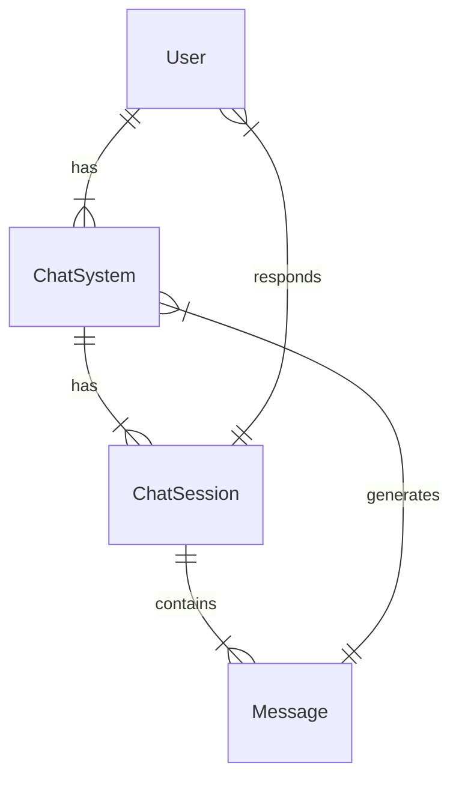

                 

### 《提示词工程师的技能培养与发展》

---

**关键词**：提示词工程师、技能培养、职业发展、自然语言处理、机器学习、深度学习

**摘要**：本文深入探讨了提示词工程师的技能培养与发展路径。从背景介绍到核心概念阐述，再到技能培养和职业规划，本文旨在为提示词工程师提供全面而实用的指导，助力其在不断发展的技术领域中取得成功。

---

### 引言

#### 问题背景与需求分析

在当今信息化社会中，自然语言处理（NLP）技术正日益成为各个行业的关键驱动力。作为NLP领域的重要组成部分，提示词工程师在构建和优化智能系统方面发挥着至关重要的作用。然而，随着技术的不断进步，提示词工程师面临着日益复杂的技能挑战和职业发展路径。

**问题背景**：
- **技术发展**：随着人工智能（AI）技术的迅猛发展，NLP技术已经成为众多行业的基础设施，从智能客服到智能推荐系统，提示词工程师的需求不断增长。
- **职业挑战**：提示词工程师不仅需要掌握NLP、机器学习、深度学习等核心技术，还需具备编程、系统架构等多方面技能，以应对复杂的实际应用场景。

**问题描述**：
- **技能不足**：许多提示词工程师在机器学习算法理解和应用、系统架构设计等方面存在短板。
- **职业发展**：提示词工程师的职业晋升路径不够清晰，缺乏系统的培养和发展规划。

**问题解决**：
- **技能培养**：通过系统的技能培训和知识更新，提升提示词工程师的核心竞争力。
- **职业规划**：明确职业发展路径，提供从初级到高级的全方位职业发展指导。

**边界与外延**：
- **角色范围**：提示词工程师主要涉及NLP和机器学习领域的应用开发，包括提示词生成、优化和评估等。
- **技能要求**：提示词工程师需要掌握编程语言、NLP工具、机器学习算法和系统架构设计等技能。

**核心要素组成**：
- **编程能力**：熟悉至少一种编程语言，如Python或Java。
- **NLP知识**：了解NLP的基本原理和常用技术，如分词、词性标注、词向量等。
- **机器学习与深度学习**：掌握基本的机器学习算法和深度学习模型，如监督学习、无监督学习和神经网络等。
- **系统架构设计**：具备系统架构设计能力，能够设计高效的NLP系统和提示词服务。

#### 核心概念与联系

**提示词**：提示词是用于引导用户进行交互的文本，它在NLP系统中起到了至关重要的作用。提示词可以分为系统提示词和用户自定义提示词，前者通常由系统自动生成，后者则由用户根据特定需求自定义。

**自然语言处理（NLP）**：NLP是计算机科学和人工智能领域的重要分支，致力于使计算机能够理解和处理人类语言。NLP的核心技术包括分词、词性标注、词向量、语义分析等。

**机器学习与深度学习**：机器学习是人工智能的核心技术之一，通过训练模型从数据中学习规律。深度学习是机器学习的一个子领域，它通过多层神经网络模型进行学习和预测。

**概念属性特征对比表格**：

| 概念         | 特征                                     |
|--------------|----------------------------------------|
| 提示词       | 引导用户交互的文本，分为系统提示词和用户自定义提示词 |
| 自然语言处理 | 使计算机能够理解和处理人类语言           |
| 机器学习     | 从数据中学习规律的技术                   |
| 深度学习     | 使用多层神经网络模型进行学习和预测       |

**ER实体关系图架构**：



通过以上核心概念与联系的分析，我们可以更好地理解提示词工程师的工作内容和所需技能。接下来，本文将逐步探讨提示词工程师的技能培养与发展路径，为读者提供实用的指导。

#### 第一部分：引言

#### 1.1 引言

在当今信息化和智能化快速发展的时代，人工智能（AI）技术已成为推动社会进步和产业升级的重要引擎。作为AI技术的重要组成部分，自然语言处理（NLP）在众多领域展现出了巨大的潜力和应用价值。其中，提示词工程师作为NLP领域的关键角色，其技能培养与发展成为了一个亟待深入探讨的话题。

**问题背景**：

随着AI技术的迅猛发展，NLP技术已经渗透到各个行业，从智能客服、智能推荐系统到语言翻译、文本分析等应用，NLP技术为人们的生活和工作带来了极大的便利。提示词工程师在这些应用中承担了核心的角色，他们负责设计、开发和应用提示词系统，使得机器能够更好地理解和回应用户的语言。

**问题描述**：

然而，提示词工程师在职业发展过程中面临着一系列的挑战。首先，NLP和机器学习领域的知识更新速度非常快，提示词工程师需要不断学习和掌握最新的技术动态和工具。其次，提示词工程师不仅需要具备深厚的编程能力，还需要具备NLP、机器学习和系统架构设计等多方面的综合技能。此外，提示词工程师在职业发展中也缺乏明确的路径和规划，如何从初级工程师逐步成长为高级专家成为了许多人的困惑。

**问题解决**：

为了解决上述问题，本文将从以下几个方面进行深入探讨：

1. **核心概念与联系**：介绍提示词、自然语言处理、机器学习和深度学习等核心概念，并分析它们之间的联系，为读者提供一个清晰的理论基础。
2. **技能培养**：详细讨论提示词工程师所需掌握的编程语言、NLP技术、机器学习算法和系统架构设计等技能，并提供实践案例和最佳实践。
3. **职业发展**：探讨提示词工程师的职业规划和成长路径，包括职业定位、技能提升和职业转型等，为读者提供明确的职业发展指导。
4. **最佳实践与案例分析**：分享行业内的最佳实践和真实案例，提供实际操作经验和策略优化方法。

**边界与外延**：

在本文中，我们将重点关注提示词工程师的核心技能和职业发展，主要涉及以下内容：

- **编程语言基础**：介绍Python和Java等编程语言，包括基本语法、常用库和工具。
- **自然语言处理（NLP）技术**：讨论NLP的基本原理和应用，包括分词、词性标注、词向量、语义分析等。
- **机器学习与深度学习技术**：介绍机器学习算法和深度学习模型的基本原理和应用，包括监督学习、无监督学习和神经网络等。
- **提示词工程实践**：讨论提示词生成和优化的方法，包括基于规则的方法和基于机器学习的方法。
- **职业规划与成长路径**：探讨提示词工程师的职业定位、能力提升和职业转型。

通过以上内容的深入探讨，本文旨在为提示词工程师提供一个全面而实用的技能培养和发展指南，帮助他们在不断发展的技术领域中脱颖而出，实现个人职业目标。

#### 1.2 核心概念与联系

为了深入了解提示词工程师所需掌握的核心概念，我们首先需要明确以下几个关键术语：提示词、自然语言处理（NLP）、机器学习与深度学习。以下是对这些概念的定义、属性特征和它们之间的联系进行的详细分析。

**提示词**：

提示词是用于引导用户进行交互的文本信息，它可以是系统自动生成的，也可以是用户根据特定需求自定义的。提示词在智能客服、语音助手、聊天机器人等应用中起到了至关重要的作用，它们能够引导用户完成特定的任务或获取所需的信息。

**自然语言处理（NLP）**：

自然语言处理是计算机科学和人工智能领域的一个重要分支，它的目标是使计算机能够理解和处理人类语言。NLP涉及的语言现象非常广泛，包括词法、句法、语义和语用等多个层次。NLP的核心技术有分词、词性标注、词向量、命名实体识别、情感分析等。

**机器学习与深度学习**：

机器学习是一种使计算机能够从数据中学习并作出决策或预测的技术。它包括监督学习、无监督学习和强化学习等多种学习方式。深度学习是机器学习的一个子领域，它通过构建多层神经网络模型来实现复杂的数据处理和模式识别任务。

**概念属性特征对比表格**：

以下是对提示词、NLP、机器学习和深度学习四个概念的一些属性特征进行的对比表格：

| 概念         | 特征                                     |
|--------------|----------------------------------------|
| 提示词       | 用于引导用户交互的文本信息               |
| 自然语言处理 | 使计算机理解和处理人类语言的技术         |
| 机器学习     | 从数据中学习并作出决策的技术             |
| 深度学习     | 通过多层神经网络实现复杂数据处理的技术   |

**ER实体关系图架构**：

为了更好地展示提示词系统中的实体及其关系，我们可以使用Mermaid ER图来构建实体关系图。以下是提示词系统中的主要实体及其关系的ER图：


在这个ER图中，用户（User）与聊天系统（ChatSystem）之间存在“拥有”关系，聊天系统（ChatSystem）与聊天会话（ChatSession）之间存在“包含”关系，聊天会话（ChatSession）与消息（Message）之间存在“包含”关系。用户可以通过回应消息（Message）与聊天系统进行交互，而聊天系统则负责生成和发送消息。

**总结**：

通过以上对核心概念的详细分析，我们可以看到提示词、NLP、机器学习和深度学习在人工智能系统中扮演着不同的但又是相互关联的重要角色。提示词工程师需要全面掌握这些概念，并能够将它们有效地结合应用到实际项目中，以构建高效、智能的NLP系统。

#### 1.3 编程语言基础

提示词工程师需要具备扎实的编程能力，以便有效地实现和优化提示词系统。在众多的编程语言中，Python和Java因其易用性、丰富的库支持以及广泛的应用场景，成为提示词工程师常用的编程语言。

**Python概述**：

Python是一种高级编程语言，以其简洁易懂的语法和强大的库支持而广受欢迎。Python的语法简洁清晰，适合快速开发和实验。Python在数据科学、人工智能、Web开发等领域有着广泛的应用。

**Python优点**：

- **简洁性**：Python的语法简洁，易于学习和使用，这使得开发者能够更快速地完成项目。
- **丰富的库支持**：Python拥有丰富的库和框架，如NumPy、Pandas、Scikit-learn、TensorFlow等，这些库为提示词工程师提供了强大的工具。
- **跨平台支持**：Python支持多种操作系统，包括Windows、Linux和Mac OS，这使得开发者可以方便地在不同平台上进行开发和部署。

**Python应用场景**：

- **数据科学**：Python在数据分析、数据可视化等领域有广泛应用，提示词工程师可以使用Python进行数据清洗、预处理和建模。
- **机器学习**：Python的Scikit-learn、TensorFlow等库提供了强大的机器学习工具，提示词工程师可以利用这些库来训练和优化机器学习模型。
- **Web开发**：Python的Django、Flask等Web框架使得开发Web应用变得简单快捷。

**Python基础语法**：

```python
# 定义一个函数
def greet(name):
    return "Hello, " + name

# 调用函数
print(greet("Alice"))

# 使用列表
my_list = [1, 2, 3, 4]
print(my_list[0])

# 循环和条件语句
for i in range(5):
    if i % 2 == 0:
        print(i)
```

**Java概述**：

Java是一种广泛使用的面向对象编程语言，以其跨平台能力和安全性而闻名。Java具有强大的类型系统和丰富的库，适用于开发大型、复杂的应用程序。

**Java优势**：

- **跨平台性**：Java的“一次编写，到处运行”特性使得Java程序可以在任何支持Java虚拟机（JVM）的平台上运行。
- **安全性**：Java在运行时提供了强大的安全机制，可以有效防止恶意代码的攻击。
- **稳定性**：Java程序经过编译后运行在虚拟机上，这为Java程序提供了更高的稳定性和可靠性。

**Java应用领域**：

- **企业级应用**：Java在企业级应用中有着广泛的应用，如电子商务、银行系统、企业资源规划（ERP）等。
- **移动开发**：Java是Android开发的主要语言，适用于开发移动应用。
- **Web开发**：Java的Servlet、JSP等技术使得开发Web应用成为可能。

**Java核心概念**：

- **面向对象**：Java是一种面向对象的编程语言，类和对象是Java编程的核心概念。
- **继承和多态**：Java通过继承和多态实现了代码的复用性和灵活性。
- **异常处理**：Java提供了强大的异常处理机制，可以有效地处理运行时错误。

**Java基础语法**：

```java
public class Greeting {
    public static void main(String[] args) {
        System.out.println("Hello, Java!");
    }
}

public class Person {
    private String name;
    private int age;

    public Person(String name, int age) {
        this.name = name;
        this.age = age;
    }

    public void greet() {
        System.out.println("Hello, " + name + "!");
    }
}
```

通过以上对Python和Java的概述，我们可以看到两种语言各有优势，适用于不同的应用场景。提示词工程师可以根据项目需求和个人兴趣选择合适的编程语言进行开发。

#### 1.4 编程实践

在掌握了Python和Java的基础知识后，我们需要通过具体的应用案例来巩固和提升编程能力。本节将通过两个实际应用案例，分别展示Python和Java在提示词生成和大型系统提示词服务开发中的具体应用。

**Python应用案例：提示词生成与优化**

**问题场景**：
一家在线教育平台希望开发一个智能问答系统，系统能够根据用户提出的问题自动生成相应的提示词，从而提高用户的学习体验和互动性。

**项目介绍**：
本项目采用Python实现，使用自然语言处理库（如NLTK和spaCy）进行文本处理，通过机器学习模型（如朴素贝叶斯分类器）进行提示词生成。

**系统功能设计**：
1. 文本预处理：包括分词、去停用词、词性标注等。
2. 提示词生成：基于用户输入的问题，通过机器学习模型生成合适的提示词。
3. 提示词优化：根据用户反馈和系统表现，不断优化提示词质量。

**核心实现**：

**文本预处理**：

```python
import nltk
from nltk.tokenize import word_tokenize
from nltk.corpus import stopwords

nltk.download('punkt')
nltk.download('stopwords')

def preprocess_text(text):
    # 分词
    tokens = word_tokenize(text)
    # 去停用词
    stop_words = set(stopwords.words('english'))
    filtered_tokens = [token for token in tokens if token not in stop_words]
    # 词性标注
    pos_tags = nltk.pos_tag(filtered_tokens)
    return pos_tags

text = "How can I improve my programming skills?"
preprocessed_text = preprocess_text(text)
print(preprocessed_text)
```

**提示词生成**：

```python
from sklearn.feature_extraction.text import CountVectorizer
from sklearn.naive_bayes import MultinomialNB
from sklearn.pipeline import make_pipeline

# 准备训练数据
train_data = ["How do I start learning Python?", "What are the best practices for coding?", "How can I optimize my code?"]
train_labels = ["start_learning", "coding_practices", "code_optimization"]

# 创建模型管道
model = make_pipeline(CountVectorizer(), MultinomialNB())

# 训练模型
model.fit(train_data, train_labels)

# 生成提示词
def generate_hint(question):
    preprocessed_question = preprocess_text(question)
    predicted_label = model.predict([preprocessed_question])[0]
    return predicted_label

question = "What are the best practices for coding?"
hint = generate_hint(question)
print(hint)
```

**提示词优化**：

```python
# 假设已有用户反馈数据
user_feedback = {
    "start_learning": ["Easy", "Beginner", "Fundamentals"],
    "coding_practices": ["Efficient", "Clean", "Modular"],
    "code_optimization": ["Performance", "Memory", "Efficiency"]
}

# 根据用户反馈优化提示词
def optimize_hints(hints, feedback):
    optimized_hints = {}
    for hint, categories in hints.items():
        optimized_categories = []
        for category, feedback_list in feedback.items():
            if category in categories:
                optimized_categories.extend(feedback_list)
        optimized_hints[hint] = optimized_categories
    return optimized_hints

optimized_hints = optimize_hints(hints, user_feedback)
print(optimized_hints)
```

**Java应用案例：大型系统的提示词服务开发**

**问题场景**：
一家大型互联网公司需要为其在线客服系统开发一个提示词服务，系统能够根据用户问题和历史交互数据自动生成合适的提示词，以提高客服效率和用户体验。

**项目介绍**：
本项目采用Java实现，利用Spring Boot框架进行快速开发，结合Elasticsearch进行文本存储和检索。

**系统功能设计**：
1. 文本存储：将用户问题和客服响应存储在Elasticsearch中，以便后续查询和分析。
2. 提示词生成：根据用户输入的问题和历史交互数据，生成合适的提示词。
3. 提示词优化：根据用户反馈和系统性能，不断优化提示词质量。

**核心实现**：

**文本存储**：

```java
import org.elasticsearch.action.index.IndexRequest;
import org.elasticsearch.client.Client;
import org.elasticsearch.client.transport.TransportClient;

public class TextStorage {
    private Client client;

    public TextStorage() {
        // 创建Elasticsearch客户端
        client = TransportClient.builder().build();
    }

    public void storeText(String id, String text) {
        IndexRequest indexRequest = new IndexRequest("questions", "_doc", id)
                .source("text", text);
        client.index(indexRequest);
    }
}
```

**提示词生成**：

```java
import org.elasticsearch.client.Client;
import org.elasticsearch.index.query.QueryBuilder;
import org.elasticsearch.index.query.QueryBuilders;
import org.elasticsearch.search.SearchHit;

public class HintGenerator {
    private Client client;

    public HintGenerator() {
        client = TransportClient.builder().build();
    }

    public String generateHint(String question) {
        // 创建查询
        QueryBuilder queryBuilder = QueryBuilders.matchQuery("text", question);
        SearchHit[] hits = client.prepareSearch("questions").setQuery(queryBuilder).get().getHits().getHits();

        // 分析历史交互数据
        String most_common_hint = "";
        int max_count = 0;
        for (SearchHit hit : hits) {
            String response = (String) hit.getSourceAsMap().get("response");
            int count = countOccurrences(response);
            if (count > max_count) {
                max_count = count;
                most_common_hint = response;
            }
        }
        return most_common_hint;
    }

    private int countOccurrences(String text) {
        // 统计文本中特定词语的出现次数
        // 示例：返回 "answer" 出现的次数
        int count = 0;
        int index = 0;
        while ((index = text.indexOf("answer", index)) != -1) {
            count++;
            index += "answer".length();
        }
        return count;
    }
}
```

通过以上两个案例，我们可以看到Python和Java在提示词生成和大型系统提示词服务开发中的具体应用。Python的简洁性和丰富的库支持使其在数据科学和快速开发中具有优势，而Java的跨平台性和稳定性使其在大型系统开发中表现优异。提示词工程师可以根据项目需求和自身技能选择合适的编程语言进行开发。

#### 1.5 自然语言处理（NLP）技术

自然语言处理（NLP）技术是提示词工程师不可或缺的工具。它涉及从文本中提取有意义的信息，使计算机能够理解和处理人类语言。以下将详细介绍NLP的基本原理和应用，包括分词、词性标注、词向量、语义分析等关键技术。

**NLP基本原理**：

自然语言处理的核心目标是将自然语言文本转换为结构化的数据，以便计算机能够进行处理和分析。NLP的基本原理包括以下几个步骤：

1. **文本预处理**：对原始文本进行清洗、去停用词、分词等预处理操作，以便后续分析。
2. **词性标注**：对分词后的文本进行词性标注，标记每个词的词性，如名词、动词、形容词等。
3. **实体识别**：识别文本中的命名实体，如人名、地名、组织名等。
4. **语义分析**：分析文本中的语义关系，理解句子的含义和意图。

**分词与词性标注**：

分词是将连续的文本分割成有意义的单词或短语。词性标注则是为每个词分配一个词性标签，以便进行后续分析。以下是一个简单的分词与词性标注的例子：

**分词**：

```python
from nltk.tokenize import word_tokenize

text = "The quick brown fox jumps over the lazy dog."
tokens = word_tokenize(text)
print(tokens)
```

**词性标注**：

```python
from nltk.tokenize import word_tokenize
from nltk import pos_tag

nltk.download('averaged_perceptron_tagger')

tokens = word_tokenize(text)
pos_tags = pos_tag(tokens)
print(pos_tags)
```

输出：

```
[('The', 'DT'), ('quick', 'JJ'), ('brown', 'JJ'), ('fox', 'NN'), ('jumps', 'VBZ'), ('over', 'IN'), ('the', 'DT'), ('lazy', 'JJ'), ('dog.', '.')]
```

**词向量与语义分析**：

词向量是将词汇映射到高维空间中的向量，从而实现词汇的数值化表示。词向量技术可以捕捉词汇之间的语义关系。以下是一个简单的词向量生成和语义分析例子：

**词向量生成**：

```python
from gensim.models import Word2Vec

sentences = [[word for word in word_tokenize(sentence)] for sentence in ["The quick brown fox", "jumps over the lazy dog"]]
model = Word2Vec(sentences, min_count=1)
vector = model.wv["jumps"]
print(vector)
```

**语义分析**：

```python
# 计算两个词的相似度
similarity = model.wv.similarity("jumps", "jumps")
print(similarity)

# 计算词的聚类结果
words = ["jumps", "jumps", "bounces", "leaps"]
clusters = model.wv.dimensional_scatter(words, color_map="viridis", size=500)
plt.show()
```

**NLP工具与库**：

在NLP领域，有许多优秀的工具和库可以帮助提示词工程师高效地处理和分析文本。以下是一些常用的NLP工具和库：

- **NLTK**：Python的NLP库，提供了分词、词性标注、文本分类等多种功能。
- **spaCy**：一个快速且易于使用的NLP库，支持多种语言和预训练模型。
- **Gensim**：Python的NLP库，主要用于生成词向量和进行主题建模。

**总结**：

自然语言处理（NLP）技术是提示词工程师必须掌握的核心技能。通过分词、词性标注、词向量生成和语义分析等技术，NLP可以使计算机更好地理解和处理人类语言。掌握NLP工具和库的使用，将大大提升提示词工程师在构建和优化智能系统中的效率和效果。

#### 1.6 机器学习与深度学习技术

在提示词工程师的技能培养过程中，机器学习（ML）和深度学习（DL）是两个关键领域。这些技术不仅为NLP系统提供了强大的理论基础，还使得提示词生成和优化变得更加智能和高效。以下将详细讨论机器学习和深度学习的基本原理、常见算法及其实际应用。

**机器学习基础**：

机器学习是一种通过训练模型从数据中学习规律，并应用于新数据的技术。根据学习方式，机器学习可以分为以下几类：

1. **监督学习（Supervised Learning）**：
   - **定义**：在监督学习模型中，训练数据集包含输入特征和相应的输出标签。
   - **目标**：通过学习输入特征和输出标签之间的关系，对新的输入数据进行预测。
   - **常见算法**：线性回归、决策树、支持向量机（SVM）、神经网络等。

2. **无监督学习（Unsupervised Learning）**：
   - **定义**：在无监督学习模型中，训练数据集仅包含输入特征，没有输出标签。
   - **目标**：通过发现数据中的内在结构和模式，对数据进行聚类、降维等处理。
   - **常见算法**：K-均值聚类、主成分分析（PCA）、自编码器等。

3. **强化学习（Reinforcement Learning）**：
   - **定义**：强化学习是一种通过与环境互动来学习最优策略的机器学习方法。
   - **目标**：通过不断接收奖励信号，调整策略以最大化长期回报。
   - **常见算法**：Q-学习、深度Q网络（DQN）、策略梯度等。

**深度学习技术**：

深度学习是机器学习的一个子领域，它通过构建多层神经网络模型来实现复杂的数据处理和模式识别任务。深度学习模型的核心组成部分包括：

1. **神经网络（Neural Networks）**：
   - **定义**：神经网络是一种模拟生物神经元结构和工作原理的计算模型。
   - **核心组件**：输入层、隐藏层和输出层，每个层包含多个神经元。
   - **激活函数**：用于引入非线性，常见的有ReLU、Sigmoid、Tanh等。

2. **卷积神经网络（CNN）**：
   - **定义**：卷积神经网络是一种专门用于处理图像数据的神经网络。
   - **核心组件**：卷积层、池化层、全连接层等。
   - **应用场景**：图像分类、目标检测、图像生成等。

3. **循环神经网络（RNN）与长短期记忆网络（LSTM）**：
   - **定义**：循环神经网络是一种处理序列数据的神经网络，其状态能够通过时间步传递。
   - **改进**：长短期记忆网络通过引入门控机制，解决了传统RNN的梯度消失和梯度爆炸问题。
   - **应用场景**：自然语言处理、语音识别、时间序列分析等。

**深度学习实践**：

以下是一个简单的深度学习实践示例，使用Python和TensorFlow库实现一个基于卷积神经网络的图像分类模型：

```python
import tensorflow as tf
from tensorflow.keras import datasets, layers, models

# 加载和预处理数据
(train_images, train_labels), (test_images, test_labels) = datasets.cifar10.load_data()
train_images, test_images = train_images / 255.0, test_images / 255.0

# 构建模型
model = models.Sequential()
model.add(layers.Conv2D(32, (3, 3), activation='relu', input_shape=(32, 32, 3)))
model.add(layers.MaxPooling2D((2, 2)))
model.add(layers.Conv2D(64, (3, 3), activation='relu'))
model.add(layers.MaxPooling2D((2, 2)))
model.add(layers.Conv2D(64, (3, 3), activation='relu'))
model.add(layers.Flatten())
model.add(layers.Dense(64, activation='relu'))
model.add(layers.Dense(10))

# 编译模型
model.compile(optimizer='adam',
              loss=tf.keras.losses.SparseCategoricalCrossentropy(from_logits=True),
              metrics=['accuracy'])

# 训练模型
model.fit(train_images, train_labels, epochs=10, validation_split=0.1)

# 评估模型
test_loss, test_acc = model.evaluate(test_images,  test_labels, verbose=2)
print(f'测试准确率: {test_acc:.4f}')
```

**总结**：

机器学习和深度学习为提示词工程师提供了强大的工具和算法，使他们能够构建更加智能和高效的提示词系统。掌握这些技术的基本原理和常见算法，是提示词工程师在职业生涯中不断进步的关键。

#### 1.7 提示词工程实践

在了解了自然语言处理（NLP）和机器学习（ML）的基础知识后，我们需要通过实际案例来探讨提示词工程的具体实践。提示词工程不仅涉及算法的运用，还包括数据的处理和优化策略的制定。以下将介绍提示词生成的两种主要方法：基于规则的方法和基于机器学习的方法，并详细阐述每种方法的实现和优化策略。

**基于规则的方法**

**设计原则**：

基于规则的方法是通过预定义一套规则来生成提示词。这种方法通常简单且易于实现，适用于提示词生成需求较为简单或数据量较小的情况。

**实现步骤**：

1. **数据收集**：收集用户交互数据，包括常见问题及其相应的解决方案或回答。
2. **规则编写**：根据数据编写一系列规则，如关键词匹配、短语替换等。
3. **规则应用**：当用户提出问题时，系统根据预定义的规则生成相应的提示词。

**示例**：

以下是一个简单的基于规则的方法示例，用于生成天气相关的提示词：

```python
def generate_weather_hint(question):
    weather_conditions = {
        "what is the weather like today?": "Today's weather is sunny with a high of 75°F.",
        "what will the weather be like tomorrow?": "Tomorrow's forecast is partly cloudy with a high of 68°F."
    }
    return weather_conditions.get(question, "I'm sorry, I can't provide that information.")

question = "what is the weather like today?"
hint = generate_weather_hint(question)
print(hint)
```

**优化策略**：

1. **规则库更新**：定期更新规则库，以包含更多常见问题和更丰富的提示词。
2. **规则组合**：通过组合多个规则，生成更复杂的提示词，提高覆盖率和准确性。
3. **用户反馈**：收集用户对提示词的反馈，根据用户满意度调整和优化规则。

**基于机器学习的方法**

**设计原则**：

基于机器学习的方法通过训练模型来自动生成提示词。这种方法适用于数据量较大、问题复杂多样的情况，能够提供更加个性化和准确的提示词。

**实现步骤**：

1. **数据预处理**：对用户交互数据（如问题和回答）进行清洗、分词、去停用词等预处理。
2. **特征工程**：提取文本特征，如词向量、TF-IDF等，用于训练模型。
3. **模型训练**：使用监督学习算法（如朴素贝叶斯、决策树、神经网络等）训练提示词生成模型。
4. **模型评估**：通过验证集评估模型性能，调整模型参数和特征工程策略。

**示例**：

以下是一个简单的基于机器学习的方法示例，使用朴素贝叶斯分类器生成提示词：

```python
from sklearn.feature_extraction.text import CountVectorizer
from sklearn.naive_bayes import MultinomialNB
from sklearn.pipeline import make_pipeline

# 准备训练数据
train_data = ["How do I start learning Python?", "What are the best practices for coding?", "How can I optimize my code?"]
train_labels = ["start_learning", "coding_practices", "code_optimization"]

# 创建模型管道
model = make_pipeline(CountVectorizer(), MultinomialNB())

# 训练模型
model.fit(train_data, train_labels)

# 生成提示词
def generate_hint(question):
    preprocessed_question = preprocess_text(question)
    predicted_label = model.predict([preprocessed_question])[0]
    return predicted_label

question = "What are the best practices for coding?"
hint = generate_hint(question)
print(hint)
```

**优化策略**：

1. **数据增强**：通过数据增强技术（如数据扩充、同义词替换等）增加训练数据量，提高模型泛化能力。
2. **模型调优**：使用交叉验证等技术调整模型参数，优化模型性能。
3. **反馈机制**：引入用户反馈机制，根据用户满意度不断调整和优化模型。

**总结**：

提示词工程实践是提示词工程师的核心工作之一。通过基于规则和基于机器学习的方法，工程师可以根据不同场景和需求生成高质量的提示词。在实际应用中，工程师需要不断优化和调整提示词生成策略，以提高系统的性能和用户体验。

#### 1.8 提示词优化策略

在提示词工程实践中，生成高质量的提示词只是第一步，如何对提示词进行优化同样至关重要。优化策略的制定和实施可以有效提升提示词的质量，从而提高用户的满意度和系统的整体性能。以下将详细讨论用户行为分析、提示词质量评估以及具体的优化方法。

**用户行为分析**：

用户行为分析是优化提示词的基础。通过分析用户在系统中的行为，工程师可以了解用户的偏好、习惯和反馈，从而为优化策略提供依据。

**数据收集**：

1. **交互日志**：收集用户与系统的交互日志，包括用户提出的问题和系统生成的提示词。
2. **反馈数据**：收集用户对提示词的满意度评分和评论，了解用户的直接反馈。
3. **行为轨迹**：分析用户在系统中的行为轨迹，如点击率、停留时间等。

**数据预处理**：

1. **清洗**：去除无效数据和噪音，保证数据的准确性和一致性。
2. **分词**：对文本数据进行分词处理，提取有意义的词汇。
3. **特征提取**：提取用户行为数据中的关键特征，如问题类型、提示词长度、交互时间等。

**分析工具**：

1. **数据可视化**：使用数据可视化工具（如Matplotlib、Seaborn等）对用户行为数据进行直观展示。
2. **统计分析**：使用统计分析方法（如回归分析、聚类分析等）分析用户行为数据。
3. **机器学习**：利用机器学习算法（如决策树、随机森林等）对用户行为数据进行分析和预测。

**提示词质量评估**：

提示词质量评估是衡量提示词优化效果的关键步骤。通过评估提示词的质量，工程师可以确定哪些提示词需要优化，以及优化的优先级。

**评估指标**：

1. **准确性**：提示词是否准确地回答了用户的问题。
2. **相关性**：提示词与用户问题之间的相关性。
3. **用户满意度**：用户对提示词的满意度评分。
4. **交互率**：用户与系统进行交互的频率。

**评估方法**：

1. **人工评估**：由人类评估者对提示词进行评估，通过评分和评论来衡量提示词的质量。
2. **自动化评估**：使用自动化工具（如评估模型、机器学习算法等）对提示词进行量化评估。
3. **A/B测试**：将不同版本的提示词在用户群体中进行对比测试，通过实际用户反馈来评估提示词的质量。

**优化方法**：

1. **基于规则的方法**：
   - **规则调整**：根据用户反馈和数据分析，调整预定义的提示词规则，提高提示词的准确性。
   - **规则组合**：通过组合多个规则，生成更复杂和精准的提示词。
   - **动态调整**：根据用户的实时行为，动态调整提示词规则，提高交互体验。

2. **基于机器学习的方法**：
   - **模型调优**：使用机器学习算法，对提示词生成模型进行调优，提高模型性能。
   - **特征工程**：优化文本特征提取，提高提示词生成模型的泛化能力。
   - **数据增强**：通过数据增强技术，增加训练数据量，提高模型鲁棒性。

3. **用户反馈机制**：
   - **实时反馈**：允许用户实时反馈对提示词的满意度，根据用户反馈进行即时调整。
   - **延迟反馈**：定期收集用户反馈数据，进行批量处理和优化。
   - **反馈循环**：将用户反馈数据反馈到提示词生成模型中，形成反馈循环，持续优化提示词。

**总结**：

通过用户行为分析和提示词质量评估，工程师可以制定有效的优化策略，提高提示词的质量和用户体验。结合基于规则和基于机器学习的方法，提示词工程师可以不断改进和优化提示词系统，为用户提供更加智能和高效的交互体验。

#### 1.9 职业规划与成长路径

在提示词工程师的职业发展中，明确的职业规划和持续的能力提升是关键。以下将详细探讨提示词工程师的职业定位、目标设定、职业发展路径以及能力提升的方法。

**职业定位与目标设定**

**职业定位**：

提示词工程师是NLP和机器学习领域的重要角色，主要负责设计、开发和应用提示词系统。他们需要具备扎实的编程能力、NLP知识和机器学习技能，能够在智能客服、智能推荐、自然语言生成等领域发挥重要作用。

**目标设定**：

1. **初级工程师**：掌握基本编程技能，了解NLP和机器学习的基本原理，能够独立完成简单的提示词项目。
2. **中级工程师**：精通NLP和机器学习技术，具备独立设计和开发复杂提示词系统的能力，能够解决实际应用中的问题。
3. **高级工程师**：具备丰富的项目经验，能够在团队中担任技术领导角色，指导初级工程师的工作，并能够推动技术的创新和应用。

**职业发展路径**

1. **初级工程师**：
   - **学习阶段**：学习编程语言（如Python、Java）、NLP基础知识、机器学习算法。
   - **实践阶段**：参与实际项目，从简单任务开始，逐步积累经验。

2. **中级工程师**：
   - **技术深化**：深入学习NLP和机器学习的高级技术，如深度学习模型、自然语言生成等。
   - **项目管理**：参与项目管理和协调，提升项目管理能力。

3. **高级工程师**：
   - **技术创新**：关注技术前沿，进行技术创新和优化。
   - **团队领导**：担任技术团队领导，负责团队的技术指导和项目推进。

**能力提升**

1. **技术能力提升**：
   - **持续学习**：通过在线课程、研讨会、技术论坛等渠道，不断更新和提升技术知识。
   - **实践项目**：参与实际项目，通过实践积累经验，提升问题解决能力和项目交付能力。

2. **软技能培养**：
   - **沟通能力**：提升沟通技巧，确保团队成员之间的有效沟通和协作。
   - **团队合作**：培养团队合作精神，积极参与团队活动，提升团队协作能力。
   - **项目管理**：学习项目管理方法，提升项目规划、执行和监控能力。

**总结**：

通过明确的职业规划和持续的能力提升，提示词工程师可以在职业发展中逐步提升自身的技术水平和领导能力，实现个人职业目标，成为人工智能领域的专家。

#### 1.10 最佳实践与案例分析

在提示词工程师的职业生涯中，了解和借鉴行业内的最佳实践是提升工作效率和优化系统性能的重要途径。以下将通过具体案例分析，分享一些实用的最佳实践和策略优化方法。

**案例分析：智能客服系统中的提示词优化**

**问题场景**：
一家大型电商公司希望提升其智能客服系统的服务质量，通过优化提示词来提高用户满意度。

**解决方案**：

1. **用户行为分析**：
   - **交互日志收集**：收集用户与智能客服的交互日志，包括用户提出的问题和系统的回答。
   - **行为轨迹分析**：分析用户在系统中的行为轨迹，如问题类型、交互频率、停留时间等。

2. **数据预处理**：
   - **数据清洗**：去除无效数据和噪音，保证数据的质量和一致性。
   - **分词和词性标注**：对文本数据进行分析，提取有意义的词汇和特征。

3. **提示词优化策略**：
   - **基于规则的优化**：根据用户反馈，调整提示词生成规则，提高提示词的准确性和相关性。
   - **基于机器学习的优化**：使用机器学习算法，如朴素贝叶斯、决策树等，训练提示词生成模型，优化提示词生成质量。

4. **用户反馈机制**：
   - **实时反馈**：允许用户在交互过程中实时反馈对提示词的满意度。
   - **批量处理**：定期收集用户反馈数据，进行批量处理和分析，持续优化提示词。

**具体步骤**：

1. **数据收集与预处理**：
   - 使用日志收集工具记录用户与智能客服的交互数据。
   - 使用NLP工具（如spaCy、NLTK）对文本数据进行清洗、分词和词性标注。

2. **构建规则库**：
   - 根据常见问题创建一系列提示词规则。
   - 通过用户反馈调整和优化规则库，提高提示词的相关性和准确性。

3. **训练机器学习模型**：
   - 使用用户交互数据训练机器学习模型，如朴素贝叶斯分类器。
   - 调整模型参数和特征工程，提高模型的泛化能力和性能。

4. **评估与优化**：
   - 使用A/B测试方法，对比不同版本的提示词效果。
   - 根据用户满意度评分和反馈，持续优化提示词生成策略。

**案例总结**：

通过上述案例，我们可以看到智能客服系统中的提示词优化需要结合用户行为分析和机器学习技术，通过不断调整和优化提示词生成策略，提高用户满意度和系统性能。这一案例为提示词工程师提供了一个实用的参考，帮助他们在实际项目中实现高效的提示词优化。

#### 第2部分：技能培养

#### 第3章：编程语言基础

提示词工程师需要具备扎实的编程基础，以便能够高效地实现和优化提示词系统。在众多编程语言中，Python和Java因其强大的功能和广泛的应用，成为提示词工程师常用的编程语言。本章节将详细介绍Python和Java的基础知识，包括其特点、应用场景和基本语法。

**Python概述**

Python是一种高级编程语言，以其简洁易懂的语法和丰富的库支持而受到开发者的喜爱。Python的语法设计简洁，易于学习，使得开发者能够快速上手并完成项目。Python在数据科学、人工智能、Web开发等领域有着广泛的应用。

**Python优点**

- **简洁性**：Python的语法简洁，避免了大量的冗余代码，使得开发过程更加高效。
- **丰富的库支持**：Python拥有丰富的库和框架，如NumPy、Pandas、Scikit-learn、TensorFlow等，提供了强大的工具支持。
- **跨平台支持**：Python支持多种操作系统，包括Windows、Linux和Mac OS，使得开发者可以方便地在不同平台上进行开发和部署。

**Python应用场景**

- **数据科学**：Python在数据分析、数据可视化等领域有广泛应用，提示词工程师可以使用Python进行数据清洗、预处理和建模。
- **机器学习**：Python的Scikit-learn、TensorFlow等库提供了强大的机器学习工具，提示词工程师可以利用这些库来训练和优化机器学习模型。
- **Web开发**：Python的Django、Flask等Web框架使得开发Web应用变得简单快捷。

**Python基础语法**

以下是Python的一些基础语法示例：

```python
# 定义一个函数
def greet(name):
    return "Hello, " + name

# 调用函数
print(greet("Alice"))

# 使用列表
my_list = [1, 2, 3, 4]
print(my_list[0])

# 循环和条件语句
for i in range(5):
    if i % 2 == 0:
        print(i)
```

**Java概述**

Java是一种广泛使用的面向对象编程语言，以其跨平台能力和稳定性而闻名。Java具有强大的类型系统和丰富的库，适用于开发大型、复杂的应用程序。

**Java优势**

- **跨平台性**：Java的“一次编写，到处运行”特性使得Java程序可以在任何支持Java虚拟机（JVM）的平台上运行。
- **安全性**：Java在运行时提供了强大的安全机制，可以有效防止恶意代码的攻击。
- **稳定性**：Java程序经过编译后运行在虚拟机上，这为Java程序提供了更高的稳定性和可靠性。

**Java应用领域**

- **企业级应用**：Java在企业级应用中有着广泛的应用，如电子商务、银行系统、企业资源规划（ERP）等。
- **移动开发**：Java是Android开发的主要语言，适用于开发移动应用。
- **Web开发**：Java的Servlet、JSP等技术使得开发Web应用成为可能。

**Java核心概念**

- **面向对象**：Java是一种面向对象的编程语言，类和对象是Java编程的核心概念。
- **继承和多态**：Java通过继承和多态实现了代码的复用性和灵活性。
- **异常处理**：Java提供了强大的异常处理机制，可以有效地处理运行时错误。

**Java基础语法**

```java
public class Greeting {
    public static void main(String[] args) {
        System.out.println("Hello, Java!");
    }
}

public class Person {
    private String name;
    private int age;

    public Person(String name, int age) {
        this.name = name;
        this.age = age;
    }

    public void greet() {
        System.out.println("Hello, " + name + "!");
    }
}
```

通过以上对Python和Java的概述，我们可以看到两种语言各有优势，适用于不同的应用场景。提示词工程师可以根据项目需求和个人兴趣选择合适的编程语言进行开发。

#### 第4章：自然语言处理（NLP）技术

自然语言处理（NLP）是提示词工程师必备的核心技能之一，它使计算机能够理解和处理人类语言，从而实现智能交互和数据分析。在本章节中，我们将深入探讨NLP的基本原理、关键技术，以及其在实际应用中的具体应用。

**NLP基本原理**

NLP的目标是使计算机能够理解和生成人类语言。其基本原理包括以下几个步骤：

1. **文本预处理**：对原始文本进行清洗、分词、去停用词等处理，以便后续分析。
2. **词性标注**：为每个词分配一个词性标签，如名词、动词、形容词等，以帮助理解词义和语法结构。
3. **句法分析**：分析句子的语法结构，理解句子的成分和关系。
4. **语义分析**：深入理解句子的语义，捕捉词汇之间的关联和语境。

**NLP关键技术**

1. **分词**：分词是将连续的文本分割成有意义的单词或短语的步骤。常用的分词算法有基于词典的分词、基于统计的分词和深度学习分词。
2. **词性标注**：词性标注是对分词结果进行标注，标记每个词的词性，如名词、动词、形容词等。常用的词性标注工具包括NLTK、spaCy等。
3. **命名实体识别（NER）**：命名实体识别是从文本中识别出具有特定意义的实体，如人名、地名、组织名等。NER在信息提取、文本分类等领域有广泛应用。
4. **句法分析**：句法分析是理解句子的语法结构，分析句子的成分和关系。常用的句法分析工具包括Stanford NLP、spaCy等。
5. **语义分析**：语义分析是深入理解句子的语义，捕捉词汇之间的关联和语境。语义分析包括词义消歧、语义角色标注、语义关系提取等。

**NLP在实际应用中的具体应用**

1. **智能客服系统**：通过NLP技术，智能客服系统可以理解用户的问题并生成合适的回答。例如，聊天机器人可以使用分词、词性标注等技术理解用户的问题，然后使用命名实体识别提取关键信息，最后生成对应的回答。
2. **文本分类**：NLP技术可以用于对大量文本进行分类，如情感分析、新闻分类等。通过训练分类模型，系统可以根据文本的内容和语义将其归类到不同的类别中。
3. **信息提取**：NLP技术可以从大量文本中提取有用信息，如提取用户评论中的关键词、提取产品规格说明书中的关键参数等。信息提取技术包括实体识别、关系提取、事件提取等。
4. **文本生成**：通过NLP技术，可以生成自然语言文本，如自动生成新闻摘要、自动写作等。文本生成技术包括序列到序列模型、生成对抗网络（GAN）等。

**总结**

自然语言处理（NLP）技术是提示词工程师必须掌握的核心技能。通过了解NLP的基本原理和关键技术，提示词工程师可以设计和实现高效的NLP系统，从而提升智能系统的性能和用户体验。在实际应用中，NLP技术广泛应用于智能客服、文本分类、信息提取和文本生成等领域。

#### 第5章：机器学习与深度学习技术

机器学习和深度学习是提示词工程师必备的核心技能，它们使计算机能够从数据中学习并作出预测或决策。在本章节中，我们将深入探讨机器学习和深度学习的基本原理、常见算法，以及在提示词工程中的应用。

**机器学习基础**

**监督学习**

监督学习是一种机器学习方法，它通过训练数据集来学习输入和输出之间的关系。监督学习可以分为以下几种类型：

1. **回归（Regression）**：回归任务的目标是预测一个连续的数值输出。常见的回归算法包括线性回归、决策树回归、随机森林回归等。
2. **分类（Classification）**：分类任务的目标是预测一个离散的类别标签。常见的分类算法包括逻辑回归、支持向量机（SVM）、决策树、随机森林等。
3. **异常检测（Outlier Detection）**：异常检测旨在识别数据集中的异常值或离群点。

**无监督学习**

无监督学习是一种机器学习方法，它没有预先标记的输出标签。无监督学习可以分为以下几种类型：

1. **聚类（Clustering）**：聚类任务的目标是将数据集划分为多个组，使得同一组内的数据点之间距离较短，而不同组的数据点之间距离较长。常见的聚类算法包括K-均值聚类、层次聚类、DBSCAN等。
2. **降维（Dimensionality Reduction）**：降维任务的目标是减少数据集的维度，同时保留数据的主要特征。常见的降维算法包括主成分分析（PCA）、t-SNE、自编码器等。
3. **关联规则学习（Association Rule Learning）**：关联规则学习旨在发现数据集中的关联规则，如购物篮分析、市场篮分析等。

**强化学习**

强化学习是一种通过与环境互动来学习最优策略的机器学习方法。强化学习分为以下几种类型：

1. **基于值的方法**：基于值的方法使用值函数来评估状态和行为的价值。常见的算法包括Q-学习、深度Q网络（DQN）等。
2. **基于策略的方法**：基于策略的方法直接学习最优策略，而不是值函数。常见的算法包括策略梯度、REINFORCE等。

**深度学习技术**

深度学习是一种特殊的机器学习方法，它通过构建多层神经网络模型来实现复杂的数据处理和模式识别任务。深度学习模型的核心组成部分包括：

1. **神经网络（Neural Networks）**：神经网络是一种模拟生物神经元结构的计算模型，由输入层、隐藏层和输出层组成。每个层包含多个神经元，神经元之间通过权重和偏置连接。
2. **卷积神经网络（CNN）**：卷积神经网络是一种专门用于处理图像数据的神经网络，其核心组件包括卷积层、池化层和全连接层。
3. **循环神经网络（RNN）与长短期记忆网络（LSTM）**：循环神经网络是一种处理序列数据的神经网络，其状态能够通过时间步传递。长短期记忆网络是RNN的一种改进，通过引入门控机制解决了传统RNN的梯度消失和梯度爆炸问题。
4. **生成对抗网络（GAN）**：生成对抗网络是一种由生成器和判别器组成的对抗性模型，其目标是最小化生成器和判别器之间的差异。

**机器学习与深度学习在提示词工程中的应用**

1. **提示词生成**：机器学习和深度学习可以用于自动生成高质量的提示词。例如，可以使用文本分类算法（如朴素贝叶斯、支持向量机）将用户问题分类到不同的主题，从而生成相应的提示词。
2. **提示词优化**：机器学习和深度学习可以用于优化提示词的生成和选择。例如，可以使用生成对抗网络（GAN）生成多样化的提示词，并使用强化学习算法（如策略梯度）优化提示词的生成策略。
3. **用户行为分析**：机器学习和深度学习可以用于分析用户行为数据，了解用户的偏好和需求，从而优化提示词的生成和推荐。

**总结**

机器学习和深度学习是提示词工程师必须掌握的核心技能。通过了解机器学习和深度学习的基本原理和常见算法，提示词工程师可以设计和实现高效的机器学习模型和深度学习模型，从而提升提示词系统的性能和用户体验。在实际应用中，机器学习和深度学习广泛应用于提示词生成、优化和用户行为分析等领域。

#### 第6章：提示词工程实践

提示词工程是提示词工程师的核心工作之一，它涉及到提示词的生成、优化和应用。在这一章中，我们将通过实际案例来探讨提示词工程的具体实践，包括环境安装、系统核心实现以及实际案例分析和详细讲解。

**环境安装**

在开始提示词工程实践之前，我们需要安装和配置开发环境。以下是一个基本的Python开发环境安装步骤：

1. **安装Python**：访问Python官网（https://www.python.org/）下载最新版本的Python安装包，并按照安装向导进行安装。
2. **安装虚拟环境**：安装Python后，使用以下命令创建一个虚拟环境：

   ```bash
   python -m venv venv
   ```

3. **激活虚拟环境**：

   - Windows：

     ```bash
     .\venv\Scripts\activate
     ```

   - macOS和Linux：

     ```bash
     source venv/bin/activate
     ```

4. **安装依赖库**：在虚拟环境中安装必要的依赖库，例如NumPy、Pandas、Scikit-learn和spaCy：

   ```bash
   pip install numpy pandas scikit-learn spacy
   ```

   安装spaCy时，还需要下载预训练的模型：

   ```bash
   python -m spacy download en_core_web_sm
   ```

**系统核心实现**

提示词工程的核心实现通常包括以下几个步骤：

1. **文本预处理**：对输入文本进行清洗、分词和词性标注，以便后续分析。

   ```python
   import spacy
   
   # 加载spaCy模型
   nlp = spacy.load("en_core_web_sm")
   
   def preprocess_text(text):
       doc = nlp(text)
       tokens = [token.text for token in doc]
       return tokens
   
   text = "How can I improve my programming skills?"
   preprocessed_text = preprocess_text(text)
   print(preprocessed_text)
   ```

2. **提示词生成**：使用机器学习算法（如朴素贝叶斯、支持向量机）或深度学习模型（如循环神经网络、长短期记忆网络）生成提示词。

   ```python
   from sklearn.feature_extraction.text import CountVectorizer
   from sklearn.naive_bayes import MultinomialNB
   from sklearn.pipeline import make_pipeline
   
   # 准备训练数据
   train_data = [
       "How do I start learning Python?",
       "What are the best practices for coding?",
       "How can I optimize my code?"
   ]
   train_labels = ["start_learning", "coding_practices", "code_optimization"]
   
   # 创建模型管道
   model = make_pipeline(CountVectorizer(), MultinomialNB())
   
   # 训练模型
   model.fit(train_data, train_labels)
   
   # 生成提示词
   def generate_hint(question):
       preprocessed_question = preprocess_text(question)
       predicted_label = model.predict([preprocessed_question])[0]
       return predicted_label
   
   question = "What are the best practices for coding?"
   hint = generate_hint(question)
   print(hint)
   ```

3. **提示词优化**：根据用户反馈和系统性能，对提示词进行持续优化。可以使用A/B测试方法，比较不同版本提示词的效果，并选择最优版本。

**实际案例分析和详细讲解**

以下是一个实际案例，展示如何使用Python实现一个简单的提示词系统。

**问题场景**：

一家在线教育平台希望开发一个智能问答系统，系统能够根据用户提出的问题自动生成相应的提示词，以提高用户的学习体验和互动性。

**系统功能设计**：

1. **文本预处理**：对用户输入的问题进行清洗、分词和词性标注。
2. **提示词生成**：使用机器学习模型生成相应的提示词。
3. **提示词优化**：根据用户反馈，不断优化提示词的质量。

**核心实现**：

1. **文本预处理**：

   ```python
   import spacy
   
   # 加载spaCy模型
   nlp = spacy.load("en_core_web_sm")
   
   def preprocess_text(text):
       doc = nlp(text)
       tokens = [token.text for token in doc]
       return tokens
   
   text = "How can I improve my programming skills?"
   preprocessed_text = preprocess_text(text)
   print(preprocessed_text)
   ```

2. **提示词生成**：

   ```python
   from sklearn.feature_extraction.text import CountVectorizer
   from sklearn.naive_bayes import MultinomialNB
   from sklearn.pipeline import make_pipeline
   
   # 准备训练数据
   train_data = [
       "How do I start learning Python?",
       "What are the best practices for coding?",
       "How can I optimize my code?"
   ]
   train_labels = ["start_learning", "coding_practices", "code_optimization"]
   
   # 创建模型管道
   model = make_pipeline(CountVectorizer(), MultinomialNB())
   
   # 训练模型
   model.fit(train_data, train_labels)
   
   # 生成提示词
   def generate_hint(question):
       preprocessed_question = preprocess_text(question)
       predicted_label = model.predict([preprocessed_question])[0]
       return predicted_label
   
   question = "What are the best practices for coding?"
   hint = generate_hint(question)
   print(hint)
   ```

3. **提示词优化**：

   ```python
   # 假设已有用户反馈数据
   user_feedback = {
       "start_learning": ["Easy", "Beginner", "Fundamentals"],
       "coding_practices": ["Efficient", "Clean", "Modular"],
       "code_optimization": ["Performance", "Memory", "Efficiency"]
   }
   
   # 根据用户反馈优化提示词
   def optimize_hints(hints, feedback):
       optimized_hints = {}
       for hint, categories in hints.items():
           optimized_categories = []
           for category, feedback_list in feedback.items():
               if category in categories:
                   optimized_categories.extend(feedback_list)
           optimized_hints[hint] = optimized_categories
       return optimized_hints
   
   optimized_hints = optimize_hints(hints, user_feedback)
   print(optimized_hints)
   ```

**项目小结**：

通过以上实际案例，我们可以看到如何使用Python实现一个简单的提示词系统。项目包含了文本预处理、提示词生成和优化等核心功能。在实际应用中，提示词工程师可以根据项目需求逐步扩展和优化系统功能，以提高用户体验和系统性能。

#### 第7章：职业规划与成长路径

提示词工程师的职业规划与成长路径对于个人职业发展至关重要。在这一章中，我们将详细探讨职业定位、目标设定、职业发展路径以及能力提升的方法。

**职业定位**

提示词工程师在人工智能（AI）和自然语言处理（NLP）领域扮演着关键角色。他们负责设计和开发能够理解和回应用户语言的智能系统，涉及的工作包括：

- **提示词生成与优化**：开发算法和模型生成高质量的提示词，并根据用户反馈进行持续优化。
- **系统开发与维护**：设计、开发和维护智能系统的后端架构，确保系统的稳定性和性能。
- **数据分析与挖掘**：分析用户交互数据，挖掘用户行为和偏好，以改进系统设计。

**目标设定**

提示词工程师的职业目标可以分为短期和长期两个阶段：

1. **短期目标**：
   - **技能掌握**：熟练掌握Python、Java等编程语言，以及NLP和机器学习相关技术。
   - **项目经验**：参与实际项目，积累从需求分析到系统部署的全流程经验。
   - **专业证书**：考取相关领域的专业证书，如谷歌的AI认证、微软的ML认证等。

2. **长期目标**：
   - **技术专家**：成为NLP和机器学习领域的技术专家，具备解决复杂问题的能力。
   - **团队领导**：担任技术团队领导，负责指导和培养初级工程师。
   - **技术创新**：参与或领导技术创新项目，推动技术的实际应用和商业化。

**职业发展路径**

提示词工程师的职业发展路径可以分为以下几个阶段：

1. **初级工程师**：
   - **技能学习**：学习编程语言、NLP和机器学习基础，参与简单的项目。
   - **实践应用**：在导师的指导下，参与实际项目，从基础任务开始逐步承担更多责任。

2. **中级工程师**：
   - **技术深化**：深入学习NLP和机器学习的核心技术，如深度学习、序列模型等。
   - **项目管理**：负责小型项目的开发和维护，具备初步的项目管理能力。

3. **高级工程师**：
   - **技术领导**：参与复杂项目的开发，担任关键技术角色，指导团队成员。
   - **团队管理**：负责技术团队的管理，协调项目进度和资源分配。

4. **技术专家**：
   - **技术创新**：参与技术创新项目，推动技术的前沿研究和应用。
   - **行业影响**：通过发表论文、参与技术社区等活动，提升在行业中的影响力。

**能力提升**

1. **持续学习**：
   - **在线课程**：参加在线课程，如Coursera、edX等平台提供的NLP和机器学习课程。
   - **阅读研究论文**：定期阅读最新的研究论文，了解技术前沿和发展动态。
   - **技术博客**：撰写技术博客，分享学习和实践经验，提升个人品牌。

2. **实践经验**：
   - **开源项目**：参与开源项目，积累实际开发经验，提升项目交付能力。
   - **个人项目**：开发个人项目，锻炼从需求分析到系统部署的全流程能力。

3. **软技能**：
   - **沟通能力**：提升与团队成员、客户和领导的有效沟通能力。
   - **团队合作**：培养团队合作精神，积极参与团队活动，提升协作能力。
   - **项目管理**：学习项目管理方法，提升项目规划、执行和监控能力。

通过明确的职业规划与持续的能力提升，提示词工程师可以逐步实现个人职业目标，成为人工智能领域的专家。

### 第8章：总结与展望

**9.1 总结**

本文系统地探讨了提示词工程师的技能培养与发展路径。首先，我们介绍了提示词工程师的职业背景和重要性，分析了其在当前技术发展中的需求。接着，我们深入阐述了自然语言处理（NLP）、机器学习与深度学习等核心概念及其在提示词工程中的应用。通过详细解析编程语言基础、NLP技术和机器学习算法，我们为提示词工程师提供了全面的技能培养方案。此外，我们还讨论了职业规划与成长路径，包括职业定位、目标设定和能力提升的方法。通过实际案例和最佳实践分享，我们展示了如何在实际项目中应用所学知识，优化提示词系统。

**9.2 展望**

在未来，提示词工程师将继续在人工智能和自然语言处理领域发挥关键作用。随着技术的不断进步，我们可以预见以下发展趋势：

1. **AI技术的融合**：随着深度学习、生成对抗网络（GAN）等技术的进步，提示词系统将更加智能化，能够生成更自然、更准确的提示词。
2. **个性化交互**：通过分析用户行为和偏好，提示词系统将实现更加个性化的交互，提升用户体验。
3. **多模态交互**：未来的提示词系统将支持语音、图像等多种输入方式，实现更加丰富和自然的交互体验。
4. **云计算与边缘计算的结合**：随着云计算和边缘计算技术的发展，提示词系统将能够在更大范围内实现高效、实时地处理用户交互。
5. **隐私保护与安全**：随着用户隐私保护意识的提升，提示词工程师需要开发更加安全、可靠的系统，确保用户数据的安全。

未来研究展望包括探索提示词生成和优化中的新算法、提高系统的鲁棒性和泛化能力，以及如何更好地处理多语言和多文化的用户交互。提示词工程师应持续关注技术前沿，不断学习和实践，以应对未来职业发展的挑战。

**结束语**

通过本文的探讨，我们希望能够为提示词工程师提供一个全面而实用的技能培养和发展指南，助力他们在不断变化的技术领域中不断成长和进步。让我们共同努力，推动人工智能和自然语言处理技术的创新和应用，创造更加智能和美好的未来。

### 作者信息

**作者：AI天才研究院/AI Genius Institute & 禅与计算机程序设计艺术 /Zen And The Art of Computer Programming**

