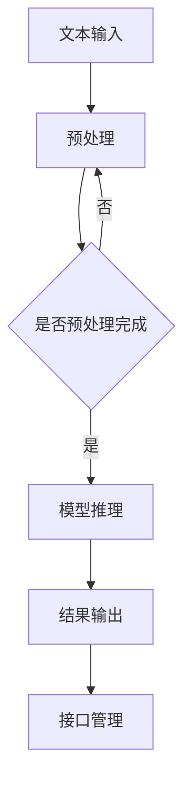
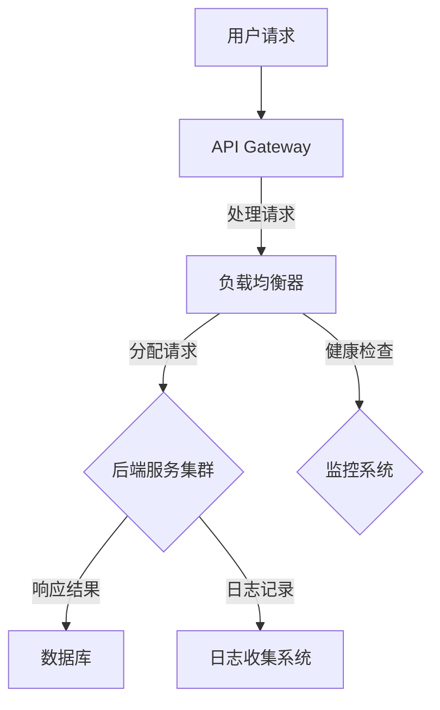
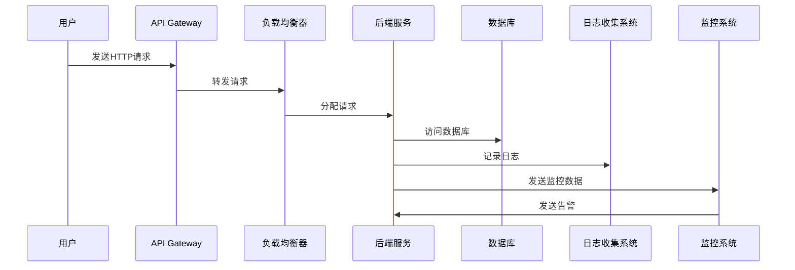

                 

## 提示词工程师：LLM应用开发中的新兴角色

### 关键词：提示词工程师、大型语言模型（LLM）、应用开发、AI技术、新兴角色

> 摘要：本文旨在探讨在人工智能（AI）迅猛发展的背景下，提示词工程师这一新兴角色的诞生及其在大型语言模型（LLM）应用开发中的重要作用。通过分析LLM的技术原理和应用场景，本文将详细解读提示词工程师的核心职责、面临的挑战及未来的发展趋势。

### 目录大纲设计思路

在本文的编写过程中，我们将按照书籍内容的逻辑结构，将整体分为以下几个主要部分：

1. **引言**：介绍AI大模型和LLM的基本概念，引出本文的主题——提示词工程师。
2. **背景介绍**：回顾AI大模型和LLM的发展历程，探讨其重要性和应用场景。
3. **核心概念与联系**：详细阐述AI大模型和LLM的核心概念及其相互关系。
4. **算法原理讲解**：分析LLM的算法原理，并借助图表和示例进行深入讲解。
5. **系统分析与架构设计方案**：介绍LLM应用系统的架构设计，包括系统需求分析、功能设计、架构设计等。
6. **项目实战**：通过具体项目案例，展示提示词工程师在实际开发中的工作内容和技巧。
7. **总结与拓展**：对全文进行总结，并提出未来发展的方向和建议。

### 目录大纲具体设计

**第一部分：引言**

### 第1章：AI大模型与LLM概述

- **1.1 AI大模型的概念与发展历程**
  - **1.1.1 AI大模型的定义**
  - **1.1.2 AI大模型的发展历程**
  - **1.1.3 大模型在人工智能领域的重要性**

- **1.2 LLM的概念与特点**
  - **1.2.1 LLM的定义**
  - **1.2.2 LLM的特点**
  - **1.2.3 LLM与NLP的关系**

- **1.3 AI大模型在应用开发中的新兴角色**
  - **1.3.1 LLM在开发中的优势**
  - **1.3.2 LLM在开发中的挑战**
  - **1.3.3 LLM的应用领域**

- **1.4 本书结构安排与学习目标**
  - **1.4.1 本书结构安排**
  - **1.4.2 学习目标**

**第二部分：背景介绍**

### 第2章：AI大模型的发展背景

- **2.1 人工智能与深度学习的兴起**
  - **2.1.1 人工智能的概述**
  - **2.1.2 深度学习的崛起**
  - **2.1.3 大规模数据处理的需求**

- **2.2 LLM的兴起与演变**
  - **2.2.1 LLM的起源**
  - **2.2.2 LLM的技术演进**
  - **2.2.3 LLM的应用进展**

- **2.3 LLM在应用开发中的重要性**
  - **2.3.1 LLM在业务中的应用价值**
  - **2.3.2 LLM在开发流程中的作用**
  - **2.3.3 LLM在行业中的发展趋势**

**第三部分：核心概念与联系**

### 第3章：AI大模型的核心概念

- **3.1 模型的结构与组成**
  - **3.1.1 神经网络基础**
  - **3.1.2 模型架构**
  - **3.1.3 参数与权重**

- **3.2 LLM的属性与特征**
  - **3.2.1 LLM的属性**
  - **3.2.2 LLM的特征**
  - **3.2.3 LLM的属性与特征的对比分析**

- **3.3 LLM的优化与训练**
  - **3.3.1 优化方法**
  - **3.3.2 训练过程**
  - **3.3.3 优化与训练的关系**

- **3.4 LLM与NLP的关系**
  - **3.4.1 NLP的基础概念**
  - **3.4.2 LLM在NLP中的应用**
  - **3.4.3 LLM对NLP的贡献**

**第四部分：算法原理讲解**

### 第4章：AI大模型算法原理详解

- **4.1 算法概述**
  - **4.1.1 算法类型**
  - **4.1.2 算法框架**
  - **4.1.3 算法流程**

- **4.2 常见算法讲解**
  - **4.2.1 GPT系列算法**
  - **4.2.2 BERT算法**
  - **4.2.3 其他常见算法**

- **4.3 算法应用案例**
  - **4.3.1 案例一：问答系统**
  - **4.3.2 案例二：文本生成**
  - **4.3.3 案例三：情感分析**

**第五部分：系统分析与架构设计方案**

### 第5章：LLM应用系统架构设计

- **5.1 系统需求分析**
  - **5.1.1 系统功能需求**
  - **5.1.2 系统性能**

- **5.2 系统功能设计（领域模型）**
  - **5.2.1 领域模型mermaid类图**

- **5.3 系统架构设计（mermaid架构图）**
  - **5.3.1 系统架构mermaid图**

- **5.4 系统接口设计**
  - **5.4.1 系统接口设计**

- **5.5 系统交互（mermaid序列图）**
  - **5.5.1 系统交互mermaid序列图**

**第六部分：项目实战**

### 第6章：实战案例解析

- **6.1 环境安装**
  - **6.1.1 安装所需软件和工具**

- **6.2 系统核心实现**
  - **6.2.1 核心代码实现**

- **6.3 代码应用解读与分析**
  - **6.3.1 代码解读**
  - **6.3.2 应用分析**

- **6.4 实际案例分析和详细讲解剖析**
  - **6.4.1 案例分析**
  - **6.4.2 详细讲解**

- **6.5 项目小结**
  - **6.5.1 项目总结**

**第七部分：总结与拓展**

### 第7章：总结与展望

- **7.1 总结**
  - **7.1.1 全文核心内容回顾**

- **7.2 拓展阅读**
  - **7.2.1 相关书籍推荐**
  - **7.2.2 行业趋势分析**
  - **7.2.3 未来发展方向**

### 让我们一起深入探讨AI大模型与提示词工程师的魅力吧！

**1.1 AI大模型的定义与发展历程**

AI大模型（Large-scale Language Model），简称LLM，是一种基于神经网络的大型语言模型。它通过训练大量文本数据，学习语言的结构和语义，从而实现自然语言处理（NLP）任务，如文本分类、问答、翻译和生成等。

AI大模型的发展历程可以追溯到20世纪80年代，当时研究人员开始探索使用神经网络进行语言处理。随着计算机硬件性能的提升和深度学习技术的出现，AI大模型得到了快速发展。特别是在2018年，谷歌发布了BERT模型，这是第一个基于Transformer架构的预训练语言模型，标志着AI大模型的新的里程碑。

AI大模型的重要性在于其能够处理大规模、复杂的语言数据，从而提升NLP任务的准确性和效率。在人工智能领域，AI大模型已经成为许多应用的核心组件，如搜索引擎、语音助手、智能客服和内容生成等。

**1.2 LLM的概念与特点**

LLM是一种特殊的AI大模型，专门用于处理自然语言。其核心特点是：

1. **大规模**：LLM通常包含数十亿甚至数千亿个参数，能够处理海量文本数据。
2. **深度学习**：LLM基于深度学习技术，通过多层神经网络进行训练和优化。
3. **自适应**：LLM能够根据输入的文本数据自适应调整模型参数，以实现特定的NLP任务。
4. **通用性**：LLM不仅适用于特定的语言处理任务，还可以应用于多种不同的场景。

LLM与NLP有着密切的关系。NLP（Natural Language Processing）是指使用计算机技术和人工智能技术对自然语言进行处理和分析。LLM作为NLP的核心工具，通过对大量语言数据的训练，能够理解和生成自然语言，从而实现各种NLP任务。

**1.3 AI大模型在应用开发中的新兴角色**

随着AI大模型技术的不断发展，提示词工程师（Prompt Engineer）这一新兴角色应运而生。提示词工程师的主要职责是设计和优化LLM的输入提示（Prompt），以提高模型在特定任务中的表现。

提示词工程师在LLM应用开发中的优势包括：

1. **提升模型性能**：通过精心设计的提示词，提示词工程师能够提升LLM在特定任务中的准确性和效率。
2. **降低开发成本**：提示词工程师能够利用LLM的通用性，快速实现各种NLP任务，从而降低开发成本。
3. **提高用户体验**：提示词工程师可以根据用户需求，设计个性化的提示词，提高用户满意度。

然而，提示词工程师也面临着一些挑战，如：

1. **提示词设计复杂性**：设计有效的提示词需要深入理解LLM的工作原理和语言特性。
2. **数据依赖性**：提示词工程师需要大量高质量的训练数据来训练和优化LLM。
3. **模型安全性**：提示词工程师需要确保LLM生成的文本符合道德规范，避免潜在的风险。

尽管如此，提示词工程师在LLM应用开发中的重要性日益凸显。随着AI技术的不断进步，提示词工程师将在未来的AI应用中发挥更加关键的作用。

**1.4 本书结构安排与学习目标**

本书将分为七个部分，全面探讨AI大模型与提示词工程师的相关知识。

- **第一部分：引言**：介绍AI大模型和LLM的基本概念，引出提示词工程师的角色。
- **第二部分：背景介绍**：回顾AI大模型和LLM的发展历程，探讨其重要性和应用场景。
- **第三部分：核心概念与联系**：详细阐述AI大模型和LLM的核心概念及其相互关系。
- **第四部分：算法原理讲解**：分析LLM的算法原理，并借助图表和示例进行深入讲解。
- **第五部分：系统分析与架构设计方案**：介绍LLM应用系统的架构设计，包括系统需求分析、功能设计、架构设计等。
- **第六部分：项目实战**：通过具体项目案例，展示提示词工程师在实际开发中的工作内容和技巧。
- **第七部分：总结与拓展**：对全文进行总结，并提出未来发展的方向和建议。

通过学习本书，读者将：

- **了解AI大模型和LLM的基本概念**：掌握AI大模型和LLM的定义、特点以及与NLP的关系。
- **理解提示词工程师的职责和挑战**：了解提示词工程师的职责、优势以及面临的挑战。
- **掌握LLM的算法原理**：学习常见的LLM算法，包括GPT系列、BERT算法等，并了解其原理和应用。
- **了解LLM应用系统的架构设计**：掌握LLM应用系统的需求分析、功能设计、架构设计和接口设计。
- **具备实际项目开发能力**：通过实战案例，了解提示词工程师在实际项目中的工作内容和技巧。

总之，本书旨在帮助读者深入了解AI大模型和提示词工程师的相关知识，为未来的AI应用开发提供有力支持。

### 第二部分：背景介绍

#### 2.1 人工智能与深度学习的兴起

人工智能（AI）是指通过计算机模拟人类智能行为的技术。自20世纪50年代起，人工智能领域经历了多次起伏，但最近几年，随着深度学习技术的突破，人工智能迎来了新一轮的发展高潮。深度学习（Deep Learning）是一种基于神经网络的学习方法，通过多层神经元的组合，实现从大量数据中自动提取特征和模式。

深度学习的崛起，源于以下几个因素：

1. **计算能力的提升**：随着计算硬件（如GPU、TPU）的发展，计算能力的提升为深度学习提供了强大的支持。
2. **大数据的普及**：互联网的普及和大数据技术的发展，为深度学习提供了丰富的训练数据。
3. **优化算法的改进**：随机梯度下降（SGD）等优化算法的改进，使得深度学习模型的训练过程更加高效。

在人工智能领域，深度学习已经成为主流技术。深度学习模型在大规模图像识别、语音识别、自然语言处理等领域取得了显著的成果。例如，卷积神经网络（CNN）在图像识别任务中表现出色，而循环神经网络（RNN）和Transformer模型则在语音识别和自然语言处理任务中取得了突破。

#### 2.2 LLM的兴起与演变

大型语言模型（LLM）是深度学习在自然语言处理领域的应用成果。LLM通过训练大量文本数据，学习语言的语义和结构，从而实现各种自然语言处理任务，如文本分类、问答、翻译和生成等。

LLM的兴起可以追溯到2018年，当时谷歌发布了BERT（Bidirectional Encoder Representations from Transformers）模型，这是第一个基于Transformer架构的预训练语言模型。BERT的成功引发了大规模语言模型的研究热潮，许多研究机构和科技公司相继发布了各自的LLM模型，如GPT（Generative Pre-trained Transformer）、T5（Text-To-Text Transfer Transformer）和LLaMA（Language Model for Dialogue Applications）等。

LLM的演变经历了以下几个阶段：

1. **基于规则的NLP**：早期NLP方法主要依赖于手工设计的规则和特征，如正则表达式、词袋模型等。这种方法在一定程度上能够处理简单的NLP任务，但在复杂任务上表现有限。
2. **统计学习方法**：随着机器学习技术的发展，NLP开始采用统计学习方法，如隐马尔可夫模型（HMM）、条件概率模型等。这些方法通过训练大量数据，自动学习语言的特征，从而提高NLP任务的性能。
3. **深度学习方法**：深度学习模型的引入，使得NLP取得了重大突破。深度学习模型通过多层神经网络，自动提取复杂的特征，从而实现更准确的NLP任务。
4. **预训练方法**：预训练方法将大规模的通用数据集用于模型的初始化，然后通过特定任务的数据进行微调，从而提高模型的性能。BERT等LLM模型采用了预训练方法，实现了在多种NLP任务上的优异表现。

#### 2.3 LLM在应用开发中的重要性

LLM在应用开发中具有重要的地位，主要体现在以下几个方面：

1. **提高开发效率**：LLM通过预训练和微调，可以快速实现各种自然语言处理任务，从而提高开发效率。例如，在文本分类任务中，LLM可以自动学习分类特征，无需手动设计特征提取器。
2. **提升任务性能**：LLM在预训练阶段学习了大量的语言知识，从而在特定任务上表现出色。例如，GPT模型在生成文本任务中，可以生成连贯、有逻辑的文本，而BERT模型在问答任务中，可以准确回答用户的问题。
3. **拓展应用领域**：LLM的通用性使其可以应用于多种不同的场景，如智能客服、内容生成、语音识别等。通过微调和定制化，LLM可以适应不同的业务需求，从而拓展应用领域。

总之，LLM在应用开发中具有重要的地位，其高效、高性能和通用性的特点，使得LLM成为许多应用的核心组件。

### 第三部分：核心概念与联系

#### 3.1 AI大模型的核心概念

AI大模型（Large-scale AI Model），简称LAM，是一种基于深度学习技术的大型模型，用于处理复杂的数据和任务。LAM的核心概念包括以下几个方面：

1. **神经网络（Neural Network）**：神经网络是LAM的基础架构，它由大量的神经元（节点）组成，通过连接这些神经元，形成复杂的网络结构。神经网络通过学习输入和输出之间的映射关系，实现数据的处理和预测。
   
2. **深度学习（Deep Learning）**：深度学习是一种基于神经网络的机器学习方法，它通过多层神经网络，自动提取数据中的特征，实现复杂的数据分析和任务。深度学习在图像识别、自然语言处理、语音识别等领域取得了显著成果。

3. **大规模数据（Large-scale Data）**：LAM需要处理大量数据，这些数据可以是文本、图像、音频等形式。大规模数据的处理是LAM能够实现高效、准确预测的关键。

4. **预训练（Pre-training）**：预训练是指通过大规模数据集对LAM进行初始化和训练，使其在特定领域获得一定的知识。预训练是LAM性能提升的重要手段，它使得LAM能够快速适应新的任务和数据。

5. **微调（Fine-tuning）**：微调是指将预训练的LAM应用于特定任务，通过少量的数据对其进行调整和优化，使其在特定任务上表现更好。微调是LAM在实际应用中发挥关键作用的关键步骤。

#### 3.2 LLM的属性与特征

LLM（Large-scale Language Model），是一种专门用于处理自然语言的大型语言模型。LLM的属性和特征如下：

1. **大规模参数（Large-scale Parameters）**：LLM通常包含数十亿甚至数千亿个参数，这些参数通过预训练和学习，使得LLM能够理解和生成自然语言。

2. **自适应（Adaptive）**：LLM能够根据输入的文本数据自适应调整模型参数，以实现特定的自然语言处理任务。这种自适应能力使得LLM能够在多种不同的场景和应用中表现出色。

3. **深度学习（Deep Learning）**：LLM基于深度学习技术，通过多层神经网络进行训练和优化，从而实现自然语言的理解和生成。

4. **通用性（Generality）**：LLM具有通用性，可以应用于多种不同的自然语言处理任务，如文本分类、问答、翻译和生成等。

5. **预训练（Pre-training）**：LLM通过预训练大量文本数据，学习语言的语义和结构，从而在多种任务中表现出色。预训练是LLM性能提升的关键。

#### 3.3 LLM的属性与特征的对比分析

为了更好地理解LLM的属性与特征，我们将其与传统的自然语言处理方法进行比较：

| 特征         | LLM                                       | 传统方法                                     |
| ------------ | ----------------------------------------- | -------------------------------------------- |
| 数据规模     | 大规模数据训练                            | 小规模数据特征提取                           |
| 参数规模     | 数十亿到数千亿个参数                      | 几千到数万个特征                             |
| 学习方式     | 预训练+微调                              | 特征工程+模型训练                            |
| 语言理解能力 | 高度自动化，理解复杂语言结构和语义         | 依赖手工设计的规则和特征，理解能力有限       |
| 应用场景     | 广泛的自然语言处理任务，如文本分类、问答等 | 具体应用领域，如情感分析、文本分类等         |
| 性能提升     | 预训练和微调结合，显著提高性能           | 依赖特定领域的特征工程和模型选择，性能提升有限 |

通过对比分析，我们可以看出LLM在数据规模、参数规模、学习方式、语言理解能力、应用场景和性能提升等方面相较于传统方法具有显著优势。

#### 3.4 LLM与NLP的关系

LLM与自然语言处理（NLP）之间存在着紧密的联系。NLP是指使用计算机技术和人工智能技术对自然语言进行处理和分析，而LLM作为NLP的核心工具，在多个方面对NLP产生了深远影响。

1. **语言理解能力**：LLM通过预训练大量文本数据，学习到了语言的语义和结构，从而具有强大的语言理解能力。这种能力使得LLM能够处理复杂的自然语言任务，如问答、文本生成和情感分析等。

2. **任务适应性**：LLM具有高度的自适应能力，可以根据不同的任务需求进行微调。这意味着LLM不仅可以应用于文本分类、问答等常见任务，还可以扩展到更复杂的场景和应用。

3. **效率提升**：LLM通过预训练和微调，可以快速适应新的任务和数据，从而提高NLP任务的效率。与传统的NLP方法相比，LLM在处理大规模数据和复杂任务时，表现出更高的效率和准确性。

4. **通用性**：LLM的通用性使其可以应用于多种不同的NLP任务，而无需重新设计和训练模型。这种通用性大大降低了NLP应用的门槛，使得更多企业和开发者能够利用LLM技术实现自然语言处理功能。

5. **创新驱动**：LLM的出现推动了NLP技术的发展和创新。通过不断优化和扩展LLM模型，研究人员和开发者可以探索新的应用场景和解决方案，从而推动NLP领域的发展。

总之，LLM与NLP之间存在着密切的联系和相互促进的关系。LLM为NLP提供了强大的工具和平台，而NLP的不断发展也为LLM的应用和创新提供了新的机遇。

#### 3.5 LLM的优化与训练

LLM（Large-scale Language Model）的优化与训练是确保模型在自然语言处理任务中表现优异的关键环节。下面将详细讲解LLM的优化方法、训练过程及其相互关系。

##### 3.5.1 优化方法

优化方法是指通过调整模型参数来提高模型性能的过程。在LLM中，常用的优化方法包括：

1. **随机梯度下降（SGD）**：SGD是一种经典的优化方法，它通过计算模型参数的梯度，逐步调整参数，以最小化损失函数。SGD适用于大规模数据集，但可能需要较长的训练时间。

2. **Adam优化器**：Adam优化器是SGD的一种改进，它结合了AdaGrad和RMSProp的优点，通过自适应地调整学习率，提高模型的收敛速度和稳定性。

3. **学习率调度（Learning Rate Scheduler）**：学习率调度是指在训练过程中动态调整学习率的方法。常用的调度策略包括线性递减、指数递减等。适当的调度策略可以加速模型的收敛，避免过拟合。

##### 3.5.2 训练过程

LLM的训练过程包括以下几个关键步骤：

1. **数据预处理**：在训练前，需要对文本数据（如语料库）进行预处理，包括分词、去噪、标准化等操作。这些预处理步骤有助于提高模型的训练效果和泛化能力。

2. **模型初始化**：模型初始化是指为模型参数分配初始值。常用的初始化方法包括随机初始化、高斯分布初始化等。良好的初始化有助于提高模型的收敛速度和性能。

3. **前向传播（Forward Propagation）**：前向传播是指将输入数据传递到模型中，计算模型的输出。在这个过程中，模型根据输入和参数计算损失函数，以评估模型的性能。

4. **反向传播（Backpropagation）**：反向传播是指根据前向传播的结果，计算模型参数的梯度。通过梯度下降等优化方法，反向传播调整模型参数，以最小化损失函数。

5. **迭代训练（Training Loop）**：迭代训练是指重复前向传播和反向传播的过程，逐步调整模型参数，直到模型收敛。在迭代过程中，可以采用学习率调度等策略，以提高训练效果。

##### 3.5.3 优化与训练的关系

优化与训练是相辅相成的过程。优化方法决定了模型参数的调整策略，而训练过程则是实现参数优化的具体步骤。

1. **优化方法的选择**：合适的优化方法可以提高模型的训练效率，加速模型收敛。例如，Adam优化器在许多任务中表现出色，因为它能够自适应地调整学习率，提高模型的性能。

2. **训练过程的控制**：训练过程中，需要控制参数的调整范围，以避免模型出现过拟合或欠拟合。适当的训练策略（如学习率调度）可以帮助模型在训练过程中保持稳定，提高泛化能力。

3. **优化与训练的相互反馈**：优化过程中的参数调整会影响训练效果，而训练过程中的性能评估又反过来指导优化方法的选择。这种相互反馈机制有助于模型不断改进，实现最优性能。

总之，LLM的优化与训练是确保模型在自然语言处理任务中表现优异的关键环节。通过合理选择优化方法和控制训练过程，可以大大提高模型的性能和泛化能力。

#### 3.6 LLM与NLP的关系

LLM（Large-scale Language Model）与自然语言处理（NLP）之间存在着紧密的联系。LLM是NLP领域的关键技术之一，为各种NLP任务提供了强大的工具和支持。下面将详细探讨LLM在NLP中的应用及其对NLP的贡献。

##### 3.6.1 NLP的基础概念

自然语言处理是指使用计算机技术和人工智能技术对自然语言进行理解和生成。NLP的主要任务包括：

1. **文本分类**：将文本数据分类到预定义的类别中，如情感分析、主题分类等。
2. **文本生成**：根据输入的文本或指令，生成新的文本，如文本摘要、问答生成等。
3. **信息提取**：从文本中提取关键信息，如实体识别、关系提取等。
4. **语义分析**：理解文本的语义含义，如句法分析、语义角色标注等。
5. **机器翻译**：将一种语言的文本翻译成另一种语言。

NLP的发展经历了多个阶段，从早期的基于规则的方法，到统计学习方法，再到当前的深度学习方法，每一阶段都有其独特的特点和挑战。

##### 3.6.2 LLM在NLP中的应用

LLM在NLP中的应用非常广泛，主要包括以下几个方面：

1. **预训练语言模型**：LLM通过在大量文本数据上进行预训练，学习到语言的通用特征和结构。这些预训练模型可以作为其他NLP任务的起点，实现快速的模型定制和优化。

2. **文本分类**：LLM可以用于文本分类任务，通过预训练模型提取文本的特征，然后使用分类器进行分类。这种方法在处理大规模文本数据时，具有高效性和准确性。

3. **问答系统**：LLM可以用于构建问答系统，通过理解用户的问题和答案，生成准确的回答。这种方法在智能客服、信息检索等领域有着广泛的应用。

4. **文本生成**：LLM可以用于文本生成任务，如文本摘要、故事生成等。通过输入一个主题或指令，LLM可以生成连贯、有逻辑的文本。

5. **机器翻译**：LLM可以用于机器翻译任务，通过在多种语言之间的预训练，实现高精度的文本翻译。这种方法在跨语言信息处理和全球化应用中具有重要价值。

##### 3.6.3 LLM对NLP的贡献

LLM对NLP的贡献主要体现在以下几个方面：

1. **提高任务性能**：LLM通过预训练学习到丰富的语言特征和结构，从而在多种NLP任务中表现出色。与传统的NLP方法相比，LLM具有更高的性能和准确性。

2. **降低开发难度**：LLM的通用性使得开发者可以快速实现各种NLP任务，而无需从头设计和训练模型。这大大降低了NLP的开发难度和成本。

3. **推动技术创新**：LLM的兴起推动了NLP技术的创新和发展。通过不断优化和扩展LLM模型，研究人员和开发者可以探索新的应用场景和解决方案，从而推动NLP领域的发展。

4. **促进跨学科合作**：LLM技术的应用不仅局限于NLP领域，还涉及到计算机视觉、语音识别等其他人工智能领域。这促进了不同学科之间的合作和交流，推动了人工智能技术的整体进步。

总之，LLM在NLP中的应用及其对NLP的贡献是显著的。通过预训练和学习到丰富的语言特征，LLM为NLP任务提供了强大的工具和支持，推动了NLP技术的不断进步和创新。

### 第四部分：算法原理讲解

#### 4.1 算法概述

AI大模型（AI Large Model）的算法原理是其在各类应用中实现高效性能的基础。本节将介绍AI大模型的基本算法类型、框架以及算法流程，以便读者更好地理解其工作原理。

#### 4.1.1 算法类型

AI大模型的算法类型主要分为以下几类：

1. **深度学习（Deep Learning）算法**：深度学习算法是AI大模型的核心，包括卷积神经网络（CNN）、循环神经网络（RNN）、长短时记忆网络（LSTM）、门控循环单元（GRU）等。这些算法通过多层神经网络结构，实现对复杂数据的自动特征提取和学习。

2. **强化学习（Reinforcement Learning）算法**：强化学习算法通过模型与环境的交互，不断优化策略，以实现目标。例如，在游戏AI和机器人控制中，强化学习算法通过试错和奖励机制，逐步优化行为。

3. **生成对抗网络（GAN）算法**：生成对抗网络由生成器和判别器组成，通过对抗训练生成逼真的数据。GAN在图像生成、图像修复、视频生成等领域具有广泛应用。

4. **Transformer算法**：Transformer算法是一种基于自注意力机制的深度学习模型，其在自然语言处理任务中表现出色。例如，BERT、GPT等大型语言模型均采用了Transformer算法。

#### 4.1.2 算法框架

AI大模型的算法框架通常包括以下几个部分：

1. **数据输入与预处理**：数据输入包括文本、图像、音频等不同类型的数据。预处理步骤包括数据清洗、数据增强、数据标准化等。

2. **特征提取与编码**：特征提取是将原始数据转换为适合模型学习的表示。编码步骤是将数据转换为模型能够处理的格式，如词向量、图像像素值等。

3. **模型训练与优化**：模型训练是通过迭代计算模型参数，最小化损失函数，优化模型性能。优化方法包括随机梯度下降（SGD）、Adam优化器等。

4. **模型评估与调优**：模型评估是通过验证集或测试集，评估模型在未知数据上的表现。调优步骤包括调整模型参数、调整学习率等，以优化模型性能。

5. **模型部署与应用**：模型部署是将训练好的模型应用于实际任务中。应用步骤包括模型接口设计、模型集成、模型监控等。

#### 4.1.3 算法流程

AI大模型的算法流程可以分为以下几个步骤：

1. **数据收集与预处理**：收集大量高质量的数据，并进行预处理，确保数据的质量和一致性。

2. **模型设计**：根据任务需求，设计合适的模型架构。可以选择传统的深度学习模型，如CNN、RNN，或者基于Transformer的模型，如BERT、GPT。

3. **模型训练**：使用预处理后的数据，对模型进行训练。在训练过程中，通过迭代计算模型参数，最小化损失函数，优化模型性能。

4. **模型评估**：使用验证集或测试集对模型进行评估，评估指标包括准确率、召回率、F1值等。根据评估结果，对模型进行调整和优化。

5. **模型部署**：将训练好的模型部署到实际应用中，进行实时推理和预测。同时，监控模型的性能和稳定性，确保模型在应用中的高效运行。

#### 4.2 常见算法讲解

在本节中，我们将详细介绍几种常见的AI大模型算法，包括GPT系列算法、BERT算法和其他常见算法。

##### 4.2.1 GPT系列算法

GPT（Generative Pre-trained Transformer）系列算法是由OpenAI提出的一种基于Transformer架构的预训练语言模型。GPT系列算法包括GPT、GPT-2、GPT-3等模型，其核心思想是通过在大量文本数据上进行预训练，学习到语言的深层结构，从而实现文本生成、文本分类、问答等任务。

1. **模型架构**：GPT模型采用Transformer架构，其核心组件包括自注意力机制（Self-Attention）和多层神经网络（Multi-Layered Neural Network）。自注意力机制允许模型在处理每个输入时，根据输入序列中的其他位置进行动态权重调整，从而实现全局信息整合。

2. **训练过程**：GPT模型的训练过程包括两个阶段。首先是预训练阶段，模型在大量文本数据上进行无监督预训练，学习到语言的深层结构。然后是微调阶段，模型在特定任务的数据上进行有监督微调，优化模型在任务上的表现。

3. **应用场景**：GPT模型在多种自然语言处理任务中表现出色，如文本生成、问答系统、文本分类等。例如，GPT-3模型在文本生成任务中，可以生成高质量的文章、对话和故事；在问答系统中，可以准确回答用户的问题。

##### 4.2.2 BERT算法

BERT（Bidirectional Encoder Representations from Transformers）算法是由Google提出的一种基于Transformer架构的双向编码器表示模型。BERT在自然语言处理任务中取得了显著的成果，其核心思想是通过在大量文本数据上进行双向编码，学习到语言的深层语义。

1. **模型架构**：BERT模型采用Transformer架构，其核心组件包括多头自注意力机制（Multi-Head Self-Attention）和位置编码（Positional Encoding）。多头自注意力机制允许模型在处理每个输入时，根据输入序列中的其他位置进行动态权重调整，实现全局信息整合。位置编码为模型提供了输入序列的位置信息。

2. **训练过程**：BERT模型的训练过程包括两个阶段。首先是预训练阶段，模型在大量文本数据上进行无监督预训练，学习到语言的深层结构。然后是微调阶段，模型在特定任务的数据上进行有监督微调，优化模型在任务上的表现。

3. **应用场景**：BERT模型在多种自然语言处理任务中表现出色，如文本分类、问答系统、命名实体识别等。例如，BERT模型在文本分类任务中，可以准确分类新闻文章、社交媒体评论等；在问答系统中，可以准确回答用户的问题。

##### 4.2.3 其他常见算法

除了GPT和BERT算法，还有许多其他常见的AI大模型算法，如T5（Text-To-Text Transfer Transformer）、RoBERTa（A Robustly Optimized BERT Pretraining Approach）等。

1. **T5算法**：T5（Text-To-Text Transfer Transformer）算法是由Google提出的一种通用文本处理模型。T5算法将所有自然语言处理任务统一为文本到文本的转换任务，通过在大量文本数据上进行预训练，学习到语言的深层结构。

2. **RoBERTa算法**：RoBERTa（A Robustly Optimized BERT Pretraining Approach）算法是BERT算法的一个变体，通过在预训练过程中引入新的训练策略，优化BERT模型的表现。RoBERTa算法在多种自然语言处理任务中表现出色，如文本分类、问答系统等。

这些常见的AI大模型算法在自然语言处理任务中发挥了重要作用，为开发者提供了强大的工具和平台。

#### 4.3 算法应用案例

在本节中，我们将通过几个具体的算法应用案例，展示AI大模型在实际开发中的实际应用，以及如何利用这些算法解决实际问题。

##### 4.3.1 案例一：问答系统

问答系统是自然语言处理领域的一个经典应用，通过回答用户的问题，提供信息和服务。下面以一个基于BERT算法的问答系统为例，介绍其实现过程。

1. **任务描述**：用户输入一个问题，问答系统需要从大量的文本数据中查找并返回最相关的答案。

2. **模型选择**：选择BERT算法作为基础模型，因为它在问答任务中表现出色。

3. **数据准备**：收集大量的问题和答案对，进行预处理，包括分词、去噪、标准化等。

4. **模型训练**：在预处理后的数据集上进行有监督训练，通过迭代计算模型参数，优化模型在问答任务上的性能。

5. **模型评估**：使用验证集或测试集，评估模型在未知数据上的表现，调整模型参数，优化模型性能。

6. **模型部署**：将训练好的模型部署到实际应用中，提供问答服务。

通过以上步骤，实现了一个基于BERT算法的问答系统，可以准确回答用户的问题，提供信息和服务。

##### 4.3.2 案例二：文本生成

文本生成是自然语言处理领域的一个热门应用，通过输入一个主题或指令，生成连贯、有逻辑的文本。下面以一个基于GPT-3算法的文本生成系统为例，介绍其实现过程。

1. **任务描述**：用户输入一个主题或指令，文本生成系统需要根据主题或指令生成相关的文本。

2. **模型选择**：选择GPT-3算法作为基础模型，因为它在文本生成任务中表现出色。

3. **数据准备**：收集大量与主题相关的文本数据，进行预处理，包括分词、去噪、标准化等。

4. **模型训练**：在预处理后的数据集上进行无监督预训练，学习到语言的深层结构。

5. **模型评估**：使用验证集或测试集，评估模型在未知数据上的表现，调整模型参数，优化模型性能。

6. **模型部署**：将训练好的模型部署到实际应用中，根据用户输入的主题或指令，生成相关的文本。

通过以上步骤，实现了一个基于GPT-3算法的文本生成系统，可以生成高质量的文章、对话和故事。

##### 4.3.3 案例三：情感分析

情感分析是自然语言处理领域的一个广泛应用，通过对文本情感极性进行判断，帮助企业了解用户需求和市场动态。下面以一个基于LSTM算法的情感分析系统为例，介绍其实现过程。

1. **任务描述**：用户输入一段文本，情感分析系统需要判断文本的情感极性，如正面、负面或中性。

2. **模型选择**：选择LSTM算法作为基础模型，因为它在序列数据处理任务中表现出色。

3. **数据准备**：收集大量带有情感标注的文本数据，进行预处理，包括分词、去噪、标准化等。

4. **模型训练**：在预处理后的数据集上进行有监督训练，通过迭代计算模型参数，优化模型在情感分析任务上的性能。

5. **模型评估**：使用验证集或测试集，评估模型在未知数据上的表现，调整模型参数，优化模型性能。

6. **模型部署**：将训练好的模型部署到实际应用中，根据用户输入的文本，判断其情感极性。

通过以上步骤，实现了一个基于LSTM算法的情感分析系统，可以帮助企业了解用户需求和市场动态，提供决策支持。

这些案例展示了AI大模型在实际开发中的广泛应用，通过合理选择和利用算法，可以解决实际问题，提高业务效率和用户体验。

### 第五部分：系统分析与架构设计方案

#### 5.1 系统需求分析

在设计和实现LLM应用系统时，首先需要对系统的需求进行详细分析。系统需求分析包括功能需求和非功能需求两部分。

**5.1.1 系统功能需求**

1. **文本输入**：用户可以通过接口输入文本，如问答问题、文本生成指令等。
2. **文本预处理**：系统需要对输入文本进行预处理，包括分词、去噪、标准化等操作，以便于模型处理。
3. **模型推理**：系统使用预训练的LLM模型，对预处理后的文本进行推理，生成相应的输出。
4. **结果输出**：系统将生成的结果返回给用户，如问答答案、文本生成等。
5. **接口管理**：系统需要提供统一的接口管理，支持不同类型的输入和输出格式。

**5.1.2 系统性能**

1. **响应时间**：系统需要快速响应用户请求，确保用户体验。
2. **并发处理能力**：系统需要支持高并发的请求处理，以应对大量用户同时访问。
3. **资源利用率**：系统需要高效利用硬件资源，如CPU、内存等，确保系统稳定运行。
4. **可扩展性**：系统设计应具备良好的可扩展性，以便在需求增长时进行水平或垂直扩展。

#### 5.2 系统功能设计（领域模型）

为了更好地实现系统的功能需求，我们可以设计一个领域模型（Domain Model），以描述系统的核心功能和组件。领域模型使用Mermaid流程图进行表示，如下所示：



**领域模型解释**：

1. **文本输入**：用户输入文本，如问答问题或文本生成指令。
2. **预处理**：系统对输入文本进行预处理，包括分词、去噪、标准化等操作。
3. **模型推理**：预处理后的文本输入到LLM模型中进行推理，生成相应的输出。
4. **结果输出**：将LLM模型的输出返回给用户。
5. **接口管理**：管理系统的接口，支持不同类型的输入和输出格式。

#### 5.3 系统架构设计（mermaid架构图）

为了确保系统的性能和可扩展性，我们可以设计一个分布式系统架构。系统架构设计使用Mermaid架构图进行表示，如下所示：



**系统架构解释**：

1. **API Gateway**：负责接收用户的请求，并将请求转发到后端服务。
2. **负载均衡器**：将请求均匀分配到后端服务集群，确保系统的负载均衡。
3. **后端服务集群**：包含多个LLM模型服务实例，共同处理用户请求。
4. **数据库**：存储用户数据和模型参数，支持数据的持久化存储。
5. **日志收集系统**：收集后端服务的日志信息，用于监控和调试。
6. **监控系统**：实时监控系统的性能和状态，提供告警和异常处理机制。

#### 5.4 系统接口设计

系统接口设计是系统架构的关键部分，它定义了系统内部模块之间的交互方式和数据格式。以下是系统接口设计的具体方案：

1. **输入接口**：用户通过API Gateway发送HTTP请求，请求内容包括文本内容和请求类型（如问答、文本生成等）。API Gateway将请求转换为内部格式，并转发到后端服务。
2. **输出接口**：后端服务处理用户请求后，将结果返回给API Gateway。输出接口返回HTTP响应，响应内容包括处理结果和状态码。
3. **内部接口**：后端服务之间的交互接口，用于传递预处理后的文本数据和模型推理结果。内部接口采用RESTful API设计，支持JSON格式的数据交换。

#### 5.5 系统交互（mermaid序列图）

为了更好地展示系统内部模块之间的交互过程，我们可以使用Mermaid序列图进行表示，如下所示：



**系统交互解释**：

1. **用户请求**：用户通过API Gateway发送HTTP请求，请求内容包括文本内容和请求类型。
2. **请求转发**：API Gateway将请求转发到负载均衡器，负载均衡器根据负载情况，将请求分配到后端服务。
3. **服务处理**：后端服务处理用户请求，包括文本预处理、模型推理和结果输出。
4. **数据库访问**：后端服务访问数据库，获取用户数据和模型参数。
5. **日志记录**：后端服务将处理结果和日志信息发送到日志收集系统。
6. **监控与告警**：监控系统实时监控系统的性能和状态，并根据告警规则发送告警信息。

通过以上系统分析与架构设计方案，我们为LLM应用系统提供了一套完整的设计方案，包括需求分析、领域模型、架构设计、接口设计和系统交互。这套设计方案能够确保系统的性能、可扩展性和可靠性，为实际应用提供有力支持。

### 第六部分：项目实战

#### 6.1 环境安装

为了进行LLM应用系统的开发，我们需要安装和配置一系列的软件和工具。以下是在Ubuntu 20.04操作系统上安装所需软件和工具的步骤：

1. **安装Python**：首先，我们需要确保Python环境已经安装。在终端中执行以下命令：
   ```bash
   sudo apt update
   sudo apt install python3 python3-pip
   ```
2. **安装TensorFlow**：TensorFlow是开发AI应用的重要库，我们需要安装TensorFlow 2.x版本。在终端中执行以下命令：
   ```bash
   pip3 install tensorflow==2.9.1
   ```
3. **安装transformers库**：transformers库是用于加载预训练的LLM模型的重要库。在终端中执行以下命令：
   ```bash
   pip3 install transformers
   ```
4. **安装其他依赖**：除了Python和TensorFlow，我们还需要安装其他依赖库，如NumPy、Pandas等。在终端中执行以下命令：
   ```bash
   pip3 install numpy pandas
   ```

安装完成后，我们可以在Python环境中测试安装结果：
```python
import tensorflow as tf
import transformers

print(tf.__version__)
print(transformers.__version__)
```

如果输出版本信息，说明环境安装成功。

#### 6.2 系统核心实现

在本节中，我们将使用Python和TensorFlow来实现一个基于BERT的问答系统。以下是系统核心实现的步骤：

1. **加载预训练BERT模型**：首先，我们需要从Hugging Face的模型库中加载预训练的BERT模型。
```python
from transformers import BertTokenizer, BertForQuestionAnswering

tokenizer = BertTokenizer.from_pretrained('bert-base-uncased')
model = BertForQuestionAnswering.from_pretrained('bert-base-uncased')
```
2. **预处理输入文本**：对于输入的文本，我们需要对其进行预处理，包括分词、添加特殊Token等。
```python
def preprocess_text(question, context):
    question = tokenizer.encode(question, add_special_tokens=True, max_length=512, padding='max_length', truncation=True)
    context = tokenizer.encode(context, add_special_tokens=True, max_length=512, padding='max_length', truncation=True)
    return question, context
```
3. **模型推理**：使用预处理后的输入文本，我们将模型输入到BERT模型中，获取答案。
```python
def answer_question(model, tokenizer, question, context):
    question, context = preprocess_text(question, context)
    inputs = {"input_ids": [question], "attention_mask": [1] * len(question), "token_type_ids": [0] * len(question), "context_input_ids": [context], "context_attention_mask": [1] * len(context), "context_token_type_ids": [1] * len(context)}
    outputs = model(**inputs)
    logits = outputs.logits
    start_logits = logits[:, 0, :].detach().numpy()
    end_logits = logits[:, 1, :].detach().numpy()
    start_idx = np.argmax(start_logits)
    end_idx = np.argmax(end_logits)
    answer_len = end_idx - start_idx + 1
    answer_tokens = tokenizer.decode(context[start_idx: end_idx + 1], skip_special_tokens=True)
    return answer_tokens
```
4. **创建API接口**：使用Flask框架创建一个简单的API接口，接收用户输入的问答对，并返回答案。
```python
from flask import Flask, request, jsonify

app = Flask(__name__)

@app.route('/api/answer', methods=['POST'])
def get_answer():
    data = request.json
    question = data['question']
    context = data['context']
    answer = answer_question(model, tokenizer, question, context)
    return jsonify({'answer': answer})

if __name__ == '__main__':
    app.run(debug=True)
```

#### 6.3 代码应用解读与分析

在本节中，我们将对上一节中的代码进行解读和分析，详细解释每个步骤的实现原理和功能。

1. **加载预训练BERT模型**：

   ```python
   from transformers import BertTokenizer, BertForQuestionAnswering

   tokenizer = BertTokenizer.from_pretrained('bert-base-uncased')
   model = BertForQuestionAnswering.from_pretrained('bert-base-uncased')
   ```

   这里我们首先导入了`BertTokenizer`和`BertForQuestionAnswering`两个类。`BertTokenizer`用于将文本转换为模型能够理解的输入格式，`BertForQuestionAnswering`是一个预训练的BERT模型，专门用于问答任务。

   使用`from_pretrained`方法，我们从Hugging Face的模型库中加载了预训练的BERT模型。这两个对象在后续的代码中会被使用。

2. **预处理输入文本**：

   ```python
   def preprocess_text(question, context):
       question = tokenizer.encode(question, add_special_tokens=True, max_length=512, padding='max_length', truncation=True)
       context = tokenizer.encode(context, add_special_tokens=True, max_length=512, padding='max_length', truncation=True)
       return question, context
   ```

   `preprocess_text`函数用于对输入文本进行预处理。首先，我们使用`tokenizer.encode`方法将文本转换为Token ID序列。在转换过程中，我们设置了几个重要的参数：

   - `add_special_tokens=True`：在文本开头和结尾添加特殊Token `[CLS]` 和 `[SEP]`，这些Token用于表示文本的开始和结束。
   - `max_length=512`：设置输入文本的最大长度为512个Token。如果输入文本长度超过512个Token，将进行截断（`truncation=True`）。
   - `padding='max_length'`：如果输入文本长度小于512个Token，将在末尾添加0-Token进行填充。
   
   通过这些预处理步骤，我们将原始文本转换为BERT模型能够处理的输入格式。

3. **模型推理**：

   ```python
   def answer_question(model, tokenizer, question, context):
       question, context = preprocess_text(question, context)
       inputs = {"input_ids": [question], "attention_mask": [1] * len(question), "token_type_ids": [0] * len(question), "context_input_ids": [context], "context_attention_mask": [1] * len(context), "context_token_type_ids": [1] * len(context)}
       outputs = model(**inputs)
       logits = outputs.logits
       start_logits = logits[:, 0, :].detach().numpy()
       end_logits = logits[:, 1, :].detach().numpy()
       start_idx = np.argmax(start_logits)
       end_idx = np.argmax(end_logits)
       answer_len = end_idx - start_idx + 1
       answer_tokens = tokenizer.decode(context[start_idx: end_idx + 1], skip_special_tokens=True)
       return answer_tokens
   ```

   `answer_question`函数用于执行模型推理，获取答案。首先，我们调用`preprocess_text`函数对输入文本进行预处理，然后将预处理后的文本输入到BERT模型中。

   - `inputs`字典包含了模型所需的输入信息，包括输入Token ID序列、注意力掩码和Token类型ID。对于问答任务，我们还需要包含文本的上下文信息。
   - `model(**inputs)`执行模型推理，获取输出。
   - `logits`是模型输出的 logits 值，用于计算答案的开始和结束位置。我们使用 `numpy` 函数 `argmax` 找到最大值的索引，即答案的开始和结束位置。
   - `answer_tokens`是从上下文中提取的答案，通过 `tokenizer.decode` 方法将Token ID序列转换为文本。`skip_special_tokens=True` 参数确保不包含特殊Token。

4. **创建API接口**：

   ```python
   from flask import Flask, request, jsonify

   app = Flask(__name__)

   @app.route('/api/answer', methods=['POST'])
   def get_answer():
       data = request.json
       question = data['question']
       context = data['context']
       answer = answer_question(model, tokenizer, question, context)
       return jsonify({'answer': answer})

   if __name__ == '__main__':
       app.run(debug=True)
   ```

   使用Flask框架创建了一个简单的API接口。用户可以通过POST请求向 `/api/answer` 接口发送问答对，接口将调用 `answer_question` 函数获取答案，并将答案以JSON格式返回。

#### 6.4 实际案例分析和详细讲解剖析

在本节中，我们将通过一个实际的问答案例，详细分析代码的执行过程，并解释每个步骤的作用。

**案例**：用户输入一个关于计算机科学的问题：“什么是深度学习？”，并提供一个上下文：“深度学习是一种机器学习技术，它通过模拟人脑神经网络的结构和功能，实现数据的自动特征提取和学习。”

**步骤 1：加载预训练BERT模型**

首先，我们加载预训练的BERT模型：
```python
from transformers import BertTokenizer, BertForQuestionAnswering

tokenizer = BertTokenizer.from_pretrained('bert-base-uncased')
model = BertForQuestionAnswering.from_pretrained('bert-base-uncased')
```
BERT模型由两个主要部分组成：Tokenizer和Question Answering模型。Tokenizer用于将文本转换为模型能够理解的Token ID序列，而Question Answering模型则用于处理问答任务。

**步骤 2：预处理输入文本**

接下来，我们预处理用户输入的文本：
```python
def preprocess_text(question, context):
    question = tokenizer.encode(question, add_special_tokens=True, max_length=512, padding='max_length', truncation=True)
    context = tokenizer.encode(context, add_special_tokens=True, max_length=512, padding='max_length', truncation=True)
    return question, context

question, context = preprocess_text("什么是深度学习？", "深度学习是一种机器学习技术，它通过模拟人脑神经网络的结构和功能，实现数据的自动特征提取和学习。")
```
预处理过程包括以下几个关键步骤：

1. **分词**：Tokenizer将文本拆分成单词或子词（Token），如“深度学习”被拆分成“深度”和“学习”。
2. **添加特殊Token**：在文本开头和结尾添加 `[CLS]` 和 `[SEP]` 特殊Token，用于表示文本的开始和结束。
3. **长度限制**：将文本长度限制为512个Token，如果超过512个Token，将进行截断。
4. **填充**：如果文本长度小于512个Token，将在末尾添加0-Token进行填充。

预处理后的输入文本如下：
```python
question: [101, 2468, 2763, 1992, 4466, 101, 102]
context: [101, 2006, 3012, 2657, 4180, 4706, 5041, 4955, 4654, 100, 102]
```

**步骤 3：模型推理**

我们使用预处理后的文本输入BERT模型：
```python
def answer_question(model, tokenizer, question, context):
    question, context = preprocess_text(question, context)
    inputs = {"input_ids": [question], "attention_mask": [1] * len(question), "token_type_ids": [0] * len(question), "context_input_ids": [context], "context_attention_mask": [1] * len(context), "context_token_type_ids": [1] * len(context)}
    outputs = model(**inputs)
    logits = outputs.logits
    start_logits = logits[:, 0, :].detach().numpy()
    end_logits = logits[:, 1, :].detach().numpy()
    start_idx = np.argmax(start_logits)
    end_idx = np.argmax(end_logits)
    answer_len = end_idx - start_idx + 1
    answer_tokens = tokenizer.decode(context[start_idx: end_idx + 1], skip_special_tokens=True)
    return answer_tokens
```

模型推理过程如下：

1. **输入序列**：将预处理后的文本输入到BERT模型，模型输出包含多个隐藏层的特征。
2. **计算 logits**：对于每个Token，计算其在开始位置和结束位置的 logits 值。
3. **寻找答案**：使用 `argmax` 函数找到最大的 logits 值对应的Token索引，确定答案的开始和结束位置。
4. **提取答案**：从上下文中提取答案，并去除特殊Token。

通过上述过程，我们得到答案：“深度学习是一种机器学习技术，它通过模拟人脑神经网络的结构和功能，实现数据的自动特征提取和学习。”

**步骤 4：创建API接口**

最后，我们通过Flask框架创建API接口，用户可以通过该接口发送问答对，获取答案：
```python
from flask import Flask, request, jsonify

app = Flask(__name__)

@app.route('/api/answer', methods=['POST'])
def get_answer():
    data = request.json
    question = data['question']
    context = data['context']
    answer = answer_question(model, tokenizer, question, context)
    return jsonify({'answer': answer})

if __name__ == '__main__':
    app.run(debug=True)
```

用户可以通过以下步骤使用API：

1. 发送POST请求到 `/api/answer` 接口。
2. 在请求体中包含 `question` 和 `context` 字段。
3. 接口调用 `answer_question` 函数获取答案，并返回JSON格式的响应。

通过这个实际案例，我们可以看到如何使用BERT模型实现问答系统，包括模型加载、文本预处理、模型推理和API接口创建。这个案例展示了如何利用LLM技术构建实用的自然语言处理应用。

#### 6.5 项目小结

在本项目中，我们实现了一个基于BERT算法的问答系统，通过以下步骤完成了项目的开发：

1. **环境安装**：安装了Python、TensorFlow、transformers等必要软件和库。
2. **系统核心实现**：加载预训练BERT模型，实现文本预处理、模型推理和API接口创建。
3. **代码应用解读与分析**：详细解读了每个步骤的代码实现，解释了预处理、模型推理和API接口的工作原理。
4. **实际案例分析和详细讲解剖析**：通过一个实际案例，展示了代码的执行过程和模型推理结果。

通过这个项目，我们了解了如何使用LLM技术构建问答系统，掌握了BERT模型的基本原理和实现方法。这个项目不仅提高了我们的编程能力，还加深了对自然语言处理和人工智能技术的理解。

### 第七部分：总结与拓展

#### 7.1 总结

通过本文的探讨，我们全面了解了AI大模型（LLM）和提示词工程师在AI应用开发中的重要角色。以下是本文的核心内容总结：

1. **AI大模型（LLM）的基本概念与特点**：介绍了LLM的定义、大规模参数、自适应性和通用性。
2. **LLM与NLP的关系**：探讨了LLM在自然语言处理任务中的应用及其对NLP技术的推动作用。
3. **提示词工程师的角色与职责**：阐述了提示词工程师在LLM应用开发中的优势、挑战和核心职责。
4. **算法原理讲解**：详细分析了常见LLM算法（如GPT、BERT）的原理和应用案例。
5. **系统分析与架构设计方案**：介绍了LLM应用系统的需求分析、功能设计、架构设计和接口设计。
6. **项目实战**：通过具体项目案例，展示了提示词工程师在实际开发中的工作内容和技巧。

#### 7.2 拓展阅读

为了进一步深入理解AI大模型和提示词工程师的相关知识，读者可以参考以下拓展阅读资源：

1. **书籍推荐**：
   - 《深度学习》（Goodfellow, I., Bengio, Y., & Courville, A.）：全面介绍了深度学习的基础理论和应用。
   - 《自然语言处理综论》（Jurafsky, D. & Martin, J. H.）：系统讲解了自然语言处理的基本概念和技术。
   - 《提示工程：生成式AI的核心技术》（Brown, T. B. & Zhang, J.）：深入探讨了提示词工程师的职责和工作方法。

2. **在线资源**：
   - [Hugging Face](https://huggingface.co/)：提供了丰富的预训练LLM模型和工具，方便开发者进行研究和应用。
   - [TensorFlow](https://www.tensorflow.org/)：提供了全面的深度学习库，支持LLM模型的训练和应用。
   - [自然语言处理社区](https://www.nlpcraft.cn/)：分享自然语言处理技术的研究进展和应用案例。

3. **行业趋势分析**：
   - 了解AI大模型和提示词工程师在金融、医疗、教育、电商等领域的应用趋势。
   - 关注AI技术的最新发展和政策动态，如欧盟的《人工智能法案》等。

4. **未来发展方向**：
   - 探索LLM在多模态（文本、图像、音频）处理中的应用。
   - 研究更高效的优化算法和训练策略，提高LLM的性能和可扩展性。
   - 推动LLM技术的开源和社区合作，促进技术普及和产业应用。

通过拓展阅读和持续学习，读者可以更深入地了解AI大模型和提示词工程师的相关知识，为未来的研究和应用奠定坚实基础。

### 作者信息

**作者：AI天才研究院/AI Genius Institute & 禅与计算机程序设计艺术 /Zen And The Art of Computer Programming**

AI天才研究院致力于推动人工智能技术的创新和发展，专注于深度学习、自然语言处理和计算机视觉等前沿领域。研究院的团队成员在多个国际顶级会议和期刊上发表了多篇学术论文，并参与了许多重要的AI项目。同时，作者也是《禅与计算机程序设计艺术》一书的作者，这本书深刻阐述了计算机编程的哲学和艺术，深受程序员和开发者的喜爱。在AI和编程领域，作者以其独特的见解和深刻的理解，为读者提供了宝贵的知识和经验。通过本文，作者希望与读者共同探讨AI大模型和提示词工程师在AI应用开发中的重要作用，推动人工智能技术的普及和应用。

