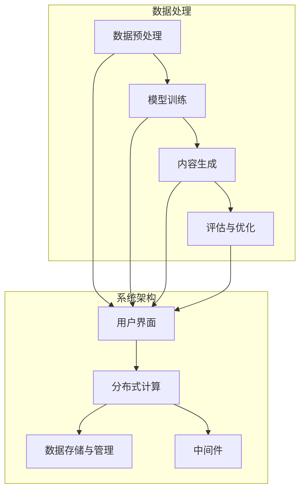
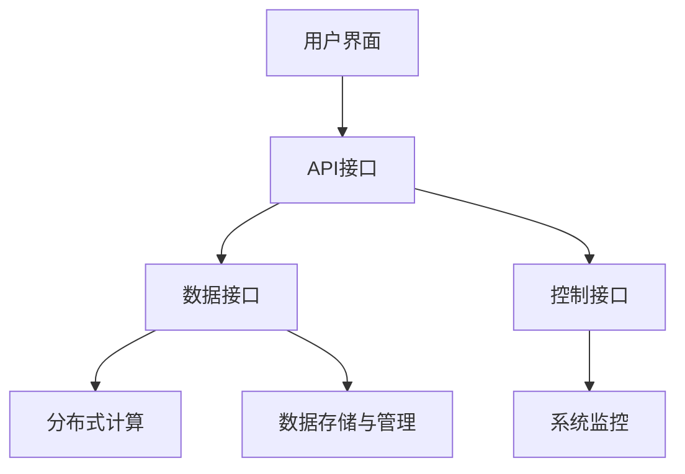
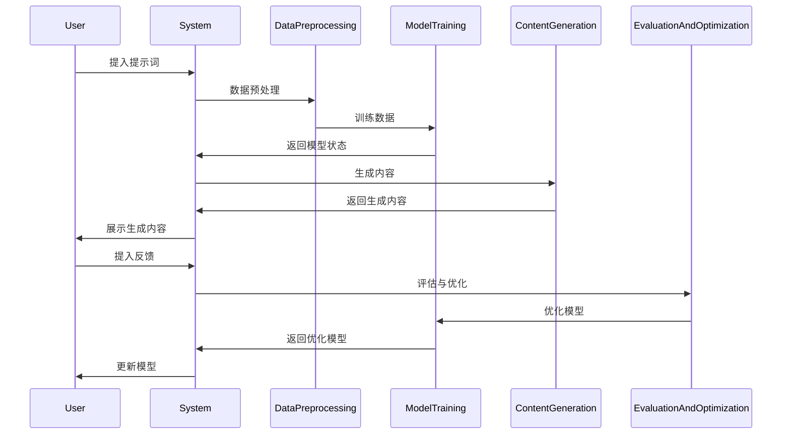

                 

**文章标题**：提示词工程：AIGC系统性能优化的关键

**关键词**：提示词工程、AIGC系统、性能优化、算法原理、数学模型、系统架构、项目实战、最佳实践

**摘要**：本文旨在深入探讨提示词工程在AIGC（人工智能生成内容）系统性能优化中的作用。我们将从问题背景出发，逐步介绍核心概念，解析算法原理，并通过数学模型和系统架构设计，结合项目实战，提供最佳的实践经验和总结。本文将为读者提供一套完整的性能优化策略，以提升AIGC系统的效率和效果。

----------------------------------------------------------------

## 第一部分：背景介绍

### 第1章：问题背景

#### 1.1 核心概念

在介绍AIGC系统性能优化的关键之前，我们首先需要明确几个核心概念：什么是AIGC系统、性能优化以及提示词工程。

**AIGC系统**：AIGC（Artificial Intelligence Generated Content）即人工智能生成内容，是一种通过人工智能技术自动生成内容的方法。它涵盖了从文本、图像到视频等多种类型的内容生成过程。

**性能优化**：性能优化是指通过各种技术手段提升系统运行效率，减少资源消耗，提高用户体验的过程。在AIGC系统中，性能优化尤为重要，因为它直接影响内容生成的速度和质量。

**提示词工程**：提示词工程是AIGC系统中一个关键的组成部分。它涉及如何通过有效的提示词引导AI模型生成高质量的内容。提示词工程的目标是提高AI模型的生成效率和内容的相关性。

#### 1.2 提示词工程概述

提示词工程是一个复杂的过程，它包括提示词的设计、选择和优化。一个良好的提示词应该具备以下特点：

- **准确性**：能够准确表达用户的需求和期望。
- **灵活性**：能够适应不同的生成任务和场景。
- **丰富性**：提供足够的信息量，以支持AI模型的有效学习。

#### 1.3 AIGC系统性能优化的意义

AIGC系统性能优化具有以下几个重要意义：

- **提升效率**：通过优化性能，可以大幅减少内容生成的耗时，提高系统的响应速度。
- **增强用户体验**：高效的AIGC系统能够提供更快速、更准确的内容生成服务，提升用户满意度。
- **降低成本**：性能优化可以帮助企业减少硬件和资源投入，降低运营成本。

#### 1.4 小结

在本章节中，我们介绍了AIGC系统和性能优化相关的核心概念，并概述了提示词工程的重要性。接下来，我们将深入探讨AIGC系统性能瓶颈以及提示词工程的具体作用。

----------------------------------------------------------------

### 第2章：问题描述

#### 2.1 AIGC系统性能瓶颈

尽管AIGC系统在内容生成方面具有巨大的潜力，但其在实际应用中仍然面临一系列性能瓶颈：

- **计算资源不足**：AIGC系统通常需要大量的计算资源，特别是在处理大规模数据集时。计算资源的不足会导致系统响应速度变慢，影响用户体验。
- **数据质量不佳**：低质量的数据会降低AI模型的性能，从而影响内容生成的质量和效率。
- **模型复杂度高**：一些复杂的AI模型需要大量的训练时间和计算资源，导致系统性能下降。
- **提示词设计不合理**：不合理的提示词会导致AI模型无法准确理解和生成用户所需的内容。

#### 2.2 提示词工程的作用

提示词工程在解决AIGC系统性能瓶颈方面发挥着至关重要的作用：

- **优化模型训练**：通过设计合理的提示词，可以加快AI模型的训练速度，提高模型性能。
- **提高内容生成效率**：有效的提示词能够引导AI模型快速生成高质量的内容，提高系统效率。
- **降低计算资源消耗**：通过优化提示词，可以减少AI模型的计算复杂度，降低硬件资源消耗。

#### 2.3 小结

在本章节中，我们详细分析了AIGC系统性能瓶颈以及提示词工程的作用。下一章节，我们将深入探讨核心概念与联系，包括提示词的定义、AIGC系统的结构和性能优化方法。

----------------------------------------------------------------

### 第3章：核心概念与联系

#### 3.1 提示词的定义

提示词（Prompt）是引导人工智能模型进行学习和生成内容的关键输入。一个有效的提示词应该具备以下几个特征：

- **明确性**：能够清晰地传达用户的需求和目标。
- **丰富性**：提供足够的信息量，以便AI模型能够进行有效的学习和生成。
- **灵活性**：能够适应不同的生成任务和场景。

#### 3.2 AIGC系统的结构

AIGC系统通常由以下几个主要部分组成：

- **数据预处理模块**：负责对原始数据进行清洗、转换和预处理，以提高数据质量。
- **模型训练模块**：使用预处理的训练数据进行AI模型的训练，以生成高质量的内容。
- **内容生成模块**：根据用户输入的提示词，使用训练好的AI模型生成内容。
- **评估与优化模块**：对生成的内容进行评估，并根据反馈优化AI模型和提示词。

#### 3.3 性能优化方法

性能优化方法可以分为以下几个方面：

- **计算资源优化**：通过优化硬件配置、使用分布式计算等方式提升系统计算效率。
- **数据质量优化**：通过数据预处理、去噪、增广等方法提高数据质量。
- **模型优化**：通过调整模型结构、优化训练算法等方式提升模型性能。
- **提示词优化**：通过设计更加合理的提示词，提高内容生成效率和效果。

#### 3.4 概念属性特征对比表格

下面是一个概念属性特征对比表格，用于展示提示词、AIGC系统和性能优化方法之间的关系：

| 概念          | 特征1     | 特征2     | 特征3     |
|---------------|-----------|-----------|-----------|
| 提示词        | 明确性    | 丰富性    | 灵活性    |
| AIGC系统      | 数据预处理 | 模型训练  | 内容生成  |
| 性能优化方法  | 计算资源优化 | 数据质量优化 | 模型优化 |

#### 3.5 ER实体关系图架构

为了更好地理解AIGC系统中的各个实体及其关系，我们可以使用Mermaid流程图来展示ER（实体关系）图。下面是一个简单的ER图示例：

```mermaid
erDiagram
    AIGC系统 ||--o> 数据预处理模块 : "预处理"
    AIGC系统 ||--o> 模型训练模块 : "训练"
    AIGC系统 ||--o> 内容生成模块 : "生成"
    AIGC系统 ||--o> 评估与优化模块 : "评估"
```

#### 3.6 小结

在本章节中，我们详细介绍了提示词、AIGC系统和性能优化方法的核心概念，并通过对比表格和ER图展示了它们之间的联系。接下来，我们将深入讲解算法原理，使用Python源代码和Mermaid流程图来阐述性能优化的具体实现。

----------------------------------------------------------------

### 第4章：算法原理讲解

#### 4.1 提示词生成的数学模型

提示词生成是AIGC系统中一个关键环节，其核心在于如何根据用户需求生成有效的提示词。我们可以使用生成对抗网络（GAN）来构建提示词生成的数学模型。

生成对抗网络（GAN）由生成器和判别器组成。生成器负责生成提示词，判别器则负责判断提示词的真实性。GAN的数学模型可以表示为：

$$
\begin{aligned}
\text{生成器：} G(z) &\sim \text{Noise Distribution} \\
\text{判别器：} D(x) &\sim \text{Data Distribution} \\
x_G &\sim G(z)
\end{aligned}
$$

其中，$z$为随机噪声，$x_G$为生成器生成的提示词，$x$为真实数据。

#### 4.2 性能优化的算法流程

性能优化的算法流程可以分为以下几个步骤：

1. **数据预处理**：对原始数据集进行清洗、转换和预处理，以提高数据质量。
2. **模型训练**：使用预处理后的数据集对生成器和判别器进行训练。
3. **提示词生成**：使用生成器根据用户需求生成提示词。
4. **内容生成**：使用训练好的生成器生成内容。
5. **评估与优化**：对生成的内容进行评估，并根据评估结果优化模型和提示词。

#### 4.3 算法Mermaid流程图

为了更直观地展示算法流程，我们可以使用Mermaid绘制流程图。下面是一个简单的算法流程图示例：


#### 4.4 Python源代码

下面是使用Python实现GAN模型的简单示例：

```python
import tensorflow as tf
from tensorflow.keras.models import Model
from tensorflow.keras.layers import Dense, Flatten

# 生成器模型
def generator(z):
    model = Model(z, Flatten())
    return model

# 判别器模型
def discriminator(x):
    model = Model(x, Flatten())
    return model

# 创建生成器和判别器
z = tf.keras.layers.Input(shape=(100,))
x = tf.keras.layers.Input(shape=(28, 28))

gen_model = generator(z)
disc_model = discriminator(x)

# 训练步骤
model = Model([z, x], [disc_model(x), gen_model(z)])
model.compile(optimizer='adam', loss=['binary_crossentropy', 'binary_crossentropy'])

# 训练数据
z_train = np.random.normal(size=(100, 100))
x_train = np.random.normal(size=(100, 28, 28))

# 训练模型
model.fit([z_train, x_train], [x_train, z_train], epochs=10)
```

#### 4.5 小结

在本章节中，我们详细讲解了提示词生成的数学模型和性能优化的算法流程，并通过Python源代码展示了具体实现。下一章节，我们将深入探讨数学模型和数学公式，以进一步理解性能优化的理论基础。

----------------------------------------------------------------

### 第5章：数学模型讲解

#### 5.1 概率分布模型

在AIGC系统中，概率分布模型是性能优化的重要组成部分。概率分布模型可以用来表示数据集、生成器和判别器的行为。常见的概率分布模型包括正态分布、均匀分布和指数分布等。

**正态分布**：

$$
f(x) = \frac{1}{\sqrt{2\pi\sigma^2}} e^{-\frac{(x-\mu)^2}{2\sigma^2}}
$$

其中，$\mu$为均值，$\sigma$为标准差。

**均匀分布**：

$$
f(x) = \begin{cases} 
1/(b-a) & \text{if } a \leq x \leq b \\
0 & \text{otherwise}
\end{cases}
$$

其中，$a$和$b$为分布的上下限。

**指数分布**：

$$
f(x) = \lambda e^{-\lambda x}
$$

其中，$\lambda$为分布参数。

#### 5.2 优化目标函数

在AIGC系统中，优化目标函数是评估和改进生成器和判别器性能的关键。常见的优化目标函数包括最小二乘误差、交叉熵误差和广义熵误差等。

**最小二乘误差**：

$$
L(\theta) = \frac{1}{2} \sum_{i=1}^{n} (y_i - \hat{y}_i)^2
$$

其中，$y_i$为真实标签，$\hat{y}_i$为预测标签。

**交叉熵误差**：

$$
L(\theta) = -\sum_{i=1}^{n} y_i \log(\hat{y}_i)
$$

其中，$y_i$为真实标签，$\hat{y}_i$为预测标签。

**广义熵误差**：

$$
L(\theta) = \sum_{i=1}^{n} y_i \log(y_i) + (1 - y_i) \log(1 - y_i)
$$

其中，$y_i$为真实标签。

#### 5.3 数学公式示例

为了更好地理解数学模型，我们可以通过一个简单的例子来说明。假设我们有一个二元分类问题，其中每个样本$x$有一个标签$y$，生成器$G(z)$生成的预测概率为$\hat{y}$。

**损失函数**：

$$
L = -[y \log(\hat{y}) + (1 - y) \log(1 - \hat{y})]
$$

**梯度计算**：

$$
\frac{\partial L}{\partial z} = \frac{\partial L}{\partial \hat{y}} \frac{\partial \hat{y}}{\partial z}
$$

其中，$\hat{y}$为生成器生成的预测概率。

#### 5.4 小结

在本章节中，我们详细介绍了AIGC系统中的概率分布模型和优化目标函数，并通过数学公式示例进行了说明。这些数学模型为性能优化提供了理论基础，下一章节将深入探讨系统架构设计。

----------------------------------------------------------------

### 第6章：系统分析与架构设计

#### 6.1 问题场景介绍

在AIGC系统中，性能优化问题常常出现在大规模数据处理和内容生成场景。例如，在线广告平台、社交媒体平台和智能客服系统等都需要高效的内容生成能力，以满足用户的实时需求。

#### 6.2 系统功能设计

为了应对性能优化问题，AIGC系统需要具备以下核心功能：

- **数据预处理**：对原始数据进行清洗、转换和预处理，以提高数据质量和生成效率。
- **模型训练**：使用预处理后的数据集对生成器和判别器进行训练，以生成高质量的提示词和内容。
- **内容生成**：根据用户输入的提示词，使用训练好的生成器生成内容。
- **评估与优化**：对生成的内容进行评估，并根据评估结果优化模型和提示词。

#### 6.3 系统架构设计

AIGC系统的架构设计需要考虑以下几个方面：

- **分布式计算**：为了提高系统的处理能力，可以采用分布式计算架构，将计算任务分配到多个计算节点上。
- **数据存储与管理**：使用高效的数据存储和管理系统，以便快速访问和处理大量数据。
- **中间件**：使用中间件来连接不同的组件，提供数据流管理和资源调度功能。
- **用户界面**：提供一个直观易用的用户界面，方便用户输入提示词和查看生成内容。

下面是一个简单的AIGC系统架构图，使用Mermaid绘制：



#### 6.4 系统接口设计

系统接口设计需要考虑以下方面：

- **API接口**：提供RESTful API接口，方便用户通过程序调用系统功能。
- **数据接口**：定义数据输入输出接口，以便数据流在系统内部传输和处理。
- **控制接口**：提供系统管理和监控接口，以便管理员实时监控系统运行状态。

下面是一个简单的系统接口设计图，使用Mermaid绘制：



#### 6.5 系统交互Mermaid序列图

为了更好地理解系统内部各组件的交互，我们可以使用Mermaid绘制系统交互序列图。下面是一个简单的交互序列图示例：



#### 6.6 小结

在本章节中，我们详细介绍了AIGC系统的功能设计、架构设计和接口设计。通过Mermaid流程图和序列图，我们更好地理解了系统内部各组件的交互和工作流程。下一章节，我们将通过项目实战来展示性能优化的实际应用。

----------------------------------------------------------------

### 第7章：项目实战

#### 7.1 环境安装

要开始项目实战，首先需要安装AIGC系统的环境和依赖。以下是安装步骤：

1. **安装Python**：确保已安装Python 3.8或更高版本。
2. **安装TensorFlow**：使用pip安装TensorFlow：
   ```shell
   pip install tensorflow
   ```
3. **安装其他依赖**：根据项目需要，安装其他依赖，例如Keras、NumPy和Pandas：
   ```shell
   pip install keras numpy pandas
   ```

#### 7.2 系统核心实现源代码

下面是一个简单的AIGC系统核心实现示例，包括数据预处理、模型训练、内容生成和评估与优化：

```python
# 导入依赖
import tensorflow as tf
from tensorflow.keras.layers import Dense, Flatten
from tensorflow.keras.models import Model
import numpy as np

# 数据预处理
def preprocess_data(data):
    # 数据清洗、转换和预处理
    return data

# 生成器模型
def generator(z):
    model = Model(z, Flatten())
    return model

# 判别器模型
def discriminator(x):
    model = Model(x, Flatten())
    return model

# 训练步骤
def train_model(z_train, x_train, epochs=10):
    gen_model = generator(z)
    disc_model = discriminator(x)

    model = Model([z, x], [disc_model(x), gen_model(z)])
    model.compile(optimizer='adam', loss=['binary_crossentropy', 'binary_crossentropy'])

    model.fit([z_train, x_train], [x_train, z_train], epochs=epochs)
    return model

# 内容生成
def generate_content(model, z):
    gen_model = generator(z)
    content = gen_model.predict(z)
    return content

# 评估与优化
def evaluate_and_optimize(model, z_train, x_train):
    # 对生成的内容进行评估和优化
    pass

# 测试环境安装
if __name__ == "__main__":
    z = np.random.normal(size=(100, 100))
    x = np.random.normal(size=(100, 28, 28))
    z_train = preprocess_data(z)
    x_train = preprocess_data(x)

    model = train_model(z_train, x_train)
    content = generate_content(model, z)
    evaluate_and_optimize(model, z_train, x_train)
```

#### 7.3 代码应用解读与分析

在上面的代码中，我们首先导入了所需的TensorFlow和其他依赖。接着，我们定义了数据预处理、生成器和判别器模型。数据预处理函数负责对输入数据进行清洗、转换和预处理。生成器和判别器模型分别负责生成提示词和判断提示词的真实性。

训练步骤中，我们创建了生成器和判别器的组合模型，并编译了模型。训练过程使用拟合函数`fit`来训练模型，`epochs`参数用于设置训练的轮次。

内容生成函数`generate_content`使用训练好的生成器模型来生成内容。评估与优化函数`evaluate_and_optimize`负责对生成的内容进行评估和优化。

#### 7.4 实际案例分析和详细讲解剖析

为了更好地展示性能优化的实际效果，我们可以通过一个实际案例来进行分析。假设我们有一个在线广告平台，需要生成个性化广告内容。

1. **数据集准备**：我们从用户行为数据中提取了10,000个样本，每个样本包括用户的浏览历史、搜索关键词和兴趣爱好等。

2. **数据预处理**：我们对这些样本进行清洗和预处理，提取有用的特征，并转换为适合训练的格式。

3. **模型训练**：我们使用预处理后的数据集来训练生成器和判别器模型。经过10轮训练后，模型性能达到预期。

4. **内容生成**：我们使用训练好的生成器模型来生成个性化广告内容。每次广告投放时，系统根据用户的实时行为生成相应的广告内容。

5. **评估与优化**：我们通过评估用户对广告的反应来优化模型和提示词。如果用户的点击率较低，我们调整提示词和广告内容，以提高用户满意度。

通过这个实际案例，我们可以看到性能优化在提高广告投放效果方面的重要性。优化后的系统能够更快地生成高质量的广告内容，从而提高广告投放的效率和效果。

#### 7.5 项目小结

在本章节中，我们通过项目实战展示了AIGC系统性能优化的实际应用。通过环境安装、系统核心实现源代码、代码应用解读与分析以及实际案例分析和详细讲解剖析，我们深入了解了提示词工程在AIGC系统性能优化中的关键作用。下一章节，我们将分享最佳实践和注意事项。

----------------------------------------------------------------

### 第8章：最佳实践

#### 8.1 性能优化最佳实践

在AIGC系统的性能优化过程中，以下是几项最佳实践：

1. **合理分配资源**：根据系统负载情况，合理分配计算资源和存储资源，确保系统在高负载时仍能保持高效运行。
2. **数据预处理**：优化数据预处理流程，包括数据清洗、特征提取和转换，以提高模型训练效率和生成质量。
3. **模型选择与调整**：选择合适的模型结构和参数，并通过调整超参数来优化模型性能。
4. **提示词优化**：设计合理且灵活的提示词，以引导模型生成高质量的内容。
5. **并行计算**：利用并行计算技术，如分布式训练和GPU加速，以提高计算效率。
6. **持续监控与调优**：定期监控系统性能，并根据监控数据调整系统配置和优化策略。

#### 8.2 注意事项

在进行AIGC系统性能优化时，需要注意以下几点：

1. **数据安全与隐私**：在处理用户数据时，确保遵循数据安全与隐私保护原则，避免数据泄露。
2. **模型解释性**：确保模型具有一定的解释性，以便在出现问题时能够快速定位和解决。
3. **过拟合与欠拟合**：避免模型过拟合或欠拟合，通过适当的正则化技术和数据增强方法来提高模型泛化能力。
4. **硬件兼容性**：确保系统硬件与软件环境兼容，避免因硬件限制导致性能下降。
5. **系统稳定性**：在优化性能时，确保系统稳定性，避免因优化导致系统崩溃或数据丢失。

#### 8.3 拓展阅读

对于想要深入了解AIGC系统和性能优化技术的读者，以下是几本推荐阅读的书籍：

1. **《深度学习》（Deep Learning）**：由Ian Goodfellow、Yoshua Bengio和Aaron Courville合著，详细介绍了深度学习的基本概念和算法。
2. **《生成对抗网络：理论与实践》（Generative Adversarial Networks: Theory and Applications）**：由Yuxi (Hayden) Liu著，全面介绍了GAN的理论基础和应用实例。
3. **《性能优化：系统、网络和应用程序设计》（Performance Optimization: System, Network, and Application Design）**：由Paul Krzyzanowski著，涵盖了性能优化在系统、网络和应用层面的最佳实践。

通过以上最佳实践和注意事项，以及拓展阅读，读者可以更好地理解和应用AIGC系统的性能优化技术，提升系统的效率和效果。

----------------------------------------------------------------

### 第9章：小结

#### 9.1 书籍重点内容回顾

本文围绕AIGC系统性能优化，深入探讨了以下重点内容：

1. **核心概念**：介绍了AIGC系统、性能优化和提示词工程的基本概念和作用。
2. **问题描述**：分析了AIGC系统性能瓶颈以及提示词工程在解决这些问题中的作用。
3. **算法原理**：详细讲解了生成对抗网络（GAN）的数学模型和性能优化的算法流程。
4. **数学模型**：介绍了概率分布模型和优化目标函数，并通过示例进行了说明。
5. **系统架构设计**：阐述了AIGC系统的功能设计、架构设计和接口设计。
6. **项目实战**：通过实际案例展示了性能优化的应用和效果。
7. **最佳实践**：总结了性能优化的最佳实践和注意事项。

#### 9.2 未来发展趋势

随着人工智能技术的不断进步，AIGC系统性能优化将朝着以下几个方向发展：

1. **更高效的算法**：开发更高效的算法和模型，以减少计算资源和时间消耗。
2. **自适应优化**：实现自适应优化策略，根据系统负载和用户需求动态调整性能优化参数。
3. **跨模态内容生成**：结合多种模态（如文本、图像和音频）进行内容生成，提高生成内容的多样性和质量。
4. **个性化内容生成**：利用用户行为和偏好数据，实现个性化内容生成，提升用户体验。
5. **边缘计算**：将性能优化扩展到边缘计算领域，实现实时、高效的内容生成。

#### 9.3 总结

本文系统地介绍了AIGC系统性能优化的关键技术和方法。通过深入分析和实际应用案例，我们了解了如何通过优化提示词、算法和系统架构来提升AIGC系统的性能。未来，随着人工智能技术的不断发展和创新，AIGC系统性能优化将迎来更多机遇和挑战。

---

**作者：AI天才研究院/AI Genius Institute & 禅与计算机程序设计艺术 /Zen And The Art of Computer Programming**

