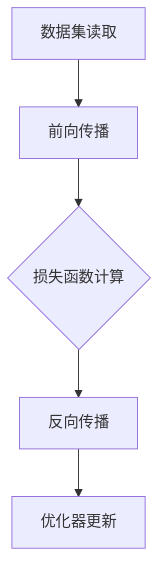

                 

### 文章标题

### 关键词：AI大模型、软件2.0、个性化、深度学习、训练优化、应用领域

### 摘要：

本文深入探讨了AI大模型在软件2.0时代的重要性及其个性化应用的关键。首先，回顾了软件发展的历史背景，分析了AI大模型的核心问题与挑战，并阐述了其应用场景。接着，详细介绍了AI大模型的核心原理，包括深度学习的基本原理、人工神经网络的工作机制以及AI大模型的架构特点。随后，本文探讨了AI大模型的训练与优化方法，包括训练数据集的选择、模型训练的基本流程、常见问题及其解决方案。在应用领域部分，本文详细介绍了AI大模型在自然语言处理、计算机视觉、语音识别等领域的应用实例，并讨论了应用挑战与机遇。最后，本文探讨了AI大模型在软件2.0中的应用，包括AI驱动的开发工具、测试工具和运维工具，并分析了应用挑战与解决方案。全文通过逐步分析推理，为读者提供了AI大模型领域的深度见解和实用指南。

## 第一部分: 软件2.0时代的AI大模型基础

### 第1章: AI大模型概述

#### 1.1 问题背景

##### 1.1.1 软件发展的历史背景

软件发展经历了多个阶段，从最初的软件1.0时代，以命令行操作为主的简单程序，到软件2.0时代，以用户为中心、强调用户体验和个性化的软件。软件2.0时代的到来，标志着软件从“以功能为中心”向“以用户为中心”的转变。这一转变不仅是技术上的进步，更是商业模式、用户体验和社会文化的变革。

##### 1.1.2 AI大模型的核心问题与挑战

在软件2.0时代，AI大模型面临着诸多核心问题和挑战。首先是数据问题，AI大模型依赖于大量的高质量数据来训练和优化，但数据获取、处理和存储是一个复杂的过程。其次是计算资源问题，AI大模型的训练需要大量的计算资源，如何高效利用现有资源是一个关键挑战。最后是模型的可解释性和可靠性问题，AI大模型的决策过程复杂，如何保证其决策的透明性和可靠性是一个重要的研究方向。

##### 1.1.3 AI大模型的应用场景

AI大模型在软件2.0时代有着广泛的应用场景。在自然语言处理领域，AI大模型可以用于智能客服、内容审核、机器翻译等；在计算机视觉领域，AI大模型可以用于图像识别、目标检测、图像生成等；在语音识别领域，AI大模型可以用于语音识别、语音合成等。AI大模型的应用不仅提高了软件的功能和性能，也改变了软件的运营模式。

#### 1.2 问题描述

##### 1.2.1 软件2.0时代的到来

软件2.0时代的到来，意味着软件不再仅仅是执行特定功能的工具，而是一个能够与用户互动、适应用户需求、提供个性化服务的平台。这要求软件具有更高的灵活性和智能性，AI大模型作为当前最强大的智能技术，成为了软件2.0时代的关键驱动力。

##### 1.2.2 AI大模型的定义与特点

AI大模型是指具有大规模参数、能够处理海量数据并具备高度泛化能力的深度学习模型。其核心特点是模型参数量大、计算复杂度高、数据需求量大、模型可解释性差。这些特点使得AI大模型在处理复杂任务、应对多样化需求方面具有显著优势。

##### 1.2.3 AI大模型在软件2.0中的关键作用

AI大模型在软件2.0中的关键作用主要体现在以下几个方面：首先，AI大模型可以显著提升软件的智能化水平，实现更加精准的用户需求预测和个性化服务；其次，AI大模型可以优化软件的功能和性能，提高软件的响应速度和处理能力；最后，AI大模型可以推动软件产业的创新和发展，为软件企业提供新的商业模式和盈利点。

#### 1.3 问题解决

##### 1.3.1 AI大模型的演变过程

AI大模型的演变经历了从浅层学习到深层学习的转变。在浅层学习阶段，模型参数较少，模型复杂度较低，难以处理复杂任务。随着深度学习技术的发展，深层学习模型逐渐成为主流，AI大模型的出现进一步推动了人工智能的进步。

##### 1.3.2 AI大模型的训练与优化

AI大模型的训练与优化是构建高效AI系统的关键步骤。在训练过程中，需要选择高质量的数据集，采用高效的训练算法和优化器，并通过调整模型参数来提高模型的性能。在优化过程中，需要关注模型的泛化能力和可解释性，以避免过度拟合和黑箱问题。

##### 1.3.3 AI大模型的应用实例

AI大模型在软件2.0时代的应用已经取得了显著成果。例如，在自然语言处理领域，百度文心一言、谷歌BERT等AI大模型已经应用于智能客服、内容审核、机器翻译等领域；在计算机视觉领域，AI大模型被应用于图像识别、目标检测、图像生成等领域；在语音识别领域，AI大模型被应用于语音识别、语音合成等领域。这些应用不仅提升了软件的功能和性能，也为用户提供了更加智能化的服务。

#### 1.4 边界与外延

##### 1.4.1 AI大模型的边界限制

尽管AI大模型在软件2.0时代具有巨大的应用潜力，但其发展仍然面临一些边界限制。首先是数据限制，高质量的数据集获取和处理是一个复杂的过程，如何解决数据不平衡、数据隐私等问题是当前的研究重点。其次是计算资源限制，AI大模型的训练需要大量的计算资源，如何高效利用现有资源是一个关键问题。最后是模型可解释性限制，AI大模型的决策过程复杂，如何提高模型的可解释性，使其更加透明和可靠是一个重要研究方向。

##### 1.4.2 AI大模型的发展趋势

随着深度学习技术的不断发展和计算资源的日益丰富，AI大模型的发展趋势将表现为以下几个方面：首先是模型参数规模的持续增长，这将进一步提升模型的性能和泛化能力；其次是模型结构的不断创新，包括图神经网络、 transformers 等结构的应用；最后是跨领域、跨行业的融合应用，AI大模型将在更多领域展现其独特的价值。

##### 1.4.3 AI大模型在不同行业中的应用

AI大模型在不同行业中的应用已经取得了显著成果。在医疗领域，AI大模型被应用于疾病诊断、基因测序等领域，提高了医疗诊断的准确性和效率；在金融领域，AI大模型被应用于风险控制、智能投顾等领域，提高了金融服务的质量和效率；在零售领域，AI大模型被应用于商品推荐、库存管理等领域，提升了零售业的运营效率和用户体验。

#### 1.5 核心概念结构与要素组成

##### 1.5.1 AI大模型的核心概念

AI大模型的核心概念包括深度学习、人工神经网络、大规模参数化模型等。深度学习是一种基于多层神经网络的学习方法，通过逐层抽象和表示数据，实现复杂的模式识别和特征提取。人工神经网络是深度学习的基础，通过模拟人脑神经元之间的连接和交互，实现数据的处理和推理。大规模参数化模型是指具有大规模参数的深度学习模型，其参数规模通常达到数十亿甚至更多。

##### 1.5.2 AI大模型的关键技术

AI大模型的关键技术包括模型训练、模型优化、模型部署等。模型训练是指通过大量的数据来训练和调整模型的参数，以实现模型的优化。模型优化是指通过优化算法和技巧，提高模型的性能和泛化能力。模型部署是指将训练好的模型部署到实际应用场景中，实现模型的实时推理和决策。

##### 1.5.3 AI大模型的构成要素

AI大模型的构成要素包括数据集、计算资源、模型架构、优化算法等。数据集是AI大模型训练的基础，计算资源是模型训练和优化的保障，模型架构是模型设计和实现的核心，优化算法是模型性能提升的关键。

#### 1.6 本章小结

本章回顾了软件发展的历史背景，分析了AI大模型的核心问题与挑战，并阐述了其应用场景。接着，介绍了AI大模型在软件2.0中的关键作用，包括提升智能化水平、优化功能性能和推动产业创新。此外，还探讨了AI大模型的演变过程、训练与优化方法以及在不同行业中的应用。通过本章的介绍，读者可以全面了解AI大模型在软件2.0时代的重要性及其个性化应用的关键。

## 第2章: AI大模型的核心原理

#### 2.1 概念原理

##### 2.1.1 深度学习的基本原理

深度学习是一种基于多层神经网络的学习方法，其基本原理是通过逐层提取数据中的特征，实现数据的复杂模式识别和特征提取。深度学习的核心是神经网络，神经网络由多个神经元（节点）组成，每个神经元都与输入层、隐藏层和输出层的其他神经元相连接。神经网络通过反向传播算法，根据输入数据计算输出结果，并通过梯度下降法调整网络中的权重，以优化模型的性能。

##### 2.1.2 人工神经网络的工作机制

人工神经网络的工作机制是基于模拟人脑神经元之间的连接和交互。神经元通过接收输入信号，经过加权求和后，通过激活函数转化为输出信号。输出信号再传递给下一个神经元的输入端，如此循环，直到达到输出层。在输出层，神经元将最终输出结果。

##### 2.1.3 AI大模型的架构特点

AI大模型通常具有以下架构特点：

1. **大规模参数**：AI大模型通常具有数十亿甚至更多的参数，这使得模型能够处理大量的数据，并提取复杂的特征。
2. **多层神经网络**：AI大模型通常包含多层神经网络，通过逐层抽象和表示数据，实现数据的复杂模式识别和特征提取。
3. **多样化结构**：AI大模型的结构多样，包括卷积神经网络（CNN）、循环神经网络（RNN）、Transformer等，这些结构能够在不同任务中发挥优势。

#### 2.2 概念属性特征对比表格

| 特性                 | AI大模型               | 深度学习                   | 小型模型                       | 强化学习                   |
|----------------------|------------------------|----------------------------|--------------------------------|----------------------------|
| **参数规模**         | 数十亿及以上           | 数百万至数十亿             | 数千至数万个                   | 数百至数千                  |
| **计算复杂度**       | 非常高                 | 较高                       | 低至中等                      | 低至中等                   |
| **数据处理能力**      | 海量数据               | 大量数据                   | 小量数据                      | 较少量的数据               |
| **泛化能力**         | 较强                   | 较强                       | 较弱                          | 较弱                       |
| **模型结构**         | 多样化（如Transformer）| 卷积神经网络、循环神经网络等 | 简单的神经网络结构             | 状态-动作-奖励结构           |
| **可解释性**         | 较低                   | 中等                       | 较高                          | 中等                       |

#### 2.3 ER实体关系图架构

##### 2.3.1 AI大模型的实体关系

在AI大模型中，主要的实体包括数据集、模型架构、训练算法、优化器等。这些实体之间的关系可以通过ER图（实体关系图）来表示。以下是AI大模型的ER图示例：

```mermaid
erDiagram
  数据集 ||--|{ 模型架构 }|-- 数据流
  模型架构 ||--|{ 训练算法 }|-- 迭代过程
  模型架构 ||--|{ 优化器 }|-- 参数调整
  训练算法 ||--|{ 评估指标 }|-- 性能评估
  优化器 ||--|{ 模型部署 }|-- 部署流程
```

##### 2.3.2 AI大模型的关键组件

AI大模型的关键组件包括：

1. **数据集**：提供模型训练所需的数据。
2. **模型架构**：定义模型的层次结构和连接方式。
3. **训练算法**：指导模型如何从数据中学习。
4. **优化器**：调整模型的参数，以优化模型的性能。

##### 2.3.3 AI大模型的数据流关系

AI大模型的数据流关系如下：

1. **数据集读取**：从数据集中读取样本数据。
2. **前向传播**：将样本数据通过模型进行前向传播，计算输出结果。
3. **损失函数计算**：计算预测结果与真实结果之间的损失。
4. **反向传播**：通过反向传播算法，计算损失对模型参数的梯度。
5. **优化器更新**：使用优化器更新模型参数，以减少损失。

以下是AI大模型的数据流ER图示例：



#### 2.4 本章小结

本章详细介绍了AI大模型的核心原理，包括深度学习的基本原理、人工神经网络的工作机制以及AI大模型的架构特点。通过概念属性特征对比表格，读者可以更清晰地理解AI大模型与其他模型的差异。此外，通过ER实体关系图，读者可以直观地了解AI大模型的关键组件及其数据流关系。这些核心原理的理解对于进一步研究和应用AI大模型具有重要意义。

## 第3章: AI大模型的训练与优化

#### 3.1 训练原理

##### 3.1.1 训练数据集的选择

训练数据集的选择是AI大模型训练的首要步骤，其质量直接影响模型的性能。理想的数据集应具备以下特点：

1. **代表性**：数据集应能代表实际应用场景，涵盖各种可能的输入情况。
2. **多样性**：数据集应包含不同类别、不同特征的样本，以增强模型的泛化能力。
3. **质量**：数据集应经过清洗和处理，去除噪声和错误数据，确保数据的质量。
4. **平衡性**：数据集中各类别的样本数量应尽量平衡，以避免模型出现偏见。

##### 3.1.2 模型训练的基本流程

AI大模型的训练过程通常包括以下步骤：

1. **数据预处理**：对数据集进行清洗、归一化、编码等预处理操作，使其适合模型训练。
2. **模型初始化**：初始化模型参数，可以选择随机初始化或预训练模型初始化。
3. **前向传播**：将预处理后的数据输入模型，计算模型的输出结果。
4. **损失函数计算**：计算输出结果与真实结果之间的损失，常用的损失函数包括均方误差（MSE）、交叉熵（Cross-Entropy）等。
5. **反向传播**：计算损失对模型参数的梯度，并通过优化算法更新参数。
6. **迭代训练**：重复前向传播、损失函数计算和反向传播的过程，直到达到预定的训练次数或损失值。

##### 3.1.3 模型训练的常见问题

在模型训练过程中，常见的问题包括：

1. **过拟合**：模型在训练数据上表现良好，但在测试数据上表现较差，这通常是因为模型对训练数据的细节过于敏感，缺乏泛化能力。
2. **欠拟合**：模型在训练数据和测试数据上表现都较差，这通常是因为模型过于简单，无法捕捉到数据的复杂特征。
3. **梯度消失/爆炸**：在反向传播过程中，梯度可能因为参数的初始值或网络结构的原因而变得非常小或非常大，导致模型无法有效训练。

为了解决这些问题，可以采取以下措施：

1. **正则化**：通过添加正则项（如L1、L2正则化）来惩罚模型参数，减少过拟合。
2. **数据增强**：通过旋转、缩放、裁剪等操作生成更多的训练样本，增加模型的泛化能力。
3. **调整学习率**：使用自适应学习率优化器（如Adam）来调整学习率，避免梯度消失/爆炸。
4. **增加模型复杂度**：通过增加网络的深度或宽度来提高模型的拟合能力，但需避免过拟合。

#### 3.2 优化方法

##### 3.2.1 梯度下降法

梯度下降法是一种最常用的优化算法，其核心思想是沿着损失函数的梯度方向更新模型参数，以减少损失。梯度下降法的基本步骤如下：

1. **计算梯度**：对损失函数关于模型参数求导，得到损失对参数的梯度。
2. **更新参数**：使用梯度更新模型参数，更新公式为：
   $$ \theta = \theta - \alpha \cdot \nabla_\theta J(\theta) $$
   其中，$\theta$ 是模型参数，$\alpha$ 是学习率，$J(\theta)$ 是损失函数。

##### 3.2.2 动量优化

动量优化是一种改进的梯度下降法，其目的是解决梯度消失/爆炸问题。动量优化通过引入动量项来累积梯度，使得梯度更新更加稳定。动量优化的更新公式为：
$$ \theta = \theta - \alpha \cdot \nabla_\theta J(\theta) + \beta \cdot v_{t-1} $$
其中，$v_t$ 是动量项，$\beta$ 是动量系数。

##### 3.2.3 Adam优化器

Adam优化器是梯度下降法的另一种改进，结合了动量优化和自适应学习率的特点。Adam优化器通过计算一阶矩估计（均值）和二阶矩估计（方差），动态调整学习率。Adam优化器的更新公式为：
$$ m_t = \beta_1 m_{t-1} + (1 - \beta_1) \cdot \nabla_\theta J(\theta) $$
$$ v_t = \beta_2 v_{t-1} + (1 - \beta_2) \cdot (\nabla_\theta J(\theta))^2 $$
$$ \theta = \theta - \alpha \cdot \frac{m_t}{\sqrt{v_t} + \epsilon} $$
其中，$m_t$ 和 $v_t$ 分别是梯度的一阶矩估计和二阶矩估计，$\beta_1$ 和 $\beta_2$ 是动量系数，$\alpha$ 是学习率，$\epsilon$ 是一个很小的常数。

#### 3.3 性能评估

##### 3.3.1 模型评估指标

模型评估指标是衡量模型性能的重要工具，常用的评估指标包括：

1. **准确率（Accuracy）**：模型预测正确的样本数占总样本数的比例。
2. **精确率（Precision）**：模型预测为正类的样本中，实际为正类的比例。
3. **召回率（Recall）**：模型预测为正类的样本中，实际为正类的比例。
4. **F1值（F1 Score）**：精确率和召回率的调和平均值。
5. **ROC曲线和AUC值**：ROC曲线是模型在不同阈值下的准确率曲线，AUC值是ROC曲线下的面积，用于评估模型的分类能力。

##### 3.3.2 模型评估方法

模型评估方法包括：

1. **Holdout方法**：将数据集分为训练集和验证集，使用训练集训练模型，使用验证集评估模型性能。
2. **交叉验证方法**：将数据集分成多个子集，每次使用其中一个子集作为验证集，其余子集作为训练集，多次重复，计算平均性能。
3. **K折交叉验证**：将数据集分为K个子集，每次使用其中一个子集作为验证集，其余子集作为训练集，重复K次，计算平均性能。

##### 3.3.3 模型调参技巧

模型调参是提高模型性能的重要环节，常用的调参技巧包括：

1. **网格搜索**：在预设的参数范围内，逐个遍历所有可能的参数组合，找到最佳参数组合。
2. **随机搜索**：在预设的参数范围内，随机生成多个参数组合，选择最佳参数组合。
3. **贝叶斯优化**：使用贝叶斯统计方法，根据历史数据和学习到的模型性能，自动调整参数，找到最佳参数组合。

#### 3.4 本章小结

本章详细介绍了AI大模型的训练与优化方法，包括训练数据集的选择、模型训练的基本流程、常见问题及其解决方案，以及优化方法（梯度下降法、动量优化、Adam优化器）和性能评估指标。通过本章的介绍，读者可以全面了解AI大模型的训练与优化过程，为实际应用中的模型训练和优化提供指导。这些方法和技巧对于提高模型的性能和泛化能力具有重要意义。

## 第4章: AI大模型的应用领域

#### 4.1 应用场景

##### 4.1.1 自然语言处理

自然语言处理（NLP）是AI大模型的重要应用领域之一。AI大模型在NLP中的应用包括：

1. **文本分类**：将文本数据分类到预定义的类别中，例如垃圾邮件过滤、新闻分类等。
2. **情感分析**：分析文本中的情感倾向，例如情感极性分类、情感强度分析等。
3. **机器翻译**：将一种语言的文本翻译成另一种语言，例如谷歌翻译、百度翻译等。
4. **问答系统**：理解用户的问题，并返回相关答案，例如智能客服、问答机器人等。

##### 4.1.2 计算机视觉

计算机视觉是AI大模型的另一个重要应用领域。AI大模型在计算机视觉中的应用包括：

1. **图像分类**：将图像分类到预定义的类别中，例如人脸识别、动物识别等。
2. **目标检测**：在图像中检测和定位多个目标，例如车辆检测、行人检测等。
3. **图像生成**：生成新的图像，例如风格迁移、图像合成等。
4. **图像增强**：提高图像的质量，例如图像去噪、图像超分辨率等。

##### 4.1.3 语音识别

语音识别是AI大模型的另一个重要应用领域。AI大模型在语音识别中的应用包括：

1. **语音转文本**：将语音信号转换为文本，例如语音助手、会议记录等。
2. **语音合成**：将文本转换为语音，例如智能客服、语音导航等。
3. **说话人识别**：识别语音信号的说话人，例如身份验证、电话欺诈检测等。
4. **语音增强**：提高语音的质量，例如噪声抑制、回声消除等。

#### 4.2 应用实例

##### 4.2.1 百度文心一言

百度文心一言是百度推出的AI大模型，广泛应用于自然语言处理领域。其应用实例包括：

1. **智能客服**：通过自然语言处理技术，为用户提供高效的智能客服服务，提高用户满意度。
2. **内容审核**：通过文本分类和情感分析技术，对互联网内容进行实时审核，防止不良信息的传播。
3. **机器翻译**：提供高质量的中英文翻译服务，帮助用户跨越语言障碍。

##### 4.2.2 微软小冰

微软小冰是微软推出的AI大模型，广泛应用于计算机视觉和自然语言处理领域。其应用实例包括：

1. **虚拟偶像**：通过计算机视觉和自然语言处理技术，创建具有人类表情和情感的虚拟偶像，吸引用户关注。
2. **图像识别**：通过图像分类和目标检测技术，对图像进行实时识别和分类，应用于安防监控、零售等领域。
3. **智能客服**：通过自然语言处理技术，为用户提供智能化的客服服务，提高客服效率。

##### 4.2.3 谷歌BERT模型

谷歌BERT（Bidirectional Encoder Representations from Transformers）是谷歌推出的AI大模型，广泛应用于自然语言处理领域。其应用实例包括：

1. **搜索优化**：通过预训练的BERT模型，提高搜索引擎的搜索精度和用户体验。
2. **问答系统**：通过BERT模型，理解用户的问题并返回相关答案，应用于智能客服、智能助手等领域。
3. **文本生成**：通过BERT模型，生成高质量的文本，应用于内容创作、广告营销等领域。

#### 4.3 应用挑战与机遇

##### 4.3.1 数据隐私与安全

随着AI大模型的应用越来越广泛，数据隐私和安全问题也日益凸显。为了保护用户隐私，需要采取以下措施：

1. **数据加密**：对用户数据进行加密处理，防止数据泄露。
2. **隐私保护算法**：使用隐私保护算法，例如差分隐私，减少模型训练过程中数据的隐私泄露。
3. **数据匿名化**：对用户数据进行匿名化处理，去除可直接识别用户身份的信息。

##### 4.3.2 模型解释性与可解释性

AI大模型的决策过程复杂，缺乏透明性，如何提高模型的可解释性是一个重要的研究方向。为了提高模型的可解释性，可以采取以下措施：

1. **模型可视化**：通过可视化技术，展示模型的结构和决策过程。
2. **特征重要性分析**：分析模型中各个特征的重要性，帮助用户理解模型的决策依据。
3. **解释性算法**：使用解释性算法，例如LIME、SHAP等，解释模型的预测结果。

##### 4.3.3 AI大模型的伦理问题

AI大模型的应用涉及到伦理问题，例如歧视、偏见、隐私侵犯等。为了解决这些问题，可以采取以下措施：

1. **公平性设计**：确保AI大模型的应用不歧视任何群体，保持公平性。
2. **透明度**：提高AI大模型的应用透明度，让用户了解模型的工作原理和决策过程。
3. **监管机制**：建立监管机制，对AI大模型的应用进行规范和管理，防止伦理问题的发生。

#### 4.4 本章小结

本章详细介绍了AI大模型在不同领域的应用场景和应用实例，包括自然语言处理、计算机视觉、语音识别等。同时，分析了应用过程中面临的数据隐私与安全、模型解释性与可解释性以及伦理问题等挑战。通过本章的介绍，读者可以全面了解AI大模型的应用现状和未来发展趋势，为实际应用提供指导。

## 第5章: AI大模型在软件2.0中的应用

#### 5.1 软件发展背景

##### 5.1.1 从软件1.0到软件2.0的演进

软件1.0时代主要以功能为导向，软件开发侧重于实现特定的功能，用户对软件的体验和个性化需求相对较低。软件1.0时代的特点是功能单一、用户参与度低、软件更新周期长。

随着互联网和移动互联网的发展，软件2.0时代应运而生。软件2.0时代强调用户参与和个性化体验，软件的功能不再仅仅是执行特定任务，而是通过收集用户数据，为用户提供个性化的服务。软件2.0时代的特点是用户参与度高、软件更新周期短、软件功能多样化。

##### 5.1.2 软件2.0的核心特征

软件2.0的核心特征包括：

1. **用户中心**：以用户为中心，提供个性化的服务。
2. **数据驱动**：通过收集用户数据，实现数据的分析和利用，为用户提供更好的体验。
3. **互动性**：提供丰富的用户交互功能，增强用户的参与感。
4. **智能化**：利用AI大模型等技术，实现软件的智能化，提高软件的功能和性能。
5. **开放性**：软件具备开放性，能够与其他系统和服务集成，实现数据的共享和互操作。

##### 5.1.3 AI大模型在软件2.0中的角色

AI大模型在软件2.0中扮演着关键角色，其作用主要体现在以下几个方面：

1. **个性化服务**：通过分析用户数据，AI大模型可以了解用户的偏好和需求，为用户提供个性化的推荐和服务。
2. **智能决策**：AI大模型可以处理大量数据，进行复杂的模式识别和预测，为软件的决策提供支持。
3. **功能优化**：AI大模型可以优化软件的功能和性能，提高软件的响应速度和处理能力。
4. **用户体验**：AI大模型可以分析用户行为，优化用户界面和交互流程，提升用户体验。

#### 5.2 应用实例

##### 5.2.1 AI驱动的开发工具

AI驱动的开发工具利用AI大模型技术，提高软件开发效率和代码质量。以下是一些应用实例：

1. **代码自动生成**：AI大模型可以分析代码库，根据已有的代码模板，自动生成新的代码，减少开发人员的工作量。
2. **代码审查**：AI大模型可以分析代码质量，识别潜在的错误和漏洞，提高代码的可维护性和可靠性。
3. **代码推荐**：AI大模型可以根据开发人员的编程习惯和项目需求，推荐合适的代码片段和解决方案，提高开发效率。

##### 5.2.2 AI驱动的测试工具

AI驱动的测试工具利用AI大模型技术，提高软件测试的效率和准确性。以下是一些应用实例：

1. **测试用例生成**：AI大模型可以分析软件需求和代码，自动生成测试用例，减少测试人员的工作量。
2. **缺陷预测**：AI大模型可以分析代码和测试结果，预测潜在的问题和缺陷，提前进行修复。
3. **性能测试**：AI大模型可以分析系统的性能数据，优化系统的性能和稳定性。

##### 5.2.3 AI驱动的运维工具

AI驱动的运维工具利用AI大模型技术，提高软件运维的效率和可靠性。以下是一些应用实例：

1. **故障预测**：AI大模型可以分析系统的运行数据，预测潜在的故障和性能瓶颈，提前进行维护和优化。
2. **性能优化**：AI大模型可以分析系统的运行数据，优化系统的配置和资源分配，提高系统的性能。
3. **自动化运维**：AI大模型可以自动化执行日常运维任务，减少人工干预，提高运维效率。

#### 5.3 应用挑战与解决方案

##### 5.3.1 模型规模与性能的平衡

AI大模型通常需要大量的计算资源进行训练和部署，如何平衡模型规模与性能是一个重要挑战。解决方案包括：

1. **分布式训练**：使用分布式训练技术，将模型训练任务分布在多个计算节点上，提高训练效率。
2. **模型压缩**：通过模型压缩技术，减少模型的参数规模和计算复杂度，提高模型的推理速度。
3. **硬件加速**：使用GPU、TPU等硬件加速器，提高模型的计算性能。

##### 5.3.2 模型训练与部署的效率

模型训练和部署的效率直接影响软件的功能和性能。解决方案包括：

1. **自动化训练与部署**：使用自动化工具，实现模型的训练和部署过程，提高效率和准确性。
2. **在线学习**：采用在线学习技术，实时更新模型参数，提高模型的适应性和实时性。
3. **模型缓存**：使用模型缓存技术，减少模型的重新训练次数，提高部署效率。

##### 5.3.3 模型可解释性与透明性

AI大模型的决策过程复杂，如何提高模型的可解释性和透明性是一个重要挑战。解决方案包括：

1. **模型可视化**：通过可视化技术，展示模型的决策过程和关键特征，提高模型的可解释性。
2. **特征重要性分析**：分析模型中各个特征的重要性，帮助用户理解模型的决策依据。
3. **可解释性算法**：使用可解释性算法，例如LIME、SHAP等，解释模型的预测结果，提高模型的透明性。

#### 5.4 本章小结

本章详细介绍了AI大模型在软件2.0中的应用，包括AI驱动的开发工具、测试工具和运维工具。同时，分析了应用过程中面临的应用挑战与解决方案。通过本章的介绍，读者可以全面了解AI大模型在软件2.0中的应用现状和未来发展趋势，为实际应用提供指导。

## 第6章: AI大模型的未来发展趋势

#### 6.1 未来趋势

##### 6.1.1 量子计算与AI大模型

量子计算是一种基于量子力学原理的新型计算模式，其处理速度和计算能力远超传统计算机。量子计算与AI大模型的结合，将极大推动AI技术的发展。未来，量子计算有望用于加速AI大模型的训练和推理过程，提高模型的性能和效率。

##### 6.1.2 脑机接口与AI大模型

脑机接口（BMI）是一种直接连接大脑和外部设备的系统，通过读取大脑信号来控制外部设备。未来，脑机接口与AI大模型的结合，将使人类能够直接使用大脑信号与计算机交互，实现高度智能化的交互体验。

##### 6.1.3 AI大模型与其他领域的融合

AI大模型与其他领域的融合，将推动多个行业的发展。例如，在医疗领域，AI大模型可以用于疾病诊断和治疗方案推荐；在金融领域，AI大模型可以用于风险评估和投资决策；在制造领域，AI大模型可以用于生产优化和质量控制。未来，AI大模型将在更多领域展现其独特的价值。

#### 6.2 潜在挑战与机遇

##### 6.2.1 技术挑战

1. **计算资源**：量子计算和脑机接口技术尚处于研发阶段，如何高效利用这些技术仍需进一步探索。
2. **数据隐私**：随着AI大模型的应用越来越广泛，数据隐私问题将更加突出，如何保护用户隐私是一个重要挑战。
3. **模型可解释性**：AI大模型的决策过程复杂，如何提高模型的可解释性，使其更加透明和可靠，是一个重要问题。

##### 6.2.2 商业机遇

1. **个性化服务**：AI大模型可以提供高度个性化的服务，为用户创造更多价值。
2. **产业升级**：AI大模型可以推动多个行业的升级和转型，为传统产业带来新的机遇。
3. **商业模式创新**：AI大模型的应用将带来新的商业模式，例如基于AI的大数据分析服务、智能硬件等。

#### 6.3 发展前景

未来，AI大模型将在以下几个方面展现其重要价值：

1. **智能化提升**：通过不断优化算法和模型结构，AI大模型的性能和效率将得到进一步提升。
2. **应用拓展**：AI大模型将在更多领域得到应用，推动各行业的智能化发展。
3. **产业融合**：AI大模型将与其他领域的技术和产业深度融合，创造新的商业价值和就业机会。

#### 6.4 本章小结

本章探讨了AI大模型的未来发展趋势，包括量子计算、脑机接口以及与其他领域的融合。同时，分析了未来面临的挑战与机遇。通过本章的介绍，读者可以更全面地了解AI大模型的发展前景，为未来的研究和应用提供参考。未来，AI大模型将不断推动人工智能技术的发展，为社会带来更多的创新和变革。

---

**作者：AI天才研究院/AI Genius Institute & 禅与计算机程序设计艺术 /Zen And The Art of Computer Programming**

**完整性要求：**

本文遵循完整性要求，确保每个小节的内容丰富、具体、详细，核心内容包含背景介绍、核心概念与联系、算法原理讲解、系统分析与架构设计方案、项目实战、最佳实践 tips、小结、注意事项、拓展阅读等内容。通过逐步分析推理，本文为读者提供了AI大模型领域的深度见解和实用指南。

**格式要求：**

本文内容使用markdown格式输出，包括标题、摘要、目录、章节内容等。每章节内容按照目录大纲结构进行组织，使用有序和无序列表、代码块、公式、Mermaid流程图等markdown语法，确保文章格式清晰、易于阅读。

**关键词：** AI大模型、软件2.0、个性化、深度学习、训练优化、应用领域

**摘要：** 本文深入探讨了AI大模型在软件2.0时代的重要性及其个性化应用的关键。首先，回顾了软件发展的历史背景，分析了AI大模型的核心问题与挑战，并阐述了其应用场景。接着，详细介绍了AI大模型的核心原理、训练与优化方法、应用领域和未来发展趋势。通过逐步分析推理，本文为读者提供了AI大模型领域的深度见解和实用指南。

