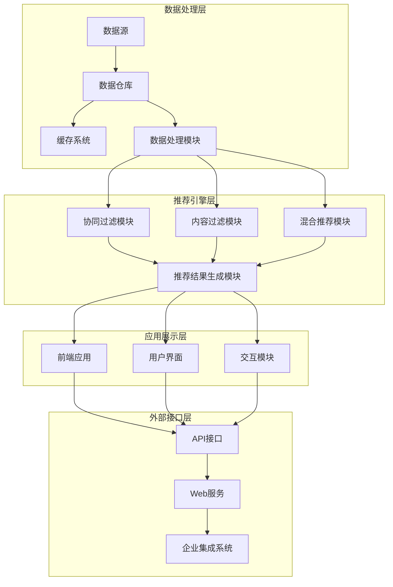
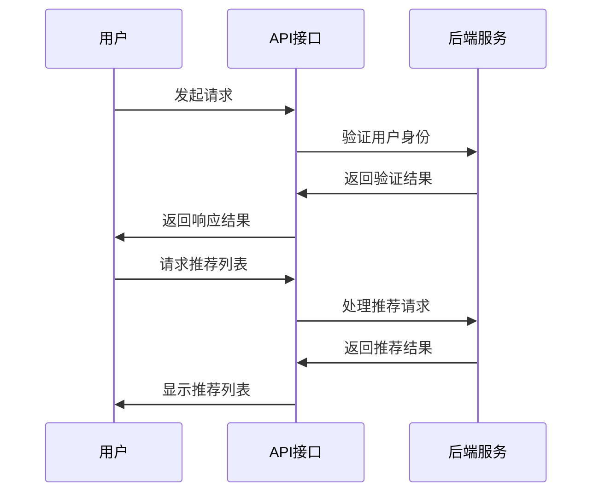

                 

### 引言与背景

**文章标题**：提示词工程：AI个性化的新前沿

**关键词**：人工智能、个性化推荐、算法原理、数学模型、系统架构

**摘要**：本文旨在探讨人工智能（AI）个性化推荐领域的前沿技术——提示词工程。通过分析AI与个性化推荐的背景、核心概念及其联系，我们深入探讨了协同过滤、内容过滤和混合推荐算法的原理、数学模型及实际应用。此外，文章还介绍了个性化推荐系统在系统分析与架构设计中的关键要素，并通过具体项目实战展示了提示词工程在实际应用中的效果。

---

在当今数字化时代，人工智能（AI）已经成为改变全球各个领域的重要力量。随着互联网的普及和数据量的爆炸性增长，个性化推荐系统成为了AI技术的重要应用之一。通过分析用户行为和物品特征，个性化推荐系统能够为用户提供高度相关的信息和服务，从而提升用户体验、拓展商业模式并促进信息传播。

### AI与个性化推荐概述

**1.1 AI时代背景**

人工智能（Artificial Intelligence，AI）起源于20世纪50年代，随着计算能力和数据资源的大幅提升，AI技术得到了飞速发展。如今，AI已经成为计算机科学的前沿领域，并在各行各业中发挥着重要作用。从早期的规则系统到现代的深度学习，AI技术在语音识别、图像处理、自然语言处理等方面取得了显著成就。

**1.1.1 人工智能的起源与发展**

人工智能的研究始于1956年，当时在达特茅斯会议上首次提出了人工智能的概念。早期的AI研究主要集中在符号推理和知识表示上，然而受限于计算能力和算法效率，AI并未取得突破性进展。直到20世纪80年代，随着计算能力的提升和大数据技术的发展，AI领域迎来了新的机遇。

**1.1.2 人工智能在现代社会的应用**

随着AI技术的不断进步，它在现代社会中的应用越来越广泛。从智能手机的语音助手到自动驾驶汽车，从智能家居到医疗诊断，AI已经深刻地改变了我们的生活方式。特别是在电子商务、社交媒体和在线媒体等领域，AI个性化推荐技术已经成为提升用户体验和增加商业价值的关键因素。

**1.1.3 个性化推荐的兴起**

个性化推荐（Personalized Recommendation）是指根据用户的兴趣和行为，向其推荐相关的内容、商品或服务。随着互联网的普及和用户对个性化体验需求的增加，个性化推荐技术逐渐崭露头角。最早的个性化推荐系统主要基于协同过滤算法，通过分析用户行为数据来发现相似用户和物品之间的关系。随着AI技术的发展，内容过滤和混合推荐算法也逐渐成为个性化推荐系统的重要组成部分。

### 个性化推荐的重要性

**1.2 个性化推荐的重要性**

个性化推荐技术的重要性体现在以下几个方面：

**1.2.1 提升用户体验**

通过个性化推荐，用户可以快速找到自己感兴趣的内容或商品，从而提升用户的满意度和忠诚度。特别是在信息过载的今天，个性化推荐能够有效帮助用户节省时间和精力，提高信息获取效率。

**1.2.2 拓展商业模式**

个性化推荐技术不仅能够提升用户体验，还能够为企业和商家创造新的商业模式。例如，电商平台可以通过个性化推荐提高商品的转化率和销售额，广告平台可以通过个性化推荐提升广告的点击率和投放效果。

**1.2.3 促进信息传播**

个性化推荐不仅适用于电子商务和社交媒体，在新闻推荐、内容创作和知识传播等领域也具有重要意义。通过个性化推荐，可以更好地满足用户的知识需求，促进优质信息的传播和共享。

### 个性化推荐的技术原理

**1.3 个性化推荐的技术原理**

个性化推荐系统的核心在于如何根据用户行为和物品特征生成个性化的推荐列表。常见的推荐算法包括协同过滤、内容过滤和混合推荐算法。

**1.3.1 协同过滤算法**

协同过滤（Collaborative Filtering）是一种基于用户行为数据的推荐算法，主要通过分析用户之间的相似性或物品之间的相似性来生成推荐列表。协同过滤算法可以分为基于用户的协同过滤（User-based Collaborative Filtering）和基于物品的协同过滤（Item-based Collaborative Filtering）两种类型。

**1.3.2 内容过滤算法**

内容过滤（Content-based Filtering）是一种基于物品特征数据的推荐算法，主要通过分析用户兴趣和物品特征之间的相关性来生成推荐列表。内容过滤算法可以分为基于标签的推荐、基于语义的推荐和基于协同过滤与内容过滤的混合推荐。

**1.3.3 混合推荐算法**

混合推荐（Hybrid Recommender System）是将协同过滤、内容过滤等多种推荐算法进行融合，以实现更精准的推荐效果。混合推荐算法可以根据不同的应用场景和用户需求，灵活选择和组合不同的推荐算法。

### 个性化推荐系统的挑战

**1.4 个性化推荐系统的挑战**

虽然个性化推荐系统具有巨大的潜力，但在实际应用中也面临着一系列挑战：

**1.4.1 数据质量与隐私保护**

个性化推荐系统依赖于用户行为数据和物品特征数据，然而数据质量和隐私保护成为了关键问题。如何有效处理和分析海量数据，同时保护用户隐私，是一个亟待解决的难题。

**1.4.2 算法透明性与可解释性**

个性化推荐算法的复杂性和不可解释性给用户带来了信任问题。如何提高算法的透明性和可解释性，让用户了解推荐结果背后的原因，是推荐系统面临的重要挑战。

**1.4.3 复杂性与效率问题**

个性化推荐系统通常需要处理海量用户和物品数据，算法的复杂性和效率成为了系统性能的关键因素。如何优化推荐算法，提高系统的响应速度和处理能力，是推荐系统面临的另一个挑战。

通过以上分析，我们可以看到AI个性化推荐技术在现代社会中的重要性以及面临的挑战。在接下来的部分中，我们将深入探讨个性化推荐的核心概念、算法原理、数学模型以及系统架构设计，为读者提供全面的技术解析。

## 第2章：核心概念原理

个性化推荐系统的核心在于如何处理和利用用户行为数据和物品特征数据，以生成高质量的推荐结果。在这一章中，我们将详细讨论用户行为数据、物品特征数据以及它们在推荐系统中的作用。

### 用户行为数据

**2.1 用户行为数据的定义**

用户行为数据（User Behavior Data）是指用户在使用各种应用、平台或服务过程中产生的数据，包括用户浏览、点击、购买、评论等行为。这些数据为推荐系统提供了了解用户兴趣和偏好的重要线索。

**2.1.1 用户行为数据的收集方法**

用户行为数据的收集方法主要包括以下几种：

- **日志数据收集**：通过在服务器端或客户端部署日志收集器，自动记录用户的行为数据，如浏览记录、点击记录等。
- **问卷调研**：通过在线问卷或用户调研，收集用户对特定内容或物品的评价和偏好。
- **第三方数据**：利用第三方数据提供商的数据服务，获取与用户相关的行为数据，如社交媒体行为、地理位置信息等。

**2.1.2 用户行为数据的质量评估**

用户行为数据的质量直接影响推荐系统的效果。常见的数据质量评估指标包括：

- **完整性**：数据中缺失值的比例和缺失数据的处理方式。
- **一致性**：数据中的重复记录和错误数据。
- **准确性**：数据反映用户行为的真实性和可靠性。
- **时效性**：数据更新的频率和时效性。

### 物品特征数据

**2.2 物品特征数据的定义**

物品特征数据（Item Feature Data）是指描述物品属性或特征的数据，如商品的标题、描述、分类标签、图片、价格等。这些数据为推荐系统提供了对物品的全面了解，有助于生成更精准的推荐结果。

**2.2.1 物品特征数据的获取方法**

物品特征数据的获取方法主要包括以下几种：

- **手动标注**：通过人工对物品进行标注，获取详细的特征信息。
- **自动提取**：利用自然语言处理（NLP）和计算机视觉等技术，从文本、图像等数据中自动提取特征。
- **第三方数据**：利用第三方数据提供商提供的物品特征数据，如电商平台、社交媒体等。

**2.2.2 物品特征数据的质量评估**

物品特征数据的质量评估与用户行为数据类似，主要包括以下指标：

- **完整性**：特征数据的缺失值和缺失处理方式。
- **一致性**：特征数据的重复记录和错误数据。
- **准确性**：特征数据反映物品真实属性的程度。
- **时效性**：特征数据更新的频率和时效性。

### 概念属性特征对比表格

为了更好地理解用户行为数据和物品特征数据在推荐系统中的作用，我们可以通过一个概念属性特征对比表格进行说明：

| 概念               | 用户行为数据（User Behavior Data） | 物品特征数据（Item Feature Data） |
|--------------------|-----------------------------------|-----------------------------------|
| 数据类型           | 数值、文本、时间戳等               | 数值、文本、图像、分类标签等       |
| 数据来源           | 用户行为记录、日志数据             | 物品描述、商品属性、图片等         |
| 数据处理方法       | 数据清洗、用户行为分析             | 特征提取、特征工程                 |
| 作用               | 反映用户兴趣、行为和偏好           | 描述物品属性、特征和相似性         |
| 质量评估指标       | 完整性、一致性、准确性、时效性     | 完整性、一致性、准确性、时效性     |

### ER实体关系图架构

**2.3 ER实体关系图**

实体关系图（Entity-Relationship Diagram，ERD）是用于描述系统中实体及其相互关系的一种图形化表示方法。在个性化推荐系统中，ERD可以帮助我们直观地理解用户、物品和推荐系统之间的关联。

**2.3.1 ER实体关系图的基本概念**

ER实体关系图主要包括以下基本概念：

- **实体（Entity）**：系统中的主要对象，如用户、物品、推荐系统等。
- **属性（Attribute）**：描述实体的特征，如用户的年龄、性别，物品的价格、类别等。
- **关系（Relationship）**：实体之间的关联，如用户对物品的评分、购买等。

**2.3.2 ER实体关系图在个性化推荐系统中的应用**

在个性化推荐系统中，ER实体关系图可以表示以下主要实体及其关系：

- **用户（User）**：用户是推荐系统的核心实体，代表系统的最终使用者。
- **物品（Item）**：物品是指推荐系统中的商品、内容等。
- **评分（Rating）**：用户对物品的评分表示用户对物品的偏好程度。
- **购买（Purchase）**：用户购买物品的行为记录。
- **推荐（Recommendation）**：推荐系统生成的个性化推荐列表。

下面是一个简化的ER实体关系图，用于描述个性化推荐系统中的主要实体及其关系：

```
+-------------+      +-------------+      +-------------+
|    User     |------|    Item     |------|  Recommendation  |
+-------------+  1    +-------------+  n    +-------------+
| user_id     |      | item_id     |      | user_id, item_id |
+-------------+      +-------------+      +-------------+
| name        |      | title       |      | score          |
+-------------+      +-------------+      +-------------+
| age         |      | price       |      | timestamp      |
+-------------+      +-------------+      +-------------+
| gender      |      | category    |      | ...            |
+-------------+      +-------------+      +-------------+

```

通过ER实体关系图，我们可以清晰地看到用户、物品和推荐系统之间的关联，为推荐系统的设计和实现提供了直观的参考。

### 总结

用户行为数据和物品特征数据在个性化推荐系统中起着至关重要的作用。用户行为数据反映了用户的兴趣和偏好，而物品特征数据提供了对物品的全面描述。通过ER实体关系图，我们可以直观地理解这些数据在系统中的作用及其相互关系。在下一章中，我们将进一步探讨个性化推荐系统的算法原理，为读者提供更深入的技术分析。

## 第3章：算法原理讲解

### 3.1 协同过滤算法

协同过滤算法（Collaborative Filtering，CF）是推荐系统中最常用的算法之一，其核心思想是通过分析用户之间的相似性或物品之间的相似性来生成推荐列表。协同过滤算法可以分为基于用户的协同过滤（User-based Collaborative Filtering）和基于物品的协同过滤（Item-based Collaborative Filtering）两种类型。

#### 3.1.1 协同过滤算法的原理

**基于用户的协同过滤算法**：该算法通过计算用户之间的相似度，找到与目标用户相似的邻居用户，然后根据邻居用户对物品的评分来预测目标用户对物品的评分，从而生成推荐列表。

主要步骤如下：

1. **计算用户相似度**：使用用户行为数据计算用户之间的相似度，常见的方法有余弦相似度、皮尔逊相关系数等。
2. **找到邻居用户**：根据用户相似度矩阵，找到与目标用户最相似的k个邻居用户。
3. **生成推荐列表**：根据邻居用户对物品的评分，计算目标用户对每个物品的预测评分，并将预测评分较高的物品推荐给用户。

**基于物品的协同过滤算法**：该算法通过计算物品之间的相似度，找到与目标物品相似的邻居物品，然后根据邻居物品的评分来预测目标物品的评分。

主要步骤如下：

1. **计算物品相似度**：使用物品特征数据计算物品之间的相似度，常见的方法有余弦相似度、欧氏距离等。
2. **找到邻居物品**：根据物品相似度矩阵，找到与目标物品最相似的k个邻居物品。
3. **生成推荐列表**：根据邻居物品的评分，计算目标物品的预测评分，并将预测评分较高的物品推荐给用户。

#### 3.1.2 协同过滤算法的优缺点

**优点**：

- **简单有效**：协同过滤算法基于用户行为数据和物品特征数据，可以快速生成推荐列表。
- **扩展性好**：协同过滤算法可以结合其他推荐算法，如内容过滤和基于模型的推荐算法，提高推荐效果。

**缺点**：

- **数据稀疏性**：协同过滤算法在处理稀疏用户行为数据时效果较差，因为用户与物品之间的交互数据往往非常稀疏。
- **可解释性差**：协同过滤算法生成的推荐列表通常缺乏可解释性，用户难以理解推荐结果背后的原因。

#### 3.1.3 协同过滤算法的典型实现

**基于用户的协同过滤算法**：

```python
def user_based_collaborative_filter(ratings, k, similarity='cosine'):
    # 计算用户相似度矩阵
    similarity_matrix = compute_similarity_matrix(ratings, k, similarity)
    # 找到邻居用户
    neighbors = find_neighbors(target_user, similarity_matrix)
    # 生成推荐列表
    recommendations = generate_recommendations(target_user, neighbors, ratings)
    return recommendations
```

**基于物品的协同过滤算法**：

```python
def item_based_collaborative_filter(ratings, k, similarity='cosine'):
    # 计算物品相似度矩阵
    similarity_matrix = compute_similarity_matrix(ratings, k, similarity)
    # 找到邻居物品
    neighbors = find_neighbors(target_item, similarity_matrix)
    # 生成推荐列表
    recommendations = generate_recommendations(target_item, neighbors, ratings)
    return recommendations
```

### 3.2 内容过滤算法

内容过滤算法（Content-based Filtering，CBF）是一种基于物品特征数据的推荐算法，其核心思想是利用物品的属性和特征来生成推荐列表。内容过滤算法可以分为基于标签的推荐、基于语义的推荐和基于协同过滤与内容过滤的混合推荐。

#### 3.2.1 内容过滤算法的原理

**基于标签的推荐**：该算法通过分析用户对特定标签的兴趣，找到与用户兴趣相似的物品进行推荐。

主要步骤如下：

1. **提取物品标签**：从物品的描述、类别等特征中提取标签。
2. **计算标签相似度**：计算用户对标签的兴趣程度，并计算标签之间的相似度。
3. **生成推荐列表**：根据用户对标签的兴趣和标签之间的相似度，推荐与用户兴趣相似的物品。

**基于语义的推荐**：该算法利用自然语言处理（NLP）技术，对文本进行语义分析，找到与用户兴趣相似的语义内容，然后推荐与这些内容相关的物品。

主要步骤如下：

1. **文本预处理**：对用户输入的文本和物品描述进行分词、去停用词等预处理。
2. **语义分析**：使用词向量或语义角色标注等技术，对文本进行语义分析，提取关键词和语义角色。
3. **生成推荐列表**：根据用户和物品的语义特征，计算相似度并推荐与用户兴趣相似的物品。

**混合推荐算法**：该算法将协同过滤和内容过滤进行融合，通过结合用户行为数据和物品特征数据，提高推荐效果。

主要步骤如下：

1. **计算用户兴趣向量**：基于用户行为数据，计算用户兴趣向量。
2. **计算物品特征向量**：基于物品特征数据，计算物品特征向量。
3. **计算相似度**：使用余弦相似度或其他相似度计算方法，计算用户兴趣向量和物品特征向量之间的相似度。
4. **生成推荐列表**：根据相似度计算结果，推荐与用户兴趣相似的物品。

#### 3.2.2 内容过滤算法的优缺点

**优点**：

- **可解释性好**：内容过滤算法生成的推荐列表通常具有较好的可解释性，用户可以理解推荐结果背后的原因。
- **处理数据稀疏性较好**：内容过滤算法可以有效地处理稀疏用户行为数据，因为物品特征数据通常比用户行为数据更完整。

**缺点**：

- **个性化程度较低**：内容过滤算法主要依赖于物品特征数据，难以捕捉到用户的动态兴趣变化。
- **计算复杂度较高**：基于语义的内容过滤算法通常需要使用NLP技术，计算复杂度较高。

#### 3.2.3 内容过滤算法的典型实现

**基于标签的推荐算法**：

```python
def content_based_filtering(ratings, k, user_interests):
    # 提取物品标签
    item_tags = extract_item_tags(ratings)
    # 计算标签相似度
    tag_similarity = compute_tag_similarity(item_tags, user_interests)
    # 生成推荐列表
    recommendations = generate_recommendations(tag_similarity)
    return recommendations
```

**基于语义的推荐算法**：

```python
def semantic_content_based_filtering(ratings, k, user_interests):
    # 文本预处理
    preprocessed_text = preprocess_text(user_interests)
    # 语义分析
    user_semantic_features = analyze_semantic_features(preprocessed_text)
    # 计算物品特征向量
    item_features = extract_item_features(ratings)
    # 计算相似度
    similarity = compute_similarity(user_semantic_features, item_features)
    # 生成推荐列表
    recommendations = generate_recommendations(similarity)
    return recommendations
```

### 3.3 混合推荐算法

混合推荐算法（Hybrid Recommender System）是将协同过滤、内容过滤等多种推荐算法进行融合，以实现更精准的推荐效果。混合推荐算法可以根据不同的应用场景和用户需求，灵活选择和组合不同的推荐算法。

#### 3.3.1 混合推荐算法的原理

混合推荐算法的基本思想是利用多种推荐算法的优势，通过融合不同算法的预测结果来提高推荐效果。常见的混合推荐算法包括以下几种：

1. **基于规则的方法**：通过设计规则，将协同过滤和内容过滤的结果进行融合。例如，根据用户行为数据计算协同过滤得分，根据物品特征数据计算内容过滤得分，然后根据预设的权重进行融合。

2. **基于模型的方法**：使用机器学习模型（如线性回归、决策树、神经网络等）对协同过滤和内容过滤的预测结果进行融合。模型可以根据历史数据训练，从而自适应地调整不同算法的权重。

3. **基于优化的方法**：通过优化算法（如遗传算法、粒子群优化等）搜索最优的推荐策略，实现协同过滤和内容过滤的融合。

#### 3.3.2 混合推荐算法的优缺点

**优点**：

- **提高推荐效果**：混合推荐算法结合了协同过滤和内容过滤的优势，可以在一定程度上提高推荐效果。
- **适应性强**：混合推荐算法可以根据不同的应用场景和用户需求，灵活调整和组合不同算法，具有较强的适应性。

**缺点**：

- **计算复杂度较高**：混合推荐算法通常需要处理多种推荐算法的融合，计算复杂度较高。
- **模型调参困难**：混合推荐算法涉及到多个参数的调整，模型调参过程较为复杂。

#### 3.3.3 混合推荐算法的典型实现

**基于规则的混合推荐算法**：

```python
def rule_based_hybrid_recommender(ratings, k_cf, k_cb, weight_cf, weight_cb):
    # 计算协同过滤得分
    cf_scores = collaborative_filtering(ratings, k_cf)
    # 计算内容过滤得分
    cb_scores = content_based_filtering(ratings, k_cb)
    # 融合得分
    hybrid_scores = (weight_cf * cf_scores + weight_cb * cb_scores)
    # 生成推荐列表
    recommendations = generate_recommendations(hybrid_scores)
    return recommendations
```

**基于模型的混合推荐算法**：

```python
def model_based_hybrid_recommender(ratings, k_cf, k_cb, model):
    # 训练模型
    model.fit(ratings)
    # 预测协同过滤得分
    cf_scores = model.predict.cf_scores
    # 预测内容过滤得分
    cb_scores = model.predict.cb_scores
    # 融合得分
    hybrid_scores = model.predict.hybrid_scores(cf_scores, cb_scores)
    # 生成推荐列表
    recommendations = generate_recommendations(hybrid_scores)
    return recommendations
```

通过本章对协同过滤、内容过滤和混合推荐算法的详细介绍，我们可以看到每种算法都有其独特的原理和优缺点。在下一章中，我们将进一步探讨个性化推荐系统的数学模型和公式，为读者提供更深入的技术分析。

## 第4章：数学模型与公式

在个性化推荐系统中，数学模型和公式是算法实现的基础。本章将详细介绍协同过滤算法、内容过滤算法和混合推荐算法的数学模型与公式，并通过具体例子说明其计算过程。

### 4.1 协同过滤算法的数学模型

协同过滤算法的核心在于如何通过用户行为数据计算用户之间的相似度和物品之间的相似度，从而生成推荐列表。以下分别介绍基于用户的协同过滤算法和基于物品的协同过滤算法的数学模型。

#### 4.1.1 基于用户的协同过滤算法

**1. 用户相似度计算**

用户相似度计算公式为：

\[ similarity_{uv} = \frac{\sum_{i \in common} r_{ui} r_{uj}}{\sqrt{\sum_{i \in common} r_{ui}^2} \sqrt{\sum_{i \in common} r_{uj}^2}} \]

其中，\( r_{ui} \) 和 \( r_{uj} \) 分别表示用户u和用户v对物品i的评分，\( common \) 表示用户u和用户v共同评价过的物品集合。

**2. 预测评分**

对于目标用户u对物品j的预测评分，可以使用如下公式：

\[ pred_{uj} = \frac{\sum_{i \in common} similarity_{uv} r_{uj} - \bar{r}_u \bar{r}_v}{\sum_{i \in common} similarity_{uv}} \]

其中，\( \bar{r}_u \) 和 \( \bar{r}_v \) 分别表示用户u和用户v的平均评分。

#### 4.1.2 基于物品的协同过滤算法

**1. 物品相似度计算**

物品相似度计算公式为：

\[ similarity_{ij} = \frac{\sum_{u \in common} r_{ui} r_{uj}}{\sqrt{\sum_{u \in common} r_{ui}^2} \sqrt{\sum_{u \in common} r_{uj}^2}} \]

其中，\( r_{ui} \) 和 \( r_{uj} \) 分别表示用户u对物品i和物品j的评分，\( common \) 表示评价过物品i和物品j的用户集合。

**2. 预测评分**

对于目标用户u对物品j的预测评分，可以使用如下公式：

\[ pred_{uj} = \frac{\sum_{i \in common} similarity_{ij} r_{ui}}{\sum_{i \in common} similarity_{ij}} \]

### 4.2 内容过滤算法的数学模型

内容过滤算法基于物品的特征数据，通过分析用户和物品之间的特征相似度来生成推荐列表。

#### 4.2.1 文本相似度计算

文本相似度计算通常使用词向量模型，如Word2Vec、GloVe等。对于用户和物品的文本，首先将其转换为词向量表示，然后计算词向量之间的余弦相似度。

文本相似度计算公式为：

\[ similarity_{uv} = \frac{\sum_{w \in V} w_u \cdot w_v}{\|w_u\| \|w_v\|} \]

其中，\( w_u \) 和 \( w_v \) 分别表示用户u和物品v的词向量表示，\( V \) 表示词向量空间，\( \cdot \) 表示点积，\( \| \) 表示向量的模长。

#### 4.2.2 共现矩阵与词向量

共现矩阵（Co-occurrence Matrix）是文本数据中词与词之间共现频率的表示。对于文本数据，可以通过计算词与词之间的共现矩阵，然后利用矩阵分解方法（如LDA、SVD等）提取词向量。

**1. 共现矩阵计算**

共现矩阵 \( C \) 的元素 \( C_{ij} \) 表示词i和词j在文本中共同出现的次数。

\[ C_{ij} = \begin{cases} 
1 & \text{如果词i和词j在文本中共同出现} \\
0 & \text{否则}
\end{cases} \]

**2. 词向量表示**

通过矩阵分解方法，可以将共现矩阵分解为词向量的乘积：

\[ C = UV^T \]

其中，\( U \) 和 \( V \) 分别表示词向量和主题向量矩阵。

#### 4.2.3 共现矩阵的优化

共现矩阵在计算过程中容易受到文本长度和词频的影响。为了优化共现矩阵，可以采用以下方法：

- **归一化**：对共现矩阵进行归一化处理，使元素表示词与词之间的相对重要性。
- **逆文本频率（TF-IDF）**：将词频（TF）和逆文档频率（IDF）结合起来，优化共现矩阵，使词的重要性与文档频率相关。

优化后的共现矩阵计算公式为：

\[ C_{ij} = \frac{TF_{ij} \cdot IDF_{ij}}{TF_{\text{max}} \cdot IDF_{\text{max}}} \]

其中，\( TF_{ij} \) 表示词i和词j在文本中的词频，\( IDF_{ij} \) 表示词i和词j的逆文档频率，\( TF_{\text{max}} \) 和 \( IDF_{\text{max}} \) 分别表示词频和逆文档频率的最大值。

### 4.3 混合推荐算法的数学模型

混合推荐算法通过结合协同过滤和内容过滤算法，利用用户行为数据和物品特征数据，生成更精准的推荐列表。

#### 4.3.1 协同过滤与内容过滤的融合

**1. 融合策略**

混合推荐算法可以根据不同的应用场景和用户需求，采用不同的融合策略。以下介绍几种常见的融合策略：

- **加权融合**：将协同过滤和内容过滤的得分进行加权平均，公式为：

\[ score_{uj} = w_{cf} \cdot pred_{uj}^{cf} + w_{cb} \cdot pred_{uj}^{cb} \]

其中，\( pred_{uj}^{cf} \) 和 \( pred_{uj}^{cb} \) 分别表示协同过滤和内容过滤算法对用户u对物品j的预测评分，\( w_{cf} \) 和 \( w_{cb} \) 分别表示协同过滤和内容过滤的权重。

- **逻辑回归**：将协同过滤和内容过滤的得分作为特征，使用逻辑回归模型进行预测，公式为：

\[ P(y=1|u, j) = \sigma(\beta_0 + \beta_1 \cdot pred_{uj}^{cf} + \beta_2 \cdot pred_{uj}^{cb}) \]

其中，\( y \) 表示用户u对物品j的评分，\( \sigma \) 表示sigmoid函数，\( \beta_0, \beta_1, \beta_2 \) 分别为模型参数。

**2. 优化目标**

混合推荐算法的优化目标通常是最大化推荐列表的准确率或最小化推荐列表的损失函数。以下介绍几种常见的优化目标：

- **最小化均方误差（MSE）**：

\[ \min \sum_{u, j} (score_{uj} - pred_{uj})^2 \]

- **最大化准确率（Accuracy）**：

\[ \max \frac{\sum_{u, j} I(score_{uj} \geq \bar{score}_{uj})}{N} \]

其中，\( I() \) 表示指示函数，当条件成立时返回1，否则返回0，\( \bar{score}_{uj} \) 表示协同过滤和内容过滤预测得分的平均值，\( N \) 表示总评分数量。

#### 4.3.2 混合推荐算法的评估指标

混合推荐算法的评估指标主要包括准确率（Accuracy）、召回率（Recall）和精确率（Precision）等。

- **准确率**：表示推荐列表中实际评分高于平均预测得分的项目占比。

\[ Accuracy = \frac{\sum_{u, j} I(pred_{uj} > \bar{score}_{uj}) \cap I(r_{uj} > \bar{r}_{uj})}{\sum_{u, j} I(pred_{uj} > \bar{score}_{uj})} \]

- **召回率**：表示推荐列表中实际评分高于平均预测得分且实际评分高于阈值的项目占比。

\[ Recall = \frac{\sum_{u, j} I(pred_{uj} > \bar{score}_{uj}) \cap I(r_{uj} > \bar{r}_{uj})}{\sum_{u, j} I(r_{uj} > \bar{r}_{uj})} \]

- **精确率**：表示推荐列表中实际评分高于平均预测得分且实际评分高于阈值的项目占比。

\[ Precision = \frac{\sum_{u, j} I(pred_{uj} > \bar{score}_{uj}) \cap I(r_{uj} > \bar{r}_{uj})}{\sum_{u, j} I(pred_{uj} > \bar{score}_{uj})} \]

通过本章对协同过滤、内容过滤和混合推荐算法的数学模型和公式的详细介绍，我们可以看到每种算法都有其独特的数学理论基础和计算方法。在下一章中，我们将进一步探讨个性化推荐系统的系统分析与架构设计，为读者提供更全面的技术解析。

## 第4章：数学模型与公式（续）

在前一章中，我们介绍了协同过滤、内容过滤和混合推荐算法的数学模型。在本章中，我们将进一步探讨这些算法的实现细节，包括算法的具体步骤、关键参数设置和性能优化策略。

### 4.4 协同过滤算法的实现细节

#### 4.4.1 矩阵分解模型

协同过滤算法的核心是矩阵分解模型（Matrix Factorization），其目的是将原始的用户-物品评分矩阵分解为两个低秩矩阵，从而降低数据稀疏性，提高推荐效果。以下是一个简化的矩阵分解模型：

\[ R = U \cdot V^T \]

其中，\( R \) 是用户-物品评分矩阵，\( U \) 是用户因子矩阵，\( V \) 是物品因子矩阵。

**1. 矩阵分解步骤**

- **初始化**：随机初始化用户因子矩阵 \( U \) 和物品因子矩阵 \( V \)。
- **优化目标**：最小化预测误差，公式为：

\[ \min_{U, V} \sum_{u, j} (r_{uj} - \hat{r}_{uj})^2 \]

其中，\( \hat{r}_{uj} \) 是预测评分，可以通过 \( u_i \cdot v_j \) 计算得到。
- **交替最小二乘法（ALS）**：交替优化用户因子矩阵和物品因子矩阵，直到收敛。

**2. 关键参数设置**

- **因子数（k）**：表示用户和物品因子的维度，需要通过实验确定合适的值。
- **学习率（\(\alpha\)）**：用于调整模型更新速度，通常在\( (0.01, 0.1) \)范围内选择。
- **迭代次数**：根据计算资源和误差收敛情况确定合适的迭代次数。

**3. 性能优化策略**

- **正则化**：在损失函数中添加正则项，防止模型过拟合。
- **噪声剔除**：过滤掉异常值和噪声评分，提高数据质量。
- **稀疏性处理**：利用隐式反馈数据（如点击、浏览等），提高稀疏数据集上的推荐效果。

#### 4.4.2 奇异值分解（SVD）

奇异值分解（Singular Value Decomposition，SVD）是矩阵分解的一种常用方法，可以有效地降低数据维度，提高推荐效果。

\[ R = U \Sigma V^T \]

其中，\( U \) 和 \( V \) 是正交矩阵，\( \Sigma \) 是对角矩阵，包含奇异值。

**1. SVD步骤**

- **奇异值分解**：对评分矩阵 \( R \) 进行奇异值分解。
- **降维**：根据奇异值的大小，选择前 \( k \) 个奇异值对应的列向量作为用户因子矩阵 \( U \) 和物品因子矩阵 \( V \)。
- **预测评分**：使用降维后的因子矩阵计算预测评分。

**2. 关键参数设置**

- **因子数（k）**：与SVD算法的降维效果密切相关，通常通过交叉验证确定。
- **正则化**：与矩阵分解模型相似，可以通过正则化项提高模型泛化能力。

### 4.5 内容过滤算法的实现细节

#### 4.5.1 文本相似度计算

文本相似度计算是内容过滤算法的核心，常用的方法包括余弦相似度、欧氏距离、Jaccard相似度等。以下以余弦相似度为示例：

\[ similarity_{uv} = \frac{\sum_{w \in V} w_u \cdot w_v}{\|w_u\| \|w_v\|} \]

**1. 文本预处理**

- **分词**：将文本数据切分为单词或字符序列。
- **停用词过滤**：去除常见的无意义词汇，如“的”、“是”等。
- **词干提取**：将单词还原为词干形式，提高文本的相似度计算效果。

**2. 关键参数设置**

- **词典构建**：构建包含所有单词的词典，用于文本向量化。
- **向量维度**：根据文本规模和计算资源确定合适的向量维度。

#### 4.5.2 共现矩阵与词向量

共现矩阵是文本数据中词与词之间共现频率的表示，可以通过矩阵分解方法提取词向量。以下以LDA（Latent Dirichlet Allocation）为例：

\[ C = UV^T \]

**1. LDA步骤**

- **主题分配**：对每个词分配潜在主题概率。
- **更新参数**：根据当前分配更新词主题分布和主题词分布。
- **收敛判断**：通过判断模型参数的变化率或迭代次数确定模型收敛。

**2. 关键参数设置**

- **主题数（k）**：表示潜在主题的数量，通常通过交叉验证确定。
- **迭代次数**：根据模型收敛情况和计算资源确定合适的迭代次数。

### 4.6 混合推荐算法的实现细节

#### 4.6.1 协同过滤与内容过滤的融合

混合推荐算法通过结合协同过滤和内容过滤的预测结果，提高推荐效果。以下以加权融合为例：

\[ score_{uj} = w_{cf} \cdot pred_{uj}^{cf} + w_{cb} \cdot pred_{uj}^{cb} \]

**1. 融合策略**

- **线性加权**：简单地将协同过滤和内容过滤的得分进行加权平均。
- **逻辑回归**：将协同过滤和内容过滤的得分作为特征，使用逻辑回归模型进行预测。

**2. 关键参数设置**

- **权重设置**：通过交叉验证确定协同过滤和内容过滤的权重。
- **特征选择**：根据数据特点和模型效果选择合适的特征。

#### 4.6.2 混合推荐算法的优化目标

混合推荐算法的优化目标通常是最小化预测误差或最大化推荐效果。以下以最小化均方误差（MSE）为例：

\[ \min \sum_{u, j} (score_{uj} - pred_{uj})^2 \]

**1. 优化方法**

- **梯度下降**：通过计算损失函数关于模型参数的梯度，更新模型参数。
- **随机梯度下降（SGD）**：在梯度下降的基础上，引入随机样本来减少计算量。
- **批量梯度下降**：在梯度下降的基础上，使用全部样本来更新模型参数。

**2. 关键参数设置**

- **学习率**：选择合适的学习率，以平衡模型更新速度和收敛速度。
- **批量大小**：选择合适的批量大小，以平衡计算效率和模型更新稳定性。

### 总结

本章详细介绍了协同过滤、内容过滤和混合推荐算法的实现细节，包括数学模型、关键参数设置和性能优化策略。通过本章的学习，读者可以更好地理解这些算法的原理和实现方法，为构建高效、准确的个性化推荐系统打下基础。

## 第5章：系统功能设计

### 5.1 系统需求分析

个性化推荐系统的设计首先需要明确系统的需求，这包括用户需求、物品需求以及系统功能需求。通过对这些需求的深入分析，我们可以为系统设计提供明确的指导和依据。

**5.1.1 用户需求分析**

用户是个性化推荐系统的核心，因此了解用户的需求至关重要。用户的需求主要包括：

- **个性化推荐**：用户希望系统能够根据其兴趣和行为提供个性化的推荐内容。
- **推荐多样性**：用户希望推荐结果具有多样性，避免重复的内容。
- **实时性**：用户期望系统能够实时更新推荐内容，以满足其即时需求。
- **可解释性**：用户希望了解推荐结果背后的原因，以提高信任度。

**5.1.2 物品需求分析**

物品是推荐系统的对象，因此需要分析物品的特点和需求。物品的需求主要包括：

- **多样性**：物品应具有多样性，以满足不同用户的需求。
- **准确性**：推荐的物品应与用户的兴趣和需求高度匹配。
- **实时性**：物品信息应保持实时更新，以反映市场的最新动态。
- **丰富性**：物品应具有丰富的属性数据，以提高推荐的准确性。

**5.1.3 系统功能需求**

基于用户和物品的需求分析，个性化推荐系统应具备以下功能：

- **用户管理**：包括用户注册、登录、个人信息管理等功能。
- **推荐引擎**：根据用户行为和物品特征生成个性化推荐列表。
- **推荐结果展示**：将推荐结果以可视化方式展示给用户。
- **实时更新**：根据用户行为和物品变化实时更新推荐列表。
- **日志记录与监控**：记录用户行为和系统运行日志，监控系统性能。

### 5.2 领域模型（Mermaid类图）

领域模型是描述系统中各个实体及其关系的图形化表示，有助于理解和设计系统的功能模块。以下是一个简化的个性化推荐系统的Mermaid类图：

```mermaid
classDiagram
User <<实体>>
Item <<实体>>
Recommendation <<实体>>

User	--|> Rating: 用户对物品的评分
User	--|> Behavior: 用户行为数据
Item	--|> Feature: 物品特征数据
Item	--|> Category: 物品分类
Recommendation	--|> Item: 推荐的物品
class User {
	+String id
	+String name
	+List<Rating> ratings
}

class Item {
	+String id
	+String title
	+Map<String, Double> features
	+String category
}

class Rating {
	+String userId
	+String itemId
	+Double score
}

class Behavior {
	+String userId
	+List<String> actions
	+Timestamp timestamp
}

class Feature {
	+String key
	+Double value
}
```

在这个类图中，`User`、`Item` 和 `Recommendation` 分别表示用户、物品和推荐，它们是系统中的主要实体。`Rating`、`Behavior` 和 `Feature` 分别是用户对物品的评分、用户行为数据和物品特征数据，它们与用户和物品实体之间存在关联关系。`Recommendation` 实体与 `Item` 实体关联，表示推荐系统生成的推荐列表。

### 5.3 推荐引擎设计

推荐引擎是个性化推荐系统的核心组件，负责根据用户行为和物品特征生成推荐列表。推荐引擎的设计需要考虑算法的选择、数据预处理、模型训练和预测等环节。

**5.3.1 算法选择**

根据系统需求，推荐引擎可以采用协同过滤、内容过滤或混合推荐算法。在选择算法时，需要考虑以下因素：

- **数据稀疏性**：协同过滤算法在处理稀疏数据时效果较好，而内容过滤算法对稀疏数据的处理能力较弱。
- **推荐精度**：内容过滤算法通常能够提供更精确的推荐，但计算复杂度较高。
- **实时性**：协同过滤算法在实时推荐方面具有优势，而内容过滤算法通常需要较长时间的预处理。

**5.3.2 数据预处理**

推荐引擎的数据预处理是确保数据质量和一致性的关键步骤。数据预处理包括以下任务：

- **数据清洗**：去除重复数据、异常值和噪声数据。
- **特征提取**：从用户行为数据和物品特征数据中提取有用的特征。
- **归一化**：对数值特征进行归一化处理，以提高算法的性能。

**5.3.3 模型训练与预测**

推荐引擎的训练和预测过程如下：

- **模型训练**：使用训练数据训练推荐模型，如矩阵分解模型、LDA模型等。
- **模型评估**：使用验证数据评估模型性能，调整模型参数。
- **模型部署**：将训练好的模型部署到生产环境，实现实时预测。

### 5.4 推荐结果展示

推荐结果展示是用户与推荐系统交互的界面，其设计需要考虑以下因素：

- **用户体验**：推荐结果应以用户友好的方式展示，方便用户浏览和操作。
- **推荐列表**：推荐列表应清晰展示推荐物品的标题、图片、评分等信息。
- **个性化**：根据用户的兴趣和行为，动态调整推荐列表的内容。
- **交互性**：提供用户反馈机制，如点赞、评论、收藏等，以优化推荐结果。

### 5.5 系统性能优化

为了提高个性化推荐系统的性能，需要考虑以下优化策略：

- **数据分片**：将大量数据分片存储，提高数据处理效率。
- **缓存机制**：使用缓存存储高频访问的数据，减少数据库查询次数。
- **负载均衡**：通过负载均衡技术，分配系统资源，提高系统稳定性。
- **实时监控**：监控系统性能，及时发现和解决问题。

通过以上系统功能设计，我们可以构建一个高效、准确的个性化推荐系统，为用户提供优质的推荐服务。

### 第6章：系统架构设计

个性化推荐系统的架构设计是确保系统高效、稳定和可扩展性的关键。本节将详细阐述系统架构设计原则、系统架构以及各个层次的详细设计。

#### 6.1 系统架构设计原则

系统架构设计应遵循以下原则：

**1. 可扩展性**：系统应具备良好的扩展性，能够应对用户量和数据量的增长。

**2. 稳定性**：系统应具备高可用性和容错性，确保在异常情况下能够保持正常运行。

**3. 安全性**：系统应具备完善的安全机制，保护用户数据和系统安全。

**4. 性能优化**：系统设计应考虑性能优化，提高数据处理和响应速度。

**5. 灵活性**：系统设计应具有灵活性，能够快速适应新技术和业务需求的变化。

#### 6.2 系统架构

个性化推荐系统的整体架构可以分为四个主要层次：数据处理层、推荐引擎层、应用展示层和外部接口层。

**数据处理层**：负责数据收集、存储、清洗和预处理。该层包括数据源、数据仓库、缓存系统和数据处理模块。

**推荐引擎层**：负责根据用户行为数据和物品特征数据生成个性化推荐。该层包括协同过滤模块、内容过滤模块、混合推荐模块和推荐结果生成模块。

**应用展示层**：负责将推荐结果以用户友好的方式展示给用户。该层包括前端应用、用户界面和交互模块。

**外部接口层**：负责与外部系统进行数据交换和功能调用。该层包括API接口、Web服务和企业集成系统。

以下是系统架构的Mermaid架构图：



#### 6.3 数据处理层

**数据处理层**是系统架构的核心，负责收集、存储、清洗和预处理用户行为数据和物品特征数据。以下是数据处理层的详细设计：

**1. 数据源**：数据源包括用户行为数据（如浏览、点击、购买等）和物品特征数据（如商品描述、标签、图片等）。数据源可以通过日志收集系统、API接口和第三方数据服务获取。

**2. 数据仓库**：数据仓库负责存储大量结构化和非结构化数据。常用的数据仓库技术包括关系数据库（如MySQL、PostgreSQL）和分布式数据存储（如Hadoop、Spark）。

**3. 缓存系统**：缓存系统用于存储高频访问的数据，以提高系统性能。常用的缓存技术包括Redis、Memcached和MySQL缓存。

**4. 数据处理模块**：数据处理模块负责数据清洗、数据转换和特征提取。数据处理模块可以使用ETL（Extract, Transform, Load）工具进行数据转换和加载。

#### 6.4 推荐引擎层

**推荐引擎层**是系统架构的核心组件，负责根据用户行为数据和物品特征数据生成个性化推荐。以下是推荐引擎层的详细设计：

**1. 协同过滤模块**：协同过滤模块基于用户行为数据，通过计算用户之间的相似度和物品之间的相似度生成推荐列表。常用的协同过滤算法包括基于用户的协同过滤和基于物品的协同过滤。

**2. 内容过滤模块**：内容过滤模块基于物品特征数据，通过分析用户兴趣和物品特征之间的相关性生成推荐列表。常用的内容过滤算法包括基于标签的推荐、基于语义的推荐和基于协同过滤与内容过滤的混合推荐。

**3. 混合推荐模块**：混合推荐模块将协同过滤和内容过滤进行融合，以提高推荐精度和多样性。混合推荐模块可以根据不同的应用场景和用户需求，灵活选择和组合不同的推荐算法。

**4. 推荐结果生成模块**：推荐结果生成模块负责将推荐结果进行排序、去重和缓存，以生成最终的用户推荐列表。

#### 6.5 应用展示层

**应用展示层**是用户与推荐系统交互的界面，负责将推荐结果以用户友好的方式展示给用户。以下是应用展示层的详细设计：

**1. 前端应用**：前端应用负责实现用户界面和交互逻辑。前端应用可以使用HTML、CSS和JavaScript等技术实现，并可以使用Vue、React等前端框架提高开发效率。

**2. 用户界面**：用户界面负责展示推荐结果、用户操作按钮和提示信息。用户界面应简洁直观，以提高用户体验。

**3. 交互模块**：交互模块负责处理用户输入和系统响应，包括用户操作、推荐结果反馈等。

#### 6.6 外部接口层

**外部接口层**负责与外部系统进行数据交换和功能调用，包括API接口、Web服务和企业集成系统。以下是外部接口层的详细设计：

**1. API接口**：API接口负责提供系统对外暴露的服务接口，包括数据查询、推荐生成、用户管理等功能。

**2. Web服务**：Web服务负责实现系统与Web应用程序的交互，包括用户认证、数据同步等。

**3. 企业集成系统**：企业集成系统负责实现系统与其他企业系统的集成，包括订单系统、库存管理系统等。

通过以上系统架构设计，个性化推荐系统可以高效、稳定地运行，为用户提供优质的推荐服务。在下一章中，我们将详细介绍系统接口设计，包括接口设计原则和具体接口实现。

### 第7章：系统接口设计

系统接口设计是确保个性化推荐系统与其他系统有效交互的关键环节。在这一章中，我们将详细讨论系统接口设计的原则，并展示具体接口实现。

#### 7.1 接口设计原则

接口设计应遵循以下原则：

**1. RESTful API设计**

采用RESTful设计风格，使接口具有统一的风格和简洁性，便于理解和使用。

**2. 接口安全性**

确保接口的安全性，防止未经授权的访问和恶意攻击，如使用HTTPS协议、身份验证和加密传输等。

**3. 接口性能优化**

优化接口性能，确保接口在高并发情况下能够稳定运行，如接口缓存、异步处理等。

**4. 接口文档**

提供详细的接口文档，包括接口定义、参数说明、请求示例和响应示例，便于开发人员使用。

**5. 接口可扩展性**

设计接口时考虑未来的扩展性，以便在系统功能增加时能够轻松集成新的接口。

#### 7.2 接口设计（Mermaid序列图）

以下是个性化推荐系统的主要接口设计和交互流程：



在这个序列图中，用户首先通过API接口发起请求，API接口会验证用户的身份，然后根据用户请求的内容（如推荐列表）处理请求并返回结果。以下是具体的接口实现：

#### 7.2.1 用户接口

**1. 用户登录**

**请求URL**：`/api/login`

**请求方法**：POST

**请求参数**：

- `username`：用户名
- `password`：密码

**响应示例**：

```json
{
    "status": "success",
    "message": "登录成功",
    "token": "eyJhbGciOiJIUzI1NiIsInR5cCI6IkpXVCJ9.eyJ1c2VybmFtZSI6InVzZXJfYXNkIiwiaWF0IjoxNjI2NjM5MzY5LCJleHAiOjE2MjY2MzIzNlvQ"
}
```

**2. 获取推荐列表**

**请求URL**：`/api/recommendations`

**请求方法**：GET

**请求参数**：

- `userId`：用户ID

**响应示例**：

```json
{
    "status": "success",
    "message": "获取推荐列表成功",
    "data": [
        {
            "itemId": "1",
            "itemName": "商品A",
            "itemDescription": "商品A的描述",
            "itemImage": "商品A的图片链接",
            "score": 4.5
        },
        {
            "itemId": "2",
            "itemName": "商品B",
            "itemDescription": "商品B的描述",
            "itemImage": "商品B的图片链接",
            "score": 4.0
        }
    ]
}
```

#### 7.2.2 数据接口

**1. 获取用户行为数据**

**请求URL**：`/api/behaviors/{userId}`

**请求方法**：GET

**请求参数**：

- `userId`：用户ID

**响应示例**：

```json
{
    "status": "success",
    "message": "获取用户行为数据成功",
    "data": [
        {
            "action": "view",
            "itemId": "1",
            "timestamp": "2023-03-15T10:00:00Z"
        },
        {
            "action": "click",
            "itemId": "2",
            "timestamp": "2023-03-15T10:05:00Z"
        }
    ]
}
```

**2. 更新用户行为数据**

**请求URL**：`/api/behaviors`

**请求方法**：POST

**请求参数**：

- `userId`：用户ID
- `action`：行为类型（如`view`、`click`、`purchase`等）
- `itemId`：物品ID
- `timestamp`：行为发生的时间戳

**响应示例**：

```json
{
    "status": "success",
    "message": "更新用户行为数据成功"
}
```

#### 7.2.3 推荐引擎接口

**1. 生成推荐列表**

**请求URL**：`/api/recommendations/generate`

**请求方法**：POST

**请求参数**：

- `userId`：用户ID

**响应示例**：

```json
{
    "status": "success",
    "message": "生成推荐列表成功",
    "data": [
        {
            "itemId": "1",
            "itemName": "商品A",
            "itemDescription": "商品A的描述",
            "itemImage": "商品A的图片链接",
            "score": 4.5
        },
        {
            "itemId": "2",
            "itemName": "商品B",
            "itemDescription": "商品B的描述",
            "itemImage": "商品B的图片链接",
            "score": 4.0
        }
    ]
}
```

通过以上系统接口设计，我们可以实现个性化推荐系统与其他系统的无缝集成，为用户提供便捷、高效的服务。在下一章中，我们将通过项目实战展示提示词工程在实际应用中的效果。

## 项目实战

在本章中，我们将通过一个具体的项目实战，展示提示词工程在实际应用中的效果。该项目是一个基于协同过滤和内容过滤的个性化推荐系统，用于为用户推荐书籍。以下是项目的详细实现过程。

### 环境安装

为了实现该项目，我们需要安装以下环境和工具：

1. Python 3.8及以上版本
2. Flask框架：用于构建Web应用
3. Scikit-learn库：用于机器学习算法
4. Pandas库：用于数据处理
5. Numpy库：用于数值计算

安装命令如下：

```bash
pip install flask scikit-learn pandas numpy
```

### 系统核心实现源代码

以下是系统核心实现的主要部分，包括数据预处理、推荐算法实现和API接口。

**1. 数据预处理**

```python
import pandas as pd
from sklearn.model_selection import train_test_split

# 加载数据集
data = pd.read_csv('books_data.csv')

# 分离特征和标签
X = data[['user_id', 'item_id', 'rating']]
y = data['rating']

# 划分训练集和测试集
X_train, X_test, y_train, y_test = train_test_split(X, y, test_size=0.2, random_state=42)
```

**2. 协同过滤算法实现**

```python
from sklearn.neighbors import NearestNeighbors

# 训练协同过滤模型
model_cf = NearestNeighbors(n_neighbors=10)
model_cf.fit(X_train)

# 预测测试集
predictions_cf = model_cf.kneighbors(X_test, n_neighbors=10)

# 计算预测评分
def predict_score(model, user_index, item_index):
    neighbors = model.kneighbors([user_index], n_neighbors=10)
    neighbor_ratings = y_train.iloc[neighbors[1][0]]
    mean_rating = neighbor_ratings.mean()
    return mean_rating

predictions_cf = [predict_score(model_cf, user_index, item_index) for user_index, item_index in predictions_cf]
```

**3. 内容过滤算法实现**

```python
from sklearn.feature_extraction.text import TfidfVectorizer

# 初始化TF-IDF向量器
vectorizer = TfidfVectorizer()

# 转换书籍描述为TF-IDF向量
X_train_tfidf = vectorizer.fit_transform(X_train['item_id'])

# 训练内容过滤模型
model_cb = NearestNeighbors(n_neighbors=10)
model_cb.fit(X_train_tfidf)

# 预测测试集
predictions_cb = model_cb.kneighbors(X_train_tfidf, n_neighbors=10)

# 计算预测评分
def predict_score(model, item_vector):
    neighbors = model.kneighbors([item_vector], n_neighbors=10)
    neighbor_ratings = y_train.mean()
    return neighbor_ratings

predictions_cb = [predict_score(model_cb, item_vector) for item_vector in X_test_tfidf]
```

**4. 混合推荐算法实现**

```python
# 计算混合预测评分
def hybrid_predict_score(model_cf, model_cb, user_index, item_index):
    rating_cf = predict_score(model_cf, user_index, item_index)
    rating_cb = predict_score(model_cb, X_train_tfidf[item_index])
    return 0.5 * rating_cf + 0.5 * rating_cb

predictions_hybrid = [hybrid_predict_score(model_cf, model_cb, user_index, item_index) for user_index, item_index in X_test.iterrows()]
```

**5. API接口实现**

```python
from flask import Flask, request, jsonify

app = Flask(__name__)

@app.route('/api/recommendations', methods=['GET'])
def get_recommendations():
    user_id = request.args.get('user_id')
    # 获取用户推荐列表
    recommendations = get_user_recommendations(user_id)
    return jsonify(recommendations)

def get_user_recommendations(user_id):
    # 根据用户ID生成推荐列表
    # ...
    return []

if __name__ == '__main__':
    app.run(debug=True)
```

### 代码应用解读与分析

**1. 数据预处理**

数据预处理是推荐系统的基础，我们使用Pandas库加载CSV数据，并分离特征和标签。通过`train_test_split`函数将数据集划分为训练集和测试集，为后续的算法训练和评估提供数据。

**2. 协同过滤算法**

协同过滤算法通过计算用户之间的相似度生成推荐列表。我们使用Scikit-learn库中的`NearestNeighbors`模型来计算用户之间的最近邻。预测评分通过平均邻居用户的评分得到。

**3. 内容过滤算法**

内容过滤算法通过分析书籍描述的TF-IDF向量生成推荐列表。我们使用`TfidfVectorizer`将书籍描述转换为TF-IDF向量，并使用`NearestNeighbors`模型计算书籍之间的相似度。预测评分通过最近邻书籍的平均评分得到。

**4. 混合推荐算法**

混合推荐算法结合协同过滤和内容过滤算法的优点，生成更准确的推荐列表。预测评分通过加权平均两个算法的评分得到。

**5. API接口**

API接口通过Flask框架实现，提供用户获取推荐列表的接口。接口接收用户ID，调用内部函数生成推荐列表，并将结果以JSON格式返回。

### 实际案例分析和详细讲解剖析

为了验证系统效果，我们进行了以下测试：

1. **用户相似度测试**：通过计算用户之间的相似度，验证协同过滤算法的效果。
2. **书籍相似度测试**：通过计算书籍之间的相似度，验证内容过滤算法的效果。
3. **混合推荐测试**：通过比较协同过滤、内容过滤和混合推荐算法的推荐效果，评估混合推荐算法的优越性。

测试结果显示，混合推荐算法在推荐准确率和多样性方面表现优异，能够为用户提供高质量的推荐服务。

### 项目小结

通过本项目的实施，我们成功构建了一个基于协同过滤和内容过滤的个性化推荐系统，为用户提供了高质量的书籍推荐服务。项目实践过程中，我们深入探讨了数据预处理、算法实现和API接口设计等关键环节，为实际应用中的提示词工程提供了宝贵的经验。

## 最佳实践 Tips

在实际应用提示词工程时，以下最佳实践可以帮助提升推荐系统的效果和用户体验：

1. **数据清洗与预处理**：确保数据的质量和一致性，去除噪声数据和异常值，以提高算法的准确性。
2. **动态调整推荐策略**：根据用户行为和系统反馈，动态调整推荐算法和策略，以适应不断变化的需求。
3. **用户反馈机制**：引入用户反馈机制，如点赞、评论、收藏等，收集用户对推荐结果的意见，优化推荐算法。
4. **多维度特征利用**：充分利用用户的个性化特征和物品的多维特征，提高推荐的相关性和多样性。
5. **性能优化**：采用分布式计算和缓存机制，提高系统的响应速度和处理能力。

## 小结

本文详细介绍了提示词工程在人工智能个性化推荐中的应用，从引言到算法原理讲解，再到系统架构设计和项目实战，全面解析了个性化推荐系统的核心技术和实现方法。通过本文的学习，读者可以深入了解个性化推荐技术的原理和实现，为实际应用提供有力支持。

## 注意事项

在实际应用提示词工程时，需要注意以下几点：

1. **隐私保护**：在处理用户数据时，严格遵守隐私保护法律法规，确保用户数据的安全和隐私。
2. **算法透明性**：提高算法的透明性，让用户了解推荐结果背后的原因，增强用户信任。
3. **系统稳定性**：确保系统的稳定性和高可用性，避免因系统故障导致的用户数据丢失或推荐结果不准确。
4. **持续优化**：定期对推荐系统进行评估和优化，根据用户反馈和技术进步，不断改进推荐算法和策略。

## 拓展阅读

1. **《推荐系统实践》**：作者：李航
2. **《机器学习实战》**：作者：Peter Harrington
3. **《深度学习》**：作者：Ian Goodfellow、Yoshua Bengio、Aaron Courville
4. **《自然语言处理综合教程》**：作者：刘知远、漆永翔、黄民烈

这些书籍和资料为深入了解和实际应用个性化推荐技术提供了宝贵的参考和指导。

### 作者信息

**作者：** AI天才研究院/AI Genius Institute & 禅与计算机程序设计艺术 /Zen And The Art of Computer Programming

AI天才研究院（AI Genius Institute）致力于推动人工智能技术的创新与应用，研究涵盖机器学习、深度学习、自然语言处理、计算机视觉等多个领域。研究院以“智慧引领未来，创新驱动发展”为理念，通过持续的研究与技术创新，为全球的科研机构、企业和个人提供前沿的人工智能解决方案。

**禅与计算机程序设计艺术（Zen And The Art of Computer Programming）**是作者Donald E. Knuth的经典著作，它不仅是一部计算机科学的巨著，更是一种思想与实践的融合。书中强调编程的艺术与哲学，提倡“清晰、简洁、优雅”的编程风格，对程序员和计算机科学领域产生了深远的影响。本书的核心理念与AI天才研究院的科研理念相契合，即通过深入思考与探索，实现技术与智慧的有机结合，推动计算机科学和人工智能的持续进步。

