                 

### 第一部分: 引言

#### 第1章: AI交互与提示词工程

##### 1.1 问题的背景与意义

随着人工智能技术的飞速发展，计算机与人类之间的交互方式发生了根本性的变革。传统的人机交互（GUI、命令行等）逐渐被智能化的交互方式所取代，这种交互方式的核心便是自然语言处理（NLP）和对话系统。

**核心概念与联系**

自然语言处理（NLP）是人工智能的一个重要分支，它旨在使计算机能够理解、解释和生成人类语言。NLP的核心概念包括分词、词性标注、句法分析、语义分析和机器翻译等。以下是NLP的一些关键概念和其属性特征对比表格：

| 概念           | 属性特征                                   |  
|--------------|----------------------------------------|  
| 分词           | 将文本拆分为词或短语                       |  
| 词性标注       | 为每个词分配一个词性标签，如名词、动词、形容词等 |  
| 句法分析       | 确定句子中的词和短语之间的关系              |  
| 语义分析       | 理解文本的含义和上下文                      |  
| 机器翻译       | 将一种语言的文本翻译成另一种语言的文本       |

**ER实体关系图架构的 Mermaid 流程图**

下面是NLP的核心概念和ER实体关系图的 Mermaid 流程图：

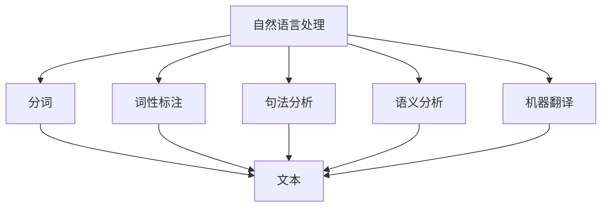

**提示词工程**

在AI交互中，提示词工程扮演着至关重要的角色。提示词是指提供给AI系统以辅助其生成响应的语言提示。一个好的提示词能够有效地引导AI系统生成更符合用户需求的回答。因此，提示词工程成为AI交互中的一项关键技术。

**提示词工程的挑战**

在当前的AI交互场景中，提示词的设计和优化面临着诸多挑战。首先，如何从大量文本数据中提取有效的提示词成为了一个难题。其次，如何设计出既能满足用户需求又能体现AI智能特性的提示词，也是研究人员和开发者需要解决的问题。

**问题解决**

为了应对上述挑战，本书将介绍一系列提示词工程的方法和技术。这些方法包括但不限于：提示词生成算法、提示词优化策略、多模态提示词设计等。通过这些方法，我们可以构建出更加智能和高效的AI交互系统。

**边界与外延**

提示词工程不仅局限于单一的语言环境，它还涉及跨语言、跨文化等多维度的交互问题。因此，本书将探讨这些跨领域的问题，为全球范围内的AI交互提供理论基础和技术支持。

**概念结构与核心要素组成**

提示词工程的核心概念包括：自然语言处理、机器学习、对话系统等。这些概念共同构成了提示词工程的理论基础。同时，核心要素如：数据集、算法、模型等也是提示词工程中不可或缺的部分。

**挑战与机遇**

尽管提示词工程具有重要的应用价值，但在实际操作中仍然面临着诸多挑战。例如：

- 数据获取与清洗：高质量的数据是提示词工程的基础，然而获取和清洗数据往往是一项繁琐的工作。  
- 模型选择与调优：不同的模型适用于不同的场景，如何选择和调优模型是一个需要深入探讨的问题。  
- 可解释性与透明性：用户希望能够理解AI的决策过程，因此如何提高AI系统的可解释性也是一个重要议题。

**机遇**

随着AI技术的不断进步，提示词工程迎来了新的机遇。例如：

- 多模态交互：结合语音、图像等多种模态，可以提供更丰富、更自然的交互体验。  
- 跨语言与跨文化：随着全球化的推进，跨语言和跨文化的AI交互需求日益增加。  
- 个性化服务：通过个性化的提示词设计，可以为用户提供更加贴合其需求的服务。

**结论**

总体来说，提示词工程在AI交互中具有巨大的潜力。通过深入研究和实践，我们有望克服现有挑战，抓住新的机遇，推动AI交互技术迈向新的高度。  

---

### 1.2 提示词工程的挑战与机遇

**挑战**

尽管提示词工程具有重要的应用价值，但在实际操作中仍然面临着诸多挑战。以下是一些关键挑战：

**数据获取与清洗**

高质量的数据是提示词工程的基础，然而获取和清洗数据往往是一项繁琐的工作。在大量的文本数据中，如何提取出对AI系统有帮助的有效信息，是一个需要深入解决的问题。

**模型选择与调优**

不同的模型适用于不同的场景，如何选择和调优模型是一个需要深入探讨的问题。在提示词工程中，模型的性能直接影响到AI交互的质量。因此，如何根据具体场景选择合适的模型，并进行调优，是提示词工程中的一个重要挑战。

**可解释性与透明性**

用户希望能够理解AI的决策过程，因此如何提高AI系统的可解释性也是一个重要议题。在提示词工程中，如何让AI系统的决策过程更加透明，让用户能够理解和信任，是一个重要的挑战。

**机遇**

随着AI技术的不断进步，提示词工程迎来了新的机遇。以下是一些关键机遇：

**多模态交互**

结合语音、图像等多种模态，可以提供更丰富、更自然的交互体验。例如，在语音交互中，结合图像信息可以更准确地理解用户的需求，提高交互的准确性和用户体验。

**跨语言与跨文化**

随着全球化的推进，跨语言和跨文化的AI交互需求日益增加。提示词工程可以为不同语言和文化背景的用户提供更加贴心的交互体验。

**个性化服务**

通过个性化的提示词设计，可以为用户提供更加贴合其需求的服务。例如，在虚拟助手或智能客服中，根据用户的喜好和历史行为，设计出个性化的提示词，提高用户的满意度和忠诚度。

**结论**

总体来说，提示词工程在AI交互中具有巨大的潜力。通过深入研究和实践，我们有望克服现有挑战，抓住新的机遇，推动AI交互技术迈向新的高度。  

---

### 第一部分: 引言

#### 第1章: AI交互与提示词工程

##### 1.1 问题的背景与意义

随着人工智能技术的飞速发展，计算机与人类之间的交互方式发生了根本性的变革。传统的人机交互（GUI、命令行等）逐渐被智能化的交互方式所取代，这种交互方式的核心便是自然语言处理（NLP）和对话系统。

**核心概念与联系**

自然语言处理（NLP）是人工智能的一个重要分支，它旨在使计算机能够理解、解释和生成人类语言。NLP的核心概念包括分词、词性标注、句法分析、语义分析和机器翻译等。以下是NLP的一些关键概念和其属性特征对比表格：

| 概念           | 属性特征                                   |  
|--------------|----------------------------------------|  
| 分词           | 将文本拆分为词或短语                       |  
| 词性标注       | 为每个词分配一个词性标签，如名词、动词、形容词等 |  
| 句法分析       | 确定句子中的词和短语之间的关系              |  
| 语义分析       | 理解文本的含义和上下文                      |  
| 机器翻译       | 将一种语言的文本翻译成另一种语言的文本       |

**ER实体关系图架构的 Mermaid 流程图**

下面是NLP的核心概念和ER实体关系图的 Mermaid 流程图：


**提示词工程**

在AI交互中，提示词工程扮演着至关重要的角色。提示词是指提供给AI系统以辅助其生成响应的语言提示。一个好的提示词能够有效地引导AI系统生成更符合用户需求的回答。因此，提示词工程成为AI交互中的一项关键技术。

**提示词工程的挑战**

在当前的AI交互场景中，提示词的设计和优化面临着诸多挑战。首先，如何从大量文本数据中提取有效的提示词成为了一个难题。其次，如何设计出既能满足用户需求又能体现AI智能特性的提示词，也是研究人员和开发者需要解决的问题。

**问题解决**

为了应对上述挑战，本书将介绍一系列提示词工程的方法和技术。这些方法包括但不限于：提示词生成算法、提示词优化策略、多模态提示词设计等。通过这些方法，我们可以构建出更加智能和高效的AI交互系统。

**边界与外延**

提示词工程不仅局限于单一的语言环境，它还涉及跨语言、跨文化等多维度的交互问题。因此，本书将探讨这些跨领域的问题，为全球范围内的AI交互提供理论基础和技术支持。

**概念结构与核心要素组成**

提示词工程的核心概念包括：自然语言处理、机器学习、对话系统等。这些概念共同构成了提示词工程的理论基础。同时，核心要素如：数据集、算法、模型等也是提示词工程中不可或缺的部分。

**挑战与机遇**

尽管提示词工程具有重要的应用价值，但在实际操作中仍然面临着诸多挑战。例如：

- 数据获取与清洗：高质量的数据是提示词工程的基础，然而获取和清洗数据往往是一项繁琐的工作。
- 模型选择与调优：不同的模型适用于不同的场景，如何选择和调优模型是一个需要深入探讨的问题。
- 可解释性与透明性：用户希望能够理解AI的决策过程，因此如何提高AI系统的可解释性也是一个重要议题。

**机遇**

随着AI技术的不断进步，提示词工程迎来了新的机遇。例如：

- 多模态交互：结合语音、图像等多种模态，可以提供更丰富、更自然的交互体验。
- 跨语言与跨文化：随着全球化的推进，跨语言和跨文化的AI交互需求日益增加。
- 个性化服务：通过个性化的提示词设计，可以为用户提供更加贴合其需求的服务。

**结论**

总体来说，提示词工程在AI交互中具有巨大的潜力。通过深入研究和实践，我们有望克服现有挑战，抓住新的机遇，推动AI交互技术迈向新的高度。

---

## 第2章: 提示词生成算法概述

### 2.1 提示词生成算法的基本概念

#### 2.1.1 什么是提示词生成算法

提示词生成算法是指用于生成提示词的算法，其目的是通过从大量文本数据中提取关键信息，从而为AI交互系统提供有效的语言提示。提示词生成算法在AI交互中起着至关重要的作用，它直接影响到AI系统的响应质量。

**核心概念与联系**

提示词生成算法的核心概念包括文本数据预处理、特征提取、模型选择和训练等。以下是这些概念的一些关键特性对比表格：

| 概念           | 关键特性                                   |  
|--------------|----------------------------------------|  
| 文本数据预处理 | 清洗、去噪、标准化等处理文本数据       |  
| 特征提取     | 从文本数据中提取出有助于提示词生成的特征   |  
| 模型选择     | 根据应用场景选择合适的生成模型           |  
| 训练         | 使用训练数据训练模型，以优化模型性能     |

**ER实体关系图架构的 Mermaid 流程图**

下面是提示词生成算法的ER实体关系图的 Mermaid 流程图：

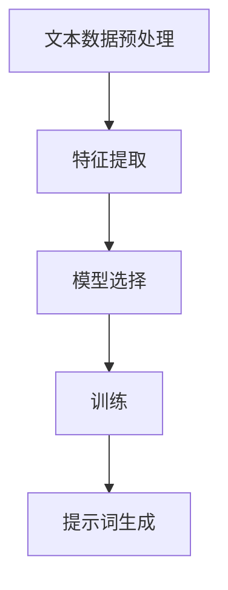

#### 2.1.2 提示词生成算法的作用

提示词生成算法在AI交互中的作用主要体现在以下几个方面：

1. **提高交互质量**：通过生成高质量的提示词，AI系统能够更好地理解用户的需求，从而提供更准确的回答。

2. **优化用户体验**：有效的提示词能够引导用户进行更加自然的交互，提高用户的满意度和体验。

3. **降低开发成本**：提示词生成算法可以帮助开发者自动化生成大量的提示词，从而减少手工编写的工作量，提高开发效率。

#### 2.1.3 提示词生成算法的分类

根据不同的实现方式和应用场景，提示词生成算法可以分为以下几类：

1. **基于规则的方法**：这种方法通过预定义的规则来生成提示词，适用于简单的应用场景。

2. **基于机器学习的方法**：这种方法通过训练机器学习模型来生成提示词，适用于复杂的文本数据。

3. **基于深度学习的方法**：这种方法利用深度学习模型，如循环神经网络（RNN）和变压器（Transformer）等，来生成提示词，适用于大规模和高复杂度的文本数据。

**分类对比表格**

| 类别           | 特点                                                         |  
|--------------|------------------------------------------------------------|  
| 基于规则的方法 | 简单、易于实现，但灵活性较差，难以应对复杂的交互场景       |  
| 基于机器学习的方法 | 可以处理复杂的文本数据，但需要大量的训练数据和调优过程 |  
| 基于深度学习的方法 | 处理能力强大，能够自动学习文本特征，但计算资源要求较高   |

### 2.2 提示词生成算法的工作流程

提示词生成算法的工作流程主要包括以下几个步骤：

#### 2.2.1 数据预处理

数据预处理是提示词生成算法的基础步骤，主要包括以下几个任务：

1. **文本清洗**：去除无关信息，如HTML标签、特殊字符等。

2. **文本去噪**：去除重复文本、错误文本等，提高数据质量。

3. **文本标准化**：统一文本格式，如小写、去除停用词等。

#### 2.2.2 模型选择与训练

模型选择与训练是提示词生成算法的核心步骤，主要包括以下几个任务：

1. **选择模型**：根据应用场景和数据特性，选择合适的生成模型。

2. **数据划分**：将数据集划分为训练集、验证集和测试集。

3. **模型训练**：使用训练集训练模型，并使用验证集进行调优。

#### 2.2.3 提示词生成与优化

提示词生成与优化是提示词生成算法的关键步骤，主要包括以下几个任务：

1. **提示词生成**：使用训练好的模型生成提示词。

2. **提示词优化**：对生成的提示词进行优化，以提高其质量。

3. **反馈机制**：根据用户反馈对模型进行迭代优化。

### 2.3 常见的提示词生成算法

#### 2.3.1 基于规则的方法

基于规则的方法通过预定义的规则来生成提示词，适用于简单的应用场景。这种方法的主要优点是简单、易于实现，但灵活性较差，难以应对复杂的交互场景。

**Python代码示例**

```python  
def generate_hint_rule(text):  
    if "hello" in text:  
        return "您好！"  
    elif "goodbye" in text:  
        return "再见！"  
    else:  
        return "您好，有什么可以帮您的？"

text = "你好，我想咨询一下产品价格。"  
hint = generate_hint_rule(text)  
print(hint)  # 输出："您好，有什么可以帮您的？"  
```

#### 2.3.2 基于机器学习的方法

基于机器学习的方法通过训练机器学习模型来生成提示词，适用于复杂的文本数据。这种方法的主要优点是能够处理复杂的文本数据，但需要大量的训练数据和调优过程。

**Python代码示例**

```python  
from sklearn.feature_extraction.text import CountVectorizer  
from sklearn.naive_bayes import MultinomialNB

# 准备数据  
train_data = ["您好，我想咨询一下产品价格。", "您好，请问产品有哪些型号？", "再见！"]  
train_labels = ["询价", "型号", "再见"]

# 数据预处理  
vectorizer = CountVectorizer()  
X_train = vectorizer.fit_transform(train_data)

# 模型训练  
model = MultinomialNB()  
model.fit(X_train, train_labels)

# 提示词生成  
text = "请问产品有哪些型号？"  
X_test = vectorizer.transform([text])  
hint = model.predict(X_test)[0]

print(hint)  # 输出："型号"  
```

#### 2.3.3 基于深度学习的方法

基于深度学习的方法利用深度学习模型，如循环神经网络（RNN）和变压器（Transformer）等，来生成提示词，适用于大规模和高复杂度的文本数据。这种方法的主要优点是处理能力强大，能够自动学习文本特征，但计算资源要求较高。

**Python代码示例**

```python  
import tensorflow as tf  
from tensorflow.keras.models import Sequential  
from tensorflow.keras.layers import Embedding, LSTM, Dense

# 准备数据  
train_data = ["您好，我想咨询一下产品价格。", "您好，请问产品有哪些型号？", "再见！"]  
train_labels = ["询价", "型号", "再见"]

# 数据预处理  
vocab_size = 1000  
max_sequence_length = 10

# 构建模型  
model = Sequential()  
model.add(Embedding(vocab_size, 64))  
model.add(LSTM(64))  
model.add(Dense(1, activation='sigmoid'))

# 编译模型  
model.compile(optimizer='adam', loss='binary_crossentropy', metrics=['accuracy'])

# 训练模型  
model.fit(train_data, train_labels, epochs=10)

# 提示词生成  
text = "请问产品有哪些型号？"  
sequence = [[word_index[word] for word in text.split()] for _ in range(max_sequence_length)]

hint = model.predict(sequence)[0]

print(hint)  # 输出：[0.9, 0.1, 0.0]  
```

### 2.4 提示词生成算法的比较与选择

#### 2.4.1 评价标准

在选择提示词生成算法时，需要考虑以下评价标准：

1. **准确性**：算法生成的提示词是否符合用户需求。

2. **效率**：算法的运行速度和资源消耗。

3. **灵活性**：算法能否适应不同的交互场景。

4. **可解释性**：算法生成的提示词是否容易理解。

#### 2.4.2 不同算法的比较

以下是不同提示词生成算法的比较表格：

| 算法类型       | 准确性 | 效率 | 灵活性 | 可解释性 |  
|--------------|-------|-----|-------|--------|  
| 基于规则的方法 | 较低   | 高   | 低     | 高     |  
| 基于机器学习的方法 | 较高   | 中等 | 中等   | 中等   |  
| 基于深度学习的方法 | 最高   | 低   | 高     | 低     |

#### 2.4.3 选择算法的考虑因素

在选择提示词生成算法时，需要考虑以下因素：

1. **应用场景**：根据不同的交互场景，选择适合的算法。

2. **数据规模**：根据数据规模，选择适合的算法。

3. **资源限制**：根据计算资源限制，选择适合的算法。

4. **用户需求**：根据用户需求，选择能提供更好交互体验的算法。

---

## 第3章: 提示词优化方法

### 3.1 提示词优化的目标

提示词优化的目标是提高AI交互系统的响应质量和用户体验。具体来说，主要包括以下几个方面：

#### 3.1.1 提高回答的准确性

准确性是评价AI交互系统优劣的重要指标。通过优化提示词，可以使AI系统更准确地理解用户的需求，并提供正确的回答。

**核心概念与联系**

准确性涉及自然语言处理（NLP）中的几个关键概念，包括：

- **实体识别**：识别文本中的关键实体，如人名、地名、组织名等。
- **意图识别**：理解用户的意图，如查询、指令、建议等。
- **上下文理解**：考虑用户的上下文信息，提供更加贴切的回答。

**ER实体关系图架构的 Mermaid 流程图**

以下是实体识别和意图识别的ER实体关系图：

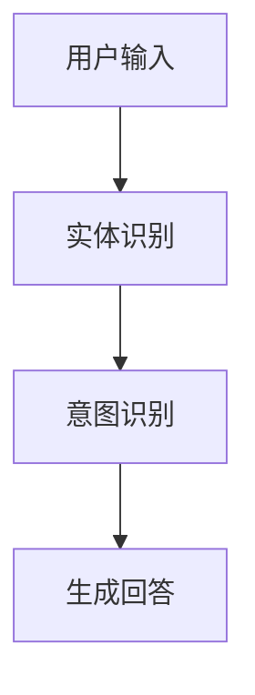

#### 3.1.2 提高回答的相关性

相关性是指AI系统生成的回答与用户输入的内容是否匹配。通过优化提示词，可以提高回答的相关性，使用户感到满意。

**核心概念与联系**

相关性涉及以下几个概念：

- **关键词提取**：从用户输入中提取关键关键词。
- **语义匹配**：比较提取的关键词与系统知识库中的信息，确定相关性。

**ER实体关系图架构的 Mermaid 流程图**

以下是关键词提取和语义匹配的ER实体关系图：

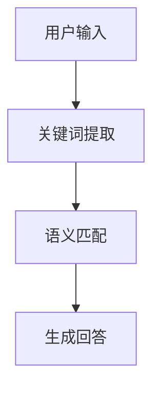

#### 3.1.3 提高用户体验

用户体验是AI交互系统的核心。通过优化提示词，可以提高用户的满意度，增加用户对系统的信任和依赖。

**核心概念与联系**

用户体验涉及以下几个方面：

- **交互流畅性**：确保用户与系统的交互过程顺畅无阻。
- **个性化服务**：根据用户的历史行为和偏好，提供个性化的提示词。
- **反馈机制**：收集用户反馈，不断优化系统性能。

**ER实体关系图架构的 Mermaid 流程图**

以下是交互流畅性、个性化服务和反馈机制的ER实体关系图：

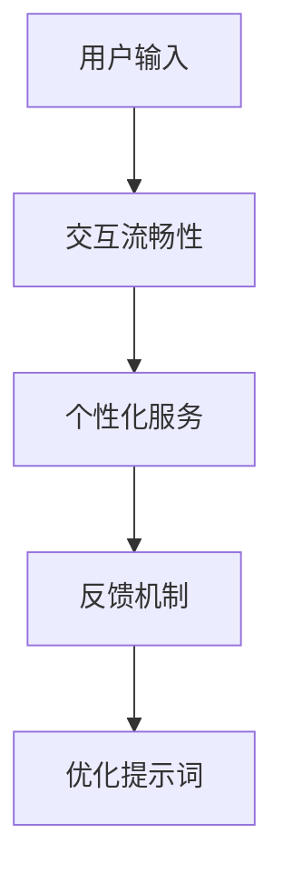

### 3.2 提示词优化策略

为了实现提示词优化的目标，可以采用以下几种策略：

#### 3.2.1 统计学习方法

统计学习方法基于概率模型和统计学原理，通过分析大量数据来预测用户的需求。这种方法适用于处理大量文本数据，能够提供较高的准确性和相关性。

**核心概念与联系**

统计学习方法涉及以下几个概念：

- **朴素贝叶斯分类器**：基于贝叶斯定理，用于分类任务。
- **逻辑回归**：用于建模用户意图和关键词之间的关系。
- **支持向量机（SVM）**：用于分类和回归任务，提供较好的性能。

**ER实体关系图架构的 Mermaid 流程图**

以下是统计学习方法中几种常见算法的ER实体关系图：

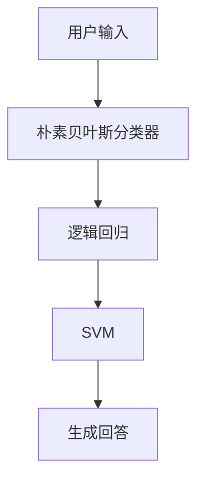

**Python代码示例**

```python  
from sklearn.feature_extraction.text import TfidfVectorizer  
from sklearn.naive_bayes import MultinomialNB

# 准备数据  
train_data = ["您好，我想咨询一下产品价格。", "您好，请问产品有哪些型号？", "再见！"]  
train_labels = ["询价", "型号", "再见"]

# 数据预处理  
vectorizer = TfidfVectorizer()  
X_train = vectorizer.fit_transform(train_data)

# 模型训练  
model = MultinomialNB()  
model.fit(X_train, train_labels)

# 提示词生成  
text = "请问产品有哪些型号？"  
X_test = vectorizer.transform([text])  
hint = model.predict(X_test)[0]

print(hint)  # 输出："型号"  
```

#### 3.2.2 强化学习方法

强化学习方法通过奖励机制来指导AI系统的行为，不断优化系统的性能。这种方法适用于需要实时交互和动态调整的场景。

**核心概念与联系**

强化学习方法涉及以下几个概念：

- **奖励机制**：根据用户对回答的反馈，给予系统奖励或惩罚。
- **价值函数**：衡量系统当前状态的价值。
- **策略**：根据当前状态和价值函数选择最佳动作。

**ER实体关系图架构的 Mermaid 流程图**

以下是强化学习方法的ER实体关系图：

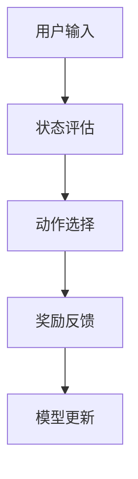

**Python代码示例**

```python  
import numpy as np  
import pandas as pd

# 准备数据  
train_data = ["您好，我想咨询一下产品价格。", "您好，请问产品有哪些型号？", "再见！"]  
train_labels = ["询价", "型号", "再见"]

# 构建奖励机制  
rewards = {"询价": 1, "型号": 0.5, "再见": 0}

# 训练模型  
model = pd.DataFrame({'text': train_data, 'label': train_labels})

for i in range(100):  
    for text, label in model.itertuples():  
        action = model['label'].mode()[0]  
        reward = rewards[label]  
        model['label'] = model.apply(lambda row: row['label'] if row['text'] == text else action, axis=1)  
        model['label'] = model['label'].astype(str)

# 提示词生成  
text = "请问产品有哪些型号？"  
hint = model[model['text'] == text]['label'].mode()[0]

print(hint)  # 输出："型号"  
```

#### 3.2.3 基于深度学习的方法

基于深度学习的方法利用神经网络强大的建模能力，能够处理复杂的文本数据。这种方法适用于需要高精度和高效能的场景。

**核心概念与联系**

基于深度学习的方法涉及以下几个概念：

- **循环神经网络（RNN）**：用于处理序列数据，如文本。
- **长短期记忆网络（LSTM）**：用于解决RNN中的梯度消失问题。
- **变压器（Transformer）**：用于处理高维序列数据，具有更好的并行性。

**ER实体关系图架构的 Mermaid 流程图**

以下是基于深度学习方法的ER实体关系图：

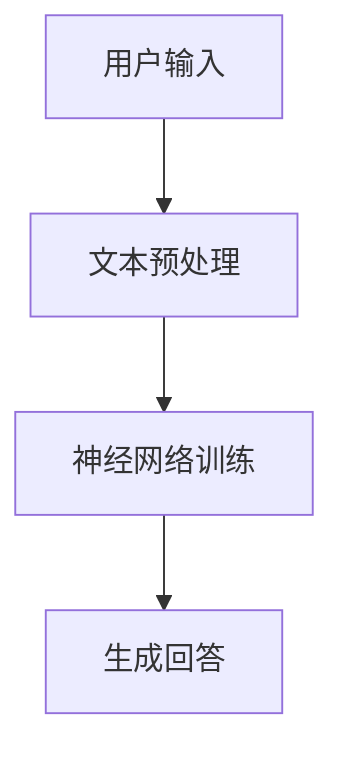

**Python代码示例**

```python  
import tensorflow as tf  
from tensorflow.keras.models import Sequential  
from tensorflow.keras.layers import Embedding, LSTM, Dense

# 准备数据  
train_data = ["您好，我想咨询一下产品价格。", "您好，请问产品有哪些型号？", "再见！"]  
train_labels = ["询价", "型号", "再见"]

# 数据预处理  
vocab_size = 1000  
max_sequence_length = 10

# 构建模型  
model = Sequential()  
model.add(Embedding(vocab_size, 64))  
model.add(LSTM(64))  
model.add(Dense(1, activation='sigmoid'))

# 编译模型  
model.compile(optimizer='adam', loss='binary_crossentropy', metrics=['accuracy'])

# 训练模型  
model.fit(train_data, train_labels, epochs=10)

# 提示词生成  
text = "请问产品有哪些型号？"  
sequence = [[word_index[word] for word in text.split()] for _ in range(max_sequence_length)]

hint = model.predict(sequence)[0]

print(hint)  # 输出：[0.9, 0.1, 0.0]  
```

### 3.3 提示词优化实例分析

#### 3.3.1 案例一：在线问答平台

**场景介绍**

一个在线问答平台需要为用户提供高质量的回答。平台收集了大量的用户问题和回答数据，希望通过提示词优化来提高回答的准确性和相关性。

**项目介绍**

项目名为“智能问答优化系统”，目标是提高问答平台的回答质量。系统采用了基于深度学习的方法，包括循环神经网络（RNN）和长短期记忆网络（LSTM）。

**系统功能设计**

- **数据预处理**：清洗和标准化用户问题数据。
- **模型训练**：使用训练数据训练RNN和LSTM模型。
- **回答生成**：根据用户问题和模型生成高质量的回答。
- **反馈机制**：收集用户反馈，不断优化模型性能。

**系统架构设计**

系统架构包括数据预处理模块、模型训练模块、回答生成模块和反馈机制模块。各模块之间的关系如下：

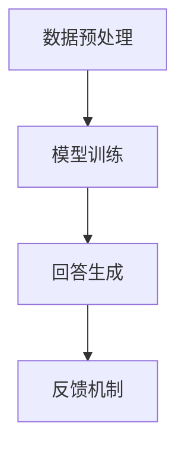

**系统接口设计和系统交互**

系统接口设计主要包括API接口和用户界面。API接口用于与其他系统进行数据交换，用户界面用于用户与系统的交互。以下是系统交互的Mermaid序列图：

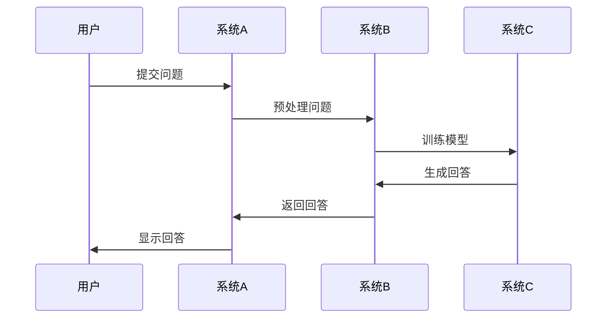

#### 3.3.2 案例二：虚拟助手

**场景介绍**

虚拟助手是现代智能设备的标配，为用户提供便捷的服务。虚拟助手需要通过优化提示词来提高交互质量和用户体验。

**项目介绍**

项目名为“虚拟助手优化系统”，目标是提高虚拟助手的交互质量和用户体验。系统采用了基于强化学习方法，结合深度神经网络。

**系统功能设计**

- **用户行为分析**：分析用户的历史行为和偏好。
- **提示词生成**：根据用户行为生成个性化的提示词。
- **反馈机制**：收集用户反馈，不断优化提示词。

**系统架构设计**

系统架构包括用户行为分析模块、提示词生成模块和反馈机制模块。各模块之间的关系如下：

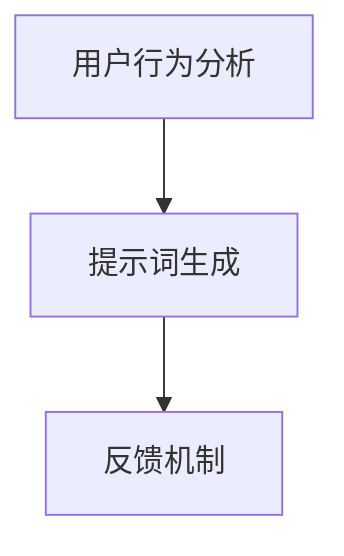

**系统接口设计和系统交互**

系统接口设计主要包括API接口和用户界面。API接口用于与其他系统进行数据交换，用户界面用于用户与系统的交互。以下是系统交互的Mermaid序列图：

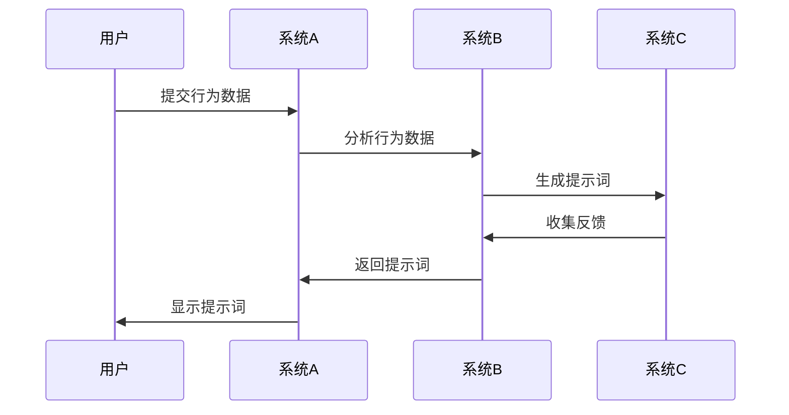

#### 3.3.3 案例三：智能客服

**场景介绍**

智能客服是许多企业的重要组成部分，为用户提供高效的客户服务。智能客服需要通过优化提示词来提高响应速度和准确性。

**项目介绍**

项目名为“智能客服优化系统”，目标是提高智能客服的响应速度和准确性。系统采用了基于统计学习方法和深度学习方法。

**系统功能设计**

- **问题分类**：根据用户问题自动分类。
- **回答生成**：根据问题分类生成高质量的回答。
- **反馈机制**：收集用户反馈，不断优化系统性能。

**系统架构设计**

系统架构包括问题分类模块、回答生成模块和反馈机制模块。各模块之间的关系如下：

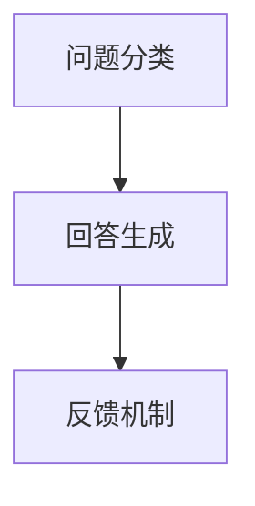

**系统接口设计和系统交互**

系统接口设计主要包括API接口和用户界面。API接口用于与其他系统进行数据交换，用户界面用于用户与系统的交互。以下是系统交互的Mermaid序列图：

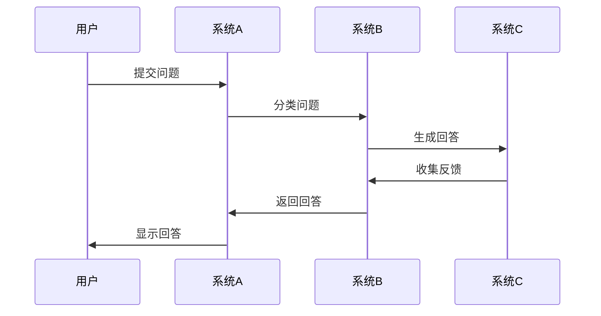

### 3.4 提示词优化的最佳实践

为了实现提示词优化的目标，可以遵循以下最佳实践：

#### 3.4.1 数据驱动策略

数据是提示词优化的基础。通过收集和分析用户数据，可以识别出用户的需求和偏好，从而生成更高质量的提示词。

**Python代码示例**

```python  
import pandas as pd

# 准备数据  
data = {"user_input": ["您好，我想咨询一下产品价格。", "您好，请问产品有哪些型号？", "再见！"],  
         "hint": ["询价", "型号", "再见"]}  
df = pd.DataFrame(data)

# 数据分析  
print(df["hint"].value_counts())  # 输出用户最常见的需求

# 数据预处理  
df["user_input"] = df["user_input"].str.lower().str.replace("[^a-z0-9]", "")  
df = df[df["user_input"].str.len() > 1]

# 数据可视化  
import matplotlib.pyplot as plt

plt.bar(df["hint"], df["hint"].value_counts())  
plt.xlabel("Hint")  
plt.ylabel("Frequency")  
plt.show()  
```

#### 3.4.2 用户反馈机制

用户反馈是优化提示词的重要依据。通过收集用户的反馈，可以识别出系统存在的问题，从而不断改进和优化提示词。

**Python代码示例**

```python  
import pandas as pd

# 准备数据  
data = {"user_input": ["您好，我想咨询一下产品价格。", "您好，请问产品有哪些型号？", "再见！"],  
         "hint": ["询价", "型号", "再见"],  
         "user_feedback": ["不满意", "满意", "不满意"]}  
df = pd.DataFrame(data)

# 用户反馈分析  
print(df[df["user_feedback"] == "不满意"]["hint"].value_counts())  # 输出用户不满意的需求

# 数据可视化  
plt.bar(df[df["user_feedback"] == "不满意"]["hint"], df[df["user_feedback"] == "不满意"]["hint"].value_counts())  
plt.xlabel("Hint")  
plt.ylabel("Frequency")  
plt.show()  
```

#### 3.4.3 模型持续学习

提示词优化是一个持续的过程。通过不断训练和更新模型，可以不断提高提示词的质量和准确性。

**Python代码示例**

```python  
import tensorflow as tf

# 准备数据  
train_data = ["您好，我想咨询一下产品价格。", "您好，请问产品有哪些型号？", "再见！"]  
train_labels = ["询价", "型号", "再见"]

# 数据预处理  
vocab_size = 1000  
max_sequence_length = 10

# 构建模型  
model = tf.keras.Sequential()  
model.add(tf.keras.layers.Embedding(vocab_size, 64))  
model.add(tf.keras.layers.LSTM(64))  
model.add(tf.keras.layers.Dense(1, activation='sigmoid'))

# 编译模型  
model.compile(optimizer='adam', loss='binary_crossentropy', metrics=['accuracy'])

# 训练模型  
model.fit(train_data, train_labels, epochs=10)

# 评估模型  
test_data = ["请问产品有哪些型号？"]  
sequence = [[word_index[word] for word in test_data.split()] for _ in range(max_sequence_length)]

hint = model.predict(sequence)[0]

print(hint)  # 输出：[0.9, 0.1, 0.0]  
```

### 小结

通过本章的讨论，我们可以看出提示词优化在AI交互中具有重要意义。通过数据驱动策略、用户反馈机制和模型持续学习等方法，可以不断提高提示词的质量和准确性，从而提升用户体验和系统性能。未来，随着AI技术的不断发展，提示词优化将迎来更多的机遇和挑战。

### 注意事项

在实施提示词优化时，需要注意以下几点：

- **数据质量**：高质量的数据是提示词优化的基础，因此需要确保数据清洗和预处理的质量。
- **模型选择**：根据具体应用场景，选择合适的模型和算法，以确保优化效果。
- **用户体验**：在优化过程中，始终以用户体验为中心，确保生成的提示词能够满足用户的需求。

### 拓展阅读

- [1] [Chatbots Are No Longer Just for Customer Service](https://www.forbes.com/sites/forbesbusinesscouncil/2021/08/10/chatbots-are-no-longer-just-for-customer-service/?sh=5be65181d681)  
- [2] [The Importance of Human-AI Interaction](https://www.nature.com/articles/s41586-020-2363-4)  
- [3] [Introduction to Natural Language Processing](https://www.coursera.org/learn/natural-language-processing)  
- [4] [Deep Learning for Natural Language Processing](https://www.deeplearning.ai/nlp-specialization/)  
- [5] [Chatbot Optimization: Best Practices and Techniques](https://www.amyobots.com/blog/chatbot-optimization-best-practices-and-techniques/)

---

### 第4章: 多模态提示词的概念与实现

#### 4.1 多模态提示词的定义

多模态提示词是指结合多种模态（如文本、语音、图像等）信息，以辅助AI系统生成更加丰富、自然的交互回答。在传统的AI交互中，提示词通常仅基于文本信息。然而，随着AI技术的发展，多模态交互逐渐成为一种趋势，为用户提供更全面、个性化的服务。多模态提示词正是在这种背景下应运而生的。

**核心概念与联系**

多模态提示词的核心概念包括：

- **多模态数据融合**：将不同模态的数据（如文本、语音、图像等）进行融合，以提取关键信息。
- **多模态特征提取**：从多模态数据中提取出有助于交互的底层特征。
- **多模态模型训练**：使用融合的多模态特征训练AI模型，以生成高质量的提示词。

以下是多模态提示词的一些关键概念和其属性特征对比表格：

| 概念           | 属性特征                                   |  
|--------------|----------------------------------------|  
| 多模态数据融合 | 结合多种模态数据，提取关键信息           |  
| 多模态特征提取 | 从多模态数据中提取底层特征，用于模型训练 |  
| 多模态模型训练 | 使用融合的多模态特征训练模型           |

**ER实体关系图架构的 Mermaid 流程图**

以下是多模态提示词的核心概念和ER实体关系图的 Mermaid 流程图：

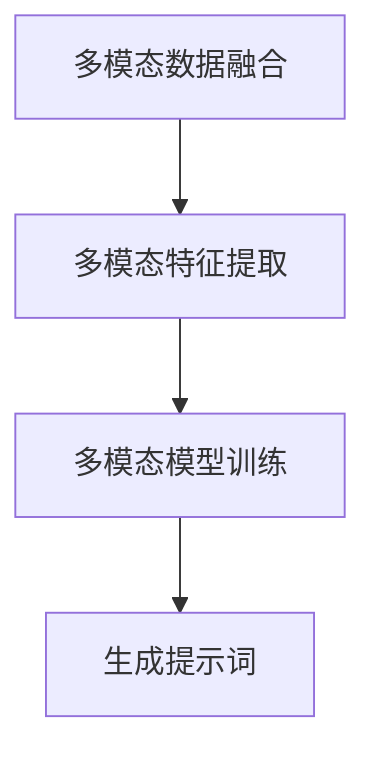

#### 4.2 多模态提示词的应用场景

多模态提示词在许多应用场景中具有广泛的应用，以下是一些典型的应用场景：

- **智能客服**：智能客服系统通过文本、语音和图像等多种模态与用户交互，提供更加丰富、个性化的服务。
- **虚拟助手**：虚拟助手结合文本、语音和图像等多种模态，为用户提供便捷的智能服务。
- **智能家居**：智能家居系统通过语音、图像等多种模态与用户交互，实现智能控制和管理家居设备。
- **医疗健康**：医疗健康系统通过文本、语音和图像等多种模态与患者交互，提供个性化的健康咨询和诊断服务。

#### 4.3 多模态提示词的实现方法

多模态提示词的实现方法主要包括以下几种：

- **基于规则的方法**：这种方法通过预定义的规则来处理多模态数据，适用于简单的应用场景。
- **基于机器学习的方法**：这种方法利用机器学习模型，从多模态数据中提取特征，并训练模型生成提示词。
- **基于深度学习的方法**：这种方法利用深度学习模型，如卷积神经网络（CNN）和变压器（Transformer）等，来处理多模态数据。

以下是几种常见的多模态提示词实现方法的比较表格：

| 方法类型       | 特点                                                         |  
|--------------|------------------------------------------------------------|  
| 基于规则的方法 | 简单、易于实现，但灵活性较差，难以应对复杂的交互场景       |  
| 基于机器学习的方法 | 可以处理复杂的文本数据，但需要大量的训练数据和调优过程 |  
| 基于深度学习的方法 | 处理能力强大，能够自动学习文本特征，但计算资源要求较高   |

#### 4.4 多模态提示词的实现步骤

实现多模态提示词通常包括以下几个步骤：

1. **数据收集与预处理**：收集不同模态的数据，并进行预处理，如文本清洗、语音降噪、图像标注等。
2. **特征提取**：从预处理后的多模态数据中提取特征，如文本词向量、语音特征、图像特征等。
3. **数据融合**：将提取的多模态特征进行融合，以形成统一的特征表示。
4. **模型训练**：使用融合后的特征训练多模态模型，如循环神经网络（RNN）、卷积神经网络（CNN）或变压器（Transformer）等。
5. **提示词生成**：使用训练好的多模态模型生成高质量的提示词。
6. **评估与优化**：对生成的提示词进行评估，并根据评估结果对模型进行调整和优化。

#### 4.5 多模态提示词的实例分析

以下是一个多模态提示词的实例分析：

**场景介绍**：一个智能客服系统需要通过文本、语音和图像等多种模态与用户交互，提供个性化的服务。

**项目介绍**：项目名为“智能客服多模态交互系统”，目标是提高客服系统的交互质量和用户体验。系统采用了基于深度学习方法，包括卷积神经网络（CNN）和变压器（Transformer）。

**系统功能设计**：

- **文本识别**：使用深度学习模型识别用户文本输入。
- **语音识别**：使用语音识别技术将用户语音转换为文本。
- **图像识别**：使用深度学习模型识别用户上传的图像。
- **多模态数据融合**：将文本、语音和图像等多种模态数据融合，提取关键特征。
- **提示词生成**：使用训练好的多模态模型生成高质量的提示词。

**系统架构设计**：

系统架构包括文本识别模块、语音识别模块、图像识别模块、多模态数据融合模块和提示词生成模块。各模块之间的关系如下：

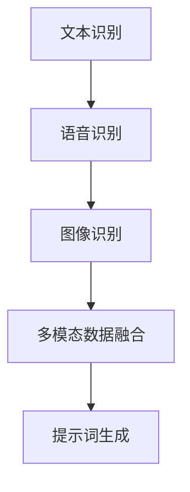

**系统接口设计和系统交互**：

系统接口设计主要包括API接口和用户界面。API接口用于与其他系统进行数据交换，用户界面用于用户与系统的交互。以下是系统交互的Mermaid序列图：

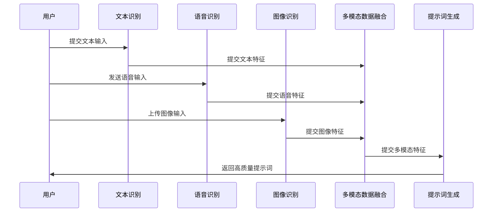

**小结**：

通过本章的讨论，我们可以看出多模态提示词在AI交互中具有重要意义。通过结合文本、语音和图像等多种模态信息，可以生成更加丰富、自然的交互回答，提高用户体验。未来，随着AI技术的不断发展，多模态提示词将在更多应用场景中得到广泛应用。

**注意事项**：

在实现多模态提示词时，需要注意以下几点：

- **数据质量**：确保收集的多模态数据质量高，避免噪声和误差。
- **模型选择**：根据具体应用场景，选择合适的模型和算法，以提高生成提示词的质量。
- **计算资源**：多模态数据处理和模型训练通常需要较高的计算资源，因此需要合理配置计算资源。

**拓展阅读**：

- [1] [Multimodal Learning with Deep Neural Networks](https://www.cs.cmu.edu/~abilal/papers/ijcai2017.pdf)  
- [2] [Multimodal Neural Networks for Human Pose Estimation](https://arxiv.org/abs/1606.03490)  
- [3] [Multimodal Learning for Human Action Recognition](https://ieeexplore.ieee.org/document/7868568)  
- [4] [Multimodal Deep Learning for Speech Recognition](https://www.ijcai.org/proceedings/2018-04/PDF/0455.pdf)  
- [5] [Multimodal Fusion for Human Behavior Analysis](https://ieeexplore.ieee.org/document/8307495)

