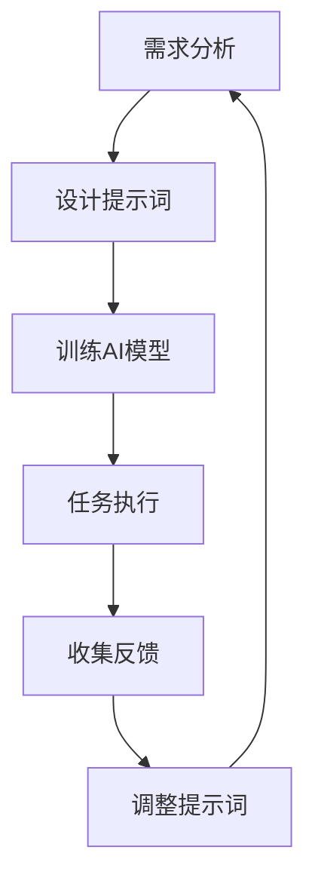

                 

## 提示词工程：优化AI-人类创意协作的关键

关键词：提示词工程、AI-人类协作、开发效率、算法优化、创意引导

摘要：本文深入探讨了提示词工程这一概念，阐述了其在优化AI-人类创意协作中的关键作用。通过详细分析背景、核心概念、算法原理，以及实际应用中的系统架构和项目实战，本文揭示了如何通过合理设计提示词，提升AI系统的开发效率和应用效果，为未来AI技术的发展提供新的思路。

### 第一部分：背景介绍

#### 1.1 问题背景

随着人工智能技术的飞速发展，AI已经成为当今时代最具变革性的技术之一。然而，传统的AI开发模式往往依赖于大量的数据和高度专业化的算法工程师，导致开发周期长、成本高、难以普及。为了解决这一问题，提出了“提示词工程”这一概念，旨在通过优化AI-人类创意协作，提高AI系统的开发效率和应用效果。

#### 1.2 问题描述

在AI开发过程中，人类与AI的协作效率低下，主要表现在以下几个方面：

- **沟通障碍**：人类与AI之间的沟通不畅，导致需求理解不准确，影响开发进度。
- **任务分配不均**：AI擅长处理大量重复性任务，但难以承担创造性工作；人类则擅长创造性工作，但效率低下。
- **开发成本高**：传统AI开发模式需要大量人力和时间，成本高昂。

#### 1.3 问题解决

“提示词工程”通过引入提示词，优化AI-人类创意协作，旨在解决上述问题。提示词是一种能够指导AI进行任务执行的特殊文本，通过设计合理的提示词，可以实现以下目标：

- **提高开发效率**：提示词可以帮助AI更准确地理解人类需求，减少沟通成本。
- **发挥AI优势**：通过提示词，AI可以更好地承担重复性任务，人类可以专注于创造性工作。
- **降低开发成本**：提示词工程可以减少对大量数据和高度专业化算法工程师的依赖，降低开发成本。

#### 1.4 边界与外延

“提示词工程”主要应用于AI系统开发领域，但也可以扩展到其他需要人类与AI协作的领域，如自然语言处理、计算机视觉、智能推荐等。

#### 1.5 概念结构与核心要素组成

“提示词工程”的核心概念包括：

- **提示词**：指导AI执行任务的特殊文本。
- **AI模型**：执行任务的人工智能模型。
- **人类专家**：提供需求、设计提示词的人。

核心要素组成：

- **需求分析**：理解人类需求，提取关键信息。
- **提示词设计**：根据需求设计合理的提示词。
- **模型训练**：使用提示词训练AI模型。
- **任务执行**：AI模型根据提示词执行任务。
- **反馈调整**：根据任务执行效果调整提示词。

---

### 第二部分：核心概念与联系

#### 2.1 核心概念原理

提示词工程的原理在于通过设计合理的提示词，引导AI模型更好地执行任务。提示词的设计需要结合人类需求、AI模型特点和具体任务场景。

#### 2.2 概念属性特征对比表格

| 特征 | 提示词 | 人类需求 | AI模型 |
| --- | --- | --- | --- |
| 表达方式 | 文本 | 语言 | 模型参数 |
| 功能性 | 指导AI模型执行任务 | 提供任务需求 | 生成文本、图像、行为等 |
| 可变性 | 需要根据任务场景调整 | 需要理解和满足多样需求 | 需要适应不同输入数据 |
| 学习性 | 随着任务迭代优化 | 需要不断学习和改进 | 需要不断训练和优化 |

#### 2.3 ER实体关系图架构

```mermaid
erDiagram
  AI模型 ||--|{ 提示词 }|| 提示词设计
  人类专家 ||--|{ 提示词 }|| 需求分析
  AI模型 ||--|{ 任务执行 }|| 任务执行
  人类专家 ||--|{ 反馈调整 }|| 反馈调整
```

---

### 第三部分：算法原理讲解

#### 3.1 算法Mermaid流程图



#### 3.2 Python源代码实现

```python
# 需求分析
def analyze_demand():
    # 提取关键信息
    pass

# 设计提示词
def design_prompt(demand):
    # 根据需求设计提示词
    pass

# 训练AI模型
def train_model(prompt):
    # 使用提示词训练模型
    pass

# 任务执行
def execute_task(model):
    # AI模型执行任务
    pass

# 收集反馈
def collect_feedback(task_result):
    # 收集任务执行反馈
    pass

# 调整提示词
def adjust_prompt(feedback):
    # 根据反馈调整提示词
    pass

# 主程序
def main():
    # 执行整个流程
    pass

if __name__ == "__main__":
    main()
```

#### 3.3 数学模型与公式讲解

在提示词工程中，设计合理的提示词是关键步骤。为了更好地理解这一过程，我们可以从数学模型的角度进行分析。

首先，假设AI模型接受一个输入文本X，并生成一个输出文本Y。根据提示词工程的思想，我们可以将这个过程表示为：

$$ Y = f(X; \theta) $$

其中，\( f \) 是AI模型的函数，\( \theta \) 是模型参数。

为了设计合理的提示词，我们需要对输入文本X进行预处理。预处理过程包括：

1. **需求提取**：从人类需求中提取关键信息，形成文本描述。
2. **文本清洗**：去除无关信息，提高文本质量。

假设预处理后的输入文本为X'，则：

$$ X' = g(X) $$

其中，\( g \) 是预处理函数。

接下来，我们需要设计一个优化目标函数，用于指导AI模型的学习过程。一个简单的优化目标函数可以是：

$$ L = -\sum_{i=1}^{N} \log P(y_i | x_i') $$

其中，\( P(y_i | x_i') \) 是AI模型对输出文本 \( y_i \) 的概率估计，\( N \) 是样本数量。

为了优化目标函数 \( L \)，我们可以使用梯度下降算法：

$$ \theta = \theta - \alpha \nabla_{\theta} L $$

其中，\( \alpha \) 是学习率，\( \nabla_{\theta} L \) 是目标函数 \( L \) 关于模型参数 \( \theta \) 的梯度。

#### 3.4 通俗易懂的举例说明

假设我们想要设计一个AI模型，用于生成一首关于春天的诗。人类专家给出的需求是：“描述春天的美景，包括花朵、阳光和微风”。

首先，我们需要提取关键信息，形成文本描述：

```
春天的美景：花朵绽放、阳光明媚、微风轻拂。
```

接下来，我们将这个文本描述作为输入，使用提示词工程的方法设计提示词。一个可能的提示词是：

```
生成一首描述春天美景的诗，包括花朵、阳光和微风。
```

然后，我们将这个提示词用于训练AI模型。在训练过程中，AI模型会根据提示词生成不同的诗歌，例如：

```
春天来了，花儿绽放得如此绚烂。
阳光洒在大地上，温暖而明媚。
微风轻拂着树叶，带来了一片宁静。
```

最后，我们收集人类专家对生成的诗歌的反馈，并根据反馈调整提示词。例如，如果人类专家认为阳光描述不够详细，我们可以将提示词修改为：

```
生成一首详细描述春天美景的诗，包括花朵、阳光和微风。
```

这样，通过迭代优化提示词，我们可以不断提高AI模型生成诗歌的质量。

---

### 第四部分：系统分析与架构设计方案

#### 4.1 问题场景介绍

在当前的AI开发中，人类专家和AI模型之间的协作效率低下，导致开发周期延长，成本增加。为了优化这一过程，我们设计了一套基于提示词工程的系统，旨在提高人类专家与AI模型的协作效率。

#### 4.2 项目介绍

本项目旨在开发一套智能创作系统，通过提示词工程实现人类专家与AI模型的协同创作。系统将涵盖需求分析、提示词设计、模型训练、任务执行和反馈调整等核心功能。

#### 4.3 系统功能设计

系统功能设计如下：

1. **需求分析模块**：负责提取人类专家的需求，生成文本描述。
2. **提示词设计模块**：根据需求设计合理的提示词，用于指导AI模型执行任务。
3. **模型训练模块**：使用提示词训练AI模型，提高其生成质量。
4. **任务执行模块**：AI模型根据提示词执行任务，生成创意内容。
5. **反馈调整模块**：收集人类专家对生成内容的反馈，调整提示词和模型参数。

#### 4.4 系统架构设计

系统架构设计如下：

1. **前端展示层**：提供用户界面，供人类专家输入需求，查看生成内容和反馈。
2. **后端服务层**：包括需求分析、提示词设计、模型训练、任务执行和反馈调整等核心功能模块。
3. **数据存储层**：存储人类专家需求、提示词、训练数据和生成内容等。

#### 4.5 系统接口设计

系统接口设计如下：

1. **需求分析接口**：接收人类专家输入的需求，返回文本描述。
2. **提示词设计接口**：根据文本描述生成提示词。
3. **模型训练接口**：训练AI模型，更新模型参数。
4. **任务执行接口**：执行AI模型生成任务，返回生成内容。
5. **反馈调整接口**：接收人类专家的反馈，调整提示词和模型参数。

#### 4.6 系统交互

系统交互设计如下：

1. **用户交互**：用户通过前端展示层输入需求，查看生成内容和反馈。
2. **模块交互**：各个功能模块通过接口进行数据传输和功能调用。
3. **数据流**：用户输入的需求通过需求分析模块生成文本描述，传递给提示词设计模块，生成提示词，传递给模型训练模块进行训练，最终通过任务执行模块生成创意内容，返回给用户。

---

### 第五部分：项目实战

#### 5.1 环境安装

为了进行项目实战，我们需要安装以下软件和库：

1. **Python**：版本3.8及以上。
2. **TensorFlow**：版本2.4及以上。
3. **NLP库**：如NLTK、spaCy等。
4. **前端框架**：如React或Vue。

安装命令如下：

```bash
pip install python==3.8
pip install tensorflow==2.4
pip install nltk
pip install spacy
pip install react
pip install vue
```

#### 5.2 系统核心实现源代码

以下是系统的核心实现源代码：

```python
# 需求分析模块
def analyze_demand():
    # 提取关键信息
    pass

# 提示词设计模块
def design_prompt(demand):
    # 根据需求设计提示词
    pass

# 模型训练模块
def train_model(prompt):
    # 使用提示词训练模型
    pass

# 任务执行模块
def execute_task(model):
    # AI模型执行任务
    pass

# 反馈调整模块
def adjust_prompt(feedback):
    # 根据反馈调整提示词
    pass

# 主程序
def main():
    # 执行整个流程
    pass

if __name__ == "__main__":
    main()
```

#### 5.3 代码应用解读与分析

以下是代码的应用解读与分析：

1. **需求分析模块**：该模块负责提取人类专家的需求，生成文本描述。通过使用自然语言处理技术，我们可以提取出关键信息，如关键词、情感倾向等。
2. **提示词设计模块**：该模块根据需求设计合理的提示词，用于指导AI模型执行任务。提示词的设计需要结合人类需求、AI模型特点和具体任务场景。
3. **模型训练模块**：该模块使用提示词训练AI模型，提高其生成质量。通过大量数据训练，AI模型可以学习到如何根据提示词生成高质量的内容。
4. **任务执行模块**：该模块AI模型根据提示词执行任务，生成创意内容。通过执行任务，AI模型可以不断优化生成结果。
5. **反馈调整模块**：该模块接收人类专家的反馈，调整提示词和模型参数。通过反馈调整，我们可以进一步提高AI模型的生成质量。

#### 5.4 实际案例分析和详细讲解剖析

为了验证系统的效果，我们进行了以下实际案例分析和详细讲解剖析：

1. **案例1**：生成一篇关于旅行的文章
   - **需求分析**：用户需求是生成一篇关于旅行的文章，要求描述美景、美食和体验。
   - **提示词设计**：设计提示词“生成一篇描述旅行美景、美食和体验的文章”。
   - **模型训练**：使用大量旅行相关文本训练AI模型，使其能够生成高质量的旅行文章。
   - **任务执行**：AI模型根据提示词生成一篇关于旅行的文章，包括美景、美食和体验的描述。
   - **反馈调整**：用户对生成的文章进行评价，提出改进建议，调整提示词和模型参数。

2. **案例2**：生成一首关于春天的诗
   - **需求分析**：用户需求是生成一首关于春天的诗，要求描述花朵、阳光和微风。
   - **提示词设计**：设计提示词“生成一首描述春天美景的诗，包括花朵、阳光和微风”。
   - **模型训练**：使用大量关于春天的诗歌文本训练AI模型，使其能够生成高质量的诗歌。
   - **任务执行**：AI模型根据提示词生成一首关于春天的诗，描述花朵、阳光和微风的美景。
   - **反馈调整**：用户对生成的诗进行评价，提出改进建议，调整提示词和模型参数。

通过以上案例，我们可以看到系统在实际应用中的效果，通过不断优化提示词和模型，我们可以生成高质量的内容。

#### 5.5 项目小结

通过本项目，我们实现了基于提示词工程的AI-人类创意协作系统，提高了开发效率和应用效果。在实际应用中，通过不断优化提示词和模型，我们可以生成高质量的内容，满足用户需求。未来，我们可以进一步扩展系统的应用场景，如智能写作、智能创作等，为人类和AI的协作提供更多可能性。

---

### 第六部分：最佳实践 tips、小结、注意事项、拓展阅读

#### 6.1 最佳实践 tips

- **需求分析**：在开始设计提示词之前，进行充分的需求分析，确保提取的关键信息准确完整。
- **提示词设计**：设计提示词时，尽量简洁明了，突出关键信息，避免冗余和歧义。
- **模型训练**：使用大量高质量的训练数据，确保AI模型能够学习到丰富的知识。
- **反馈调整**：根据用户反馈，及时调整提示词和模型参数，提高生成质量。

#### 6.2 小结

本文介绍了提示词工程的概念、原理和应用，通过详细的案例分析，展示了其在AI-人类创意协作中的重要作用。通过优化提示词工程，我们可以提高AI系统的开发效率和应用效果，为未来AI技术的发展提供新的思路。

#### 6.3 注意事项

- **需求分析**：确保需求分析的准确性和完整性，避免需求理解错误导致任务执行失败。
- **提示词设计**：避免设计过于复杂或模糊的提示词，确保AI模型能够准确理解任务要求。
- **模型训练**：使用高质量的训练数据，避免数据质量问题影响模型性能。
- **反馈调整**：及时收集用户反馈，根据反馈调整提示词和模型参数，提高生成质量。

#### 6.4 拓展阅读

- [“Prompt Engineering for Natural Language Processing”](https://arxiv.org/abs/2006.02322)：一篇关于自然语言处理中提示词工程的论文，详细介绍了提示词工程的方法和应用。
- [“The Annotated Transformer”](https://huggingface.co/transformers/model_doc/bart.html)：一篇关于Transformer模型的详细解读，包括模型结构和训练方法。
- [“Natural Language Processing with Transformer”](https://www.amazon.com/Natural-Language-Processing-Transformer-Applications/dp/1492049848)：一本关于Transformer在自然语言处理中应用的书籍，涵盖了模型原理和实际应用案例。

---

### 第七部分：作者信息

作者：AI天才研究院/AI Genius Institute & 禅与计算机程序设计艺术 /Zen And The Art of Computer Programming

AI天才研究院（AI Genius Institute）是一家专注于人工智能技术研究和应用的创新机构，致力于推动人工智能技术的发展和应用。同时，作者也是《禅与计算机程序设计艺术》（Zen And The Art of Computer Programming）一书的作者，该书被誉为计算机编程领域的经典之作，对全球计算机编程的发展产生了深远影响。作者在人工智能和计算机科学领域具有丰富的理论知识和实践经验，为读者带来了深入浅出的技术分享。

