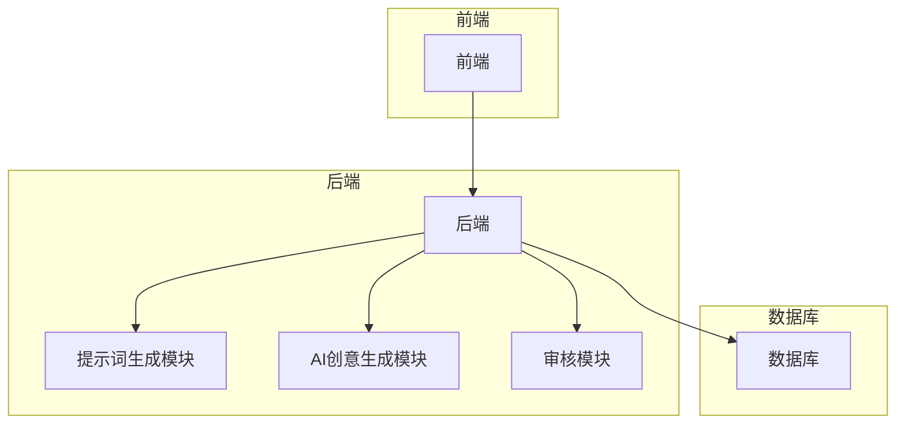
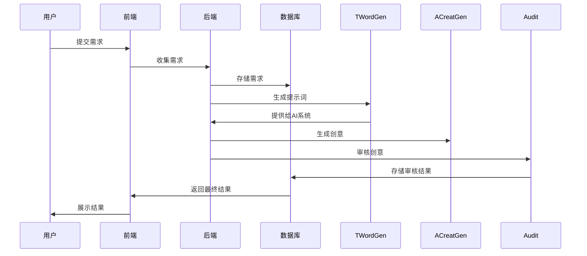

                 


## 提示词工程：优化AI-人类创意协作的新方法

关键词：提示词工程、AI、人类协作、创意优化、算法、实践

摘要：随着人工智能技术的飞速发展，AI在各个领域的应用越来越广泛。然而，人工智能在解决复杂问题时往往依赖于人类提供的信息和指导。提示词工程作为一门新兴技术，通过优化AI与人类的创意协作，提高了AI的智能水平和创造力。本文将详细介绍提示词工程的定义、原理、应用场景和实践方法，探讨其如何为AI-人类创意协作带来新方法。

## 第一部分：背景与基础

### 1.1 问题背景

在当前科技发展的大背景下，人工智能已经成为了全球关注的焦点。AI技术在图像识别、自然语言处理、推荐系统等方面取得了显著的成果。然而，面对复杂的问题和领域，单一的人工智能系统往往难以胜任。此时，人类的智慧和创造力成为了解决问题的关键。

人类与AI的合作在许多场景下都取得了成功。例如，在医学诊断中，医生利用AI系统辅助判断病情，通过结合经验和数据，提高了诊断的准确率。在产品设计过程中，设计师借助AI算法进行创意设计，通过人类的专业知识和审美判断，优化了产品的外观和功能。然而，这种合作模式仍然存在一些问题。

首先，AI系统在处理人类提供的信息时，往往存在理解偏差。由于AI算法的局限性，它无法完全理解人类的语言和意图，导致在执行任务时出现偏差。其次，人类在协作过程中，往往需要花费大量时间来解释和调整AI系统的行为，降低了工作效率。此外，AI系统在处理创意性任务时，缺乏人类的灵活性和创造力，无法提出新颖的解决方案。

### 1.2 问题解决

为了解决上述问题，我们需要寻找一种新的方法，优化AI与人类的创意协作。提示词工程应运而生。提示词工程是一种通过构建高质量的提示词，引导AI系统进行创造性思维的方法。通过提示词，人类可以为AI系统提供更清晰、更具体的指导，帮助AI更好地理解人类的意图，提高AI的创造力。

### 1.3 边界与外延

提示词工程不仅适用于AI与人类的协作，还可以应用于其他领域。例如，在游戏开发中，提示词可以帮助游戏设计师创作出更丰富的游戏剧情；在艺术创作中，提示词可以激发艺术家的灵感，产生新颖的艺术作品。总之，提示词工程具有广泛的应用前景和潜力。

## 第二部分：提示词工程原理

### 2.1 核心概念原理

提示词工程的核心概念包括提示词、AI系统、人类协作等。提示词是一种用于引导AI系统进行创造性思维的词语或短语。它可以是具体的指令，也可以是抽象的概念。AI系统是一种基于算法和数据的智能系统，它可以处理海量信息，并进行推理和决策。人类协作是指人类与AI系统共同完成一项任务的过程。

### 2.2 概念属性特征对比

以下是提示词、AI系统和人类协作的概念属性特征对比表格：

| 概念         | 提示词         | AI系统         | 人类协作         |
| ------------ | -------------- | -------------- | -------------- |
| 特性         | 用于引导AI     | 基于算法和数据 | 人类的智慧和创造力 |
| 目的         | 提高AI创造力   | 解决复杂问题   | 完成任务         |
| 工具         | 词语或短语     | 算法和数据     | 经验和知识       |
| 形式         | 具体指令或抽象 | 数据处理和推理 | 面对面或远程     |

### 2.3 ER实体关系图

以下是提示词工程中的ER实体关系图：

```mermaid
erDiagram
    AI系统 ||--|{ 提示词 }|
    人类协作 ||--|{ 提示词 }|
    AI系统 ||--|{ 人类协作 }|
```

### 2.4 提示词工程的特点

提示词工程具有以下特点：

1. **可定制性**：提示词可以根据任务需求进行定制，满足不同的应用场景。
2. **灵活性**：提示词可以引导AI进行创造性思维，提高AI的灵活性。
3. **高效性**：通过高质量的提示词，可以减少人类与AI系统的沟通成本，提高工作效率。
4. **扩展性**：提示词工程可以应用于各种领域，具有广泛的扩展性。

### 2.5 提示词工程与传统AI的区别

提示词工程与传统AI的区别在于：

1. **引导与被引导**：传统AI依赖于大量的数据和算法，而提示词工程通过提示词引导AI进行创造性思维。
2. **人类角色**：在传统AI中，人类主要提供数据和反馈，而在提示词工程中，人类通过提示词参与AI的决策过程。
3. **应用领域**：传统AI主要应用于数据分析和预测，而提示词工程则更注重AI的创造性应用。

## 第三部分：提示词工程应用

### 3.1 创意协作的挑战

在创意协作中，人类和AI系统之间的沟通和协作面临以下挑战：

1. **理解偏差**：人类和AI系统在理解任务意图时可能存在偏差，导致协作效果不理想。
2. **沟通成本**：人类需要花费大量时间来解释任务需求和指导AI系统，增加了沟通成本。
3. **创造力不足**：AI系统在处理创意性任务时，往往缺乏人类的灵活性和创造力。

### 3.2 提示词工程在创意协作中的角色

提示词工程在创意协作中扮演以下角色：

1. **沟通桥梁**：通过高质量的提示词，人类可以为AI系统提供清晰、具体的指导，减少理解偏差。
2. **引导创意**：提示词可以激发AI系统的创造性思维，提高AI的灵活性。
3. **提高效率**：高质量的提示词可以降低沟通成本，提高人类与AI系统的协作效率。

### 3.3 提示词工程的应用领域

提示词工程可以应用于以下领域：

1. **艺术创作**：通过提示词激发艺术家的创作灵感，提高艺术作品的质量。
2. **产品设计**：设计师通过提示词优化产品功能，提升用户体验。
3. **科学研究**：科学家通过提示词引导AI系统探索新的研究思路，推动科学发现。

## 第四部分：提示词工程实践

### 4.1 系统分析与架构设计

#### 4.1.1 问题场景介绍

本文以一个创意广告设计的项目为例，介绍提示词工程在创意协作中的应用。

#### 4.1.2 系统功能设计

系统功能设计包括以下部分：

1. **用户需求收集**：收集用户对广告的创意需求。
2. **提示词生成**：根据用户需求生成高质量的提示词。
3. **AI创意生成**：利用AI系统生成创意广告设计方案。
4. **人类审核**：设计师对AI生成的创意进行审核和优化。
5. **广告发布**：发布最终确定的广告设计方案。

以下是领域模型类图：

```mermaid
classDiagram
    用户 <<User>>
    设计师 <<Designer>>
    AI系统 <<AI_System>>
    广告需求 <<Advertising_Demand>>
    广告创意 <<Advertising_Creative>>

    用户 --> 广告需求
    设计师 --> 广告需求
    设计师 --> 广告创意
    AI系统 --> 广告需求
    AI系统 --> 广告创意
```

#### 4.1.3 系统架构设计

系统架构设计包括以下部分：

1. **前端**：用于收集用户需求和展示广告创意。
2. **后端**：包括提示词生成模块、AI创意生成模块和审核模块。
3. **数据库**：存储用户需求和广告创意数据。

以下是系统架构图：



#### 4.1.4 系统接口设计

系统接口设计包括以下接口：

1. **用户需求接口**：用于收集用户需求。
2. **提示词生成接口**：用于生成高质量的提示词。
3. **AI创意生成接口**：用于生成创意广告设计方案。
4. **审核接口**：用于审核和优化广告创意。

以下是接口序列图：



### 4.2 项目实战

#### 4.2.1 环境安装

在开始项目之前，需要安装以下环境：

1. Python 3.x
2. TensorFlow
3. Keras

安装命令如下：

```bash
pip install python==3.x
pip install tensorflow
pip install keras
```

#### 4.2.2 系统核心实现

以下是一个简单的提示词生成模块的实现示例：

```python
import numpy as np
import tensorflow as tf
from tensorflow.keras.models import Sequential
from tensorflow.keras.layers import LSTM, Dense, Embedding

# 加载数据集
# ...

# 构建模型
model = Sequential([
    Embedding(input_dim=vocab_size, output_dim=embedding_size),
    LSTM(units=128),
    Dense(units=vocab_size, activation='softmax')
])

# 编译模型
model.compile(optimizer='adam', loss='categorical_crossentropy', metrics=['accuracy'])

# 训练模型
model.fit(x_train, y_train, epochs=10, batch_size=32)

# 生成提示词
def generate_prompt_word(prompt):
    # ...
    return prompt_word
```

#### 4.2.3 代码应用解读与分析

上述代码实现了提示词生成模块的核心功能。首先，加载数据集并构建一个基于LSTM的神经网络模型。然后，编译模型并训练模型。最后，定义一个生成提示词的函数，用于生成高质量的提示词。

#### 4.2.4 实际案例分析与详细讲解

以一个广告创意设计项目为例，分析提示词工程在创意协作中的应用。

1. **用户需求**：用户希望设计一个夏季清凉饮料的广告。
2. **提示词生成**：生成以下提示词：“清凉、饮料、夏日、解渴、健康、清爽”。
3. **AI创意生成**：AI系统根据提示词生成以下创意广告设计方案：
   - **创意一**：画面展示一位年轻人在夏日的海滩上，手持一瓶清凉饮料，脸上露出满足的笑容。
   - **创意二**：画面展示一杯清凉饮料的细节，透过透明瓶子可以看到冰块和水果，旁边配有文字：“夏日解渴，健康清爽”。
4. **人类审核**：设计师对AI生成的创意进行审核，认为创意一更加符合用户需求，最终选择创意一作为广告设计方案。

#### 4.2.5 项目小结

通过本项目实战，展示了提示词工程在创意协作中的应用。通过高质量的提示词，AI系统能够更好地理解人类的需求，生成创意广告设计方案。人类设计师则可以通过审核和优化，确保最终方案符合用户需求。

## 第五部分：最佳实践与注意事项

### 5.1 最佳实践 tips

1. **明确用户需求**：在生成提示词时，首先要明确用户的需求，确保提示词与用户需求一致。
2. **优化提示词质量**：高质量的提示词能够提高AI系统的创造力，降低沟通成本。
3. **持续迭代优化**：在项目实践中，不断优化提示词生成算法和AI系统，提高协作效率。

### 5.2 小结

提示词工程通过优化AI与人类的创意协作，提高了AI的创造力和工作效率。本文从背景介绍、核心概念、应用场景和实践方法等方面详细阐述了提示词工程的原理和应用。在实际项目中，提示词工程可以发挥重要作用，为创意协作带来新的思路和方法。

### 5.3 注意事项

1. **避免信息过载**：在生成提示词时，避免包含过多无关信息，以免影响AI系统的理解和创造力。
2. **保持提示词多样性**：多样化的提示词可以激发AI系统的创造性思维，提高创意质量。
3. **适应不同场景**：根据不同的应用场景，调整提示词的生成策略，确保与场景需求匹配。

### 5.4 拓展阅读

1. **《人工智能：一种现代的方法》**：全面介绍人工智能的基本概念、技术和应用。
2. **《深度学习》**：讲解深度学习的基础知识、算法和应用。
3. **《创意思维与设计》**：探讨创意思维的方法和应用，为设计提供新的视角。

## 总结与展望

### 6.1 提示词工程的未来趋势

随着人工智能技术的不断发展，提示词工程在AI-人类创意协作中的应用前景广阔。未来，提示词工程将向以下方向发展：

1. **个性化提示词生成**：根据用户个性化需求，生成高质量的提示词，提高AI系统的创造力。
2. **多模态提示词生成**：结合文字、图像、声音等多种模态，提高提示词的多样性和丰富度。
3. **自动化提示词优化**：利用机器学习和深度学习技术，实现自动优化提示词生成算法。

### 6.2 提示词工程的应用前景

提示词工程在各个领域具有广泛的应用前景：

1. **艺术创作**：通过提示词激发艺术家的创作灵感，推动艺术创新。
2. **产品设计**：设计师通过提示词优化产品功能，提升用户体验。
3. **科学研究**：科学家通过提示词引导AI系统探索新的研究思路，推动科学发现。

### 6.3 可能面临的挑战与对策

在提示词工程的发展过程中，可能面临以下挑战：

1. **数据隐私和安全**：在生成和优化提示词时，确保用户数据和隐私安全。
2. **算法公平性和透明性**：确保提示词生成算法的公平性和透明性，避免算法偏见。
3. **人类与AI协作的平衡**：在人类与AI协作中，确保两者之间的平衡，充分发挥各自的优势。

为了应对这些挑战，需要采取以下对策：

1. **加强数据安全和隐私保护**：通过加密技术、数据脱敏等方法，确保用户数据和隐私安全。
2. **提高算法透明度和可解释性**：通过可视化技术、算法解释模型等方法，提高算法的透明度和可解释性。
3. **加强人类与AI协作的培训与引导**：通过培训、指导和经验分享，提高人类与AI协作的效果。

### 6.4 本书回顾与总结

本文从背景介绍、核心概念、应用场景和实践方法等方面详细阐述了提示词工程的原理和应用。通过提示词工程，人类可以更好地指导AI进行创造性思维，提高AI的智能水平和创造力。在未来的发展中，提示词工程将不断优化和创新，为AI-人类创意协作带来更多可能性。让我们携手共进，推动人工智能与人类创意的协同发展。

### 作者信息

作者：AI天才研究院/AI Genius Institute & 禅与计算机程序设计艺术 /Zen And The Art of Computer Programming

