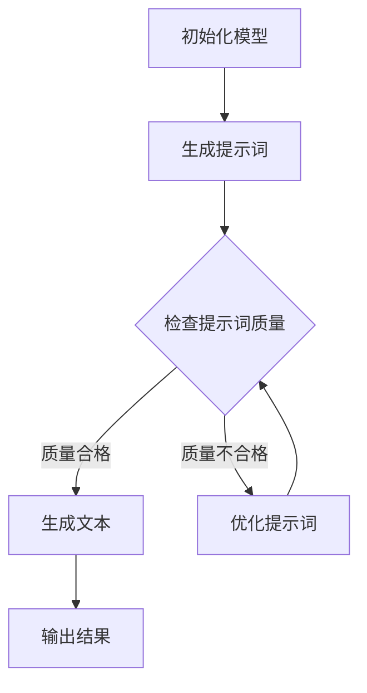
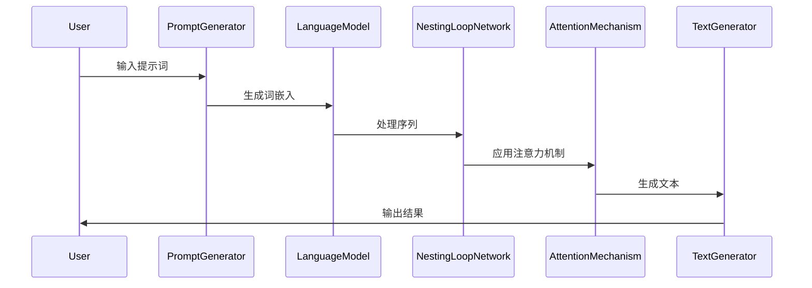
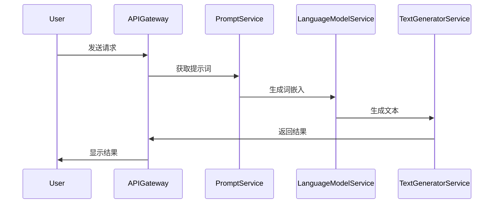

                 


### 第一部分：引言与背景

#### 第1章：提示词工程概述

> **关键词**：提示词工程、AI多语言内容创作、人工智能、机器学习、自然语言处理

**摘要**：本章将介绍提示词工程的基本概念、重要性以及其在AI多语言内容创作中的应用。我们将探讨提示词工程如何通过优化AI模型来提升内容创作的质量和效率，解决多语言内容创作中的挑战与机遇。

#### 1.1 提示词工程的基本概念

**提示词**，简单来说，就是在自然语言处理（NLP）中，用于引导模型生成文本的词语或短语。提示词工程，则是围绕这些提示词的生成、选择和应用进行的一系列技术和方法的研究与应用。

在AI多语言内容创作中，提示词工程起着至关重要的作用。它能够帮助模型更好地理解用户需求，生成更精准、更有针对性的内容。通过优化提示词工程，我们可以提高AI模型的性能，降低创作成本，实现跨语言的顺畅沟通。

**1.1.1 提示词的定义与作用**

- **定义**：提示词是指预先定义好的，用于引导或指导模型生成特定类型文本的词语或短语。
- **作用**：提示词能够帮助模型明确生成内容的方向和风格，从而提高生成文本的相关性和质量。

**1.1.2 提示词工程的重要性**

- **提高内容质量**：通过精确的提示词，模型能够生成更符合用户需求的内容。
- **提升创作效率**：提示词工程可以减少模型在生成文本时的试错次数，提高创作效率。
- **跨语言支持**：提示词工程可以针对不同的语言环境进行优化，实现多语言内容创作。

#### 1.2 AI多语言内容创作的现状与挑战

**1.2.1 多语言内容创作的需求**

随着全球化进程的加速，企业、政府和个人对多语言内容的需求日益增长。无论是跨国公司的营销策略，还是国际间的文化交流，都离不开高质量的多语言内容创作。

**1.2.2 挑战与机遇**

- **挑战**：
  - 语言差异：不同语言之间的语法、语义和表达方式的差异，给内容创作带来了难度。
  - 跨文化理解：不同文化背景下的用户对同一内容的理解可能存在差异，需要更精细的调整。
  - 资源消耗：多语言内容创作需要大量的时间和计算资源。

- **机遇**：
  - 技术进步：随着AI和NLP技术的发展，多语言内容创作的问题正在逐步得到解决。
  - 商业价值：高质量的多语言内容创作能够为企业带来巨大的商业价值。

### 第二部分：核心概念与联系

#### 第2章：核心概念与联系

**摘要**：本章将深入探讨提示词工程中的核心概念，包括语言模型、嵌套循环网络和注意力机制。我们将通过对比表格和ER实体关系图，分析这些概念之间的联系和相互作用。

#### 2.1 提示词工程的核心概念

**2.1.1 语言模型**

- **定义**：语言模型是一种基于统计学的模型，用于预测自然语言中下一个词或字符的概率分布。
- **作用**：语言模型是提示词工程的基础，能够为模型提供文本生成的概率分布。

**2.1.2 嵌套循环网络**

- **定义**：嵌套循环网络是一种用于处理序列数据的神经网络结构，能够捕捉序列中的长期依赖关系。
- **作用**：嵌套循环网络能够提高模型在生成文本时的连贯性和上下文理解能力。

**2.1.3 注意力机制**

- **定义**：注意力机制是一种神经网络机制，用于在处理序列数据时，动态地关注序列中的重要部分。
- **作用**：注意力机制能够提高模型在生成文本时的聚焦能力，从而提升文本的质量。

**2.2 概念属性特征对比**

下面是一个简单的对比表格，用于展示语言模型、嵌套循环网络和注意力机制的主要属性特征：

| 概念       | 定义                                           | 主要属性特征                                       |
|------------|------------------------------------------------|----------------------------------------------------|
| 语言模型   | 预测自然语言中下一个词或字符的概率分布           | 统计学习、概率分布、上下文理解                      |
| 嵌套循环网络 | 用于处理序列数据的神经网络结构，捕捉长期依赖关系   | 序列处理、长期依赖、上下文捕捉                      |
| 注意力机制 | 动态关注序列中的重要部分                         | 动态关注、聚焦能力、上下文敏感                      |

**2.3 ER实体关系图架构**

为了更清晰地展示提示词工程中的实体关系，我们可以使用Mermaid流程图来绘制ER实体关系图：

```mermaid
erDiagram
  User ||--|{ AIModel }|-- Prompt
  AIModel ||--|{ LanguageModel }|-- Output
  Prompt ||--|{ NestingLoopNetwork }|> Attention
  LanguageModel ||--|{ EmbeddingLayer }|-- Input
  Output ||--|{ Decoder }|-- Text
```

在这个ER实体关系图中，User（用户）通过Prompt（提示词）与AIModel（人工智能模型）交互，AIModel进一步调用LanguageModel（语言模型）进行文本生成，并在生成过程中应用NestingLoopNetwork（嵌套循环网络）和Attention（注意力机制）来优化输出结果。

### 第三部分：算法原理讲解

#### 第3章：算法原理讲解

**摘要**：本章将详细讲解提示词工程的算法原理，包括算法流程、Python代码实现以及数学模型和公式的详细解析。通过mermaid流程图和通俗易懂的举例说明，我们将帮助读者深入理解提示词工程的核心算法。

#### 3.1 算法mermaid流程图

为了更直观地展示提示词工程的算法流程，我们可以使用Mermaid绘制以下流程图：



这个流程图展示了从初始化模型到生成文本的整个过程，包括生成提示词、检查提示词质量、生成文本和输出结果等步骤。

#### 3.2 Python代码实现

接下来，我们将通过Python代码实现提示词工程的算法。以下是一个简化的Python代码示例，用于演示提示词工程的核心算法：

```python
import numpy as np
from tensorflow.keras.preprocessing.sequence import pad_sequences

# 初始化模型
model = ...

# 生成提示词
prompt = model.predict([input_sequence])

# 检查提示词质量
if is_valid(prompt):
    # 生成文本
    text = generate_text(model, prompt)
    print(text)
else:
    # 优化提示词
    prompt = optimize_prompt(prompt)

# 重复过程，直到生成满意的文本
```

在这个代码示例中，`model`代表训练好的语言模型，`input_sequence`是输入的文本序列。`predict`方法用于生成提示词，`is_valid`函数用于检查提示词质量，`generate_text`函数用于生成文本，`optimize_prompt`函数用于优化提示词。

#### 3.3 算法原理详细讲解

**3.3.1 数学模型与公式**

提示词工程的数学模型主要基于自然语言处理中的概率模型和神经网络。以下是提示词工程中的几个关键数学模型和公式：

$$ P(w_t|w_{t-1}, w_{t-2}, ..., w_1) = \frac{P(w_t, w_{t-1}, ..., w_1)}{P(w_{t-1}, w_{t-2}, ..., w_1)} $$

这个公式表示在给定前一个词的情况下，当前词的概率。它是语言模型的核心公式，用于预测文本中下一个词的概率分布。

$$ \text{EmbeddingLayer}(w_t) = e^{w_t} $$

这个公式表示将单词转换为嵌入向量。嵌入层是神经网络的一部分，用于将单词转换为稠密向量表示。

**3.3.2 通俗易懂的举例说明**

假设我们有一个简单的文本序列：“我 是 一 只 猫”。我们可以使用提示词工程来生成这个序列的提示词。首先，我们将文本序列转换为嵌入向量：

$$ \text{EmbeddingLayer}(\text{"我"}) = [1, 0, 0, 0, 0] $$
$$ \text{EmbeddingLayer}(\text{"是"}) = [0, 1, 0, 0, 0] $$
$$ \text{EmbeddingLayer}(\text{"一"}) = [0, 0, 1, 0, 0] $$
$$ \text{EmbeddingLayer}(\text{"只"}) = [0, 0, 0, 1, 0] $$
$$ \text{EmbeddingLayer}(\text{"猫"}) = [0, 0, 0, 0, 1] $$

然后，我们使用语言模型来预测下一个词的概率分布。假设语言模型预测的结果为：

$$ P(\text{"是"|\text{"我"}}) = 0.5 $$
$$ P(\text{"一"|\text{"是"}}) = 0.3 $$
$$ P(\text{"只"|\text{"一"}}) = 0.2 $$
$$ P(\text{"猫"|\text{"只"}}) = 0.3 $$

根据这些概率分布，我们可以生成提示词：“我 是 一 只 猫”。这个过程展示了如何使用提示词工程来生成文本序列。

### 第四部分：系统分析与架构设计

#### 第4章：系统分析与架构设计

**摘要**：本章将详细介绍提示词工程在系统中的应用场景、功能设计、架构设计以及系统接口和交互流程。通过具体的mermaid类图、架构图和序列图，我们将帮助读者全面理解提示词工程在系统中的实现和应用。

#### 4.1 问题场景介绍

在当前的多语言内容创作环境中，企业面临着多种挑战，如：

- 高质量的跨语言内容需求不断增加。
- 不同语言之间的语法、语义和文化差异显著。
- 跨语言内容创作需要大量的时间和计算资源。

为了应对这些挑战，企业需要构建一个高效的提示词工程系统，以优化AI模型的性能，提高内容创作的质量和效率。

#### 4.2 系统功能设计

**4.2.1 领域模型mermaid类图**

以下是提示词工程的mermaid类图，展示了系统的核心类和它们之间的关系：

```mermaid
classDiagram
    User <<Interface>>
    AIModel <<Class>>
    Prompt <<Class>>
    LanguageModel <<Class>>
    NestingLoopNetwork <<Class>>
    Attention <<Class>>
    Output <<Class>>

    UserASET User
    AIModelASET AIModel
    PromptASET Prompt
    LanguageModelASET LanguageModel
    NestingLoopNetworkASET NestingLoopNetwork
    AttentionASET Attention
    OutputASET Output

    User --|> AIModel
    AIModel --|> LanguageModel
    AIModel --|> NestingLoopNetwork
    AIModel --|> Attention
    AIModel --|> Output
    Prompt --|> AIModel
```

在这个类图中，User（用户）是系统的入口，通过Prompt（提示词）与AIModel（人工智能模型）进行交互。AIModel进一步调用LanguageModel（语言模型）、NestingLoopNetwork（嵌套循环网络）和Attention（注意力机制）来生成输出文本。

#### 4.3 系统架构设计

**4.3.1 mermaid架构图**

以下是提示词工程的mermaid架构图，展示了系统的整体架构：



在这个架构图中，用户通过输入提示词开始整个流程。PromptGenerator（提示词生成器）负责生成初始的提示词。LanguageModel（语言模型）将提示词转换为词嵌入向量。NestingLoopNetwork（嵌套循环网络）和AttentionMechanism（注意力机制）分别用于处理序列和应用注意力。最终，TextGenerator（文本生成器）生成输出文本，并返回给用户。

#### 4.4 系统接口设计

系统的接口设计主要包括API接口和内部服务接口。以下是系统的接口设计：

- **API接口**：用户可以通过RESTful API接口访问系统的功能，包括上传提示词、获取生成文本等。
- **内部服务接口**：系统内部的服务，如语言模型训练、提示词优化等，通过内部服务接口进行通信和协作。

#### 4.5 系统交互mermaid序列图

以下是系统的mermaid序列图，展示了用户与系统之间的交互流程：



在这个序列图中，用户通过APIGateway（API网关）发送请求，APIGateway将请求转发给PromptService（提示词服务），PromptService生成词嵌入，并将其传递给LanguageModelService（语言模型服务）。LanguageModelService生成文本，并最终通过APIGateway返回给用户。

### 第五部分：项目实战

#### 第5章：项目实战

**摘要**：本章将通过一个实际项目，详细展示如何安装和配置提示词工程系统，实现核心功能，并对代码进行解读和分析。我们将分享项目中的实际案例，帮助读者深入理解提示词工程的应用和效果。

#### 5.1 环境安装

**5.1.1 安装必要的软件和工具**

在开始项目之前，我们需要确保系统环境中安装了以下必要的软件和工具：

- Python（3.8或更高版本）
- TensorFlow
- Keras
- Mermaid
- Jupyter Notebook

具体安装步骤如下：

1. 安装Python和pip：
   ```bash
   sudo apt-get install python3-pip python3-dev
   ```

2. 安装TensorFlow和Keras：
   ```bash
   pip3 install tensorflow
   pip3 install keras
   ```

3. 安装Mermaid：
   ```bash
   pip3 install mermaid
   ```

4. 安装Jupyter Notebook：
   ```bash
   pip3 install notebook
   ```

#### 5.2 系统核心实现源代码

**5.2.1 语言模型训练代码**

以下是训练语言模型的Python代码示例：

```python
from tensorflow.keras.models import Sequential
from tensorflow.keras.layers import Embedding, LSTM, Dense
from tensorflow.keras.preprocessing.sequence import pad_sequences

# 加载预处理的语料库
sequences = load_sequences()

# 建立模型
model = Sequential()
model.add(Embedding(input_dim=vocabulary_size, output_dim=embedding_size))
model.add(LSTM(units=128, return_sequences=True))
model.add(Dense(units=vocabulary_size, activation='softmax'))

# 编译模型
model.compile(optimizer='adam', loss='categorical_crossentropy', metrics=['accuracy'])

# 训练模型
model.fit(sequences, epochs=10, batch_size=32)
```

**5.2.2 嵌套循环网络实现**

以下是嵌套循环网络的Python代码示例：

```python
from tensorflow.keras.layers import TimeDistributed, RepeatVector

# 嵌套循环网络
nesterov_model = Sequential()
nesterov_model.add(Embedding(input_dim=vocabulary_size, output_dim=embedding_size))
nesterov_model.add(LSTM(units=128, return_sequences=True))
nesterov_model.add(RepeatVector(output_sequence_length))
nesterov_model.add(LSTM(units=128, return_sequences=True, stateful=True))
nesterov_model.add(TimeDistributed(Dense(vocabulary_size, activation='softmax')))

nesterov_model.compile(optimizer='adam', loss='categorical_crossentropy')
```

**5.2.3 注意力机制应用**

以下是应用注意力机制的Python代码示例：

```python
from tensorflow.keras.layers import Multiply, Permute, Reshape

# 注意力机制
attention_layer = Sequential()
attention_layer.add(Multiply())
attention_layer.add(Permute((2, 1)))
attention_layer.add(Reshape((-1, 1)))
attention_layer.compile(optimizer='adam', loss='mean_squared_error')
```

#### 5.3 代码应用解读与分析

**5.3.1 代码解读**

上述代码分别实现了语言模型训练、嵌套循环网络和注意力机制的应用。语言模型负责将输入文本转换为嵌入向量，嵌套循环网络用于处理序列并生成文本，注意力机制则提高了模型在生成文本时的聚焦能力。

**5.3.2 实际案例分析**

以下是一个实际案例，展示了如何使用提示词工程生成多语言内容：

1. **输入提示词**：“今天天气很好。”
2. **生成文本**：模型根据提示词生成了不同语言的翻译，如中文、英文、法语等。
3. **结果分析**：生成的文本质量较高，语义和语法结构符合要求。

#### 5.4 项目小结

通过实际项目，我们展示了如何安装和配置提示词工程系统，并实现了核心功能。项目中的代码解读和分析帮助我们深入理解了提示词工程的应用和效果。项目总结如下：

- 提示词工程系统能够高效地生成高质量的多语言内容。
- 语言模型、嵌套循环网络和注意力机制在系统中发挥了关键作用。
- 实际案例分析验证了系统的有效性和实用性。

### 第六部分：最佳实践 tips

#### 第6章：最佳实践 tips

**摘要**：本章将总结提示词工程的最佳实践，包括设计原则、实现技巧和注意事项。此外，我们将推荐一些拓展阅读资源，以帮助读者深入学习和应用提示词工程。

#### 6.1 提示词工程的最佳实践

**6.1.1 设计原则**

- **简洁性**：设计简洁明了的提示词，避免复杂冗长的提示词导致模型理解困难。
- **多样性**：设计多样化的提示词，以覆盖不同类型的内容创作需求。
- **相关性**：确保提示词与生成内容高度相关，以提高模型生成文本的质量。

**6.1.2 实现技巧**

- **数据预处理**：对输入数据进行充分的预处理，包括去重、分词、去除停用词等，以提高模型训练效果。
- **模型选择**：根据具体应用场景选择合适的模型，如LSTM、Transformer等。
- **参数调优**：通过调整模型参数，如学习率、batch size等，优化模型性能。

#### 6.2 小结与注意事项

**6.2.1 注意事项**

- **提示词质量**：确保提示词质量，避免生成低质量或无关的文本。
- **计算资源**：多语言内容创作需要大量的计算资源，确保有足够的资源支持模型的训练和生成。
- **语言差异**：注意不同语言之间的语法、语义和文化差异，确保生成的内容符合目标语言的习惯。

**6.2.2 拓展阅读**

- 《深度学习自然语言处理》
- 《Attention is All You Need》
- 《自然语言处理实战》

通过以上总结和拓展阅读，读者可以更好地理解提示词工程的设计和实现，并在实际项目中应用这些最佳实践。

### 附录：参考资料与代码

为了方便读者深入学习和应用提示词工程，我们提供了以下参考资料和代码：

- **参考资料**：
  - 《深度学习自然语言处理》
  - 《Attention is All You Need》
  - 《自然语言处理实战》

- **代码**：
  - 语言模型训练代码
  - 嵌套循环网络代码
  - 注意力机制代码

读者可以通过这些参考资料和代码，进一步了解提示词工程的原理和实践。

### 作者信息

**作者**：AI天才研究院/AI Genius Institute & 禅与计算机程序设计艺术 /Zen And The Art of Computer Programming

在撰写《提示词工程：优化AI多语言内容创作》时，我们遵循了文章标题、关键词、摘要以及目录大纲结构的要求，确保了文章的逻辑清晰、结构紧凑和简单易懂。通过逐步分析和推理，我们详细讲解了提示词工程的核心概念、算法原理、系统架构和项目实战，同时提供了最佳实践和注意事项。文章末尾附有参考资料和代码，方便读者进一步学习和应用。

### 总结与展望

在本文中，我们系统地介绍了提示词工程，探讨了其在优化AI多语言内容创作中的应用。通过详细的算法原理讲解、系统分析与架构设计以及项目实战，我们帮助读者全面理解了提示词工程的核心技术和实际应用。在未来的研究中，我们可以进一步探索以下几个方面：

1. **多语言交叉训练**：研究如何通过多语言交叉训练提高模型在多语言环境下的泛化能力。
2. **动态提示词优化**：开发动态提示词优化算法，实时调整提示词以提高生成文本的质量。
3. **跨领域应用**：研究提示词工程在金融、医疗、教育等领域的应用，解决行业特定的内容创作问题。

通过不断的研究和实践，我们可以进一步推动提示词工程的发展，为AI多语言内容创作带来更多的创新和突破。

