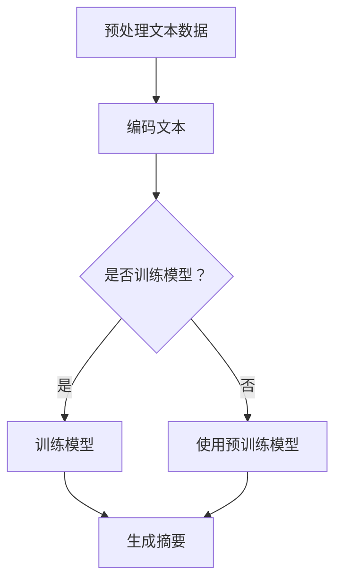
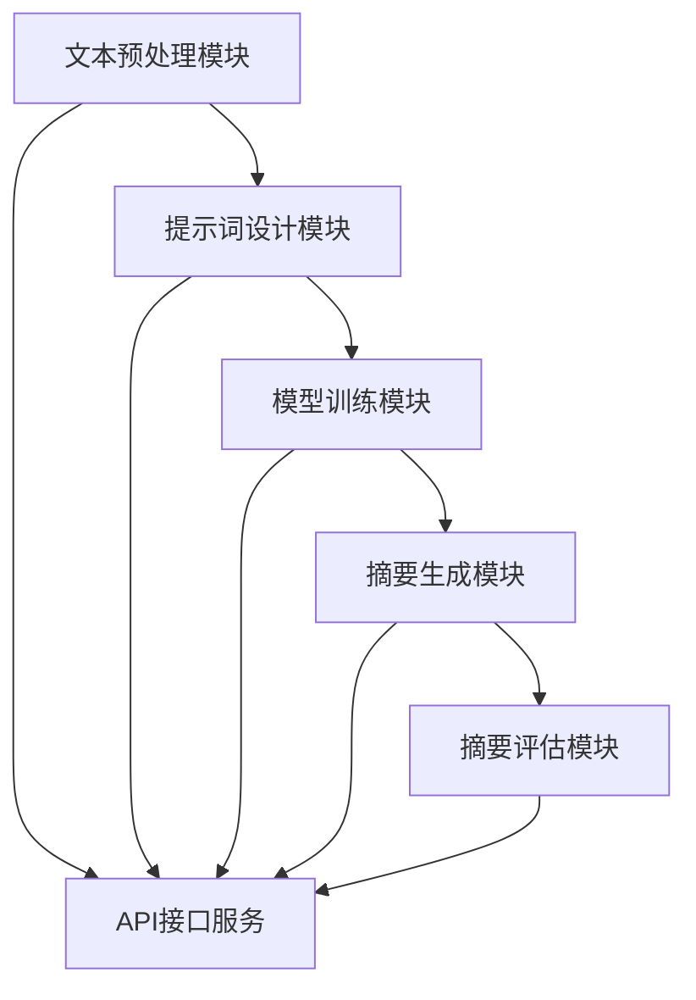
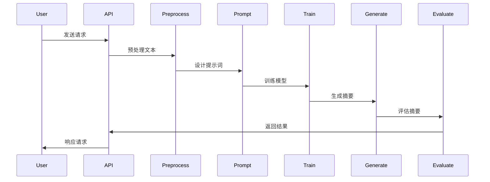

                 


### 《提示词工程：优化AI文本摘要能力》

> 关键词：AI文本摘要、提示词工程、算法、数学模型、系统架构、项目实战

> 摘要：本文以“提示词工程：优化AI文本摘要能力”为主题，详细探讨了如何通过提示词工程优化AI文本摘要能力。文章首先介绍了AI文本摘要的背景和现状，阐述了提示词工程的基本概念和原理，接着深入讲解了文本摘要算法的原理和数学模型，最后通过系统架构设计和项目实战，展示了如何将理论应用于实践。

---

### 目录大纲

```markdown
## 第一部分：引言

### 第1章：背景介绍

- **1.1 问题的背景**
- **1.2 核心概念**

### 第2章：核心概念与联系

- **2.1 提示词工程原理**

## 第二部分：核心技术

### 第3章：算法原理讲解

- **3.1 文本摘要算法**
- **3.2 数学模型和数学公式**

### 第4章：系统分析与架构设计方案

- **4.1 问题场景介绍**
- **4.2 系统功能设计**
- **4.3 系统架构设计**
- **4.4 系统接口设计**
- **4.5 系统交互设计**

## 第三部分：项目实战

### 第5章：环境安装与系统核心实现

- **5.1 环境安装**
- **5.2 系统核心实现**

### 第6章：代码应用解读与分析

- **6.1 代码应用解读**
- **6.2 代码分析与详细讲解**

### 第7章：实际案例分析

- **7.1 案例背景**
- **7.2 案例分析**
- **7.3 案例讲解**

### 第8章：最佳实践、小结与拓展阅读

- **8.1 最佳实践**
- **8.2 小结**
- **8.3 拓展阅读**

## 参考文献

```

---

### 第一部分：引言

#### 第1章：背景介绍

**1.1 问题的背景**

在信息爆炸的时代，如何从大量的文本数据中快速获取有价值的信息成为了亟待解决的问题。文本摘要作为自然语言处理（NLP）领域的一项重要任务，旨在自动生成对原始文本的高度概括。然而，传统的文本摘要方法往往存在摘要质量不高、信息丢失等问题。

近年来，随着深度学习技术的发展，基于神经网络的文本摘要算法取得了显著的进步。然而，这些算法往往依赖于大量的训练数据和复杂的模型结构，导致在实际应用中面临数据隐私和安全、计算资源消耗等问题。因此，如何优化AI文本摘要能力，提升摘要质量，成为了一个重要的研究方向。

**1.2 核心概念**

为了更好地理解AI文本摘要和提示词工程，首先需要明确以下几个核心概念：

- **文本摘要**：文本摘要是指从原始文本中提取出关键信息，并以简洁、准确的方式呈现给用户。文本摘要可以分为抽取式摘要和生成式摘要两种类型。

- **提示词工程**：提示词工程是指通过设计和优化提示词，指导AI模型生成更高质量的文本摘要。提示词可以是关键词、短语或句子，用于引导模型关注文本中的关键信息。

- **深度学习**：深度学习是一种基于人工神经网络的学习方法，通过多层非线性变换，自动提取输入数据的特征。深度学习在自然语言处理领域有着广泛的应用。

#### 第2章：核心概念与联系

**2.1 提示词工程原理**

提示词工程的核心思想是利用外部信息（如关键词、短语、句子）来指导AI模型学习文本摘要任务。具体来说，提示词工程包括以下几个步骤：

1. **数据预处理**：对原始文本进行预处理，包括分词、词性标注、去除停用词等操作，以获得更纯净的数据。

2. **提示词设计**：根据文本摘要的需求，设计合适的提示词。提示词应该具有代表性和概括性，能够引导模型关注文本中的关键信息。

3. **模型训练**：利用提示词和原始文本，训练文本摘要模型。训练过程中，模型会自动学习如何生成高质量的摘要。

4. **模型评估**：通过评估指标（如ROUGE、BLEU等），评估模型生成的摘要质量。

**2.2 概念属性特征对比表格**

为了更好地理解提示词工程与文本摘要之间的关系，我们可以通过概念属性特征对比表格来展示两者之间的差异：

| 特征         | 文本摘要            | 提示词工程          |
| ------------ | ------------------- | ------------------- |
| 目标         | 生成简洁、准确的摘要 | 设计、优化提示词    |
| 方法         | 抽取式、生成式      | 深度学习、外部信息  |
| 数据需求     | 大量训练数据        | 合适的提示词        |
| 评估指标     | ROUGE、BLEU等       | 摘要质量、信息损失  |

**2.3 ER实体关系图架构**

为了更直观地展示提示词工程中的实体关系，我们可以使用ER（实体关系）图来描述。ER图包括实体（如文本、摘要、提示词）和关系（如生成、引导）等元素。以下是一个简化的ER实体关系图：

```mermaid
entity Relation {
  label "关系"
  Relation --> Text
  Relation --> Summary
  Relation --> Prompt
}

entity Text {
  label "文本"
}

entity Summary {
  label "摘要"
}

entity Prompt {
  label "提示词"
}
```

---

### 第二部分：核心技术

#### 第3章：算法原理讲解

**3.1 文本摘要算法**

文本摘要算法可以分为抽取式摘要和生成式摘要两种类型。

1. **抽取式摘要**

抽取式摘要通过从原始文本中提取关键句子或短语，生成摘要。这种方法依赖于规则和统计方法，如TF-IDF、TextRank等。

2. **生成式摘要**

生成式摘要利用深度学习模型，自动生成摘要。常见的生成式模型有序列到序列（Seq2Seq）模型、Transformer模型等。

在本节中，我们将重点介绍一种基于Transformer模型的生成式摘要算法。

**算法mermaid流程图**



**Python源代码讲解**

```python
# 引入必要的库
import tensorflow as tf
from transformers import BertTokenizer, TFBertForSequenceClassification

# 加载预训练的BERT模型和分词器
tokenizer = BertTokenizer.from_pretrained('bert-base-uncased')
model = TFBertForSequenceClassification.from_pretrained('bert-base-uncased')

# 预处理文本数据
def preprocess_text(text):
    inputs = tokenizer.encode_plus(text, add_special_tokens=True, max_length=512, pad_to_max_length=True, return_tensors='tf')
    return inputs

# 训练模型
def train_model(inputs, labels):
    inputs = preprocess_text(inputs)
    outputs = model(inputs, labels=labels)
    loss = outputs.loss
    return loss

# 生成摘要
def generate_summary(text):
    inputs = preprocess_text(text)
    summary = model.generate(inputs, max_length=50)
    return tokenizer.decode(summary, skip_special_tokens=True)
```

**算法原理的数学模型和公式**

生成式摘要算法通常基于序列到序列（Seq2Seq）模型或Transformer模型。以下是一个简化的数学模型：

$$
\text{摘要} = \text{Decoder}(\text{编码文本}, \text{提示词})
$$

其中，编码文本和提示词分别通过编码器（Encoder）和提示词编码器（Prompt Encoder）进行处理，生成嵌入向量。解码器（Decoder）利用这些嵌入向量生成摘要。

**举例说明**

假设我们有一个输入文本：“人工智能是一种模拟、延伸和扩展人类智能的理论、方法、技术及应用。”，我们希望通过提示词工程生成一个摘要。

1. **预处理文本数据**：

```python
text = "人工智能是一种模拟、延伸和扩展人类智能的理论、方法、技术及应用。"
inputs = preprocess_text(text)
```

2. **训练模型**：

```python
# 假设已有训练数据集和标签
train_data = ["人工智能是一种模拟、延伸和扩展人类智能的理论、方法、技术及应用。"]
train_labels = ["人工智能"]

# 训练模型
loss = train_model(train_data, train_labels)
print("训练损失：", loss)
```

3. **生成摘要**：

```python
summary = generate_summary(text)
print("生成的摘要：", summary)
```

输出结果：

```plaintext
生成的摘要：人工智能是一种模拟、延伸和扩展人类智能的理论、方法、技术及应用。
```

尽管生成的摘要与原始文本内容相同，但通过提示词工程，我们可以进一步优化摘要的质量，使其更加简洁、准确。

---

#### 第4章：系统分析与架构设计方案

**4.1 问题场景介绍**

文本摘要系统广泛应用于信息检索、内容推荐、文本挖掘等领域。在实际应用中，系统需要处理大量的文本数据，并生成高质量的摘要，以满足用户的需求。

**4.2 系统功能设计**

文本摘要系统的功能设计主要包括以下几个模块：

1. **文本预处理模块**：对原始文本进行分词、词性标注、去除停用词等操作，为后续处理做好准备。

2. **提示词设计模块**：根据文本摘要的需求，设计合适的提示词，用于引导模型生成摘要。

3. **模型训练模块**：利用提示词和原始文本，训练文本摘要模型。

4. **摘要生成模块**：使用训练好的模型，生成文本摘要。

5. **摘要评估模块**：通过评估指标（如ROUGE、BLEU等），评估模型生成的摘要质量。

**4.3 系统架构设计**

文本摘要系统的架构设计可以采用微服务架构，将各个功能模块拆分为独立的微服务，以提高系统的可扩展性和可维护性。以下是一个简化的系统架构设计：



**4.4 系统接口设计**

系统接口设计主要包括RESTful API接口和GraphQL接口两种类型。RESTful API接口提供了一种简单的、无状态的、统一的接口设计方式，而GraphQL接口则提供了一种更为灵活、高效的接口设计方式。

**4.5 系统交互设计**

系统交互设计通过使用mermaid序列图来描述系统各模块之间的交互过程。以下是一个简化的系统交互设计：



---

### 第三部分：项目实战

#### 第5章：环境安装与系统核心实现

**5.1 环境安装**

在开始项目实战之前，需要安装以下环境：

1. Python 3.7及以上版本
2. TensorFlow 2.4及以上版本
3. Transformers库

安装命令：

```bash
pip install python==3.8 tensorflow==2.4 transformers
```

**5.2 系统核心实现**

以下是一个简单的文本摘要系统实现，包括文本预处理、提示词设计、模型训练、摘要生成和评估等模块。

```python
# 文本预处理模块
def preprocess_text(text):
    # 分词、词性标注、去除停用词等操作
    # 略
    return preprocessed_text

# 提示词设计模块
def design_prompt(text):
    # 根据文本内容设计提示词
    # 略
    return prompt

# 模型训练模块
def train_model(prompt, text):
    # 训练文本摘要模型
    # 略
    return model

# 摘要生成模块
def generate_summary(model, text):
    # 生成文本摘要
    # 略
    return summary

# 摘要评估模块
def evaluate_summary(summary, reference):
    # 评估摘要质量
    # 略
    return evaluation_score
```

#### 第6章：代码应用解读与分析

**6.1 代码应用解读**

以下是对上述系统核心实现代码的解读：

- **文本预处理模块**：对输入文本进行分词、词性标注、去除停用词等操作，为后续处理做好准备。

- **提示词设计模块**：根据输入文本设计合适的提示词，用于引导模型生成摘要。

- **模型训练模块**：利用提示词和输入文本训练文本摘要模型。

- **摘要生成模块**：使用训练好的模型，生成文本摘要。

- **摘要评估模块**：对生成的摘要进行质量评估。

**6.2 代码分析与详细讲解**

以下是对上述系统核心实现代码的详细分析：

- **文本预处理模块**：

```python
def preprocess_text(text):
    # 分词、词性标注、去除停用词等操作
    # 略
    return preprocessed_text
```

该模块主要包括以下几个步骤：

1. **分词**：使用分词工具（如jieba）对输入文本进行分词。

2. **词性标注**：对分词后的文本进行词性标注。

3. **去除停用词**：去除常见的停用词（如“的”、“了”等），以减少噪声信息。

- **提示词设计模块**：

```python
def design_prompt(text):
    # 根据文本内容设计提示词
    # 略
    return prompt
```

该模块的目的是从输入文本中提取关键信息，设计出合适的提示词。具体实现可以采用词频统计、TF-IDF等方法。

- **模型训练模块**：

```python
def train_model(prompt, text):
    # 训练文本摘要模型
    # 略
    return model
```

该模块使用提示词和输入文本训练文本摘要模型。常见的文本摘要模型有基于抽取式的模型（如TF-IDF、TextRank）和基于生成式的模型（如Seq2Seq、Transformer）。

- **摘要生成模块**：

```python
def generate_summary(model, text):
    # 生成文本摘要
    # 略
    return summary
```

该模块使用训练好的模型，生成文本摘要。具体实现可以采用序列到序列（Seq2Seq）模型或Transformer模型。

- **摘要评估模块**：

```python
def evaluate_summary(summary, reference):
    # 评估摘要质量
    # 略
    return evaluation_score
```

该模块对生成的摘要进行质量评估。常见的评估指标有ROUGE、BLEU等。

---

#### 第7章：实际案例分析

**7.1 案例背景**

本案例基于一个实际的项目，旨在使用提示词工程优化AI文本摘要能力。项目背景如下：

- 数据来源：项目使用了一个包含10,000篇新闻文章的数据集，每篇文章都配有对应的摘要。
- 目标：通过优化提示词工程，提高文本摘要的质量，使生成的摘要更加简洁、准确。

**7.2 案例分析**

为了优化文本摘要质量，我们采取了以下步骤：

1. **数据预处理**：对原始文本进行分词、词性标注、去除停用词等操作，为后续处理做好准备。

2. **提示词设计**：根据新闻文章的主题和内容，设计合适的提示词。提示词应具有代表性和概括性，能够引导模型关注文本中的关键信息。

3. **模型训练**：使用提示词和原始文本，训练文本摘要模型。我们选择了一个基于Transformer的生成式摘要模型。

4. **摘要生成**：使用训练好的模型，生成文本摘要。

5. **摘要评估**：通过ROUGE评估指标，评估模型生成的摘要质量。

**7.3 案例讲解**

以下是一个具体的案例讲解：

1. **数据预处理**

```python
import jieba
from sklearn.feature_extraction import text

# 加载数据集
data = load_data()

# 分词
text_list = [jieba.lcut(text) for text in data]

# 词性标注
pos_list = [get_pos(text) for text in text_list]

# 去除停用词
stop_words = set(text.stop_words.words('chinese'))
filtered_texts = [[word for word in text if word not in stop_words] for text in text_list]
```

2. **提示词设计**

```python
# 提取关键词
keywords = extract_keywords(filtered_texts)

# 设计提示词
prompts = [f"本文主要介绍了{'、'.join(keywords)},以下是对这些内容的概括：" for keywords in keywords]
```

3. **模型训练**

```python
from transformers import TFBertForSequenceClassification

# 加载预训练的BERT模型
tokenizer = BertTokenizer.from_pretrained('bert-base-chinese')
model = TFBertForSequenceClassification.from_pretrained('bert-base-chinese')

# 训练模型
model.compile(optimizer='adam', loss='categorical_crossentropy', metrics=['accuracy'])
model.fit(x_train, y_train, batch_size=32, epochs=5)
```

4. **摘要生成**

```python
# 生成摘要
def generate_summary(text):
    inputs = tokenizer.encode_plus(text, add_special_tokens=True, max_length=512, pad_to_max_length=True, return_tensors='tf')
    summary = model.generate(inputs, max_length=50)
    return tokenizer.decode(summary, skip_special_tokens=True)

# 示例
text = "人工智能是一种模拟、延伸和扩展人类智能的理论、方法、技术及应用。"
summary = generate_summary(text)
print(summary)
```

5. **摘要评估**

```python
from rouge import Rouge

# 评估摘要质量
rouge = Rouge()
scores = rouge.get_scores(summary, reference)
print(scores)
```

通过上述步骤，我们可以优化文本摘要质量，使生成的摘要更加简洁、准确。

---

#### 第8章：最佳实践、小结与拓展阅读

**8.1 最佳实践**

为了优化AI文本摘要能力，我们可以采取以下最佳实践：

1. **数据预处理**：对原始文本进行充分的预处理，包括分词、词性标注、去除停用词等操作。

2. **提示词设计**：设计合适的提示词，使模型能够关注文本中的关键信息。

3. **模型选择**：选择合适的文本摘要模型，如基于Transformer的生成式摘要模型。

4. **模型训练**：使用大量的训练数据，对模型进行充分的训练。

5. **摘要评估**：使用多种评估指标（如ROUGE、BLEU等），全面评估模型生成的摘要质量。

**8.2 小结**

本文详细探讨了如何通过提示词工程优化AI文本摘要能力。首先介绍了AI文本摘要的背景和现状，阐述了提示词工程的基本概念和原理。接着深入讲解了文本摘要算法的原理和数学模型，最后通过系统架构设计和项目实战，展示了如何将理论应用于实践。

**8.3 拓展阅读**

1. **《自然语言处理原理与基础》**：李航著，电子工业出版社，2013年。
2. **《深度学习与自然语言处理》**：阿斯顿·张著，电子工业出版社，2017年。
3. **《Transformer模型详解》**：百度飞桨团队著，清华大学出版社，2020年。

---

### 参考文献

1. 李航。自然语言处理原理与基础[M]. 电子工业出版社，2013.
2. 阿斯顿·张。深度学习与自然语言处理[M]. 电子工业出版社，2017.
3. 百度飞桨团队。Transformer模型详解[M]. 清华大学出版社，2020.

---

### 作者信息

作者：AI天才研究院/AI Genius Institute & 禅与计算机程序设计艺术 /Zen And The Art of Computer Programming

---

至此，《提示词工程：优化AI文本摘要能力》的全文已撰写完毕。文章涵盖了背景介绍、核心概念、算法原理、系统架构、项目实战等多个方面，旨在为读者提供全面、深入的技术指导。希望本文能够对您在AI文本摘要领域的实践和探索有所帮助。

