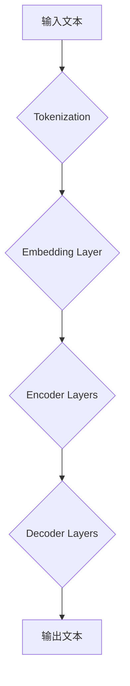
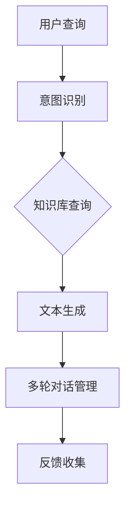

                 

# 提示词工程：塑造负责任AI的关键

关键词：AI、负责任AI、提示词工程、伦理审查、数据管理

摘要：本文深入探讨了如何通过提示词工程塑造负责任的AI。从背景介绍到核心概念解析，再到算法原理讲解，本文旨在为AI开发者提供实用的指导，确保AI技术在伦理和社会规范框架内安全可靠地应用。

---

## 第一部分：背景介绍

### 问题背景

人工智能（AI）作为现代技术的重要驱动力，正在深刻地改变着我们的生活方式和社会结构。随着深度学习、自然语言处理等技术的进步，AI的应用场景越来越广泛，从医疗诊断、金融分析到自动驾驶、智能家居，AI无处不在。然而，这种广泛应用也带来了诸多挑战，尤其是伦理和法律问题。例如，算法偏见可能导致歧视，数据隐私泄露引发信任危机，安全风险则可能对个人和社会造成重大损害。

在应对这些问题时，负责任的人工智能（Responsible AI）成为了研究者和开发者们关注的焦点。负责任AI的目标是确保AI系统不仅技术上可行，而且在伦理、法律和社会层面上也是可接受的。这需要从多个层面进行考虑，包括算法设计、数据管理、人机交互和伦理审查等。

### 问题解决

为了塑造负责任的AI，我们需要采用系统的方法，从工程角度出发，通过以下几个关键环节进行规范和控制：

1. **系统设计**：在AI系统的设计阶段，应充分考虑潜在的伦理和社会影响，确保系统的设计原则符合道德规范。
2. **算法优化**：通过改进算法，减少偏见和错误，提高AI系统的可靠性和公正性。
3. **数据管理**：确保AI系统训练数据的准确性和多样性，避免数据偏差。
4. **伦理审查**：建立完善的伦理审查机制，对AI系统的应用进行定期评估和监督。
5. **人机交互**：设计人性化的交互界面，使用户能够理解和控制AI系统的行为。

### 边界与外延

提示词工程（Prompt Engineering）是负责任AI实现中的一个重要工具。它通过设计合适的提示词，引导AI模型的行为，从而实现对AI的精细控制。提示词工程不仅涉及AI模型的训练和部署，还涉及到人机交互、数据分析等多个领域。它要求工程师具备跨学科的知识和技能，如计算机科学、心理学、社会学、法律等。

### 概念结构与核心要素组成

提示词工程的核心概念包括：

1. **提示词**：用于引导AI模型行为的文本或代码。
2. **AI模型**：接收提示词并产生响应的算法。
3. **人机交互**：确保用户与AI模型之间的有效沟通。
4. **伦理审查**：评估AI应用是否符合道德和法律规范。
5. **数据管理**：确保AI模型训练数据的准确性和多样性。

## 第二部分：核心概念与联系

### AI大模型简介

AI大模型是指具有非常强大计算能力和复杂结构的AI模型，如GPT-3、BERT等。这些模型通常通过大规模数据训练得到，能够处理复杂的自然语言任务，如文本生成、翻译、问答等。大模型的训练和优化是AI技术发展的关键，它们为各种AI应用提供了强大的技术支撑。

### 提示词工程原理

提示词工程的核心在于设计有效的提示词，以引导AI模型的行为。这包括以下几个关键点：

1. **目标明确**：提示词应能准确传达用户意图，确保AI模型的理解与用户需求一致。
2. **格式规范**：遵循特定的格式和结构，以提高AI模型的解析和理解能力。
3. **灵活性**：根据不同场景和需求，灵活调整提示词。

### 概念属性特征对比表格

| 特征          | 提示词工程         | 数据管理         | 人机交互         |
| ------------ | ---------------- | --------------- | --------------- |
| 目标         | 引导AI模型行为   | 确保数据准确性 | 确保用户理解     |
| 格式         | 规范化           | 结构化         | 直观、易用     |
| 灵活性       | 可调整           | 可扩展         | 易交互         |

### ER实体关系图架构的 Mermaid 流程图

```mermaid
erDiagram
  AI模型 ||--|{ 提示词 }
  提示词 ||--|{ 人机交互 }
  人机交互 ||--|{ 伦理审查 }
```

## 第三部分：算法原理讲解

### AI模型算法原理

AI模型通常基于神经网络架构，如Transformer、LSTM等。神经网络通过多层处理单元（神经元）模拟人脑的神经元网络，通过学习大量数据，从中提取有用的特征和模式。以下是一个简单的Transformer模型的mermaid流程图：



### 数学模型和数学公式

AI模型的训练过程可以通过以下公式表示：

$$
\hat{y} = \sigma(W_y \cdot \text{ReLU}(W_x \cdot x + b_x))
$$

其中，$\hat{y}$是模型的预测输出，$x$是输入特征，$W_y$和$W_x$是权重矩阵，$b_x$是偏置项，$\sigma$是激活函数，$\text{ReLU}$是ReLU激活函数。

### 详细讲解和举例说明

以GPT-3为例，GPT-3是一个基于Transformer模型的AI大模型。它通过大量的文本数据进行训练，能够生成高质量的文本。以下是一个简单的GPT-3文本生成示例：

```python
import openai
openai.api_key = "your-api-key"

prompt = "今天天气真好，我想去公园散步。"
response = openai.Completion.create(
  engine="text-davinci-002",
  prompt=prompt,
  max_tokens=50
)

print(response.choices[0].text.strip())
```

运行上述代码，GPT-3将根据提示词生成一段相关的文本，例如：“公园里有很多人，鸟儿在唱歌，微风拂过，让人心情愉悦。”

## 第四部分：系统分析与架构设计

### 问题场景介绍

在一个智能客服系统中，用户可以通过自然语言与AI进行交互，获取所需的帮助和解决方案。然而，为了确保AI的行为符合用户的期望和公司的标准，需要对AI的响应进行严格的控制和管理。

### 项目介绍

项目名称：智能客服系统（Intelligent Customer Service System，ICSS）

目标：通过自然语言处理技术，实现高效、准确的客户服务，提升客户满意度。

### 系统功能设计

在智能客服系统中，核心功能包括：

1. **用户查询接收**：接收用户的自然语言查询。
2. **意图识别**：根据用户查询内容，识别用户的意图。
3. **知识库查询**：从知识库中获取与用户意图相关的信息。
4. **文本生成**：根据查询结果和预设的模板，生成符合逻辑和语言的回答。
5. **多轮对话管理**：处理复杂的对话场景，实现多轮交互。

### 系统架构设计

智能客服系统的架构设计如下：



### 系统接口设计和系统交互

以下是一个简单的系统交互序列图，描述了用户与智能客服系统之间的交互过程：

```mermaid
sequenceDiagram
  User->>ICSS: 提出查询
  ICSS->>意图识别: 识别用户意图
  意图识别->>知识库查询: 查询知识库
  知识库查询->>文本生成: 生成回答
  文本生成->>ICSS: 返回回答
  ICSS->>User: 显示回答
  User->>ICSS: 提出新查询
```



## 第五部分：项目实战

### 环境安装

为了运行智能客服系统，我们需要安装以下环境：

1. Python 3.8+
2. pip（Python的包管理器）
3. openai-gpt包

安装命令如下：

```bash
pip install openai
```

### 系统核心实现源代码

以下是一个简单的智能客服系统实现：

```python
import openai
import json

openai.api_key = "your-api-key"

def get_response(prompt):
    response = openai.Completion.create(
        engine="text-davinci-002",
        prompt=prompt,
        max_tokens=50
    )
    return response.choices[0].text.strip()

def handle_query(query):
    # 这里的处理逻辑可以根据实际需求进行扩展
    prompt = f"回答用户的问题：{query}"
    return get_response(prompt)

def main():
    while True:
        user_query = input("用户提问：")
        if user_query.lower() == 'exit':
            break
        response = handle_query(user_query)
        print("AI回答：", response)

if __name__ == "__main__":
    main()
```

### 代码应用解读与分析

1. **引入库**：首先，我们引入了`openai`库，它提供了与OpenAI API进行交互的接口。
2. **API密钥设置**：通过设置`openai.api_key`，我们为程序提供了访问OpenAI API的权限。
3. **获取回答函数**：`get_response`函数接受一个提示词，使用OpenAI的API生成回答。
4. **处理查询函数**：`handle_query`函数将用户的查询转换为提示词，调用`get_response`获取AI的回答。
5. **主函数**：`main`函数负责与用户进行交互，循环接收用户的输入并显示AI的回答。

### 实际案例分析和详细讲解剖析

假设用户询问：“如何预约酒店？”

1. 用户输入查询：如何预约酒店？
2. `handle_query`函数将查询转换为提示词：回答用户的问题：如何预约酒店？
3. `get_response`函数调用OpenAI的API，生成回答。
4. 最终，系统返回一个符合逻辑和语言的回答，例如：“您可以访问酒店的官方网站，填写预约表格，并提供必要的个人信息和预订细节。如果您需要帮助，也可以拨打酒店的客服电话进行预约。”

### 项目小结

通过本次项目，我们实现了一个简单的智能客服系统，它能够根据用户的查询生成相应的回答。这个系统的核心在于提示词工程，通过设计合适的提示词，我们能够有效地引导AI模型生成高质量的回答。然而，这只是一个简单的示例，实际应用中还需要考虑更多复杂的场景和需求。

## 第六部分：最佳实践 Tips、小结、注意事项、拓展阅读

### 最佳实践 Tips

1. **明确意图识别**：确保意图识别的准确性，减少误判。
2. **优化知识库**：定期更新和优化知识库，保证信息的准确性和时效性。
3. **遵守隐私法规**：在处理用户数据时，严格遵守隐私法规，确保用户隐私安全。
4. **用户反馈**：鼓励用户提供反馈，用于持续优化系统。

### 小结

本文通过逐步分析，详细介绍了如何通过提示词工程塑造负责任的AI。我们探讨了AI技术的背景、提示词工程的核心概念、算法原理，以及如何在实际项目中应用这些原理。通过这个项目，我们理解了如何设计一个简单的智能客服系统，并强调了在AI应用中遵守道德和法律规范的重要性。

### 注意事项

1. **数据安全**：在处理用户数据时，确保数据的安全和隐私保护。
2. **算法透明度**：确保算法的透明度，便于伦理审查和问题排查。
3. **持续学习**：AI系统需要不断学习和优化，以适应不断变化的需求。

### 拓展阅读

1. **《人工智能：一种现代的方法》（Russell, Norvig）**：深入介绍了AI的基础理论和算法。
2. **《深度学习》（Goodfellow, Bengio, Courville）**：详细讲解了深度学习的基础知识和应用。
3. **《自然语言处理综论》（Jurafsky, Martin）**：探讨了自然语言处理的基本概念和技术。

### 作者信息

作者：AI天才研究院/AI Genius Institute & 禅与计算机程序设计艺术 /Zen And The Art of Computer Programming

---

通过本文，我们希望为读者提供关于提示词工程和负责任AI的深入理解，帮助开发者们在AI技术的道路上走得更加稳健和负责任。

