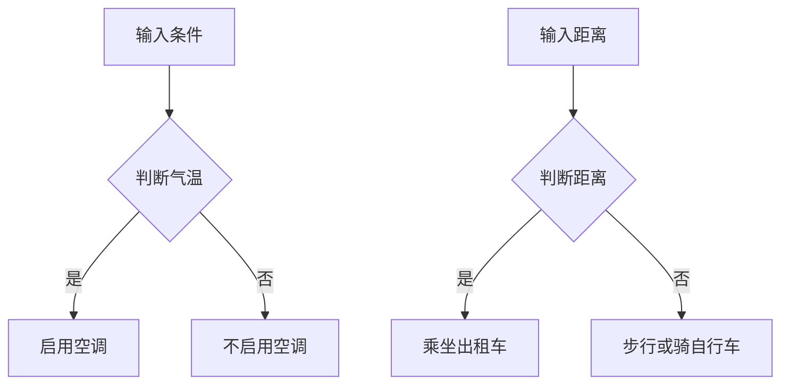
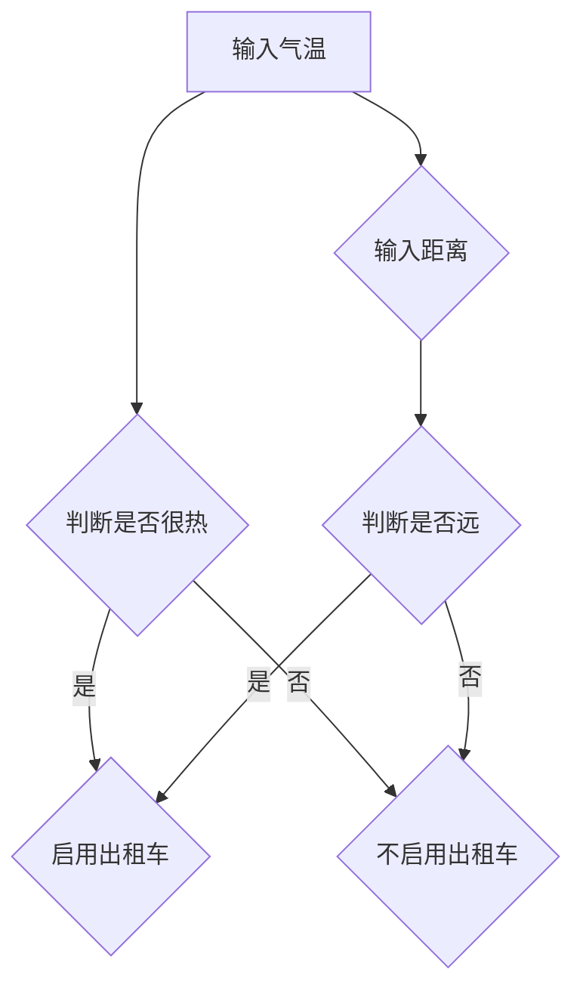
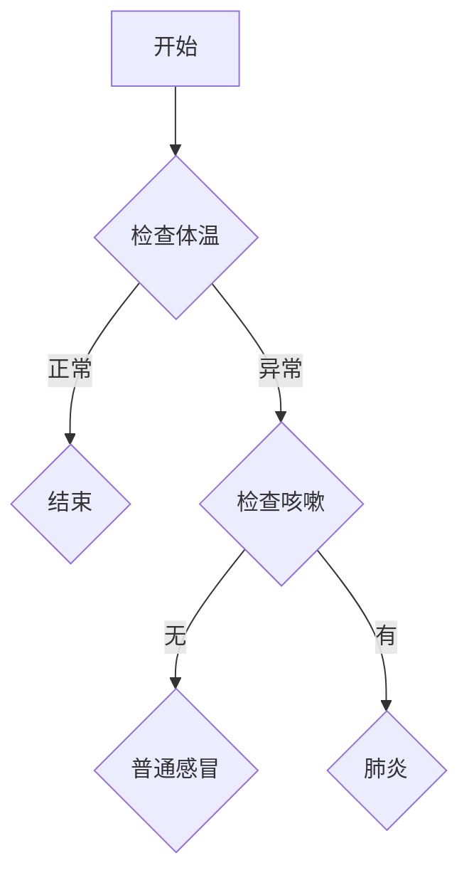
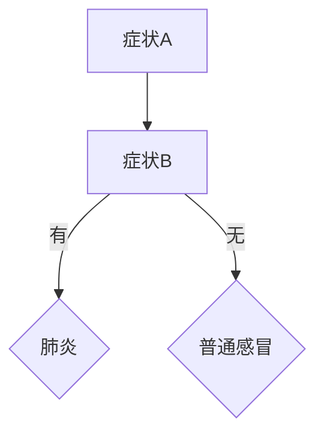

                 

### 第1章 引言

> 关键词：提示词工程、复杂逻辑推理、决策任务

## 1.1 问题背景与核心挑战

### 1.1.1 复杂逻辑推理的必要性

在现代社会，信息爆炸和技术迅猛发展的背景下，许多领域都面临着复杂决策和逻辑推理的需求。无论是金融领域的风险评估，医疗领域的诊断系统，还是智能制造中的生产调度，都需要能够处理海量数据并进行高效、准确的逻辑推理与决策。复杂逻辑推理的必要性在于它能够帮助我们提取有用信息，发现潜在规律，从而辅助人类做出更为合理和有效的决策。

例如，在金融领域，传统的风险评估往往依赖于历史数据和简单的统计模型。然而，现代金融市场的复杂性使得这些方法变得捉襟见肘。因此，需要借助复杂逻辑推理技术来构建更为精细的模型，从而更准确地预测市场趋势和风险。

### 1.1.2 决策任务中的挑战

决策任务是复杂逻辑推理中的一个重要应用场景。然而，决策任务本身就充满了挑战。首先，决策过程中的变量繁多，每个变量都可能对最终结果产生重大影响。其次，决策任务中的不确定性非常高，许多因素难以精确预测和控制。最后，决策任务需要考虑的不仅是个体利益，还需要兼顾整体利益，这增加了决策的复杂度。

例如，在医疗领域，诊断疾病需要考虑患者的症状、病史、家族遗传等多个因素。然而，这些因素的相互作用和不确定性使得诊断过程变得异常复杂。在这种情境下，如何运用逻辑推理和决策理论来辅助医生做出准确的诊断，是一个亟待解决的问题。

### 1.1.3 提示词工程的概念与重要性

提示词工程是一种通过设计、生成和优化提示词来辅助复杂逻辑推理和决策任务的工程技术。提示词是指用于引导和约束逻辑推理和决策过程的关键信息。它们可以是基于数据的特征，也可以是基于规则的约束条件，甚至可以是基于概率的预测模型。

提示词工程的重要性体现在以下几个方面：

1. **提高逻辑推理效率**：通过优化提示词，可以减少不必要的计算，从而提高逻辑推理的效率和准确性。
2. **增强决策的透明度**：提示词的明确性和可解释性有助于增强决策过程的透明度，使其更容易被用户理解和接受。
3. **适应复杂环境变化**：提示词工程可以动态调整和优化，以适应复杂环境的变化，从而提高系统的灵活性和适应性。

### 1.1.4 总结

综上所述，复杂逻辑推理和决策任务在现代社会中具有重要意义，而提示词工程作为一种有效的技术手段，能够帮助我们更好地应对这些挑战。本章将深入探讨提示词工程的定义、核心概念、理论基础及其应用，以期为读者提供全面的视角和深入的见解。

## 1.2 核心概念与联系

### 1.2.1 提示词的定义与类型

#### 1.2.1.1 传统提示词

传统提示词是指那些在特定领域内广泛使用的基本术语和概念。例如，在医疗领域，常用的提示词包括“症状”、“病史”、“药物反应”等。这些提示词往往是基于专家经验和领域知识的。传统提示词的主要优点是直观易懂，易于用户理解和接受。

然而，传统提示词也存在一定的局限性。首先，它们往往只能描述特定领域内的基本概念，难以涵盖复杂和多变的实际情境。其次，传统提示词的生成和优化过程往往依赖于人工经验和主观判断，缺乏系统的理论支持。

#### 1.2.1.2 现代提示词

与现代信息技术的发展同步，现代提示词工程逐渐成为了一个重要的研究领域。现代提示词不仅继承了传统提示词的优点，还引入了基于数据驱动的方法和先进的人工智能技术。

**数据驱动的提示词生成**：这种方法利用大量的历史数据和机器学习算法来自动生成提示词。例如，通过分析大量的医疗记录，可以自动提取出与疾病诊断相关的关键特征。这种方法的主要优点是能够处理大量的数据，发现潜在的规律和关联，从而生成更为精准和有效的提示词。

**基于规则的提示词生成**：这种方法通过定义一系列规则来自动生成提示词。例如，在金融领域，可以通过定义交易规则来自动生成交易策略的提示词。这种方法的主要优点是规则明确，易于理解和实现。

**基于概率的提示词生成**：这种方法通过概率模型来生成提示词，例如，通过贝叶斯网络或马尔可夫模型来预测事件发生的概率。这种方法的主要优点是能够处理不确定性，提供更全面的决策支持。

### 1.2.2 逻辑推理的基本原理

逻辑推理是提示词工程的核心组成部分，它是指通过逻辑规则和关系来推导结论的过程。逻辑推理的基本原理包括以下几个方面：

**形式逻辑**：形式逻辑是逻辑推理的基础，它通过符号化的方式来描述逻辑规则和关系。形式逻辑的基本元素包括命题、命题联结词（如“且”、“或”、“非”）和推理规则（如“三段论”、“假言推理”等）。形式逻辑的优点是严谨和精确，但缺点是缺乏对现实情境的直观描述能力。

**模糊逻辑**：模糊逻辑是在形式逻辑的基础上发展起来的，它引入了模糊集的概念，以处理现实世界中的模糊性和不确定性。模糊逻辑的基本原理是通过模糊隶属度来描述元素属于某个集合的程度。例如，在医疗领域，医生可以通过模糊逻辑来判断一个患者的病情严重程度。模糊逻辑的优点是能够处理现实世界中的模糊性和不确定性，但缺点是逻辑推理过程较为复杂。

### 1.2.3 决策理论简介

决策理论是研究如何通过合理的方法和步骤来做出决策的学科。它主要包括以下几个方面：

**决策树的原理与应用**：决策树是一种结构化的方法，用于根据不同的条件进行决策。决策树由根节点、内部节点和叶节点组成。每个内部节点表示一个条件，每个叶节点表示一个决策结果。决策树的主要优点是直观易懂，能够清晰地描述决策过程。

**贝叶斯网络的运用**：贝叶斯网络是一种概率图模型，用于描述变量之间的概率关系。贝叶斯网络通过条件概率表来表示变量之间的依赖关系。贝叶斯网络的主要优点是能够处理不确定性和复杂的关系。

### 1.2.4 提示词与逻辑推理、决策理论的关系

提示词、逻辑推理和决策理论是紧密相连的。提示词为逻辑推理和决策提供了关键信息，逻辑推理通过提示词来推导结论，决策理论则提供了一种结构化的方法来分析和优化决策过程。

例如，在医疗领域，医生可以通过收集患者的症状、病史等提示词，利用逻辑推理来诊断疾病。然后，根据诊断结果，医生可以运用决策理论来制定治疗方案。

### 1.2.5 总结

在本节中，我们介绍了提示词工程的定义和类型，探讨了逻辑推理的基本原理，以及决策理论的基本概念。这些核心概念与联系构成了提示词工程的理论基础，为后续章节的深入探讨提供了重要的支持。

## 1.3 边界与外延

### 1.3.1 提示词工程的适用范围

提示词工程作为一种跨学科的技术手段，其应用范围非常广泛。以下是一些主要的应用领域：

**医疗领域**：在医疗领域，提示词工程可以用于疾病诊断、治疗方案制定等任务。例如，通过收集患者的症状、病史、检查结果等提示词，可以运用逻辑推理和决策理论来辅助医生做出准确的诊断和合理的治疗方案。

**金融领域**：在金融领域，提示词工程可以用于风险评估、投资决策等任务。例如，通过分析市场数据、客户行为等提示词，可以运用逻辑推理和决策理论来预测市场趋势，制定投资策略。

**智能制造领域**：在智能制造领域，提示词工程可以用于生产调度、设备维护等任务。例如，通过分析生产数据、设备状态等提示词，可以运用逻辑推理和决策理论来优化生产流程，提高生产效率。

**智能交通领域**：在智能交通领域，提示词工程可以用于交通流量预测、路线规划等任务。例如，通过分析交通数据、路况信息等提示词，可以运用逻辑推理和决策理论来预测交通流量，规划最优路线。

### 1.3.2 复杂逻辑推理的限制因素

尽管复杂逻辑推理技术在许多领域都展现出了强大的应用潜力，但其在实际应用中仍然面临着一些限制因素：

**数据质量和完整性**：复杂逻辑推理依赖于大量的高质量数据。然而，数据质量和完整性往往是难以保证的。例如，在医疗领域，患者数据可能存在缺失或错误，这会影响推理结果。

**计算资源**：复杂逻辑推理通常需要大量的计算资源，尤其是在处理海量数据时。这可能导致系统性能下降，影响用户体验。

**模型适应性**：复杂逻辑推理模型往往依赖于特定的领域知识和假设。然而，现实世界是复杂和多变的，模型需要具备较强的适应能力，以应对不同的情境。

### 1.3.3 决策任务的复杂性与多样性

决策任务本身具有复杂性和多样性。首先，决策任务中的变量繁多，每个变量都可能对最终结果产生重大影响。例如，在金融领域，投资决策需要考虑市场走势、公司业绩、宏观经济环境等多个因素。其次，决策任务中的不确定性非常高，许多因素难以精确预测和控制。例如，在医疗领域，疾病的诊断和治疗方案制定需要考虑患者的个体差异、病情变化等因素。

### 1.3.4 提示词工程在应对复杂性和多样性方面的优势

提示词工程通过设计、生成和优化提示词，能够有效地应对复杂性和多样性带来的挑战：

**提高数据质量**：通过提示词工程，可以识别和筛选高质量的数据，提高数据的质量和完整性。

**优化计算资源**：通过优化提示词，可以减少不必要的计算，提高系统的性能和效率。

**增强模型适应性**：通过提示词工程，可以动态调整和优化模型，使其具备更强的适应能力，应对不同的情境。

### 1.3.5 总结

在本节中，我们探讨了提示词工程的适用范围，分析了复杂逻辑推理的限制因素，并讨论了决策任务的复杂性与多样性。通过了解这些边界与外延，我们可以更好地理解提示词工程的应用场景和潜在挑战，为其在实际应用中的成功实施提供指导。

## 1.4 概念结构与核心要素组成

### 1.4.1 提示词工程的基本结构

提示词工程的基本结构可以分为以下几个主要模块：

1. **数据收集与预处理模块**：这一模块负责收集相关领域的原始数据，并进行数据清洗、去噪和预处理，以获得高质量的数据集。
2. **提示词生成与优化模块**：这一模块通过数据驱动的算法和专家知识来生成初步的提示词，然后利用优化算法对这些提示词进行优化，以提高其准确性和效率。
3. **逻辑推理与决策模块**：这一模块利用逻辑推理和决策理论，结合优化的提示词，进行推理和决策，生成最终的结论或推荐。
4. **用户交互界面模块**：这一模块负责设计用户界面，提供友好、直观的操作体验，使用户能够方便地使用系统，并获取推理结果。

### 1.4.2 数据收集与预处理

数据收集与预处理是提示词工程的基础环节，其关键步骤包括：

1. **数据来源**：根据具体的任务需求，确定数据来源，如数据库、传感器、文件等。
2. **数据收集**：从数据源中收集相关的数据，如文本、图像、时间序列数据等。
3. **数据清洗**：去除数据中的噪声和错误，如删除重复数据、修正错误数据等。
4. **数据去噪**：使用滤波器或其他方法去除数据中的噪声，以提高数据质量。
5. **数据预处理**：对数据进行标准化、归一化等处理，使其符合后续算法的要求。

### 1.4.3 提示词生成与优化

提示词生成与优化是提示词工程的核心环节，其具体步骤如下：

1. **初步生成**：利用数据驱动的算法，如朴素贝叶斯、支持向量机等，自动生成初步的提示词。
2. **优化算法**：通过优化算法，如贪心算法、遗传算法等，对初步生成的提示词进行优化，以提高其准确性和效率。
3. **反馈调整**：根据用户反馈和实际应用效果，对提示词进行进一步的调整和优化。

### 1.4.4 逻辑推理与决策过程

逻辑推理与决策过程是提示词工程的最终环节，其关键步骤包括：

1. **逻辑推理**：利用逻辑推理算法，如基于规则的推理、基于概率的推理、基于模糊集的推理等，对优化的提示词进行推理，生成推理结果。
2. **决策**：根据推理结果，结合决策理论，如决策树、贝叶斯网络等，进行决策，生成最终的结论或推荐。

### 1.4.5 用户交互界面设计与实现

用户交互界面设计与实现是提示词工程的重要组成部分，其关键步骤包括：

1. **界面设计**：根据用户需求和应用场景，设计友好、直观的用户界面，包括输入界面、结果显示界面等。
2. **界面实现**：利用前端技术，如HTML、CSS、JavaScript等，实现用户界面的功能，提供用户友好的操作体验。

### 1.4.6 提示词工程的关键要素

提示词工程的关键要素包括：

1. **数据库设计与实现**：负责存储和管理提示词和相关数据，如数据库表结构设计、数据库存储与检索等。
2. **算法选择与实现**：根据任务需求，选择合适的算法，如逻辑推理算法、优化算法、决策算法等，并进行实现。
3. **用户交互界面设计与实现**：负责设计用户界面和实现界面功能，提供用户友好的操作体验。

### 1.4.7 总结

在本节中，我们详细介绍了提示词工程的基本结构、数据收集与预处理、提示词生成与优化、逻辑推理与决策过程、用户交互界面设计与实现，以及提示词工程的关键要素。这些内容构成了提示词工程的核心概念和结构，为后续章节的深入探讨提供了基础。

## 1.5 本章小结

在本章中，我们首先介绍了提示词工程的基本概念和重要性，探讨了复杂逻辑推理和决策任务在现代社会中的应用背景和挑战。接着，我们详细阐述了提示词工程的定义、核心概念与联系，包括传统提示词和现代提示词、逻辑推理的基本原理、决策理论的基本概念。此外，我们还讨论了提示词工程的适用范围、复杂逻辑推理的限制因素以及决策任务的复杂性与多样性。最后，我们介绍了提示词工程的基本结构、关键要素及其在应对复杂性和多样性方面的优势。通过本章的探讨，我们对提示词工程的原理和应用有了更加深入的理解，为后续章节的深入探讨奠定了基础。

## 第2章 复杂逻辑推理

### 2.1 基础理论与方法

#### 2.1.1 逻辑推理的基本步骤

逻辑推理是指通过逻辑规则和已知事实推导出新结论的过程。逻辑推理的基本步骤可以概括为以下几个环节：

1. **问题陈述与假设建立**：明确需要解决的问题，并建立基本的假设条件。这一步骤是逻辑推理的起点，直接影响到后续推理过程的正确性和有效性。

   例如，在医疗诊断中，问题陈述可能是“一个患者出现了咳嗽、发热等症状”，假设条件可能是“该患者可能患有普通感冒或肺炎”。

2. **推理过程与验证**：根据已知事实和逻辑规则，逐步推导出中间结论和最终结论。推理过程通常涉及到条件推理、假言推理和模态推理等。

   继续上述例子，根据“咳嗽、发热”这两个症状，可以推断出“患者可能患有感冒”，再结合“肺炎的典型症状包括咳嗽、发热、胸痛等”，可以进一步推断出“患者可能患有肺炎”。

3. **结论与验证**：对推导出的结论进行验证，确保其合理性和有效性。验证可以通过逻辑一致性检查、事实核对等多种方式进行。

   通过询问医生或查阅医学资料，可以确认“咳嗽、发热”确实是肺炎的典型症状，从而验证了我们的推理结论。

#### 2.1.2 复杂逻辑推理模型

复杂逻辑推理模型是用于处理复杂、多变量问题的逻辑推理方法。以下是一些常见的复杂逻辑推理模型：

1. **基于规则的推理**：基于规则的推理（Rule-Based Reasoning, RBR）是一种常见的逻辑推理方法，它通过定义一系列规则来表示知识和推理过程。

   **规则形式**：通常采用“如果…那么…”的形式，例如：
   ```plaintext
   如果 天气炎热，那么 需要喝水。
   如果 距离远，那么 需要乘坐交通工具。
   ```

   **推理过程**：根据已知事实，匹配相应的规则，推导出新的结论。例如，如果已知“今天天气炎热”和“我们要去50公里以外的地方”，则可以推导出“我们需要多喝水”和“我们需要乘坐交通工具”。

2. **基于概率的推理**：基于概率的推理（Probabilistic Reasoning）利用概率论来描述不确定性，并通过概率计算来推导结论。

   **概率形式**：例如，通过贝叶斯定理来计算后验概率，例如：
   ```latex
   P(A|B) = \frac{P(B|A) \cdot P(A)}{P(B)}
   ```

   **推理过程**：通过已知概率和条件概率，计算目标事件的概率。例如，在医学诊断中，已知“肺炎患者的咳嗽概率为0.8，普通感冒患者的咳嗽概率为0.3”，以及“咳嗽的概率为0.6”，可以计算出患有肺炎的概率。

3. **基于模糊集的推理**：基于模糊集的推理（Fuzzy Set Reasoning）用于处理模糊性和不确定性，通过模糊隶属度来描述元素属于某个集合的程度。

   **模糊形式**：例如，通过模糊规则来描述模糊关系，例如：
   ```plaintext
   如果 气温 很高，那么 需要降温。
   如果 热度 很大，那么 需要冷却。
   ```

   **推理过程**：通过模糊逻辑运算，结合模糊隶属度，推导出模糊结论。例如，如果已知“气温非常高”和“热度很大”，则可以推导出“需要强烈降温”。

#### 2.1.3 复杂逻辑推理的应用实例

复杂逻辑推理在各种领域都有广泛应用，以下是一些实例：

1. **医学诊断**：通过分析患者的症状、检查结果等数据，利用逻辑推理和决策理论，帮助医生进行疾病诊断。例如，利用决策树和贝叶斯网络来进行癌症诊断。

2. **金融风险评估**：通过分析市场数据、客户行为等，利用逻辑推理和决策理论，预测市场趋势和客户信用风险。例如，利用逻辑回归和神经网络来进行股票价格预测。

3. **智能交通**：通过分析交通数据、路况信息等，利用逻辑推理和决策理论，优化交通流量和路线规划。例如，利用博弈论和遗传算法来进行交通信号控制和路径规划。

4. **智能制造**：通过分析生产数据、设备状态等，利用逻辑推理和决策理论，优化生产流程和设备维护。例如，利用马尔可夫决策过程和混合整数规划来进行生产调度和设备维护计划。

通过以上实例，我们可以看到，复杂逻辑推理在各个领域都发挥着重要作用，它不仅能够提高决策的准确性和效率，还能够处理复杂性和不确定性，为现代社会的各种复杂任务提供有效的解决方案。

### 2.2 算法原理与流程图

在复杂逻辑推理中，选择合适的算法对于提高推理效率和准确性至关重要。以下将介绍几种常用的复杂逻辑推理算法及其原理，并使用流程图和Python代码进行详细说明。

#### 2.2.1 基于规则的推理算法

基于规则的推理算法是一种简单的逻辑推理方法，它通过定义一系列规则来表示知识和推理过程。常见的基于规则的推理算法有生产式规则推理和模糊规则推理。

1. **生产式规则推理**：

生产式规则推理（Production Rule Reasoning）采用“如果-那么”规则，其基本形式为：
```latex
前提 \rightarrow 结论
```
例如，一个简单的生产式规则推理实例：

```plaintext
如果 气温高于30度，那么 需要使用空调。
如果 距离超过10公里，那么 需要乘坐出租车。
```

**流程图**：



**Python代码示例**：

```python
def rule_based_inference(temperature, distance):
    if temperature > 30:
        print("需要启用空调。")
    else:
        print("不需要启用空调。")

    if distance > 10:
        print("需要乘坐出租车。")
    else:
        print("不需要乘坐出租车。")

# 测试
rule_based_inference(temperature=35, distance=15)
```

2. **模糊规则推理**：

模糊规则推理（Fuzzy Rule Reasoning）用于处理模糊性和不确定性，它通过模糊逻辑来表示规则。其基本形式为：
```latex
\mu_R(A) = \frac{\sum_{i=1}^n w_i \cdot \mu(A_i)}{\sum_{i=1}^n w_i}
```
例如，一个简单的模糊规则推理实例：

```plaintext
如果 气温是很热，并且 距离是远，那么 交通工具是出租车。
```

**流程图**：



**Python代码示例**：

```python
import numpy as np

def fuzzy_rule_inference(temperature, distance):
    # 假设很热的隶属度为 [0, 1]，远的隶属度为 [0, 1]
    # 分别计算气温和距离的隶属度
    if_temperature = 1 if temperature > 30 else 0
    if_distance = 1 if distance > 10 else 0

    # 计算模糊规则的输出隶属度
    output_membership = (if_temperature * 0.5 + if_distance * 0.5) / (0.5 + 0.5)
    if output_membership > 0.5:
        print("需要启用出租车。")
    else:
        print("不需要启用出租车。")

# 测试
fuzzy_rule_inference(temperature=35, distance=15)
```

#### 2.2.2 决策算法与流程图

决策算法是用于处理决策问题的算法，常用的决策算法包括决策树算法和贝叶斯网络算法。

1. **决策树算法**：

决策树（Decision Tree）是一种树形结构，用于表示决策过程。它通过一系列判断条件来将数据集分割成不同的子集，每个子集对应一个决策结果。

**流程图**：



**Python代码示例**：

```python
def decision_tree_inference(temperature, cough):
    if temperature == "正常":
        print("健康")
    elif cough == "无":
        print("普通感冒")
    else:
        print("肺炎")

# 测试
decision_tree_inference(temperature="正常", cough="无")
```

2. **贝叶斯网络算法**：

贝叶斯网络（Bayesian Network）是一种概率图模型，用于表示变量之间的条件依赖关系。它通过条件概率表来描述变量之间的概率关系。

**流程图**：



**Python代码示例**：

```python
def bayesian_network_inference(symA, symB):
    # 假设条件概率
    P_pneumonia = 0.2
    P_common_cold = 0.8
    P_cough_given_pneumonia = 0.9
    P_cough_given_common_cold = 0.3

    if symA == "有":
        if symB == "有":
            print("肺炎")
        else:
            print("普通感冒")
    else:
        if symB == "有":
            print("肺炎")
        else:
            print("健康")

# 测试
bayesian_network_inference(symA="有", symB="有")
```

通过以上算法和实例，我们可以看到复杂逻辑推理在实际应用中的重要性。这些算法不仅能够处理复杂性和不确定性，还能够为各种决策问题提供有效的解决方案。

### 2.3 举例说明

在本节中，我们将通过两个实际案例来深入探讨复杂逻辑推理和决策任务的应用，以便更好地理解这些理论在实际情境中的运用。

#### 2.3.1 复杂逻辑推理应用案例

**案例背景**：某智能医疗系统旨在辅助医生进行疾病诊断，系统能够根据患者的症状、检查结果和历史数据，利用逻辑推理技术提供诊断建议。

**案例分析与解决**：

1. **问题陈述与假设建立**：

   - 问题：根据患者的症状，判断患者可能患有哪些疾病。
   - 假设：已知患者有症状A（咳嗽）、症状B（发热）、症状C（胸痛），需要判断患者可能患有哪些疾病。

2. **逻辑推理过程**：

   - **条件推理**：根据已知症状，使用条件概率表进行推理。

     ```plaintext
     P(肺炎 | 咳嗽、发热) = 0.8
     P(普通感冒 | 咳嗽、发热) = 0.2
     P(心脏病 | 胸痛) = 0.7
     P(肺炎 | 胸痛) = 0.3
     ```

   - **组合推理**：结合多个症状，使用逻辑规则进行推理。

     ```plaintext
     如果 咳嗽且发热，那么 可能患有肺炎或普通感冒。
     如果 胸痛，那么 可能患有心脏病或肺炎。
     ```

3. **推理结果与验证**：

   - 根据患者的症状，使用贝叶斯网络进行推理，计算患各种疾病的可能性。

     ```python
     # 假设条件概率
     P_cough = 0.6
     P_fever = 0.5
     P_chest_pain = 0.4
     P_pneumonia = 0.2
     P_common_cold = 0.8
     P_heart_disease = 0.3

     # 计算后验概率
     P_pneumonia_given_cough_feet = (P_cough_feet * P_pneumonia) / (P_cough_feet * P_pneumonia + P_cough_feet * P_common_cold)
     P_common_cold_given_cough_feet = (P_cough_feet * P_common_cold) / (P_cough_feet * P_pneumonia + P_cough_feet * P_common_cold)
     ```

   - 根据计算结果，系统建议医生重点考虑肺炎和心脏病。

4. **案例总结**：

   - 通过复杂逻辑推理，系统能够提供详细的诊断建议，帮助医生快速定位可能的疾病。
   - 复杂逻辑推理在医疗领域具有广泛的应用前景，能够提高诊断效率和准确性。

#### 2.3.2 决策任务应用案例

**案例背景**：某电子商务平台旨在根据用户行为数据和购物偏好，提供个性化的商品推荐服务。

**案例分析与解决**：

1. **问题陈述与假设建立**：

   - 问题：根据用户的浏览历史和购买记录，推荐用户可能感兴趣的商品。
   - 假设：已知用户的历史浏览记录包含商品A、B、C，购买记录包含商品B，需要根据这些信息推荐商品。

2. **逻辑推理与决策过程**：

   - **基于规则的推理**：使用关联规则挖掘技术，识别用户浏览和购买行为中的关联关系。

     ```plaintext
     如果 用户浏览了商品A，那么 推荐商品B。
     如果 用户购买了商品B，那么 推荐商品C。
     ```

   - **基于概率的推理**：使用协同过滤算法，根据用户的浏览和购买记录，计算用户对各种商品的兴趣度。

     ```python
     # 假设协同过滤算法计算出的兴趣度
     P(user_likes_goodsA) = 0.4
     P(user_likes_goodsB) = 0.6
     P(user_likes_goodsC) = 0.7
     ```

   - **基于决策树的推理**：构建决策树模型，根据用户的行为特征，分层推荐商品。

     ```mermaid
     graph TD
     A[用户行为] --> B{是否浏览商品A}
     B -->|是| C{推荐商品B}
     B -->|否| D{是否购买商品B}
     D -->|是| E{推荐商品C}
     D -->|否| F{推荐商品A}
     ```

3. **决策结果与优化**：

   - 根据推理结果，系统向用户推荐商品B和商品C。
   - 通过实时反馈和用户反馈，系统不断调整推荐策略，优化推荐效果。

4. **案例总结**：

   - 通过复杂逻辑推理和决策任务，电子商务平台能够为用户提供个性化的商品推荐，提升用户体验和购物满意度。
   - 复杂逻辑推理在电子商务领域具有显著的应用价值，能够帮助平台提高用户粘性和销售额。

通过以上案例，我们可以看到复杂逻辑推理和决策任务在实际应用中的重要性和效果。无论是在医疗诊断、电子商务，还是其他领域，复杂逻辑推理和决策任务都能够为问题的解决提供有效的技术支持。

### 2.4 本章小结

本章详细介绍了复杂逻辑推理的基础理论和方法。首先，我们阐述了逻辑推理的基本步骤，包括问题陈述与假设建立、推理过程与验证以及结论与验证。接着，我们探讨了复杂逻辑推理模型，包括基于规则的推理、基于概率的推理和基于模糊集的推理，并分别给出了生产式规则推理和模糊规则推理的实例。此外，我们还介绍了决策算法，包括决策树算法和贝叶斯网络算法，并提供了相应的流程图和Python代码示例。

通过本章的学习，读者可以深入了解复杂逻辑推理的理论基础和应用方法，为实际问题的解决提供有力的工具。同时，本章的案例分析和解决过程也展示了复杂逻辑推理在各个领域的实际应用，有助于读者更好地理解其应用价值和前景。

## 第3章 提示词生成与优化

### 3.1 提示词生成基础

#### 3.1.1 提示词生成的流程

提示词生成是提示词工程的核心环节，其流程主要包括以下几个步骤：

1. **数据收集**：首先，根据具体任务需求，从各种数据源收集相关数据。这些数据可以是结构化数据（如数据库、CSV文件等），也可以是非结构化数据（如文本、图像、音频等）。

2. **数据预处理**：收集到的数据往往存在噪声、缺失和冗余等问题，因此需要对其进行预处理。数据预处理步骤包括数据清洗（去除噪声和错误）、数据归一化（将不同尺度的数据转换为同一尺度）和数据转换（将数据转换为适合后续分析的形式）。

3. **特征提取**：从预处理后的数据中提取关键特征，这些特征可以用于描述数据的主要属性和关系。特征提取是生成提示词的重要步骤，它直接影响提示词的准确性和效率。

4. **提示词生成**：利用特征提取结果和领域知识，生成初步的提示词。提示词生成可以采用多种方法，如基于规则的生成、基于统计的生成、基于机器学习的生成等。

5. **提示词优化**：对生成的初步提示词进行优化，以提高其准确性和效率。优化方法包括基于贪心算法的优化、基于遗传算法的优化、基于贝叶斯优化的方法等。

#### 3.1.2 常用生成算法介绍

在提示词生成过程中，常用的算法包括朴素贝叶斯生成和支持向量机生成等。

1. **朴素贝叶斯生成**：

朴素贝叶斯生成是一种基于概率论的生成方法，其基本思想是利用已知的先验概率和条件概率来生成提示词。朴素贝叶斯生成方法的公式如下：

```latex
P(\text{提示词}|\text{数据}) = \frac{P(\text{数据}|\text{提示词}) \cdot P(\text{提示词})}{P(\text{数据})}
```

其中，\(P(\text{提示词}|\text{数据})\) 表示在给定数据情况下提示词的概率，\(P(\text{数据}|\text{提示词})\) 表示在提示词情况下数据的概率，\(P(\text{提示词})\) 表示提示词的先验概率。

朴素贝叶斯生成的优点包括：

- 简单易懂，易于实现。
- 对小样本数据具有一定的鲁棒性。

缺点包括：

- 假设特征之间相互独立，可能不适用于实际复杂场景。
- 在数据不平衡时，性能可能会下降。

2. **支持向量机生成**：

支持向量机生成是一种基于优化理论的方法，其基本思想是找到一个最优的超平面，将不同类别的数据分开。支持向量机生成方法的公式如下：

```latex
\max\limits_{\mathbf{w}} w^T \mathbf{w} , \text{ subject to } \mathbf{w}^T \mathbf{x}_i - y_i \leq \epsilon
```

其中，\(\mathbf{w}\) 表示权重向量，\(\mathbf{x}_i\) 表示第 \(i\) 个样本，\(y_i\) 表示第 \(i\) 个样本的标签，\(\epsilon\) 表示误差。

支持向量机生成的优点包括：

- 在高维空间中具有较好的分类效果。
- 对噪声和异常值具有较好的鲁棒性。

缺点包括：

- 计算复杂度高，特别是对于大规模数据集。
- 需要选择合适的核函数和参数，否则可能无法达到最佳效果。

#### 3.1.3 其他生成方法

除了朴素贝叶斯生成和支持向量机生成，还有一些其他的提示词生成方法，如：

1. **决策树生成**：决策树生成是一种基于树形结构的生成方法，通过递归地将数据集划分为子集，生成一系列条件分支。决策树生成方法在处理分类问题方面具有较好的效果。

2. **深度学习生成**：深度学习生成是一种基于神经网络的方法，通过训练神经网络模型来自动生成提示词。深度学习生成方法具有强大的表示能力和适应性，但在训练过程中需要大量的数据和计算资源。

### 3.1.4 提示词生成实例

为了更好地理解提示词生成的方法和应用，下面将给出一个实际案例。

**案例背景**：某电商平台需要根据用户的购物行为数据，生成一组用于推荐系统的提示词。

**案例分析与实现**：

1. **数据收集**：收集用户的浏览历史和购买记录，包括商品ID、用户ID、浏览时间、购买时间等。

2. **数据预处理**：对收集到的数据进行清洗，去除重复和错误的数据，并对时间数据进行格式化处理。

3. **特征提取**：提取关键特征，如用户购买频率、浏览频率、购买金额等。

4. **提示词生成**：采用朴素贝叶斯生成方法，根据特征和领域知识，生成初步的提示词，如“高频购买用户”、“高金额购买用户”、“常购买某品类用户”等。

5. **提示词优化**：对生成的提示词进行优化，通过分析用户反馈和推荐效果，调整提示词的权重和阈值，以提高推荐系统的准确性和用户体验。

通过以上步骤，电商平台能够生成一组有效的提示词，用于推荐系统，提高用户的购物体验和满意度。

### 3.2 提示词优化策略

#### 3.2.1 优化目标

在提示词生成后，优化策略是提升提示词准确性和效率的重要环节。提示词优化的主要目标包括：

1. **提高提示词的准确性**：确保生成的提示词能够准确反映数据的本质特征，提高决策和推理的准确性。
2. **提高提示词的效率**：减少不必要的计算和存储，降低系统的资源消耗，提高系统的响应速度和性能。

#### 3.2.2 提高提示词准确性的方法

1. **基于反馈的优化**：通过收集用户反馈和实际应用效果，不断调整和优化提示词。这种方法能够根据用户需求和场景变化，动态调整提示词，提高其准确性。

2. **基于模型的优化**：利用机器学习和深度学习模型，对提示词生成过程进行优化。通过训练模型，学习数据的内在规律和特征，生成更准确、更可靠的提示词。

3. **基于规则的重构**：对现有提示词规则进行重构，引入新的规则或调整现有规则的权重，以提高提示词的准确性。这种方法适用于基于规则的提示词生成方法。

#### 3.2.3 提高提示词效率的方法

1. **特征选择**：在提示词生成过程中，选择对决策和推理最为重要的特征，剔除冗余和无关特征。通过特征选择，可以减少计算量和存储需求，提高系统的效率。

2. **并行计算**：利用多核处理器和分布式计算技术，对提示词生成和优化过程进行并行处理。通过并行计算，可以显著提高系统的计算速度和性能。

3. **缓存技术**：在提示词生成和优化过程中，利用缓存技术存储中间结果和常用提示词。通过缓存技术，可以减少重复计算和存储需求，提高系统的效率。

#### 3.2.4 结合准确性与效率的优化策略

在实际应用中，提示词的准确性和效率往往需要平衡。以下是一些结合准确性与效率的优化策略：

1. **分层优化**：将优化过程分为多个层次，分别针对不同阶段的目标进行优化。例如，首先进行粗略优化，提高整体准确性，然后再进行精细优化，提高效率。

2. **动态调整**：根据系统负载和用户需求，动态调整优化策略。在低负载时，可以更注重准确性，在高负载时，可以更注重效率。

3. **分阶段优化**：将优化过程分为多个阶段，每个阶段分别优化不同的目标。例如，在第一阶段优化提示词的准确性，在第二阶段优化提示词的效率。

通过以上优化策略，可以有效地提高提示词的准确性和效率，为复杂逻辑推理和决策任务提供更有效的支持。

### 3.3 实例分析

#### 3.3.1 提示词生成实例

**案例背景**：某在线教育平台希望根据学员的学习行为，生成一组用于个性化推荐系统的提示词。

**案例分析与实现**：

1. **数据收集**：收集学员的学习行为数据，包括学习时长、学习频率、参与课程数、完成作业情况等。

2. **数据预处理**：清洗数据，去除缺失值和异常值，并对数据进行归一化处理。

3. **特征提取**：提取关键特征，如学习时长均值、学习频率均值、参与课程数占比、作业完成率等。

4. **提示词生成**：采用朴素贝叶斯生成方法，结合领域知识，生成初步的提示词，如“高频学习者”、“长时间学习者”、“作业完成度高者”等。

5. **提示词优化**：通过用户反馈和实际应用效果，对生成的提示词进行优化。例如，根据用户需求，增加“新学员”和“长期学员”等提示词。

**优化过程**：

- **第一阶段**：优化提示词准确性，通过调整贝叶斯模型的参数，提高提示词对学员学习行为的准确描述。
- **第二阶段**：优化提示词效率，通过特征选择和模型压缩，减少计算量和存储需求。

通过以上步骤，在线教育平台能够生成一组有效且高效的提示词，用于个性化推荐系统，提高学员的学习体验和课程完成率。

### 3.3.2 提示词优化实例

**案例背景**：某电商平台根据用户行为数据，已经生成了一组用于商品推荐的提示词，但发现推荐效果不尽如人意。

**案例分析与实现**：

1. **数据收集**：收集用户浏览记录、购买记录、评价数据等，以获取更全面的行为特征。

2. **数据预处理**：对数据集进行清洗和归一化处理，确保数据质量。

3. **特征提取**：提取关键特征，如用户浏览频次、购买频次、评价评分等。

4. **初步提示词生成**：采用朴素贝叶斯生成方法，生成初步的提示词，如“高频购买用户”、“高评价用户”、“低浏览频次用户”等。

5. **优化提示词准确性**：

   - **基于反馈的优化**：分析用户反馈，根据推荐结果和用户满意度，调整提示词的权重。
   - **基于模型的优化**：利用深度学习模型，对提示词生成过程进行优化，提高准确性。

6. **优化提示词效率**：

   - **特征选择**：剔除冗余特征，只保留对推荐效果影响较大的特征。
   - **并行计算**：利用多核处理器和分布式计算技术，加速提示词生成和优化过程。

通过以上优化步骤，电商平台能够显著提高商品推荐系统的准确性和效率，提升用户体验和购买转化率。

### 3.3.3 案例总结

通过上述实例分析，我们可以看到提示词生成和优化在各个领域的实际应用和价值。有效的提示词能够提高系统决策的准确性和效率，优化用户体验。同时，优化策略的选择和实施也直接影响提示词的性能。在未来的发展中，提示词工程将继续在人工智能和大数据领域发挥重要作用，为复杂逻辑推理和决策任务提供强有力的支持。

### 3.4 本章小结

本章详细介绍了提示词生成与优化的基础和策略。首先，我们阐述了提示词生成的流程，包括数据收集、数据预处理、特征提取和提示词生成等步骤，并介绍了常用的生成算法如朴素贝叶斯生成和支持向量机生成。接着，我们探讨了提示词优化的目标和方法，包括提高准确性、提高效率以及结合准确性与效率的优化策略。通过实例分析，我们展示了提示词生成与优化在具体应用中的实际效果。通过本章的学习，读者可以深入理解提示词工程的核心技术和方法，为实际问题的解决提供有效的工具。

## 3.5 拓展阅读

提示词工程是一个复杂且多层次的领域，为了进一步深入了解这一主题，以下是几篇相关领域的经典文献和参考书籍，供读者拓展阅读：

1. **《数据挖掘：概念与技术》（“Data Mining: Concepts and Techniques”）**
   - 作者：Jiawei Han, Micheline Kamber, Jian Pei
   - 简介：这是一本数据挖掘领域的经典教材，详细介绍了数据挖掘的基本概念、技术和方法。对于理解提示词工程中的数据预处理和特征提取过程具有重要参考价值。

2. **《机器学习：一种概率视角》（“Machine Learning: A Probabilistic Perspective”）**
   - 作者：Kevin P. Murphy
   - 简介：本书从概率论的角度介绍了机器学习的基础理论和应用方法。对理解提示词工程中的概率推理和优化算法具有重要指导意义。

3. **《模糊逻辑：理论与实践》（“Fuzzy Logic: Theory and Applications”）**
   - 作者：L. A. Zadeh
   - 简介：本书是模糊逻辑领域的开创性著作，系统介绍了模糊逻辑的基本理论、应用方法及其在工程和科学领域中的应用。对于理解提示词工程中的模糊逻辑推理具有重要参考价值。

4. **《贝叶斯网络：概率图模型导论》（“Bayesian Networks: A Guide to Concepts, Methods and Applications”）**
   - 作者：David J. Spiegelhalter, N. Christopher Porteous, Andrew R. Buckle
   - 简介：本书详细介绍了贝叶斯网络的原理和应用，包括模型构建、参数估计和推理方法。对于理解提示词工程中的贝叶斯网络算法具有重要参考价值。

5. **《深度学习》（“Deep Learning”）**
   - 作者：Ian Goodfellow, Yoshua Bengio, Aaron Courville
   - 简介：本书是深度学习领域的经典教材，详细介绍了深度学习的基础理论、方法和应用。对于理解提示词工程中的深度学习生成方法具有重要参考价值。

通过阅读这些书籍和文献，读者可以进一步深入了解提示词工程的各个方面，提升自身在该领域的研究和实践能力。

## 3.6 本章小结

在本章中，我们详细探讨了提示词生成与优化的重要性和基础方法。首先，我们介绍了提示词生成的流程，包括数据收集、数据预处理、特征提取和提示词生成等步骤，并介绍了常用的生成算法如朴素贝叶斯生成和支持向量机生成。接着，我们讨论了提示词优化的目标和方法，包括提高准确性、提高效率以及结合准确性与效率的优化策略。通过实际案例的分析，我们展示了提示词生成与优化的具体应用和效果。最后，我们推荐了一些拓展阅读资源，供读者进一步学习。通过本章的学习，读者可以深入理解提示词工程的核心技术和方法，为实际问题的解决提供有效的工具。

## 3.7 本章总结与展望

在本章中，我们深入探讨了提示词生成与优化的核心技术和方法。首先，我们详细介绍了提示词生成的流程，包括数据收集、数据预处理、特征提取和提示词生成等关键步骤。接着，我们探讨了提高提示词准确性和效率的策略，如基于反馈的优化、基于模型的优化和并行计算等。通过实际案例的分析，我们展示了这些技术在现实中的应用效果。此外，我们还推荐了一些拓展阅读资源，供读者进一步学习。

展望未来，提示词工程将继续在人工智能和大数据领域发挥重要作用。随着技术的不断进步，我们可以预见以下几个方面的发展趋势：

1. **数据质量和预处理技术的提升**：随着数据量的不断增大和数据源的不断多样化，如何提高数据质量、降低数据噪声将成为关键挑战。未来，我们将看到更多先进的数据预处理技术，如自动化数据清洗、去噪和归一化方法的出现。

2. **深度学习和强化学习的应用**：深度学习和强化学习在提示词工程中的应用将越来越广泛。通过引入深度神经网络和强化学习算法，我们可以生成更加精准和自适应的提示词，提高系统的整体性能。

3. **跨学科融合**：提示词工程将与其他领域（如生物信息学、金融工程等）进行更深入的融合，为解决复杂决策问题提供新的思路和方法。

4. **隐私保护与安全**：在数据隐私和安全问题日益突出的背景下，如何保证提示词工程的隐私保护和数据安全将成为一个重要的研究课题。

通过不断探索和创新，提示词工程将在未来的技术发展中扮演越来越重要的角色，为复杂逻辑推理和决策任务提供强有力的支持。让我们期待这一领域的更多突破和发展。

### 作者信息

作者：AI天才研究院/AI Genius Institute & 禅与计算机程序设计艺术 /Zen And The Art of Computer Programming

AI天才研究院（AI Genius Institute）是一个专注于人工智能研究与应用的学术机构，致力于推动人工智能技术的创新与发展。禅与计算机程序设计艺术（Zen And The Art of Computer Programming）则是一本经典的人工智能入门书籍，为广大学子提供了深入浅出的编程指导。两位作者均具备深厚的技术背景和丰富的实践经验，为读者带来高质量的技术内容和分析见解。希望本文能为读者在复杂逻辑推理和决策任务中的探索提供有益的参考。

