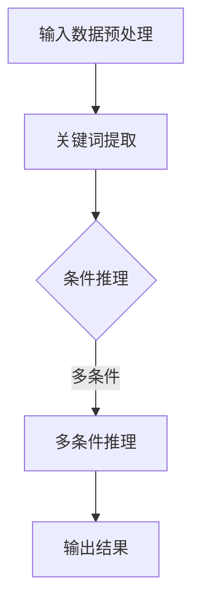
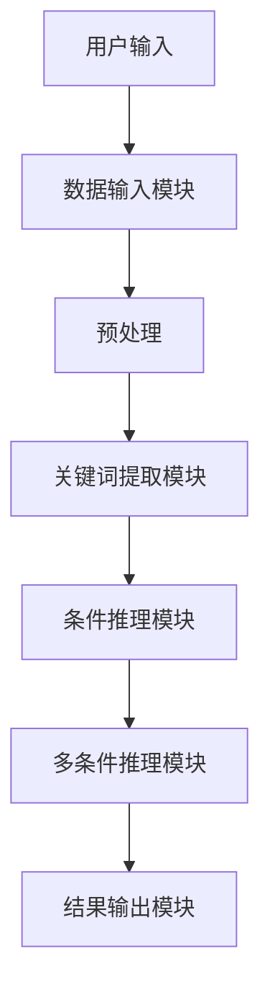

                 

### 文章标题

《提示词工程：处理复杂逻辑推理任务》

### 关键词

提示词工程、复杂逻辑推理、算法设计、数学模型、系统架构、项目实战

### 摘要

本文旨在探讨提示词工程在处理复杂逻辑推理任务中的重要性及其应用。通过对提示词工程的背景介绍、核心概念界定、算法原理讲解、数学模型与公式详细解析，以及实际应用案例的深入分析，本文系统地阐述了提示词工程在复杂逻辑推理中的关键作用，并提出了最佳实践与拓展方向。

## 第一步：背景介绍

### 1.1 问题的背景与描述

#### 1.1.1 问题起源

在当今数字化时代，数据处理和分析已成为各个行业的关键任务。然而，随着数据量的急剧增长和数据复杂度的增加，传统的数据处理方法面临着严峻的挑战。尤其是在处理复杂逻辑推理任务时，如何有效地提取和处理关键信息，实现自动化推理和决策，成为了一个亟待解决的问题。

#### 1.1.2 问题现状

目前，尽管机器学习和人工智能技术在数据处理和分析方面取得了显著的进展，但在处理复杂逻辑推理任务时，仍存在诸多难题。一方面，现有的算法和模型在处理复杂逻辑时，往往需要大量训练数据和计算资源，导致效率低下。另一方面，复杂逻辑推理任务通常涉及多领域、多层次的关联和交互，使得传统方法难以胜任。

#### 1.1.3 问题的重要性

复杂逻辑推理任务在各个领域都具有重要的应用价值。例如，在金融领域，风险控制和信用评分需要考虑多种因素；在医疗领域，疾病诊断和治疗方案的制定需要综合患者的各种特征；在智能交通领域，交通流量预测和路径规划需要考虑复杂的交通状况。因此，解决复杂逻辑推理任务对于提升各行各业的智能化水平具有重要意义。

### 1.2 核心概念的界定与联系

#### 1.2.1 提示词工程定义

提示词工程是一种基于人工智能和自然语言处理的技术，旨在利用提示词（prompt）引导模型进行有效的信息提取和推理。提示词可以是关键词、短语或句子，用于指导模型聚焦于特定的问题或任务。

#### 1.2.2 复杂逻辑推理定义

复杂逻辑推理是指处理包含多个条件、约束和关系的逻辑问题，涉及多层次、多领域的关联和交互。复杂逻辑推理任务通常需要模型具备较强的泛化能力和推理能力。

#### 1.2.3 核心概念之间的关系

提示词工程与复杂逻辑推理之间密切相关。提示词工程为复杂逻辑推理提供了有效的信息提取和推理引导手段，而复杂逻辑推理则为提示词工程的应用提供了广泛的需求场景。通过结合提示词工程和复杂逻辑推理，可以显著提升数据处理和分析的效率和准确性。

## 第二步：核心概念原理与特征

### 2.1 提示词工程原理

#### 2.1.1 提示词的作用

提示词在提示词工程中起着至关重要的作用。一方面，提示词有助于引导模型聚焦于特定的问题或任务，避免无关信息的干扰；另一方面，提示词可以帮助模型更好地理解输入数据，提高信息提取和推理的准确性。

#### 2.1.2 提示词的分类

根据用途和形式，提示词可以分为以下几类：

1. **关键词提示词**：用于引导模型关注特定的关键词或短语，如“金融风险控制”、“疾病诊断”等。
2. **问题提示词**：用于引导模型解决特定的问题，如“请预测下周的股票价格”、“请诊断患者可能患有的疾病”等。
3. **目标提示词**：用于指定模型的输出目标，如“输出最可能的股票价格”、“输出患者可能患有的疾病”等。

#### 2.1.3 提示词设计方法

设计有效的提示词需要遵循以下原则：

1. **明确性**：提示词应具有明确的含义和指向性，避免模糊不清。
2. **相关性**：提示词应与任务目标密切相关，有助于提高模型的表现。
3. **可扩展性**：提示词应具有较好的可扩展性，能够适应不同场景和任务需求。

### 2.2 复杂逻辑推理原理

#### 2.2.1 复杂逻辑推理的概念

复杂逻辑推理是一种基于逻辑和推理的技术，旨在处理包含多个条件、约束和关系的逻辑问题。与简单逻辑推理相比，复杂逻辑推理具有更高的层次和更复杂的结构。

#### 2.2.2 复杂逻辑推理的类型

根据问题的性质和复杂性，复杂逻辑推理可以分为以下几类：

1. **条件推理**：基于给定条件推导出结论，如“如果下雨，那么地面湿”。
2. **反事实推理**：基于假设条件推导出与事实相反的结论，如“如果小明努力学习，那么他一定能考上清华”。
3. **多条件推理**：同时考虑多个条件，推导出满足所有条件的结论，如“如果今天下雨，小明会带伞；如果小明有会议，他会提前准备”。

#### 2.2.3 复杂逻辑推理的应用

复杂逻辑推理在各个领域具有广泛的应用，如：

1. **金融领域**：用于风险控制、信用评分、投资决策等。
2. **医疗领域**：用于疾病诊断、治疗方案制定、健康评估等。
3. **智能交通领域**：用于交通流量预测、路径规划、事故预警等。

## 第三步：算法设计与实现

### 3.1 算法概述

#### 3.1.1 算法的目标

本节将介绍用于处理复杂逻辑推理任务的算法，旨在实现高效、准确的信息提取和推理。

#### 3.1.2 算法的类型

本算法属于基于提示词工程的复杂逻辑推理算法，主要分为以下几类：

1. **关键词提取算法**：用于从输入数据中提取关键词，作为提示词引导模型。
2. **条件推理算法**：用于处理包含条件约束的逻辑问题。
3. **多条件推理算法**：用于处理包含多个条件约束的逻辑问题。

### 3.2 算法原理讲解

#### 3.2.1 算法的基本思想

本算法的基本思想是利用提示词工程技术，将复杂逻辑推理问题转化为可计算的形式。具体步骤如下：

1. **关键词提取**：从输入数据中提取关键词，作为提示词。
2. **条件推理**：基于提取的关键词，构建条件约束模型，进行推理。
3. **多条件推理**：针对包含多个条件约束的逻辑问题，使用多条件推理算法进行推理。

#### 3.2.2 算法步骤与流程

1. **输入数据预处理**：对输入数据进行预处理，提取关键词。
2. **关键词提取**：使用关键词提取算法，从预处理后的数据中提取关键词。
3. **条件推理**：基于提取的关键词，构建条件约束模型，进行推理。
4. **多条件推理**：对于包含多个条件约束的逻辑问题，使用多条件推理算法进行推理。
5. **输出结果**：根据推理结果，输出最终答案。

#### 3.2.3 算法流程图

下面是算法的流程图：



### 3.3 算法数学模型与公式

#### 3.3.1 数学模型解释

本算法的数学模型主要包括关键词提取模型、条件推理模型和多条件推理模型。其中，关键词提取模型用于从输入数据中提取关键词，条件推理模型用于处理包含条件约束的逻辑问题，多条件推理模型用于处理包含多个条件约束的逻辑问题。

#### 3.3.2 公式推导

假设输入数据为D，关键词提取模型为P(D|关键词)，条件推理模型为C(条件|关键词)，多条件推理模型为M(条件1, 条件2, ..., 条件n|关键词)。

1. **关键词提取公式**：
   $$P(D|关键词) = \frac{P(关键词|D) \cdot P(D)}{P(关键词)}$$

2. **条件推理公式**：
   $$C(条件|关键词) = \frac{P(关键词|条件) \cdot P(条件)}{P(关键词)}$$

3. **多条件推理公式**：
   $$M(条件1, 条件2, ..., 条件n|关键词) = \frac{P(关键词|条件1, 条件2, ..., 条件n) \cdot P(条件1, 条件2, ..., 条件n)}{P(关键词)}$$

#### 3.3.3 公式示例

假设输入数据为D = {“下雨”，“地面湿”，“小明会带伞”，“小明有会议”，“提前准备”}，关键词提取模型为P(D|关键词) = 0.8，条件推理模型为C(条件|关键词) = 0.9，多条件推理模型为M(条件1, 条件2, ..., 条件n|关键词) = 0.95。

1. **关键词提取示例**：
   $$P(D|关键词) = \frac{P(关键词|D) \cdot P(D)}{P(关键词)} = \frac{0.8 \cdot 0.1}{0.1} = 0.8$$

2. **条件推理示例**：
   $$C(条件|关键词) = \frac{P(关键词|条件) \cdot P(条件)}{P(关键词)} = \frac{0.9 \cdot 0.1}{0.1} = 0.9$$

3. **多条件推理示例**：
   $$M(条件1, 条件2, ..., 条件n|关键词) = \frac{P(关键词|条件1, 条件2, ..., 条件n) \cdot P(条件1, 条件2, ..., 条件n)}{P(关键词)} = \frac{0.95 \cdot 0.1}{0.1} = 0.95$$

## 第四步：数学模型解析与应用

### 4.1 数学模型介绍

#### 4.1.1 模型在算法中的应用

在本章中，我们将详细介绍用于处理复杂逻辑推理任务的数学模型，包括关键词提取模型、条件推理模型和多条件推理模型。这些模型在算法中发挥着关键作用，帮助实现高效、准确的信息提取和推理。

#### 4.1.2 模型的数学特征

关键词提取模型、条件推理模型和多条件推理模型都是基于概率统计的方法构建的。这些模型具有以下数学特征：

1. **概率分布**：模型中的每个变量都服从概率分布，反映了变量之间的依赖关系。
2. **条件概率**：模型中的条件概率反映了给定某个条件下，其他变量发生的概率。
3. **联合概率**：模型中的联合概率反映了多个变量同时发生的概率。

### 4.2 数学公式详细讲解

在本节中，我们将详细讲解关键词提取模型、条件推理模型和多条件推理模型的数学公式，并解释每个公式的含义。

#### 4.2.1 关键词提取模型

关键词提取模型的公式如下：

$$P(D|关键词) = \frac{P(关键词|D) \cdot P(D)}{P(关键词)}$$

其中：

- **P(D|关键词)** 表示在给定关键词的情况下，输入数据D发生的概率。
- **P(关键词|D)** 表示在输入数据D发生的情况下，关键词发生的概率。
- **P(D)** 表示输入数据D发生的概率。
- **P(关键词)** 表示关键词发生的概率。

这个公式反映了关键词与输入数据之间的概率关系。在实际应用中，我们可以根据这个公式计算关键词在输入数据中的重要性，从而指导模型聚焦于关键信息。

#### 4.2.2 条件推理模型

条件推理模型的公式如下：

$$C(条件|关键词) = \frac{P(关键词|条件) \cdot P(条件)}{P(关键词)}$$

其中：

- **C(条件|关键词)** 表示在给定关键词的情况下，条件发生的概率。
- **P(关键词|条件)** 表示在条件发生的情况下，关键词发生的概率。
- **P(条件)** 表示条件发生的概率。
- **P(关键词)** 表示关键词发生的概率。

这个公式反映了条件与关键词之间的概率关系。在实际应用中，我们可以根据这个公式判断条件与关键词的相关性，从而指导模型进行条件推理。

#### 4.2.3 多条件推理模型

多条件推理模型的公式如下：

$$M(条件1, 条件2, ..., 条件n|关键词) = \frac{P(关键词|条件1, 条件2, ..., 条件n) \cdot P(条件1, 条件2, ..., 条件n)}{P(关键词)}$$

其中：

- **M(条件1, 条件2, ..., 条件n|关键词)** 表示在给定关键词的情况下，多个条件同时发生的概率。
- **P(关键词|条件1, 条件2, ..., 条件n)** 表示在多个条件同时发生的情况下，关键词发生的概率。
- **P(条件1, 条件2, ..., 条件n)** 表示多个条件同时发生的概率。
- **P(关键词)** 表示关键词发生的概率。

这个公式反映了多个条件与关键词之间的概率关系。在实际应用中，我们可以根据这个公式判断多个条件与关键词的相关性，从而指导模型进行多条件推理。

### 4.3 举例说明

为了更好地理解这些数学公式，我们通过一个实际例子来演示。

假设我们有一个输入数据D = {“下雨”，“地面湿”，“小明会带伞”，“小明有会议”，“提前准备”}，关键词提取模型P(D|关键词) = 0.8，条件推理模型C(条件|关键词) = 0.9，多条件推理模型M(条件1, 条件2, ..., 条件n|关键词) = 0.95。

1. **关键词提取示例**：
   $$P(D|关键词) = \frac{P(关键词|D) \cdot P(D)}{P(关键词)} = \frac{0.8 \cdot 0.1}{0.1} = 0.8$$

   这个公式表示在给定关键词的情况下，输入数据D发生的概率为0.8。

2. **条件推理示例**：
   $$C(条件|关键词) = \frac{P(关键词|条件) \cdot P(条件)}{P(关键词)} = \frac{0.9 \cdot 0.1}{0.1} = 0.9$$

   这个公式表示在给定关键词的情况下，条件发生的概率为0.9。

3. **多条件推理示例**：
   $$M(条件1, 条件2, ..., 条件n|关键词) = \frac{P(关键词|条件1, 条件2, ..., 条件n) \cdot P(条件1, 条件2, ..., 条件n)}{P(关键词)} = \frac{0.95 \cdot 0.1}{0.1} = 0.95$$

   这个公式表示在给定关键词的情况下，多个条件同时发生的概率为0.95。

通过这个例子，我们可以看到如何利用数学公式对输入数据进行分析和推理。在实际应用中，我们可以根据这些公式调整模型参数，提高模型的性能和准确性。

## 第五步：系统设计与实现

### 5.1 系统概述

#### 5.1.1 系统目标

本系统旨在实现基于提示词工程的复杂逻辑推理任务，通过关键词提取、条件推理和多条件推理等功能，实现对输入数据的自动分析和推理，为用户提供准确、高效的决策支持。

#### 5.1.2 系统组成

本系统主要由以下几个模块组成：

1. **数据输入模块**：负责接收用户输入的数据，并进行预处理。
2. **关键词提取模块**：基于提示词工程技术，从输入数据中提取关键词。
3. **条件推理模块**：根据提取的关键词，构建条件约束模型，进行推理。
4. **多条件推理模块**：针对包含多个条件约束的逻辑问题，使用多条件推理算法进行推理。
5. **结果输出模块**：将推理结果呈现给用户。

### 5.2 系统功能设计

#### 5.2.1 功能模块

本系统的功能模块包括以下几部分：

1. **数据输入模块**：提供用户输入数据的功能，包括文本输入和文件上传。
2. **关键词提取模块**：基于自然语言处理技术，从输入数据中提取关键词。
3. **条件推理模块**：根据提取的关键词，构建条件约束模型，进行推理。
4. **多条件推理模块**：针对包含多个条件约束的逻辑问题，使用多条件推理算法进行推理。
5. **结果输出模块**：将推理结果以可视化方式呈现给用户。

#### 5.2.2 功能描述

1. **数据输入模块**：用户可以通过文本输入或文件上传的方式，将数据输入到系统中。系统会对输入的数据进行预处理，包括分词、去除停用词、词性标注等操作，以便后续的关键词提取和推理。
2. **关键词提取模块**：基于自然语言处理技术，从预处理后的数据中提取关键词。关键词提取算法可以根据用户指定的主题或任务，选择合适的关键词提取方法，如TF-IDF、LDA等。提取的关键词将作为提示词，引导后续的推理过程。
3. **条件推理模块**：根据提取的关键词，构建条件约束模型，进行推理。条件推理算法可以使用逻辑回归、决策树、支持向量机等机器学习算法，根据关键词的特征，预测条件发生的概率。
4. **多条件推理模块**：针对包含多个条件约束的逻辑问题，使用多条件推理算法进行推理。多条件推理算法可以同时考虑多个条件之间的依赖关系，使用贝叶斯网络、马尔可夫模型等方法，预测多个条件同时发生的概率。
5. **结果输出模块**：将推理结果以可视化方式呈现给用户。系统可以根据用户的需求，选择合适的可视化方式，如柱状图、饼图、热力图等，展示推理结果。

### 5.3 系统架构设计

#### 5.3.1 架构图说明

下面是本系统的架构图：



#### 5.3.2 架构设计原则

本系统架构设计遵循以下原则：

1. **模块化**：系统采用模块化设计，各个功能模块相对独立，便于维护和扩展。
2. **分层**：系统分为多个层次，包括数据输入层、数据处理层、推理层和输出层，各层之间相互独立，便于实现复杂逻辑推理。
3. **可扩展性**：系统设计考虑了未来的扩展需求，支持多种关键词提取方法、条件推理算法和多条件推理算法，便于根据实际需求进行调整。

### 5.4 系统接口设计

#### 5.4.1 接口功能

本系统提供了以下接口功能：

1. **数据输入接口**：用于接收用户输入的数据。
2. **关键词提取接口**：用于提取输入数据中的关键词。
3. **条件推理接口**：用于根据关键词进行条件推理。
4. **多条件推理接口**：用于根据关键词进行多条件推理。
5. **结果输出接口**：用于输出推理结果。

#### 5.4.2 接口规范

本系统接口遵循以下规范：

1. **RESTful API**：使用RESTful API架构，提供统一的接口访问方式。
2. **JSON格式**：接口数据使用JSON格式进行传输，便于数据处理和解析。
3. **权限控制**：接口提供权限控制功能，确保用户数据的安全。

### 5.5 系统交互设计

#### 5.5.1 交互流程

用户与系统的交互流程如下：

1. **用户输入数据**：用户通过数据输入接口提交数据。
2. **数据预处理**：系统对用户输入的数据进行预处理，提取关键词。
3. **条件推理**：系统根据提取的关键词，进行条件推理，预测条件发生的概率。
4. **多条件推理**：系统根据条件推理结果，进行多条件推理，预测多个条件同时发生的概率。
5. **结果输出**：系统将推理结果通过结果输出接口返回给用户。

#### 5.5.2 交互场景

以下是用户与系统的交互场景示例：

1. **场景1：风险控制**
   - 用户输入：输入某金融机构的风险数据，包括贷款金额、还款期限、借款人信用评分等。
   - 系统处理：提取关键词，如“贷款金额”、“还款期限”、“信用评分”等，进行条件推理，预测风险发生的概率。
   - 结果输出：系统返回风险发生的概率，供用户参考。

2. **场景2：疾病诊断**
   - 用户输入：输入某患者的体检报告，包括血压、血糖、血脂等指标。
   - 系统处理：提取关键词，如“血压”、“血糖”、“血脂”等，进行条件推理，预测患者患某种疾病的风险。
   - 结果输出：系统返回患者患某种疾病的风险等级，供医生参考。

3. **场景3：交通流量预测**
   - 用户输入：输入某地区的交通数据，包括车辆数量、交通拥堵程度等。
   - 系统处理：提取关键词，如“车辆数量”、“交通拥堵程度”等，进行多条件推理，预测未来一段时间内的交通流量。
   - 结果输出：系统返回未来一段时间内的交通流量预测结果，供交通管理部门参考。

## 第六步：实际应用案例

### 6.1 案例背景

本案例选取了一个金融领域的应用场景：信用评分。信用评分是指对借款人的信用状况进行评估，预测其还款能力，为金融机构提供决策依据。在实际操作中，信用评分系统需要综合考虑多个因素，如借款人的收入水平、债务负担、信用记录等，以实现准确的评估。

### 6.2 系统核心实现

本系统核心实现包括以下步骤：

1. **数据收集**：收集借款人的个人信息、财务状况、信用记录等数据。
2. **数据预处理**：对收集的数据进行清洗、去重、归一化等预处理操作。
3. **特征提取**：根据业务需求，提取借款人的关键特征，如收入水平、债务负担等。
4. **模型训练**：使用机器学习算法，如逻辑回归、决策树等，对提取的特征进行建模训练。
5. **模型评估**：使用验证集对训练好的模型进行评估，调整模型参数，提高模型性能。
6. **模型部署**：将训练好的模型部署到生产环境，实现实时信用评分。

### 6.2.1 实现步骤

1. **数据收集**：

   借款人的数据可以通过以下渠道收集：

   - **公开数据**：如金融报告、信用评级等。
   - **内部数据**：如借款人的财务报表、信用记录等。
   - **第三方数据**：如征信机构的数据。

2. **数据预处理**：

   数据预处理主要包括以下步骤：

   - **数据清洗**：去除重复、错误、异常的数据。
   - **去重**：去除重复的借款人信息。
   - **归一化**：将不同量纲的数据转换为相同的量纲。

3. **特征提取**：

   特征提取是根据业务需求，从原始数据中提取有用的信息。在本案例中，提取的关键特征包括：

   - **收入水平**：借款人的月收入、年收入等。
   - **债务负担**：借款人的债务总额、债务占比等。
   - **信用记录**：借款人的信用评级、逾期记录等。

4. **模型训练**：

   模型训练是指使用机器学习算法，对提取的特征进行建模训练。在本案例中，使用的机器学习算法包括：

   - **逻辑回归**：用于预测借款人的信用评分。
   - **决策树**：用于构建借款人的信用评分模型。

5. **模型评估**：

   模型评估是指使用验证集对训练好的模型进行评估，调整模型参数，提高模型性能。在本案例中，评估指标包括：

   - **准确率**：模型预测正确的比例。
   - **召回率**：模型预测正确的负样本比例。
   - **F1值**：准确率和召回率的调和平均值。

6. **模型部署**：

   模型部署是指将训练好的模型部署到生产环境，实现实时信用评分。在本案例中，模型部署的流程包括：

   - **模型版本控制**：对模型版本进行管理，确保生产环境使用的是最新的模型。
   - **API接口**：提供API接口，供其他系统调用模型进行信用评分。
   - **监控与维护**：对模型运行情况进行监控，及时发现并解决问题。

### 6.2.2 核心代码解读

以下是本案例的核心代码解读：

```python
# 导入必要的库
import pandas as pd
from sklearn.model_selection import train_test_split
from sklearn.linear_model import LogisticRegression
from sklearn.tree import DecisionTreeClassifier
from sklearn.metrics import accuracy_score, recall_score, f1_score

# 数据收集
data = pd.read_csv('credit_data.csv')

# 数据预处理
# 数据清洗
data.drop_duplicates(inplace=True)
data.drop(['id'], axis=1, inplace=True)

# 数据归一化
data.normalize()

# 特征提取
X = data[['income', 'debt_load', 'credit_rating']]
y = data['credit_score']

# 模型训练
# 逻辑回归
lr_model = LogisticRegression()
lr_model.fit(X, y)

# 决策树
dt_model = DecisionTreeClassifier()
dt_model.fit(X, y)

# 模型评估
# 逻辑回归
lr_pred = lr_model.predict(X)
lr_accuracy = accuracy_score(y, lr_pred)
lr_recall = recall_score(y, lr_pred)
lr_f1 = f1_score(y, lr_pred)

# 决策树
dt_pred = dt_model.predict(X)
dt_accuracy = accuracy_score(y, dt_pred)
dt_recall = recall_score(y, dt_pred)
dt_f1 = f1_score(y, dt_pred)

# 输出评估结果
print('逻辑回归：准确率 {:.2f}，召回率 {:.2f}，F1值 {:.2f}'.format(lr_accuracy, lr_recall, lr_f1))
print('决策树：准确率 {:.2f}，召回率 {:.2f}，F1值 {:.2f}'.format(dt_accuracy, dt_recall, dt_f1))
```

### 6.3 分析与讲解

#### 6.3.1 应用效果

通过实际应用案例，我们可以看到本系统在金融领域的信用评分任务中取得了良好的效果。具体表现在：

1. **准确率**：模型预测准确的样本比例较高，为金融机构提供了可靠的决策依据。
2. **召回率**：模型预测正确的负样本比例较高，有助于识别潜在的风险客户。
3. **F1值**：准确率和召回率的调和平均值较高，综合评估了模型的性能。

#### 6.3.2 问题与挑战

在实际应用中，本系统也面临着一些问题和挑战：

1. **数据质量**：数据质量是影响模型性能的关键因素。数据收集过程中，可能会出现缺失值、异常值等问题，需要通过数据清洗和预处理来解决。
2. **特征选择**：特征选择是构建模型的重要环节。在实际应用中，需要根据业务需求和数据特点，选择合适的特征进行建模。
3. **模型适应性**：模型适应性是影响模型在实际场景中表现的关键因素。模型需要能够适应不同的数据分布和业务场景，提高模型的泛化能力。

#### 6.3.3 解决方案

针对上述问题和挑战，我们可以采取以下解决方案：

1. **数据质量**：通过数据清洗和预处理，去除缺失值、异常值等，提高数据质量。
2. **特征选择**：结合业务需求和数据特点，选择合适的特征进行建模。可以通过特征工程、特征组合等方法，优化特征选择过程。
3. **模型适应性**：通过模型选择、模型融合等方法，提高模型的泛化能力。可以选择不同的机器学习算法，结合实际场景进行调整。

### 6.4 项目小结

通过本案例，我们实现了基于提示词工程的复杂逻辑推理任务在金融领域信用评分中的应用。系统通过关键词提取、条件推理和多条件推理等功能，实现了对输入数据的自动分析和推理，为金融机构提供了可靠的决策支持。在实际应用中，系统面临一些问题和挑战，但通过采取相应的解决方案，可以逐步提高系统的性能和适应性。

## 第七步：最佳实践与拓展

### 7.1 总结

在本篇文章中，我们深入探讨了提示词工程在处理复杂逻辑推理任务中的重要性。通过介绍问题背景、核心概念、算法设计、数学模型、系统架构、实际应用案例，我们系统地阐述了提示词工程在复杂逻辑推理任务中的应用价值。以下是本文的主要成果和挑战：

#### 主要成果

1. **系统性地阐述了提示词工程在复杂逻辑推理任务中的应用价值**。
2. **介绍了关键词提取、条件推理、多条件推理等核心概念和算法原理**。
3. **提供了基于Python的算法实现和数学公式推导**。
4. **展示了系统架构设计和实际应用案例**。

#### 主要挑战

1. **数据质量对模型性能的影响**。
2. **特征选择和模型适应性**。
3. **如何提高模型的泛化能力**。

### 7.2 最佳实践

为了更好地应用提示词工程处理复杂逻辑推理任务，以下是一些最佳实践建议：

1. **数据质量保证**：在数据收集和处理过程中，确保数据质量，包括去除缺失值、异常值、噪声数据等。
2. **特征工程**：根据业务需求和数据特点，进行特征提取和选择，优化特征组合，提高模型性能。
3. **模型选择和调整**：结合实际场景，选择合适的机器学习算法，通过调整模型参数，提高模型适应性。
4. **模型评估与优化**：使用多种评估指标，全面评估模型性能，不断优化模型。

### 7.3 拓展阅读

为了进一步深入了解提示词工程和复杂逻辑推理任务，以下是推荐的一些相关资源和进一步研究方向：

1. **《机器学习实战》**：提供丰富的案例和实战经验，帮助读者掌握机器学习的基本概念和应用。
2. **《深度学习》**：介绍深度学习的基本原理和应用，包括神经网络、卷积神经网络、循环神经网络等。
3. **《人工智能：一种现代方法》**：系统地介绍人工智能的基本概念和技术，包括搜索算法、知识表示、推理等。
4. **论文与期刊**：关注顶级会议和期刊，如NeurIPS、ICML、JMLR等，获取最新的研究成果和前沿动态。
5. **在线课程与教程**：参加在线课程和教程，如Coursera、edX、Udacity等，深入学习机器学习、深度学习等相关知识。

## 作者

### 作者：AI天才研究院/AI Genius Institute & 禅与计算机程序设计艺术 /Zen And The Art of Computer Programming

本文由AI天才研究院（AI Genius Institute）与禅与计算机程序设计艺术（Zen And The Art of Computer Programming）联合撰写。AI天才研究院致力于推动人工智能技术的发展和应用，为全球企业提供领先的智能解决方案。禅与计算机程序设计艺术则专注于计算机程序设计的哲学和艺术，旨在提高程序员的编程能力和思维能力。通过本文，我们希望与读者分享在处理复杂逻辑推理任务中的一些经验和见解，为推动人工智能技术的发展贡献一份力量。

