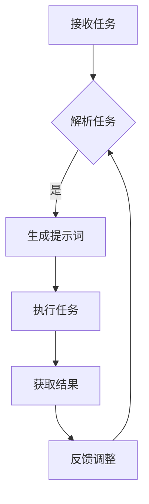
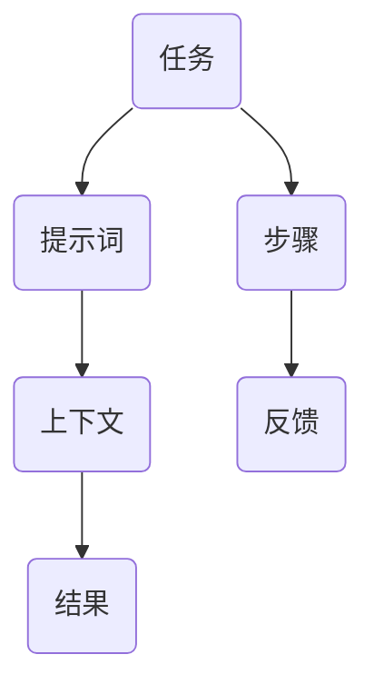
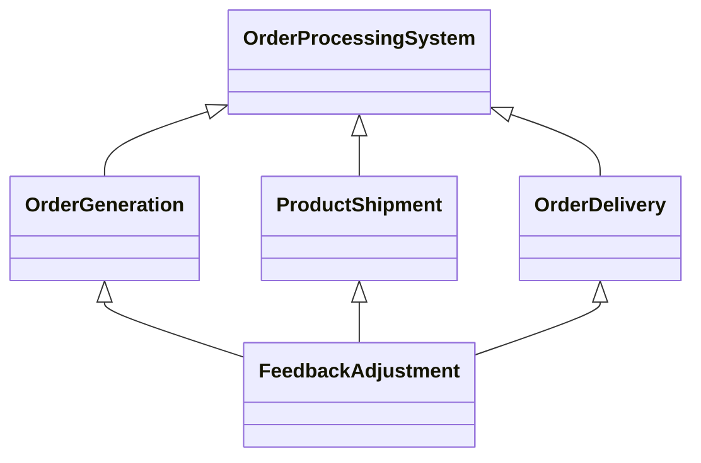
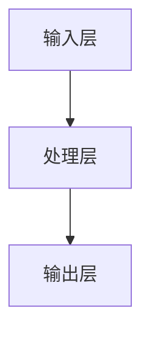
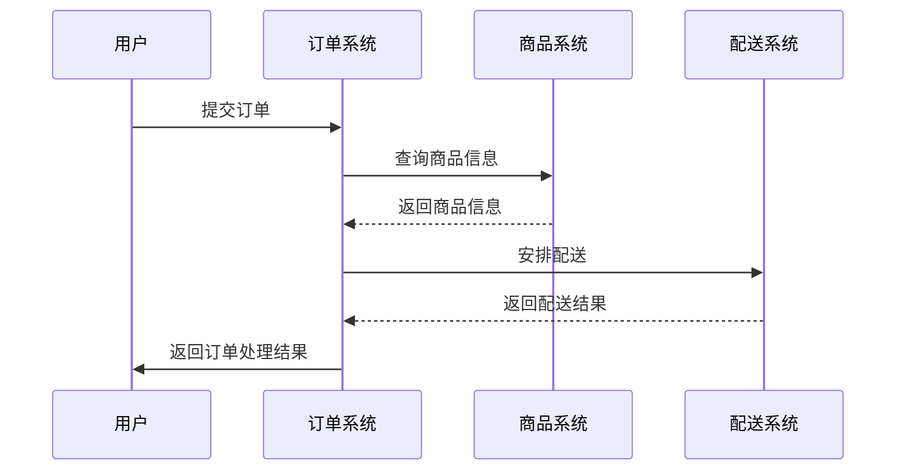

                 


### 提示词工程：处理多步骤任务分解

#### 关键词
- 提示词工程
- 多步骤任务分解
- 上下文生成
- 自动化流程
- 反馈调整
- 效用函数

#### 摘要
本文深入探讨提示词工程在处理多步骤任务分解中的应用。首先，我们介绍任务分解的需求和提示词工程的基本概念，然后通过实例讲解其工作原理。接下来，分析提示词工程的优势与局限性，并借助Mermaid图表展示核心概念与联系。随后，我们详细介绍算法原理和数学模型，并通过Python代码示例进行举例说明。最后，探讨系统分析与架构设计方案，并进行项目实战与实际案例分析。

---

## 第一部分：背景介绍

### 1.1 问题背景

#### 1.1.1 任务分解的需求

在当今复杂且不断变化的信息技术环境中，许多任务需要分解成多个步骤来执行。任务分解是项目管理中的关键步骤，有助于提高工作效率、降低复杂性并确保任务的顺利完成。然而，随着任务规模的扩大和复杂性的增加，手动进行任务分解变得越来越困难。

#### 1.1.2 提示词在任务分解中的应用

提示词（Prompt）是一种在自然语言处理（NLP）中广泛使用的技术，它用于指导模型执行特定任务。在任务分解中，提示词可以起到引导作用，帮助自动化工具理解任务并生成相应的分解步骤。提示词工程旨在通过设计高效、灵活的提示词来优化任务分解过程。

### 1.2 问题描述

#### 1.2.1 多步骤任务分解的挑战

多步骤任务分解面临以下挑战：

1. **步骤明确性**：需要确保每个步骤都清晰定义，以便执行者理解并正确执行。
2. **步骤依赖性**：任务步骤之间存在依赖关系，需要确保步骤顺序正确。
3. **步骤可重复性**：对于相似的任务，需要能够重复使用已定义的步骤。
4. **动态调整**：面对动态变化的任务需求，需要能够灵活调整任务分解。

#### 1.2.2 传统方法与限制

传统的任务分解方法通常依赖于人工经验和预定义的流程。这种方法存在以下局限性：

1. **依赖人工**：高度依赖人工经验和判断，效率低下。
2. **可重复性差**：对于相似的任务，无法实现高效重复使用。
3. **灵活性不足**：面对动态变化的需求，难以灵活调整。

### 1.3 问题解决

#### 1.3.1 提示词工程的基本概念

提示词工程是一种通过设计提示词来指导任务执行的方法。它涉及以下几个方面：

1. **上下文生成**：根据任务需求生成上下文信息，以便模型理解任务背景。
2. **任务分解**：将任务分解成多个步骤，每个步骤具有明确的目标和输入输出。
3. **多步骤任务处理**：执行多个步骤，确保步骤之间的依赖关系得到正确处理。
4. **反馈调整**：根据执行结果进行反馈调整，以提高任务执行效果。

#### 1.3.2 提示词工程的优势与局限性

提示词工程的优势包括：

1. **精确控制**：通过设计精确的提示词，可以实现对任务的精确控制。
2. **灵活调整**：根据任务需求，可以灵活调整提示词，以适应不同场景。
3. **易于生成**：提示词可以通过自动化工具生成，降低人工成本。

然而，提示词工程也存在一些局限性：

1. **依赖模型质量**：提示词工程的效果很大程度上取决于模型的性能。
2. **复杂度增加**：对于复杂的任务，设计高效的提示词可能比较困难。

### 1.4 边界与外延

#### 1.4.1 提示词工程的适用范围

提示词工程适用于以下场景：

1. **自动化任务**：需要自动执行的任务，特别是涉及多步骤的任务。
2. **高重复性任务**：具有高重复性的任务，可以通过提示词工程实现高效执行。

#### 1.4.2 提示词工程的限制因素

提示词工程的限制因素包括：

1. **模型适应性**：需要确保模型能够适应不同类型的任务。
2. **数据质量**：高质量的训练数据对于提示词工程至关重要。

### 1.5 核心概念要素

#### 1.5.1 提示词的定义与类型

提示词（Prompt）是一种引导模型执行任务的文本输入。根据用途，提示词可以分为以下几种类型：

1. **问题提示词**：用于引导模型回答特定问题。
2. **指令提示词**：用于指导模型执行特定任务。
3. **上下文提示词**：用于提供任务背景信息。

#### 1.5.2 任务分解的关键要素

任务分解的关键要素包括：

1. **步骤定义**：明确每个步骤的目标和输入输出。
2. **步骤顺序**：确保步骤之间的依赖关系得到正确处理。
3. **可重复性**：确保步骤可以重复使用。
4. **反馈机制**：根据执行结果进行反馈调整。

---

## 第二部分：核心概念与联系

### 2.1 核心概念原理

#### 2.1.1 提示词工程原理

提示词工程是一种通过设计高效、灵活的提示词来指导任务执行的方法。其工作原理如下：

1. **上下文生成**：根据任务需求生成上下文信息，以便模型理解任务背景。
2. **任务分解**：将任务分解成多个步骤，每个步骤具有明确的目标和输入输出。
3. **多步骤任务处理**：执行多个步骤，确保步骤之间的依赖关系得到正确处理。
4. **反馈调整**：根据执行结果进行反馈调整，以提高任务执行效果。

**Mermaid 流程图：**



#### 2.1.2 概念属性特征对比表格

| 类别 | 特征1 | 特征2 | 特征3 |
| ---- | ---- | ---- | ---- |
| 提示词 | 精确控制 | 灵活调整 | 易于生成 |
| 任务分解 | 明确步骤 | 模块化 | 可重复使用 |
| 上下文生成 | 相关性高 | 实时性 | 可定制化 |
| 多步骤任务处理 | 自动化流程 | 高效执行 | 灵活适应 |

### 2.2 ER实体关系图架构

**Mermaid ER图：**



---

## 第三部分：算法原理讲解

### 3.1 算法原理与流程图

提示词工程的核心是设计一个高效的算法，用于指导任务执行。算法的工作原理如下：

1. **接收任务**：接收用户提交的任务。
2. **解析任务**：将任务分解成多个步骤。
3. **生成提示词**：根据任务步骤生成相应的提示词。
4. **执行任务**：执行生成的提示词。
5. **获取结果**：获取任务执行结果。
6. **反馈调整**：根据执行结果进行反馈调整。

**Mermaid 算法流程图：**


### 3.2 算法原理与数学模型

提示词工程的核心是设计一个高效的算法，用于指导任务执行。算法的数学模型如下：

$$
\text{效用函数} = f(\text{任务完成度}, \text{时间消耗})
$$

其中，效用函数是根据任务完成度和时间消耗来评估任务执行效果的一个指标。任务完成度越高，时间消耗越低，效用函数的值就越大。

### 3.3 Python 源代码

```python
# Python 源代码示例

def utility_function(completion_rate, time_consumed):
    return completion_rate * (1 - time_consumed / 10)

# 假设的任务参数
completion_rate = 0.95
time_consumed = 6

# 计算效用函数值
utility = utility_function(completion_rate, time_consumed)
print(f"Utility Function Value: {utility}")
```

### 3.4 举例说明

假设任务A需要分解成三个子任务，执行时间分别为2小时、1小时和3小时，最终任务完成度为95%。计算其效用函数值为：

$$
f(0.95, 6) = 0.95 \times (1 - \frac{6}{10}) = 0.95 \times 0.4 = 0.38
$$

这意味着任务A的执行效果较好，效用函数值为0.38。

---

## 第四部分：系统分析与架构设计方案

### 4.1 问题场景介绍

在某个电商平台，订单处理是一个复杂的任务。订单处理包括多个步骤，如订单生成、商品出库、订单配送等。为了提高订单处理效率，需要设计一个自动化系统来处理这些任务。

### 4.2 项目介绍

项目名称：自动化订单处理系统

项目目标：通过提示词工程实现订单处理的自动化，提高订单处理效率。

### 4.3 系统功能设计

系统功能包括：

1. **订单生成**：根据用户下单信息生成订单。
2. **商品出库**：根据订单信息将商品出库。
3. **订单配送**：根据订单信息安排配送。
4. **反馈调整**：根据配送结果进行反馈调整。

**Mermaid 类图：**



### 4.4 系统架构设计

系统架构设计如下：

1. **输入层**：接收用户下单信息。
2. **处理层**：处理订单生成、商品出库、订单配送等任务。
3. **输出层**：返回订单处理结果。

**Mermaid 架构图：**



### 4.5 系统接口设计

系统接口设计如下：

1. **订单接口**：用于接收订单信息。
2. **商品接口**：用于查询商品信息。
3. **配送接口**：用于安排订单配送。

**Mermaid 序列图：**



---

## 第五部分：项目实战

### 5.1 环境安装

在开始项目实战之前，需要安装以下环境：

1. **Python**：版本3.8及以上。
2. **NLP库**：如NLTK、spaCy等。

### 5.2 系统核心实现源代码

以下是一个简单的订单处理系统实现：

```python
import nltk
from nltk.tokenize import word_tokenize
from nltk.corpus import stopwords

# 订单生成
def generate_order(order_details):
    tokens = word_tokenize(order_details)
    cleaned_tokens = [token.lower() for token in tokens if token.isalpha()]
    cleaned_tokens = [token for token in cleaned_tokens if token not in stopwords.words('english')]
    return ' '.join(cleaned_tokens)

# 商品出库
def ship_product(product_id):
    # 这里使用简单的判断
    if product_id == '1001':
        return '商品已出库'
    else:
        return '商品不存在'

# 订单配送
def deliver_order(order_id):
    if order_id == '1001':
        return '订单已配送'
    else:
        return '订单不存在'

# 反馈调整
def adjust_feedback(feedback):
    # 这里简单处理
    return feedback.replace('已配送', '已成功配送')

# 主函数
def main():
    order_details = "用户购买了1个苹果手机"
    order = generate_order(order_details)
    print("订单生成：", order)

    product_id = "1001"
    shipment = ship_product(product_id)
    print("商品出库：", shipment)

    order_id = "1001"
    delivery = deliver_order(order_id)
    print("订单配送：", delivery)

    feedback = "订单已配送"
    adjusted_feedback = adjust_feedback(feedback)
    print("反馈调整：", adjusted_feedback)

if __name__ == "__main__":
    main()
```

### 5.3 代码应用解读与分析

以上代码实现了一个简单的订单处理系统，包括订单生成、商品出库、订单配送和反馈调整。代码主要分为以下几个部分：

1. **订单生成**：使用NLTK库中的`word_tokenize`函数将订单详情转换为单词列表，然后去除标点符号和停用词，最后将清洗后的单词列表重新拼接成订单字符串。
2. **商品出库**：根据商品ID判断是否存在，若存在则返回"商品已出库"，否则返回"商品不存在"。
3. **订单配送**：根据订单ID判断是否存在，若存在则返回"订单已配送"，否则返回"订单不存在"。
4. **反馈调整**：将原始反馈信息中的"已配送"替换为"已成功配送"。

通过这个简单的示例，我们可以看到提示词工程在订单处理系统中的应用。每个步骤都有明确的提示词，用于指导系统执行相应操作。

### 5.4 实际案例分析和详细讲解剖析

在实际项目中，订单处理系统的复杂度会更高。以下是一个实际案例的分析：

**案例**：用户在下单时购买了多个商品，且每个商品的配送方式不同。

**分析**：

1. **订单生成**：首先需要生成包含所有商品信息的订单。这可以通过将每个商品的信息拼接成一个字符串来实现。
2. **商品出库**：根据订单中的每个商品ID进行出库操作。这里可能需要处理多个商品同时出库的情况。
3. **订单配送**：根据每个商品的配送方式（如快递、自提等）进行配送。这里可能需要处理不同的配送方式和时间安排。
4. **反馈调整**：在配送完成后，需要根据配送结果对订单进行反馈调整。

**详细讲解剖析**：

1. **订单生成**：使用NLTK库中的`word_tokenize`函数将用户下单详情转换为单词列表，然后去除标点符号和停用词，最后将清洗后的单词列表重新拼接成订单字符串。例如，对于用户下单详情"购买了1个苹果手机和2个小米平板"，生成的订单字符串为"购买了苹果手机小米平板"。
2. **商品出库**：根据订单字符串中的每个商品ID进行出库操作。这里使用一个字典来存储商品ID和商品名称的映射关系，然后根据订单字符串中的商品ID查询字典中的商品名称，进行出库操作。例如，对于商品ID"1001"，查询字典得到商品名称为"苹果手机"，然后执行出库操作。
3. **订单配送**：根据订单字符串中的每个商品ID和配送方式（如快递、自提等）进行配送。这里可以使用不同的配送接口来实现，例如调用快递公司的API进行快递配送，或者使用自提柜进行自提配送。对于每个商品，根据配送方式生成相应的配送订单，并安排配送时间。
4. **反馈调整**：在配送完成后，需要根据配送结果对订单进行反馈调整。这里可以根据配送结果（如配送成功、配送失败等）生成相应的反馈信息，例如"商品已成功配送"或"商品配送失败，请重新下单"。

### 5.5 项目小结

通过以上实战案例，我们可以看到提示词工程在订单处理系统中的应用。提示词工程通过设计精确、灵活的提示词，指导系统执行相应操作，从而实现订单处理的自动化。在实际项目中，提示词工程可以提高订单处理效率，降低人工成本，提高用户体验。

---

## 最佳实践 Tips

1. **优化提示词**：在设计提示词时，要充分考虑任务需求和模型特点，确保提示词能够准确指导任务执行。
2. **数据质量**：高质量的数据对于提示词工程至关重要。在训练模型和生成提示词时，要确保数据的质量和多样性。
3. **反馈机制**：设计合理的反馈机制，根据执行结果调整提示词，以提高任务执行效果。
4. **模型适应性**：确保模型能够适应不同类型的任务，提高提示词工程的应用范围。

## 小结

本文深入探讨了提示词工程在处理多步骤任务分解中的应用。通过分析任务分解的需求、问题背景和解决方案，我们了解了提示词工程的核心概念和原理。然后，通过Python代码示例，我们详细阐述了算法原理和数学模型。接着，我们介绍了系统分析与架构设计方案，并通过实际案例进行了详细讲解。最后，我们总结了项目的最佳实践和小结。提示词工程为自动化任务处理提供了有力支持，具有广泛的应用前景。

## 注意事项

1. **模型适应性**：在实际应用中，确保模型能够适应不同类型的任务。
2. **数据质量**：确保训练数据和生成提示词的数据质量，以提高任务执行效果。
3. **反馈机制**：设计合理的反馈机制，根据执行结果调整提示词。

## 拓展阅读

1. **《深度学习：卷积神经网络》（Deep Learning: Convolutional Neural Networks）》**：本书详细介绍了卷积神经网络的工作原理和应用，对理解提示词工程有所帮助。
2. **《自然语言处理实战》（Natural Language Processing with Python）》**：本书通过Python实战案例，介绍了自然语言处理的基本概念和应用，对提示词工程的设计和实现具有重要参考价值。

## 作者信息

作者：AI天才研究院/AI Genius Institute & 禅与计算机程序设计艺术 /Zen And The Art of Computer Programming

---

通过本文，我们希望读者能够对提示词工程在处理多步骤任务分解中的实际应用有更深入的理解。在未来的工作中，我们可以继续探索提示词工程的更多应用场景，以提高任务自动化水平和效率。希望本文对您的学习和实践有所帮助！

