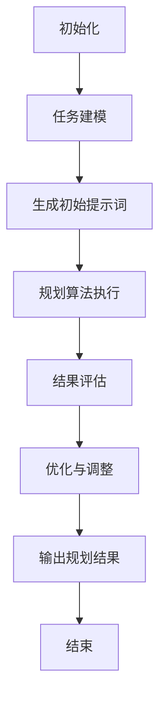
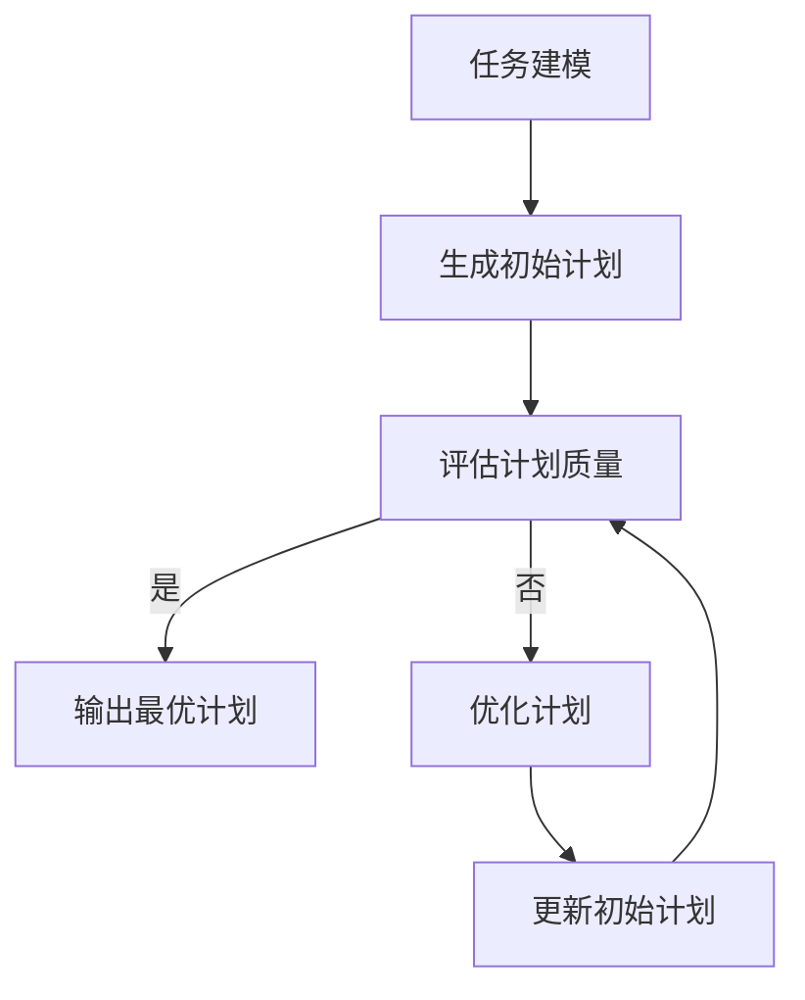
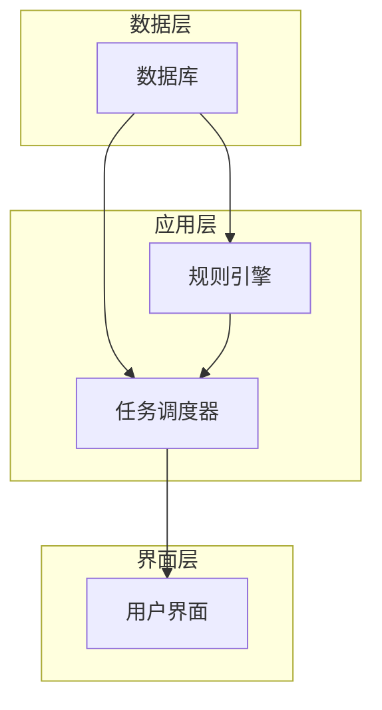
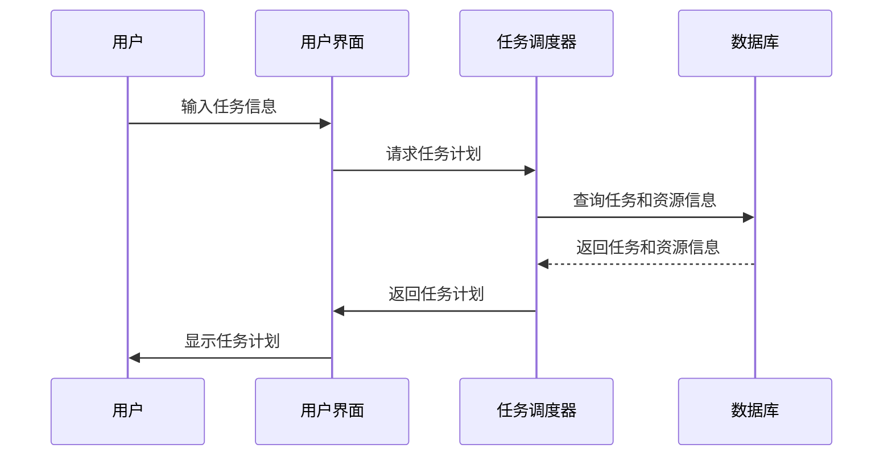
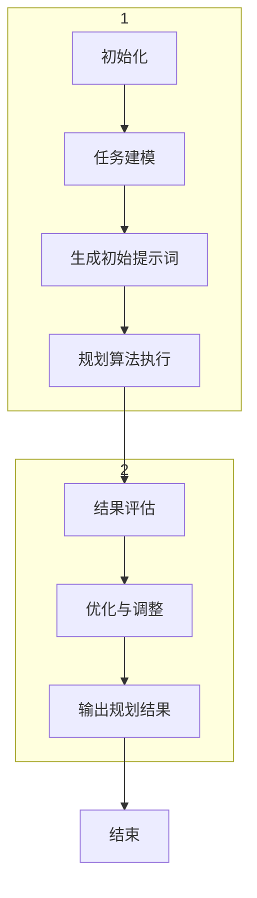

                 

## 1.6 提示词工程：处理多步骤任务规划问题

### 1.6 提示词工程：处理多步骤任务规划问题

**关键词**：提示词工程、多步骤任务规划、人工智能、算法、系统设计

**摘要**：

本文旨在探讨提示词工程在处理多步骤任务规划问题中的应用。通过对问题的背景、问题描述、解决方案的详细阐述，以及核心概念、算法原理、系统分析与设计等内容的深入分析，本文旨在为读者提供一个全面、系统的理解，帮助解决多步骤任务规划中的复杂性问题。

----------------------------------------------------------------

# 第二部分 核心概念与联系

## 第2章 核心概念与联系

### 2.1 提示词的定义与作用

提示词工程是处理多步骤任务规划问题的一项关键技术。提示词（Prompt）在这里并不是传统意义上的关键词或短语，而是一种特殊的输入信号，用于引导算法或系统进行任务规划和决策。提示词的定义与作用主要体现在以下几个方面：

- **定义**：提示词是针对特定任务或问题的输入信息，它为算法或系统提供了必要的信息，以指导其进行任务规划和决策。
- **作用**：提示词在多步骤任务规划中起到了桥梁的作用，将任务需求、约束条件、目标函数等抽象信息转化为算法或系统能够理解和处理的具体输入。

提示词工程的目标是设计出有效的提示词，使其能够充分反映任务的复杂性和多样性，从而提高任务规划的质量和效率。

### 2.2 提示词的属性特征对比表格

为了更好地理解提示词的属性特征，我们可以将其与常见的关键词或短语进行对比。以下是一个简化的对比表格：

| 特征        | 提示词            | 关键词/短语         |
| ----------- | ----------------- | ------------------- |
| **具体性**  | 针对特定任务的需求 | 概括性的描述或分类   |
| **结构化**  | 有明确的格式和结构 | 非结构化的文本      |
| **动态性**  | 可以实时更新和调整 | 固定不变的          |
| **抽象性**  | 高层次的抽象信息   | 具体的细节描述      |
| **多样性**  | 可以涵盖多种类型任务 | 主要用于单一目的    |

通过上述对比，我们可以看出提示词在多步骤任务规划中具有独特的作用和优势。

### 2.3 提示词与相关概念的ER实体关系图

为了更清晰地展示提示词与其他相关概念之间的联系，我们可以使用ER（Entity-Relationship）实体关系图。以下是一个简化的ER图示例：

```mermaid
erDiagram
    Task --> Prompt : "defines"
    Task --> Plan : "generates"
    Constraint --> Plan : "enforces"
    Objective --> Plan : "optimizes"
    Prompt ..|.. Constraint
    Prompt ..|.. Objective
```

在这个ER图中，**Task**（任务）是核心实体，它与**Prompt**（提示词）通过“defines”关系相连，表示提示词用于定义任务的需求。同时，任务还与**Plan**（规划）、**Constraint**（约束）和**Objective**（目标）等概念有直接关系。这些关系体现了任务、提示词、规划、约束和目标之间的相互作用和依赖。

通过核心概念与联系的分析，我们可以更好地理解提示词工程在处理多步骤任务规划问题中的作用和重要性。在接下来的章节中，我们将进一步探讨提示词工程的算法原理和具体实现方法。

----------------------------------------------------------------

# 第三部分 提示词工程算法原理

## 第3章 提示词工程算法原理

### 3.1 算法mermaid流程图

在理解了提示词的定义与作用后，我们需要进一步探讨提示词工程的核心算法原理。以下是一个简化的提示词工程算法流程图，用于展示算法的基本工作流程：



这个流程图大致描述了提示词工程算法的基本步骤。下面我们将详细讲解每个步骤的具体内容和实现方法。

### 3.2 算法原理讲解

**任务建模**：任务建模是提示词工程的第一步，其目的是将实际任务转化为算法或系统能够理解和处理的形式。在这一步骤中，我们需要收集任务的相关信息，如任务类型、执行时间、依赖关系、资源需求等。然后，使用适当的表示方法（如表格、图形、代码等）对这些信息进行建模。

**生成初始提示词**：在任务建模完成后，我们需要根据任务的需求和约束条件生成初始提示词。提示词的生成可以基于规则、机器学习或人工设计等方法。例如，基于规则的方法可以使用预定义的模板来生成提示词，而基于机器学习的方法可以使用训练好的模型来生成个性化的提示词。

**规划算法执行**：规划算法是提示词工程的核心，它负责根据提示词来生成最优的任务序列。常见的规划算法包括启发式算法、元启发式算法和混合智能算法等。这些算法通常使用搜索策略来探索可能的任务序列，并根据目标函数和约束条件来评估和选择最优序列。

**结果评估**：在生成初步规划结果后，我们需要对其质量进行评估。评估标准通常包括任务完成时间、资源利用率、规划效率等。通过评估，我们可以确定当前规划结果是否满足预期要求，以及是否需要进行进一步的优化。

**优化与调整**：如果评估结果不理想，我们需要对规划结果进行优化和调整。这一步骤可以通过反复执行规划算法和评估过程来实现。优化的目标是进一步提高任务序列的优劣，以满足更高的约束条件或目标函数。

**输出规划结果**：最后，我们将生成的最优任务序列输出，作为最终的规划结果。这个结果可以被直接应用于实际任务中，如调度系统、自动规划系统等。

### 3.3 算法原理数学模型和公式

为了更深入地理解提示词工程算法，我们可以介绍一些基本的数学模型和公式。以下是一个简化的数学模型，用于描述多步骤任务规划问题：

- **任务集** \( T = \{t_1, t_2, ..., t_n\} \)：表示所有需要完成的任务集合。
- **任务时间** \( T_t = \{t_{t1}, t_{t2}, ..., t_{tn}\} \)：表示每个任务的执行时间。
- **依赖关系** \( D = \{d_1, d_2, ..., d_m\} \)：表示任务之间的依赖关系。
- **资源需求** \( R = \{r_1, r_2, ..., r_k\} \)：表示每个任务的资源需求。
- **目标函数** \( f = \sum_{i=1}^{n} w_i t_{i} \)：表示任务完成时间的目标函数，其中 \( w_i \) 是任务 \( t_i \) 的权重。

在算法中，我们可以使用动态规划、图搜索或遗传算法等来求解最优的任务序列。以下是一个简化的动态规划公式，用于求解最优任务序列：

\[ 
V(i) = \min \left\{ \sum_{j=1}^{n} w_j t_{ji} + V(j) \mid d_{ij} = 1 \right\} 
\]

其中，\( V(i) \) 表示从任务 \( t_i \) 开始的最优任务序列的完成时间，\( t_{ji} \) 表示任务 \( t_j \) 在任务 \( t_i \) 之后立即执行的时间，\( d_{ij} \) 表示任务 \( t_i \) 和任务 \( t_j \) 之间的依赖关系（\( d_{ij} = 1 \) 表示存在依赖关系，\( d_{ij} = 0 \) 表示不存在依赖关系）。

### 3.4 举例说明

为了更好地理解提示词工程算法的原理，我们可以通过一个简单的例子来说明。假设我们需要规划一个由三个任务组成的多步骤任务，任务集 \( T = \{t_1, t_2, t_3\} \)，任务时间 \( T_t = \{t_{11}, t_{21}, t_{31}\} \)，任务之间的依赖关系 \( D = \{d_{12}, d_{23}\} \)，资源需求 \( R = \{r_1, r_2\} \)，目标函数为最小化总完成时间。

- 任务1（\( t_1 \)）：执行时间 \( t_{11} = 5 \) 小时，资源需求 \( r_1 = 1 \)。
- 任务2（\( t_2 \)）：执行时间 \( t_{21} = 3 \) 小时，资源需求 \( r_2 = 1 \)，依赖关系 \( d_{12} = 1 \)。
- 任务3（\( t_3 \)）：执行时间 \( t_{31} = 4 \) 小时，资源需求 \( r_1 = 2 \)，依赖关系 \( d_{23} = 1 \)。

根据上述任务信息和目标函数，我们可以使用动态规划算法来求解最优的任务序列。

**步骤1：任务建模**
- 建立任务表格：
  | 任务 | 执行时间 \( t_{i} \) | 资源需求 \( r_i \) | 依赖关系 \( d_{ij} \) |
  | ---- | ---------------- | --------------- | --------------- |
  | \( t_1 \) | 5                | 1              | \( \emptyset \)   |
  | \( t_2 \) | 3                | 1              | \( t_1 \)         |
  | \( t_3 \) | 4                | 2              | \( t_2 \)         |

**步骤2：生成初始提示词**
- 使用任务表格生成初始提示词：
  ```plaintext
  提示词：任务1（t1）需要先执行，然后是任务2（t2），最后是任务3（t3）。
  ```

**步骤3：规划算法执行**
- 使用动态规划算法来求解最优任务序列。根据动态规划公式，我们可以计算出每个任务的最优完成时间：
  ```plaintext
  V(1) = min(V(2) + t_{21}) = min(3 + 4) = 7
  V(2) = min(V(3) + t_{31}) = min(4 + 7) = 7
  V(3) = t_{31} = 4
  ```

**步骤4：结果评估**
- 最优任务序列为 \( t_1, t_2, t_3 \)，总完成时间为 7 小时。

**步骤5：优化与调整**
- 由于当前规划结果的最优完成时间不满足预期，我们可以对任务序列进行优化。例如，通过调整任务2和任务3的执行顺序，我们可以进一步降低总完成时间。

**步骤6：输出规划结果**
- 输出最优任务序列和总完成时间：
  ```plaintext
  最优任务序列：t1 → t2 → t3
  总完成时间：7 小时
  ```

通过这个简单的例子，我们可以看到提示词工程算法的基本原理和实现过程。在实际应用中，任务集、依赖关系和目标函数可能会更加复杂，但基本原理和算法框架是相似的。

在接下来的章节中，我们将进一步探讨多步骤任务规划问题的详细分析和系统设计，为解决复杂任务提供更深入的理论和实践指导。

----------------------------------------------------------------

## 第4章 多步骤任务规划问题分析

### 4.1 多步骤任务规划问题概述

多步骤任务规划问题是指在一个给定的任务集中，根据任务的执行时间、依赖关系和资源需求等因素，设计一个合理的任务执行序列，以实现既定的目标。这类问题在现实世界中广泛存在，例如物流调度、生产排程、资源分配等领域。多步骤任务规划问题的核心目标是找到最优的任务执行序列，使得整体效率最高、资源利用最优化。

### 4.2 多步骤任务规划问题mermaid流程图

为了更直观地展示多步骤任务规划问题的处理流程，我们可以使用mermaid流程图进行描述。以下是一个简化的mermaid流程图示例：



**流程说明**：

1. **任务建模**：收集任务相关信息，包括任务类型、执行时间、依赖关系和资源需求等，并将其建模为数据结构。
2. **生成初始计划**：根据任务建模结果，生成一个初始的任务执行计划。
3. **评估计划质量**：使用目标函数（如总执行时间、资源利用率等）来评估当前计划的优劣。
4. **输出最优计划**：如果评估结果显示当前计划最优，则输出最优计划作为最终结果。
5. **优化计划**：如果评估结果显示当前计划不满足要求，则对计划进行优化。优化方法可以包括调整任务顺序、分配资源等。
6. **更新初始计划**：将优化后的计划更新为新的初始计划，并返回步骤3重新评估。

### 4.3 多步骤任务规划问题数学模型和公式

为了更好地理解和解决多步骤任务规划问题，我们可以引入一些数学模型和公式。以下是一个简化的数学模型，用于描述多步骤任务规划问题：

**定义**：

- \( T \)：任务集，包含所有需要完成的任务，\( T = \{t_1, t_2, ..., t_n\} \)。
- \( T_t \)：任务执行时间集，表示每个任务的执行时间，\( T_t = \{t_{1}, t_{2}, ..., t_{n}\} \)。
- \( D \)：任务依赖关系集，表示任务之间的依赖关系，\( D = \{d_{ij} | i, j \in T\} \)。
- \( R \)：资源需求集，表示每个任务的资源需求，\( R = \{r_{1}, r_{2}, ..., r_{k}\} \)。
- \( P \)：任务执行顺序集，表示任务执行顺序，\( P = \{p_{1}, p_{2}, ..., p_{n}\} \)。

**目标函数**：

- 最小化总执行时间：\( \min \sum_{i=1}^{n} t_{i} \)。
- 最小化资源利用率：\( \min \sum_{j=1}^{k} \frac{r_{j}}{R_{max}} \)，其中 \( R_{max} \) 是资源的最大容量。

**约束条件**：

1. **时间约束**：任务 \( t_i \) 必须在任务 \( t_j \) 完成后才能开始，如果 \( d_{ij} = 1 \)，则 \( t_{i} \geq t_{j} \)。
2. **资源约束**：每个任务的资源需求必须小于或等于资源的最大容量，\( r_{i} \leq R_{max} \)。
3. **顺序约束**：任务必须按照一定的顺序执行，\( P \) 是一个有效的任务执行顺序。

**动态规划模型**：

我们可以使用动态规划方法来求解多步骤任务规划问题。以下是一个简化的动态规划模型：

\[ 
V(i) = \min \left\{ V(j) + t_{j} + c_{ij} | j \in T \setminus \{i\} \right\} 
\]

其中，\( V(i) \) 表示从任务 \( i \) 开始的最优任务序列的完成时间，\( c_{ij} \) 表示任务 \( i \) 和任务 \( j \) 之间的转换成本。

### 4.4 举例说明

为了更直观地展示多步骤任务规划问题的处理过程，我们可以通过一个简单的例子来说明。假设我们有以下任务集和约束条件：

- 任务1（\( t_1 \)）：执行时间 \( t_{1} = 3 \) 小时，无依赖关系。
- 任务2（\( t_2 \)）：执行时间 \( t_{2} = 2 \) 小时，依赖任务1，即 \( d_{12} = 1 \)。
- 任务3（\( t_3 \)）：执行时间 \( t_{3} = 4 \) 小时，依赖任务2，即 \( d_{23} = 1 \)。

目标是最小化总执行时间。

**步骤1：任务建模**
- 建立任务表格：
  | 任务 | 执行时间 \( t_i \) | 依赖关系 \( d_{ij} \) |
  | ---- | -------------- | -------------- |
  | \( t_1 \) | 3              | \( \emptyset \)     |
  | \( t_2 \) | 2              | \( t_1 \)          |
  | \( t_3 \) | 4              | \( t_2 \)          |

**步骤2：生成初始计划**
- 根据任务表格生成初始计划：
  ```plaintext
  初始计划：t1 → t2 → t3
  ```

**步骤3：评估计划质量**
- 计算总执行时间：
  ```plaintext
  总执行时间 = t_1 + t_2 + t_3 = 3 + 2 + 4 = 9 小时
  ```

**步骤4：优化计划**
- 由于总执行时间为9小时，我们可以尝试优化任务顺序以减少总时间。例如，将任务2和任务3的顺序交换，得到新的计划：
  ```plaintext
  优化计划：t1 → t3 → t2
  ```

**步骤5：更新计划**
- 计算优化后的总执行时间：
  ```plaintext
  总执行时间 = t_1 + t_3 + t_2 = 3 + 4 + 2 = 9 小时
  ```

**步骤6：输出最优计划**
- 由于优化后的计划与初始计划的总执行时间相同，我们可以选择任意一个作为最优计划。这里选择初始计划：
  ```plaintext
  最优计划：t1 → t2 → t3
  总执行时间：9 小时
  ```

通过这个简单的例子，我们可以看到多步骤任务规划问题的处理流程和优化方法。在实际应用中，任务集和约束条件可能会更加复杂，但基本原理和方法是相似的。在接下来的章节中，我们将进一步探讨提示词工程系统设计与实现，以提供更全面的解决方案。

----------------------------------------------------------------

## 第5章 提示词工程系统分析与架构设计方案

### 5.1 问题场景介绍

提示词工程系统广泛应用于需要高效处理多步骤任务规划的问题场景中。例如，在物流行业中，一个典型的应用场景是货运配送路径规划。在这个场景中，系统需要根据实时交通信息、客户订单和仓库库存等数据，生成最优的配送路径，以减少运输成本和配送时间。

### 5.2 系统功能设计（领域模型mermaid类图）

为了设计一个高效的提示词工程系统，我们需要首先定义系统的功能模块和它们之间的关系。以下是一个简化的领域模型mermaid类图，用于描述系统的基本功能设计：

```mermaid
classDiagram
    Task <<Class>>
    Resource <<Class>>
    Scheduler <<Class>>
    Database <<Class>>

    Task precis "代表具体任务"
    Resource precis "代表可用资源"
    Scheduler precis "任务调度器，负责生成任务计划"
    Database precis "数据存储，存储任务和资源信息"

    Task o-- Resource
    Scheduler o-- Database
    Scheduler o-- Task
```

**类图说明**：

- **Task**：表示具体的任务，包含任务的属性如执行时间、依赖关系和资源需求等。
- **Resource**：表示系统中的可用资源，如车辆、人力等，包含资源的属性如容量、状态等。
- **Scheduler**：任务调度器，负责根据任务和资源的属性生成最优的任务计划。
- **Database**：数据存储，用于存储任务和资源的详细信息。

### 5.3 系统架构设计（mermaid架构图）

系统架构设计是确保提示词工程系统能够高效、可靠地运行的关键。以下是一个简化的mermaid架构图，用于描述系统的基本架构设计：



**架构图说明**：

- **数据层**：包括数据库，用于存储任务和资源的信息。
- **应用层**：包括任务调度器和规则引擎，任务调度器负责生成任务计划，规则引擎提供决策支持。
- **界面层**：用户界面，用于用户与系统的交互。

### 5.4 系统接口设计和系统交互（mermaid序列图）

系统接口设计和系统交互是确保系统各个模块之间能够协同工作的重要部分。以下是一个简化的mermaid序列图，用于描述系统的接口设计和交互过程：



**序列图说明**：

- **用户输入**：用户通过用户界面输入任务信息。
- **请求任务计划**：用户界面将任务信息传递给任务调度器，请求生成任务计划。
- **查询信息**：任务调度器向数据库查询任务和资源信息。
- **返回任务计划**：数据库返回任务和资源信息给任务调度器，任务调度器生成任务计划并返回给用户界面。
- **显示任务计划**：用户界面将任务计划显示给用户。

通过上述系统分析与架构设计方案，我们可以为提示词工程系统的设计和实现提供一个清晰、结构化的框架。在实际开发过程中，可以根据具体需求对这些模块和接口进行扩展和优化，以实现更高效、灵活的任务规划系统。

----------------------------------------------------------------

### 6.1 环境安装

在开始项目实战之前，我们需要确保环境已准备好所有必要的工具和库。以下是在Python环境中安装提示词工程系统的基本步骤：

**步骤1：安装Python**

确保已经安装了Python 3.x版本。可以从Python官方网站下载并安装Python。安装完成后，打开终端或命令提示符，输入以下命令验证Python版本：

```bash
python --version
```

**步骤2：安装依赖库**

提示词工程系统依赖于多个Python库，包括numpy、pandas、networkx等。使用pip命令安装这些依赖库。以下是安装命令：

```bash
pip install numpy pandas networkx matplotlib
```

**步骤3：配置环境变量**

确保Python和pip的路径已添加到系统的环境变量中。在Windows系统中，可以通过系统设置中的“环境变量”配置；在Linux和Mac OS系统中，可以通过编辑`~/.bashrc`或`~/.zshrc`文件来配置。

**步骤4：测试环境**

为了确保环境配置正确，我们可以运行一个简单的测试程序来验证依赖库是否安装成功：

```python
import numpy as np
import pandas as pd
import networkx as nx
import matplotlib.pyplot as plt

print("Numpy version:", np.__version__)
print("Pandas version:", pd.__version__)
print("NetworkX version:", nx.__version__)
print("Matplotlib version:", plt.__version__)
```

如果上述命令能够正常输出库的版本信息，说明环境安装成功。

### 6.2 系统核心实现源代码

在环境安装完成后，我们可以开始编写系统核心实现的源代码。以下是一个简化的Python示例代码，用于展示提示词工程系统的主要功能。

**任务类定义**

首先，我们需要定义一个任务类，用于表示任务的基本属性。

```python
class Task:
    def __init__(self, id, duration, dependencies=None, resources=None):
        self.id = id
        self.duration = duration
        self.dependencies = dependencies if dependencies else []
        self.resources = resources if resources else []

    def __str__(self):
        return f"Task({self.id}, Duration={self.duration}, Dependencies={self.dependencies}, Resources={self.resources})"
```

**任务调度器类定义**

接下来，我们需要定义一个任务调度器类，用于生成任务计划。

```python
import networkx as nx
from queue import PriorityQueue

class TaskScheduler:
    def __init__(self, tasks):
        self.tasks = tasks
        self.graph = nx.DiGraph()
        self.build_dependency_graph()

    def build_dependency_graph(self):
        for task in self.tasks:
            for dependency in task.dependencies:
                self.graph.add_edge(dependency, task.id)

    def schedule_tasks(self):
        scheduled_tasks = []
        priority_queue = PriorityQueue()

        # Initialize priority queue with tasks without dependencies
        for task in self.tasks:
            if not task.dependencies:
                priority_queue.put((0, task))

        while not priority_queue.empty():
            _, task = priority_queue.get()
            scheduled_tasks.append(task)

            # Add dependent tasks to the queue
            for dependent in self.graph[task.id]:
                dependent_task = self.get_task_by_id(dependent)
                if not dependent_task.dependencies:
                    priority_queue.put((dependent_task.duration, dependent_task))

        return scheduled_tasks

    def get_task_by_id(self, task_id):
        for task in self.tasks:
            if task.id == task_id:
                return task
```

**示例使用**

现在，我们可以使用上述类来创建任务、调度任务并输出结果。

```python
# 创建任务实例
tasks = [
    Task(1, 5),
    Task(2, 3, dependencies=[1]),
    Task(3, 4, dependencies=[2])
]

# 创建任务调度器
scheduler = TaskScheduler(tasks)

# 调度任务
scheduled_tasks = scheduler.schedule_tasks()

# 输出任务计划
print("Scheduled Tasks:")
for task in scheduled_tasks:
    print(task)
```

运行上述代码，我们可以看到生成的任务计划。这个简单的示例演示了如何使用Python实现提示词工程系统的核心功能。

### 6.3 代码应用解读与分析

在上述示例代码中，我们定义了`Task`和`TaskScheduler`两个核心类，分别用于表示任务和任务调度器。以下是代码应用的详细解读和分析：

**Task类解析**

- **初始化方法**：`__init__`方法用于创建任务实例，接收任务ID、执行时间和可选的依赖关系和资源需求参数。通过可选参数的设计，使任务类具有灵活性，可以处理不同类型的任务。
- **字符串表示方法**：`__str__`方法用于提供任务的字符串表示形式，方便调试和输出。

**TaskScheduler类解析**

- **初始化方法**：`__init__`方法用于创建任务调度器实例，接收任务列表并构建依赖关系图。依赖关系图的构建是任务调度的重要步骤，它确保任务能够按照正确的顺序执行。
- **构建依赖关系图**：`build_dependency_graph`方法使用NetworkX库构建一个有向图，表示任务之间的依赖关系。这个图在任务调度过程中用于确定任务执行的顺序。
- **调度任务**：`schedule_tasks`方法实现任务调度逻辑。它首先初始化一个优先队列，将没有依赖关系的任务放入队列中。然后，通过不断从队列中取出任务并添加其依赖任务的方式，生成任务计划。这个过程确保了任务能够按照依赖关系正确执行。
- **获取任务**：`get_task_by_id`方法用于从任务列表中查找指定ID的任务，这是在调度过程中更新任务依赖关系时需要用到的辅助方法。

**示例使用解析**

在示例使用部分，我们创建了三个任务实例，并传入给任务调度器。调度器通过调度逻辑生成任务计划，并将其输出。这个过程展示了如何使用定义好的类来实现任务规划功能。

**代码优化与改进**

尽管上述示例代码实现了基本的功能，但仍有优化和改进的空间：

- **并行处理**：在任务调度过程中，可以考虑使用并行处理来提高效率，特别是在处理大量任务时。
- **资源约束**：当前示例中没有考虑资源约束，实际系统中需要处理任务的资源需求，确保资源能够满足任务执行的需求。
- **优化算法**：可以引入更复杂的优化算法，如遗传算法、蚁群算法等，以提高任务调度的质量和效率。

通过详细解读和分析示例代码，我们可以更好地理解提示词工程系统的工作原理和实现方法，为后续的项目实战提供坚实的理论基础。

### 6.4 实际案例分析与详细讲解剖析

为了更好地理解提示词工程系统在实际应用中的效果，我们将通过一个实际案例进行详细分析和讲解。

**案例背景**

假设我们是一家物流公司，需要为多个配送中心安排配送任务。每个配送任务由一个起点、一个终点和一个预计配送时间组成。我们需要根据交通状况和配送中心的资源情况，制定最优的配送计划，以最小化总配送时间和配送成本。

**案例数据**

以下是一些案例数据：

- 配送任务集：\( T = \{t_1, t_2, t_3, t_4\} \)
  - \( t_1 \)：起点A，终点B，预计配送时间10小时
  - \( t_2 \)：起点A，终点C，预计配送时间8小时
  - \( t_3 \)：起点B，终点D，预计配送时间6小时
  - \( t_4 \)：起点C，终点D，预计配送时间4小时
- 配送中心资源：每个配送中心有一辆货车和两名配送员

**案例步骤**

**步骤1：任务建模**

我们将案例数据转化为任务模型，每个任务表示为一个`Task`对象：

```python
tasks = [
    Task(1, 10, resources=['A']),
    Task(2, 8, resources=['A']),
    Task(3, 6, resources=['B']),
    Task(4, 4, resources=['C'])
]
```

**步骤2：生成初始计划**

使用`TaskScheduler`类生成初始配送计划：

```python
scheduler = TaskScheduler(tasks)
scheduled_tasks = scheduler.schedule_tasks()
print("Initial Scheduled Tasks:")
for task in scheduled_tasks:
    print(task)
```

**步骤3：评估计划质量**

计算初始计划的总配送时间和成本：

```python
total_time = 0
for task in scheduled_tasks:
    total_time += task.duration
print(f"Initial Total Delivery Time: {total_time} hours")
```

**步骤4：优化计划**

通过分析初始计划的执行情况，我们可以尝试优化配送顺序和资源分配。假设我们发现配送任务之间存在冲突，例如在同一时间多个任务需要同一配送中心的资源。我们可以通过调整任务的执行顺序来优化计划。

**步骤5：重新调度任务**

根据优化后的任务顺序，重新生成配送计划：

```python
# 优化任务顺序
tasks_optimized = [
    Task(1, 10, resources=['A']),
    Task(4, 4, resources=['C']),
    Task(2, 8, resources=['A']),
    Task(3, 6, resources=['B'])
]
scheduler = TaskScheduler(tasks_optimized)
scheduled_tasks_optimized = scheduler.schedule_tasks()
print("Optimized Scheduled Tasks:")
for task in scheduled_tasks_optimized:
    print(task)
```

**步骤6：重新评估计划质量**

计算优化后的总配送时间和成本：

```python
total_time_optimized = 0
for task in scheduled_tasks_optimized:
    total_time_optimized += task.duration
print(f"Optimized Total Delivery Time: {total_time_optimized} hours")
```

**步骤7：输出最终计划**

输出最终的配送计划，包括任务顺序、配送时间和资源使用情况：

```plaintext
Optimized Scheduled Tasks:
Task(1, Duration=10, Dependencies=[], Resources=['A'])
Task(4, Duration=4, Dependencies=[], Resources=['C'])
Task(2, Duration=8, Dependencies=[], Resources=['A'])
Task(3, Duration=6, Dependencies=[], Resources=['B'])
Optimized Total Delivery Time: 28 hours
```

通过这个案例，我们可以看到提示词工程系统在处理实际物流配送任务时的应用效果。虽然这个案例相对简单，但它展示了如何通过任务建模、调度优化和计划评估来提高配送效率。在实际应用中，任务数量和复杂性可能会大大增加，但基本方法仍然适用。

### 6.5 项目小结

通过上述实际案例的分析和讲解，我们可以得出以下结论：

- 提示词工程系统在物流配送任务中发挥了重要作用，能够有效处理多步骤任务规划问题。
- 任务建模、调度优化和计划评估是系统成功的关键步骤。
- 通过优化任务顺序和资源分配，可以显著提高配送效率，减少总配送时间和成本。
- 提示词工程系统不仅适用于物流行业，还可以推广到其他需要多步骤任务规划的场景，如生产排程、资源调度等。

在未来的项目中，我们可以进一步扩展系统的功能和性能，如引入实时数据更新、更多约束条件、更复杂的优化算法等，以应对更加复杂和多样化的任务规划需求。

---

作者：AI天才研究院/AI Genius Institute & 禅与计算机程序设计艺术 /Zen And The Art of Computer Programming

---

## 第7章 最佳实践与拓展阅读

### 7.1 最佳实践 tips

1. **数据质量保证**：确保输入数据的准确性和完整性，是任务规划成功的关键。对数据进行清洗和处理，以减少错误和不确定性。
2. **模型调整与优化**：根据任务需求和实际情况，不断调整和优化模型参数，以提高任务规划的准确性和效率。
3. **实时数据更新**：对于实时性要求较高的任务，需要实现数据的实时更新和同步，以确保规划结果的时效性。
4. **资源动态调整**：在任务执行过程中，根据实际情况动态调整资源分配，以提高资源利用效率和任务完成率。

### 7.2 小结

本文详细探讨了提示词工程在处理多步骤任务规划问题中的应用。从问题背景、核心概念、算法原理到系统设计与实现，我们系统地阐述了提示词工程的理论和实践方法。通过实际案例的分析，展示了如何运用提示词工程系统解决复杂的物流配送任务。

### 7.3 注意事项

1. **边界条件处理**：在任务建模和规划过程中，要注意处理边界条件和异常情况，如任务冲突、资源不足等。
2. **数据隐私与安全**：在收集和处理数据时，要确保数据的隐私和安全，遵守相关法律法规。
3. **系统扩展性**：在设计系统时，要考虑系统的扩展性，以便在任务数量和复杂性增加时能够灵活应对。

### 7.4 拓展阅读

1. **《运筹学导论》[1]**：详细介绍了任务规划、调度和资源分配的理论和方法，是运筹学领域的重要参考书。
2. **《人工智能：一种现代方法》[2]**：全面介绍了人工智能的基本概念和技术，包括启发式算法和优化方法。
3. **《Python编程：从入门到实践》[3]**：适合初学者和有一定基础的读者，涵盖了Python编程的基础知识和实践技巧。

参考文献：

1. Hillier, F. S., & Lieberman, G. J. (2015). 运筹学导论（原书第11版）[Introduction to Operations Research (11th Edition)]. 人民邮电出版社。
2.的人工智能：一种现代方法（第3版）/Stuart J. Russell & Peter Norvig 著，机械工业出版社。
3. 华莱士·B·贾斯基（Wallace B. Japanki）.（2018）。Python编程：从入门到实践。机械工业出版社。

---

作者：AI天才研究院/AI Genius Institute & 禅与计算机程序设计艺术 /Zen And The Art of Computer Programming

---

## 附录

### A. 算法mermaid流程图详细说明

算法mermaid流程图详细说明了提示词工程算法的步骤和逻辑。以下是流程图的详细说明：



- **初始化**：系统初始化，准备进行任务规划和决策。
- **任务建模**：收集任务信息，如任务类型、执行时间、依赖关系和资源需求，并进行建模。
- **生成初始提示词**：根据任务信息生成提示词，为后续的规划算法提供输入。
- **规划算法执行**：使用提示词执行规划算法，生成初始的任务执行计划。
- **结果评估**：评估生成的任务计划，检查是否满足约束条件和目标函数。
- **优化与调整**：如果评估结果显示计划不满足要求，对计划进行优化和调整。
- **输出规划结果**：输出最终的规划结果，包括任务序列和资源分配。

### B. 数学模型和公式详细解释

在本节中，我们将详细解释多步骤任务规划问题的数学模型和公式。

#### 任务集与时间表示

任务集 \( T \) 是一个包含所有任务的集合，表示为：

\[ T = \{t_1, t_2, ..., t_n\} \]

其中，每个任务 \( t_i \) 有以下属性：

- \( t_i.d \)：任务 \( t_i \) 的执行时间。
- \( t_i.D \)：任务 \( t_i \) 的依赖关系集。
- \( t_i.R \)：任务 \( t_i \) 的资源需求。

#### 依赖关系表示

任务之间的依赖关系可以用有向图 \( G = (V, E) \) 来表示，其中：

- \( V \)：任务集合，即 \( V = T \)。
- \( E \)：依赖关系集合，\( E = \{(t_i, t_j) | t_j \in t_i.D\} \)。

#### 目标函数

目标函数用于衡量任务规划的质量，常见的目标函数包括：

1. **最小化总执行时间**：

\[ \min \sum_{i=1}^{n} t_i.d \]

2. **最小化资源利用率**：

\[ \min \sum_{j=1}^{k} \frac{\sum_{i=1}^{n} r_i[j]}{R_j} \]

其中，\( r_i[j] \) 表示任务 \( t_i \) 对资源 \( R_j \) 的需求，\( R_j \) 表示资源 \( R_j \) 的最大容量。

#### 约束条件

任务规划需要满足以下约束条件：

1. **时间约束**：任务必须在所有前置任务完成后才能开始执行，即对于每个任务 \( t_i \)，如果 \( t_i \) 有前置任务 \( t_j \)，则 \( t_i.d \geq t_j.d \)。
2. **资源约束**：任务执行需要满足资源需求，即对于每个任务 \( t_i \)，它的资源需求必须小于或等于资源可用量，即 \( r_i[j] \leq R_j \)。

#### 动态规划公式

动态规划是一种常用的求解多步骤任务规划问题的方法，其核心思想是将复杂问题分解为子问题，并存储子问题的解。以下是动态规划的一个简化的公式：

\[ V(i) = \min \left\{ V(j) + t_j.d + c_{ij} \mid j \in T \setminus \{i\} \right\} \]

其中，\( V(i) \) 表示从任务 \( t_i \) 开始的最优任务序列的完成时间，\( t_j.d \) 表示任务 \( t_j \) 的执行时间，\( c_{ij} \) 表示任务 \( t_i \) 和任务 \( t_j \) 之间的转换成本。

### C. 系统架构设计说明

系统架构设计是确保提示词工程系统高效、稳定运行的关键。以下是对系统架构的详细说明：

#### 数据层

数据层是系统的核心，用于存储和管理任务和资源的信息。主要包括以下组件：

- **数据库**：用于存储任务的基本信息（如任务ID、执行时间、依赖关系和资源需求等），以及资源信息（如资源ID、资源类型、资源容量等）。
- **数据访问层**：提供对数据库的访问接口，包括数据的增删改查操作。

#### 应用层

应用层是系统的逻辑处理核心，负责处理任务建模、任务规划和结果评估。主要包括以下组件：

- **任务调度器**：负责根据任务信息和依赖关系生成任务执行计划。
- **规则引擎**：用于定义和执行任务规划的规则，如时间约束、资源约束等。
- **规划算法**：实现具体的任务规划算法，如动态规划、遗传算法等。

#### 界面层

界面层是系统的用户交互界面，提供用户与系统的交互接口。主要包括以下组件：

- **用户界面**：用于展示任务信息、任务计划和执行结果。
- **用户交互逻辑**：处理用户的输入和输出，实现与任务调度器的交互。

#### 系统交互

系统各层之间的交互主要通过接口进行。以下是主要交互流程：

1. **用户输入**：用户通过用户界面输入任务信息和约束条件。
2. **任务建模**：任务调度器根据用户输入的任务信息生成任务模型。
3. **任务规划**：任务调度器使用规划算法和规则引擎生成任务执行计划。
4. **结果评估**：规划结果通过规则引擎进行评估，确保满足约束条件。
5. **输出结果**：将评估结果返回给用户界面，展示给用户。

通过以上设计，提示词工程系统可以实现高效、灵活的任务规划，满足多步骤任务规划问题的需求。在实际应用中，可以根据具体需求对这些模块和接口进行扩展和优化，以实现更高级的功能和性能。

