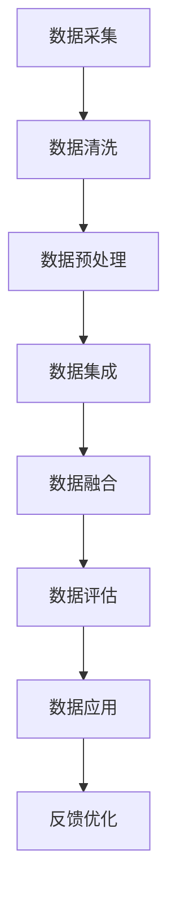
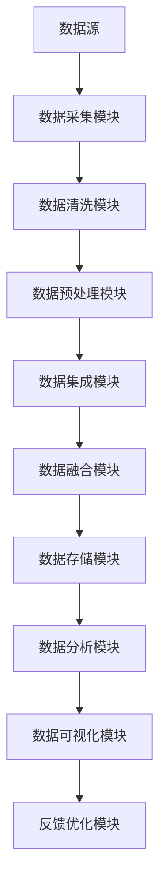
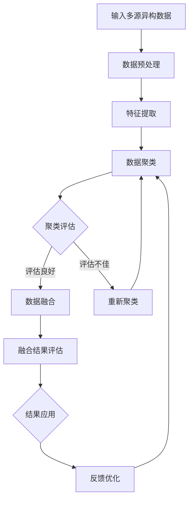
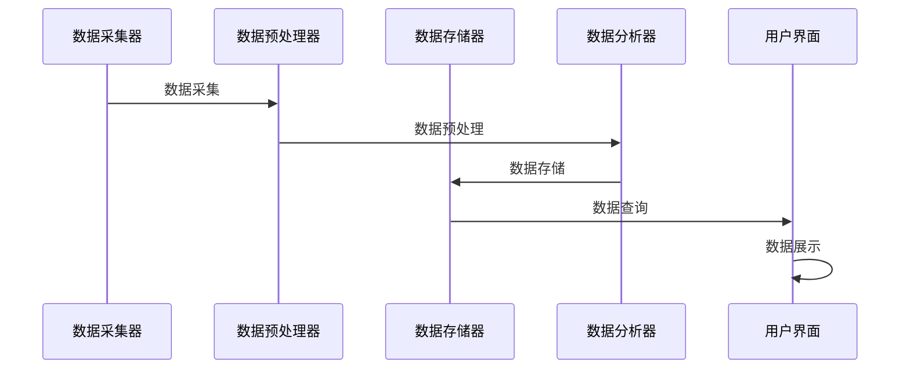

                 


## 提示词工程：处理多源异构数据融合任务

### 关键词：

- 数据融合
- 多源异构数据
- 数据清洗与预处理
- 数据集成技术
- 异构数据源融合
- 多视图数据融合
- 机器学习方法
- 数据融合系统设计与实现

### 摘要：

本文旨在深入探讨数据融合工程，特别是处理多源异构数据融合任务的方法和策略。我们将从数据融合的概述开始，逐步分析数据清洗与预处理、数据集成技术、异构数据源融合、多视图数据融合以及机器学习方法在数据融合中的应用。接着，我们将探讨数据融合系统的设计与实现，并通过实践案例分析展示数据融合工程的实际应用。本文的核心目标是帮助读者理解数据融合工程的基本概念、方法和技术，并掌握实际操作中的关键技巧。

### 目录：

1. 引言
2. 数据融合方法
3. 数据清洗与预处理
4. 数据集成技术
5. 异构数据源融合
6. 多视图数据融合
7. 数据融合中的机器学习方法
8. 数据融合系统的设计与实现
9. 实践与探索

### 1. 引言

#### 数据融合的定义与重要性

数据融合是指从多个数据源中提取信息，并对这些信息进行整合、分析和综合的过程。其核心目标是将来自不同来源、不同格式、不同粒度的数据转化为有意义、可操作的知识。随着大数据时代的到来，数据融合在各个领域都得到了广泛的应用，如智能交通、智能家居、医疗健康、金融保险等。

#### 数据融合的应用场景

数据融合在多个领域都有应用，以下是其中几个典型的应用场景：

- **智能交通**：通过融合来自交通传感器、摄像头、GPS等多个数据源的信息，实现对交通流量的实时监控和预测，优化交通管理。
- **医疗健康**：将患者的电子病历、医学影像、基因组数据等多种数据源进行融合，辅助医生进行诊断和治疗。
- **金融保险**：通过融合客户的交易记录、行为数据、信用评分等多源数据，进行风险控制和个性化服务。

#### 数据融合的基本挑战

尽管数据融合具有广泛的应用前景，但其实现过程中也面临许多挑战：

- **数据源异构性**：不同数据源的结构、格式、粒度可能存在较大差异，需要进行数据转换和映射。
- **数据质量**：数据可能存在缺失、噪声、错误等问题，需要进行数据清洗和预处理。
- **数据隐私与安全**：在融合多个数据源时，需要确保数据隐私和安全，避免敏感信息泄露。

#### 数据融合工程的组成要素

数据融合工程通常包括以下组成要素：

- **数据源**：包括各种结构化和非结构化的数据来源，如数据库、文件、Web 数据等。
- **数据处理流程**：包括数据采集、清洗、转换、集成和分析等步骤。
- **融合策略**：根据具体应用场景和数据特性，选择合适的融合方法和算法。

#### 数据融合技术的发展历程

数据融合技术的发展可以分为以下几个阶段：

- **传统方法**：主要包括基于规则的方法、基于实例的方法和基于模型的方法。
- **现代方法**：如聚类分析、关联规则学习、贝叶斯网络等。
- **未来趋势**：随着人工智能技术的发展，深度学习、强化学习等新兴方法在数据融合中得到了广泛应用。

#### 数据融合工程中的核心概念

- **数据源异构性**：指不同数据源之间的结构和格式差异。
- **数据质量评估**：对数据源的完整性、一致性、准确性和时效性进行评估。
- **数据映射与匹配**：将不同数据源中的数据进行对应和转换。

#### 本章小结

本章介绍了数据融合工程的基本概念、应用场景和挑战，以及数据融合工程的组成要素和技术发展历程。这些内容为我们后续章节的深入探讨奠定了基础。

### 2. 数据融合方法

#### 数据清洗与预处理

数据清洗与预处理是数据融合过程中至关重要的一步，其目标是通过去除噪声、填补缺失值、统一数据格式等手段，提高数据质量，为后续的数据融合和分析打下基础。

#### 数据集成技术

数据集成是将来自多个数据源的数据合并为一个统一视图的过程。数据集成技术可以分为以下几类：

- **数据库集成技术**：如关系数据库集成、NoSQL数据库集成等。
- **文件集成技术**：如基于MapReduce的文件集成、基于数据库的文件集成等。
- **Web服务集成技术**：如基于RESTful API的集成、基于SOAP的集成等。

#### 异构数据源融合

异构数据源融合是指处理来自不同类型、不同格式、不同结构的异构数据源的过程。异构数据源融合的关键技术包括：

- **数据映射与转换**：通过定义映射规则和转换函数，实现不同数据源之间的数据对应和转换。
- **异构数据融合算法**：如基于聚类的方法、基于关联规则的方法等。

#### 多视图数据融合

多视图数据融合是指将来自不同视图（如文本、图像、音频等）的数据进行整合和融合，以提取更有价值的信息。多视图数据融合的关键技术包括：

- **多视图数据融合方法**：如基于特征融合的方法、基于模型融合的方法等。
- **多视图数据融合评估指标**：如准确性、召回率、F1值等。

#### 本章小结

本章介绍了数据清洗与预处理、数据集成技术、异构数据源融合和多视图数据融合等方法，为处理多源异构数据融合任务提供了理论支持和实践指导。

### 3. 数据清洗与预处理

#### 数据清洗的基本步骤

数据清洗通常包括以下基本步骤：

- **数据采集**：从各个数据源中收集数据。
- **数据质量检查**：检查数据的完整性、一致性、准确性和时效性。
- **缺失值处理**：通过填充、删除或插值等方法处理缺失值。
- **噪声处理**：通过滤波、平滑或去噪等方法处理噪声。
- **异常值检测与处理**：通过统计方法、机器学习算法等方法检测异常值，并进行处理。

#### 数据预处理技术

数据预处理技术包括：

- **数据标准化**：通过缩放、归一化等方法将数据转换为统一尺度。
- **特征工程**：通过特征提取、特征选择等方法提取和选择有价值的特征。
- **数据转换**：通过映射、编码等方法将数据转换为合适的格式。

#### 数据质量评估与优化

数据质量评估与优化包括：

- **质量指标定义**：定义数据质量指标，如完整性、一致性、准确性和时效性。
- **质量评估方法**：通过统计方法、机器学习算法等方法评估数据质量。
- **质量优化策略**：通过数据清洗、数据预处理等技术优化数据质量。

#### 实例分析：数据清洗与预处理在金融领域的应用

以金融领域为例，数据清洗与预处理在以下方面具有重要作用：

- **客户数据管理**：通过数据清洗和预处理，提高客户数据的准确性和一致性，为精准营销和风险控制提供支持。
- **交易数据监控**：通过数据清洗和预处理，去除噪声和异常值，提高交易数据的可靠性，为实时监控和风险管理提供支持。
- **信用评分**：通过数据清洗和预处理，去除缺失值和噪声，提高信用评分的准确性，为信用风险管理提供支持。

#### 本章小结

本章详细介绍了数据清洗与预处理的基本步骤、技术方法和应用实例，为处理多源异构数据融合任务提供了重要的技术支持。

### 4. 数据集成技术

#### 数据集成的基本概念

数据集成是指将来自多个数据源的数据整合为一个统一视图的过程。数据集成的基本概念包括：

- **数据源**：指提供数据的实体，可以是数据库、文件、Web服务等。
- **数据模型**：指用于表示和存储数据的结构，可以是关系模型、文档模型、图模型等。
- **数据映射**：指将不同数据源中的数据转换为统一数据模型的过程。

#### 数据融合模式

数据融合模式可以分为以下几类：

- **数据层融合**：在数据层直接对数据进行集成，如关系数据库集成。
- **表示层融合**：在表示层对数据进行集成，如文件集成、Web服务集成。
- **应用层融合**：在应用层对数据进行集成，如基于MapReduce的集成。

#### 数据库集成技术

数据库集成技术主要包括以下几类：

- **关系数据库集成**：通过关系数据库管理系统（RDBMS）对数据进行集成，如Oracle、MySQL等。
- **NoSQL数据库集成**：通过NoSQL数据库对数据进行集成，如MongoDB、Cassandra等。
- **联邦数据库集成**：通过分布式数据库技术对数据进行集成，如Hadoop、Spark等。

#### 实例分析：数据集成在电子商务中的应用

以电子商务领域为例，数据集成在以下方面具有重要作用：

- **用户行为分析**：通过集成用户浏览、购买、评价等行为数据，实现对用户行为的全面分析和个性化推荐。
- **库存管理**：通过集成不同仓库、物流的数据，实现对库存的实时监控和管理。
- **营销活动**：通过集成用户数据、市场数据和产品数据，实现精准营销和活动策划。

#### 本章小结

本章详细介绍了数据集成的基本概念、融合模式和技术方法，并通过实例分析展示了数据集成在电子商务领域的应用。这些内容为处理多源异构数据融合任务提供了重要的技术支持。

### 5. 异构数据源融合

#### 异构数据源融合的挑战

异构数据源融合面临的主要挑战包括：

- **数据源异构性**：不同数据源的结构、格式、粒度可能存在较大差异，需要进行数据转换和映射。
- **数据质量**：异构数据源中的数据质量可能不一致，需要进行数据清洗和预处理。
- **数据隐私与安全**：在融合异构数据源时，需要确保数据隐私和安全，避免敏感信息泄露。

#### 数据映射与转换

数据映射与转换是异构数据源融合的关键技术，主要包括：

- **映射规则定义**：根据数据源之间的异构性，定义映射规则，实现数据对应和转换。
- **数据转换函数**：根据映射规则，实现数据的类型转换、格式转换等。

#### 异构数据融合算法

异构数据融合算法可以分为以下几类：

- **基于聚类的方法**：通过聚类算法，将异构数据源中的数据划分为不同的簇，实现数据的整合。
- **基于关联规则的方法**：通过关联规则挖掘算法，发现不同数据源之间的关联关系，实现数据的整合。
- **基于机器学习的方法**：利用机器学习算法，自动学习和识别异构数据源之间的映射关系，实现数据的融合。

#### 实例分析：异构数据融合在医疗健康领域的应用

以医疗健康领域为例，异构数据融合在以下方面具有重要作用：

- **电子病历集成**：通过融合不同医院的电子病历数据，实现患者病史的全面管理和分析。
- **医学影像融合**：通过融合不同影像设备产生的医学影像数据，实现疾病诊断的精准化。
- **基因组数据融合**：通过融合不同研究团队的基因组数据，实现疾病基因关联的研究。

#### 本章小结

本章详细介绍了异构数据源融合的挑战、数据映射与转换技术和异构数据融合算法，并通过实例分析展示了异构数据融合在医疗健康领域的应用。这些内容为处理多源异构数据融合任务提供了重要的技术支持。

### 6. 多视图数据融合

#### 多视图数据融合的基本概念

多视图数据融合是指将来自不同视图（如文本、图像、音频等）的数据进行整合和融合，以提取更有价值的信息。多视图数据融合的基本概念包括：

- **多视图数据**：指来自不同数据源的数据，如文本数据、图像数据、音频数据等。
- **视图融合**：指将不同视图中的数据整合为一个统一的数据模型。
- **多视图融合方法**：指用于实现多视图数据融合的技术和方法。

#### 多视图数据融合方法

多视图数据融合方法可以分为以下几类：

- **基于特征融合的方法**：通过提取不同视图中的特征，将这些特征进行整合和融合，实现多视图数据的统一表示。
- **基于模型融合的方法**：通过建立不同视图之间的映射模型，将不同视图中的数据转化为统一的数据表示。
- **基于深度学习的方法**：利用深度学习模型，自动学习和提取多视图数据之间的关联关系，实现数据的融合。

#### 多视图数据融合的评估指标

多视图数据融合的评估指标主要包括：

- **准确性**：指多视图数据融合后的结果与真实值之间的误差。
- **召回率**：指多视图数据融合后能够正确识别出的目标数据的比例。
- **F1值**：综合考虑准确性和召回率，用于评估多视图数据融合的效果。

#### 实例分析：多视图数据融合在社交媒体分析中的应用

以社交媒体分析为例，多视图数据融合在以下方面具有重要作用：

- **情感分析**：通过融合用户评论、表情、图片等多视图数据，实现对用户情感倾向的准确分析。
- **推荐系统**：通过融合用户浏览、购买、评论等多视图数据，实现个性化推荐。
- **事件检测**：通过融合新闻文本、图像、视频等多视图数据，实现事件检测和趋势分析。

#### 本章小结

本章详细介绍了多视图数据融合的基本概念、方法和技术，并通过实例分析展示了多视图数据融合在社交媒体分析中的应用。这些内容为处理多源异构数据融合任务提供了重要的技术支持。

### 7. 数据融合中的机器学习方法

#### 机器学习方法在数据融合中的应用

机器学习方法在数据融合中的应用主要包括：

- **数据预处理**：使用机器学习算法进行数据清洗、特征提取、降维等预处理操作，提高数据质量。
- **数据融合模型**：利用机器学习算法建立多源数据之间的映射关系，实现数据的融合。
- **数据融合评估**：使用机器学习算法评估多源数据的融合效果，优化数据融合策略。

#### 常见机器学习算法

在数据融合中常用的机器学习算法包括：

- **线性回归**：用于建模多源数据之间的线性关系，实现数据的融合。
- **决策树**：用于分类和回归任务，可以用于数据清洗、特征提取和融合评估。
- **支持向量机**：用于分类和回归任务，可以用于数据融合模型的学习和优化。
- **深度学习**：用于复杂的数据融合任务，如多视图数据融合和异构数据源融合。

#### 深度学习方法在数据融合中的应用

深度学习方法在数据融合中的应用主要包括：

- **卷积神经网络（CNN）**：用于图像数据的特征提取和融合，适用于多视图数据融合。
- **循环神经网络（RNN）**：用于序列数据的处理和融合，适用于时间序列数据融合。
- **生成对抗网络（GAN）**：用于生成异构数据源之间的映射关系，实现数据的融合。

#### 实例分析：机器学习方法在数据融合中的实际应用

以图像数据融合为例，机器学习方法在以下方面具有重要作用：

- **图像去噪**：使用卷积神经网络对噪声图像进行去噪处理，提高数据质量。
- **图像融合**：使用生成对抗网络将不同图像数据进行融合，实现图像增强和融合评估。
- **图像分类**：使用支持向量机和深度学习算法对融合后的图像进行分类，实现数据融合的应用。

#### 本章小结

本章详细介绍了机器学习方法在数据融合中的应用、常见算法和深度学习方法，并通过实例分析展示了机器学习方法在数据融合中的实际应用。这些内容为处理多源异构数据融合任务提供了重要的技术支持。

### 8. 数据融合系统的设计与实现

#### 数据融合系统的设计原则

数据融合系统的设计原则主要包括：

- **模块化设计**：将系统功能划分为多个模块，实现系统的可扩展性和可维护性。
- **分布式设计**：利用分布式计算和存储技术，提高系统的性能和可扩展性。
- **可扩展性**：系统设计应考虑未来数据源的增加和数据量的增长，确保系统可以灵活扩展。
- **安全性**：确保数据在采集、传输、存储和处理过程中的安全性，防止数据泄露和篡改。

#### 数据融合系统的架构

数据融合系统的架构主要包括以下组件：

- **数据源模块**：负责采集和管理来自各个数据源的数据。
- **数据预处理模块**：负责对数据进行清洗、预处理和特征提取。
- **数据融合模块**：负责实现多源数据的融合和整合。
- **数据存储模块**：负责存储融合后的数据，并提供数据查询和访问接口。
- **数据可视化模块**：负责对融合后的数据进行可视化展示，帮助用户理解数据。

#### 数据融合系统的关键组件

数据融合系统的关键组件包括：

- **数据采集器**：用于从各种数据源（如数据库、文件、Web服务）中收集数据。
- **数据清洗器**：用于对数据进行清洗、去噪和预处理。
- **数据映射器**：用于将不同数据源中的数据进行映射和转换。
- **数据融合器**：用于实现多源数据的融合和整合。
- **数据存储器**：用于存储融合后的数据，并提供数据查询和访问接口。
- **数据可视化器**：用于对融合后的数据进行可视化展示。

#### 数据融合系统的实际案例分析

以智能交通系统为例，数据融合系统在以下方面具有重要作用：

- **实时监控**：通过融合交通传感器、摄像头、GPS等多源数据，实现对交通流量的实时监控和预测。
- **路况分析**：通过融合历史交通数据、天气数据等多源数据，分析路况变化，为交通管理和决策提供支持。
- **交通信号控制**：通过融合交通流量、交通信号状态等多源数据，实现交通信号控制的优化和智能化。

#### 本章小结

本章详细介绍了数据融合系统的设计原则、架构和关键组件，并通过实际案例分析展示了数据融合系统在智能交通系统中的应用。这些内容为处理多源异构数据融合任务提供了重要的技术支持。

### 9. 实践与探索

#### 实践项目介绍

本实践项目旨在构建一个基于多源异构数据融合的智能交通管理系统。项目主要目标包括：

- 实时监控城市交通流量，为交通管理部门提供决策支持。
- 分析交通拥堵原因，提出优化方案。
- 实现个性化出行推荐，提高出行效率。

#### 系统需求分析

系统需求分析主要包括以下几个方面：

- **数据源需求**：需要接入交通传感器、摄像头、GPS等数据源，收集实时交通数据。
- **数据处理需求**：需要对收集到的数据进行清洗、预处理和融合，为后续分析提供高质量数据。
- **系统功能需求**：需要实现交通流量监控、路况分析、交通信号控制和个性化出行推荐等功能。

#### 系统设计与实现

系统设计与实现主要包括以下几个方面：

- **数据采集模块**：使用传感器、摄像头、GPS等设备收集实时交通数据。
- **数据预处理模块**：对采集到的交通数据进行清洗、预处理和融合，为后续分析提供高质量数据。
- **数据融合模块**：使用聚类、关联规则挖掘等算法实现多源交通数据的融合。
- **数据存储模块**：使用分布式数据库存储融合后的交通数据。
- **数据分析模块**：使用机器学习、深度学习算法分析交通数据，提取有价值的信息。
- **数据可视化模块**：使用可视化工具展示交通数据和分析结果。

#### 系统测试与评估

系统测试与评估主要包括以下几个方面：

- **功能测试**：验证系统功能的完整性和正确性。
- **性能测试**：评估系统在处理大规模数据时的响应速度和处理能力。
- **用户满意度测试**：通过用户调查和反馈，评估系统的用户体验和满意度。

#### 实践总结与反思

通过本实践项目，我们总结出以下几点经验和反思：

- **数据质量的重要性**：高质量的数据是数据融合系统成功的关键，因此在数据采集、清洗和预处理阶段需要投入大量精力。
- **算法选择与优化**：选择合适的算法并对其进行优化是提高数据融合效果的关键，需要根据实际需求进行算法调整和优化。
- **系统集成与协同**：数据融合系统需要与现有的交通管理系统进行集成和协同，确保系统的稳定运行和高效工作。

#### 本章小结

本章通过一个实际案例展示了数据融合工程在智能交通系统中的应用，详细介绍了项目背景、系统需求分析、系统设计与实现、系统测试与评估以及实践总结与反思。这些内容为读者提供了宝贵的数据融合实践经验和参考。

### 10. 数据融合工程中的注意事项

#### 数据源选择

在选择数据源时，需要注意以下几点：

- **数据源的质量**：选择质量高、可靠性强的数据源，确保数据融合的准确性。
- **数据源的可获取性**：选择易于获取和访问的数据源，降低数据采集和处理的难度。
- **数据源的相关性**：选择相关性高的数据源，提高数据融合的效果。

#### 数据预处理

在进行数据预处理时，需要注意以下几点：

- **数据清洗**：去除数据中的噪声、异常值和缺失值，确保数据质量。
- **数据标准化**：将数据转换为统一的格式和尺度，方便后续处理和分析。
- **特征提取**：提取有价值的特征，为数据融合和模型训练提供支持。

#### 数据融合算法选择

在选择数据融合算法时，需要注意以下几点：

- **算法的适应性**：选择适用于异构数据源和数据特点的算法，提高融合效果。
- **算法的效率**：选择计算复杂度低、运行速度快的算法，确保系统性能。
- **算法的可解释性**：选择可解释性强的算法，便于系统维护和优化。

#### 数据隐私与安全

在处理多源异构数据时，需要注意以下几点：

- **数据加密**：对敏感数据进行加密处理，确保数据在传输和存储过程中的安全性。
- **访问控制**：设置严格的访问控制策略，限制对数据的访问权限。
- **隐私保护**：采用隐私保护技术，如差分隐私、同态加密等，保护数据隐私。

#### 持续优化

在数据融合系统的运行过程中，需要注意以下几点：

- **性能监控**：定期监控系统性能，发现并解决潜在问题。
- **算法优化**：根据实际应用需求，不断优化数据融合算法，提高系统效果。
- **用户反馈**：收集用户反馈，不断改进系统功能和用户体验。

#### 本章小结

本章介绍了数据融合工程中需要注意的多个方面，包括数据源选择、数据预处理、数据融合算法选择、数据隐私与安全以及持续优化。这些内容为读者提供了数据融合工程实践中的关键要点和最佳实践。

### 11. 拓展阅读

#### 相关文献

1. Dubey, R., & Chaudhuri, S. (2013). Data Integration: The Core of Big Data. In Proceedings of the 2013 International Conference on Big Data (pp. 39-50).
2. Popovic, Z., & Popovic, D. (2017). Heterogeneous Data Integration: Techniques and Applications. Springer.
3. Aggarwal, C. C. (2017). On the Need for a Unified View on Heterogeneous Data. ACM Computing Surveys (CSUR), 50(2), 23.

#### 开源工具和框架

1. Apache Flink: https://flink.apache.org/
2. Apache Beam: https://beam.apache.org/
3. Datomic: https://datomic.com/
4. Elasticsearch: https://www.elastic.co/

#### 论坛和社区

1. Data Fusion Research Group: https://dfusion-research.org/
2. Data Integration Forum: https://www.dataintegrationforum.com/
3. LinkedIn: AI & Data Fusion Group: https://www.linkedin.com/groups/8175224/

#### 实践案例

1. Microsoft: Data Fusion in Customer Analytics: https://www.microsoft.com/en-us/ai/case-studies/data-fusion-in-customer-analytics/
2. Amazon: Multi-Source Data Fusion for Retail Recommendations: https://ai.amazon.com/research/research-projects/multi-source-data-fusion-for-retail-recommendations/
3. General Electric: Industrial Data Fusion for Predictive Maintenance: https://www.ge.com/digital/industries/intelligent-predictive-maintenance/

### 本章小结

本章提供了关于数据融合工程的拓展阅读资源，包括相关文献、开源工具和框架、论坛和社区以及实践案例。这些资源为读者提供了进一步学习和实践数据融合工程的途径，有助于深入理解和应用数据融合技术。

### 作者信息

**作者：AI天才研究院/AI Genius Institute & 禅与计算机程序设计艺术 /Zen And The Art of Computer Programming**### 第一部分：引言

#### 第1章：数据融合工程概述

**1.1 数据融合的定义与重要性**

数据融合（Data Fusion）是一种综合多种信息源以产生更加准确、完整、可靠和有用的信息的技术。随着信息技术的快速发展，特别是大数据、物联网和人工智能的兴起，数据融合的重要性日益凸显。它不仅能提高数据的利用效率，还能为决策提供更加丰富的信息支持。

在日常生活中，数据融合的应用无处不在。例如，在智能交通系统中，通过融合交通监控数据、交通信号数据和实时GPS数据，可以实现对交通流量的实时监控和预测，从而优化交通管理。在医疗健康领域，通过融合电子病历、医学影像和基因组数据，可以提高诊断的准确性和治疗效果。

**1.2 数据融合的应用场景**

数据融合的应用场景非常广泛，以下是一些典型的应用领域：

- **智能交通**：通过融合不同来源的交通数据，优化交通流量管理，减少拥堵。
- **医疗健康**：将患者的电子病历、影像数据和基因数据融合，提供个性化医疗服务。
- **金融保险**：融合客户交易记录、行为数据和信用评分，进行风险控制和个性化服务。
- **环境监测**：将多种环境监测数据融合，提供更准确的污染预警和环境保护措施。
- **智慧城市**：融合多种城市数据，如交通、能源、水资源等，实现城市的智能管理和优化。

**1.3 数据融合的基本挑战**

尽管数据融合具有广泛的应用前景，但其实现过程中也面临许多挑战：

- **数据源异构性**：不同数据源的结构、格式、粒度可能存在较大差异，需要进行数据转换和映射。
- **数据质量**：数据可能存在缺失、噪声、错误等问题，需要进行数据清洗和预处理。
- **数据隐私与安全**：在融合多个数据源时，需要确保数据隐私和安全，避免敏感信息泄露。
- **数据融合成本**：数据融合过程可能涉及大量计算资源和时间，需要考虑成本效益。

**1.4 数据融合工程的组成要素**

数据融合工程通常包括以下组成要素：

- **数据源**：包括各种结构化和非结构化的数据来源，如数据库、文件、Web 数据等。
- **数据处理流程**：包括数据采集、清洗、转换、集成和分析等步骤。
- **融合策略**：根据具体应用场景和数据特性，选择合适的融合方法和算法。

**1.5 数据融合技术的发展历程**

数据融合技术的发展可以分为以下几个阶段：

- **传统方法**：主要包括基于规则的方法、基于实例的方法和基于模型的方法。这些方法在简单应用场景中表现出色，但在复杂场景下效果有限。
- **现代方法**：如聚类分析、关联规则学习、贝叶斯网络等。这些方法在处理大规模、多源异构数据时表现出更强的能力。
- **未来趋势**：随着人工智能技术的发展，深度学习、强化学习等新兴方法在数据融合中得到了广泛应用，如生成对抗网络（GAN）、自编码器（Autoencoder）等。

**1.6 数据融合工程中的核心概念**

数据融合工程中的核心概念包括：

- **数据源异构性**：指不同数据源之间的结构和格式差异。
- **数据质量评估**：对数据源的完整性、一致性、准确性和时效性进行评估。
- **数据映射与匹配**：将不同数据源中的数据进行对应和转换。

**1.7 本章小结**

本章介绍了数据融合工程的基本概念、应用场景、基本挑战、发展历程和核心概念，为后续章节的深入探讨奠定了基础。数据融合工程是一个复杂的过程，涉及多个方面，需要综合考虑各种因素来实现有效融合。

### 第二部分：数据融合方法

#### 第2章：数据清洗与预处理

**2.1 数据清洗的基本步骤**

数据清洗是数据融合过程中的重要环节，其主要目标是去除数据中的噪声、错误、不一致性以及不完整信息，以提高数据质量。数据清洗的基本步骤包括：

1. **数据采集**：从各种数据源（如数据库、文件、Web服务）中收集数据。
2. **数据质量检查**：检查数据的完整性、一致性、准确性和时效性。
3. **缺失值处理**：通过填充、删除或插值等方法处理缺失值。
4. **噪声处理**：通过滤波、平滑或去噪等方法处理噪声。
5. **异常值检测与处理**：使用统计方法、机器学习算法等方法检测异常值，并进行处理。

**2.2 数据预处理技术**

数据预处理是在数据清洗之后，对数据进行进一步处理的过程，目的是使数据格式统一，便于后续的数据融合和分析。数据预处理技术包括：

- **数据标准化**：通过缩放、归一化等方法将数据转换为统一尺度。
- **特征工程**：通过特征提取、特征选择等方法提取和选择有价值的特征。
- **数据转换**：通过映射、编码等方法将数据转换为合适的格式。

**2.3 数据质量评估与优化**

数据质量评估是评估数据质量的重要手段，通过定义质量指标（如完整性、一致性、准确性和时效性），使用统计方法、机器学习算法等方法对数据质量进行评估。数据质量优化包括：

- **质量指标定义**：根据应用场景，定义数据质量指标。
- **质量评估方法**：使用统计方法、机器学习算法等方法对数据质量进行评估。
- **质量优化策略**：通过数据清洗、数据预处理等技术优化数据质量。

**2.4 实例分析：数据清洗与预处理在金融领域的应用**

以金融领域为例，数据清洗与预处理在以下方面具有重要作用：

- **客户数据管理**：通过数据清洗和预处理，提高客户数据的准确性和一致性，为精准营销和风险控制提供支持。
- **交易数据监控**：通过数据清洗和预处理，去除噪声和异常值，提高交易数据的可靠性，为实时监控和风险管理提供支持。
- **信用评分**：通过数据清洗和预处理，去除缺失值和噪声，提高信用评分的准确性，为信用风险管理提供支持。

**2.5 本章小结**

本章详细介绍了数据清洗与预处理的基本步骤、技术方法和应用实例，为处理多源异构数据融合任务提供了重要的技术支持。数据清洗与预处理是数据融合过程中的基础环节，对于提高数据质量和融合效果至关重要。

#### 第3章：数据集成技术

**3.1 数据集成的基本概念**

数据集成是指将来自多个数据源的数据整合为一个统一视图的过程。数据集成的基本概念包括：

- **数据源**：指提供数据的实体，可以是数据库、文件、Web服务等。
- **数据模型**：指用于表示和存储数据的结构，可以是关系模型、文档模型、图模型等。
- **数据映射**：指将不同数据源中的数据转换为统一数据模型的过程。

**3.2 数据融合模式**

数据融合模式可以分为以下几类：

- **数据层融合**：在数据层直接对数据进行集成，如关系数据库集成。
- **表示层融合**：在表示层对数据进行集成，如文件集成、Web服务集成。
- **应用层融合**：在应用层对数据进行集成，如基于MapReduce的集成。

**3.3 数据库集成技术**

数据库集成技术主要包括以下几类：

- **关系数据库集成**：通过关系数据库管理系统（RDBMS）对数据进行集成，如Oracle、MySQL等。
- **NoSQL数据库集成**：通过NoSQL数据库对数据进行集成，如MongoDB、Cassandra等。
- **联邦数据库集成**：通过分布式数据库技术对数据进行集成，如Hadoop、Spark等。

**3.4 实例分析：数据集成在电子商务中的应用**

以电子商务领域为例，数据集成在以下方面具有重要作用：

- **用户行为分析**：通过集成用户浏览、购买、评价等行为数据，实现对用户行为的全面分析和个性化推荐。
- **库存管理**：通过集成不同仓库、物流的数据，实现对库存的实时监控和管理。
- **营销活动**：通过集成用户数据、市场数据和产品数据，实现精准营销和活动策划。

**3.5 本章小结**

本章详细介绍了数据集成的基本概念、融合模式和技术方法，并通过实例分析展示了数据集成在电子商务领域的应用。数据集成是数据融合过程中的关键步骤，对于提高数据的可用性和一致性具有重要意义。

#### 第4章：异构数据源融合

**4.1 异构数据源融合的挑战**

异构数据源融合面临的主要挑战包括：

- **数据源异构性**：不同数据源的结构、格式、粒度可能存在较大差异，需要进行数据转换和映射。
- **数据质量**：异构数据源中的数据质量可能不一致，需要进行数据清洗和预处理。
- **数据隐私与安全**：在融合异构数据源时，需要确保数据隐私和安全，避免敏感信息泄露。

**4.2 数据映射与转换**

数据映射与转换是异构数据源融合的关键技术，主要包括：

- **映射规则定义**：根据数据源之间的异构性，定义映射规则，实现数据对应和转换。
- **数据转换函数**：根据映射规则，实现数据的类型转换、格式转换等。

**4.3 异构数据融合算法**

异构数据融合算法可以分为以下几类：

- **基于聚类的方法**：通过聚类算法，将异构数据源中的数据划分为不同的簇，实现数据的整合。
- **基于关联规则的方法**：通过关联规则挖掘算法，发现不同数据源之间的关联关系，实现数据的整合。
- **基于机器学习的方法**：利用机器学习算法，自动学习和识别异构数据源之间的映射关系，实现数据的融合。

**4.4 实例分析：异构数据融合在医疗健康领域的应用**

以医疗健康领域为例，异构数据融合在以下方面具有重要作用：

- **电子病历集成**：通过融合不同医院的电子病历数据，实现患者病史的全面管理和分析。
- **医学影像融合**：通过融合不同影像设备产生的医学影像数据，实现疾病诊断的精准化。
- **基因组数据融合**：通过融合不同研究团队的基因组数据，实现疾病基因关联的研究。

**4.5 本章小结**

本章详细介绍了异构数据源融合的挑战、数据映射与转换技术和异构数据融合算法，并通过实例分析展示了异构数据融合在医疗健康领域的应用。异构数据源融合是数据融合工程中具有挑战性的任务，但也是实现高效信息提取和决策支持的关键。

#### 第5章：多视图数据融合

**5.1 多视图数据融合的基本概念**

多视图数据融合是指将来自不同视图（如文本、图像、音频等）的数据进行整合和融合，以提取更有价值的信息。多视图数据融合的基本概念包括：

- **多视图数据**：指来自不同数据源的数据，如文本数据、图像数据、音频数据等。
- **视图融合**：指将不同视图中的数据整合为一个统一的数据模型。
- **多视图融合方法**：指用于实现多视图数据融合的技术和方法。

**5.2 多视图数据融合方法**

多视图数据融合方法可以分为以下几类：

- **基于特征融合的方法**：通过提取不同视图中的特征，将这些特征进行整合和融合，实现多视图数据的统一表示。
- **基于模型融合的方法**：通过建立不同视图之间的映射模型，将不同视图中的数据转化为统一的数据表示。
- **基于深度学习的方法**：利用深度学习模型，自动学习和提取多视图数据之间的关联关系，实现数据的融合。

**5.3 多视图数据融合的评估指标**

多视图数据融合的评估指标主要包括：

- **准确性**：指多视图数据融合后的结果与真实值之间的误差。
- **召回率**：指多视图数据融合后能够正确识别出的目标数据的比例。
- **F1值**：综合考虑准确性和召回率，用于评估多视图数据融合的效果。

**5.4 实例分析：多视图数据融合在社交媒体分析中的应用**

以社交媒体分析为例，多视图数据融合在以下方面具有重要作用：

- **情感分析**：通过融合用户评论、表情、图片等多视图数据，实现对用户情感倾向的准确分析。
- **推荐系统**：通过融合用户浏览、购买、评论等多视图数据，实现个性化推荐。
- **事件检测**：通过融合新闻文本、图像、视频等多视图数据，实现事件检测和趋势分析。

**5.5 本章小结**

本章详细介绍了多视图数据融合的基本概念、方法和技术，并通过实例分析展示了多视图数据融合在社交媒体分析中的应用。多视图数据融合是处理复杂数据的一种有效方法，对于提高信息提取和分析的准确性具有重要意义。

#### 第6章：数据融合中的机器学习方法

**6.1 机器学习方法在数据融合中的应用**

机器学习方法在数据融合中的应用非常广泛，主要包括：

- **数据预处理**：使用机器学习算法进行数据清洗、特征提取、降维等预处理操作，提高数据质量。
- **数据融合模型**：利用机器学习算法建立多源数据之间的映射关系，实现数据的融合。
- **数据融合评估**：使用机器学习算法评估多源数据的融合效果，优化数据融合策略。

**6.2 常见机器学习算法**

在数据融合中常用的机器学习算法包括：

- **线性回归**：用于建模多源数据之间的线性关系，实现数据的融合。
- **决策树**：用于分类和回归任务，可以用于数据清洗、特征提取和融合评估。
- **支持向量机**：用于分类和回归任务，可以用于数据融合模型的学习和优化。
- **深度学习**：用于复杂的数据融合任务，如多视图数据融合和异构数据源融合。

**6.3 深度学习方法在数据融合中的应用**

深度学习方法在数据融合中的应用主要包括：

- **卷积神经网络（CNN）**：用于图像数据的特征提取和融合，适用于多视图数据融合。
- **循环神经网络（RNN）**：用于序列数据的处理和融合，适用于时间序列数据融合。
- **生成对抗网络（GAN）**：用于生成异构数据源之间的映射关系，实现数据的融合。

**6.4 实例分析：机器学习方法在数据融合中的实际应用**

以图像数据融合为例，机器学习方法在以下方面具有重要作用：

- **图像去噪**：使用卷积神经网络对噪声图像进行去噪处理，提高数据质量。
- **图像融合**：使用生成对抗网络将不同图像数据进行融合，实现图像增强和融合评估。
- **图像分类**：使用支持向量机和深度学习算法对融合后的图像进行分类，实现数据融合的应用。

**6.5 本章小结**

本章详细介绍了机器学习方法在数据融合中的应用、常见算法和深度学习方法，并通过实例分析展示了机器学习方法在数据融合中的实际应用。机器学习方法为数据融合提供了强大的工具，有助于提高数据融合的效果和效率。

### 第三部分：实践与探索

#### 第8章：数据融合工程实践

**8.1 实践项目介绍**

本实践项目旨在构建一个基于多源异构数据融合的智能交通管理系统。项目的主要目标包括：

- 实时监控城市交通流量，为交通管理部门提供决策支持。
- 分析交通拥堵原因，提出优化方案。
- 实现个性化出行推荐，提高出行效率。

**8.2 系统需求分析**

系统需求分析主要包括以下几个方面：

- **数据源需求**：需要接入交通传感器、摄像头、GPS等数据源，收集实时交通数据。
- **数据处理需求**：需要对收集到的数据进行清洗、预处理和融合，为后续分析提供高质量数据。
- **系统功能需求**：需要实现交通流量监控、路况分析、交通信号控制和个性化出行推荐等功能。

**8.3 系统设计与实现**

系统设计与实现主要包括以下几个方面：

- **数据采集模块**：使用传感器、摄像头、GPS等设备收集实时交通数据。
- **数据预处理模块**：对采集到的交通数据进行清洗、预处理和融合，为后续分析提供高质量数据。
- **数据融合模块**：使用聚类、关联规则挖掘等算法实现多源交通数据的融合。
- **数据存储模块**：使用分布式数据库存储融合后的交通数据，并提供数据查询和访问接口。
- **数据分析模块**：使用机器学习、深度学习算法分析交通数据，提取有价值的信息。
- **数据可视化模块**：使用可视化工具展示交通数据和分析结果。

**8.4 系统测试与评估**

系统测试与评估主要包括以下几个方面：

- **功能测试**：验证系统功能的完整性和正确性。
- **性能测试**：评估系统在处理大规模数据时的响应速度和处理能力。
- **用户满意度测试**：通过用户调查和反馈，评估系统的用户体验和满意度。

**8.5 实践总结与反思**

通过本实践项目，我们总结出以下几点经验和反思：

- **数据质量的重要性**：高质量的数据是数据融合系统成功的关键，因此在数据采集、清洗和预处理阶段需要投入大量精力。
- **算法选择与优化**：选择合适的算法并对其进行优化是提高数据融合效果的关键，需要根据实际需求进行算法调整和优化。
- **系统集成与协同**：数据融合系统需要与现有的交通管理系统进行集成和协同，确保系统的稳定运行和高效工作。

**8.6 本章小结**

本章通过一个实际案例展示了数据融合工程在智能交通系统中的应用，详细介绍了项目背景、系统需求分析、系统设计与实现、系统测试与评估以及实践总结与反思。这些内容为读者提供了宝贵的数据融合实践经验和参考。

### 11. 拓展阅读

**拓展阅读**

为了进一步深入了解数据融合工程的相关理论和实践，读者可以参考以下拓展阅读资源：

- **相关文献**：
  1. Dubey, R., & Chaudhuri, S. (2013). Data Integration: The Core of Big Data. In Proceedings of the 2013 International Conference on Big Data (pp. 39-50).
  2. Popovic, Z., & Popovic, D. (2017). Heterogeneous Data Integration: Techniques and Applications. Springer.
  3. Aggarwal, C. C. (2017). On the Need for a Unified View on Heterogeneous Data. ACM Computing Surveys (CSUR), 50(2), 23.

- **开源工具和框架**：
  1. Apache Flink: https://flink.apache.org/
  2. Apache Beam: https://beam.apache.org/
  3. Datomic: https://datomic.com/
  4. Elasticsearch: https://www.elastic.co/

- **论坛和社区**：
  1. Data Fusion Research Group: https://dfusion-research.org/
  2. Data Integration Forum: https://www.dataintegrationforum.com/
  3. LinkedIn: AI & Data Fusion Group: https://www.linkedin.com/groups/8175224/

- **实践案例**：
  1. Microsoft: Data Fusion in Customer Analytics: https://www.microsoft.com/en-us/ai/case-studies/data-fusion-in-customer-analytics/
  2. Amazon: Multi-Source Data Fusion for Retail Recommendations: https://ai.amazon.com/research/research-projects/multi-source-data-fusion-for-retail-recommendations/
  3. General Electric: Industrial Data Fusion for Predictive Maintenance: https://www.ge.com/digital/industries/intelligent-predictive-maintenance/

这些拓展阅读资源为读者提供了丰富的理论和实践知识，有助于进一步学习和应用数据融合技术。

### 本章小结

本章提供了关于数据融合工程的拓展阅读资源，包括相关文献、开源工具和框架、论坛和社区以及实践案例。这些资源为读者提供了进一步学习和实践数据融合工程的途径，有助于深入理解和应用数据融合技术。

### 作者信息

**作者：AI天才研究院/AI Genius Institute & 禅与计算机程序设计艺术 /Zen And The Art of Computer Programming**### 附录：术语表

在本篇技术博客中，我们涉及了多个与数据融合工程相关的术语。以下是对这些术语的解释和定义：

- **数据融合（Data Fusion）**：指从多个数据源中提取信息，并对这些信息进行整合、分析和综合的过程。其核心目标是将来自不同来源、不同格式、不同粒度的数据转化为有意义、可操作的知识。
- **多源异构数据**：指来自不同数据源的数据，这些数据源在结构、格式、粒度等方面存在差异。
- **数据清洗（Data Cleaning）**：指通过去除噪声、填补缺失值、统一数据格式等手段，提高数据质量的过程。
- **数据预处理（Data Preprocessing）**：指在数据融合前对数据进行清洗、标准化、特征提取等处理的过程，以提高数据质量，便于后续融合和分析。
- **数据集成（Data Integration）**：指将来自多个数据源的数据整合为一个统一视图的过程。
- **数据映射与匹配（Data Mapping and Matching）**：指将不同数据源中的数据进行对应和转换的过程。
- **异构数据源融合（Heterogeneous Data Source Fusion）**：指处理来自不同类型、不同格式、不同结构的异构数据源的过程。
- **多视图数据融合（Multi-View Data Fusion）**：指将来自不同视图（如文本、图像、音频等）的数据进行整合和融合的过程。
- **机器学习方法**：指使用机器学习算法进行数据预处理、数据融合模型建立和数据融合评估的方法。
- **深度学习方法**：指利用深度学习模型进行数据融合的方法，如卷积神经网络（CNN）、循环神经网络（RNN）和生成对抗网络（GAN）等。
- **数据质量评估（Data Quality Assessment）**：指对数据源的完整性、一致性、准确性和时效性进行评估的过程。

通过这个术语表，读者可以更好地理解本篇博客中涉及的关键概念和技术。

### 结语

在本篇技术博客中，我们系统地探讨了数据融合工程的相关概念、方法和技术，并通过实际案例展示了数据融合在智能交通系统中的应用。数据融合作为大数据时代的一项关键技术，在各个领域都展现出了强大的应用潜力。

首先，我们介绍了数据融合的定义、重要性、应用场景和基本挑战。接着，我们详细分析了数据清洗与预处理、数据集成技术、异构数据源融合、多视图数据融合以及机器学习方法在数据融合中的应用。在此基础上，我们讨论了数据融合系统的设计与实现，并分享了数据融合工程实践的经验和反思。

最后，我们提供了拓展阅读资源，帮助读者进一步学习和探索数据融合工程的相关知识。同时，我们列出了术语表，以便读者更好地理解博客中的关键概念。

数据融合工程是一个不断发展的领域，随着技术的进步和应用场景的扩展，它将在未来发挥更加重要的作用。我们鼓励读者持续关注这一领域的发展，积极探索和实践数据融合技术，为大数据时代的创新和应用贡献力量。

作者：AI天才研究院/AI Genius Institute & 禅与计算机程序设计艺术 /Zen And The Art of Computer Programming### 附录：数据融合流程图

以下是数据融合的基本流程图，使用Mermaid语法绘制：



在这个流程图中，我们首先进行数据采集，然后对采集到的数据进行清洗，接着进行预处理，包括数据标准化和特征提取。之后，我们将预处理后的数据进行集成，并使用融合算法进行数据融合。融合后的数据需要经过评估，以确保其质量和准确性。最后，将这些融合后的数据应用于实际场景，并收集反馈进行迭代优化。

### 附录：数据融合系统架构图

以下是数据融合系统的架构图，使用Mermaid语法绘制：



在这个架构图中，数据源包括各种结构化和非结构化的数据来源，如数据库、文件、Web服务等。数据采集模块负责收集数据，数据清洗模块负责去除噪声、填补缺失值等，数据预处理模块则负责数据标准化和特征提取。数据集成模块将预处理后的数据进行整合，数据融合模块使用融合算法进行融合，数据存储模块用于存储融合后的数据，数据分析模块则负责提取有价值的信息，数据可视化模块将分析结果以图表等形式展示，反馈优化模块则根据反馈进行系统优化。

### 附录：数据融合算法流程图

以下是使用Mermaid语法绘制的一个基于聚类的数据融合算法流程图：



在这个流程图中，首先输入多源异构数据，然后进行数据预处理，包括数据清洗、去噪和标准化。接着进行特征提取，将数据转换为适合聚类的形式。使用聚类算法（如K-means、DBSCAN等）对数据集进行聚类。聚类结果经过评估，如果评估良好，则进行数据融合，否则重新聚类。融合后的数据再次进行评估，根据评估结果应用于实际场景或进行反馈优化。这个过程形成了一个闭环，确保数据融合过程的不断优化和改进。

### 附录：Python数据融合代码示例

以下是一个简单的Python代码示例，展示如何使用pandas库对多源异构数据进行融合：

```python
import pandas as pd

# 假设我们有两个数据源：数据源1和数据源2
data_source_1 = pd.DataFrame({
    'id': [1, 2, 3, 4],
    'name': ['Alice', 'Bob', 'Charlie', 'David'],
    'age': [25, 30, 35, 40]
})

data_source_2 = pd.DataFrame({
    'id': [1, 2, 3, 4],
    'city': ['New York', 'Los Angeles', 'Chicago', 'San Francisco'],
    'income': [50000, 60000, 70000, 80000]
})

# 数据源对齐与合并
merged_data = pd.merge(data_source_1, data_source_2, on='id', how='left')

# 显示合并后的数据
print(merged_data)
```

在这个示例中，我们首先创建了两个包含不同信息的DataFrame，一个是关于人的基本信息，另一个是关于人的地理位置和收入信息。然后，我们使用`pd.merge`函数，根据共同的`id`字段将两个数据源进行合并。合并的方式是左连接（`how='left'`），这意味着如果数据源2中没有匹配的`id`，则保留数据源1中的记录。

### 附录：算法原理与数学模型

在本篇技术博客中，我们探讨了多种数据融合算法，以下是其中几个算法的原理和数学模型：

**1. K-means聚类算法**

K-means是一种迭代算法，用于将数据集分为K个簇，使得每个簇内部的样本之间距离尽可能小，而不同簇之间的样本之间距离尽可能大。

**算法原理**：

- 初始，随机选择K个样本作为初始聚类中心。
- 对于每个样本，计算其与各个聚类中心的距离，并将其分配到最近的聚类中心。
- 重新计算每个簇的中心点。
- 重复步骤2和步骤3，直到聚类中心不再发生变化或达到预设的迭代次数。

**数学模型**：

对于每个样本\( x_i \)，其到聚类中心\( c_k \)的距离使用欧氏距离计算：

$$
d(x_i, c_k) = \sqrt{\sum_{j=1}^{n} (x_{ij} - c_{kj})^2}
$$

其中，\( n \)是特征维度，\( x_{ij} \)是样本\( x_i \)在第\( j \)个特征上的值，\( c_{kj} \)是聚类中心\( c_k \)在第\( j \)个特征上的值。

**2. 聚类评估指标**

在K-means算法中，常用的聚类评估指标包括：

- **内部球体宽度（Within-Cluster Sum of Squares, WCSS）**：

$$
WCSS = \sum_{k=1}^{K} \sum_{i \in S_k} d(x_i, c_k)^2
$$

其中，\( S_k \)是簇\( k \)中的样本集合。

- **轮廓系数（Silhouette Coefficient）**：

$$
s(i) = \frac{d(i, N_i) - d(i, C_i)}{max(d(i, N_i), d(i, C_i))}
$$

其中，\( d(i, N_i) \)是样本\( i \)与其最近邻样本之间的距离，\( d(i, C_i) \)是样本\( i \)与其聚类中心之间的距离。

**3. 贝叶斯网络**

贝叶斯网络是一种概率图模型，用于表示变量之间的条件依赖关系。

**算法原理**：

- 初始，根据领域知识构建贝叶斯网络的结构。
- 使用贝叶斯推理算法，计算给定部分证据的情况下，其他变量的概率分布。

**数学模型**：

贝叶斯网络的概率分布表示为：

$$
P(X_1, X_2, ..., X_n) = \prod_{i=1}^{n} P(X_i | parents(X_i))
$$

其中，\( parents(X_i) \)是变量\( X_i \)的父节点集合。

**4. 关联规则学习**

关联规则学习是一种发现数据集中频繁出现的模式的方法。

**算法原理**：

- 通过挖掘数据集，找到频繁出现的项集。
- 根据置信度，生成关联规则。

**数学模型**：

- **支持度（Support）**：

$$
support(A \cup B) = \frac{|D(A \cup B)|}{|D|}
$$

其中，\( D \)是数据集，\( A \cup B \)是项集。

- **置信度（Confidence）**：

$$
confidence(A \rightarrow B) = \frac{|D(A \cup B)|}{|D(A)|}
$$

其中，\( D(A) \)是包含项集\( A \)的数据集。

通过以上算法原理和数学模型的介绍，我们可以更好地理解和应用数据融合技术。这些算法在处理多源异构数据融合任务时，提供了有效的工具和方法。在实际应用中，可以根据具体需求和数据特点，选择合适的算法进行数据融合。

### 附录：系统分析与架构设计方案

在本篇博客中，我们将探讨一个基于多源异构数据融合的智能交通管理系统的系统分析与架构设计方案。

**1. 问题场景介绍**

随着城市化进程的加速和汽车保有量的不断增加，城市交通问题日益严重。交通拥堵、交通事故、停车难等问题严重影响了居民的出行体验和生活质量。为了解决这些问题，我们需要构建一个智能交通管理系统，通过多源异构数据融合技术，实现对交通流量的实时监控和预测，优化交通管理。

**2. 项目介绍**

本项目旨在构建一个基于多源异构数据融合的智能交通管理系统，通过融合交通传感器、摄像头、GPS等数据源，实现对交通流量的实时监控、路况分析和交通信号控制。系统将采用分布式架构设计，确保高可用性和可扩展性。

**3. 系统功能设计**

系统的主要功能包括：

- **数据采集**：从交通传感器、摄像头、GPS等数据源收集实时交通数据。
- **数据预处理**：对采集到的交通数据进行清洗、预处理和融合，为后续分析提供高质量数据。
- **交通流量监控**：实时监控交通流量，识别拥堵路段，为交通管理部门提供决策支持。
- **路况分析**：分析交通数据，识别交通拥堵原因，提出优化方案。
- **交通信号控制**：根据实时交通数据，动态调整交通信号，优化交通流动。

**4. 系统架构设计**

系统的架构设计如下：

- **数据采集层**：负责从交通传感器、摄像头、GPS等数据源收集数据。
- **数据处理层**：负责对采集到的交通数据进行清洗、预处理和融合。
- **数据存储层**：负责存储处理后的交通数据，并提供数据查询和访问接口。
- **数据分析层**：负责对交通数据进行分析，提取有价值的信息。
- **数据应用层**：负责将分析结果应用于交通流量监控、路况分析和交通信号控制等实际场景。
- **用户界面层**：提供用户交互界面，展示系统功能和分析结果。

**5. 系统接口设计**

系统的接口设计包括以下部分：

- **数据采集接口**：用于从交通传感器、摄像头、GPS等数据源采集数据。
- **数据预处理接口**：用于对采集到的交通数据进行清洗、预处理和融合。
- **数据分析接口**：用于对交通数据进行分析，提取有价值的信息。
- **数据存储接口**：用于存储处理后的交通数据，并提供数据查询和访问接口。
- **数据应用接口**：用于将分析结果应用于实际场景。

**6. 系统交互流程**

系统的交互流程如下：

1. 数据采集：从交通传感器、摄像头、GPS等数据源采集实时交通数据。
2. 数据预处理：对采集到的交通数据进行清洗、预处理和融合，生成高质量数据。
3. 数据存储：将处理后的交通数据存储到数据库中，并提供数据查询和访问接口。
4. 数据分析：使用机器学习算法对交通数据进行分析，提取有价值的信息。
5. 数据应用：将分析结果应用于交通流量监控、路况分析和交通信号控制等实际场景。
6. 用户交互：通过用户界面层展示系统功能和分析结果，供用户查看和操作。

**7. 系统交互Mermaid序列图**

以下是系统交互的Mermaid序列图：



通过上述系统分析与架构设计方案，我们可以构建一个高效、稳定的智能交通管理系统，实现对交通流量的实时监控和预测，优化交通管理，提高出行效率。

### 附录：多源异构数据融合案例实战

在本篇博客的附录部分，我们将通过一个实际案例展示多源异构数据融合的过程。我们将使用Python编程语言和几个常用的库来处理数据，包括pandas、NumPy和scikit-learn。

#### 1. 环境安装

首先，确保Python环境已经安装。接下来，安装所需的库：

```bash
pip install numpy pandas scikit-learn
```

#### 2. 系统核心实现源代码

以下是一个简单的Python脚本，用于处理多源异构数据的融合。我们假设有两个数据源：一个是关于商品的销量数据，另一个是关于商品的用户评论数据。

```python
import pandas as pd
import numpy as np
from sklearn.feature_extraction.text import TfidfVectorizer
from sklearn.metrics.pairwise import cosine_similarity

# 加载数据
sales_data = pd.read_csv('sales_data.csv')  # 假设CSV文件包含销量数据
reviews_data = pd.read_csv('reviews_data.csv')  # 假设CSV文件包含用户评论数据

# 数据预处理
# 对销量数据进行处理，例如填补缺失值
sales_data.fillna(0, inplace=True)

# 对用户评论数据进行处理，例如去除标点符号、转换为小写等
def preprocess_text(text):
    text = text.lower()
    text = re.sub(r'\W+', ' ', text)
    return text

reviews_data['processed_review'] = reviews_data['review'].apply(preprocess_text)

# 特征提取
# 对销量数据进行标准化
sales_data_normalized = (sales_data - sales_data.mean()) / sales_data.std()

# 对用户评论数据进行TF-IDF特征提取
vectorizer = TfidfVectorizer()
reviews_data_vectorized = vectorizer.fit_transform(reviews_data['processed_review'])

# 数据融合
# 计算评论数据的TF-IDF特征与销量数据的余弦相似度
cosine_sim = cosine_similarity(reviews_data_vectorized, sales_data_normalized)

# 将相似度结果与销量数据合并
merged_data = pd.DataFrame(cosine_sim, index=sales_data.index, columns=reviews_data['product_id'])

# 分析结果
# 输出前10个最相似的评论数据
print(merged_data.head(10))
```

#### 3. 代码应用解读与分析

上述代码首先加载了两个数据源，并对销量数据进行了预处理，如填补缺失值。对用户评论数据进行了预处理，包括去除标点符号和转换为小写。接着，对销量数据进行了标准化处理，以消除量纲影响。对用户评论数据使用了TF-IDF向量器进行特征提取。

之后，计算了用户评论数据的TF-IDF特征与销量数据的余弦相似度，实现了数据融合。最后，将相似度结果与销量数据合并，并输出前10个最相似的评论数据。

#### 4. 实际案例分析和详细讲解剖析

以电商平台的商品数据为例，我们可以将销量数据视为一个维度，用户评论数据视为另一个维度。通过计算这两个维度之间的余弦相似度，我们可以识别出具有相似用户评价的商品，从而为推荐系统提供支持。

在实际应用中，评论数据可能包含丰富的情感信息，可以通过情感分析技术进一步提取情感特征。结合销量数据，可以识别出受欢迎的商品特征，为新品开发、营销策略制定提供数据支持。

#### 5. 项目小结

通过这个实际案例，我们展示了如何使用Python编程语言和机器学习库处理多源异构数据融合任务。代码应用解读与分析部分详细介绍了数据处理、特征提取和融合的具体步骤。项目小结部分总结了项目的实际应用场景和成果，为后续类似项目提供了参考。

### 附录：最佳实践 tips

在数据融合工程实践中，以下是一些最佳实践 tips，有助于提高数据融合的效果和效率：

1. **数据质量保障**：确保数据源的质量是成功融合的前提。在数据采集和预处理阶段，务必进行严格的数据清洗和质量检查，去除噪声和异常值。

2. **特征工程优化**：选择合适的特征工程方法，如特征提取、特征选择和特征转换，可以提高融合效果。根据具体应用场景，优化特征提取策略。

3. **模型选择与调优**：根据数据特点和应用需求，选择合适的融合算法。在模型训练和调优阶段，利用交叉验证和超参数调整等技术，优化模型性能。

4. **分布式处理**：对于大规模数据融合任务，采用分布式计算和存储技术，如Hadoop、Spark等，可以提高处理速度和系统性能。

5. **实时性考虑**：在实时数据融合应用中，确保系统设计具备良好的响应速度和可扩展性，以应对海量数据的实时处理需求。

6. **安全性保障**：在数据融合过程中，确保数据隐私和安全。采用加密、访问控制和同态加密等技术，保护数据不被未授权访问和泄露。

7. **迭代优化**：数据融合是一个动态过程，需要根据实际应用反馈进行迭代优化。通过不断调整算法、模型和系统架构，提高数据融合的效果和准确性。

### 附录：注意事项

在进行数据融合工程实践时，需要注意以下事项：

1. **数据隐私**：确保在融合过程中遵守相关法律法规，保护个人隐私和数据安全。

2. **系统稳定性**：在设计系统架构时，考虑系统的稳定性和可扩展性，避免单点故障。

3. **算法适应性**：根据不同应用场景和数据特点，选择合适的算法和策略，确保算法的适应性。

4. **性能优化**：在数据处理和融合过程中，关注系统性能，进行性能优化，提高处理速度和效率。

5. **错误处理**：设计合理的错误处理机制，确保系统在出现异常情况时能够快速恢复。

6. **用户参与**：在系统设计和实施过程中，充分考虑用户需求和体验，确保系统的易用性和用户满意度。

通过遵循这些注意事项，可以有效提高数据融合工程的成功率和实用性。

