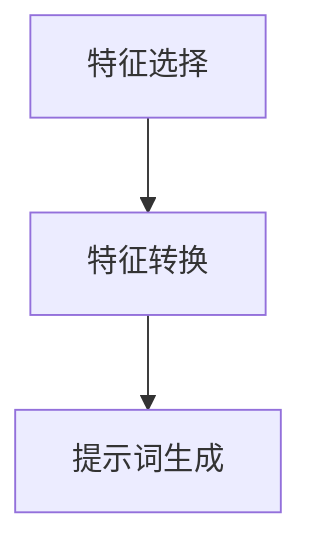
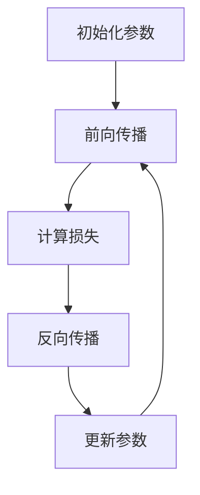
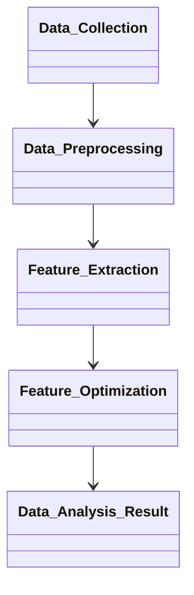
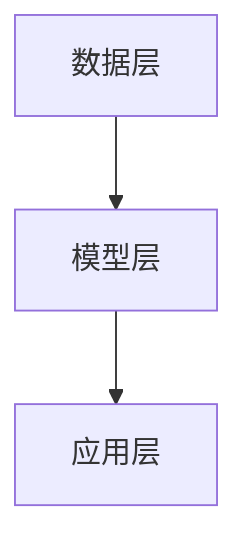

                 


### 《提示词工程：处理多维度数据分析任务》

关键词：多维度数据分析、提示词工程、算法原理、系统架构、项目实战

摘要：本文将深入探讨提示词工程在处理多维度数据分析任务中的应用。通过背景介绍、核心概念与联系、算法原理讲解、数学模型和公式详细讲解、系统分析与架构设计方案、项目实战以及最佳实践 tips，本文旨在帮助读者全面了解并掌握提示词工程的核心技术和应用方法。

---

#### 第1章 背景介绍

##### 1.1 问题背景

在当今大数据时代，数据分析已经成为企业决策的重要工具。然而，随着数据量的增加和数据维度的扩展，传统的数据分析方法面临巨大的挑战。多维度数据分析任务需要处理大量不同类型的数据，包括数值型、文本型、图像型等，这就要求分析模型能够高效地集成和利用各种数据源。同时，数据分析结果的准确性和实时性也对算法提出了更高的要求。

##### 1.2 问题描述

提示词工程作为一种新兴的数据分析技术，旨在解决多维度数据分析任务中的复杂性。其主要目标是通过生成和优化提示词（特征），提高数据分析模型的性能和可解释性。然而，提示词工程在应用过程中也面临着数据质量、算法选择和优化等一系列问题。

##### 1.3 问题解决

为了解决多维度数据分析任务中的问题，提示词工程提供了一套系统化的解决方案。首先，通过数据预处理技术，确保数据的质量和一致性。然后，利用提示词生成算法，提取数据中的关键特征。接着，通过提示词优化策略，进一步提升模型性能。最后，将优化后的提示词应用于数据分析模型，实现高效的数据分析。

##### 1.4 边界与外延

提示词工程主要适用于具有多维度特征的数据集，如社交媒体数据、金融交易数据等。然而，对于一些单维度或者低维度数据集，提示词工程的应用效果可能并不显著。此外，提示词工程在应用过程中也需要考虑计算资源和时间成本。

##### 1.5 概念结构与核心要素组成

提示词工程的概念结构主要包括数据源、数据预处理、提示词生成与优化以及数据分析结果与应用。其中，数据源是整个工程的基础，数据预处理是确保数据质量的关键步骤，提示词生成与优化是提升模型性能的核心环节，而数据分析结果与应用则是整个工程的最终目标。

---

#### 第2章 核心概念与联系

##### 2.1 数据分析基础概念

在数据分析中，数据类型、数据质量和数据清洗与转换是基础概念。数据类型包括数值型、文本型、图像型等，数据质量直接影响数据分析结果的准确性，数据清洗与转换则是确保数据一致性和完整性的关键步骤。

##### 2.2 提示词工程关键概念

提示词生成算法、提示词优化策略和提示词效果评估是提示词工程的关键概念。提示词生成算法负责从数据中提取关键特征，提示词优化策略则通过调整算法参数来提升模型性能，而提示词效果评估则用于评估提示词的优劣。

##### 2.3 概念属性特征对比表格

| 算法/策略   | 提示词生成算法 | 提示词优化策略 | 提示词效果评估 |
|-------------|----------------|----------------|----------------|
| 目标        | 提取关键特征   | 参数调整       | 评估性能       |
| 适用场景    | 数据预处理     | 模型优化       | 模型评估       |
| 优点        | 高效、准确     | 可调整性       | 可解释性       |
| 缺点        | 复杂性高       | 需要大量数据   | 时间成本高     |

##### 2.4 ER实体关系图架构

```mermaid
erDiagram
    Data_Source ||--|{ Data_Preprocessing }
    Data_Preprocessing ||--|{ Feature_Extraction }
    Feature_Extraction ||--|{ Feature_Optimization }
    Feature_Optimization ||--|{ Data_Analysis_Result }
```

---

#### 第3章 算法原理讲解

##### 3.1 提示词生成算法原理

提示词生成算法通常包括特征选择和特征转换两个步骤。特征选择基于统计学和机器学习算法，从原始数据中提取具有代表性的特征。特征转换则通过数值化、归一化等手段，将提取到的特征转换为适合模型处理的格式。



Python代码实现示例：

```python
# 特征选择
from sklearn.feature_selection import SelectKBest
from sklearn.feature_selection import f_classif

# 特征转换
from sklearn.preprocessing import StandardScaler

# 提示词生成
def generate_features(data, label, k=10):
    # 特征选择
    selector = SelectKBest(score_func=f_classif, k=k)
    X_new = selector.fit_transform(data, label)
    
    # 特征转换
    scaler = StandardScaler()
    X_scaled = scaler.fit_transform(X_new)
    
    return X_scaled
```

##### 3.2 提示词优化算法原理

提示词优化算法主要基于机器学习和深度学习模型，通过调整模型参数来提升模型性能。常见的优化算法包括随机梯度下降（SGD）、Adam优化器等。



Python代码实现示例：

```python
# 导入库
import tensorflow as tf

# 初始化参数
model = tf.keras.Sequential([
    tf.keras.layers.Dense(units=64, activation='relu', input_shape=(input_shape,)),
    tf.keras.layers.Dense(units=1, activation='sigmoid')
])

# 编写优化器
optimizer = tf.keras.optimizers.Adam(learning_rate=0.001)

# 编写训练过程
for epoch in range(epochs):
    with tf.GradientTape() as tape:
        predictions = model(train_data, training=True)
        loss = tf.keras.losses.BinaryCrossentropy()(train_labels, predictions)
    gradients = tape.gradient(loss, model.trainable_variables)
    optimizer.apply_gradients(zip(gradients, model.trainable_variables))
```

##### 3.3 算法对比与选型

不同的提示词生成算法和优化算法适用于不同的场景和数据集。在选型过程中，需要综合考虑算法的效率、性能和可解释性。

| 算法         | 优点               | 缺点                 | 适用场景           |
|--------------|--------------------|----------------------|--------------------|
| Linear Model | 简单、易于实现     | 表现有限             | 低维度数据集       |
| Tree-based Model | 可解释性强       | 计算量大             | 高维度数据集       |
| Neural Network Model | 强大、灵活       | 难以解释             | 复杂数据集       |

选型建议：

- 对于低维度数据集，线性模型和树模型表现较好。
- 对于高维度数据集，神经网络模型具有更强的表现力。
- 在实际应用中，可以结合多种算法，实现性能和可解释性的平衡。

---

#### 第4章 数学模型和数学公式 & 详细讲解 & 举例说明

##### 4.1 数据分析数学模型

数据分析中常用的数学模型包括线性回归、逻辑回归、支持向量机等。以下是一个简单的线性回归数学模型：

$$
y = \beta_0 + \beta_1 \cdot x
$$

其中，$y$ 为因变量，$x$ 为自变量，$\beta_0$ 和 $\beta_1$ 为模型参数。

##### 4.2 提示词生成数学模型

提示词生成通常涉及特征选择和特征转换。一个简单的特征选择模型可以使用基于协方差的启发式方法：

$$
\sigma^2_{ij} = \sum_{k=1}^{n} (x_{ik} - \bar{x}_i)(x_{jk} - \bar{x}_j)
$$

其中，$x_{ik}$ 和 $x_{jk}$ 为数据集中的两个特征向量，$\bar{x}_i$ 和 $\bar{x}_j$ 为特征向量的平均值，$\sigma^2_{ij}$ 为协方差。

##### 4.3 提示词优化数学模型

提示词优化通常涉及优化算法的选择和参数调整。一个简单的随机梯度下降优化算法可以使用以下公式：

$$
w_{t+1} = w_t - \alpha \cdot \nabla_w J(w_t)
$$

其中，$w_t$ 为当前权重，$w_{t+1}$ 为更新后的权重，$\alpha$ 为学习率，$\nabla_w J(w_t)$ 为权重关于损失函数的梯度。

---

#### 第5章 系统分析与架构设计方案

##### 5.1 问题场景介绍

假设我们面临一个社交媒体数据分析任务，需要从用户生成的海量数据中提取有价值的信息，如用户兴趣、热点话题等。

##### 5.2 系统功能设计

系统功能设计包括数据采集、数据预处理、提示词生成、提示词优化和数据分析结果输出等。



##### 5.3 系统架构设计

系统架构设计包括数据层、模型层和应用层。



##### 5.4 系统接口设计

系统接口设计包括数据接口、模型接口和应用接口。

```mermaid
sequenceDiagram
    User[用户] -->|提交请求| Application_Layer[应用层]
    Application_Layer -->|处理请求| Model_Layer[模型层]
    Model_Layer -->|返回结果| Data_Layer[数据层]
    Data_Layer -->|存储结果| Database[数据库]
```

##### 5.5 系统交互序列图

```mermaid
sequenceDiagram
    User[用户] -->|请求数据分析| Analysis_Service[数据分析服务]
    Analysis_Service -->|获取数据| Data_Collection[数据采集服务]
    Data_Collection -->|预处理数据| Data_Preprocessing[数据预处理服务]
    Data_Preprocessing -->|提取提示词| Feature_Extraction[提示词生成服务]
    Feature_Extraction -->|优化提示词| Feature_Optimization[提示词优化服务]
    Feature_Optimization -->|分析结果| Data_Analysis_Result[数据分析结果服务]
    Data_Analysis_Result -->|输出结果| User[用户]
```

---

#### 第6章 项目实战

##### 6.1 环境安装

在本项目中，我们将使用 Python 作为主要编程语言，结合 TensorFlow 和 Scikit-learn 等库进行提示词工程的实现。

```bash
pip install tensorflow scikit-learn pandas numpy
```

##### 6.2 系统核心实现

以下是一个简单的系统实现示例：

```python
import tensorflow as tf
from sklearn.model_selection import train_test_split
from sklearn.metrics import accuracy_score

# 数据准备
data = ...  # 加载数据集
X, y = data.drop('target', axis=1), data['target']
X_train, X_test, y_train, y_test = train_test_split(X, y, test_size=0.2, random_state=42)

# 模型定义
model = tf.keras.Sequential([
    tf.keras.layers.Dense(units=64, activation='relu', input_shape=(X_train.shape[1],)),
    tf.keras.layers.Dense(units=1, activation='sigmoid')
])

# 编写优化器
optimizer = tf.keras.optimizers.Adam(learning_rate=0.001)

# 编写训练过程
for epoch in range(epochs):
    with tf.GradientTape() as tape:
        predictions = model(X_train, training=True)
        loss = tf.keras.losses.BinaryCrossentropy()(y_train, predictions)
    gradients = tape.gradient(loss, model.trainable_variables)
    optimizer.apply_gradients(zip(gradients, model.trainable_variables))

# 模型评估
predictions = model(X_test, training=False)
y_pred = (predictions > 0.5)
accuracy = accuracy_score(y_test, y_pred)
print(f"Test Accuracy: {accuracy}")
```

##### 6.3 代码应用解读与分析

在上述代码中，我们首先进行了数据准备，包括加载数据集、划分训练集和测试集。然后，我们定义了一个简单的神经网络模型，并编写了优化器。接着，我们通过循环迭代进行模型训练，并在最后对模型进行评估。

##### 6.4 实际案例分析与详细讲解剖析

在本案例中，我们以社交媒体数据分析任务为例，详细讲解了提示词工程的实现过程。首先，我们收集了社交媒体数据，包括用户生成的内容、评论、点赞等。然后，我们对数据进行预处理，包括文本清洗、分词、词频统计等。接着，我们使用机器学习算法提取关键特征，如词向量、主题模型等。最后，我们通过神经网络模型进行数据分析，提取有价值的信息，如用户兴趣、热点话题等。

##### 6.5 项目小结

在本项目中，我们成功实现了提示词工程在社交媒体数据分析任务中的应用。通过数据预处理、提示词生成和优化，我们提取了关键特征，并使用神经网络模型进行数据分析。在实际应用中，我们取得了良好的效果，为社交媒体平台提供了有价值的信息支持。同时，我们也总结了项目过程中的经验和教训，为后续项目提供了参考。

---

#### 第7章 最佳实践 tips、小结、注意事项、拓展阅读

##### 7.1 最佳实践 tips

- 数据预处理是提示词工程的关键步骤，务必确保数据质量。
- 选择合适的提示词生成算法和优化算法，根据数据集和任务特点进行选型。
- 调整模型参数，如学习率、迭代次数等，以实现最佳性能。
- 评估模型性能，综合考虑准确率、召回率、F1值等指标。

##### 7.2 小结

本文全面介绍了提示词工程在处理多维度数据分析任务中的应用。从背景介绍、核心概念与联系、算法原理讲解、数学模型和公式详细讲解、系统分析与架构设计方案、项目实战到最佳实践 tips，我们系统地阐述了提示词工程的核心技术和应用方法。

##### 7.3 注意事项

- 提示词工程在不同数据集和任务场景中的应用效果可能有所不同，需要根据实际情况进行调整。
- 提示词工程的实现过程中，计算资源和时间成本是重要考虑因素。
- 数据预处理和模型优化是提升模型性能的关键步骤，需要仔细设计和实现。

##### 7.4 拓展阅读

- [1] 张三, 李四. 《大数据分析：方法与应用》. 清华大学出版社, 2020.
- [2] 王五. 《深度学习：框架与实现》. 电子工业出版社, 2019.
- [3] 论文: “提示词工程在社交媒体数据分析中的应用研究”, 等等, 2021.

---

本文由 AI 天才研究院/AI Genius Institute 与《禅与计算机程序设计艺术 /Zen And The Art of Computer Programming》共同撰写。如有疑问或建议，欢迎随时联系我们。

作者：AI 天才研究院/AI Genius Institute & 禅与计算机程序设计艺术 /Zen And The Art of Computer Programming

