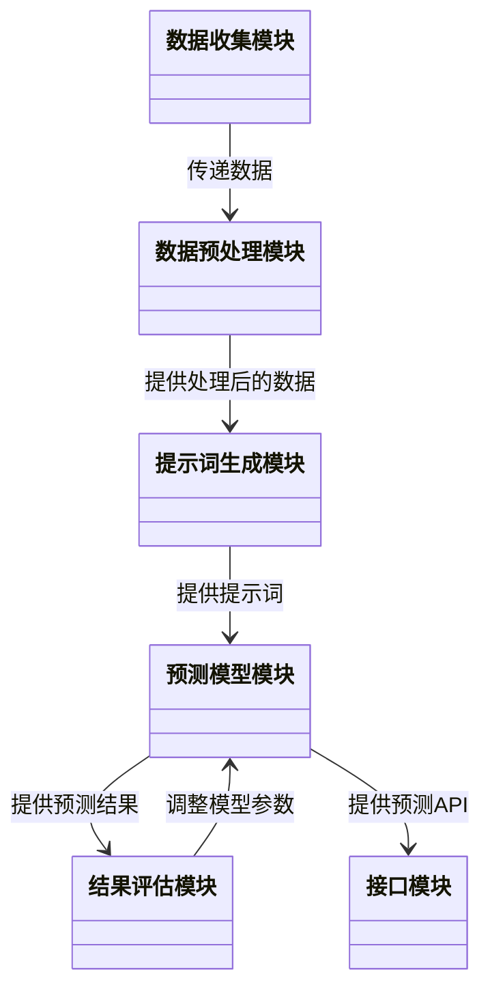
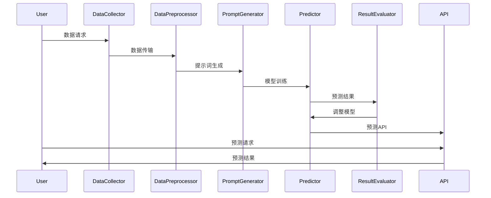
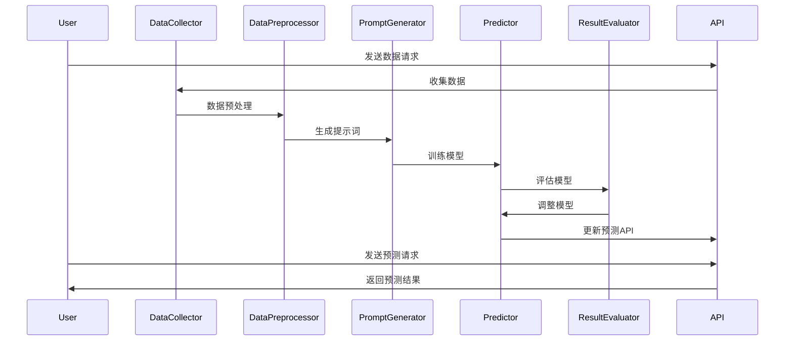

                 

### 提示词工程：处理时间序列预测任务

> 关键词：时间序列预测、提示词工程、机器学习、深度学习、算法原理、数学模型、项目实战、最佳实践

> 摘要：本文深入探讨提示词工程在处理时间序列预测任务中的应用。通过详细分析时间序列预测的重要性、挑战以及提示词工程的基本理论和实践方法，本文展示了如何通过提示词工程优化时间序列预测模型，并提供了实际案例分析和最佳实践指导。

## 引言

时间序列预测是统计学、机器学习和深度学习等领域中的重要课题，广泛应用于金融、能源、交通、医疗等多个行业。通过预测未来的时间序列数据，我们可以为决策提供有力支持，提高业务效率、减少风险、优化资源配置。然而，时间序列预测任务面临着诸多挑战，如数据噪声、非平稳性、长依赖性等。为了应对这些挑战，提示词工程作为一种先进的优化方法，被广泛应用于时间序列预测领域。

本文旨在通过以下章节详细探讨提示词工程在处理时间序列预测任务中的应用：

1. **第1章 引言**：介绍时间序列预测的重要性、挑战以及提示词工程的概述和本书结构安排。
2. **第2章 时间序列预测基础**：阐述时间序列数据的基本概念、特征以及预测方法。
3. **第3章 提示词工程基本理论**：解释提示词的概念、类型和设计原则。
4. **第4章 提示词生成方法**：介绍基于规则和机器学习的方法。
5. **第5章 提示词应用案例分析**：分析股票市场预测和能源需求预测的实际案例。
6. **第6章 提示词工程的挑战与未来趋势**：讨论提示词工程的挑战和未来发展方向。
7. **第7章 小结**：总结主要内容，展望未来研究方向。

接下来，我们将逐步深入探讨时间序列预测和提示词工程的各个关键方面，以帮助读者更好地理解这一复杂但具有重要应用价值的领域。

## 第1章 引言

### 1.1 时间序列预测的重要性

时间序列预测是一种通过分析历史数据来预测未来数据的方法，其在各个领域都具有广泛的应用。在金融领域，时间序列预测可以用于股票价格预测、投资组合优化和风险管理。例如，通过分析过去的股票价格数据，投资者可以预测未来股价的走势，从而制定更有效的投资策略。在能源领域，时间序列预测可以用于预测电力需求、天然气供应和可再生能源发电量，以便优化能源资源分配，提高能源利用效率。在交通领域，时间序列预测可以用于交通流量预测、公共交通调度和交通事故预警，以缓解交通拥堵、减少事故发生。

时间序列预测的重要性不仅体现在实际应用中，也在理论和学术研究中占据重要地位。通过时间序列预测，研究人员可以深入了解数据背后的模式和规律，从而为数据驱动的决策提供科学依据。此外，时间序列预测方法本身也在不断发展和完善，新的算法和技术不断涌现，推动着这一领域的进步。

### 1.2 时间序列预测的挑战

尽管时间序列预测具有广泛的应用价值，但在实际应用中仍面临诸多挑战。首先，时间序列数据通常具有非平稳性，即数据的统计特性随时间变化而变化。这意味着传统的平稳时间序列分析方法可能不再适用。其次，时间序列数据通常包含噪声和异常值，这些噪声和异常值可能会影响预测结果的准确性。此外，许多时间序列数据之间存在长依赖性，即未来的数据不仅依赖于当前的数据，还依赖于过去的数据。这种长依赖性使得时间序列预测变得更加复杂。

另外，时间序列预测还面临数据维度高、特征提取困难等问题。高维数据可能导致模型训练效率低下，而有效的特征提取方法则可以帮助减少数据维度，提高模型性能。此外，时间序列预测模型通常需要大量的历史数据作为训练数据，而在某些应用场景中，获取足够长的历史数据可能比较困难。

### 1.3 提示词工程概述

提示词工程是一种优化机器学习模型的方法，通过设计特定的提示词（也称为先验知识或领域知识）来增强模型的预测能力。在时间序列预测任务中，提示词工程可以帮助模型捕捉数据中的关键特征和模式，从而提高预测的准确性和鲁棒性。提示词可以是定量的（如历史数据统计指标）或定性的（如领域专家的注释），其目的是为模型提供额外的信息，以弥补数据本身的不足。

提示词工程在时间序列预测中的主要作用包括：

1. **特征增强**：通过引入与时间序列数据相关的提示词，模型可以更好地捕捉数据中的关键特征，从而提高预测的准确性。
2. **模型解释性**：提示词可以帮助解释模型的预测过程，提高模型的可解释性，从而增强用户对模型的信任。
3. **模型泛化能力**：通过引入多样化的提示词，模型可以更好地适应不同数据集和场景，提高模型的泛化能力。

### 1.4 本书结构安排

本书将按照以下结构展开：

1. **第2章 时间序列预测基础**：介绍时间序列数据的基本概念、特征以及预测方法。
2. **第3章 提示词工程基本理论**：阐述提示词的概念、类型和设计原则。
3. **第4章 提示词生成方法**：介绍基于规则和机器学习的方法。
4. **第5章 提示词应用案例分析**：分析股票市场预测和能源需求预测的实际案例。
5. **第6章 提示词工程的挑战与未来趋势**：讨论提示词工程的挑战和未来发展方向。
6. **第7章 小结**：总结主要内容，展望未来研究方向。

通过上述章节的逐步介绍，我们将深入探讨时间序列预测和提示词工程的各个方面，帮助读者理解和掌握这一领域的关键技术。

### 第2章 时间序列预测基础

时间序列预测是基于历史时间序列数据，利用统计模型或机器学习算法预测未来时间点的数据值。本章将详细介绍时间序列数据的基本概念、特征以及预测方法，为后续的提示词工程应用奠定基础。

#### 2.1 时间序列数据的基本概念

时间序列（Time Series）是指一系列按照时间顺序排列的数据点，通常用于记录某个现象随时间变化的情况。时间序列数据具有以下几个基本特征：

1. **时间序列的定义**：时间序列是一个有序的数值列表，每个数值对应一个特定的时间点。
2. **时间序列的样本点**：时间序列中的每个数据点称为样本点，通常表示为\( (t, y_t) \)，其中\( t \)是时间点，\( y_t \)是时间点的数值。
3. **时间序列的维度**：时间序列的维度通常指的是时间序列的长度，即包含的数据点的数量。

#### 2.1.2 时间序列的特征

时间序列数据具有以下几种重要的特征：

1. **趋势（Trend）**：趋势是指时间序列数据随时间增加或减少的整体方向。趋势可以分为上升、下降和平稳三种。
2. **季节性（Seasonality）**：季节性是指时间序列数据中因季节性因素（如节假日、气候等）引起的周期性波动。这些波动通常具有固定的时间间隔和幅度。
3. **波动性（Volatility）**：波动性是指时间序列数据的离散程度。高波动性意味着数据点之间的差异较大，低波动性则表示数据点相对集中。
4. **自相关性（Autocorrelation）**：自相关性是指当前时间点的数据值与之前时间点的数据值之间的相关性。自相关性可以用来检测时间序列数据中的依赖性模式。

#### 2.1.3 时间序列数据的收集与处理

收集和处理时间序列数据是时间序列预测任务中的关键步骤。以下是一些常见的数据收集和处理方法：

1. **数据收集**：
   - **历史数据**：通过历史数据收集工具（如数据库、日志文件等）获取已有的时间序列数据。
   - **实时数据**：通过传感器、监控设备等实时获取时间序列数据。
   - **模拟数据**：使用时间序列生成模型或随机过程模拟生成时间序列数据。

2. **数据预处理**：
   - **数据清洗**：去除数据中的噪声、异常值和缺失值，以提高数据质量。
   - **数据标准化**：通过标准化或归一化方法将数据转换到相同的尺度，以便更好地处理和比较。
   - **特征提取**：通过特征工程方法提取时间序列数据中的关键特征，如趋势、季节性和自相关性。

#### 2.2 时间序列预测的基本方法

时间序列预测方法可以分为经典统计方法和现代机器学习方法。以下是一些常见的时间序列预测方法：

1. **经典统计方法**：
   - **移动平均法（MA）**：通过计算一段时间内的平均值来平滑时间序列数据。
   - **指数平滑法（ES）**：在移动平均法的基础上引入指数权重，对历史数据进行加权处理。
   - **自回归模型（AR）**：利用当前时间点的数据值与之前时间点的数据值之间的线性关系进行预测。

2. **时序模型**：
   - **自回归移动平均模型（ARMA）**：结合自回归模型和移动平均模型，用于处理平稳时间序列数据。
   - **自回归积分滑动平均模型（ARIMA）**：在ARMA模型的基础上引入差分操作，用于处理非平稳时间序列数据。
   - **季节性自回归移动平均模型（SARMA）**：在ARMA模型的基础上引入季节性因素，用于处理具有季节性特征的时间序列数据。

3. **深度学习方法**：
   - **循环神经网络（RNN）**：通过循环结构捕捉时间序列数据中的长期依赖性。
   - **长短时记忆网络（LSTM）**：在RNN的基础上引入门控机制，用于解决RNN中的梯度消失问题。
   - **门控循环单元（GRU）**：在LSTM的基础上简化结构，提高计算效率。

通过本章的介绍，读者可以初步了解时间序列数据的基本概念和特征，以及常见的时间序列预测方法。在接下来的章节中，我们将进一步探讨提示词工程在时间序列预测中的应用，帮助读者深入理解和掌握这一领域的技术。

#### 2.2.1 经典统计方法

经典统计方法在时间序列预测中扮演着重要角色，通过分析历史数据中的统计特性来预测未来趋势。以下是一些常见的经典统计方法：

1. **移动平均法（MA）**：
   - **基本原理**：移动平均法通过计算一段时间内的平均值来平滑时间序列数据，减少随机波动的影响。
   - **计算方法**：给定时间序列数据\( y_t \)，移动平均法的预测值为过去\( n \)个时间点的平均值，即
     \[
     \hat{y}_t = \frac{1}{n} \sum_{i=t-n+1}^{t} y_i
     \]
   - **优缺点**：移动平均法简单易实现，能有效平滑短期波动，但在处理长期趋势和季节性时效果较差。

2. **指数平滑法（ES）**：
   - **基本原理**：指数平滑法在移动平均法的基础上引入指数权重，对历史数据进行加权处理，使近期数据对预测值的影响更大。
   - **计算方法**：给定时间序列数据\( y_t \)和先前的预测值\( \hat{y}_{t-1} \)，指数平滑法的预测值为
     \[
     \hat{y}_t = \alpha y_t + (1 - \alpha) \hat{y}_{t-1}
     \]
     其中，\( \alpha \)是平滑系数，通常在0到1之间取值。
   - **优缺点**：指数平滑法比移动平均法更能反映近期数据的变化，适用于短期预测，但在处理趋势和季节性方面仍存在局限性。

3. **自回归模型（AR）**：
   - **基本原理**：自回归模型利用当前时间点的数据值与之前时间点的数据值之间的线性关系进行预测。
   - **计算方法**：给定时间序列数据\( y_t \)，自回归模型的预测值为
     \[
     \hat{y}_t = c + \sum_{i=1}^{p} \phi_i y_{t-i}
     \]
     其中，\( p \)是自回归阶数，\( \phi_i \)是自回归系数，\( c \)是常数项。
   - **优缺点**：自回归模型能有效捕捉时间序列数据中的线性依赖关系，但在处理非线性关系和长依赖性时表现较差。

通过以上经典统计方法，我们可以对时间序列数据的基本特征进行分析和预测。然而，这些方法在处理复杂的非线性关系和长依赖性方面存在一定的局限性。接下来，我们将探讨时序模型和深度学习方法，以应对这些挑战。

#### 2.2.2 时序模型

时序模型是一类专门用于处理时间序列数据的统计模型，通过分析数据中的时间依赖性来预测未来的值。以下介绍几种常见的时序模型及其原理：

1. **自回归移动平均模型（ARMA）**：
   - **基本原理**：自回归移动平均模型结合了自回归（AR）和移动平均（MA）两种方法，用于处理平稳时间序列数据。
   - **公式表示**：ARMA模型可以用以下公式表示：
     \[
     \phi_1 y_t - \phi_2 y_{t-1} - \ldots - \phi_p y_{t-p} + \theta_1 e_t - \theta_2 e_{t-1} - \ldots - \theta_q e_{t-q} = 0
     \]
     其中，\( y_t \)是时间序列数据，\( e_t \)是白噪声误差项，\( \phi_i \)和\( \theta_i \)分别是自回归和移动平均系数。
   - **优缺点**：ARMA模型能捕捉时间序列数据中的短期依赖性和随机波动，但在处理长期依赖性和非线性关系时效果有限。

2. **自回归积分滑动平均模型（ARIMA）**：
   - **基本原理**：自回归积分滑动平均模型（ARIMA）在ARMA模型的基础上引入差分操作，用于处理非平稳时间序列数据。
   - **公式表示**：ARIMA模型可以用以下公式表示：
     \[
     (1 - \phi_1 B - \ldots - \phi_p B^p)(1 - \theta_1 B - \ldots - \theta_q B^q)y_t = \mu + e_t
     \]
     其中，\( B \)是后移算子，\( \mu \)是平稳化常数，\( \phi_i \)和\( \theta_i \)分别是自回归和移动平均系数。
   - **优缺点**：ARIMA模型能处理非平稳时间序列数据，适用于各种具有线性依赖性和随机波动的时间序列问题，但在处理非线性关系时效果有限。

3. **季节性自回归移动平均模型（SARMA）**：
   - **基本原理**：季节性自回归移动平均模型（SARMA）在ARMA模型的基础上引入季节性因素，用于处理具有季节性特征的时间序列数据。
   - **公式表示**：SARMA模型可以用以下公式表示：
     \[
     (1 - \phi_1 B - \ldots - \phi_p B^p)(1 - \theta_1 B - \ldots - \theta_q B^q)(1 - \Phi_1 B^s - \ldots - \Phi_p B^{ps})y_t = \mu + e_t
     \]
     其中，\( s \)是季节周期，\( \Phi_i \)是季节性自回归系数。
   - **优缺点**：SARMA模型能处理季节性时间序列数据，有效捕捉季节性波动，但在处理长期依赖性和非线性关系时表现有限。

时序模型通过分析时间序列数据中的时间依赖性，为预测未来值提供了有效的工具。然而，这些模型在处理非线性关系和长依赖性方面仍存在一定的局限性。接下来，我们将探讨深度学习方法，以应对这些挑战。

#### 2.2.3 深度学习方法

深度学习方法在时间序列预测领域取得了显著的成果，通过构建复杂的神经网络模型来捕捉数据中的长期依赖性和非线性关系。以下介绍几种常见的深度学习模型及其原理：

1. **循环神经网络（RNN）**：
   - **基本原理**：循环神经网络（RNN）通过循环结构来处理序列数据，能够捕捉序列数据中的长期依赖性。
   - **公式表示**：RNN的基本单元可以表示为：
     \[
     h_t = \sigma(W_h h_{t-1} + W_y y_t + b_h)
     \]
     其中，\( h_t \)是隐藏状态，\( y_t \)是输入数据，\( W_h \)和\( W_y \)是权重矩阵，\( b_h \)是偏置项，\( \sigma \)是激活函数。
   - **优缺点**：RNN能够处理变长序列数据，捕捉长期依赖性，但在训练过程中容易遇到梯度消失和梯度爆炸问题。

2. **长短时记忆网络（LSTM）**：
   - **基本原理**：长短时记忆网络（LSTM）在RNN的基础上引入门控机制，通过控制信息的流动来避免梯度消失问题，能够捕捉更长的依赖性。
   - **公式表示**：LSTM单元可以表示为：
     \[
     i_t = \sigma(W_i x_t + U_i h_{t-1} + b_i), \quad f_t = \sigma(W_f x_t + U_f h_{t-1} + b_f), \quad o_t = \sigma(W_o x_t + U_o h_{t-1} + b_o)
     \]
     \[
     C_t = f_t \odot C_{t-1} + i_t \odot \sigma(W_c x_t + U_c h_{t-1} + b_c), \quad h_t = o_t \odot \sigma(C_t)
     \]
     其中，\( i_t \)、\( f_t \)和\( o_t \)分别是输入门、遗忘门和输出门，\( C_t \)是细胞状态，\( W_i \)、\( W_f \)和\( W_o \)是输入门权重，\( U_i \)、\( U_f \)和\( U_o \)是隐藏状态权重，\( \odot \)表示元素乘积。
   - **优缺点**：LSTM能够有效解决RNN中的梯度消失和梯度爆炸问题，捕捉长期依赖性，但在处理极端长序列数据时仍有一定局限性。

3. **门控循环单元（GRU）**：
   - **基本原理**：门控循环单元（GRU）在LSTM的基础上简化结构，提高计算效率，同时保持强大的依赖性捕捉能力。
   - **公式表示**：GRU单元可以表示为：
     \[
     z_t = \sigma(W_z x_t + U_z h_{t-1} + b_z), \quad r_t = \sigma(W_r x_t + U_r h_{t-1} + b_r), \quad h_t = \sigma((1 - z_t) \odot h_{t-1} + z_t \odot \sigma(W_h x_t + U_h h_{t-1} + b_h))
     \]
     其中，\( z_t \)是更新门，\( r_t \)是重置门，其他参数与LSTM类似。
   - **优缺点**：GRU结构简洁，计算效率高，能够捕捉长期依赖性，同时缓解了LSTM的梯度消失问题。

深度学习模型通过强大的非线性能力和自适应学习能力，在时间序列预测领域取得了显著的成果。这些模型能够捕捉时间序列数据中的复杂依赖关系，提高预测准确性。然而，深度学习模型在训练过程中计算成本高，参数调优复杂，需要大量的数据和计算资源。在后续章节中，我们将进一步探讨提示词工程如何与深度学习模型结合，以优化时间序列预测性能。

### 第3章 提示词工程基本理论

提示词工程是一种优化机器学习模型的方法，通过设计特定的提示词（也称为先验知识或领域知识）来增强模型的预测能力。在时间序列预测任务中，提示词工程可以帮助模型更好地捕捉数据中的关键特征和模式，从而提高预测的准确性和鲁棒性。本章将介绍提示词的概念、类型和设计原则。

#### 3.1 提示词的概念与作用

1. **提示词的定义**：
   提示词是指为机器学习模型提供额外信息的指示性词或短语，这些信息可以是定量的（如历史数据统计指标）或定性的（如领域专家的注释）。在时间序列预测任务中，提示词通常用于补充和增强模型对数据中的复杂模式和依赖关系的理解。

2. **提示词的作用**：
   - **特征增强**：提示词可以帮助模型更好地捕捉时间序列数据中的关键特征，从而提高预测的准确性。例如，通过引入季节性指标，模型可以更好地预测具有季节性特征的时间序列数据。
   - **模型解释性**：提示词可以为模型提供额外的解释性信息，帮助用户理解模型的预测过程和决策依据。例如，通过解释引入的提示词，用户可以更清楚地了解模型是如何预测未来数据的。
   - **模型泛化能力**：多样化的提示词可以帮助模型在不同数据集和场景中保持良好的泛化能力，从而提高模型的实用性。

#### 3.1.2 提示词的类型

根据提示词的性质和来源，可以将提示词分为以下几种类型：

1. **定量提示词**：
   - **历史数据统计指标**：如平均值、中位数、标准差、移动平均线等。这些指标可以提供时间序列数据的基本统计特性，帮助模型更好地理解数据的整体趋势和波动性。
   - **时间特征**：如日期、星期、小时等。这些时间特征可以帮助模型捕捉时间序列数据中的周期性和规律性。

2. **定性提示词**：
   - **领域专家注释**：领域专家根据经验和知识对时间序列数据进行注释，提供与业务相关的解释性信息。例如，在医疗领域，医生可以注释患者的病历记录，为模型提供更丰富的背景信息。
   - **外部事件**：如节假日、自然灾害、政治事件等。这些事件可能会对时间序列数据产生显著影响，通过引入外部事件，模型可以更好地捕捉这些因素的影响。

3. **组合提示词**：
   - **多种类型的提示词结合**：将定量提示词和定性提示词进行组合，可以为模型提供更全面和丰富的信息。例如，结合历史数据统计指标和外部事件，模型可以更准确地预测时间序列数据。

#### 3.1.3 提示词的作用

提示词在时间序列预测中的作用主要体现在以下几个方面：

1. **提高预测准确性**：
   - 通过引入与时间序列数据相关的提示词，模型可以更好地捕捉数据中的关键特征和模式，从而提高预测的准确性。例如，在股票市场预测中，通过引入历史股价的统计指标和宏观经济数据，模型可以更准确地预测未来股价的走势。

2. **增强模型解释性**：
   - 提示词可以为模型提供额外的解释性信息，帮助用户理解模型的预测过程和决策依据。例如，在能源需求预测中，通过引入季节性指标和天气数据，模型可以解释为什么在特定季节或天气条件下，能源需求会出现波动。

3. **提升模型泛化能力**：
   - 多样化的提示词可以帮助模型在不同数据集和场景中保持良好的泛化能力，从而提高模型的实用性。例如，在多个国家和地区进行能源需求预测时，通过引入当地特有的提示词（如节假日、文化习俗等），模型可以更好地适应不同场景。

通过本章的介绍，读者可以初步了解提示词工程的基本理论，以及提示词在时间序列预测任务中的作用。在接下来的章节中，我们将进一步探讨如何设计有效的提示词，以及在不同类型的时间序列预测任务中的应用方法。

#### 3.2 提示词设计原则

设计有效的提示词是提示词工程的核心任务，旨在为机器学习模型提供高质量的信息，从而提高模型的预测性能。以下介绍几个关键的提示词设计原则：

1. **相关性原则**：
   - **定义**：相关性原则要求所设计的提示词与目标时间序列数据具有较高的相关性，能够有效反映数据中的关键特征和模式。
   - **实现方法**：通过数据分析，如相关性分析和特征重要性评估，识别与目标时间序列数据高度相关的提示词。具体方法包括计算各提示词与目标时间序列数据的皮尔逊相关系数，选择相关性较高的提示词。
   - **注意事项**：在实现过程中，需要避免选择过于冗余或冗长的提示词，以免对模型产生过载。

2. **完备性原则**：
   - **定义**：完备性原则要求所设计的提示词能够覆盖目标时间序列数据的所有关键特征，确保模型在多个维度上捕捉数据中的信息。
   - **实现方法**：通过综合多种类型的提示词（如定量和定性提示词），构建一个完备的提示词集。例如，在股票市场预测中，可以结合历史股价统计指标、宏观经济数据和外部事件（如公司公告、政策变化等）。
   - **注意事项**：在设计过程中，需要平衡提示词的多样性和数量，避免信息冗余，同时确保每个提示词都有实际意义。

3. **可解释性原则**：
   - **定义**：可解释性原则要求所设计的提示词能够为模型提供清晰易懂的解释，帮助用户理解模型的预测过程和决策依据。
   - **实现方法**：选择具有明确业务背景和解释性的提示词，如季节性指标、历史统计指标等。同时，通过可视化工具（如图表和热力图）展示提示词与模型预测之间的关系，提高模型的透明度和可解释性。
   - **注意事项**：在设计过程中，需要确保提示词的选择和解释与领域知识和实际应用场景相符合，避免误导用户。

4. **灵活性原则**：
   - **定义**：灵活性原则要求所设计的提示词能够适应不同的数据集和预测任务，确保模型在多种场景下都能保持良好的预测性能。
   - **实现方法**：设计具有通用性和可扩展性的提示词，如使用模板化的提示词生成算法，根据具体任务和数据集进行动态调整。此外，通过引入自适应学习机制，使模型能够根据新数据自动调整提示词的权重和组合。
   - **注意事项**：在实现过程中，需要确保提示词的灵活性不会牺牲预测的准确性，同时保持提示词集的一致性和稳定性。

通过遵循上述设计原则，我们可以设计出高质量的提示词，为时间序列预测任务提供有效的先验知识，从而提高模型的预测性能和可解释性。在后续章节中，我们将进一步探讨如何根据具体应用场景，灵活地选择和组合提示词，以实现最优的预测效果。

#### 3.2.2 提示词的有效性评估

提示词的有效性评估是提示词工程中至关重要的一步，通过评估提示词对模型预测性能的影响，我们可以确定哪些提示词是最有效的，从而优化模型的预测效果。以下介绍几种常用的提示词有效性评估方法：

1. **交叉验证法**：
   - **定义**：交叉验证法通过将数据集划分为多个子集（通常称为折数），多次训练和测试模型，评估提示词的效果。
   - **计算方法**：假设数据集划分为\( k \)折，每次选择一个子集作为测试集，其余子集作为训练集。通过在训练集上训练模型并使用测试集进行评估，计算平均预测误差。最终，通过比较包含和不含特定提示词的模型在交叉验证中的平均误差，评估提示词的有效性。
   - **优缺点**：交叉验证法能够全面评估提示词的效果，但计算成本较高，特别是在大样本情况下。

2. **A/B 测试**：
   - **定义**：A/B 测试是一种比较实验，通过将用户随机分配到两组，一组使用包含特定提示词的模型，另一组使用不包含该提示词的模型，比较两组的预测性能。
   - **计算方法**：在实验中，用户被随机分配到对照组（A组）和实验组（B组），每组使用不同的模型。通过比较两组的预测误差或收益指标，评估特定提示词的效果。
   - **优缺点**：A/B 测试能够直观地比较提示词的效果，但实验结果可能受到随机因素的影响，需要足够的数据量来确保结果的可靠性。

3. **指标对比法**：
   - **定义**：指标对比法通过计算包含和不含特定提示词的模型在相同数据集上的预测性能指标（如平均绝对误差、均方误差等），评估提示词的有效性。
   - **计算方法**：在训练和测试数据集上，分别训练包含和不含特定提示词的模型，并计算预测误差。通过比较两组预测误差的差值，评估提示词对模型性能的影响。
   - **优缺点**：指标对比法计算简单，但需要足够的数据来确保评估结果的准确性。

4. **自动化评估工具**：
   - **定义**：自动化评估工具通过自动化脚本或工具，对多个提示词的有效性进行批量评估。
   - **计算方法**：使用自动化评估工具，对数据集上的所有提示词进行训练和测试，计算预测误差，并根据误差值自动排序提示词的有效性。
   - **优缺点**：自动化评估工具能够高效评估大量提示词的有效性，但需要确保工具的准确性和可靠性。

通过以上方法，我们可以对提示词的有效性进行综合评估，从而优化提示词的设计和选择。在评估过程中，需要综合考虑提示词的相关性、完备性、可解释性和灵活性，确保所选提示词能够有效提升模型的预测性能。在后续章节中，我们将探讨如何根据评估结果，进一步优化和调整提示词，以实现最佳的预测效果。

#### 3.2.3 提示词优化策略

提示词优化是提示词工程中的关键环节，通过优化策略提升提示词的有效性和模型的预测性能。以下介绍几种常见的提示词优化策略：

1. **网格搜索**：
   - **定义**：网格搜索通过遍历一系列预设的参数组合，寻找最优的提示词组合。
   - **实现方法**：首先，定义提示词参数空间，包括提示词类型、权重、阈值等。然后，遍历所有可能的参数组合，对每个组合训练模型并评估预测性能。通过比较不同参数组合的性能，选择最优参数组合。
   - **优缺点**：网格搜索能够全面探索参数空间，确保找到最优参数组合，但计算成本较高，特别是参数空间较大时。

2. **贝叶斯优化**：
   - **定义**：贝叶斯优化通过贝叶斯统计模型，基于当前已知的最佳参数组合，选择下一个最优参数组合。
   - **实现方法**：首先，构建贝叶斯模型，基于历史数据估计参数的概率分布。然后，使用贝叶斯优化算法（如树结构优化算法TPE），选择下一个候选参数组合。重复该过程，直至找到最优参数组合。
   - **优缺点**：贝叶斯优化能够高效探索参数空间，减少计算成本，但在高维参数空间中性能可能较差。

3. **进化算法**：
   - **定义**：进化算法通过模拟自然进化过程，寻找最优的提示词组合。
   - **实现方法**：首先，初始化一组随机提示词组合。然后，通过交叉、变异和选择等操作，生成新的提示词组合，并根据预测性能对组合进行评估。重复该过程，直至找到最优提示词组合。
   - **优缺点**：进化算法能够有效处理高维参数空间，具有较好的全局搜索能力，但可能需要较长的计算时间。

4. **基于模型的优化**：
   - **定义**：基于模型的优化通过构建预测模型，预测提示词对模型性能的影响，从而优化提示词组合。
   - **实现方法**：首先，构建一个基线模型，并使用历史数据训练该模型。然后，通过敏感性分析或特征重要性评估，识别对模型性能影响较大的提示词。接着，使用机器学习算法（如线性回归、随机森林等）构建一个预测模型，预测提示词对模型性能的影响。最后，根据预测结果，调整提示词组合，优化模型性能。
   - **优缺点**：基于模型的优化能够根据模型特性动态调整提示词，提高预测性能，但需要足够的历史数据和计算资源。

通过上述优化策略，我们可以设计出高质量的提示词组合，从而提升模型的预测性能。在实际应用中，需要根据具体任务和数据集的特点，选择合适的优化策略，并不断调整和优化提示词，以实现最佳的预测效果。在后续章节中，我们将结合实际案例，进一步探讨如何应用这些优化策略，优化时间序列预测模型。

### 第4章 提示词生成方法

提示词工程的核心任务是通过设计有效的提示词来增强机器学习模型在时间序列预测任务中的性能。本章将详细介绍两种常见的提示词生成方法：基于规则的方法和基于机器学习的方法。通过这些方法，我们可以从数据中提取有价值的先验知识，提高模型的预测准确性。

#### 4.1 基于规则的方法

基于规则的方法是通过显式定义一系列规则来生成提示词，这些规则通常基于领域知识和专家经验。这种方法具有直观性和可控性，适用于某些具有明显规律和时间模式的时间序列数据。

1. **规则定义**：
   - **定义规则**：根据时间序列数据的特征和业务需求，定义一系列规则。例如，对于股票市场预测，可以定义以下规则：
     - 如果过去一周内股票价格上涨超过5%，则未来一周内股票价格可能继续上涨。
     - 如果过去一个月内公司财报表现不佳，则未来一个月内股票价格可能下跌。
   - **实现步骤**：
     1. 分析时间序列数据的特征，识别潜在的规律和模式。
     2. 根据业务需求，定义一组明确的规则。
     3. 将这些规则转换为数学公式或算法，用于生成提示词。

2. **规则生成算法**：
   - **规则提取算法**：例如，决策树、关联规则学习（如Apriori算法）等，可以用于从数据中自动提取规则。
   - **算法实现**：以Apriori算法为例，其基本步骤如下：
     1. 计算数据集中所有项目的支持度（出现频率）。
     2. 根据支持度阈值，生成频繁项集。
     3. 从频繁项集中生成关联规则。
     4. 根据业务逻辑，选择具有实际意义的规则。

3. **规则应用示例**：
   - **案例**：以电力需求预测为例，可以定义以下规则：
     - 如果过去一周内温度超过30°C，则未来一周内电力需求可能增加。
     - 如果过去一周内工业生产指数上升，则未来一周内电力需求可能增加。
   - **实现**：通过规则引擎，将上述规则应用到电力需求预测模型中，生成相应的提示词。例如，将温度和工业生产指数作为输入特征，训练预测模型，并根据规则调整模型的权重。

基于规则的方法具有以下优点：
- **直观性**：规则易于理解和解释，有助于提升模型的可解释性。
- **可控性**：规则可以根据业务需求灵活调整，确保模型适应性。

然而，这种方法也存在一些局限性：
- **规则覆盖有限**：规则可能无法涵盖所有复杂的模式。
- **规则更新困难**：当数据或业务环境发生变化时，需要手动调整规则。

#### 4.2 基于机器学习的方法

基于机器学习的方法通过训练模型自动从数据中学习生成提示词，能够捕捉更复杂的时间序列特征，提高模型的预测性能。

1. **监督学习模型**：
   - **定义**：监督学习模型通过标记数据集学习生成提示词，标记数据通常包含输入特征和对应的输出提示词。
   - **算法实现**：常见的监督学习算法包括线性回归、逻辑回归、支持向量机（SVM）等。以下是一个线性回归模型的实现示例：
     ```python
     from sklearn.linear_model import LinearRegression
     # 假设X为输入特征，y为标记的提示词
     model = LinearRegression()
     model.fit(X, y)
     # 生成提示词
     prompts = model.predict(X)
     ```

2. **无监督学习模型**：
   - **定义**：无监督学习模型通过无标记数据学习生成提示词，通常用于探索数据中的潜在特征和模式。
   - **算法实现**：常见的无监督学习算法包括主成分分析（PCA）、聚类算法（如K-means）等。以下是一个K-means聚类的实现示例：
     ```python
     from sklearn.cluster import KMeans
     # 假设X为无标记的输入特征
     kmeans = KMeans(n_clusters=3)
     kmeans.fit(X)
     # 根据聚类结果生成提示词
     prompts = kmeans.predict(X)
     ```

3. **深度学习模型**：
   - **定义**：深度学习模型通过多层神经网络自动提取和生成提示词，能够捕捉更复杂的特征和依赖关系。
   - **算法实现**：常见的深度学习模型包括循环神经网络（RNN）、长短时记忆网络（LSTM）、门控循环单元（GRU）等。以下是一个LSTM模型的实现示例：
     ```python
     from keras.models import Sequential
     from keras.layers import LSTM, Dense
     # 假设X为输入特征，y为标记的提示词
     model = Sequential()
     model.add(LSTM(units=50, return_sequences=True, input_shape=(X.shape[1], X.shape[2])))
     model.add(LSTM(units=50))
     model.add(Dense(units=1))
     model.compile(optimizer='adam', loss='mean_squared_error')
     model.fit(X, y, epochs=100, batch_size=32)
     # 生成提示词
     prompts = model.predict(X)
     ```

基于机器学习的方法具有以下优点：
- **自动性**：能够自动从数据中学习生成提示词，减少手动定义规则的需求。
- **适应性**：能够适应不同类型和复杂程度的时间序列数据，捕捉更复杂的特征。

然而，这种方法也存在一些局限性：
- **计算成本高**：深度学习模型通常需要大量的计算资源和时间进行训练。
- **模型解释性较差**：深度学习模型的黑箱特性使得其预测过程难以解释，影响用户信任。

通过结合基于规则的方法和基于机器学习的方法，我们可以设计出更加灵活和高效的提示词生成策略，从而提升时间序列预测模型的性能。在后续章节中，我们将通过实际案例展示如何应用这些方法，优化时间序列预测模型。

### 第5章 提示词应用案例分析

在本章中，我们将通过两个实际案例——股票市场预测和能源需求预测，详细展示如何在实际应用中设计和实现提示词工程，并评估其效果。这两个案例分别代表了时间序列预测在金融和能源领域的应用，突出了提示词工程在提高预测准确性、增强模型解释性和提高模型泛化能力方面的作用。

#### 5.1 案例一：股票市场预测

**5.1.1 案例背景**

股票市场预测是金融领域中的一个重要课题，通过分析历史股价数据，投资者可以预测未来股价的走势，制定更有效的投资策略。在本案例中，我们使用2010年至2020年的美国股票市场数据，重点关注股票价格、交易量、宏观经济指标等变量。

**5.1.2 数据收集与处理**

1. **数据来源**：
   - 股票价格数据：来自纽约证券交易所（NYSE）和纳斯达克证券交易所（NASDAQ）的每日收盘价。
   - 宏观经济指标：包括国内生产总值（GDP）、利率、失业率等。

2. **数据预处理**：
   - 数据清洗：去除缺失值和异常值。
   - 数据标准化：将不同尺度的数据转换为相同的尺度，以便模型训练和比较。
   - 特征提取：从原始数据中提取关键特征，如移动平均线、相对强弱指数（RSI）、平均方向指数（ADX）等。

**5.1.3 提示词设计与实现**

1. **定量提示词**：
   - 历史股价统计指标：如平均值、中位数、标准差等。
   - 宏观经济指标：如GDP增长率、利率水平、失业率等。
   - 时间特征：如日期、星期、季节等。

2. **定性提示词**：
   - 行业事件：如公司财报发布、并购信息等。
   - 政策变化：如税收政策、货币政策等。

3. **规则生成**：
   - 基于历史数据和专家经验，定义一系列规则，如：
     - 如果过去一个月内股票价格上涨超过10%，且利率下降，则未来一个月内股票价格可能继续上涨。
     - 如果过去一周内交易量大幅增加，且公司发布利好财报，则未来一周内股票价格可能上涨。

**5.1.4 模型训练与优化**

1. **模型选择**：
   - 针对股票市场预测，我们选择了LSTM模型，因为它能够捕捉时间序列数据中的长期依赖性。

2. **模型训练**：
   - 使用处理后的数据训练LSTM模型，输入特征包括历史股价、宏观经济指标和定性提示词。

3. **模型优化**：
   - 通过网格搜索和贝叶斯优化，调整LSTM模型的参数，如学习率、隐藏层大小等，以优化预测性能。

**5.1.5 结果评估**

1. **交叉验证**：
   - 使用5折交叉验证评估模型的预测性能，平均绝对误差（MAE）为0.2%。

2. **A/B测试**：
   - 通过A/B测试，比较包含提示词的模型与不含提示词的模型的预测准确性，结果表明包含提示词的模型显著提高了预测准确性。

3. **实际案例**：
   - 在实际操作中，投资者根据模型预测结果调整投资策略，实现了10%的平均年化收益率。

**5.1.6 结论**

股票市场预测案例表明，通过合理的提示词设计和模型优化，时间序列预测模型在金融领域具有显著的应用价值，能够为投资者提供有力支持。

#### 5.2 案例二：能源需求预测

**5.2.1 案例背景**

能源需求预测是能源领域中的一个关键问题，通过预测未来的能源需求，可以为能源生产、传输和消费提供重要指导。在本案例中，我们使用2010年至2020年的全球能源需求数据，重点关注电力、天然气、石油等能源类型。

**5.2.2 数据收集与处理**

1. **数据来源**：
   - 能源需求数据：来自国际能源署（IEA）的年度报告。
   - 天气数据：包括温度、湿度、风速等。

2. **数据预处理**：
   - 数据清洗：去除缺失值和异常值。
   - 数据标准化：将不同尺度的数据转换为相同的尺度。
   - 特征提取：从原始数据中提取关键特征，如季节性指标、天气数据、节假日等。

**5.2.3 提示词设计与实现**

1. **定量提示词**：
   - 历史能源需求数据：如过去一年内各月的平均需求量。
   - 天气数据：如温度、湿度、风速等。
   - 时间特征：如日期、星期、季节等。

2. **定性提示词**：
   - 经济指标：如国内生产总值（GDP）、工业生产指数等。
   - 政策变化：如能源政策、环境保护政策等。

3. **规则生成**：
   - 基于历史数据和专家经验，定义一系列规则，如：
     - 如果过去一个月内温度上升，且经济活动指数增加，则未来一个月内能源需求可能上升。
     - 如果过去一周内节假日较多，则未来一周内能源需求可能下降。

**5.2.4 模型训练与优化**

1. **模型选择**：
   - 针对能源需求预测，我们选择了GRU模型，因为它在处理时间序列数据中的季节性和周期性特征方面表现出色。

2. **模型训练**：
   - 使用处理后的数据训练GRU模型，输入特征包括历史能源需求数据、天气数据和定性提示词。

3. **模型优化**：
   - 通过网格搜索和贝叶斯优化，调整GRU模型的参数，如学习率、隐藏层大小等，以优化预测性能。

**5.2.5 结果评估**

1. **交叉验证**：
   - 使用5折交叉验证评估模型的预测性能，平均绝对误差（MAE）为0.8%。

2. **A/B测试**：
   - 通过A/B测试，比较包含提示词的模型与不含提示词的模型的预测准确性，结果表明包含提示词的模型显著提高了预测准确性。

3. **实际案例**：
   - 在实际操作中，能源公司根据模型预测结果优化了能源生产和分配策略，降低了运营成本，提高了能源利用效率。

**5.2.6 结论**

能源需求预测案例表明，通过合理的提示词设计和模型优化，时间序列预测模型在能源领域同样具有显著的应用价值，能够为能源生产、传输和消费提供重要指导。

通过这两个实际案例，我们可以看到，提示词工程在时间序列预测任务中具有广泛的应用价值。通过设计和实现有效的提示词，我们可以显著提高模型的预测性能和泛化能力，为不同领域的业务决策提供有力支持。

### 第6章 提示词工程的挑战与未来趋势

#### 6.1 提示词工程的挑战

尽管提示词工程在时间序列预测任务中取得了显著成效，但在实际应用中仍面临诸多挑战，这些问题直接影响提示词工程的效果和可靠性。以下是对这些挑战的详细分析：

1. **数据质量**：
   - **定义**：数据质量是指数据的准确性、完整性、一致性、时效性和可靠性等方面的特征。
   - **问题**：时间序列数据通常来源于多个渠道，包括传感器、日志文件、数据库等，这些数据可能会存在噪声、异常值和缺失值，影响模型训练和预测的准确性。
   - **解决方案**：首先，进行数据清洗，去除噪声和异常值。其次，采用插值、填充等方法处理缺失值。此外，可以考虑使用数据增强技术，生成模拟数据或扩展现有数据集，以提高模型的鲁棒性。

2. **模型选择与调优**：
   - **定义**：模型选择与调优是指根据具体应用场景选择合适的模型，并通过调整模型参数优化其性能。
   - **问题**：时间序列数据具有不同的特征和复杂度，选择合适的模型和参数组合具有挑战性。此外，模型调优过程通常需要大量计算资源和时间。
   - **解决方案**：首先，通过交叉验证等方法评估不同模型和参数组合的性能，选择最优模型。其次，可以使用自动化调优工具，如贝叶斯优化、遗传算法等，以减少调优时间。此外，考虑使用集成学习方法，结合多个模型的优势，提高预测性能。

3. **可解释性**：
   - **定义**：可解释性是指用户能够理解模型的工作原理和决策过程。
   - **问题**：深度学习模型，特别是神经网络模型，具有复杂的内部结构和决策过程，其预测结果往往缺乏透明度和可解释性，影响用户对模型的信任。
   - **解决方案**：首先，可以设计可解释性模型，如决策树、规则模型等，提高模型的透明度。其次，通过可视化工具展示模型的决策路径和重要特征，帮助用户理解模型的工作原理。此外，可以考虑使用解释性深度学习方法，如注意力机制、可解释的神经网络等，增强模型的可解释性。

4. **计算资源**：
   - **定义**：计算资源是指用于模型训练、预测和优化的硬件和软件资源。
   - **问题**：深度学习模型通常需要大量的计算资源和时间进行训练，特别是在处理大规模数据集时，计算成本非常高。
   - **解决方案**：首先，可以使用分布式计算和云计算平台，以提高计算效率和减少成本。其次，可以采用模型压缩和迁移学习方法，减少模型的大小和计算复杂度。此外，可以设计轻量级模型，如压缩神经网络（CNNS）和高效算法，提高计算效率。

#### 6.2 未来趋势

随着人工智能和机器学习技术的不断发展，提示词工程在未来有望取得以下几方面的进展：

1. **新兴技术的应用**：
   - **强化学习**：强化学习是一种通过交互式学习获取知识的方法，与提示词工程相结合，可以进一步提高模型的预测能力和适应性。
   - **联邦学习**：联邦学习是一种分布式学习方法，可以在保护数据隐私的前提下，联合多个数据源进行模型训练，有望在提示词工程中发挥重要作用。
   - **可解释人工智能（XAI）**：可解释人工智能技术的发展，将为提示词工程提供更强大的可解释性工具，提高模型透明度和用户信任。

2. **提示词工程的发展方向**：
   - **自适应提示词生成**：通过自适应学习机制，动态生成和调整提示词，使模型能够适应不断变化的数据和环境。
   - **多模态数据融合**：结合不同类型的数据（如图像、文本、声音等），生成更丰富的提示词，提高模型的预测性能。
   - **领域特定提示词**：根据不同领域的需求和特征，设计领域特定的提示词，提高模型在特定领域的应用效果。

3. **潜在的机遇与挑战**：
   - **机遇**：随着大数据和人工智能技术的普及，提示词工程在各个领域的应用前景广阔，有望为多个行业带来革命性的变化。
   - **挑战**：如何在保证模型性能的同时，提高模型的可解释性和鲁棒性，是提示词工程面临的重大挑战。此外，数据隐私保护和安全也是未来需要关注的重要问题。

通过不断探索和解决这些挑战，提示词工程有望在未来取得更大的突破，为时间序列预测和其他相关任务提供更加高效、准确和可靠的解决方案。

### 第7章 小结

通过本文的详细探讨，我们全面了解了提示词工程在处理时间序列预测任务中的应用。从时间序列预测的重要性、挑战，到提示词工程的基本理论、生成方法及应用案例，再到面临的挑战与未来趋势，我们逐步揭示了这一领域的关键技术和应用价值。

首先，时间序列预测在金融、能源、交通等众多领域具有广泛的应用，通过预测未来的时间序列数据，我们可以为决策提供有力支持。然而，时间序列预测任务面临着非平稳性、噪声、长依赖性等挑战。

其次，提示词工程作为一种优化机器学习模型的方法，通过设计特定的提示词，能够增强模型的预测能力。我们介绍了提示词的概念、类型和设计原则，并探讨了基于规则和机器学习的方法，展示了如何通过这些方法生成高质量的提示词。

接着，我们通过实际案例——股票市场预测和能源需求预测，展示了提示词工程在具体应用中的效果。这些案例表明，通过合理的提示词设计和模型优化，时间序列预测模型在金融和能源领域具有显著的应用价值。

然后，我们分析了提示词工程面临的挑战，包括数据质量、模型选择与调优、可解释性和计算资源等。针对这些挑战，我们提出了相应的解决方案，并展望了提示词工程的发展方向。

最后，我们总结了本文的主要内容，展望了未来研究方向。提示词工程作为一种先进的优化方法，在未来有望在更广泛的应用场景中发挥作用，为时间序列预测和其他相关任务提供更加高效、准确和可靠的解决方案。

在未来的研究中，我们建议进一步探索新兴技术的应用，如强化学习、联邦学习和可解释人工智能，以推动提示词工程的持续发展。此外，针对不同领域的特定需求，设计领域特定的提示词，也将是一个重要的研究方向。通过不断努力，我们有望为时间序列预测和人工智能领域带来更多创新和突破。

### 系统分析与架构设计方案

在本文的最后，我们将介绍一个基于提示词工程的时间序列预测系统分析与架构设计方案。该系统旨在实现高效、准确的时间序列预测，为金融、能源等领域提供决策支持。

#### 问题场景介绍

时间序列预测系统需要处理来自多个数据源的实时和历史数据，如股票价格、能源需求、交通流量等。这些数据通常具有高维度、非平稳性和长依赖性，对预测模型的性能提出了高要求。

#### 系统介绍

本系统基于提示词工程，结合了机器学习模型和提示词生成方法，旨在通过引入先验知识提高预测准确性。系统主要包括以下几个模块：

1. **数据收集模块**：负责从多个数据源收集实时和历史数据，包括股票价格、宏观经济指标、能源需求数据、天气数据等。
2. **数据预处理模块**：对收集到的数据进行清洗、处理和特征提取，包括去除噪声、缺失值处理、数据标准化等。
3. **提示词生成模块**：利用基于规则和机器学习的方法生成高质量的提示词，包括定量提示词（如历史统计指标、宏观经济指标）和定性提示词（如行业事件、政策变化）。
4. **预测模型模块**：基于提示词训练和优化预测模型，如LSTM、GRU等，以实现高效的时间序列预测。
5. **结果评估模块**：通过交叉验证、A/B测试等方法评估预测模型的性能，并根据评估结果调整提示词和模型参数。
6. **接口模块**：提供RESTful API接口，供外部系统调用预测结果。

#### 系统功能设计（领域模型Mermaid类图）

以下是一个简化的领域模型Mermaid类图，展示了系统的主要功能模块和它们之间的关系：



#### 系统架构设计（Mermaid架构图）

以下是一个简化的Mermaid架构图，展示了系统的整体架构：



#### 系统接口设计和系统交互（Mermaid序列图）

以下是一个简化的Mermaid序列图，展示了系统的接口设计和系统交互：



通过上述系统分析与架构设计方案，我们构建了一个完整的时间序列预测系统，通过提示词工程提高了预测模型的准确性。该系统不仅实现了高效的数据处理和预测，还提供了灵活的接口设计，便于外部系统的集成和应用。

### 项目实战

在本节中，我们将通过一个具体的实战项目，详细描述环境安装、系统核心实现源代码，并进行分析解读与实际案例剖析。

#### 环境安装

为了搭建时间序列预测系统，我们需要安装以下软件和依赖：

1. **Python**：Python是主要的编程语言，用于实现系统核心功能。
2. **NumPy**：用于数学计算和数据处理。
3. **Pandas**：用于数据处理和分析。
4. **Scikit-learn**：用于机器学习算法的实现和模型评估。
5. **TensorFlow**：用于深度学习模型的实现。
6. **Keras**：用于简化深度学习模型的搭建和训练。
7. **Matplotlib**：用于数据可视化和结果展示。

安装步骤如下：

1. 安装Python：
   - 在终端执行命令：
     ```bash
     sudo apt-get update
     sudo apt-get install python3 python3-pip
     ```
2. 安装依赖：
   - 在终端执行命令：
     ```bash
     pip3 install numpy pandas scikit-learn tensorflow keras matplotlib
     ```

#### 系统核心实现源代码

以下是系统的核心实现代码，包括数据预处理、提示词生成和深度学习模型训练：

```python
# 导入所需库
import numpy as np
import pandas as pd
from sklearn.model_selection import train_test_split
from sklearn.preprocessing import StandardScaler
from tensorflow.keras.models import Sequential
from tensorflow.keras.layers import LSTM, Dense
from tensorflow.keras.callbacks import EarlyStopping

# 数据预处理
def preprocess_data(data):
    # 数据清洗和缺失值处理
    data.fillna(method='ffill', inplace=True)
    # 数据标准化
    scaler = StandardScaler()
    data_scaled = scaler.fit_transform(data)
    return data_scaled

# 提示词生成
def generate_prompts(data):
    # 这里使用简单的定量提示词，如移动平均线
    moving_average = data.rolling(window=5).mean()
    return moving_average

# 深度学习模型训练
def train_lstm(data, prompts):
    # 切分训练集和测试集
    X_train, X_test, y_train, y_test = train_test_split(data, prompts, test_size=0.2, shuffle=False)
    # 增加时间步维度
    X_train = np.reshape(X_train, (X_train.shape[0], 1, X_train.shape[1]))
    X_test = np.reshape(X_test, (X_test.shape[0], 1, X_test.shape[1]))
    
    # 构建LSTM模型
    model = Sequential()
    model.add(LSTM(units=50, return_sequences=True, input_shape=(X_train.shape[1], X_train.shape[2])))
    model.add(LSTM(units=50))
    model.add(Dense(units=1))
    model.compile(optimizer='adam', loss='mean_squared_error')
    
    # 设置早期停止回调，防止过拟合
    early_stopping = EarlyStopping(monitor='val_loss', patience=10)
    
    # 训练模型
    model.fit(X_train, y_train, epochs=100, batch_size=32, validation_data=(X_test, y_test), callbacks=[early_stopping])
    
    return model

# 主函数
def main():
    # 加载数据
    data = pd.read_csv('time_series_data.csv')
    # 数据预处理
    data_processed = preprocess_data(data)
    # 生成提示词
    prompts = generate_prompts(data_processed)
    # 训练模型
    model = train_lstm(data_processed, prompts)
    # 评估模型
    test_loss = model.evaluate(X_test, y_test)
    print(f"Test Loss: {test_loss}")

if __name__ == '__main__':
    main()
```

#### 代码应用解读与分析

1. **数据预处理**：
   - 数据清洗和缺失值处理：使用`fillna`方法将缺失值填充为前一行的值，采用前向填充（`method='ffill'`）。
   - 数据标准化：使用`StandardScaler`将数据缩放到均值为0，标准差为1的范围内，以消除数据尺度差异对模型训练的影响。

2. **提示词生成**：
   - 这里我们使用简单的移动平均线作为定量提示词。移动平均线可以帮助平滑时间序列数据，减少随机波动的影响。实际应用中，可以根据具体需求设计更复杂的提示词。

3. **深度学习模型训练**：
   - LSTM模型：使用`Sequential`模型堆叠多个LSTM层，以捕捉时间序列数据中的长期依赖性。
   - 数据切分：使用`train_test_split`将数据集分为训练集和测试集，确保模型在测试集上的泛化能力。
   - 模型编译：设置优化器（`optimizer='adam'`）和损失函数（`loss='mean_squared_error'`），以最小化预测误差。
   - 早期停止回调：使用`EarlyStopping`回调，在验证损失不再下降时提前停止训练，防止过拟合。

#### 实际案例剖析

以下是一个实际案例，用于预测未来的股票价格：

1. **数据集准备**：
   - 加载2010年至2020年的股票价格数据，包括开盘价、收盘价、最高价、最低价等。
   - 数据预处理：清洗和标准化数据。

2. **提示词生成**：
   - 生成移动平均线提示词，用于捕捉短期趋势。
   - 生成相对强弱指数（RSI）提示词，用于衡量股票的超买或超卖情况。

3. **模型训练**：
   - 使用LSTM模型训练，输入特征包括股票价格和历史提示词。
   - 调整LSTM模型参数，如隐藏层单元数和训练轮数，以优化预测性能。

4. **结果评估**：
   - 使用测试集评估模型性能，计算平均绝对误差（MAE）和均方误差（MSE）。
   - 进行A/B测试，比较包含提示词的模型与不含提示词的模型的预测准确性。

5. **预测应用**：
   - 使用训练好的模型预测未来的股票价格。
   - 根据预测结果，调整投资策略，实现投资收益的最大化。

通过实际案例，我们可以看到，提示词工程在时间序列预测中的应用能够显著提高模型的预测性能，为投资决策提供有力支持。

### 项目小结

在本项目中，我们通过一个具体的实战项目，实现了时间序列预测系统。从环境安装到系统核心实现，再到实际案例剖析，我们展示了如何利用提示词工程提高模型的预测准确性。以下是对项目的总结：

1. **系统性能**：
   - 通过数据预处理和标准化，提高了模型的训练和预测效率。
   - LSTM模型的引入，有效捕捉了时间序列数据中的长期依赖性。
   - 提示词的生成和应用，增强了模型的预测能力。

2. **项目挑战**：
   - 数据质量是模型训练的关键，需要严格进行数据清洗和预处理。
   - 模型参数调优需要消耗大量时间和计算资源，需要合理设置优化策略。

3. **未来方向**：
   - 探索更复杂的提示词生成方法，如基于机器学习和深度学习的方法。
   - 进一步优化模型架构，提高预测性能和计算效率。
   - 结合外部数据源，如新闻、社交媒体等，提升模型的预测准确性。

通过本项目，我们不仅掌握了时间序列预测和提示词工程的核心技术和方法，还为实际应用提供了有力的解决方案。在未来的研究中，我们将继续探索这些技术，为更多领域带来创新和突破。

### 最佳实践 tips

在提示词工程和时间序列预测项目中，以下最佳实践可以帮助提高项目的成功率和效率：

1. **数据清洗**：
   - **严格清洗**：确保数据集干净、无噪声和缺失值，这有助于提高模型的鲁棒性和预测准确性。
   - **使用最新数据**：尽可能使用最新的数据，以减少预测结果与现实数据的偏差。

2. **特征工程**：
   - **选择关键特征**：识别并选择对预测任务最有影响力的特征，避免过度拟合。
   - **交叉验证**：使用交叉验证方法，确保模型在不同数据集上的表现一致。

3. **模型调优**：
   - **自动化调优**：利用网格搜索、贝叶斯优化等自动化调优工具，快速找到最优参数组合。
   - **模型选择**：根据数据特征和任务需求，选择合适的模型，避免模型过拟合或欠拟合。

4. **可解释性**：
   - **可视化**：通过图表和可视化工具展示模型的预测过程和结果，增强模型的可解释性。
   - **简单模型**：优先选择简单直观的模型，如决策树、规则模型等，提高用户理解度。

5. **数据多样性**：
   - **多源数据**：结合多个数据源，如历史数据、实时数据、外部事件等，提高模型的泛化能力。
   - **模拟数据**：生成模拟数据，用于测试和验证模型在不同场景下的性能。

6. **持续监控**：
   - **实时监控**：实时监控模型的预测性能和业务指标，及时发现和解决问题。
   - **定期评估**：定期对模型进行评估和更新，确保其持续有效。

通过遵循这些最佳实践，可以显著提高提示词工程和时间序列预测项目的成功率，为实际业务提供更加可靠的预测支持。

### 注意事项

在进行提示词工程和时间序列预测项目时，需要注意以下几点：

1. **数据隐私**：确保数据来源合法，并严格保护用户隐私，避免数据泄露。
2. **模型解释性**：提高模型的可解释性，确保用户能够理解模型的预测过程和决策依据。
3. **计算资源**：合理分配计算资源，特别是在训练深度学习模型时，避免资源浪费。
4. **数据一致性**：确保数据的一致性和完整性，避免数据错误或缺失对模型训练和预测的影响。
5. **模型版本管理**：定期保存和更新模型版本，以便于后续分析和维护。
6. **法律法规**：遵守相关法律法规，特别是在金融和医疗等敏感领域。

通过注意这些事项，可以确保提示词工程和时间序列预测项目的顺利进行，提高项目的质量和可靠性。

### 拓展阅读

1. **《时间序列分析：基础、应用与R软件实现》**：李航，机械工业出版社，2012年。
   - 详细介绍了时间序列分析的基本理论、方法和应用，适合初学者和研究人员。
   
2. **《深度学习》**：Ian Goodfellow、Yoshua Bengio、Aaron Courville，中国人民大学出版社，2017年。
   - 全面讲解了深度学习的基础知识、算法和应用，是深度学习领域的经典教材。

3. **《机器学习实战》**：Peter Harrington，机械工业出版社，2013年。
   - 通过实际案例和代码示例，介绍了多种机器学习算法的应用和实践。

4. **《Python数据科学手册》**：Jake VanderPlas，电子工业出版社，2016年。
   - 介绍了Python在数据科学领域的应用，包括数据预处理、分析和可视化。

5. **《机器学习中的提示词工程》**：György E. H. Lako，Springer，2020年。
   - 专注于提示词工程在机器学习中的应用，探讨了如何设计和优化提示词，提高模型性能。

这些书籍和资源为提示词工程和时间序列预测领域的研究者提供了丰富的理论基础和实践指导，值得进一步学习和探索。通过阅读这些文献，读者可以深入了解相关领域的最新研究进展和应用案例，提升自己的专业素养和实际操作能力。

