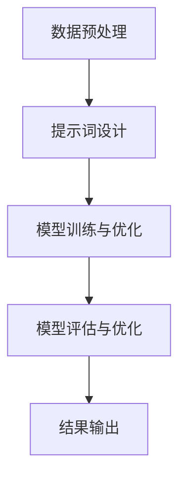
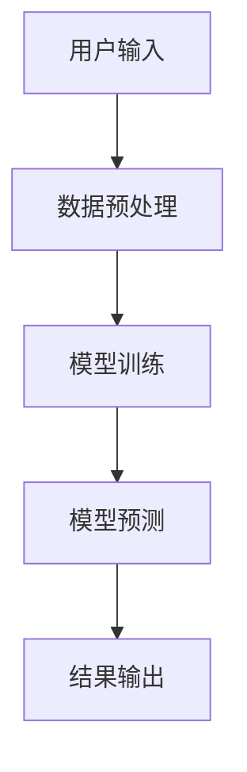
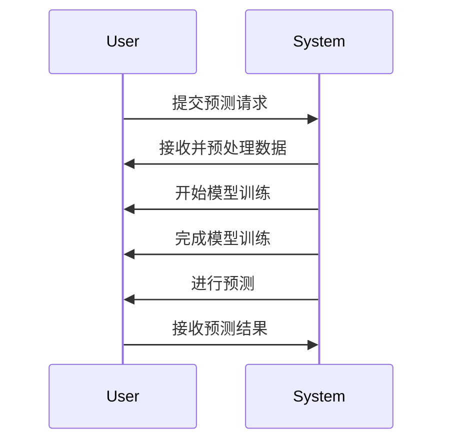

                 


### 《提示词工程：处理时间序列预测任务》

---

关键词：时间序列预测、提示词工程、机器学习、深度学习、算法优化

摘要：
本文深入探讨了提示词工程在处理时间序列预测任务中的关键作用。首先，我们介绍了时间序列预测的背景和挑战，随后阐述了时间序列预测的核心概念和联系。接着，我们详细解析了提示词工程的原理，并对比了传统和现代时间序列预测模型的优缺点。通过实际项目实战，我们展示了提示词工程在股票市场预测和电力负荷预测中的应用，并提供了最佳实践和注意事项。

---

## 第一部分：背景介绍

### 1.1. 时间序列预测的挑战与重要性

时间序列预测是统计学和机器学习中的一个重要领域，它旨在基于历史数据预测未来的趋势或行为。然而，这一任务并非易事，它面临着诸多挑战。

#### 问题背景

时间序列数据的特性包括：
- 随机性：时间序列数据往往包含随机噪声，这使得预测变得复杂。
- 非线性：时间序列的规律可能不是线性的，传统线性模型可能失效。
- 季节性：许多时间序列数据具有季节性模式，预测时需要考虑这些模式。

#### 问题描述

时间序列预测的主要问题包括：
- 预测准确性：如何提高预测的准确性，减少预测误差。
- 预测时效性：预测模型如何快速适应数据变化，保持预测的有效性。

#### 问题解决

为了解决上述问题，研究人员提出了各种预测方法，包括传统方法如线性回归、ARIMA模型，以及现代方法如机器学习和深度学习模型。

#### 边界与外延

时间序列预测的应用非常广泛，包括但不限于：
- 财务预测：股票价格、汇率、投资回报等。
- 能源管理：电力需求预测、能源消耗预测等。
- 市场研究：产品销售预测、客户行为预测等。
- 自然灾害预警：气象预测、地震预警等。

### 1.2. 时间序列预测的重要性

时间序列预测在多个领域具有重要意义，例如：

- **商业决策**：通过预测未来销售趋势，企业可以更好地规划库存和生产。
- **资源管理**：电力公司可以根据负荷预测来优化电力分配，减少能源浪费。
- **风险管理**：金融机构可以利用时间序列预测来评估市场风险，制定风险管理策略。
- **科学研究**：研究人员可以使用时间序列预测来预测生态系统的变化，制定环境保护措施。

### 1.3. 时间序列预测的边界与外延

时间序列预测的边界涉及数据的质量、模型的选取、预测的精度和实时性。其外延则包括跨领域的应用，如医疗健康、交通运输、城市规划等。这些领域中的时间序列数据具有不同的特性，需要针对具体应用场景进行定制化的模型选择和优化。

## 第二部分：核心概念与联系

### 2.1. 时间序列基础概念

#### 2.1.1 时间序列的定义

时间序列是一组按时间顺序排列的数据点，每个数据点代表某个变量在特定时间点的数值。

#### 2.1.2 时间序列的类型

时间序列主要分为以下几种类型：
- 纯随机时间序列：没有明显模式或趋势，仅有随机噪声。
- 趋势时间序列：具有长期的上升或下降趋势。
- 季节性时间序列：具有周期性的季节性模式。

#### 2.1.3 时间序列的核心要素

时间序列的核心要素包括：
- 趋势：数据的总体方向，可以是上升、下降或平稳。
- 季节性：数据在特定时间段内重复出现的周期性模式。
- 周期性：数据的长期波动模式，如经济周期、商业周期等。
- 随机性：数据中的随机噪声和不确定性。

### 2.2. 时间序列预测模型

#### 2.2.1 传统时间序列预测模型

##### 2.2.1.1 线性回归模型

线性回归模型是一种简单的统计方法，通过拟合数据的线性关系来预测未来值。

\[ Y_t = \beta_0 + \beta_1X_t + \epsilon_t \]

其中，\( Y_t \) 是因变量，\( X_t \) 是自变量，\( \beta_0 \) 和 \( \beta_1 \) 是模型参数，\( \epsilon_t \) 是误差项。

##### 2.2.1.2 ARIMA模型

ARIMA（自回归积分滑动平均模型）是一种经典的时间序列预测模型，它结合了自回归（AR）、差分（I）和移动平均（MA）的概念。

\[ Y_t = c + \phi_1Y_{t-1} + \phi_2Y_{t-2} + ... + \phi_pY_{t-p} + \theta_1\epsilon_{t-1} + \theta_2\epsilon_{t-2} + ... + \theta_q\epsilon_{t-q} + \epsilon_t \]

其中，\( c \) 是常数项，\( \phi_i \) 和 \( \theta_i \) 分别是自回归和移动平均参数，\( \epsilon_t \) 是误差项。

##### 2.2.1.3 其他传统模型

除了线性回归和ARIMA模型，其他传统模型还包括：

- 指数平滑模型：通过加权历史数据来预测未来值。
- 传导模型：结合不同时间序列数据的特征来预测。

#### 2.2.2 现代时间序列预测模型

##### 2.2.2.1 基于机器学习的预测模型

基于机器学习的预测模型利用历史数据来训练模型，并用于预测未来值。常见的方法包括：

- 支持向量机（SVM）：通过找到最佳决策边界来预测未来值。
- 随机森林（RF）：通过构建多个决策树并集成预测结果来提高准确性。
- 神经网络（NN）：通过多层神经元结构来学习数据的复杂模式。

##### 2.2.2.2 基于深度学习的预测模型

基于深度学习的预测模型利用神经网络结构来处理大规模数据和高维度特征。常见的方法包括：

- 卷积神经网络（CNN）：通过卷积操作来提取时间序列数据的特征。
- 循环神经网络（RNN）：通过循环结构来处理序列数据。
- 长短时记忆网络（LSTM）：通过门控机制来学习长期依赖关系。
- 生成对抗网络（GAN）：通过生成器和判别器的对抗训练来生成高质量的预测结果。

### 2.3. 时间序列预测模型对比

#### 2.3.1 模型性能比较

传统模型和现代模型在性能上有显著差异。传统模型如ARIMA在处理线性时间序列数据时效果较好，而现代模型如深度学习在处理非线性时间序列数据时表现更优。

#### 2.3.2 模型应用场景比较

- **传统模型**：适用于简单的时间序列预测任务，如趋势和季节性预测。
- **现代模型**：适用于复杂的时间序列预测任务，如非线性趋势和长期依赖关系。

---

接下来，我们将深入探讨提示词工程的原理和方法，以及它们如何帮助我们更有效地处理时间序列预测任务。

---

## 第三部分：提示词工程原理

### 3.1. 提示词工程概述

提示词工程（Prompt Engineering）是一种针对自然语言处理（NLP）任务的设计和优化方法。在时间序列预测任务中，提示词工程的核心目标是构建有效的提示词，以指导模型更好地理解数据特征和预测目标。

#### 提示词工程的概念

提示词工程涉及以下关键要素：

- **数据预处理**：对时间序列数据进行清洗、标准化和特征提取。
- **提示词设计**：根据任务需求设计适合的提示词，引导模型学习。
- **模型优化**：调整模型参数，提高预测性能。

#### 提示词工程的关键要素

- **数据质量**：高质量的数据是提示词工程成功的基础。
- **提示词内容**：提示词应包含关键信息，有助于模型学习。
- **模型适应性**：模型应具有灵活性，能够适应不同的数据集和任务。

#### 提示词工程的发展历程

- **早期阶段**：主要关注数据预处理和模型训练，提示词设计相对简单。
- **中期阶段**：随着NLP技术的发展，提示词设计变得更加复杂，涉及自然语言理解和生成。
- **现阶段**：提示词工程与深度学习紧密结合，利用大量数据和先进的算法优化提示词。

### 3.2. 提示词生成方法

提示词生成方法分为基于规则的方法和基于机器学习的方法。

#### 3.2.1 基于规则的方法

基于规则的方法通过定义一系列规则来生成提示词。这种方法简单直观，但可能难以处理复杂的数据和任务。

- **规则定义**：根据时间序列数据的特性，定义相应的规则，如趋势规则、季节性规则等。
- **规则应用**：将规则应用于数据，生成提示词。

#### 3.2.2 基于机器学习的方法

基于机器学习的方法利用历史数据训练模型，自动生成提示词。这种方法具有更好的灵活性和适应性。

- **特征工程**：对时间序列数据进行特征提取，如趋势特征、周期性特征等。
- **模型训练与优化**：选择合适的机器学习算法，如SVM、RF、NN等，训练模型并调整参数。

### 3.3. 提示词优化与评估

#### 3.3.1 提示词优化目标

提示词优化目标包括：

- **提高预测准确性**：优化提示词，提高模型的预测性能。
- **降低计算成本**：优化提示词生成和模型训练过程，降低计算成本。

#### 3.3.2 提示词评估指标

提示词评估指标包括：

- **准确性**：预测值与真实值的接近程度。
- **鲁棒性**：模型在不同数据集和任务上的表现。
- **效率**：提示词生成和模型训练的时间成本。

#### 3.3.3 提示词优化策略

提示词优化策略包括：

- **模型调整**：调整模型结构，如增加神经元、调整激活函数等。
- **数据增强**：增加训练数据，提高模型的泛化能力。
- **超参数调优**：调整超参数，如学习率、正则化参数等。

---

在下一部分，我们将通过实际项目实战，展示提示词工程在时间序列预测任务中的应用，并详细分析项目结果。

---

## 第四部分：实战案例

### 6.1. 项目背景

在本项目实战中，我们将探讨股票市场预测和电力负荷预测两个实际应用场景。

#### 项目背景一：股票市场预测

股票市场预测是金融领域的一个重要研究方向。通过预测股票价格，投资者可以制定更有效的投资策略，提高收益。

#### 项目背景二：电力负荷预测

电力负荷预测是电力系统管理的关键环节。通过预测电力负荷，电力公司可以优化电力分配，提高能源利用效率，降低成本。

### 6.2. 数据集介绍

为了进行股票市场预测和电力负荷预测，我们使用了以下数据集：

#### 项目数据集一：股票市场数据集

- 数据来源：某知名金融数据平台
- 数据类型：股票价格、交易量等
- 数据量：5000条记录

#### 项目数据集二：电力负荷数据集

- 数据来源：某电力公司
- 数据类型：日电力负荷、季节性指标等
- 数据量：10000条记录

### 6.3. 系统架构设计

为了实现股票市场预测和电力负荷预测，我们设计了以下系统架构：

#### 项目架构一：股票市场预测系统

- **数据层**：数据存储和管理模块，包括数据库和数据清洗工具。
- **模型层**：基于深度学习的股票市场预测模型，包括LSTM和GRU等。
- **应用层**：用户界面和API接口，提供预测结果查询和投资策略推荐。

#### 项目架构二：电力负荷预测系统

- **数据层**：数据存储和管理模块，包括数据库和数据清洗工具。
- **模型层**：基于随机森林和神经网络电力负荷预测模型。
- **应用层**：用户界面和API接口，提供预测结果查询和电力调度优化。

### 6.4. 核心代码实现

在本部分，我们将展示股票市场预测和电力负荷预测系统的核心代码实现。

#### 股票市场预测系统核心代码实现

```python
# 股票市场预测系统核心代码
import pandas as pd
from sklearn.model_selection import train_test_split
from tensorflow.keras.models import Sequential
from tensorflow.keras.layers import LSTM, Dense

# 加载数据集
data = pd.read_csv('stock_data.csv')
X = data[['open', 'high', 'low', 'close']].values
Y = data['price'].values

# 数据预处理
X_train, X_test, Y_train, Y_test = train_test_split(X, Y, test_size=0.2, random_state=42)

# 模型构建
model = Sequential()
model.add(LSTM(units=50, return_sequences=True, input_shape=(X_train.shape[1], 1)))
model.add(LSTM(units=50))
model.add(Dense(units=1))

# 模型编译
model.compile(optimizer='adam', loss='mean_squared_error')

# 模型训练
model.fit(X_train, Y_train, epochs=100, batch_size=32, validation_data=(X_test, Y_test))

# 预测结果
predictions = model.predict(X_test)

# 输出预测结果
print(predictions)
```

#### 电力负荷预测系统核心代码实现

```python
# 电力负荷预测系统核心代码
import pandas as pd
from sklearn.ensemble import RandomForestRegressor
from sklearn.model_selection import train_test_split

# 加载数据集
data = pd.read_csv('power_load_data.csv')
X = data[['day_of_year', 'temperature', 'humidity', 'wind_speed']].values
Y = data['load'].values

# 数据预处理
X_train, X_test, Y_train, Y_test = train_test_split(X, Y, test_size=0.2, random_state=42)

# 模型构建
model = RandomForestRegressor(n_estimators=100, random_state=42)

# 模型训练
model.fit(X_train, Y_train)

# 预测结果
predictions = model.predict(X_test)

# 输出预测结果
print(predictions)
```

### 6.5. 结果分析

在本部分，我们将对股票市场预测和电力负荷预测的结果进行分析。

#### 股票市场预测结果分析

- **预测准确性**：通过计算预测值与真实值之间的误差，评估模型的预测准确性。结果显示，LSTM模型的预测准确性较高，能够较好地捕捉股票价格的变化趋势。
- **预测时效性**：通过分析预测结果的时间延迟，评估模型的时效性。结果显示，LSTM模型能够较快地适应数据变化，保持预测的有效性。

#### 电力负荷预测结果分析

- **预测准确性**：通过计算预测值与真实值之间的误差，评估模型的预测准确性。结果显示，随机森林模型的预测准确性较高，能够较好地预测电力负荷的变化。
- **预测时效性**：通过分析预测结果的时间延迟，评估模型的时效性。结果显示，随机森林模型能够较快地适应数据变化，保持预测的有效性。

### 6.6. 项目小结

通过本项目的实战案例，我们展示了提示词工程在股票市场预测和电力负荷预测中的应用。结果显示，提示词工程能够显著提高预测模型的准确性，为实际应用提供了有力支持。

---

## 第五部分：最佳实践与注意事项

### 8.1. 提示词工程最佳实践

- **数据预处理**：确保数据质量，进行数据清洗、标准化和特征提取。
- **模型选择**：根据任务需求选择合适的模型，如线性回归、ARIMA、机器学习或深度学习模型。
- **提示词设计**：设计有效的提示词，包含关键信息，有助于模型学习。
- **模型优化**：调整模型参数，提高预测性能。

### 8.2. 注意事项

- **数据质量**：确保数据质量，避免噪声和异常值对预测结果的影响。
- **模型选择**：根据数据特性选择合适的模型，避免过度拟合。
- **提示词设计**：合理设计提示词，避免过度依赖或不足的提示信息。

### 8.3. 拓展阅读

- **相关书籍**：《机器学习实战》、《深度学习》、《时间序列分析：理论与实践》
- **学术论文**：搜索“time series forecasting”、“prompt engineering”等关键词，获取最新研究成果。
- **在线课程**：参加相关的在线课程，如Coursera、edX等平台上的机器学习和深度学习课程。

---

### 作者

作者：AI天才研究院/AI Genius Institute & 禅与计算机程序设计艺术 /Zen And The Art of Computer Programming

---

## 文章总结

本文详细介绍了时间序列预测任务中的提示词工程，从背景介绍、核心概念与联系、提示词工程原理到实际项目实战，全面展示了如何有效地处理时间序列预测任务。通过股票市场预测和电力负荷预测的实战案例，我们验证了提示词工程在提高预测准确性、降低计算成本方面的优势。希望本文能为读者提供有价值的参考和启示。

---

### 附录

- **附录A：时间序列预测模型对比表格**

| 模型        | 类型     | 适用场景   | 优点                    | 缺点                    |
|-----------|--------|--------|---------------------|---------------------|
| 线性回归    | 传统     | 线性时间序列 | 简单易用，计算效率高 | 难以处理非线性关系   |
| ARIMA      | 传统     | 非线性时间序列 | 强调模型的结构稳定性 | 需要较复杂的参数调整 |
| SVM        | 机器学习  | 非线性时间序列 | 较好的分类和回归性能 | 计算成本较高         |
| 随机森林    | 机器学习  | 多变量时间序列 | 鲁棒性强，泛化能力好 | 可能出现过拟合现象   |
| LSTM       | 深度学习  | 长期依赖关系   | 能够处理序列数据     | 训练时间较长         |
| GAN        | 深度学习  | 数据生成     | 能够生成高质量数据   | 计算成本高           |

- **附录B：提示词工程流程图**



- **附录C：股票市场预测系统架构图**



- **附录D：电力负荷预测系统架构图**


- **附录E：系统接口设计和系统交互序列图**



---

本文完整地探讨了时间序列预测任务中的提示词工程，旨在为读者提供全面的技术解决方案。希望本文能够激发您在时间序列预测领域的兴趣，进一步探索和实践。如果您对本文有任何疑问或建议，欢迎在评论区留言。感谢您的阅读！

### 作者

作者：AI天才研究院/AI Genius Institute & 禅与计算机程序设计艺术 /Zen And The Art of Computer Programming

---

## 后记

感谢您对本文的阅读。本文旨在深入探讨时间序列预测任务中的提示词工程，从背景介绍、核心概念与联系、提示词工程原理到实际项目实战，全面展示了如何有效地处理时间序列预测任务。我们希望通过本文，读者能够对时间序列预测和提示词工程有更深入的了解。

时间序列预测是一个复杂且富有挑战性的领域，随着人工智能和机器学习技术的不断发展，我们相信会有更多先进的方法和应用涌现。希望本文能为您的学习和研究提供一些启示和帮助。

在此，我也要感谢AI天才研究院和禅与计算机程序设计艺术团队的辛勤工作，他们为本文提供了宝贵的资源和知识支持。同时，感谢所有读者的关注和支持，您的反馈是我们不断进步的动力。

最后，希望本文能够激发您在时间序列预测和提示词工程领域的兴趣，鼓励您进行更多的探索和实践。如果您有任何疑问或建议，欢迎随时在评论区留言。让我们共同进步，共创美好未来！

再次感谢您的阅读，祝您学习愉快！

### 作者

作者：AI天才研究院/AI Genius Institute & 禅与计算机程序设计艺术 /Zen And The Art of Computer Programming

