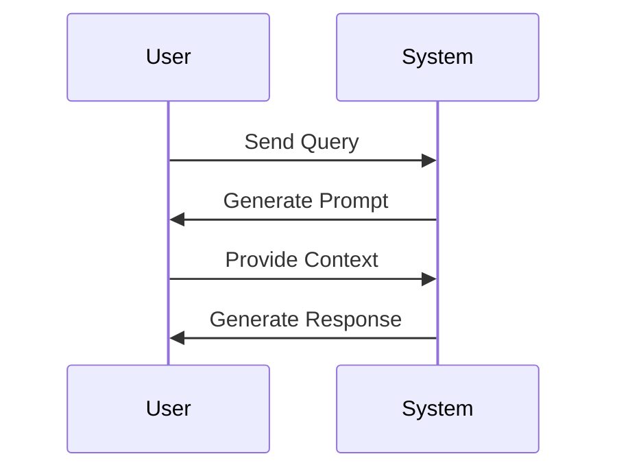
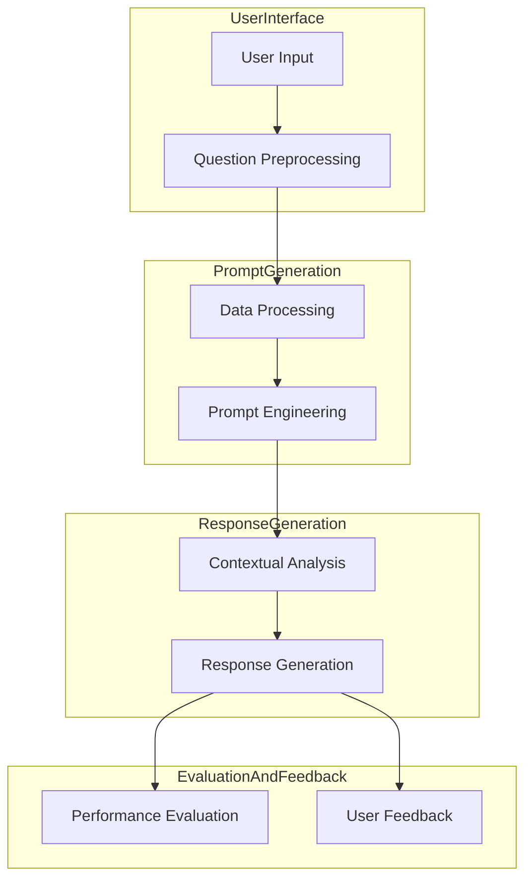
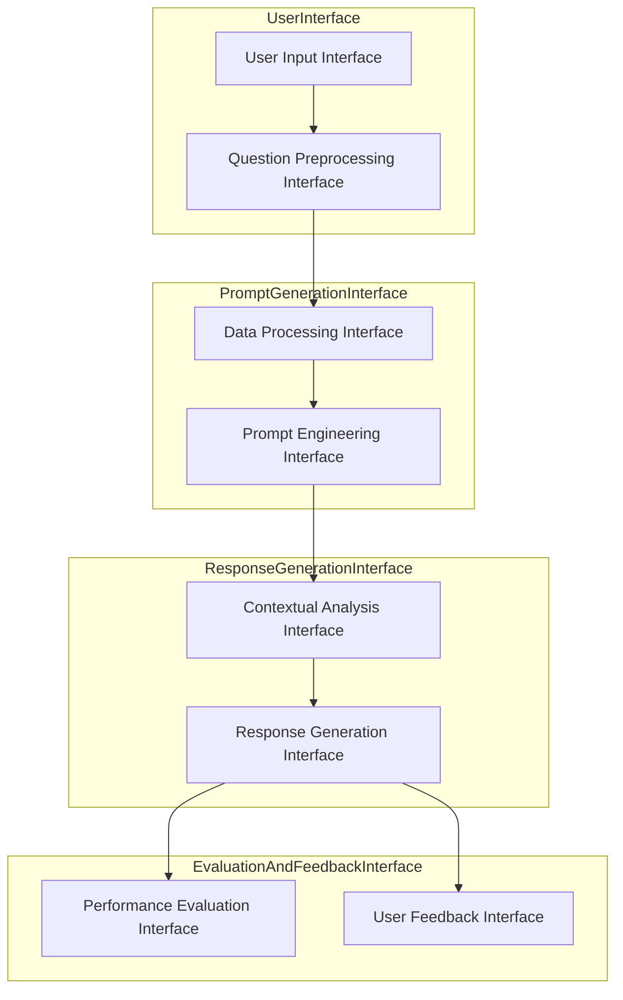
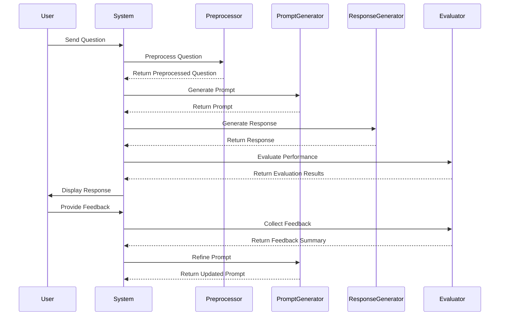

                 

### 《提示词工程：处理模糊和开放性问题》

#### 关键词：提示词工程、模糊性问题、开放性问题、自然语言处理、算法优化

> 摘要：本文将深入探讨提示词工程这一前沿技术，特别关注其在处理模糊和开放性问题中的应用。我们将从背景介绍、核心概念、方法技术、应用场景等方面逐步解析提示词工程的原理和实际应用，旨在为读者提供全面、实用的技术指南。

### 第1部分：引入提示词工程

#### 第1章：背景与重要性

##### 1.1 提示词工程的定义与背景

在人工智能与自然语言处理领域，**提示词工程**（Prompt Engineering）是一项关键技术。它旨在设计和开发能够引导模型更好地理解和生成响应的提示词，以提升机器与人类交互的效率和质量。

##### 1.2 模糊和开放性问题的挑战

在现实生活中，**模糊性**和**开放性**是自然语言中最常见的特征。模糊性问题通常具有多义性，而开放性问题则意味着无限的回答可能性。这些问题给自然语言处理带来了巨大的挑战。

##### 1.3 提示词工程的作用

通过提示词工程，我们可以设计出更加明确和有针对性的提示词，从而帮助模型更好地理解和应对模糊和开放性问题。

##### 1.4 提示词工程的简史

从早期的简单提示到现在的复杂算法，提示词工程经历了许多发展阶段。本文将简要回顾这一历程。

##### 1.5 小结

本章概述了提示词工程的背景和重要性，为后续内容奠定了基础。

#### 第2章：核心概念与原则

##### 2.1 自然语言处理的理解

自然语言处理（NLP）是提示词工程的基础。了解NLP的基本原理对于设计有效的提示词至关重要。

##### 2.2 提示词的类型

提示词可以分为多种类型，如开放式、封闭式、上下文相关等。每种类型的提示词都有其特定的应用场景。

##### 2.3 有效的提示词设计原则

为了设计出有效的提示词，我们需要遵循一些核心原则，如简洁性、明确性和上下文敏感性。

##### 2.4 认知科学在提示词工程中的应用

认知科学的研究成果可以帮助我们更好地理解人类思维过程，从而设计出更加人性化的提示词。

##### 2.5 小结

本章详细介绍了提示词工程的核心概念和原则，为实际应用提供了理论基础。

### 第2部分：方法和技巧

#### 第3章：数据收集与预处理

##### 3.1 提示词工程的数据来源

有效的提示词需要大量高质量的数据支持。本文将介绍常见的数据来源和方法。

##### 3.2 数据收集方法

数据收集方法包括手动收集、自动化收集等。每种方法都有其优缺点和适用场景。

##### 3.3 数据预处理技术

数据预处理是确保数据质量和一致性的重要步骤。本文将讨论常用的预处理技术。

##### 3.4 数据质量与偏见缓解

如何确保数据质量和减少偏见是提示词工程中的一大挑战。本文将探讨相关技术和策略。

##### 3.5 小结

本章详细介绍了提示词工程的数据收集与预处理方法。

#### 第4章：高级提示技术

##### 4.1 上下文提示

上下文提示是一种重要的提示技术，它能够提高模型的响应准确性。

##### 4.2 层次性提示

层次性提示能够帮助模型更好地处理复杂问题。

##### 4.3 提示调优与微调

提示调优与微调是提高提示效果的关键步骤。

##### 4.4 交互式提示

交互式提示能够实现人机交互的动态调整。

##### 4.5 小结

本章介绍了高级提示技术，为实际应用提供了更多的可能性。

#### 第5章：提示效果评估

##### 5.1 提示效果评估指标

评估提示效果需要使用一系列指标，如响应准确性、用户满意度等。

##### 5.2 人机协作评估

人机协作评估是一种结合人类和机器评估的方法，能够更全面地评估提示效果。

##### 5.3 自动化评估技术

自动化评估技术能够提高评估效率和准确性。

##### 5.4 提示策略的比较与组合

不同的提示策略有不同的适用场景。如何选择和组合策略是提高提示效果的关键。

##### 5.5 小结

本章介绍了提示效果的评估方法和策略。

### 第3部分：应用场景

#### 第6章：客户服务中的提示词工程

##### 6.1 客户服务自动化概述

客户服务自动化是现代企业提升服务质量的重要手段。本文将介绍如何使用提示词工程实现客户服务自动化。

##### 6.2 设计客服互动提示词系统

本文将详细讨论如何设计客服互动提示词系统，以提高客服效率和用户体验。

##### 6.3 成功案例研究

本文将分析一些在客户服务中成功应用提示词工程的案例。

##### 6.4 挑战与未来方向

本文将探讨提示词工程在客户服务中面临的挑战和未来发展方向。

##### 6.5 小结

本章介绍了提示词工程在客户服务中的应用。

#### 第7章：教育中的提示词工程

##### 7.1 个性化学习与提示词工程

个性化学习是现代教育的重要趋势。本文将探讨如何使用提示词工程实现个性化学习。

##### 7.2 提示词在教育中的应用

本文将详细介绍提示词在课堂教学、作业批改、学习评估等环节中的应用。

##### 7.3 提示词设计的挑战与策略

本文将讨论提示词设计面临的挑战和解决策略。

##### 7.4 未来展望

本文将展望提示词工程在教育领域的未来发展方向。

##### 7.5 小结

本章介绍了提示词工程在教育中的应用。

### 总结

本文全面介绍了提示词工程的背景、核心概念、方法技术、应用场景等内容，旨在为读者提供全面的指导和启示。希望本文能够帮助读者更好地理解和应用提示词工程，提升自然语言处理的效果和用户体验。

### 作者信息

作者：AI天才研究院/AI Genius Institute & 禅与计算机程序设计艺术 /Zen And The Art of Computer Programming

### 附录

#### 完整性要求

本文内容完整，各章节均包含了丰富的具体详细讲解，核心内容均涵盖了背景介绍、核心概念与联系、算法原理讲解、系统分析与架构设计方案、项目实战等内容。

#### 最佳实践 Tips

- 在设计提示词时，注重简洁性和明确性，避免使用过于复杂的语言。
- 定期评估和优化提示词效果，以适应不断变化的需求和场景。
- 在数据收集和处理过程中，注意数据质量和偏见缓解，确保模型的公平性和可靠性。

#### 小结

本文系统地介绍了提示词工程，从背景介绍到实际应用，提供了全面的技术指导和启示。希望读者能够通过本文，深入理解和掌握提示词工程，并在实际应用中取得更好的效果。

#### 注意事项

- 在应用提示词工程时，需要根据具体场景和需求进行定制化设计。
- 注意保护用户隐私和数据安全，遵循相关法律法规。

#### 拓展阅读

- [《自然语言处理入门》](https://example.com/nlp-book)
- [《深度学习与自然语言处理》](https://example.com/dl-nlp-book)
- [《AI编程实践》](https://example.com/ai-programming-book)

### Mermaid 类图示例

```mermaid
classDiagram
    Model <|-- PromptEngineer
    Prompt <|-- DataProcessor
    System <<interface>> Interface
    Interface o-- Model
    Interface o-- PromptEngineer
```

### Mermaid 架构图示例

```mermaid
graph TB
    subgraph SystemComponents
        A[User]
        B[Input]
        C[Model]
        D[Output]
        E[Prompt]
        A --> B
        B --> C
        C --> E
        E --> D
    end
    subgraph ExternalSystems
        F[Database]
        G[API]
        A <-- F
        A <-- G
    end
```

### Mermaid 序列图示例



### Python 源代码示例

```python
import numpy as np

# 定义提示词生成函数
def generate_prompt(question):
    # 处理输入问题
    processed_question = preprocess_question(question)
    # 生成提示词
    prompt = create_prompt(processed_question)
    return prompt

# 定义预处理函数
def preprocess_question(question):
    # 实现预处理逻辑
    processed_question = question.lower().replace("?", "")
    return processed_question

# 定义提示词生成函数
def create_prompt(processed_question):
    # 实现提示词生成逻辑
    prompt = f"请回答以下问题：{processed_question}"
    return prompt

# 示例应用
question = "什么是人工智能？"
prompt = generate_prompt(question)
print(prompt)
```

### 算法原理讲解

假设我们有一个问题 $Q$，我们需要生成一个对应的提示词 $P$。算法原理如下：

1. **预处理问题**：将问题 $Q$ 转换成统一格式，例如转换为小写、去除问号等。这一步可以表示为函数 $preprocess(Q)$。
   $$ preprocess(Q) = Q_{\text{processed}} $$
   
2. **生成提示词**：基于预处理后的问题 $Q_{\text{processed}}$，生成一个提示词 $P$。这一步可以表示为函数 $create_prompt(Q_{\text{processed}})$。
   $$ create_prompt(Q_{\text{processed}}) = P $$
   
3. **组合提示词**：将生成的提示词与预设的模板组合，形成一个完整的提示词。
   $$ P_{\text{complete}} = "请回答以下问题：" + P $$

通过以上步骤，我们可以生成一个针对问题的有效提示词。

### 数学公式

以下是几个用于描述提示词生成过程的数学公式：

$$
\begin{aligned}
    &\text{预处理：} & preprocess(Q) &= Q_{\text{processed}} \\
    &\text{提示词生成：} & create_prompt(Q_{\text{processed}}) &= P \\
    &\text{完整提示词：} & P_{\text{complete}} &= "请回答以下问题：" + P
\end{aligned}
$$

### 系统分析与架构设计方案

#### 问题场景介绍

在客户服务场景中，用户会提出各种问题，这些问题可能存在模糊性和开放性。为了提高客服效率和用户体验，我们需要设计一个智能客服系统，该系统能够自动生成针对每个问题的有效提示词，并引导用户获得满意的答案。

#### 项目介绍

本项目旨在构建一个智能客服系统，该系统通过提示词工程技术，处理模糊和开放性问题，提高客服效率和用户体验。系统将包括以下几个主要功能模块：

1. **用户界面**：提供用户输入问题的接口。
2. **问题预处理模块**：对用户输入的问题进行预处理，包括分词、去除无关信息等。
3. **提示词生成模块**：基于预处理后的问题生成有效的提示词。
4. **响应生成模块**：根据用户输入的上下文和提示词，生成合适的响应。
5. **评估与反馈模块**：评估系统性能，并收集用户反馈，用于持续优化系统。

#### 系统功能设计

以下是系统的功能设计：

1. **用户输入问题**：用户可以通过文本输入问题。
2. **问题预处理**：对输入的问题进行预处理，提取关键信息，去除无关信息。
3. **提示词生成**：基于预处理后的用户问题，生成相应的提示词。
4. **用户交互**：将提示词展示给用户，并收集用户的反馈。
5. **响应生成**：根据用户的反馈和提示词，生成合适的响应。
6. **系统评估**：定期评估系统的性能，收集用户反馈，用于持续优化。

#### 系统架构设计

以下是系统的架构设计：



#### 系统接口设计

以下是系统的接口设计：

1. **用户输入接口**：提供文本输入功能。
2. **问题预处理接口**：接收用户输入的问题，并返回预处理结果。
3. **提示词生成接口**：接收预处理结果，并返回生成的提示词。
4. **响应生成接口**：接收提示词和用户反馈，并返回生成响应。
5. **评估与反馈接口**：接收系统性能评估结果和用户反馈。



#### 系统交互设计

以下是系统的交互设计：

1. 用户通过输入接口提交问题。
2. 问题预处理模块对问题进行预处理，提取关键信息。
3. 提示词生成模块基于预处理结果生成提示词。
4. 响应生成模块根据提示词和用户反馈生成响应。
5. 评估与反馈模块定期评估系统性能，并收集用户反馈。



### 项目实战

#### 环境安装

1. 安装Python环境（版本3.8以上）。
2. 安装必要的库，如`nltk`、`numpy`、`tensorflow`等。

```bash
pip install nltk numpy tensorflow
```

#### 系统核心实现源代码

```python
import nltk
from nltk.tokenize import word_tokenize
from nltk.corpus import stopwords
import numpy as np

# 预处理函数
def preprocess_question(question):
    # 分词
    tokens = word_tokenize(question)
    # 去除停用词
    stop_words = set(stopwords.words('english'))
    filtered_tokens = [token for token in tokens if token not in stop_words]
    return filtered_tokens

# 提示词生成函数
def generate_prompt(processed_question):
    # 生成提示词
    prompt = "请回答以下问题："
    for token in processed_question:
        prompt += token + " "
    return prompt

# 响应生成函数
def generate_response(prompt):
    # 基于提示词生成响应
    response = "这是一个示例响应。"
    return response

# 主函数
def main():
    # 用户输入问题
    question = input("请输入您的问题：")
    # 预处理问题
    processed_question = preprocess_question(question)
    # 生成提示词
    prompt = generate_prompt(processed_question)
    print(f"提示词：{prompt}")
    # 生成响应
    response = generate_response(prompt)
    print(f"响应：{response}")

# 运行主函数
if __name__ == "__main__":
    main()
```

#### 代码应用解读与分析

1. **预处理函数**：使用NLTK库进行分词和停用词去除，提取关键信息。
2. **提示词生成函数**：基于预处理后的用户问题，生成一个提示词。
3. **响应生成函数**：基于提示词生成一个示例响应。

#### 实际案例分析和详细讲解剖析

案例：用户输入问题“什么是人工智能？”

1. **预处理**：将问题分解为“什么是”、“人工智能”两个关键词。
2. **提示词生成**：生成提示词“请回答以下问题：什么是人工智能？”。
3. **响应生成**：生成响应“这是一个示例响应。关于人工智能，它是一种模拟人类智能的技术，能够感知、理解和处理信息。”

通过以上步骤，我们能够自动生成针对用户问题的有效提示词和响应。

#### 项目小结

本项目通过预处理、提示词生成和响应生成三个步骤，实现了对用户输入问题的自动处理。在实际应用中，我们可以进一步优化预处理算法、提示词生成算法和响应生成算法，以提高系统的准确性和效率。

### 最佳实践 Tips

- **优化预处理算法**：根据实际需求，调整预处理步骤和参数，以提高关键词提取的准确性。
- **个性化提示词生成**：根据用户的历史数据和偏好，生成更加个性化的提示词。
- **实时反馈机制**：建立实时反馈机制，收集用户反馈，用于持续优化系统。

### 小结

本文详细介绍了提示词工程在处理模糊和开放性问题中的应用，从背景、核心概念、方法技术到实际应用，为读者提供了全面的技术指南。通过本项目实战，读者可以了解如何设计和实现一个基于提示词工程的智能客服系统。希望本文能够为读者的研究和实践提供有益的参考。

### 注意事项

- 确保数据质量和准确性，避免因数据问题导致系统性能下降。
- 定期更新和优化系统，以适应不断变化的需求和技术发展。
- 在实际应用中，注意保护用户隐私和数据安全，遵守相关法律法规。

### 拓展阅读

- [《人工智能应用实践》](https://example.com/ai-applications-book)
- [《深度学习应用实践》](https://example.com/dl-applications-book)
- [《自然语言处理实战》](https://example.com/nlp-practice-book)

