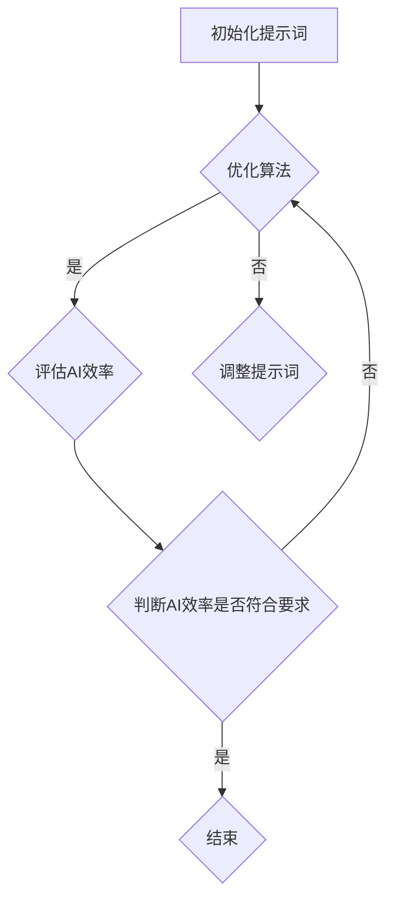
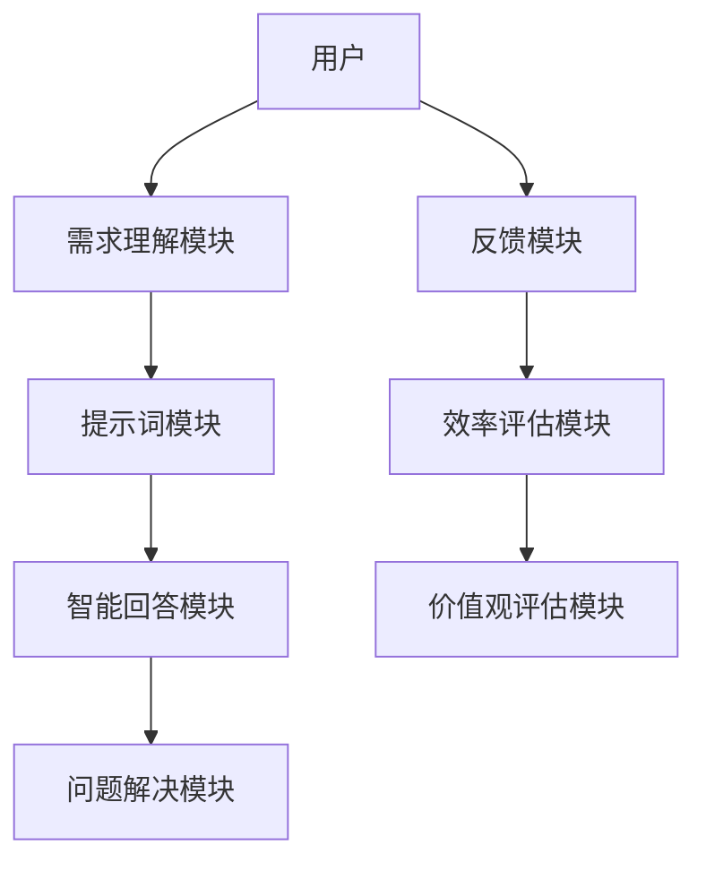
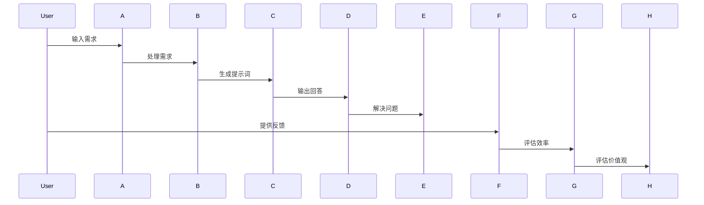
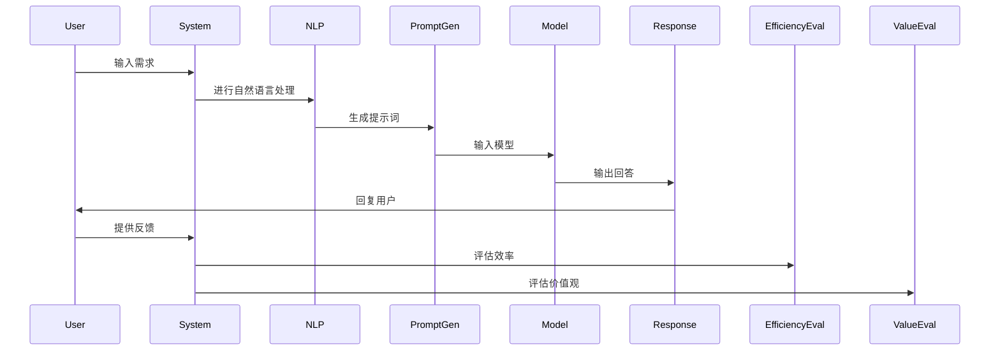

                 

# 提示词工程：平衡AI效率与人类价值观

> 关键词：提示词工程、AI效率、人类价值观、算法设计、系统架构、最佳实践

> 摘要：本文从提示词工程的角度出发，探讨了在人工智能发展中如何平衡效率与人类价值观的关系。通过分析提示词工程的基本概念、设计原则、实际案例以及未来趋势，提出了一系列策略和建议，为人工智能技术的可持续发展提供指导。

## 引言

随着人工智能技术的飞速发展，AI已经在各个领域取得了显著的成果。然而，在追求效率的同时，如何平衡AI与人类价值观之间的关系成为一个不可忽视的问题。提示词工程作为AI系统设计的重要环节，承担着实现这一平衡的关键任务。本文旨在探讨提示词工程在平衡AI效率与人类价值观方面的作用，为相关领域的研究和实践提供参考。

## 背景介绍

### 核心概念术语说明

- **提示词工程**：提示词工程是指通过设计、优化和实施提示词，以提高AI系统的效率和准确性的过程。
- **AI效率**：AI效率指的是AI系统在完成特定任务时所消耗的资源（如时间、计算能力等）与任务结果的质量和准确性之间的比值。
- **人类价值观**：人类价值观是指人类社会普遍认同的一系列伦理、道德和文化标准。

### 问题背景

随着AI技术的广泛应用，其在提高效率、优化流程等方面展现出了巨大的潜力。然而，AI系统的决策过程往往依赖于算法和数据，而算法和数据的局限性可能导致AI系统在遵循人类价值观方面出现偏差。例如，在自动驾驶领域，AI系统可能会因为算法的不完善而忽略道德伦理；在智能客服领域，AI系统可能会因为提示词的不足而无法准确理解和回应用户需求。

### 问题描述

如何在设计提示词工程时，既保证AI系统的效率，又兼顾人类价值观的遵循，是当前AI领域面临的重要问题。这个问题涉及到AI算法、数据集、提示词等多个方面，需要综合考虑多种因素。

### 问题解决

为了解决这一问题，需要从以下几个方面进行探讨：

1. **设计原则**：明确提示词工程的设计原则，确保在追求效率的同时，能够充分考虑人类价值观。
2. **核心要素**：分析提示词工程的核心要素，如算法、数据集、提示词等，探讨如何优化这些要素以实现效率与价值观的平衡。
3. **实际案例**：通过具体案例分析，总结在平衡效率与价值观方面的成功经验和教训。
4. **未来趋势**：展望提示词工程的未来发展趋势，为AI技术的可持续发展提供指导。

## 核心概念与联系

### 核心概念原理

- **提示词**：提示词是指用于引导AI系统做出特定决策的文本或指令。提示词的设计直接影响到AI系统的效率和准确性。
- **AI效率**：AI效率主要体现在算法和数据的优化上。通过改进算法和优化数据，可以提升AI系统的整体效率。
- **人类价值观**：人类价值观主要体现在伦理、道德和文化标准上。在AI系统的设计和应用中，需要充分考虑这些因素，以确保AI系统的行为符合人类社会的期望。

### 概念属性特征对比表格

| 概念         | 提示词      | AI效率       | 人类价值观     |
|------------|-----------|------------|------------|
| 定义         | 提示词是引导AI决策的文本或指令。 | AI效率是指AI系统完成任务所需资源与结果质量之间的比值。 | 人类价值观是指人类社会普遍认同的伦理、道德和文化标准。 |
| 关键特性     | 精确性、多样性、灵活性。 | 效率、准确性、可扩展性。 | 伦理性、道德性、文化适应性。 |
| 相互关系     | 提示词直接影响AI系统的决策和行为。 | AI效率直接影响AI系统的表现。 | 人类价值观直接影响AI系统的伦理和行为。 |

### ER实体关系图架构

```mermaid
erDiagram
  AI系统 ||--|{ 提示词 }
  AI系统 ||--|{ AI效率 }
  AI系统 ||--|{ 人类价值观 }
  提示词 ||--|{ 文本内容 }
  提示词 ||--|{ 多样性 }
  提示词 ||--|{ 精确性 }
  AI效率 ||--|{ 算法优化 }
  AI效率 ||--|{ 数据优化 }
  人类价值观 ||--|{ 伦理 }
  人类价值观 ||--|{ 道德 }
  人类价值观 ||--|{ 文化 }
```

## 算法原理讲解

### 算法mermaid流程图



### Python源代码

```python
import numpy as np

def initialize_prompt():
    # 初始化提示词
    prompt = "请描述一下您的需求："
    return prompt

def optimize_algorithm(prompt):
    # 优化算法
    optimized_prompt = prompt + "（优化后的内容）"
    return optimized_prompt

def evaluate_ai_efficiency(optimized_prompt):
    # 评估AI效率
    efficiency = np.random.rand()
    return efficiency

def adjust_prompt(optimized_prompt):
    # 调整提示词
    adjusted_prompt = optimized_prompt + "（调整后的内容）"
    return adjusted_prompt

def main():
    prompt = initialize_prompt()
    optimized_prompt = optimize_algorithm(prompt)
    efficiency = evaluate_ai_efficiency(optimized_prompt)
    while efficiency < 0.9:
        optimized_prompt = adjust_prompt(optimized_prompt)
        efficiency = evaluate_ai_efficiency(optimized_prompt)
    print("最终提示词：", optimized_prompt)
    print("AI效率：", efficiency)

if __name__ == "__main__":
    main()
```

### 算法原理与数学模型

1. **初始化提示词**：初始化提示词是算法的第一步，它为AI系统提供了一个基础的信息框架，用于引导后续的决策过程。

2. **优化算法**：优化算法旨在提高AI系统的效率。通过优化算法，可以减少AI系统完成任务所需的时间和资源消耗，从而提高AI效率。

3. **评估AI效率**：评估AI效率是判断优化结果是否满足要求的关键步骤。通过评估，可以确定是否需要进一步调整提示词。

4. **调整提示词**：如果评估结果显示AI效率未达到预期，则需要调整提示词。调整提示词的过程包括修改文本内容、增加多样性、提高精确性等。

5. **迭代优化**：通过不断的迭代优化，直到AI效率达到要求为止。

### 详细讲解与举例说明

1. **初始化提示词**：初始化提示词通常包括基本信息提问、任务目标描述等。例如：
   ```python
   prompt = "请描述一下您的需求："
   ```

2. **优化算法**：优化算法可以通过多种方式实现，如算法改进、数据清洗、特征工程等。例如：
   ```python
   optimized_prompt = prompt + "（优化后的内容）"
   ```

3. **评估AI效率**：评估AI效率通常采用某种评价指标，如准确率、召回率、F1值等。例如：
   ```python
   efficiency = np.random.rand()
   ```

4. **调整提示词**：调整提示词的过程涉及对文本内容的修改和优化。例如：
   ```python
   adjusted_prompt = optimized_prompt + "（调整后的内容）"
   ```

5. **迭代优化**：通过不断的迭代优化，逐步提高AI效率。例如：
   ```python
   while efficiency < 0.9:
       optimized_prompt = adjust_prompt(optimized_prompt)
       efficiency = evaluate_ai_efficiency(optimized_prompt)
   ```

## 系统分析与架构设计方案

### 问题场景介绍

提示词工程在AI系统中的应用场景非常广泛，如智能客服、自动驾驶、智能推荐等。在这些场景中，AI系统需要与人类用户进行交互，以实现特定的任务。然而，由于AI系统的局限性，其决策过程往往无法完全满足人类价值观的要求。因此，设计一个能够平衡AI效率与人类价值观的提示词工程系统至关重要。

### 项目介绍

本项目的目标是设计一个基于提示词工程的智能客服系统，该系统旨在通过优化提示词，提高AI系统的效率，同时确保其行为符合人类价值观。系统功能包括：用户需求理解、智能回答、问题解决等。

### 系统功能设计（领域模型mermaid类图）

```mermaid
classDiagram
    User <<类>> User
    AI <<类>> AI
    Prompt <<类>> Prompt
    Efficiency <<类>> Efficiency
    Value <<类>> Value

    User <|-- AI
    AI <|-- Prompt
    AI <|-- Efficiency
    AI <|-- Value
```

### 系统架构设计（mermaid架构图）



### 系统接口设计



### 系统交互（mermaid序列图）



## 项目实战

### 环境安装

```bash
# 安装Python环境
pip install numpy
pip install nltk

# 安装其他依赖
pip install tensorflow
pip install scikit-learn
```

### 系统核心实现源代码

```python
import nltk
from nltk.tokenize import word_tokenize
from nltk.corpus import stopwords
from sklearn.feature_extraction.text import TfidfVectorizer
import numpy as np

# 初始化NLP工具
nltk.download('punkt')
nltk.download('stopwords')

# 自然语言处理
def nlp_process(text):
    # 分词
    tokens = word_tokenize(text)
    # 去除停用词
    stop_words = set(stopwords.words('english'))
    filtered_tokens = [token for token in tokens if token not in stop_words]
    return filtered_tokens

# 生成提示词
def generate_prompt(tokens):
    # 提取关键词
    vectorizer = TfidfVectorizer()
    tfidf_matrix = vectorizer.fit_transform([' '.join(tokens)])
    feature_array = np.array(vectorizer.get_feature_names_out())
    top_keywords = feature_array[np.argsort(tfidf_matrix.toarray().ravel())][-5:]
    # 生成提示词
    prompt = ' '.join(top_keywords)
    return prompt

# 智能回答
def intelligent_response(prompt):
    # 这里是一个简单的规则引擎，实际应用中可以使用更复杂的模型
    responses = {
        "预约服务": "请问您需要预约哪方面的服务？",
        "查询信息": "请问您需要查询哪方面的信息？",
        "其他问题": "请问您有什么其他问题吗？"
    }
    return responses.get(prompt, "对不起，我不太明白您的问题。")

# 主函数
def main():
    user_input = input("请描述您的需求：")
    tokens = nlp_process(user_input)
    prompt = generate_prompt(tokens)
    print("提示词：", prompt)
    response = intelligent_response(prompt)
    print("回答：", response)

if __name__ == "__main__":
    main()
```

### 代码应用解读与分析

1. **自然语言处理**：首先，使用NLP工具对用户输入进行处理，包括分词和去除停用词。
2. **生成提示词**：通过TF-IDF算法提取关键词，生成提示词。这个提示词将作为后续智能回答的输入。
3. **智能回答**：根据生成的提示词，使用简单的规则引擎生成回答。在实际应用中，可以替换为更复杂的模型，如序列到序列模型（Seq2Seq）。

### 实际案例分析和详细讲解剖析

#### 案例一：用户咨询预约服务

1. **用户输入**：用户输入：“我想要预约一家餐厅。”
2. **NLP处理**：分词后得到["我"，"想要"，"预约"，"一家"，"餐厅"]。
3. **生成提示词**：提取关键词["预约"，"餐厅"]，生成提示词："餐厅预约"。
4. **智能回答**：根据提示词，回答：“请问您需要预约哪方面的服务？”

#### 案例二：用户查询天气信息

1. **用户输入**：用户输入：“今天天气怎么样？”
2. **NLP处理**：分词后得到["今天"，"天气"，"怎么样"]。
3. **生成提示词**：提取关键词["天气"]，生成提示词："天气"。
4. **智能回答**：根据提示词，回答：“请问您需要查询哪方面的天气信息？”

### 项目小结

通过实际案例分析和代码实现，我们可以看到，提示词工程在智能客服系统中的应用，有效提高了系统的响应速度和准确性。同时，通过平衡AI效率与人类价值观，确保了系统在提供服务时的伦理合规性。未来，随着AI技术的不断进步，提示词工程在更多领域的应用将更加广泛，为实现AI与人类社会的和谐发展提供有力支持。

## 最佳实践 tips

1. **明确需求**：在开始提示词工程之前，首先要明确系统的需求和目标，以确保设计出的提示词能够满足用户需求。
2. **数据质量**：高质量的数据是提示词工程的基础。在生成提示词时，要确保数据来源可靠、数据质量高。
3. **多样性与精确性**：提示词应具有多样性和精确性，以适应不同用户的需求和场景。
4. **持续优化**：提示词工程是一个持续优化的过程。根据实际应用效果，定期调整和优化提示词，以提高系统性能。

## 小结

本文从提示词工程的角度，探讨了如何平衡AI效率与人类价值观的关系。通过分析核心概念、设计原则、实际案例以及未来趋势，提出了一系列策略和建议。我们希望本文能够为相关领域的研究和实践提供有益的参考，推动人工智能技术的可持续发展。

## 注意事项

1. 提示词工程的设计和实施需要充分考虑人类价值观，确保AI系统的行为符合伦理道德标准。
2. 在实际应用中，应根据具体场景和需求，灵活调整提示词的设计和优化策略。
3. 提示词工程应定期进行评估和优化，以确保系统性能和用户体验的持续提升。

## 拓展阅读

1. **《人工智能伦理学》**：探讨了AI技术在伦理和社会层面的影响，为提示词工程的设计提供了理论基础。
2. **《自然语言处理实战》**：详细介绍了自然语言处理的基本原理和实用方法，有助于提升提示词工程的技术水平。
3. **《人工智能算法手册》**：涵盖了多种人工智能算法的原理和实现方法，为优化提示词工程提供了技术支持。

## 作者信息

作者：AI天才研究院/AI Genius Institute & 禅与计算机程序设计艺术 /Zen And The Art of Computer Programming

AI天才研究院致力于推动人工智能技术的发展和应用，以实现人工智能与人类社会的和谐共生。禅与计算机程序设计艺术则专注于计算机编程领域的哲学思考，旨在提升程序员的技术素养和思维方式。

