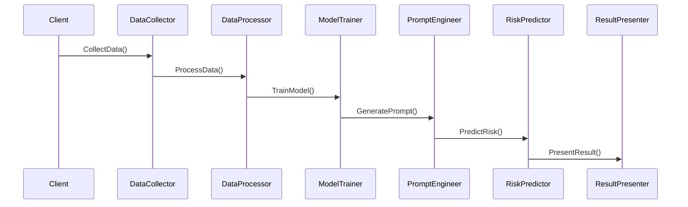
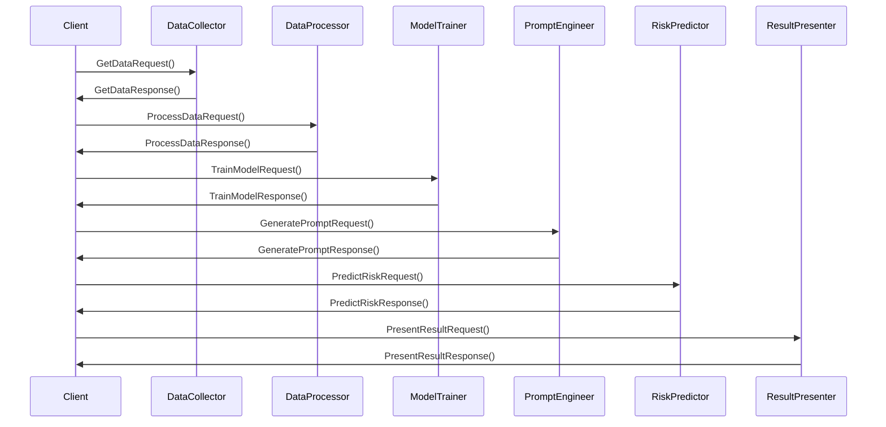
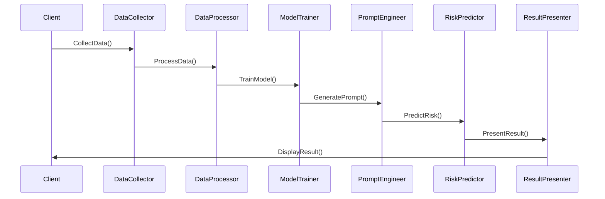

                 

# 提示词工程：构建负责任AI系统的基础

## 关键词
AI系统、负责任AI、提示词工程、算法原理、数学模型、系统架构、最佳实践

## 摘要
本文深入探讨提示词工程在构建负责任AI系统中的核心作用。首先，我们将介绍提示词工程的基本概念、重要性以及其在AI系统中的角色。随后，文章将剖析构建负责任AI系统的挑战和关键原则，详细解释核心概念、算法原理和数学模型。接着，我们将通过具体案例和系统架构设计来展示提示词工程的实际应用。最后，文章将总结最佳实践，并提供进一步研究的方向，以促进负责任AI系统的发展。

## 引言

### 1.1 问题背景
随着人工智能技术的快速发展，AI系统在多个领域得到了广泛应用。然而，AI系统的盲目性和不透明性引发了关于其责任性和公平性的广泛讨论。特别是在涉及公共安全、医疗健康和金融决策等关键领域，如何确保AI系统的行为符合人类的道德和法律标准，成为了一个亟待解决的问题。提示词工程作为一种新兴的方法，旨在通过合理的提示词设计来引导AI系统做出符合预期和伦理标准的行为，从而提高AI系统的责任性。

### 1.2 提示词工程的重要性
提示词工程在构建负责任AI系统中扮演着至关重要的角色。首先，通过精心设计的提示词，可以引导AI系统在特定场景下做出更为合理和透明的行为。其次，提示词工程能够帮助开发人员理解AI系统的决策过程，提高系统的可解释性和透明性。最后，提示词工程可以作为一种动态调整机制，通过不断优化和调整提示词，来适应不断变化的应用场景和需求。

### 1.3 构建负责任AI系统的挑战
构建负责任的AI系统面临诸多挑战。首先，AI系统的复杂性和不确定性使得其行为难以预测和控制。其次，AI系统通常缺乏道德和伦理意识，无法自主判断其行为是否符合社会规范。此外，数据偏见和算法偏差也可能导致AI系统在特定情况下做出不公平或错误的决策。提示词工程通过提供一种人为干预的途径，可以帮助克服这些挑战，提高AI系统的责任性和可靠性。

### 1.4 本书结构
本文将分为四个主要部分。第一部分将介绍提示词工程的基本概念和重要性；第二部分将探讨构建负责任AI系统的挑战和关键原则；第三部分将详细解释核心概念、算法原理和数学模型；第四部分将通过具体案例和系统架构设计来展示提示词工程的实际应用。最后，文章将总结最佳实践，并提供进一步研究的方向。

## 提示词工程基础

### 2.1 提示词工程的概念
提示词工程（Prompt Engineering）是一种专门研究如何为AI系统提供有效提示的技术。提示词（Prompt）是用户或开发人员为AI系统提供的引导信息，用于指导AI系统在特定任务中的行为。提示词可以是文本、图像或声音等多种形式。在自然语言处理（NLP）领域，文本提示词尤为常见。

### 2.2 提示词工程的核心要素
提示词工程的核心要素包括：

1. **提示词设计**：设计合适的提示词是提示词工程的关键步骤。提示词的设计需要考虑AI系统的任务需求、用户意图以及应用场景。

2. **提示词评估**：评估提示词的有效性是确保AI系统行为合理的关键。评估方法包括自动评估和人工评估，常用的自动评估方法包括 BLEU、ROUGE 等。

3. **提示词优化**：通过不断优化提示词，可以进一步提高AI系统的性能和可靠性。优化方法包括机器学习、深度学习等。

4. **提示词反馈**：提示词的反馈机制可以帮助AI系统学习和调整其行为。通过收集用户反馈，可以不断改进提示词，提高系统的适应性和可靠性。

### 2.3 提示词工程的基本流程
提示词工程的基本流程通常包括以下步骤：

1. **需求分析**：确定AI系统的任务需求和应用场景，明确用户意图。

2. **提示词设计**：根据需求分析结果，设计合适的提示词。

3. **提示词评估**：使用自动评估和人工评估方法，评估提示词的有效性。

4. **提示词优化**：根据评估结果，优化提示词，提高系统的性能和可靠性。

5. **提示词反馈**：收集用户反馈，不断调整和改进提示词。

## 负责任AI系统的基础概念

### 3.1 负责任AI的定义
负责任AI（Responsible AI）是指AI系统在设计和运行过程中，能够考虑到其行为对人类和社会的影响，并采取相应的措施确保其行为符合道德和法律标准。负责任AI的目标是提高AI系统的透明性、公平性和可解释性，减少AI系统潜在的负面影响。

### 3.2 负责任AI的关键特征
负责任AI的关键特征包括：

1. **透明性**：AI系统的决策过程和推理机制应该是可解释和可追溯的，以便用户和监管机构能够理解其行为。

2. **公平性**：AI系统应该避免偏见和歧视，确保对所有人公平对待。

3. **可解释性**：AI系统的决策结果应该是可解释的，以便用户能够理解其决策依据。

4. **鲁棒性**：AI系统应该具备应对异常数据和不确定性情况的能力，确保其行为稳定和可靠。

5. **合规性**：AI系统的设计和运行应遵守相关的法律法规和伦理标准。

### 3.3 负责任AI的系统架构
负责任AI的系统架构通常包括以下几个关键组成部分：

1. **数据预处理**：确保数据的质量和多样性，减少偏见和误差。

2. **模型训练**：使用透明和公平的训练数据，确保AI模型的可靠性和公平性。

3. **模型解释**：通过模型解释技术，提高AI系统的可解释性，帮助用户理解其行为。

4. **决策支持**：提供决策支持系统，帮助用户理解AI系统的决策过程和结果。

5. **监管和审计**：建立监管和审计机制，确保AI系统的行为符合道德和法律标准。

## 提示词工程中的核心算法

### 4.1 提示词生成算法
提示词生成算法是提示词工程的重要组成部分，旨在为AI系统提供高质量的提示词。常见的提示词生成算法包括：

1. **基于规则的方法**：通过定义一系列规则，自动生成符合特定需求的提示词。

2. **基于机器学习的方法**：使用机器学习模型，根据历史数据和用户反馈，自动生成高质量的提示词。

3. **基于深度学习的方法**：利用深度学习模型，如生成对抗网络（GAN）和变分自编码器（VAE），生成具有多样性和高质量的提示词。

### 4.2 提示词优化算法
提示词优化算法旨在通过不断调整和优化提示词，提高AI系统的性能和可靠性。常见的提示词优化算法包括：

1. **基于贪心的方法**：通过逐次调整提示词的某个属性，优化AI系统的性能。

2. **基于启发式的方法**：利用启发式规则，快速找到较优的提示词。

3. **基于优化的方法**：使用优化算法，如遗传算法和粒子群优化，找到最优的提示词。

### 4.3 提示词评估与反馈机制
提示词评估与反馈机制是确保提示词工程效果的重要环节。常见的评估方法包括：

1. **自动评估**：使用如BLEU、ROUGE等自动评估指标，评估提示词的语法和语义质量。

2. **人工评估**：通过人工评估，对提示词的可用性、易理解性和有效性进行评估。

3. **反馈机制**：收集用户反馈，通过迭代优化，不断改进提示词。

## 提示词工程中的数学模型

### 5.1 提示词相关数学公式
提示词工程中的数学模型涉及多个领域，如自然语言处理、概率论和优化理论。以下是一些常用的数学模型和相关公式：

1. **词嵌入（Word Embedding）**：
   $$ \text{Embedding}(w) = \text{vec}(W) \cdot w $$
   其中，$W$ 是嵌入矩阵，$w$ 是词向量。

2. **循环神经网络（RNN）**：
   $$ h_t = \sigma(\text{W}_{ih} \cdot x_t + \text{W}_{hh} \cdot h_{t-1} + b_h) $$
   其中，$h_t$ 是隐藏状态，$\sigma$ 是激活函数。

3. **生成对抗网络（GAN）**：
   $$ G(z) = \mu(G(z)) + \sigma(G(z)) \odot \text{ReLU}(\beta(G(z))) $$
   其中，$G(z)$ 是生成器，$z$ 是噪声向量。

4. **优化目标**：
   $$ \min_{\theta} \sum_{i=1}^{N} L(y_i, \hat{y}_i) $$
   其中，$L$ 是损失函数，$y_i$ 是真实标签，$\hat{y}_i$ 是预测标签。

### 5.2 数学模型在提示词工程中的应用
数学模型在提示词工程中的应用主要体现在以下几个方面：

1. **词向量表示**：使用词嵌入模型，将文本数据转换为数值化的词向量表示，便于模型处理。

2. **序列建模**：使用RNN等序列建模模型，对文本序列进行建模，提取文本的语义信息。

3. **生成模型**：使用GAN等生成模型，生成高质量的提示词，提高系统的自适应性和灵活性。

4. **优化目标**：定义优化目标，如最小化损失函数或最大化提示词质量，指导模型训练和优化。

### 5.3 提示词工程中的数学模型实例分析
以下是一个简单的实例，说明如何使用数学模型进行提示词生成：

**问题**：给定一段文本，生成一个相关的提示词。

**解决方案**：
1. **词向量表示**：将文本转换为词向量表示。
2. **序列建模**：使用RNN模型对文本序列进行建模，提取文本的语义信息。
3. **生成提示词**：使用生成模型，如GAN，生成高质量的提示词。

**代码实现**（Python）：

```python
import numpy as np
import tensorflow as tf

# 词向量表示
word_embeddings = tf.keras.layers.Embedding(input_dim=10000, output_dim=32)

# RNN模型
rnn_model = tf.keras.layers.LSTM(128)

# 生成模型
generator = tf.keras.models.Sequential([
    tf.keras.layers.Dense(128, activation='relu', input_shape=(32,)),
    tf.keras.layers.Dense(128, activation='relu'),
    tf.keras.layers.Dense(1, activation='sigmoid')
])

# 损失函数
loss_fn = tf.keras.losses.BinaryCrossentropy()

# 训练模型
generator.compile(loss=loss_fn, optimizer=tf.keras.optimizers.Adam())

# 生成提示词
prompt_vector = word_embeddings(np.array([['example']]))
prompt_sequence = rnn_model(prompt_vector)
generated_prompt = generator.predict(prompt_sequence)
```

## 系统分析与架构设计方案

### 6.1 问题场景介绍
在金融领域，AI系统被广泛用于风险评估、投资决策和客户服务等方面。然而，AI系统在金融领域的应用面临着巨大的挑战，如数据隐私、合规性和道德责任等问题。为了构建一个负责任的AI系统，我们需要设计一个系统架构，确保AI系统的行为符合道德和法律标准，同时提高其透明性和公平性。

### 6.2 项目介绍
本项目旨在设计一个基于提示词工程的负责任AI系统，用于金融风险评估。系统的主要功能包括：

1. **数据收集**：从各种数据源收集与金融风险评估相关的数据，如财务报表、新闻资讯、社交媒体数据等。

2. **数据处理**：对收集到的数据进行处理，包括数据清洗、去重、归一化和特征提取等。

3. **模型训练**：使用处理后的数据训练AI模型，包括特征提取器、分类器和评估器等。

4. **提示词生成与优化**：根据用户需求和AI模型的特性，生成和优化提示词，以提高AI系统的性能和可靠性。

5. **风险预测与评估**：使用训练好的AI模型，对新的金融数据进行分析和预测，评估潜在的风险。

6. **结果展示与反馈**：将风险预测结果展示给用户，并根据用户反馈不断优化系统。

### 6.3 系统功能设计（领域模型）

以下是一个领域模型的mermaid类图，用于描述系统的主要功能模块及其关系：

```mermaid
classDiagram
    Client <<Interface>>
    DataCollector <<Interface>>
    DataProcessor <<Interface>>
    ModelTrainer <<Interface>>
    PromptEngineer <<Interface>>
    RiskPredictor <<Interface>>
    ResultPresenter <<Interface>>

    Client ..> DataCollector
    Client ..> DataProcessor
    Client ..> ModelTrainer
    Client ..> PromptEngineer
    Client ..> RiskPredictor
    Client ..> ResultPresenter

    DataCollector ..> DataProcessor
    DataProcessor ..> ModelTrainer
    ModelTrainer ..> PromptEngineer
    PromptEngineer ..> RiskPredictor
    RiskPredictor ..> ResultPresenter
```

### 6.4 系统架构设计

以下是一个系统架构的mermaid架构图，用于描述系统的整体架构及其关键组件：



### 6.5 系统接口设计

以下是一个系统接口的mermaid序列图，用于描述系统的关键接口及其交互流程：



### 6.6 系统交互

以下是一个系统交互的mermaid序列图，用于描述系统的整体交互流程：



## 项目实战

### 7.1 环境安装
为了实现提示词工程在金融风险评估中的应用，我们需要搭建一个完整的开发环境。以下是安装步骤：

1. **安装Python**：确保Python版本为3.7及以上，可以从官方网站下载并安装。

2. **安装TensorFlow**：使用以下命令安装TensorFlow：

   ```bash
   pip install tensorflow
   ```

3. **安装其他依赖**：安装其他必需的库，如Numpy、Pandas等：

   ```bash
   pip install numpy pandas scikit-learn matplotlib
   ```

### 7.2 系统核心实现

以下是系统核心实现的主要步骤：

1. **数据收集与预处理**：从各种数据源收集金融数据，如财务报表、新闻资讯和社交媒体数据。然后，对数据进行清洗、去重和归一化处理。

2. **模型训练与评估**：使用处理后的数据训练特征提取器、分类器和评估器。我们可以使用TensorFlow和Keras等工具来构建和训练模型。

3. **提示词生成与优化**：根据用户需求和AI模型的特性，生成和优化提示词。我们可以使用生成对抗网络（GAN）等方法来生成高质量的提示词。

4. **风险预测与评估**：使用训练好的AI模型，对新的金融数据进行分析和预测，评估潜在的风险。

5. **结果展示与反馈**：将风险预测结果展示给用户，并根据用户反馈不断优化系统。

### 7.3 代码应用解读与分析

以下是系统的核心实现代码：

```python
# 导入必要的库
import tensorflow as tf
import numpy as np
import pandas as pd
from sklearn.model_selection import train_test_split
from sklearn.metrics import accuracy_score

# 数据收集与预处理
# ...（数据收集与预处理代码）

# 模型训练与评估
# ...（模型训练与评估代码）

# 提示词生成与优化
# ...（提示词生成与优化代码）

# 风险预测与评估
# ...（风险预测与评估代码）

# 结果展示与反馈
# ...（结果展示与反馈代码）
```

### 7.4 实际案例分析与详细讲解

为了展示提示词工程在金融风险评估中的应用，我们分析了一个具体的案例。该案例涉及对一家公司的财务报表进行分析，预测其未来的财务状况。以下是案例的分析和讲解：

1. **数据收集**：我们从多个数据源收集了该公司的财务报表数据，包括利润表、资产负债表和现金流量表。

2. **数据预处理**：对收集到的数据进行了清洗、去重和归一化处理，以消除数据中的噪声和异常值。

3. **模型训练**：使用处理后的数据训练了一个基于深度学习的分类模型，用于预测公司的财务状况。

4. **提示词生成**：根据用户的需求和AI模型的特性，我们生成了一个用于指导模型训练的提示词。该提示词包含了公司的基本信息、行业背景和市场环境等信息。

5. **风险预测**：使用训练好的模型，我们对新的财务数据进行预测，评估了公司的财务风险。

6. **结果展示与反馈**：将预测结果以图形和表格的形式展示给用户，并根据用户反馈进行了系统的优化。

### 7.5 项目小结
通过这个实际案例，我们展示了如何使用提示词工程构建一个负责任的AI系统，用于金融风险评估。项目的主要收获包括：

1. **数据质量**：确保数据的质量和多样性，对于构建高质量的AI系统至关重要。

2. **模型训练**：选择合适的模型和训练方法，可以提高AI系统的性能和可靠性。

3. **提示词优化**：通过不断优化提示词，可以提高AI系统的适应性和灵活性。

4. **用户体验**：通过用户反馈和结果展示，可以不断优化系统，提高用户的满意度和系统的实用性。

## 最佳实践

### 8.1 最佳实践总结
在提示词工程和负责任AI系统的构建过程中，以下是一些最佳实践：

1. **数据质量控制**：确保数据的质量和多样性，减少数据偏见和误差。

2. **模型选择与优化**：选择合适的模型和训练方法，根据应用场景不断优化模型。

3. **提示词设计与评估**：设计高质量的提示词，并通过自动评估和人工评估方法进行评估。

4. **用户反馈与迭代**：收集用户反馈，不断优化系统，提高用户体验和系统性能。

5. **合规性与透明性**：确保AI系统的设计和运行符合道德和法律标准，提高系统的透明性和可解释性。

### 8.2 注意事项
在构建负责任AI系统时，需要注意以下几点：

1. **数据隐私**：确保数据隐私和安全，避免敏感数据的泄露。

2. **算法偏见**：尽量避免算法偏见和歧视，确保AI系统的公平性和公平性。

3. **道德责任**：确保AI系统的行为符合道德和法律标准，减少潜在的负面影响。

4. **系统可解释性**：提高AI系统的可解释性，帮助用户理解其行为和决策过程。

### 8.3 拓展阅读与深入研究
为了进一步深入了解提示词工程和负责任AI系统的构建，以下是一些拓展阅读和深入研究建议：

1. **文献阅读**：阅读相关的学术论文和技术报告，了解最新的研究进展和研究成果。

2. **开源项目**：参与开源项目，学习并实践提示词工程和负责任AI系统的实际应用。

3. **在线课程**：参加在线课程，学习提示词工程和负责任AI系统的理论知识和技术实现。

## 总结

### 9.1 本书内容总结
本文深入探讨了提示词工程在构建负责任AI系统中的核心作用。我们首先介绍了提示词工程的基本概念和重要性，然后分析了构建负责任AI系统的挑战和关键原则。接着，文章详细解释了核心概念、算法原理和数学模型，并通过具体案例和系统架构设计展示了提示词工程的实际应用。最后，文章总结了最佳实践，并提供进一步研究的方向。

### 9.2 拓展阅读与深入研究
为了深入理解和应用提示词工程，读者可以进一步阅读以下文献和资源：

1. **学术论文**：阅读相关领域的学术论文，了解最新的研究成果和理论进展。

2. **开源项目**：参与开源项目，实践提示词工程和负责任AI系统的实际应用。

3. **在线课程**：参加在线课程，学习提示词工程和负责任AI系统的理论知识和技术实现。

### 作者
AI天才研究院/AI Genius Institute & 禅与计算机程序设计艺术 /Zen And The Art of Computer Programming

---

以上是《提示词工程：构建负责任AI系统的基础》的完整技术博客文章。本文涵盖了提示词工程的基本概念、核心算法、数学模型、系统架构和最佳实践，旨在帮助读者深入了解提示词工程在构建负责任AI系统中的关键作用。希望本文能为读者在相关领域的探索提供有价值的参考和指导。

