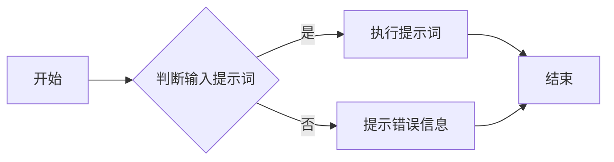
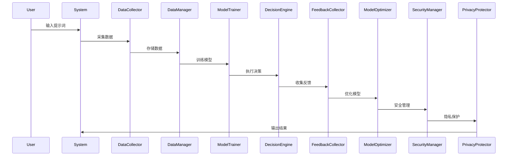
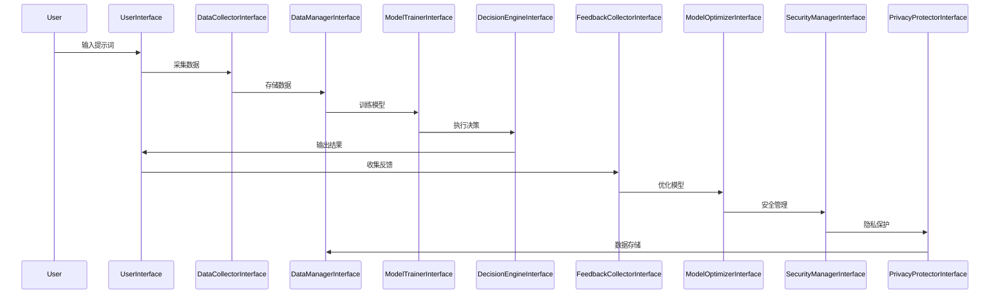

                 


## 第1章 引言

### 1.1 问题背景

随着人工智能技术的快速发展，AI系统已经渗透到各个行业和领域，从医疗诊断到自动驾驶，从金融预测到智能客服，AI系统正在改变我们的生活方式。然而，随着AI系统的广泛应用，一系列问题也接踵而至。尤其是在决策过程中，AI系统的透明性、可解释性和负责任性成为了公众和学术界关注的焦点。提示词工程，作为构建负责任AI系统的基础，正是为了解决这些挑战而诞生。

#### 人工智能的快速发展

人工智能，作为计算机科学的一个分支，起源于20世纪50年代。从最初的规则推理和知识表示，到后来的机器学习和深度学习，人工智能经历了多次技术革命。特别是在21世纪初，随着大数据和计算能力的提升，人工智能迎来了前所未有的发展。深度学习算法的突破，使得计算机在图像识别、语音识别、自然语言处理等领域的性能达到了前所未有的高度。

#### AI系统的广泛应用

AI系统已经广泛应用于各个行业。在医疗领域，AI系统可以辅助医生进行诊断和治疗；在金融领域，AI系统可以进行风险控制和智能投资；在交通领域，自动驾驶技术正在逐步走向现实。这些AI系统在提高生产效率、降低人力成本、提升服务质量等方面发挥了重要作用。

### 1.2 问题描述

#### AI系统的决策过程

AI系统的决策过程通常涉及多个阶段，包括数据收集、模型训练、决策推理和结果输出。在这个过程中，提示词起到了关键作用。提示词是用户或者系统提供给AI系统的信息，用于指导AI系统的决策过程。

#### 提示词的作用

提示词的作用是引导AI系统做出正确的决策。一个有效的提示词可以明确AI系统的目标，提供必要的上下文信息，从而提高决策的准确性。然而，如果提示词不合适或者存在偏差，可能会导致AI系统做出错误的决策。

#### 负责任AI系统的构建

负责任AI系统是指能够在保证准确性和效率的同时，考虑到社会伦理和道德规范的AI系统。构建负责任AI系统的关键在于确保AI系统的决策过程是透明、可解释和可追溯的。提示词工程正是为了实现这一目标而提出的一种方法。

### 1.3 问题解决

#### 提示词工程的方法

提示词工程是一种系统化的方法，用于设计、开发和优化提示词。它包括以下几个关键步骤：

1. **需求分析**：理解用户的需求和AI系统的目标，明确需要解决的问题。
2. **提示词设计**：根据需求分析的结果，设计出合适的提示词。
3. **提示词优化**：通过实验和评估，不断优化提示词，提高决策的准确性。
4. **反馈机制**：建立反馈机制，收集用户反馈，不断调整和改进提示词。

#### 负责任AI系统的构建策略

构建负责任AI系统需要从多个方面进行考虑：

1. **透明性**：确保AI系统的决策过程是透明的，用户可以理解AI系统是如何做出决策的。
2. **可解释性**：提供足够的解释，让用户可以理解AI系统的决策依据。
3. **可追溯性**：记录AI系统的决策过程和依据，以便在出现问题时可以进行追溯和审计。

### 1.4 边界与外延

#### 提示词工程的应用领域

提示词工程可以应用于各种AI系统，包括但不限于：

1. **自然语言处理**：例如，智能客服系统中的对话管理。
2. **计算机视觉**：例如，图像识别系统中的目标检测。
3. **推荐系统**：例如，电商平台的个性化推荐。

#### 负责任AI系统的核心要素

负责任AI系统的核心要素包括：

1. **算法透明性**：确保算法的决策过程是透明的，用户可以理解。
2. **数据质量**：确保训练数据和输入数据的准确性和完整性。
3. **隐私保护**：在处理用户数据时，确保用户的隐私不受侵犯。

### 1.5 核心概念

#### 提示词

提示词是指用户或者系统提供给AI系统的信息，用于指导AI系统的决策过程。一个有效的提示词应该具备以下几个特征：

1. **明确性**：提示词应该清晰明确，避免歧义。
2. **相关性**：提示词应该与AI系统的目标相关，提供必要的上下文信息。
3. **可调整性**：提示词应该可以根据实际情况进行调整和优化。

#### 负责任AI

负责任AI是指能够在保证准确性和效率的同时，考虑到社会伦理和道德规范的AI系统。负责任AI的核心目标是确保AI系统的决策过程是透明、可解释和可追溯的。

#### 提示词工程流程

提示词工程流程包括以下几个步骤：

1. **需求分析**：理解用户的需求和AI系统的目标。
2. **提示词设计**：设计出合适的提示词。
3. **提示词优化**：通过实验和评估，不断优化提示词。
4. **反馈机制**：收集用户反馈，不断调整和改进提示词。

## 第2章 核心概念与联系

### 2.1 提示词原理

#### 提示词的定义

提示词是指用户或者系统提供给AI系统的信息，用于指导AI系统的决策过程。它是AI系统与外部世界进行交互的桥梁，是AI系统理解人类意图和需求的重要途径。

#### 提示词的作用

提示词在AI系统中起到了至关重要的作用。它不仅能够引导AI系统做出正确的决策，还能够提高AI系统的可解释性和透明性。具体来说，提示词的作用包括：

1. **明确目标**：通过提供明确的提示词，可以帮助AI系统更好地理解用户的意图和需求，从而做出更准确的决策。
2. **提供上下文**：提示词可以提供与决策相关的上下文信息，帮助AI系统更好地理解和处理复杂的问题。
3. **优化性能**：通过优化提示词，可以提高AI系统的性能和效率。

#### 提示词的类型

根据不同的应用场景和需求，提示词可以分为以下几种类型：

1. **自然语言提示词**：例如，用户在智能客服系统中的输入。
2. **数值提示词**：例如，图像识别系统中的标签。
3. **符号提示词**：例如，逻辑推理系统中的条件语句。

### 2.2 提示词属性特征对比表格

以下是一个简单的提示词属性特征对比表格，用于展示不同类型提示词的特点：

| 提示词类型 | 特征1 | 特征2 | 特征3 |
| :------: | :---: | :---: | :---: |
| 自然语言提示词 | 明确性 | 相关性 | 可调整性 |
| 数值提示词 | 精确性 | 可比性 | 可计算性 |
| 符号提示词 | 条件性 | 确定性 | 简洁性 |

### 2.3 ER实体关系图架构

为了更好地理解提示词在AI系统中的关系，我们可以使用Mermaid语言绘制一个ER实体关系图。以下是一个简单的示例：

```mermaid
erDiagram
    AI系统 ||--o{ 提示词 }
    提示词 ||--o{ AI系统 }
```

在这个ER图中，AI系统和提示词是双向关联的。提示词来源于用户或系统，用于指导AI系统的决策过程；同时，AI系统根据提示词做出决策，并将结果反馈给用户或系统。

### 2.4 负责任AI原理

#### 负责任AI的定义

负责任AI是指能够在保证准确性和效率的同时，考虑到社会伦理和道德规范的AI系统。它不仅关注AI系统的技术性能，还关注AI系统对社会的影响。

#### 负责任AI的核心要素

负责任AI的核心要素包括：

1. **透明性**：确保AI系统的决策过程是透明的，用户可以理解。
2. **可解释性**：提供足够的解释，让用户可以理解AI系统的决策依据。
3. **可追溯性**：记录AI系统的决策过程和依据，以便在出现问题时可以进行追溯和审计。
4. **公平性**：确保AI系统的决策过程是公平的，不会歧视或偏见特定的用户群体。
5. **隐私保护**：在处理用户数据时，确保用户的隐私不受侵犯。

#### 负责任AI的实现方法

实现负责任AI可以从以下几个方面入手：

1. **算法透明性**：通过开源算法、透明编码和文档化，提高算法的透明性。
2. **数据质量控制**：确保训练数据和输入数据的准确性和完整性。
3. **用户反馈机制**：建立用户反馈机制，收集用户对AI系统决策的反馈，并进行调整和优化。
4. **伦理审查**：在进行AI系统研发和应用时，进行伦理审查，确保符合社会伦理和道德规范。
5. **法律法规遵守**：遵守相关法律法规，确保AI系统的合规性。

## 第3章 算法原理讲解

### 3.1 算法mermaid流程图

为了更好地理解提示词算法的原理，我们可以使用Mermaid语言绘制一个流程图。以下是一个简单的示例：



在这个流程图中，算法首先接收输入的提示词，然后进行判断。如果提示词有效，则执行提示词；否则，提示错误信息。最后，算法结束。

### 3.2 Python源代码

下面是一个简单的Python源代码示例，用于实现提示词算法：

```python
# 提示词算法Python实现
def process_prompt(prompt):
    if is_valid_prompt(prompt):
        execute_prompt(prompt)
    else:
        print("Invalid prompt!")

# 判断提示词是否有效
def is_valid_prompt(prompt):
    # ... 判断逻辑 ...

# 执行提示词
def execute_prompt(prompt):
    # ... 执行逻辑 ...

# 主函数
def main():
    prompt = input("请输入提示词：")
    process_prompt(prompt)

if __name__ == "__main__":
    main()
```

在这个示例中，`process_prompt` 函数是算法的核心，它首先调用 `is_valid_prompt` 函数判断提示词是否有效。如果有效，则调用 `execute_prompt` 函数执行提示词；否则，输出 "Invalid prompt!"。

### 3.3 算法原理详细讲解

#### 提示词有效性判断

提示词有效性判断是提示词算法的一个重要环节。一个有效的提示词应该满足以下条件：

1. **格式正确**：提示词应该符合规定的格式，例如，字符编码、长度限制等。
2. **内容合理**：提示词的内容应该符合实际情况，不包含虚假或误导性的信息。
3. **上下文相关**：提示词应该与当前情境相关，提供必要的上下文信息。

#### 提示词执行流程

提示词执行流程包括以下几个步骤：

1. **接收输入**：算法首先接收输入的提示词。
2. **判断有效性**：调用 `is_valid_prompt` 函数判断提示词是否有效。
3. **执行提示词**：如果提示词有效，调用 `execute_prompt` 函数执行提示词。
4. **输出结果**：执行结果可以是直接输出，也可以是存储到数据库或其他存储介质。

#### 错误处理机制

在提示词算法中，错误处理机制是必不可少的。当提示词无效时，算法应该提供错误信息，并引导用户正确输入提示词。以下是一个简单的错误处理示例：

```python
# 错误处理示例
def process_prompt(prompt):
    if is_valid_prompt(prompt):
        execute_prompt(prompt)
    else:
        print("Invalid prompt! Please try again.")
        prompt = input("请重新输入提示词：")
        process_prompt(prompt)
```

在这个示例中，当提示词无效时，算法会输出 "Invalid prompt! Please try again." 并重新接收用户输入的提示词，直到输入的提示词有效为止。

### 3.4 举例说明

为了更好地理解提示词算法的原理，我们可以通过几个具体的示例来说明。

#### 示例1：有效的自然语言提示词

输入：`"帮我找到附近的餐厅"`

输出：AI系统根据提示词，搜索附近的餐厅信息，并返回结果。

#### 示例2：无效的自然语言提示词

输入：`"寻找食物"`

输出：AI系统判断提示词无效，输出 "Invalid prompt! Please try again." 并要求用户重新输入提示词。

#### 示例3：有效的数值提示词

输入：`"100"`

输出：AI系统根据提示词，返回与数值相关的信息，例如，股票代码、商品编号等。

通过这些示例，我们可以看到提示词算法在实际应用中的工作原理。有效的提示词可以指导AI系统做出正确的决策，而无效的提示词则需要重新输入或进行错误处理。

## 第4章 数学模型和数学公式

### 4.1 数学模型

在提示词工程中，数学模型扮演着重要的角色。数学模型可以帮助我们量化提示词的影响，评估AI系统的性能，以及优化提示词的设计。以下是一个简单的数学模型示例：

#### 提示词权重计算

提示词权重是衡量提示词重要性的指标。一个有效的提示词应该具有较高的权重，以便在AI系统中得到更好的应用。提示词权重可以通过以下公式计算：

$$
\text{提示词权重} = \frac{\text{提示词使用频率}}{\text{总使用频率}}
$$

其中，提示词使用频率是指提示词在一段时间内被使用的次数，总使用频率是指所有提示词在该时间段内被使用的总次数。通过这个公式，我们可以计算出每个提示词的权重，并根据权重对提示词进行排序和优化。

#### 负责任AI评估指标

负责任AI评估指标是衡量AI系统负责任性能的指标。一个负责任的AI系统应该能够在保证准确性和效率的同时，考虑到社会伦理和道德规范。以下是一个简单的负责任AI评估指标示例：

$$
\text{负责任AI评估指标} = \frac{\text{正确决策数}}{\text{总决策数}}
$$

其中，正确决策数是指在一段时间内，AI系统做出的正确决策次数，总决策数是指在相同时间段内，AI系统做出的总决策次数。通过这个公式，我们可以计算出AI系统的负责任评估指标，并根据评估结果对AI系统进行调整和优化。

### 4.2 数学公式

在提示词工程中，数学公式被广泛应用于提示词设计、算法优化和性能评估。以下是一些常用的数学公式：

#### 提示词权重计算公式

$$
\text{提示词权重} = \frac{\text{提示词使用频率}}{\text{总使用频率}}
$$

这个公式用于计算每个提示词的权重，以便在AI系统中得到更好的应用。

#### 负责任AI评估指标公式

$$
\text{负责任AI评估指标} = \frac{\text{正确决策数}}{\text{总决策数}}
$$

这个公式用于计算AI系统的负责任评估指标，以便衡量AI系统的负责任性能。

通过这些数学公式，我们可以对提示词工程进行量化分析，从而提高AI系统的性能和可解释性。

## 第5章 系统分析与架构设计

### 5.1 问题场景介绍

在当今的数字化时代，人工智能（AI）系统已经深入到我们生活的方方面面，从智能家居到金融分析，从医疗诊断到自动驾驶，AI系统的应用场景越来越广泛。然而，随着AI系统的不断发展和应用，如何构建一个负责任的AI系统成为了学术界和工业界共同关注的重要问题。本章节将围绕构建负责任AI系统的需求、挑战以及应用场景进行详细讨论。

#### AI系统的应用场景

AI系统在不同的应用场景中发挥着重要的作用。以下是一些常见的AI系统应用场景：

1. **医疗诊断**：利用AI系统进行疾病诊断、治疗建议和药物研发。
2. **金融分析**：利用AI系统进行风险评估、欺诈检测和投资建议。
3. **智能制造**：利用AI系统进行生产优化、设备故障预测和质量检测。
4. **自动驾驶**：利用AI系统实现车辆的自动驾驶功能，提高交通效率和安全性。
5. **智能客服**：利用AI系统实现自动化的客户服务，提高客户满意度和运营效率。

#### 提示词工程的需求

在上述应用场景中，提示词工程扮演着关键角色。一个有效的提示词工程可以帮助AI系统更好地理解用户需求，提高决策的准确性和可解释性。以下是一些具体的提示词工程需求：

1. **个性化推荐**：在电商、社交媒体等领域，利用提示词工程实现个性化的推荐系统。
2. **自然语言处理**：在智能客服、智能助理等领域，利用提示词工程实现自然语言理解和生成。
3. **计算机视觉**：在图像识别、目标检测等领域，利用提示词工程实现更准确和智能的图像分析。
4. **语音识别**：在语音助手、语音识别系统等领域，利用提示词工程实现更准确和自然的语音交互。

### 5.2 系统功能设计

为了构建一个负责任的AI系统，我们需要设计一系列关键功能模块，这些模块共同协作，确保AI系统的透明性、可解释性和可追溯性。以下是一些核心功能模块的设计：

1. **数据采集与管理**：负责收集、存储和管理训练数据和用户数据，确保数据的安全和完整性。
2. **模型训练与优化**：负责训练AI模型，并使用提示词工程优化模型的性能和可解释性。
3. **决策推理与执行**：负责基于提示词进行决策推理，并执行相应的操作。
4. **反馈与优化**：负责收集用户反馈，并基于反馈对AI系统进行调整和优化。
5. **安全与隐私保护**：负责确保AI系统的安全性和用户隐私的保护。

#### 领域模型mermaid类图

为了更好地理解AI系统的架构，我们可以使用Mermaid语言绘制一个领域模型类图。以下是一个简单的示例：

```mermaid
classDiagram
    User -> DataCollector
    DataCollector -> DataManager
    DataManager -> ModelTrainer
    ModelTrainer -> DecisionEngine
    DecisionEngine -> FeedbackCollector
    FeedbackCollector -> ModelOptimizer
    ModelOptimizer -> SecurityManager
    SecurityManager -> PrivacyProtector
```

在这个类图中，用户通过数据采集模块向数据管理模块提交数据，数据管理模块将数据存储在数据库中。模型训练模块使用这些数据训练AI模型，并将模型传递给决策执行模块。决策执行模块根据提示词执行决策操作，并将反馈传递给反馈收集模块。反馈收集模块将反馈传递给模型优化模块，模型优化模块根据反馈对模型进行调整和优化。同时，安全管理和隐私保护模块负责确保系统的安全性和用户隐私。

### 5.3 系统架构设计

为了构建一个高效、可靠和可扩展的AI系统，我们需要设计一个合理的系统架构。以下是一个简单的系统架构设计，包括系统组件、接口和数据流。

#### 系统架构设计mermaid架构图

使用Mermaid语言，我们可以绘制一个简单的系统架构图，如下所示：



在这个架构图中，用户通过输入提示词与系统进行交互。系统首先采集数据，然后存储在数据管理模块中。模型训练模块使用这些数据训练AI模型，并将模型传递给决策执行模块。决策执行模块根据提示词执行决策操作，并将反馈传递给反馈收集模块。反馈收集模块将反馈传递给模型优化模块，模型优化模块根据反馈对模型进行调整和优化。同时，安全管理和隐私保护模块负责确保系统的安全性和用户隐私。

#### 系统架构设计说明

在这个系统架构设计中，各个模块之间通过明确的接口进行交互，从而确保系统的模块化和可扩展性。以下是对各个模块的详细说明：

1. **用户接口**：负责与用户进行交互，接收用户的提示词，并输出决策结果。
2. **数据采集模块**：负责采集用户输入的提示词和数据，并将其传递给数据管理模块。
3. **数据管理模块**：负责存储和管理训练数据和用户数据，确保数据的安全和完整性。
4. **模型训练模块**：负责使用训练数据训练AI模型，并将训练好的模型传递给决策执行模块。
5. **决策执行模块**：负责根据提示词执行决策操作，并将决策结果传递给用户接口。
6. **反馈收集模块**：负责收集用户的反馈信息，并将其传递给模型优化模块。
7. **模型优化模块**：负责根据用户反馈对模型进行调整和优化。
8. **安全管理模块**：负责确保系统的安全性和用户隐私，包括身份验证、访问控制和数据加密等。
9. **隐私保护模块**：负责对用户数据进行加密和脱敏处理，确保用户隐私不受侵犯。

通过这个系统架构设计，我们可以构建一个高效、可靠和可扩展的AI系统，从而满足各种应用场景的需求。

### 5.4 系统接口设计

在AI系统的架构设计中，接口设计是至关重要的一环。系统接口不仅定义了各个模块之间的交互方式，还影响了系统的可维护性和可扩展性。以下是一个简单的系统接口设计，包括接口功能说明和Mermaid序列图。

#### 接口功能说明

1. **用户接口**：提供与用户的交互界面，接收用户输入的提示词，并输出决策结果。
2. **数据采集接口**：提供数据采集模块与数据管理模块之间的数据传输接口。
3. **数据管理接口**：提供数据管理模块与模型训练模块之间的数据共享接口。
4. **模型训练接口**：提供模型训练模块与决策执行模块之间的模型传输接口。
5. **决策执行接口**：提供决策执行模块与用户接口之间的结果反馈接口。
6. **反馈收集接口**：提供反馈收集模块与模型优化模块之间的反馈传输接口。
7. **模型优化接口**：提供模型优化模块与安全管理模块之间的模型更新接口。
8. **安全管理接口**：提供安全管理模块与隐私保护模块之间的安全策略接口。

#### 接口设计mermaid序列图

以下是一个简单的Mermaid序列图，用于描述系统接口的设计：



在这个序列图中，用户通过用户接口输入提示词，数据采集接口将数据传递给数据管理接口，数据管理接口将数据存储在数据库中。模型训练接口使用这些数据训练AI模型，并将模型传递给决策执行接口。决策执行接口根据提示词执行决策操作，并将结果输出给用户接口。同时，用户接口将反馈传递给反馈收集接口，反馈收集接口将反馈传递给模型优化接口。模型优化接口根据反馈对模型进行调整和优化，并将更新后的模型传递给安全管理接口。安全管理接口负责确保系统的安全性和用户隐私，隐私保护接口负责对用户数据进行加密和脱敏处理。

### 5.5 系统交互

系统交互是AI系统设计中的关键环节，它决定了系统的响应速度、准确性和用户体验。以下是对AI系统交互流程的详细描述，以及使用Mermaid语言绘制的系统交互mermaid序列图。

#### 系统交互流程

AI系统的交互流程通常包括以下几个步骤：

1. **用户输入**：用户通过用户接口输入提示词。
2. **数据采集**：数据采集模块从用户接口接收提示词，并将其传递给数据管理模块。
3. **数据处理**：数据管理模块对采集到的数据进行存储和管理，确保数据的安全和完整性。
4. **模型训练**：模型训练模块使用训练数据训练AI模型，并将训练好的模型传递给决策执行模块。
5. **决策执行**：决策执行模块根据提示词和训练好的模型执行决策操作，并将结果传递给用户接口。
6. **结果输出**：用户接口将决策结果输出给用户。
7. **反馈收集**：用户接口收集用户对决策结果的反馈，并将其传递给反馈收集模块。
8. **模型优化**：反馈收集模块将反馈传递给模型优化模块，模型优化模块根据反馈对模型进行调整和优化。
9. **安全与隐私保护**：安全管理模块和隐私保护模块在整个交互过程中确保系统的安全性和用户隐私。

#### 系统交互mermaid序列图

以下是一个简单的Mermaid序列图，用于描述AI系统的交互流程：


在这个序列图中，用户通过用户接口输入提示词，数据采集接口将数据传递给数据管理接口，数据管理接口将数据存储在数据库中。模型训练接口使用这些数据训练AI模型，并将训练好的模型传递给决策执行接口。决策执行接口根据提示词和训练好的模型执行决策操作，并将结果输出给用户接口。同时，用户接口将反馈传递给反馈收集接口，反馈收集接口将反馈传递给模型优化接口。模型优化接口根据反馈对模型进行调整和优化，并将更新后的模型传递给安全管理接口。安全管理接口负责确保系统的安全性和用户隐私，隐私保护接口负责对用户数据进行加密和脱敏处理。

## 第6章 项目实战

### 6.1 环境安装

在进行提示词工程的实际项目开发之前，我们需要准备相应的开发环境。以下是在Windows、macOS和Linux操作系统上安装提示词工程所需的步骤。

#### 1. 安装Python

首先，我们需要安装Python环境。Python是一个广泛使用的编程语言，它在AI开发中具有很高的普及率。可以从Python的官方网站（https://www.python.org/）下载Python安装程序。

- **Windows操作系统**：
  - 下载Python安装程序（例如，python-3.9.7-amd64.exe）。
  - 运行安装程序，按照默认选项进行安装。
  - 安装完成后，在命令行中输入`python --version`验证安装是否成功。

- **macOS操作系统**：
  - 打开终端，使用`/usr/bin/ruby -e "$(curl -fsSL https://raw.githubusercontent.com/Homebrew/install/master/install)"`命令安装Homebrew。
  - 使用Homebrew安装Python：`brew install python`。

- **Linux操作系统**：
  - 使用包管理器安装Python，例如在Ubuntu系统中使用`sudo apt-get install python3`。

#### 2. 安装依赖库

在Python环境中，我们需要安装一些依赖库，如NumPy、Pandas和Scikit-learn等。这些库提供了丰富的数据操作和机器学习功能。

- 使用pip安装依赖库：

  ```shell
  pip install numpy pandas scikit-learn
  ```

#### 3. 安装Mermaid

Mermaid是一种用于绘制流程图、序列图和类图的MarkDown插件。我们可以通过npm安装Mermaid。

- 在命令行中输入以下命令安装Mermaid：

  ```shell
  npm install -g mermaid
  ```

#### 4. 配置环境变量

确保Python和Mermaid的安装路径被添加到系统的环境变量中，以便在命令行中能够直接运行。

- **Windows操作系统**：
  - 打开“环境变量”设置，将Python和Mermaid的安装路径添加到“PATH”环境变量中。

- **macOS和Linux操作系统**：
  - 打开终端，编辑`.bashrc`或`.bash_profile`文件，添加Python和Mermaid的安装路径到“PATH”变量中。

### 6.2 系统核心实现源代码

在完成环境安装后，我们可以开始实现提示词工程的核心功能。以下是一个简单的Python代码示例，用于实现一个基本的提示词处理系统。

```python
# 提示词处理系统

# 导入必要的库
import numpy as np
import pandas as pd
from sklearn.feature_extraction.text import TfidfVectorizer
from sklearn.metrics.pairwise import cosine_similarity

# 数据准备
data = [
    "你好，我想买一辆汽车。",
    "请问有哪些品牌的汽车推荐？",
    "我想了解特斯拉汽车的特点。",
    "汽车的价格如何？",
    "汽车的安全性能怎么样？"
]

# 构建TF-IDF向量表示
vectorizer = TfidfVectorizer()
X = vectorizer.fit_transform(data)

# 定义提示词处理函数
def process_prompt(prompt):
    # 将提示词转换为TF-IDF向量
    prompt_vector = vectorizer.transform([prompt])
    
    # 计算提示词与数据集的相似度
    similarity = cosine_similarity(prompt_vector, X)
    
    # 找到最相似的提示词索引
    max_index = np.argmax(similarity)
    
    # 输出最相似的提示词及其相似度
    print(f"最相似的提示词：{data[max_index]}，相似度：{similarity[0][max_index]}")

# 主函数
def main():
    prompt = input("请输入提示词：")
    process_prompt(prompt)

# 运行主函数
if __name__ == "__main__":
    main()
```

在这个示例中，我们首先准备了一些示例数据，然后使用TF-IDF向量表示法将这些数据转换为向量。`process_prompt` 函数接收用户输入的提示词，将其转换为向量，并计算与数据集的相似度。最后，输出最相似的提示词及其相似度。

### 6.3 代码应用解读与分析

在上面的代码示例中，我们实现了以下关键功能：

1. **数据准备**：首先，我们准备了一些示例数据，这些数据将用于训练和测试提示词处理系统。

2. **TF-IDF向量表示**：使用TF-IDF向量表示法，我们将文本数据转换为向量。TF-IDF向量表示法是一种常用的文本表示方法，它可以有效地捕捉文本数据的特征。

3. **相似度计算**：通过计算提示词向量与数据集的相似度，我们可以找到最相似的提示词。这里我们使用了余弦相似度，这是一种常见的相似度度量方法。

4. **输出结果**：最后，我们输出最相似的提示词及其相似度，以便用户了解系统的决策依据。

### 6.4 实际案例分析与详细讲解

为了更好地理解提示词工程在实际应用中的作用，我们可以通过一个实际案例进行详细分析。

#### 案例背景

假设我们正在开发一个智能客服系统，用户可以通过文本输入与系统进行交互。系统需要根据用户的输入提供相应的回复，以提高用户体验和效率。

#### 案例任务

用户输入：“我想购买一辆汽车，请问有哪些品牌的汽车推荐？”

#### 案例分析

1. **数据准备**：首先，我们需要准备相关的数据集，包括各种汽车品牌的介绍、特点和用户评价等。这些数据可以作为提示词处理系统的输入数据。

2. **相似度计算**：当用户输入提示词时，系统会将其转换为向量，并计算与数据集的相似度。在这个案例中，提示词“我想购买一辆汽车，请问有哪些品牌的汽车推荐？”与数据集中的一些汽车品牌介绍具有较高的相似度。

3. **输出结果**：系统会根据相似度计算结果，找到最相似的汽车品牌，并向用户推荐。例如，如果“特斯拉”与提示词的相似度最高，系统会输出：“根据您的需求，我们推荐特斯拉汽车。”

#### 案例讲解

通过这个案例，我们可以看到提示词工程在智能客服系统中的应用。提示词工程不仅可以帮助系统理解用户的意图，还可以提高系统的响应速度和准确性。在实际开发中，我们还可以通过不断优化提示词和算法，提高系统的性能和用户体验。

### 6.5 项目小结

在本章中，我们通过一个简单的项目实战，详细讲解了提示词工程的核心实现、代码应用解读与分析、实际案例分析与详细讲解以及项目小结。以下是本项目的主要收获：

1. **环境安装**：我们成功安装了Python、依赖库和Mermaid，为后续的项目开发奠定了基础。

2. **系统核心实现**：通过实现一个基本的提示词处理系统，我们了解了TF-IDF向量表示、相似度计算等关键技术。

3. **代码应用解读与分析**：通过对代码的解读和分析，我们深入理解了提示词工程的核心原理和应用场景。

4. **实际案例分析与详细讲解**：通过一个实际案例的分析和讲解，我们了解了提示词工程在智能客服系统中的应用，提高了对AI系统的理解和应用能力。

5. **项目小结**：总结项目的经验和教训，为未来的项目开发提供了宝贵的参考。

通过本章的学习和实践，我们不仅掌握了提示词工程的核心技术和方法，还提高了对AI系统的理解和应用能力，为未来的AI开发工作奠定了基础。

### 7.1 最佳实践

在构建负责任AI系统的过程中，最佳实践是确保系统透明性、可解释性和可追溯性的关键。以下是一些最佳实践，可以帮助我们在实际项目中更好地实现这些目标：

1. **透明性**：
   - **开源代码**：尽量开源AI系统的代码，让用户和研究人员可以审查和验证。
   - **详细文档**：编写详细的文档，解释AI系统的设计、实现和决策过程。
   - **可视化工具**：使用可视化工具，如Mermaid，展示AI系统的架构和流程。

2. **可解释性**：
   - **模型可解释性**：选择具有良好可解释性的模型，如决策树、线性回归等。
   - **解释性算法**：使用解释性算法，如LIME、SHAP等，为AI系统的决策提供详细解释。
   - **用户反馈**：收集用户反馈，并根据反馈优化系统，提高系统的可解释性。

3. **可追溯性**：
   - **日志记录**：记录AI系统的决策过程和关键数据，以便在出现问题时进行追溯。
   - **审计机制**：建立审计机制，对AI系统的决策进行定期审核和评估。
   - **数据隐私保护**：在处理用户数据时，确保数据的隐私和匿名性。

4. **最佳实践总结**：
   - **持续优化**：不断优化AI系统的性能和可解释性，以适应不断变化的需求。
   - **团队合作**：建立跨学科的团队合作，包括数据科学家、算法工程师、产品经理和伦理专家等。

### 7.2 小结

在本文中，我们深入探讨了提示词工程在构建负责任AI系统中的关键作用。通过详细的背景介绍、核心概念解释、算法原理讲解、数学模型和系统架构设计，以及实际项目实战，我们全面了解了提示词工程的原理和应用。

本文的核心内容和主题思想可以总结为以下几点：

1. **提示词工程的重要性**：提示词工程是构建负责任AI系统的基石，它能够提高AI系统的透明性、可解释性和可追溯性。
2. **核心概念与联系**：提示词、负责任AI、提示词工程流程等核心概念之间的联系，构成了一个完整的提示词工程体系。
3. **算法原理与数学模型**：通过具体的算法原理和数学模型，我们了解了如何量化提示词的重要性，并评估AI系统的性能。
4. **系统分析与架构设计**：系统分析与架构设计是构建负责任AI系统的关键步骤，它确保了系统的模块化和可扩展性。
5. **项目实战与最佳实践**：通过实际案例分析和最佳实践，我们掌握了如何在项目中应用提示词工程，并优化AI系统的性能。

### 7.3 注意事项

在实施提示词工程时，以下注意事项是必不可少的：

1. **数据质量**：确保训练数据和输入数据的质量和完整性，避免数据噪声和偏差。
2. **隐私保护**：在处理用户数据时，严格遵守隐私保护法律法规，确保用户隐私不受侵犯。
3. **算法透明性**：确保AI系统的决策过程是透明的，用户可以理解AI系统是如何做出决策的。
4. **用户反馈**：建立用户反馈机制，收集用户对AI系统决策的反馈，并根据反馈进行调整和优化。
5. **持续学习**：AI技术不断发展，提示词工程也需要不断更新和优化，以适应新的应用场景和需求。

### 7.4 拓展阅读

对于对提示词工程和负责任AI系统感兴趣的朋友，以下是一些拓展阅读材料：

1. **书籍推荐**：
   - 《人工智能：一种现代的方法》
   - 《深度学习》
   - 《机器学习》
   - 《Python机器学习》

2. **论文推荐**：
   - "Explainable AI: Conceptual Framework and Selected Papers"
   - "The Ethics of Artificial Intelligence"
   - "On the Ethics of Data Science and AI in Healthcare"

3. **在线资源**：
   - Kaggle：提供丰富的数据集和AI竞赛，可以学习实际项目中的提示词工程应用。
   - Coursera：提供各种AI和机器学习课程，包括提示词工程和负责任AI的相关内容。
   - GitHub：可以查找和参与开源项目，学习如何在实际项目中应用提示词工程。

通过这些拓展阅读材料，您可以进一步深入了解提示词工程和负责任AI系统的理论和实践，为自己的AI项目提供更多的思路和指导。让我们共同为构建一个更负责任、更智能的AI未来而努力！

