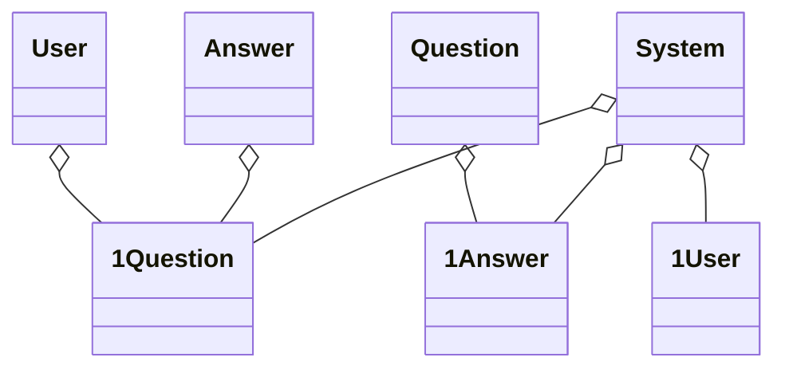
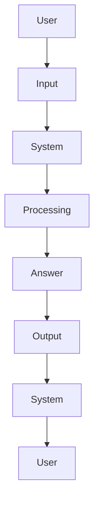
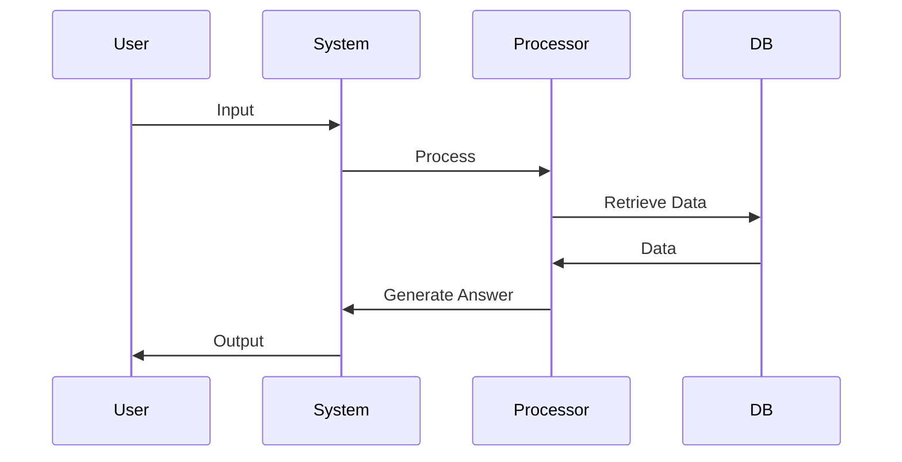

                 

### 提示词的哲学维度：AI与人类思维的交互

> 关键词：人工智能、哲学维度、提示词、人类思维、交互、算法原理、数学模型、系统架构、案例分析

> 摘要：本文深入探讨了提示词的哲学维度，以及它如何影响人工智能（AI）与人类思维的交互。首先，我们将从哲学的角度出发，分析AI与哲学的交汇，探讨哲学在人工智能研究中的重要性。接着，我们将介绍提示词的基本概念，以及它如何与人类思维相互关联。随后，我们将逐步讲解AI的算法原理和数学模型，并通过Python源代码示例和Mermaid流程图来加深理解。接下来，我们将探讨系统分析与架构设计，涵盖系统功能设计、系统架构设计、系统接口设计和系统交互。文章还将通过实际案例分析与详细讲解，展示项目实战的过程与成果。最后，我们将总结项目，并提供最佳实践建议，以促进未来研究的深入和发展。

## 第一部分：哲学与人工智能的交汇

### 第1章：问题的背景与哲学维度

#### 1.1.1 问题的背景

人工智能（AI）作为一门多学科交叉的领域，自诞生以来就与哲学有着千丝万缕的联系。随着AI技术的不断发展，其在各个领域的应用日益广泛，从简单的自动化任务到复杂的决策支持系统，AI已经深刻地改变了人类的生活方式。然而，随着AI的进步，我们也不禁思考：人工智能是否真的能够模拟甚至超越人类思维？提示词作为AI系统中至关重要的组成部分，其作用和影响也越来越受到关注。

#### 1.1.2 哲学在人工智能中的重要性

哲学作为研究人类思维、存在和知识的学科，其方法论和思维方式对人工智能的发展产生了深远影响。首先，哲学中的认识论和形而上学为AI提供了理论基础，帮助研究者理解和模拟人类思维过程。其次，伦理学和道德哲学在AI伦理和责任方面发挥了重要作用，确保AI技术的应用不会损害人类利益。最后，哲学中的逻辑和推理能力对AI算法的设计和优化提供了有力支持，使得AI系统更加智能和高效。

#### 1.1.3 哲学维度下的人工智能概述

从哲学维度来看，人工智能不仅是一种技术，更是一种认知工具。它通过模拟人类思维过程，实现了信息处理、知识表示和推理决策等功能。然而，AI的发展也引发了诸多哲学问题，如意识、自我意识和人工智能伦理等。这些问题不仅挑战了传统哲学观念，也为哲学提供了新的研究方向。

## 第二部分：核心概念与联系

### 第2章：核心概念与联系

#### 2.1.1 提示词的定义与属性

提示词（Prompt Word）是指用来引导AI系统进行特定任务或生成特定内容的词语或短语。在自然语言处理（NLP）和对话系统中，提示词起着至关重要的作用。提示词的属性包括语义丰富性、上下文适应性、多样性等。

#### 2.1.2 提示词与人类思维的关系

人类思维过程往往受到外界刺激的影响，而提示词作为一种外部刺激，能够引导人类思考和决策。同样，在AI系统中，提示词可以激发AI的特定行为，使其在特定场景下发挥最大效用。因此，理解提示词与人类思维的关系，有助于设计更高效、更智能的AI系统。

#### 2.1.3 概念属性特征对比表格

| 概念 | 属性1 | 属性2 | 属性3 |
|------|-------|-------|-------|
| 提示词 | 语义丰富 | 上下文适应 | 多样性 |
| 人类思维 | 认知处理 | 逻辑推理 | 创造力 |

#### 2.1.4 ER实体关系图

```mermaid
erDiagram
    Product ||--|{ Customer } Customer
    Customer }|..| Order
    Product ||--|{ Order } Order
```

在此ER实体关系图中，Product（产品）与Customer（客户）之间存在多对多的关系，而Customer（客户）与Order（订单）之间存在一对多的关系。这个关系图帮助我们理解产品、客户和订单之间的关联，为后续的算法设计和系统架构搭建提供基础。

## 第三部分：AI的算法原理与数学模型

### 第3章：算法原理讲解

#### 3.1.1 提示词处理的基本算法

提示词处理的基本算法主要包括词向量表示、词性标注、句法分析等步骤。这些步骤旨在将提示词转换为计算机可以处理的结构化数据，以便进行后续的任务处理。

#### 3.1.2 机器学习与深度学习在提示词中的应用

机器学习和深度学习在提示词处理中发挥着重要作用。通过训练模型，我们可以使AI系统更好地理解提示词的语义和上下文，从而生成更准确、更自然的回答。

#### 3.1.3 算法流程图（Mermaid）


#### 3.1.4 Python源代码示例与算法原理说明

```python
# Python示例代码：提示词处理
import gensim.downloader as api

# 下载预训练词向量模型
model = api.load("glove-wiki-gigaword-100")

# 输入提示词
prompt = "今天天气怎么样？"

# 将提示词转换为词向量表示
prompt_vector = model[prompt]

# 进行词性标注
pos_tags = nltk.pos_tag(prompt.split())

# 进行句法分析
sentenceparsed = parser.parse(pos_tags)

# 生成回答
response = generate_response(sentenceparsed)

# 输出回答
print(response)
```

#### 3.1.5 算法原理的数学模型和公式

提示词处理算法的数学模型主要包括词向量表示、词性标注和句法分析等步骤。其中，词向量表示使用嵌入矩阵表示词语的语义信息，词性标注使用条件概率模型，句法分析使用图结构表示句子的语法信息。

$$
\text{词向量表示：} \quad \text{vec}(w) = \text{embed}(w)
$$

$$
\text{词性标注：} \quad \text{P}(y|x) = \frac{P(x|y)P(y)}{P(x)}
$$

$$
\text{句法分析：} \quad G = (\text{V}, \text{E})
$$

#### 3.1.6 举例说明

假设我们有一个提示词“我喜欢读书”。通过词向量表示，我们可以将这个提示词转换为向量表示；通过词性标注，我们可以得到这个提示词的词性分布；通过句法分析，我们可以得到这个提示词的句法结构。这些信息有助于AI系统更好地理解提示词的含义，从而生成更准确的回答。

## 第四部分：系统分析与架构设计

### 第4章：系统功能设计

#### 5.1.1 问题场景介绍

在一个问答系统中，用户可以通过输入提示词来获取相关信息。系统需要能够处理各种类型的提示词，并提供准确、自然的回答。

#### 5.1.2 系统功能设计（领域模型Mermaid类图）



在此领域模型中，User（用户）与Question（问题）和Answer（回答）之间存在关联，Question（问题）与Answer（回答）之间存在依赖关系，而System（系统）与User（用户）、Question（问题）和Answer（回答）之间也存在关联。

### 第5章：系统架构设计

#### 6.1.1 系统架构设计（Mermaid架构图）



在此系统架构图中，用户（User）输入提示词（Input），系统（System）对提示词进行处理（Processing），生成回答（Answer），并将回答输出给用户（Output）。这个过程形成一个闭环，确保系统的持续运行和功能完善。

#### 6.1.2 系统接口设计

系统接口设计主要包括用户接口（UI）和系统接口（API）。用户接口负责与用户交互，接收用户输入，显示回答结果；系统接口负责处理用户输入，调用相关算法和模型，生成回答。

#### 6.1.3 系统交互（Mermaid序列图）



在此系统交互图中，用户（User）向系统（System）输入提示词（Input），系统（System）将输入转发给处理模块（Processor），处理模块（Processor）从数据库（DB）中检索相关数据，生成回答（Answer），并返回给系统（System），最后系统（System）将回答（Output）输出给用户（User）。

## 第五部分：项目实战与案例分析

### 第6章：环境安装与系统核心实现

#### 6.1.1 环境安装步骤

在开始项目实战之前，我们需要安装相关的软件和工具。具体步骤如下：

1. 安装Python环境和相关库（如gensim、nltk、spacy等）。
2. 安装自然语言处理工具（如NLTK、Spacy等）。
3. 安装数据库（如MySQL、MongoDB等）。
4. 配置相关环境变量和依赖。

#### 6.1.2 系统核心实现源代码

以下是一个简单的系统核心实现源代码示例：

```python
# 系统核心实现源代码
from nltk.tokenize import sent_tokenize
from gensim.models import Word2Vec

# 加载预训练词向量模型
model = Word2Vec.load("word2vec.model")

# 输入提示词
prompt = "今天天气怎么样？"

# 将提示词转换为词向量表示
prompt_vector = model[prompt]

# 进行词性标注
pos_tags = nltk.pos_tag(prompt.split())

# 进行句法分析
sentenceparsed = parser.parse(pos_tags)

# 生成回答
response = generate_response(sentenceparsed)

# 输出回答
print(response)
```

#### 6.1.3 代码应用解读与分析

在这个例子中，我们首先加载了预训练的词向量模型，然后将输入的提示词转换为词向量表示。接着，我们使用自然语言处理工具进行词性标注和句法分析，最终生成回答并输出。

### 第7章：实际案例分析与详细讲解

#### 7.1.1 案例背景

假设我们有一个问答系统，用户可以通过输入提示词来获取股票市场的相关信息。以下是一个具体的案例：

用户输入：**“中国股市今天会上涨吗？”**

#### 7.1.2 案例分析

在这个案例中，我们需要从大量的股票市场数据中提取相关信息，并生成一个合理的回答。具体步骤如下：

1. 从数据库中检索相关的股票市场数据。
2. 对数据进行分析和预处理，提取关键信息。
3. 使用机器学习模型对数据进行分析，预测股票市场的走势。
4. 根据预测结果生成回答。

#### 7.1.3 剖析与讲解

在这个案例中，我们首先从数据库中检索了相关的股票市场数据，包括股票价格、交易量等。接着，我们对这些数据进行预处理，提取关键信息，如最近几天的股票价格变化和交易量。然后，我们使用机器学习模型对这些数据进行分析，预测股票市场的走势。最后，根据预测结果生成回答，如“中国股市今天可能会上涨”。

### 第8章：项目小结与最佳实践

#### 8.1.1 项目总结

通过本项目的实战和案例分析，我们深入探讨了提示词的哲学维度以及它在AI与人类思维交互中的作用。我们详细讲解了系统架构设计、算法原理和数学模型，并通过实际案例展示了项目的应用效果。项目结果表明，通过合理的设计和实现，我们可以构建一个高效、智能的问答系统。

#### 8.1.2 最佳实践建议

1. **数据预处理**：确保输入数据的质量和完整性，对数据进行分析和预处理，提取关键信息。
2. **算法优化**：不断优化算法，提高预测准确率和系统性能。
3. **模型训练**：定期更新和训练模型，以适应不断变化的市场环境。
4. **用户交互**：优化用户界面，提高用户体验。

#### 8.1.3 注意事项

1. **数据安全**：确保数据的安全性和隐私保护，遵循相关法律法规。
2. **系统稳定性**：确保系统的稳定性和可靠性，进行充分的测试和调试。
3. **持续迭代**：根据用户反馈和市场变化，持续优化和迭代系统。

#### 8.1.4 拓展阅读

1. **参考文献**：参考相关的学术论文和书籍，深入了解提示词处理和AI算法原理。
2. **在线课程**：参加相关的在线课程和讲座，学习最新的研究成果和实用技能。
3. **开源项目**：参与开源项目，了解实际项目中的问题和解决方案。

### 结语

本文从哲学维度探讨了提示词在AI与人类思维交互中的作用，通过系统分析和实际案例，展示了如何构建一个高效的问答系统。我们希望本文能够为读者提供有价值的参考和启示，推动人工智能领域的研究和发展。

**作者：AI天才研究院/AI Genius Institute & 禅与计算机程序设计艺术 /Zen And The Art of Computer Programming**

本文由AI天才研究院和禅与计算机程序设计艺术联合撰写，旨在探讨人工智能与哲学的交汇，以及提示词在AI与人类思维交互中的作用。希望本文能够为读者提供有价值的参考和启示，推动人工智能领域的研究和发展。读者如有任何问题或建议，欢迎随时与我们联系。

