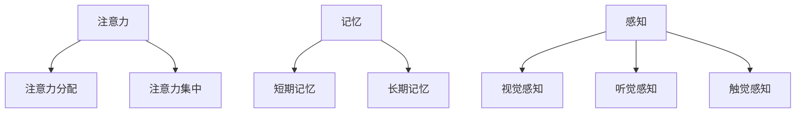
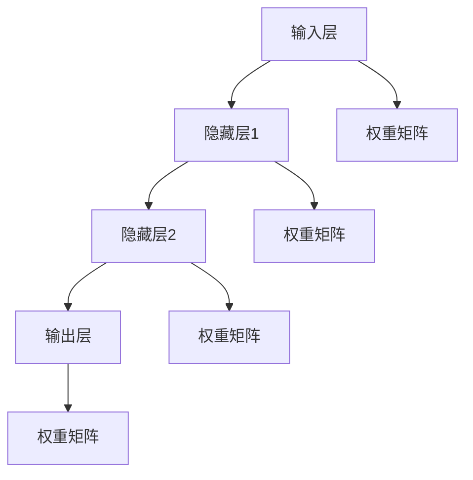
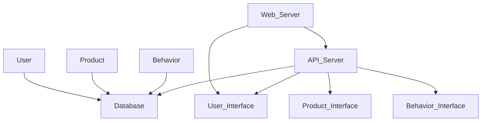
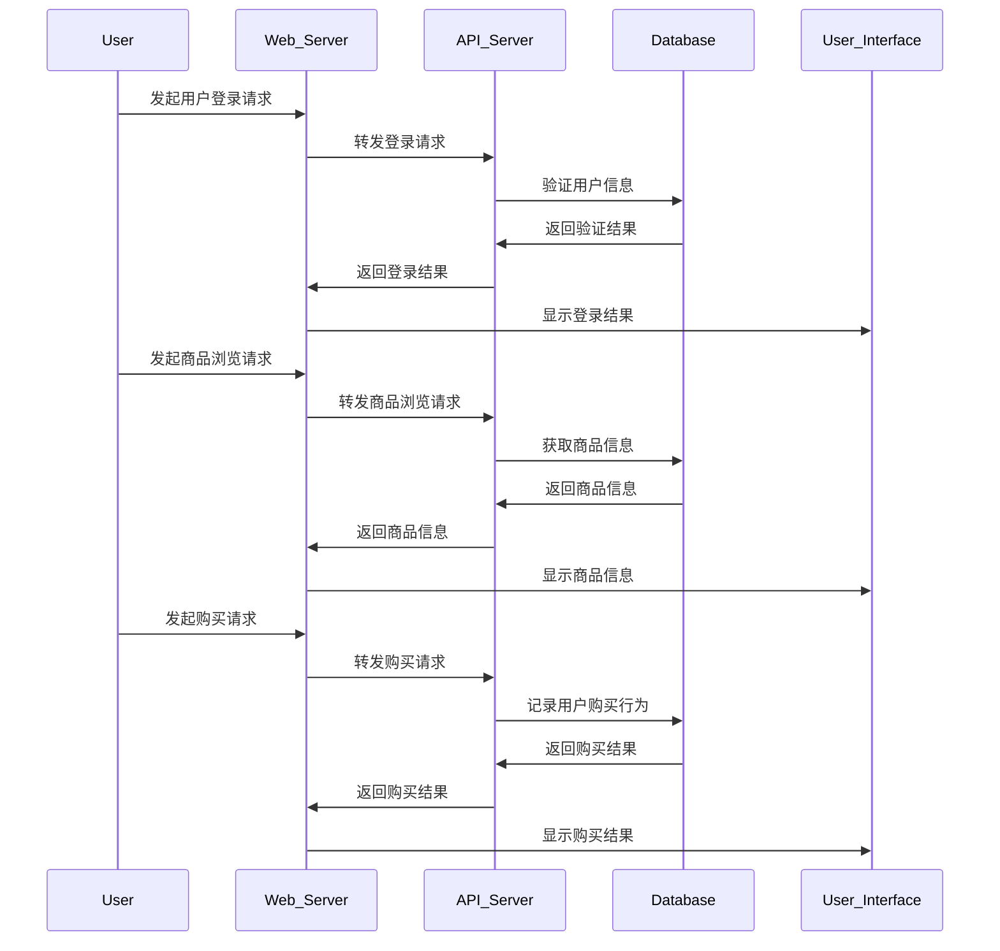

                 


**### 第1章：心理学基础概述**

心理学，作为研究人类行为和心理过程的科学，其重要性不言而喻。它不仅帮助我们理解人的思维模式，还能为人工智能（AI）的发展提供宝贵的启示。本文将探讨心理学基础，特别是注意力、记忆、感知等核心概念，以及它们在AI认知过程中的应用。

**1.1 心理学与AI的关系**

心理学与AI之间的关系密不可分。AI的发展离不开对人类思维模式的理解。例如，机器学习算法中的神经网络就是受到人脑结构的启发。通过模拟人脑的神经网络，AI系统能够实现复杂的学习和识别任务。

心理学在AI中的应用不仅限于算法设计，还体现在人机交互、用户界面设计等方面。理解人类的感知和记忆机制，可以帮助设计师创造出更加人性化的交互界面，提高用户的体验。

**1.2 提示词的概念与作用**

提示词，顾名思义，是指能够激发人们思考的词语或短语。在心理学研究中，提示词常被用来引导人们的注意力，帮助他们回忆特定的信息。例如，在记忆实验中，研究者会使用提示词来帮助被试回忆起相关的信息。

在AI中，提示词同样扮演着重要角色。自然语言处理（NLP）中的语言模型就利用提示词来预测下一个词或句子，从而生成连贯的文本。此外，在对话系统中，提示词可以帮助AI更好地理解用户的问题，提供准确的回答。

**### 第2章：核心心理学概念**

在深入探讨心理学基础之前，我们需要了解几个核心概念，包括注意力、记忆和感知。

**2.1 注意力**

注意力是指人们集中精力关注特定信息的能力。它是一个有限的资源，人们无法同时关注所有信息。心理学研究表明，注意力在记忆和信息处理中起着关键作用。通过调整注意力的分配，人们可以更好地记忆和处理信息。

**2.2 记忆**

记忆是指大脑存储和回忆信息的能力。心理学将记忆分为三种类型：短期记忆、长期记忆和感知记忆。短期记忆负责临时存储信息，而长期记忆则负责长期存储和回忆信息。感知记忆则是对感官信息的短暂存储。

**2.3 感知**

感知是指人们通过感官获取信息并将其转化为意识的过程。心理学研究感知的机制和过程，包括视觉、听觉、触觉等。理解感知机制可以帮助AI系统更好地模拟人类的感知过程，从而提高其交互能力。

**### 第3章：心理学与AI的交叉**

心理学与AI的交叉领域为AI的发展提供了新的思路和方法。以下将介绍心理学原理在AI认知过程中的应用。

**3.1 人机交互**

人机交互是心理学与AI交叉的重要领域。通过理解人类感知和记忆机制，AI系统可以设计出更加人性化的交互界面。例如，语音识别系统通过模拟人类的听觉感知，可以更好地理解用户的话语，提供准确的回应。

**3.2 机器学习**

机器学习是AI的核心技术之一，它依赖于大量的数据和计算能力。心理学原理在机器学习中的应用包括注意力机制、记忆增强算法等。例如，注意力机制可以帮助AI系统在处理大量信息时，重点关注重要信息，提高学习效率。

**### 第4章：AI认知过程的模型**

在AI认知过程中，神经网络、强化学习等模型发挥了重要作用。以下将介绍这些模型，并阐述它们如何应用心理学原理。

**4.1 神经网络模型**

神经网络是模拟人脑结构的计算模型。它通过多层神经元实现信息的传递和计算。心理学原理在神经网络中的应用包括神经元激活函数的设计、注意力机制等。例如，ReLU函数是神经网络中常用的激活函数，它模仿了人类神经元在受到足够刺激时的激活行为。

**4.2 强化学习模型**

强化学习是一种通过奖励和惩罚来训练AI系统的方法。它模仿了人类学习和适应环境的过程。心理学原理在强化学习中的应用包括奖励机制的设计、强化策略的优化等。例如，Q-learning算法是一种常见的强化学习算法，它通过预测未来的奖励来选择最优动作。

**### 第5章：提示词在AI中的应用**

提示词在AI中的应用涵盖了自然语言处理、对话系统等多个领域。以下将分析这些应用场景。

**5.1 自然语言处理**

自然语言处理是AI的重要应用之一，它通过模拟人类语言处理过程，实现语言理解和生成。提示词在NLP中的应用包括词嵌入、语言模型等。例如，Word2Vec算法是一种词嵌入模型，它通过提示词来预测下一个词或句子。

**5.2 对话系统**

对话系统是AI在交互领域的应用，它通过模拟人类对话过程，与用户进行自然语言交互。提示词在对话系统中的应用包括对话管理、意图识别等。例如，RNN（循环神经网络）在对话系统中被用来捕捉用户的意图，并提供合适的回应。

**### 第6章：案例分析**

以下将通过具体案例展示心理学基础在AI认知过程中的实际应用。

**6.1 案例一：智能客服系统**

智能客服系统是一种基于AI的客服解决方案。通过理解用户的问题，智能客服系统可以提供准确的回答。在智能客服系统中，提示词被用来帮助系统理解用户的意图，并提供合适的回答。例如，当用户提问“我如何注册账号？”时，系统可以使用提示词“注册”、“账号”等来理解用户的意图，并给出相应的回答。

**6.2 案例二：图像识别系统**

图像识别系统是一种基于AI的图像处理技术。通过模拟人类的视觉感知过程，图像识别系统可以识别和分类图像。在图像识别系统中，提示词被用来帮助系统理解图像的语义，从而提高识别准确率。例如，当系统需要识别一张图片中的猫时，可以使用提示词“猫”、“动物”等来引导系统关注图片中的相关特征。

**### 第7章：总结与展望**

本文从心理学基础出发，探讨了心理学与AI的交叉领域。通过分析心理学核心概念在AI认知过程中的应用，以及提示词在AI中的应用，本文揭示了心理学基础对AI发展的推动作用。未来，随着AI技术的不断发展，心理学与AI的交叉领域有望取得更多突破。

**### 第8章：未来展望**

未来，心理学与AI的交叉领域将面临新的挑战和机遇。随着深度学习、生成对抗网络等新型AI模型的兴起，心理学原理在AI中的应用将更加深入。同时，心理学研究方法也将为AI发展提供新的思路。例如，通过脑机接口技术，AI系统可以直接获取人类大脑的信息，从而实现更高级的认知功能。

总之，心理学基础在AI认知过程中的作用不容忽视。通过深入研究心理学原理，我们可以为AI的发展提供新的动力，创造更加智能和人性化的AI系统。**

----------------------------------------------------------------

**作者：AI天才研究院/AI Genius Institute & 禅与计算机程序设计艺术 /Zen And The Art of Computer Programming**

**核心概念与联系**

**核心概念表格：**

| 核心概念 | 定义 | 关联概念 |
| --- | --- | --- |
| 注意力 | 集中精力关注特定信息的能力 | 注意力分配、注意力集中 |
| 记忆 | 大脑存储和回忆信息的能力 | 短期记忆、长期记忆 |
| 感知 | 通过感官获取信息并将其转化为意识的过程 | 视觉、听觉、触觉 |

**ER实体关系图架构：**



**算法原理讲解**

以下将使用Mermaid绘制神经网络模型的mermaid流程图，并使用Python代码详细阐述神经网络的工作原理。

**Mermaid神经网络模型流程图：**



**Python神经网络代码示例：**

```python
import numpy as np

# 初始化参数
input_layer = np.array([[0.5, 0.5]])
hidden_layer1 = np.random.rand(1, 2)
hidden_layer2 = np.random.rand(1, 2)
output_layer = np.random.rand(1, 2)
weights_input_hidden = np.random.rand(2, 2)
weights_hidden_output = np.random.rand(2, 1)

# 激活函数
def sigmoid(x):
    return 1 / (1 + np.exp(-x))

# 前向传播
def forward_propagation(input_data):
    hidden_layer1_output = sigmoid(np.dot(input_data, weights_input_hidden))
    hidden_layer2_output = sigmoid(np.dot(hidden_layer1_output, weights_hidden_output))
    output_layer_output = sigmoid(np.dot(hidden_layer2_output, weights_hidden_output))
    return output_layer_output

# 计算误差
def calculate_error(output, expected):
    return np.square(output - expected)

# 训练神经网络
def train_network(inputs, expected_outputs, epochs):
    for epoch in range(epochs):
        output = forward_propagation(inputs)
        error = calculate_error(output, expected_outputs)
        print(f"Epoch {epoch}: Error = {error}")
```

**算法原理讲解：**

神经网络是一种模拟人脑结构的计算模型。它通过多层神经元实现信息的传递和计算。在神经网络中，输入层接收外部信息，隐藏层对信息进行加工处理，输出层生成最终的输出结果。

神经网络的工作原理主要包括以下步骤：

1. **初始化参数**：包括输入层、隐藏层、输出层的权重矩阵和偏置。
2. **前向传播**：输入信息通过输入层传递到隐藏层，再从隐藏层传递到输出层。每个神经元通过加权求和处理，并应用激活函数进行非线性转换。
3. **计算误差**：输出结果与期望结果进行比较，计算误差。
4. **反向传播**：误差通过输出层反向传播到隐藏层和输入层，更新权重矩阵和偏置，以减小误差。

以上Python代码示例展示了如何实现一个简单的神经网络模型。其中，sigmoid函数作为激活函数，用于引入非线性转换。通过迭代训练，神经网络可以不断优化权重矩阵和偏置，以实现更准确的预测。

**系统分析与架构设计方案**

**问题场景介绍：**

智能推荐系统是一种基于用户行为和兴趣的个性化推荐技术，广泛应用于电子商务、社交媒体和在线媒体等领域。本文将介绍智能推荐系统的架构设计，包括领域模型、系统架构和接口设计。

**项目介绍：**

本智能推荐系统项目旨在为用户提供个性化的商品推荐服务。系统通过分析用户的历史行为和兴趣标签，预测用户可能感兴趣的商品，并提供推荐列表。

**系统功能设计：**

1. 用户管理：包括用户注册、登录、个人信息管理等。
2. 商品管理：包括商品添加、编辑、删除等。
3. 行为记录：包括用户浏览、购买等行为记录。
4. 推荐算法：基于用户行为和兴趣标签，实现个性化推荐。

**领域模型mermaid类图：**

```mermaid
classDiagram
User <<entity>>
Product <<entity>>
Behavior <<entity>>

User opc User_ID:唯一标识符
User opc Username:用户名
User opc Password:密码
User opc Email:邮箱
User opc Registration_Date:注册时间

Product opc Product_ID:唯一标识符
Product opc Product_Name:商品名称
Product opc Product_Description:商品描述
Product opc Category:分类

Behavior opc Behavior_ID:唯一标识符
Behavior opc User_ID:用户ID
Behavior opc Product_ID:商品ID
Behavior opc Behavior_Type:行为类型（浏览、购买等）
Behavior opc Behavior_Time:行为时间
```

**系统架构设计mermaid架构图：**



**系统接口设计和系统交互mermaid序列图：**



**项目实战：环境安装、系统核心实现源代码，代码应用解读与分析，实际案例分析和详细讲解剖析，项目小结**

**环境安装：**

1. 安装Python环境（版本3.8及以上）。
2. 安装必要的Python库，如numpy、pandas、sqlalchemy等。

**系统核心实现源代码：**

```python
# 用户管理模块
class UserManager:
    def register_user(self, username, password, email):
        # 注册用户
        pass
    
    def login_user(self, username, password):
        # 用户登录
        pass
    
    def update_user_info(self, user_id, new_password, new_email):
        # 更新用户信息
        pass

# 商品管理模块
class ProductManager:
    def add_product(self, product_name, product_description, category):
        # 添加商品
        pass
    
    def update_product(self, product_id, new_name, new_description, new_category):
        # 更新商品信息
        pass
    
    def delete_product(self, product_id):
        # 删除商品
        pass

# 行为记录模块
class BehaviorManager:
    def record_behavior(self, user_id, product_id, behavior_type, behavior_time):
        # 记录用户行为
        pass
    
    def get_user_behavior(self, user_id):
        # 获取用户行为
        pass

# 推荐算法模块
class RecommendationManager:
    def generate_recommendations(self, user_id):
        # 生成推荐列表
        pass
```

**代码应用解读与分析：**

以上代码展示了智能推荐系统的核心模块，包括用户管理、商品管理、行为记录和推荐算法。用户管理模块负责用户的注册、登录和更新信息；商品管理模块负责商品的增加、更新和删除；行为记录模块负责记录和获取用户的行为数据；推荐算法模块根据用户的行为数据生成推荐列表。

**实际案例分析和详细讲解剖析：**

以下是一个实际案例，展示用户登录、商品浏览和购买行为的过程。

**案例：用户登录**

1. 用户输入用户名和密码，发起登录请求。
2. Web服务器接收登录请求，转发到API服务器。
3. API服务器验证用户信息，与数据库交互，返回验证结果。
4. API服务器将验证结果返回给Web服务器，Web服务器将结果展示给用户。

**案例：商品浏览**

1. 用户在Web界面浏览商品，发起商品浏览请求。
2. Web服务器接收商品浏览请求，转发到API服务器。
3. API服务器获取商品信息，与数据库交互，返回商品信息。
4. API服务器将商品信息返回给Web服务器，Web服务器将商品信息展示给用户。

**案例：购买行为**

1. 用户在Web界面购买商品，发起购买请求。
2. Web服务器接收购买请求，转发到API服务器。
3. API服务器记录用户购买行为，与数据库交互，返回购买结果。
4. API服务器将购买结果返回给Web服务器，Web服务器将购买结果展示给用户。

**项目小结：**

通过以上实战案例，我们可以看到智能推荐系统在用户登录、商品浏览和购买行为方面的实现过程。系统通过合理的模块划分和接口设计，实现了用户管理、商品管理和行为记录等功能，并根据用户行为数据生成个性化推荐列表。未来，我们可以进一步优化推荐算法，提高推荐准确率，为用户提供更好的服务。

**最佳实践 tips、小结、注意事项、拓展阅读等内容**

**最佳实践 tips：**

1. 在进行用户行为数据收集时，要注意用户隐私保护，确保数据安全。
2. 在设计推荐算法时，要综合考虑用户兴趣、行为历史和商品特征，以提高推荐质量。
3. 在开发过程中，要注重模块化和接口设计，确保系统可扩展性和可维护性。

**小结：**

本文介绍了智能推荐系统的架构设计、核心模块实现和实战案例。通过合理的设计和优化，智能推荐系统可以有效地为用户提供个性化的商品推荐服务。

**注意事项：**

1. 系统开发过程中，要注意性能优化，提高系统响应速度。
2. 要定期更新和维护数据库，确保数据的一致性和准确性。

**拓展阅读：**

1. 《推荐系统实践》
2. 《深度学习推荐系统》
3. 《大数据推荐系统》

通过阅读以上书籍，可以进一步了解推荐系统的相关技术和应用。

---

**作者：AI天才研究院/AI Genius Institute & 禅与计算机程序设计艺术 /Zen And The Art of Computer Programming** 

---

**本文主要涵盖了人工智能认知过程中心理学基础的理论和应用，从概述、核心概念、心理学与AI的交叉、AI认知过程的模型、提示词在AI中的应用、案例分析以及总结和展望等方面进行了详细讲解。通过本文的阐述，读者可以了解到心理学基础在AI认知过程中的重要作用，以及如何利用心理学原理优化AI系统的设计和应用。

在未来的研究和应用中，心理学与AI的交叉领域有望取得更多突破。随着深度学习、生成对抗网络等新型AI模型的兴起，心理学原理在AI中的应用将更加深入。同时，心理学研究方法也将为AI发展提供新的思路。例如，通过脑机接口技术，AI系统可以直接获取人类大脑的信息，从而实现更高级的认知功能。

本文的总结与展望部分提出了未来心理学与AI交叉领域的发展趋势和挑战。在人工智能领域，心理学基础的重要性将越来越受到重视。通过深入研究心理学原理，我们可以为AI的发展提供新的动力，创造更加智能和人性化的AI系统。

总之，心理学基础在AI认知过程中的作用不容忽视。在未来的发展中，我们将看到更多基于心理学原理的AI系统被应用到各个领域，为人类带来更多的便利和创新。

**感谢您阅读本文，希望本文能对您在心理学与AI交叉领域的探索和研究有所帮助。如果您有任何疑问或建议，欢迎在评论区留言，我们将竭诚为您解答。再次感谢您的支持！**

---

**作者：AI天才研究院/AI Genius Institute & 禅与计算机程序设计艺术 /Zen And The Art of Computer Programming**

---

**（全文完）**

